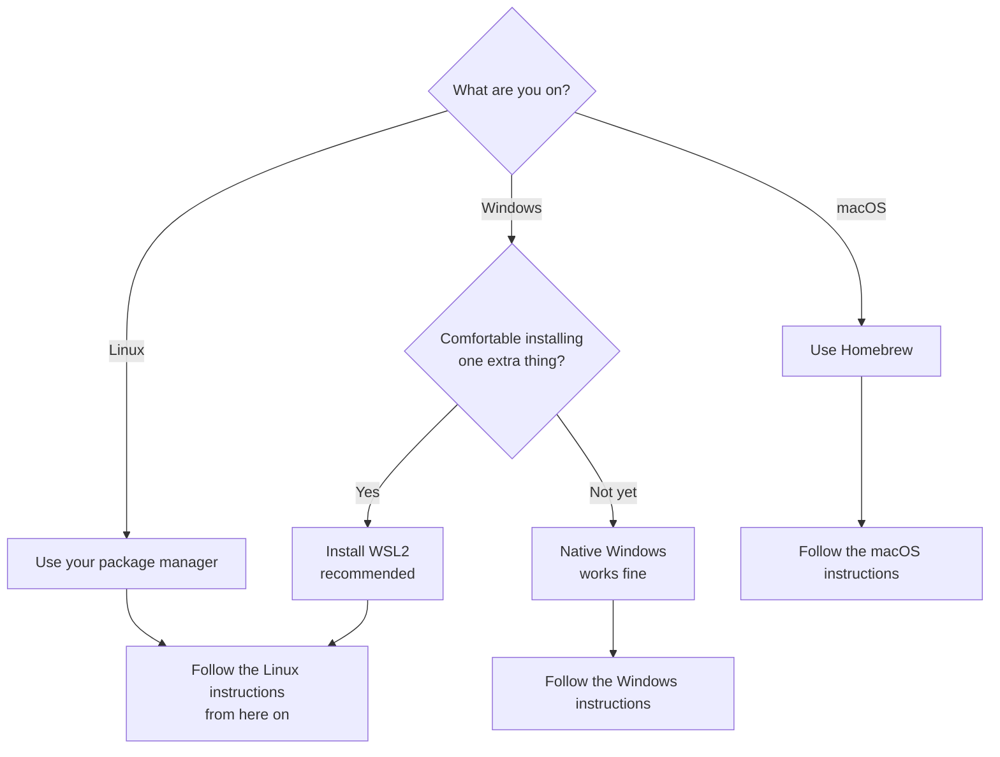
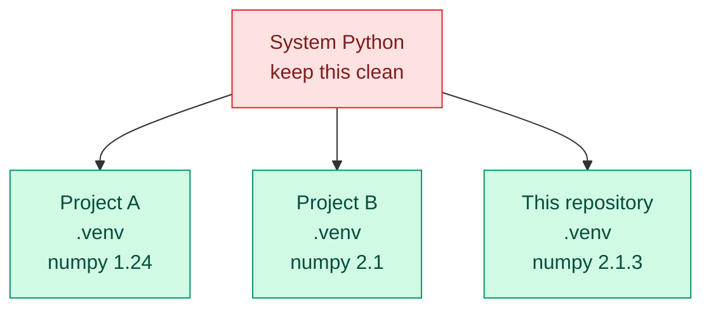
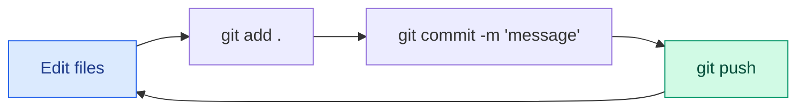

<!-- status: authored -->

# 00. Getting Started

**Level:** 🟢 Beginner &nbsp;|&nbsp; **Effort:** Short module &nbsp;|&nbsp; **Status:** ✅ Complete

Everything you need installed and working before you write a single line of machine-learning code.
No prior programming, no prior terminal experience, no prior anything.

---

## 🎯 Learning Objectives

By the end of this module you will be able to:

- Open a terminal on your operating system and navigate your files with it
- Install Python and confirm which Python you are actually running
- **Explain what a virtual environment is and why it prevents most beginner package problems**
- Create, activate, deactivate and delete a virtual environment
- Install packages with pip and record them so someone else can reproduce your setup
- Run a Jupyter notebook locally and on Google Colab
- Use Git and GitHub to save and share your work
- Run a container with Docker and say what a container actually is
- Diagnose the four errors that stop most beginners

## 📚 Prerequisites

A computer running Windows, macOS or Linux, an internet connection, and roughly 5 GB of free disk
space. That is all.

---

## 📑 Contents

1. [Choose your setup path](#1-choose-your-setup-path)
2. [The terminal](#2-the-terminal)
3. [Installing Python](#3-installing-python)
4. [Virtual environments — the most important concept here](#4-virtual-environments--the-most-important-concept-here)
5. [pip and installing packages](#5-pip-and-installing-packages)
6. [Conda — the alternative](#6-conda--the-alternative)
7. [Git and GitHub](#7-git-and-github)
8. [Visual Studio Code](#8-visual-studio-code)
9. [Jupyter Notebook and JupyterLab](#9-jupyter-notebook-and-jupyterlab)
10. [Google Colab](#10-google-colab)
11. [Docker](#11-docker)
12. [Set up this repository](#12-set-up-this-repository)
13. [🔧 Troubleshooting](#-troubleshooting)
14. [🧪 Hands-on lab](#-hands-on-lab)
15. [📝 Quiz](#-quiz)
16. [✅ Key takeaways](#-key-takeaways)

---

## 1. Choose your setup path



**Windows users — why WSL2?** Windows Subsystem for Linux (WSL2) runs a real Linux environment
inside Windows. Almost all AI tooling is written and tested on Linux first, so WSL2 means fewer
mysterious errors later, especially once you reach Docker. It is not required for modules 00–14.

Install it by opening **PowerShell as Administrator** and running:

```powershell
wsl --install
```

Restart when prompted. You now have Ubuntu; open it from the Start menu and follow the **Linux**
instructions everywhere in this repository.

---

## 2. The terminal

### 🍰 Simple explanation

The terminal is a text conversation with your computer. Instead of clicking a folder icon, you
type its name. It looks intimidating and is actually simpler than the graphical interface —
there are no hidden menus, just commands that do exactly what they say.

### 🏠 Real-life analogy

A graphical interface is a restaurant with picture menus: you point at what you want. A terminal
is telling the chef directly. Slower to learn, far faster once you know the vocabulary, and the
only way to ask for something the pictures do not cover.

### Opening it

| System | How |
| --- | --- |
| **Windows** | Start menu → "PowerShell" → Windows PowerShell |
| **Windows (WSL2)** | Start menu → "Ubuntu" |
| **macOS** | `Cmd + Space` → "Terminal" |
| **Linux** | `Ctrl + Alt + T` |

### The eight commands you actually need

| Task | macOS / Linux / WSL | Windows PowerShell |
| --- | --- | --- |
| Where am I? | `pwd` | `pwd` |
| What is in here? | `ls` | `ls` |
| Go into a folder | `cd foldername` | `cd foldername` |
| Go up one level | `cd ..` | `cd ..` |
| Go to your home folder | `cd ~` | `cd ~` |
| Make a folder | `mkdir name` | `mkdir name` |
| Show a file's contents | `cat file.txt` | `cat file.txt` |
| Clear the screen | `clear` | `cls` |

Two habits worth forming immediately:

- **Press `Tab` to autocomplete.** Type `cd Doc` then `Tab` and the shell finishes `Documents/`.
  This prevents most typos.
- **Press `↑` for the previous command.** You will retype the same commands constantly.

⚠️ **Common mistake:** spaces in folder names break commands. `cd My Documents` looks for a folder
called `My`. Quote it: `cd "My Documents"`.

---

## 3. Installing Python

### 🍰 Simple explanation

Python is the language you will write in. It is popular in AI for one boring, decisive reason:
almost every AI library is written for it, so you get decades of other people's work for free.

**We need Python 3.10 or newer.** Older versions will fail on syntax used throughout this repository.

### Windows

Download from [python.org/downloads](https://www.python.org/downloads/).

⚠️ **On the first installer screen, tick "Add python.exe to PATH".** If you miss it, Windows will
not find Python and you will get `python: command not found` forever. Re-run the installer if you
missed it.

Verify:
```powershell
py --version
```

### macOS

macOS ships an old Python that you should not use for projects. Install [Homebrew](https://brew.sh/)
first, then:

```bash
brew install python@3.11
python3 --version
```

### Linux / WSL2 (Ubuntu or Debian)

```bash
sudo apt update
sudo apt install python3 python3-pip python3-venv -y
python3 --version
```

The `python3-venv` package is separate on Debian-based systems and is genuinely required — leaving
it out produces a confusing error the first time you create a virtual environment.

### Expected output

```
Python 3.11.9
```

Any version 3.10 or higher is fine.

### ⚠️ `python` vs `python3` vs `py`

This confuses nearly everyone:

| System | Use |
| --- | --- |
| Windows | `py` (or `python`) |
| macOS | `python3` — plain `python` may be missing or ancient |
| Linux | `python3` |

**Inside an activated virtual environment, plain `python` works everywhere.** That is one of several
reasons to always use one.

---

## 4. Virtual environments — the most important concept here

If you read one section of this module carefully, make it this one. Most "it worked yesterday"
problems in Python trace back to not understanding this.

### 🏠 Real-life analogy

Imagine one shared kitchen for every restaurant in a city. Project A needs the 2019 recipe book,
project B needs the 2024 edition. There is one shelf. Installing B's book removes A's, and A stops
working — even though you never touched A.

A virtual environment gives each project its **own private kitchen**: its own Python, its own
packages, its own versions. Nothing you install for one project can break another.

### ⚙️ How it works



A virtual environment is, unglamorously, just a folder. It contains a copy of the Python
interpreter and a `site-packages` directory. "Activating" it puts that folder first on your PATH,
so `python` and `pip` resolve to the private copies instead of the system ones.

### 💻 Creating one

```bash
# macOS / Linux / WSL
python3 -m venv .venv

# Windows PowerShell
py -m venv .venv
```

This creates a `.venv/` folder. The name `.venv` is convention; the leading dot hides it, and it is
already in this repository's `.gitignore` — **never commit a virtual environment.**

### Activating it

| System | Command |
| --- | --- |
| macOS / Linux / WSL | `source .venv/bin/activate` |
| Windows PowerShell | `.\.venv\Scripts\Activate.ps1` |
| Windows Command Prompt | `.venv\Scripts\activate.bat` |

**You will know it worked** because your prompt changes:

```
(.venv) user@computer:~/ai-ml-mastery$
```

That `(.venv)` prefix is your single most useful debugging signal. No prefix means no environment,
which means your packages are somewhere else.

### Deactivating and deleting

```bash
deactivate           # leave the environment

rm -rf .venv         # delete it entirely (macOS/Linux/WSL)
Remove-Item -Recurse -Force .venv   # Windows PowerShell
```

Deleting is safe and often the fastest fix. Recreate it and reinstall — you lose nothing, because
your dependency list lives in `requirements.txt`, not in the folder.

### ⚠️ Windows: "running scripts is disabled on this system"

PowerShell blocks scripts by default. Fix it once, for your user only:

```powershell
Set-ExecutionPolicy -ExecutionPolicy RemoteSigned -Scope CurrentUser
```

This permits locally-created scripts and signed remote ones. It does not disable protection wholesale.

### ✅ The rule

**One project, one virtual environment. Activate it before you install anything or run anything.**

---

## 5. pip and installing packages

`pip` is Python's package installer — it downloads libraries from the Python Package Index (PyPI).

```bash
# Always activate your environment first, then:
pip install numpy

pip install numpy==2.1.3          # a specific version
pip install -r requirements.txt   # everything a project needs
pip list                          # what is installed here
pip show numpy                    # details, including WHERE it is installed
pip uninstall numpy
```

### Recording your dependencies

```bash
pip freeze > requirements.txt
```

This writes every installed package with its exact version, so anyone — including future you on a
new laptop — can recreate the environment precisely:

```bash
pip install -r requirements.txt
```

### 💰 Cost note

pip installs are free, but disk is not. PyTorch with CUDA support is several gigabytes. This is
another reason for per-project environments: you can delete the ones you are not using.

### 🔐 Security note

`pip install` runs code from the internet on your machine. Two habits:

1. **Check the package name.** Typo-squatting is real — a package named `numpny` may not be friendly.
2. **Pin versions in shared projects.** `numpy==2.1.3` is reproducible; `numpy` is whatever ships
   the day someone installs it.

Never run `pip install` with `sudo`. If you feel you need to, you are outside a virtual environment.

---

## 6. Conda — the alternative

Conda is a different environment and package manager, common in data science. It can install
non-Python dependencies (compilers, CUDA libraries), which occasionally makes it the easier path.

**This repository teaches `venv` first** because it ships with Python — one fewer thing to install
before you have learned anything. Use Conda if you already know it, or if pip keeps failing to
build scientific packages on Windows.

```bash
# Install Miniconda from https://docs.conda.io/projects/miniconda/

conda create -n ai-ml-mastery python=3.11
conda activate ai-ml-mastery
conda install numpy pandas scikit-learn
conda deactivate

conda env list                    # list environments
conda env remove -n ai-ml-mastery # delete one
```

Or use this repository's file directly:

```bash
conda env create -f environment.yml
conda activate ai-ml-mastery
```

⚠️ **Do not mix pip and conda carelessly** in one environment. If you must, install everything
available via conda first, then pip for the rest. Mixing in the other order regularly produces
broken environments.

---

## 7. Git and GitHub

### 🍰 Simple explanation

**Git** is an unlimited undo button for your project, which also records why each change happened.
**GitHub** is a website that stores Git projects online so you can share them and not lose them
when your laptop dies.

They are different things: Git runs on your machine, GitHub is a hosting service. You can use Git
without GitHub.

### Installing

| System | Command |
| --- | --- |
| Windows | Download from [git-scm.com](https://git-scm.com/downloads) |
| macOS | `brew install git` |
| Linux / WSL | `sudo apt install git -y` |

```bash
git --version
```

### One-time configuration

```bash
git config --global user.name "Your Name"
git config --global user.email "your.email@example.com"
git config --global init.defaultBranch main
```

The name and email are stamped into every commit you make, and they are **public** on any repository
you push. If that matters to you, GitHub can supply a no-reply email address in your account settings.

### The daily loop



```bash
git status                        # what changed - run this constantly
git add .                         # stage everything
git commit -m "Add churn model"   # save a snapshot with a message
git push                          # send it to GitHub
git log --oneline                 # your history
git clone <url>                   # copy a repository to your machine
```

### 🔐 Security note — the one Git mistake that really hurts

**Never commit secrets.** API keys, passwords, tokens, cloud credentials. Bots scan public GitHub
repositories for leaked keys within seconds of a push.

Deleting the file in a later commit does **not** help — Git remembers everything. If it happens:

1. **Rotate the key immediately.** Revoke the old one at the provider. This is the actual fix.
2. Then clean the history.

Prevention: keep secrets in a `.env` file, and keep `.env` in `.gitignore`. This repository already
does both — see [`.env.example`](../.env.example).

---

## 8. Visual Studio Code

A free code editor that handles Python and notebooks well. Download from
[code.visualstudio.com](https://code.visualstudio.com/).

**Extensions worth installing** (Extensions panel, `Ctrl/Cmd + Shift + X`):

| Extension | Publisher | Why |
| --- | --- | --- |
| Python | Microsoft | Language support, debugging, environment selection |
| Jupyter | Microsoft | Run notebooks inside the editor |
| Ruff | Astral | Fast linting and formatting |
| WSL | Microsoft | Windows only — edit Linux files natively |

### ⚠️ The most common VS Code confusion

VS Code has its own idea of which Python you are using, separate from your terminal. If your code
cannot find a package you definitely installed:

Press `Ctrl/Cmd + Shift + P` → **Python: Select Interpreter** → choose the one inside `.venv`.

### Shortcuts worth knowing

| Shortcut | Does |
| --- | --- |
| `` Ctrl/Cmd + ` `` | Toggle the terminal |
| `Ctrl/Cmd + Shift + P` | Command palette (everything lives here) |
| `Ctrl/Cmd + P` | Jump to a file by name |
| `F5` | Run with the debugger |

---

## 9. Jupyter Notebook and JupyterLab

### 🍰 Simple explanation

A notebook interleaves code, its output and written explanation in one document. You run it a cell
at a time, so you can inspect data, adjust, and re-run without restarting everything. That fits
data work, where you are exploring rather than executing a finished plan.

**Jupyter Notebook** is the classic interface. **JupyterLab** is the newer one with file browser,
tabs and terminals. Same notebooks; JupyterLab is generally the better choice.

```bash
# with your virtual environment active
pip install jupyterlab
jupyter lab
```

Your browser opens at `http://localhost:8888/lab`.

### Cells

| Type | Contains | Run with |
| --- | --- | --- |
| **Code** | Python | `Shift + Enter` |
| **Markdown** | Explanation, headings, formulas | `Shift + Enter` |

### ⚠️ The notebook trap

Notebooks let you run cells **in any order**, and the result depends on that order. This produces
notebooks that work for their author and fail for everyone else.

**Before you share or commit a notebook: Kernel → Restart Kernel and Run All Cells.** If it does
not survive that, it does not work — you were relying on state that no longer exists.

⚠️ Also: never leave an API key in a notebook cell. Notebook outputs are saved into the file and
get committed.

---

## 10. Google Colab

[Google Colab](https://colab.research.google.com/) runs notebooks in the browser with no
installation, and offers free GPU access.

**Use it when:**
- You are on a locked-down or underpowered machine
- You need a GPU (fine-tuning in module 17, some training in module 08)
- You want to try something without touching your setup

**Enabling a GPU:** Runtime → Change runtime type → Hardware accelerator → GPU

**Installing packages in Colab:** prefix with `!` to run a shell command:

```python
!pip install -q transformers==4.46.2
```

⚠️ **Colab sessions are temporary.** Files disappear when the session ends. Download anything you
want to keep, or mount Google Drive:

```python
from google.colab import drive
drive.mount('/content/drive')
```

🔐 **Never paste an API key into a Colab cell.** Use Colab's Secrets panel (the key icon in the left
sidebar) and read it with `google.colab.userdata`.

---

## 11. Docker

### 🍰 Simple explanation

Docker packages an application together with everything it needs to run — operating system
libraries, Python version, packages, configuration — into one image. Anyone running that image gets
an identical environment.

### 🏠 Real-life analogy

A virtual environment is your own shelf in a shared kitchen. A container is a whole portable
kitchen in a shipping container: you send it somewhere else and everything is exactly where you left
it, regardless of what that country's kitchens look like.

### Virtual environment vs container — when to use which

| | Virtual environment | Container |
| --- | --- | --- |
| Isolates | Python packages | The whole environment |
| Size | Megabytes | Hundreds of megabytes or more |
| Start-up | Instant | Seconds |
| Use it for | Local development | Sharing, deployment, running services |

You will use both. They are not competitors.

### Installing

- **Windows / macOS:** [Docker Desktop](https://www.docker.com/products/docker-desktop/)
  (Windows: enable the WSL2 backend when prompted)
- **Linux:** [Docker Engine](https://docs.docker.com/engine/install/)

```bash
docker --version
docker run hello-world
```

The second command downloads a tiny image and runs it. If you see a welcome message, Docker works.

### The commands you need now

```bash
docker ps                   # running containers
docker ps -a                # all containers, including stopped
docker images               # downloaded images
docker compose up -d        # start services defined in docker-compose.yml
docker compose down         # stop them
docker compose logs -f      # follow their logs
docker system prune         # reclaim disk space (removes stopped containers)
```

This repository's [`docker-compose.yml`](../docker-compose.yml) starts PostgreSQL, Chroma and
MLflow for later modules. **You do not need any of it before module 15.**

💰 **Cost note:** Docker images consume real disk space, and it accumulates invisibly. Run
`docker system prune` occasionally.

---

## 12. Set up this repository

Put it all together:

```bash
# 1. Clone
git clone https://github.com/<your-username>/ai-ml-mastery.git
cd ai-ml-mastery

# 2. Create a virtual environment
python3 -m venv .venv           # Windows: py -m venv .venv

# 3. Activate it
source .venv/bin/activate       # Windows: .\.venv\Scripts\Activate.ps1

# 4. Confirm you are in it - your prompt should show (.venv)

# 5. Install dependencies
pip install --upgrade pip
pip install -r requirements.txt

# 6. Verify everything
python scripts/verify_setup.py
```

### Expected output

```
Environment check for ai-ml-mastery
  Platform: Linux 6.6.87 (x86_64)
  Interpreter: /home/you/ai-ml-mastery/.venv/bin/python

  PASS  Python 3.11 (need 3.10 or newer)
  PASS  Virtual environment active: /home/you/ai-ml-mastery/.venv
  PASS  numpy 2.1.3 - array maths - the foundation of everything numeric
  PASS  pandas 2.2.3 - tabular data handling
  PASS  scikit-learn 1.5.2 - classical machine-learning models
  PASS  matplotlib 3.9.2 - plotting
  PASS  jupyterlab 4.6.2 - notebook interface
  PASS  git version 2.43.0

Everything checks out. You are ready to start.

  Next: 00-getting-started/README.md, then 01-python-foundations/
```

If anything says FAIL, the script tells you the fix. If you are still stuck, read on.

---

## 🔧 Troubleshooting

<details>
<summary><b>"python: command not found" / "'python' is not recognized"</b></summary>

**Cause:** Python is not installed, or not on your PATH.

**Fix:**
- macOS/Linux: try `python3` instead of `python`
- Windows: try `py` instead of `python`
- Windows, still failing: reinstall from python.org and **tick "Add python.exe to PATH"**
- Restart your terminal after installing — PATH changes do not apply to open terminals
</details>

<details>
<summary><b>"ModuleNotFoundError: No module named 'numpy'" — but I installed it!</b></summary>

**Cause:** In almost every case, you installed into one Python and are running another.

**Diagnose:**
```bash
which python && which pip     # Windows: where python && where pip
```
Both should point inside your `.venv` folder. If they do not, your environment is not activated.

**Fix:**
```bash
source .venv/bin/activate     # Windows: .\.venv\Scripts\Activate.ps1
pip install -r requirements.txt
```

**If it is VS Code:** `Ctrl/Cmd + Shift + P` → Python: Select Interpreter → pick the `.venv` one.
</details>

<details>
<summary><b>PowerShell: "running scripts is disabled on this system"</b></summary>

**Cause:** PowerShell's default execution policy blocks the activation script.

**Fix:**
```powershell
Set-ExecutionPolicy -ExecutionPolicy RemoteSigned -Scope CurrentUser
```
Then activate again. This applies to your user only and still blocks unsigned remote scripts.
</details>

<details>
<summary><b>"error: externally-managed-environment" on Linux</b></summary>

**Cause:** Your distribution is protecting the system Python from pip — correctly.

**Fix:** Use a virtual environment. That is the intended solution, not a workaround.
```bash
python3 -m venv .venv && source .venv/bin/activate && pip install -r requirements.txt
```
Do **not** use `--break-system-packages`. The name is a warning, not a suggestion.
</details>

<details>
<summary><b>"ensurepip is not available" on Ubuntu/Debian</b></summary>

**Cause:** The `venv` module is packaged separately on Debian-based systems.

**Fix:**
```bash
sudo apt install python3-venv -y
```
</details>

<details>
<summary><b>pip install is extremely slow or times out</b></summary>

**Cause:** Large packages, or a slow mirror.

**Fix:**
```bash
pip install --upgrade pip          # newer pip resolves dependencies much faster
pip install -r requirements.txt --timeout 120
```
On a metered or slow connection, consider using Google Colab for the heavy modules instead.
</details>

<details>
<summary><b>Jupyter opens but my kernel does not see my packages</b></summary>

**Cause:** Jupyter is running from a different environment than the one you installed into.

**Fix:** Register your environment as a named kernel:
```bash
source .venv/bin/activate
pip install ipykernel
python -m ipykernel install --user --name ai-ml-mastery --display-name "AI/ML Mastery"
```
Then in the notebook: Kernel → Change Kernel → AI/ML Mastery.
</details>

<details>
<summary><b>Docker: "Cannot connect to the Docker daemon"</b></summary>

**Cause:** Docker is not running, or your user lacks permission.

**Fix:**
- Windows/macOS: start Docker Desktop and wait for the whale icon to settle
- Linux: `sudo systemctl start docker`
- Linux permission error: `sudo usermod -aG docker $USER`, then **log out and back in**
</details>

<details>
<summary><b>Git: "Permission denied (publickey)" when pushing</b></summary>

**Cause:** GitHub does not recognise your machine.

**Fix (simplest path):** use an HTTPS remote and a Personal Access Token instead of a password.
GitHub → Settings → Developer settings → Personal access tokens. Use the token where a password is
requested. For the SSH key route, see
[GitHub's SSH documentation](https://docs.github.com/en/authentication/connecting-to-github-with-ssh).
</details>

<details>
<summary><b>I have broken my environment completely</b></summary>

Good news: this costs you nothing.

```bash
deactivate
rm -rf .venv                          # Windows: Remove-Item -Recurse -Force .venv
python3 -m venv .venv
source .venv/bin/activate
pip install -r requirements.txt
```

Your code is in Git; your dependency list is in `requirements.txt`. The environment folder is
disposable by design — this is exactly why we do not commit it.
</details>

---

## 🧪 Hands-on lab

**Goal:** prove your whole toolchain works, end to end, by producing something.

### Task

1. Create a folder `my-first-ai-setup` **outside** this repository
2. Create and activate a virtual environment inside it
3. Install `numpy` and `matplotlib` (pin the versions)
4. Write `hello_ai.py` that creates an array of 100 random numbers with a fixed seed, prints its
   mean and standard deviation, and saves a histogram as `distribution.png`
5. Freeze your dependencies to `requirements.txt`
6. Initialise a Git repository, commit, and push it to GitHub
7. Delete the virtual environment, recreate it from `requirements.txt`, and confirm the script
   still runs

Step 7 is the point of the exercise. Reproducibility is the skill.

<details>
<summary>💡 Hint — the script</summary>

```python
"""Prove the toolchain works by generating and plotting random data."""

import matplotlib
matplotlib.use("Agg")  # write to a file rather than opening a window

import matplotlib.pyplot as plt
import numpy as np

RANDOM_SEED = 42

rng = np.random.default_rng(RANDOM_SEED)
values = rng.normal(loc=0.0, scale=1.0, size=100)

print(f"Mean:               {values.mean():.4f}")
print(f"Standard deviation: {values.std():.4f}")

plt.hist(values, bins=20, color="#2563eb", edgecolor="white")
plt.title("100 samples from a normal distribution")
plt.xlabel("Value")
plt.ylabel("Count")
plt.savefig("distribution.png", dpi=120, bbox_inches="tight")
print("Saved distribution.png")
```

**Expected output** (verified — `default_rng` results are stable across NumPy versions):

```
Mean:               -0.0503
Standard deviation: 0.7728
Saved distribution.png
```

If your numbers differ, your seed is not being applied. If you are surprised that the standard
deviation is 0.77 rather than 1.00 — that is sampling variation from only 100 draws, and it is
exactly the kind of thing module [07 Model Evaluation](../07-model-evaluation/README.md) teaches
you to expect.
</details>

### Success criteria

- [ ] `(.venv)` appears in your prompt when the environment is active
- [ ] The script runs and produces `distribution.png`
- [ ] `requirements.txt` contains pinned versions
- [ ] `.gitignore` excludes `.venv/`
- [ ] The repository is on GitHub and **does not contain `.venv/`**
- [ ] After deleting and recreating the environment, the script still runs

---

## 📝 Quiz

Attempt these before opening the answers. Full answers with reasoning:
[`quizzes/answers/00-getting-started.md`](../quizzes/answers/00-getting-started.md)

**Beginner**
1. What does `pwd` tell you?
2. What does the `(.venv)` prefix in your prompt mean?
3. Which command lists the packages installed in your current environment?
4. What is the difference between Git and GitHub?
5. Why should `.venv/` never be committed?

**Conceptual**
6. Explain a virtual environment to someone who has never programmed, using an analogy.
7. Why does `pip install` sometimes need `python3 -m pip install` instead?
8. What is the difference between a virtual environment and a Docker container?
9. Why is "Restart Kernel and Run All" essential before sharing a notebook?
10. Why pin versions in `requirements.txt` rather than listing bare package names?

**Practical**
11. You installed pandas but Python says it is missing. List three things to check, in order.
12. How do you make Jupyter use a specific virtual environment?
13. How do you recreate a colleague's environment exactly from their repository?
14. How do you check which Python executable is currently active?
15. You accidentally committed an API key. What is your first action?

**Scenario**
16. A teammate says "it works on my machine". What do you ask for, and why?
17. You are on a laptop with no GPU and a module needs one. What do you do?
18. Your `pip install` fails with a compiler error on Windows. Name two different fixes.
19. You need PyTorch 2.0 for one project and 2.5 for another on the same machine. How?
20. A notebook produces different results each run. Name two likely causes.

---

## ✅ Key takeaways

- **The terminal is not scary.** Eight commands cover almost everything you need.
- **One project, one virtual environment.** Activate it before installing or running anything.
  The `(.venv)` prefix is your proof.
- **`ModuleNotFoundError` almost always means wrong environment,** not a missing package.
- **Pin your versions.** `requirements.txt` is what makes your work reproducible — and reproducible
  is the whole game in machine learning.
- **Environments are disposable.** Deleting and recreating one is a normal fix, not a failure.
- **Secrets never touch Git.** If one does: rotate first, clean second.
- **Restart-and-run-all before sharing a notebook,** or you are sharing something that only works
  for you.
- **Colab exists** for when your hardware does not cooperate.

---

## 📚 Official References

- [Python Downloads — Python Software Foundation](https://www.python.org/downloads/) — verified 2026-07-27
- [venv — Python Software Foundation](https://docs.python.org/3/library/venv.html) — verified 2026-07-27
- [pip Documentation — Python Packaging Authority](https://pip.pypa.io/en/stable/) — verified 2026-07-27
- [Conda Documentation — Anaconda Inc.](https://docs.conda.io/en/latest/) — verified 2026-07-27
- [Git Documentation — Git project](https://git-scm.com/doc) — verified 2026-07-27
- [Pro Git book — Chacon & Straub](https://git-scm.com/book/en/v2) — verified 2026-07-27, free online
- [GitHub Docs — GitHub](https://docs.github.com/) — verified 2026-07-27
- [Visual Studio Code Docs — Microsoft](https://code.visualstudio.com/docs) — verified 2026-07-27
- [Jupyter Documentation — Project Jupyter](https://docs.jupyter.org/en/latest/) — verified 2026-07-27
- [Google Colab — Google](https://colab.research.google.com/) — verified 2026-07-27
- [Docker Documentation — Docker Inc.](https://docs.docker.com/) — verified 2026-07-27
- [Install WSL — Microsoft](https://learn.microsoft.com/en-us/windows/wsl/install) — verified 2026-07-27
- [Homebrew — Homebrew project](https://brew.sh/) — verified 2026-07-27

---

## 🔗 Navigation

[🏠 Repository Home](../README.md) &nbsp;|&nbsp; [Roadmap](../ROADMAP.md)
&nbsp;|&nbsp; [Next: 01 Python Foundations →](../01-python-foundations/README.md)
