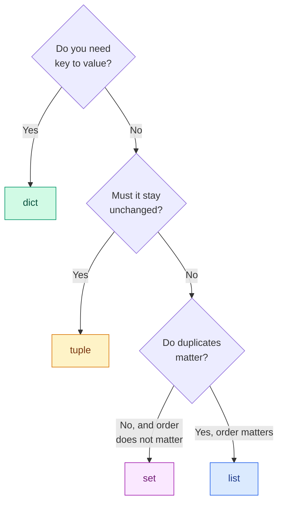

# Data Structures

**Level:** 🟢 Beginner &nbsp;|&nbsp; **Effort:** Short module &nbsp;|&nbsp; **Module:** [01 Python Foundations](README.md)

---

## 🎯 Learning Objectives

By the end of this topic you will be able to:

- Choose between a list, tuple, set and dictionary from the requirements, not from habit
- Slice a sequence confidently, including the negative-index and step forms
- Explain why set and dictionary lookup is fast and list lookup is not
- Copy a nested structure correctly, and explain the aliasing trap
- Use the string methods that matter for text data

## 📚 Prerequisites

[Topic 3: Functions](03-functions.md)

---

## 1. Choosing the right structure



| Structure | Ordered | Changeable | Duplicates | Typical ML use |
| --- | --- | --- | --- | --- |
| **list** | Yes | Yes | Yes | Batches, predictions, feature columns |
| **tuple** | Yes | **No** | Yes | Array shapes, coordinates, function returns |
| **set** | No | Yes | **No** | Unique labels, vocabulary, deduplication |
| **dict** | Yes (insertion) | Yes | Keys unique | Config, label maps, metric results |

---

## 2. Lists

```python
predictions = [0.9, 0.2, 0.75, 0.1]

predictions.append(0.6)
predictions.insert(0, 0.99)
last = predictions.pop()

print(predictions)
print(f"popped: {last}")
print(f"length: {len(predictions)}, max: {max(predictions)}, mean: {sum(predictions)/len(predictions):.3f}")
```

**Output:**
```
[0.99, 0.9, 0.2, 0.75, 0.1]
popped: 0.6
length: 5, max: 0.99, mean: 0.588
```

### Slicing

Slicing is `sequence[start:stop:step]`. **`start` is included, `stop` is excluded** — the same
convention as `range`.

```python
scores = [0.1, 0.2, 0.3, 0.4, 0.5, 0.6, 0.7, 0.8]

print(f"first three:   {scores[:3]}")
print(f"last two:      {scores[-2:]}")
print(f"middle:        {scores[2:5]}")
print(f"every second:  {scores[::2]}")
print(f"reversed:      {scores[::-1]}")

# The classic train/test split, done by hand
cut = int(len(scores) * 0.75)
print(f"train: {scores[:cut]}")
print(f"test:  {scores[cut:]}")
```

**Output:**
```
first three:   [0.1, 0.2, 0.3]
last two:      [0.7, 0.8]
middle:        [0.3, 0.4, 0.5]
every second:  [0.1, 0.3, 0.5, 0.7]
reversed:      [0.8, 0.7, 0.6, 0.5, 0.4, 0.3, 0.2, 0.1]
train: [0.1, 0.2, 0.3, 0.4, 0.5, 0.6]
test:  [0.7, 0.8]
```

Negative indices count from the end: `-1` is the last item. `scores[:cut]` and `scores[cut:]`
together cover the whole list exactly once, with no overlap — which is precisely what you want from
a split, and why this convention is worth getting comfortable with.

### Sorting

```python
results = [("forest", 0.81), ("baseline", 0.62), ("boosting", 0.84)]

by_score = sorted(results, key=lambda pair: pair[1], reverse=True)
print(by_score)
print(f"best model: {by_score[0][0]}")
```

**Output:**
```
[('boosting', 0.84), ('forest', 0.81), ('baseline', 0.62)]
best model: boosting
```

`key` says *what to sort by*. `lambda pair: pair[1]` is a tiny anonymous function meaning "use the
second element". You will use this pattern constantly for ranking model results.

---

## 3. Tuples

A tuple is an immutable list. Once created, it cannot change.

```python
image_shape = (224, 224, 3)      # height, width, channels

height, width, channels = image_shape        # unpacking
print(f"{height}x{width}, {channels} channels")

try:
    image_shape[0] = 256
except TypeError as error:
    print(f"TypeError: {error}")
```

**Output:**
```
224x224, 3 channels
TypeError: 'tuple' object does not support item assignment
```

**Why immutability is useful:** a tuple cannot be changed by accident by a function you passed it
to. Array shapes are tuples in NumPy and PyTorch for exactly this reason — a shape that mutated
underneath you would be a nightmare to debug.

Tuples can also be **dictionary keys**; lists cannot, because keys must be hashable and therefore
immutable.

```python
cell_counts = {(0, 0): 12, (0, 1): 7, (1, 0): 3}
print(cell_counts[(0, 1)])

try:
    {[0, 1]: "value"}
except TypeError as error:
    print(f"TypeError: {error}")
```

**Output:**
```
7
TypeError: unhashable type: 'list'
```

---

## 4. Sets

A set holds unique items, unordered, with very fast membership testing.

```python
labels = ["cat", "dog", "cat", "bird", "dog", "cat"]

unique_labels = set(labels)
print(f"unique: {sorted(unique_labels)}")
print(f"how many classes: {len(unique_labels)}")
print(f"is 'fish' present? {'fish' in unique_labels}")
```

**Output:**
```
unique: ['bird', 'cat', 'dog']
how many classes: 3
is 'fish' present? False
```

⚠️ Sets are **unordered** — printing one directly gives an arbitrary order. Always `sorted()` a
set before displaying it, or your output will not be reproducible.

### Set operations — genuinely useful for data work

```python
train_ids = {1, 2, 3, 4, 5, 6}
test_ids = {5, 6, 7, 8}

print(f"overlap (LEAKAGE!): {sorted(train_ids & test_ids)}")
print(f"all ids:            {sorted(train_ids | test_ids)}")
print(f"train only:         {sorted(train_ids - test_ids)}")
print(f"properly disjoint?  {train_ids.isdisjoint(test_ids)}")
```

**Output:**
```
overlap (LEAKAGE!): [5, 6]
all ids:            [1, 2, 3, 4, 5, 6, 7, 8]
train only:         [1, 2, 3, 4]
properly disjoint?  False
```

**This is a real leakage check.** `train_ids.isdisjoint(test_ids)` returning `False` means samples
appear in both splits, which invalidates your entire evaluation. It is one line, and it belongs in
every data pipeline you build — see [03 Data Foundations](../03-data-foundations/README.md).

### Why sets are fast

```python
import time

big_list = list(range(200_000))
big_set = set(big_list)
target = 199_999

start = time.perf_counter()
target in big_list
list_time = time.perf_counter() - start

start = time.perf_counter()
target in big_set
set_time = time.perf_counter() - start

print(f"list lookup faster than set? {list_time < set_time}")
print(f"set was at least 10x faster: {list_time > set_time * 10}")
```

**Output:**
```
list lookup faster than set? False
set was at least 10x faster: True
```

A list check compares every element in turn — O(n). A set uses a hash table and jumps straight to
the answer — O(1) on average. **If you find yourself writing `if x in some_list` inside a loop,
convert the list to a set first.** On large data this turns minutes into milliseconds.

---

## 5. Dictionaries

A dictionary maps keys to values. It is the workhorse of configuration and lookup.

```python
config = {
    "model": "random_forest",
    "n_estimators": 100,
    "max_depth": None,
    "random_state": 42,
}

print(config["model"])
print(config.get("learning_rate", "not set"))     # safe: no KeyError

config["n_estimators"] = 200
config["criterion"] = "gini"

for key, value in config.items():
    print(f"  {key:15} = {value}")
```

**Output:**
```
random_forest
not set
  model           = random_forest
  n_estimators    = 200
  max_depth       = None
  random_state    = 42
  criterion       = gini
```

⚠️ **`config["missing"]` raises `KeyError`. `config.get("missing")` returns `None`.** Use `.get()`
with a default whenever a key might legitimately be absent — it turns a crash into a fallback.

### Counting — the most common dictionary use in data work

```python
from collections import Counter

labels = ["cat", "dog", "cat", "bird", "dog", "cat", "cat"]

counts = Counter(labels)
print(counts)
print(f"most common: {counts.most_common(2)}")

total = sum(counts.values())
for label, count in counts.most_common():
    print(f"  {label:5} {count}  ({count / total:.1%})")
```

**Output:**
```
Counter({'cat': 4, 'dog': 2, 'bird': 1})
most common: [('cat', 4), ('dog', 2)]
  cat   4  (57.1%)
  dog   2  (28.6%)
  bird  1  (14.3%)
```

**That percentage breakdown is a class-balance check** — the first thing to look at before training
any classifier. A dataset that is 57% one class means accuracy is already a misleading metric.

### Nesting

```python
results = {
    "baseline":  {"accuracy": 0.62, "f1": 0.58},
    "forest":    {"accuracy": 0.81, "f1": 0.79},
    "boosting":  {"accuracy": 0.84, "f1": 0.83},
}

for model, metrics in results.items():
    print(f"{model:10} acc={metrics['accuracy']:.2f}  f1={metrics['f1']:.2f}")

best = max(results, key=lambda name: results[name]["f1"])
print(f"\nbest by f1: {best}")
```

**Output:**
```
baseline   acc=0.62  f1=0.58
forest     acc=0.81  f1=0.79
boosting   acc=0.84  f1=0.83

best by f1: boosting
```

---

## 6. ⚠️ Copying and the aliasing trap

Back to the luggage-tag idea from [Topic 1](01-variables-and-data-types.md). This is where it does
real damage.

```python
original = [1, 2, 3]
alias = original            # NOT a copy - a second name for the same list

alias.append(4)
print(f"original: {original}")
print(f"same object? {original is alias}")
```

**Output:**
```
original: [1, 2, 3, 4]
same object? True
```

### Shallow copy

```python
original = [1, 2, 3]
copied = original.copy()        # or list(original), or original[:]

copied.append(4)
print(f"original: {original}")
print(f"copied:   {copied}")
```

**Output:**
```
original: [1, 2, 3]
copied:   [1, 2, 3, 4]
```

### Where shallow copying fails

`.copy()` duplicates the **outer** container only. Anything nested inside is still shared:

```python
import copy

dataset = [[1, 2], [3, 4]]
shallow = dataset.copy()
deep = copy.deepcopy(dataset)

shallow[0].append(99)           # touches the shared inner list
deep[1].append(77)              # touches an independent inner list

print(f"original: {dataset}")
print(f"shallow:  {shallow}")
print(f"deep:     {deep}")
```

**Output:**
```
original: [[1, 2, 99], [3, 4]]
shallow:  [[1, 2, 99], [3, 4]]
deep:     [[1, 2], [3, 4, 77]]
```

**The rule:** `.copy()` copies one level. For nested structures use `copy.deepcopy()`. This matters
whenever you pass a dataset or a config dictionary into a function that might modify it — a
"defensive copy" that is only shallow gives you false confidence.

---

## 7. Strings

Strings are immutable sequences of characters, and every string method returns a *new* string.

```python
raw = "  The Model Achieved 84% Accuracy.  "

cleaned = raw.strip().lower()
print(f"[{cleaned}]")
print(f"original unchanged: [{raw}]")

print(f"words:       {cleaned.split()}")
print(f"replaced:    {cleaned.replace('model', 'classifier')}")
print(f"starts with: {cleaned.startswith('the')}")
print(f"contains:    {'accuracy' in cleaned}")
```

**Output:**
```
[the model achieved 84% accuracy.]
original unchanged: [  The Model Achieved 84% Accuracy.  ]
words:       ['the', 'model', 'achieved', '84%', 'accuracy.']
replaced:    the classifier achieved 84% accuracy.
starts with: True
contains:    True
```

### Splitting and joining — the CSV and tokenisation workhorses

```python
csv_line = "sample_042,0.87,cat,verified"

fields = csv_line.split(",")
print(fields)

sample_id, score, label, status = fields
print(f"{sample_id}: {label} at {float(score):.0%} ({status})")

print(",".join(fields))
print(" | ".join(field.upper() for field in fields))
```

**Output:**
```
['sample_042', '0.87', 'cat', 'verified']
sample_042: cat at 87% (verified)
sample_042,0.87,cat,verified
SAMPLE_042 | 0.87 | CAT | VERIFIED
```

⚠️ **Do not parse real CSV files by splitting on commas.** A field containing a quoted comma —
`"Smith, John"` — will break it. Use the `csv` module, covered in topic 10. This example is here to
show `split` and `join`, not to recommend hand-rolled parsing.

### f-strings and formatting

```python
model = "forest"
accuracy = 0.8367
count = 1234567

print(f"{model} reached {accuracy:.1%}")
print(f"padded: |{model:>12}|{model:<12}|{model:^12}|")
print(f"thousands: {count:,}")
print(f"scientific: {accuracy:.2e}")
print(f"debug form: {accuracy=}")
```

**Output:**
```
forest reached 83.7%
padded: |      forest|forest      |   forest   |
thousands: 1,234,567
scientific: 8.37e-01
debug form: accuracy=0.8367
```

`{accuracy=}` prints both the name and the value — a genuinely useful debugging shortcut.

---

## 🧪 Hands-on exercise

**Task:** you are given a list of `(sample_id, true_label, predicted_label)` tuples.

```python
records = [
    ("s1", "cat", "cat"), ("s2", "dog", "cat"), ("s3", "cat", "cat"),
    ("s4", "bird", "bird"), ("s5", "dog", "dog"), ("s6", "cat", "dog"),
]
```

Write code that:
1. Prints the set of unique true labels, sorted
2. Uses `Counter` to show how many times each true label appears
3. Builds a dictionary of per-class accuracy
4. Prints which sample IDs were misclassified

<details>
<summary>💡 Solution</summary>

```python
from collections import Counter

records = [
    ("s1", "cat", "cat"), ("s2", "dog", "cat"), ("s3", "cat", "cat"),
    ("s4", "bird", "bird"), ("s5", "dog", "dog"), ("s6", "cat", "dog"),
]

true_labels = [true for _, true, _ in records]
classes = sorted(set(true_labels))
print(f"classes: {classes}")

support = Counter(true_labels)
print(f"support: {dict(support)}")

correct = Counter(true for _, true, pred in records if true == pred)
per_class = {label: correct[label] / support[label] for label in classes}
for label in classes:
    print(f"  {label:5} {per_class[label]:.0%}  (n={support[label]})")

wrong = [sample for sample, true, pred in records if true != pred]
print(f"misclassified: {wrong}")
```

**Output:**
```
classes: ['bird', 'cat', 'dog']
support: {'cat': 3, 'dog': 2, 'bird': 1}
  bird  100%  (n=1)
  cat   67%  (n=3)
  dog   50%  (n=2)
misclassified: ['s2', 's6']
```

Note `bird` scores 100% on a single sample. A per-class metric with `n=1` is not evidence of
anything — which is why the support column is printed alongside it, and why
[07 Model Evaluation](../07-model-evaluation/README.md) insists on reporting support with every
per-class number.
</details>

---

## ⚠️ Common mistakes

| Mistake | What happens | Fix |
| --- | --- | --- |
| `b = a` expecting a copy | Both names, one object | `a.copy()`, or `copy.deepcopy` if nested |
| `.copy()` on nested data | Inner objects still shared | `copy.deepcopy()` |
| `d["missing"]` | `KeyError` crash | `d.get("missing", default)` |
| `x in big_list` in a loop | O(n) each time, very slow | Convert to a `set` first |
| Printing a set directly | Arbitrary order, unreproducible output | `sorted(my_set)` |
| Splitting real CSV on commas | Breaks on quoted fields | Use the `csv` module |
| Expecting `s.upper()` to change `s` | Strings are immutable | `s = s.upper()` |
| Mutable default `def f(x, d={})` | Shared across calls | See [Topic 3](03-functions.md#3--the-mutable-default-argument-trap) |

---

## ✅ Key takeaways

- Choose from requirements: **dict** for key→value, **tuple** for fixed, **set** for unique-and-fast,
  **list** for ordered-and-changeable.
- Slices are `[start:stop:step]` with **stop excluded** — so `x[:n]` and `x[n:]` split cleanly.
- **Sets make membership testing O(1).** `train_ids.isdisjoint(test_ids)` is a one-line leakage check.
- `.get()` avoids `KeyError`; `Counter` gives you class balance in one line.
- **`.copy()` is shallow.** Nested structures need `copy.deepcopy()`.
- Strings are immutable — every method returns a new string, so assign the result.

---

## 📚 Official References

- [Python Tutorial: Data Structures — Python Software Foundation](https://docs.python.org/3/tutorial/datastructures.html) — verified 2026-07-27
- [Built-in Types: Sequence, Set and Mapping — Python Software Foundation](https://docs.python.org/3/library/stdtypes.html) — verified 2026-07-27
- [collections.Counter — Python Software Foundation](https://docs.python.org/3/library/collections.html#collections.Counter) — verified 2026-07-27
- [copy — Shallow and deep copy operations — Python Software Foundation](https://docs.python.org/3/library/copy.html) — verified 2026-07-27
- [Format Specification Mini-Language — Python Software Foundation](https://docs.python.org/3/library/string.html#format-specification-mini-language) — verified 2026-07-27

---

## 🔗 Navigation

[← Topic 3: Functions](03-functions.md) &nbsp;|&nbsp;
[Module home](README.md) &nbsp;|&nbsp;
[Topic 5: Files, Exceptions and Modules →](05-files-exceptions-and-modules.md)
