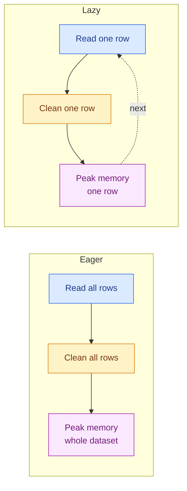

# Pythonic Patterns

**Level:** 🟡 Intermediate &nbsp;|&nbsp; **Effort:** Detailed module &nbsp;|&nbsp; **Module:** [01 Python Foundations](README.md)

---

## 🎯 Learning Objectives

By the end of this topic you will be able to:

- Explain the iteration protocol, and what a `for` loop actually does underneath
- Write generators, and say when laziness saves you and when it bites you
- Stream a dataset that does not fit in memory, in batches
- Write decorators that add behaviour without editing the function they wrap
- Write context managers so that cleanup happens even when the code raises
- Recognise these four patterns in the machine-learning libraries you are about to use

## 📚 Prerequisites

[Topic 6: Object-Oriented Programming](06-object-oriented-programming.md) — decorators and context
managers are both built on the special methods introduced there.

---

## 1. Why this topic exists

Everything here is optional in the sense that you *can* write working Python without it. You cannot
**read** machine-learning code without it. Four examples you will meet within the next few modules:

| You will see | It is |
| --- | --- |
| `for batch in dataloader:` | an iterator — the batches do not exist yet |
| `@torch.no_grad()` | a decorator, and also a context manager |
| `with torch.no_grad():` | the same object, used the other way |
| `yield` inside a data-loading function | a generator streaming rows off disk |

This topic is where those stop being magic.

---

## 2. The iteration protocol

### 🍰 Simple explanation

An **iterable** is anything you can loop over. An **iterator** is the thing that actually walks
through it, remembering where it got to.

### 🏠 Real-life analogy

A book is an iterable. A **bookmark** is an iterator. The book does not know where you are; the
bookmark does. Two people can read the same book with two bookmarks, independently.

### ⚙️ How it works

`iter()` asks an iterable for a fresh iterator. `next()` asks that iterator for the next item. When
there is nothing left, it raises `StopIteration`.

```python
scores = [0.9, 0.4, 0.7]

bookmark = iter(scores)
print(next(bookmark))
print(next(bookmark))
print(next(bookmark))

try:
    next(bookmark)
except StopIteration:
    print("exhausted")
```

**Output:**
```
0.9
0.4
0.7
exhausted
```

A `for` loop is exactly that, with the `try`/`except` written for you. These two loops are the
same program:

```python
scores = [0.9, 0.4]

for score in scores:
    print(f"for loop:  {score}")

bookmark = iter(scores)
while True:
    try:
        score = next(bookmark)
    except StopIteration:
        break
    print(f"by hand:   {score}")
```

**Output:**
```
for loop:  0.9
for loop:  0.4
by hand:   0.9
by hand:   0.4
```

Once you have seen this, `StopIteration` in a traceback stops being mysterious: something called
`next()` on an iterator that had already run out.

### An iterable is not always an iterator

A list is iterable but is *not* its own iterator — every `for` loop gets a fresh bookmark, which is
why you can loop over a list twice. A file object **is** its own iterator, which is why you cannot:

```python
import tempfile
from pathlib import Path

with tempfile.TemporaryDirectory() as tmp:
    path = Path(tmp) / "labels.txt"
    path.write_text("cat\ndog\n", encoding="utf-8")

    handle = path.open(encoding="utf-8")
    first = [line.strip() for line in handle]
    second = [line.strip() for line in handle]
    handle.close()

print(f"first pass:   {first}")
print(f"second pass:  {second}")
```

**Output:**
```
first pass:   ['cat', 'dog']
second pass:  []
```

### ⚠️ Common mistake

**The second pass is empty, and nothing warns you.** If you read a file to count rows and then read
it again to load them, you load zero rows and your model trains on nothing. Either read once into a
list, or reopen the file.

---

## 3. Generators

### 🍰 Simple explanation

A generator is a function that hands back values **one at a time**, pausing in between instead of
finishing. Write `yield` instead of `return` and the function becomes one.

### ⚙️ How it works

Calling a generator function runs **none** of its body. It returns a generator object. The body
advances only when something asks for the next value.

```python
def scores():
    print("  -> computing 0.9")
    yield 0.9
    print("  -> computing 0.4")
    yield 0.4

print("calling the function:")
gen = scores()
print("nothing ran yet")

print("first next():")
print(next(gen))
print("second next():")
print(next(gen))
```

**Output:**
```
calling the function:
nothing ran yet
first next():
  -> computing 0.9
0.9
second next():
  -> computing 0.4
0.4
```

That interleaving is the whole point: **work happens on demand**. A generator over ten million rows
holds one row in memory, not ten million.



### 💻 Streaming a file you cannot fit in memory

This is the pattern behind nearly every real data loader.

```python
import tempfile
from pathlib import Path


def clean_rows(path):
    """Yield one valid (text, label) pair at a time. Never holds the file in memory."""
    with path.open(encoding="utf-8") as handle:
        for line_number, line in enumerate(handle, start=1):
            line = line.strip()
            if not line:
                continue
            parts = line.split("\t")
            if len(parts) != 2:
                print(f"  skipping line {line_number}: expected 2 fields, got {len(parts)}")
                continue
            yield parts[0], parts[1]


with tempfile.TemporaryDirectory() as tmp:
    path = Path(tmp) / "reviews.tsv"
    path.write_text(
        "great film\tpositive\n"
        "\n"
        "awful\tnegative\n"
        "malformed row without a tab\n"
        "loved it\tpositive\n",
        encoding="utf-8",
    )

    for text, label in clean_rows(path):
        print(f"  {label:<8}  {text}")
```

**Output:**
```
  positive  great film
  negative  awful
  skipping line 4: expected 2 fields, got 1
  positive  loved it
```

Note the file handle: the `with` block lives *inside* the generator, so the file stays open exactly
as long as the caller keeps consuming — and closes when the generator is exhausted.

### 💻 Batching — the pattern you will use constantly

Models train on batches, not single rows. A batching generator turns any stream into a stream of
lists, without ever materialising the whole thing.

```python
def batched(items, batch_size):
    """Yield lists of at most batch_size items."""
    if batch_size < 1:
        raise ValueError(f"batch_size must be at least 1, got {batch_size}")
    batch = []
    for item in items:
        batch.append(item)
        if len(batch) == batch_size:
            yield batch
            batch = []
    if batch:                      # the final, possibly short, batch
        yield batch


for index, batch in enumerate(batched(range(10), batch_size=4)):
    print(f"batch {index}: {batch}")
```

**Output:**
```
batch 0: [0, 1, 2, 3]
batch 1: [4, 5, 6, 7]
batch 2: [8, 9]
```

**The `if batch:` at the end is the bug people ship.** Forget it and every training run silently
drops up to `batch_size - 1` samples — with 10 samples and a batch size of 4, you would lose the
last two and never see an error.

> Python 3.12 added [`itertools.batched`](https://docs.python.org/3/library/itertools.html#itertools.batched),
> which does this for you. This repository targets 3.10+, and writing it once is worth more than
> importing it.

### Generator expressions

A comprehension in `()` instead of `[]` is a generator. Same syntax, no list built.

```python
scores = [0.91, 0.42, 0.77, 0.65]

as_list = [s for s in scores if s > 0.6]
as_gen = (s for s in scores if s > 0.6)

print(f"list:       {as_list}")
print(f"generator:  {type(as_gen).__name__}")
print(f"consumed:   {list(as_gen)}")
print(f"again:      {list(as_gen)}")
```

**Output:**
```
list:       [0.91, 0.77, 0.65]
generator:  generator
consumed:   [0.91, 0.77, 0.65]
again:      []
```

### ⚠️ Common mistake: a generator is single-pass

That last line is the trap. Generators are exhausted by use. This is how it hurts in practice:

```python
predictions = (p for p in [0.9, 0.4, 0.8])

total = sum(predictions)
count = sum(1 for _ in predictions)      # already exhausted

print(f"total:  {total}")
print(f"count:  {count}")
print(f"mean:   {total / count if count else 'ZeroDivisionError avoided'}")
```

**Output:**
```
total:  2.1
count:  0
mean:   ZeroDivisionError avoided
```

**Rule of thumb:** if you need the data more than once, or need `len()`, materialise it with
`list()`. Laziness is for data you touch exactly once.

### `yield from`

To delegate to another iterable, `yield from` replaces a loop:

```python
def train_files():
    yield "train_a.csv"
    yield "train_b.csv"


def all_files():
    yield from train_files()
    yield "test.csv"


print(list(all_files()))
```

**Output:**
```
['train_a.csv', 'train_b.csv', 'test.csv']
```

---

## 4. Decorators

### 🍰 Simple explanation

A decorator wraps a function in another function, adding behaviour **without editing the original**.

### 🏠 Real-life analogy

A gift box. The gift is unchanged; the box adds wrapping paper. `@decorator` is the act of putting
the function in the box and re-labelling the box with the function's name.

### ⚙️ How it works

It rests on one fact: **functions are objects**. You can pass them around and return them.

```python
def shout(text):
    return text.upper()


speak = shout                      # not calling it - just another name
print(speak("hello"))
print(f"the object is: {shout.__name__}")
```

**Output:**
```
HELLO
the object is: shout
```

So a decorator is a function that takes a function and returns a replacement:

```python
def logged(function):
    def wrapper(*args, **kwargs):
        print(f"  calling {function.__name__} with {args}")
        result = function(*args, **kwargs)
        print(f"  {function.__name__} returned {result}")
        return result
    return wrapper


@logged
def accuracy(correct, total):
    return correct / total


print(f"result: {accuracy(43, 50)}")
```

**Output:**
```
  calling accuracy with (43, 50)
  accuracy returned 0.86
result: 0.86
```

`@logged` above `def accuracy` is exactly `accuracy = logged(accuracy)`. Nothing more.

### ⚠️ Common mistake: the wrapper eats the identity

Without help, the decorated function forgets its own name and docstring — which breaks
documentation tools, debuggers and anything that introspects.

```python
import functools


def naive(function):
    def wrapper(*args, **kwargs):
        return function(*args, **kwargs)
    return wrapper


def careful(function):
    @functools.wraps(function)
    def wrapper(*args, **kwargs):
        return function(*args, **kwargs)
    return wrapper


@naive
def precision(tp, fp):
    """Fraction of positive predictions that were correct."""
    return tp / (tp + fp)


@careful
def recall(tp, fn):
    """Fraction of actual positives that were found."""
    return tp / (tp + fn)


print(f"naive name:  {precision.__name__}")
print(f"naive doc:   {precision.__doc__}")
print(f"careful name: {recall.__name__}")
print(f"careful doc:  {recall.__doc__}")
```

**Output:**
```
naive name:  wrapper
naive doc:   None
careful name: recall
careful doc:  Fraction of actual positives that were found.
```

**Always use `functools.wraps`.** There is no situation where you want the naive version.

### 💻 A decorator that takes arguments

Retrying is the classic case — model APIs and dataset downloads both fail transiently. A decorator
with arguments is one more layer: a function returning a decorator returning a wrapper.

```python
import functools


def retry(attempts):
    """Retry the wrapped call up to `attempts` times before giving up."""
    def decorator(function):
        @functools.wraps(function)
        def wrapper(*args, **kwargs):
            for attempt in range(1, attempts + 1):
                try:
                    return function(*args, **kwargs)
                except ConnectionError as error:
                    print(f"  attempt {attempt} failed: {error}")
                    if attempt == attempts:
                        raise
        return wrapper
    return decorator


calls = []


@retry(attempts=3)
def fetch_embedding(text):
    calls.append(text)
    if len(calls) < 3:
        raise ConnectionError("service unavailable")
    return [0.1, 0.2]


print(f"result: {fetch_embedding('hello')}")
print(f"calls:  {len(calls)}")
```

**Output:**
```
  attempt 1 failed: service unavailable
  attempt 2 failed: service unavailable
result: [0.1, 0.2]
calls:  3
```

### 🔐 Security note

A retry decorator that catches bare `except Exception` will retry on `ValueError`, `KeyError` and
programming bugs too — hammering a service three times for an error that will never succeed, and
hiding the real failure. **Catch the specific transient exception.** For anything talking to a
network service, add a delay between attempts so a struggling service is not made worse.

### 💻 Caching with `functools.lru_cache`

Repeated identical work — tokenising the same string, loading the same config — is free to
eliminate. `lru_cache` is a decorator in the standard library.

```python
import functools

computations = []


@functools.lru_cache(maxsize=128)
def token_count(text):
    computations.append(text)
    return len(text.split())


print(token_count("the cat sat"))
print(token_count("the cat sat"))       # served from cache
print(token_count("a dog barked loudly"))
print(f"actual computations: {computations}")
print(f"cache info hits: {token_count.cache_info().hits}")
```

**Output:**
```
3
3
4
actual computations: ['the cat sat', 'a dog barked loudly']
cache info hits: 1
```

**Two constraints.** Arguments must be hashable — you cannot cache a function taking a list or a
DataFrame. And the cache holds references to every result, so caching something that returns a large
array is a memory leak wearing a performance costume.

---

## 5. Context managers

### 🍰 Simple explanation

A context manager guarantees that **cleanup happens**, whether the block finished normally or blew
up halfway through.

### ⚙️ How it works

`with expression as name:` calls `__enter__` on the object, binds its return value to `name`, and
calls `__exit__` on the way out — including when an exception is propagating.

```python
class Section:
    def __init__(self, label):
        self.label = label

    def __enter__(self):
        print(f"enter {self.label}")
        return self

    def __exit__(self, exc_type, exc_value, traceback):
        print(f"exit  {self.label} (exception: {exc_type.__name__ if exc_type else 'none'})")
        return False                # False = do not suppress the exception


with Section("clean"):
    print("  body ran")

try:
    with Section("failing"):
        raise ValueError("bad row")
except ValueError as error:
    print(f"caught: {error}")
```

**Output:**
```
enter clean
  body ran
exit  clean (exception: none)
enter failing
exit  failing (exception: ValueError)
caught: bad row
```

**`__exit__` ran even though the body raised.** That is the entire value proposition: the file gets
closed, the lock gets released, the GPU memory gets freed, no matter what happened inside.

`return True` from `__exit__` would swallow the exception. **Almost never do this** — a context
manager that silently eats errors is how a training run "succeeds" having processed nothing.

### 💻 The easier way: `@contextmanager`

For most cases a generator with one `yield` is less code than a class.

```python
import contextlib
import random


@contextlib.contextmanager
def temporary_seed(seed):
    """Make the block deterministic, then restore the previous RNG state."""
    state = random.getstate()
    random.seed(seed)
    try:
        yield
    finally:
        random.setstate(state)      # runs even if the block raises


random.seed(0)
before = random.random()

random.seed(0)
with temporary_seed(42):
    print(f"inside the block:  {random.random():.6f}")

after = random.random()
print(f"stream undisturbed: {before == after}")
```

**Output:**
```
inside the block:  0.639427
stream undisturbed: True
```

Everything before `yield` is `__enter__`; everything after is `__exit__`. **The `try`/`finally` is
mandatory** — without it, an exception in the block skips the restore and leaks the changed state
into the rest of your program.

### 🌍 Real-world use case

This exact pattern is how you make one evaluation reproducible without pinning global randomness for
the whole program. In PyTorch you will meet its siblings constantly: `torch.no_grad()` disables
gradient tracking for a block and re-enables it after, and `model.eval()` / `model.train()` are
frequently wrapped in a context manager for the same reason — so an early `return` or an exception
cannot leave the model stuck in the wrong mode.

### Multiple managers, and `contextlib.suppress`

```python
import contextlib

with contextlib.suppress(FileNotFoundError):
    with open("does-not-exist.csv", encoding="utf-8") as handle:
        print(handle.read())
print("carried on")
```

**Output:**
```
carried on
```

Use `suppress` only when the absence genuinely does not matter. It is a precision tool, not a way to
make errors go away.

---

## 6. `itertools` — the ones worth knowing

The standard library ships lazy iteration tools. Four earn their place early:

```python
import itertools


def counter():
    """An infinite stream - safe only because islice stops it."""
    value = 0
    while True:
        yield value
        value += 1


print(f"islice:      {list(itertools.islice(counter(), 5))}")
print(f"chain:       {list(itertools.chain(['a', 'b'], ['c']))}")

records = [("cat", 1), ("cat", 2), ("dog", 3)]
for label, group in itertools.groupby(records, key=lambda row: row[0]):
    print(f"groupby:     {label} -> {[value for _, value in group]}")

grid = list(itertools.product([0.01, 0.1], ["l1", "l2"]))
print(f"product:     {grid}")
```

**Output:**
```
islice:      [0, 1, 2, 3, 4]
chain:       ['a', 'b', 'c']
groupby:     cat -> [1, 2]
groupby:     dog -> [3]
product:     [(0.01, 'l1'), (0.01, 'l2'), (0.1, 'l1'), (0.1, 'l2')]
```

`product` is a hyperparameter grid search in one line — you will use it in
[07 Model Evaluation](../07-model-evaluation/README.md).

### ⚠️ `groupby` only groups *adjacent* items

It does not sort first. On unsorted input it produces the same key repeatedly and quietly gives you
wrong groups. **Sort by the same key first**, every time.

---

## 7. When *not* to use these

| Pattern | Skip it when |
| --- | --- |
| Generator | The data fits in memory and you need it more than once |
| Decorator | It is used on exactly one function — just write the code inline |
| Context manager | There is nothing to clean up |
| `lru_cache` | Arguments are unhashable, or results are large |

Clever code that only you can read is a cost, not an achievement. Reach for these when they remove a
real problem — memory pressure, duplicated cleanup, repeated boilerplate — not to demonstrate that
you know them.

---

## 🧪 Hands-on exercise

Write a generator `sliding_windows(items, size)` that yields every consecutive window of length
`size`, and returns nothing at all if the input is shorter than one window. This is how time-series
features are built in [20 Time Series](../20-time-series/README.md).

```python
def sliding_windows(items, size):
    if size < 1:
        raise ValueError(f"size must be at least 1, got {size}")
    window = []
    for item in items:
        window.append(item)
        if len(window) > size:
            window.pop(0)
        if len(window) == size:
            yield list(window)      # a copy - `window` keeps mutating


print(list(sliding_windows([1, 2, 3, 4], size=2)))
print(list(sliding_windows([1, 2], size=3)))
```

**Output:**
```
[[1, 2], [2, 3], [3, 4]]
[]
```

**Why `list(window)` and not `window`?** Yielding the list itself hands out a reference to a list you
keep mutating — every yielded window would end up identical. Try it and watch.

**Extend it:** make it accept any iterable, not just a list (it already does — check with
`sliding_windows(range(4), size=2)`), and write a version using `collections.deque(maxlen=size)`.

---

## 🎤 Interview questions

**"What is the difference between a list comprehension and a generator expression?"**

A list comprehension builds and returns the entire list immediately; a generator expression returns
an iterator that produces items on demand. The generator uses constant memory regardless of length,
but is single-pass and has no `len()`. Use a list when the data is small and reused; a generator when
it is large or consumed once.

**"You have a 50 GB CSV and 16 GB of RAM. How do you compute the mean of one column?"**

Stream it. Open the file, iterate line by line, accumulate a running sum and count, and divide at the
end — constant memory. A generator that yields one parsed value per row keeps the parsing separate
from the aggregation and makes both testable. In pandas the equivalent is `chunksize`, which returns
an iterator of DataFrames rather than one enormous one.

**"Why does `functools.wraps` matter?"**

Without it the wrapper replaces the original's `__name__`, `__doc__`, `__module__` and
`__wrapped__`. Anything that introspects the function — `help()`, documentation generators, pytest's
test collection, logging that reports the function name — sees `wrapper` instead of the real name.
It costs one line and there is no reason to omit it.

**"When would you write a context manager instead of just calling cleanup at the end?"**

Whenever the cleanup must happen even if the block raises, returns early, or is interrupted. Manual
cleanup at the end of a function is skipped by any of those. It also makes the paired
acquire/release visible in one place rather than at two ends of a long function.

---

## ✅ Key takeaways

- A `for` loop is `iter()` plus repeated `next()` plus catching `StopIteration`. Nothing more.
- A file object is its own iterator — **reading it twice gives you nothing the second time.**
- `yield` makes a generator: work happens on demand, memory stays constant.
- **Generators are single-pass.** Need it twice or need `len()`? Call `list()`.
- Batching generators must yield the final short batch, or you silently drop samples.
- `@decorator` is just `f = decorator(f)`. Always add `functools.wraps`.
- `__exit__` runs even when the body raises — that is the whole point of `with`.
- Restore state in a `finally`, and never suppress exceptions from `__exit__`.
- `itertools.groupby` groups only *adjacent* items. Sort first.

---

## 📚 Official References

- [Iterators — Python Software Foundation](https://docs.python.org/3/tutorial/classes.html#iterators) — verified 2026-07-27
- [Generators — Python Software Foundation](https://docs.python.org/3/tutorial/classes.html#generators) — verified 2026-07-27
- [PEP 255: Simple Generators — Python Software Foundation](https://peps.python.org/pep-0255/) — verified 2026-07-27
- [functools — Python Software Foundation](https://docs.python.org/3/library/functools.html) — verified 2026-07-27
- [contextlib — Python Software Foundation](https://docs.python.org/3/library/contextlib.html) — verified 2026-07-27
- [itertools — Python Software Foundation](https://docs.python.org/3/library/itertools.html) — verified 2026-07-27
- [PEP 343: The with statement — Python Software Foundation](https://peps.python.org/pep-0343/) — verified 2026-07-27
- [torch.no_grad — PyTorch Foundation](https://pytorch.org/docs/stable/generated/torch.no_grad.html) — verified 2026-07-27

---

## 🔗 Navigation

[← Topic 6: Object-Oriented Programming](06-object-oriented-programming.md) &nbsp;|&nbsp;
[Module home](README.md) &nbsp;|&nbsp;
[Topic 8: Type Hints, Dataclasses, Logging and Debugging →](08-type-hints-dataclasses-logging-debugging.md)
