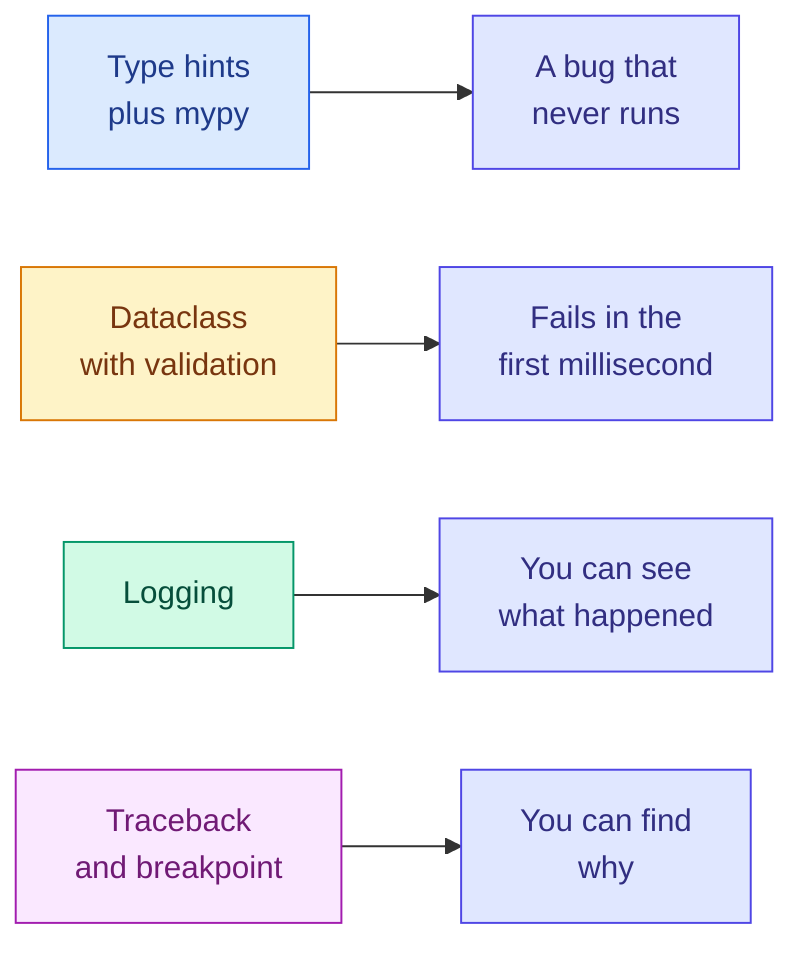

# Type Hints, Dataclasses, Logging and Debugging

**Level:** 🟡 Intermediate &nbsp;|&nbsp; **Effort:** Detailed module &nbsp;|&nbsp; **Module:** [01 Python Foundations](README.md)

---

## 🎯 Learning Objectives

By the end of this topic you will be able to:

- Annotate functions with type hints, and explain what they do and do not do at runtime
- Run a static type checker and read what it tells you
- Replace dictionary-shaped configuration with dataclasses that fail loudly on a typo
- Replace `print` debugging with logging that you can leave in the code
- Read a traceback correctly, and use `breakpoint()` instead of guessing
- Say why `assert` must never be used to validate input

## 📚 Prerequisites

[Topic 7: Pythonic Patterns](07-pythonic-patterns.md)

---

## 1. Why this topic exists

Machine-learning code has a specific failure mode: **it runs, produces a number, and the number is
wrong.** No crash, no error, just a model that is quietly worse than it should be.

The three tools here all attack that:

| Tool | Catches |
| --- | --- |
| **Type hints + a checker** | "I passed a string where a float was expected" — before running |
| **Dataclasses** | "I typed `learing_rate` and the config silently ignored it" |
| **Logging** | "Which of the 40 runs used a shuffled validation set?" |

The fourth, **debugging**, is what you do when they all failed.

---

## 2. Type hints

### 🍰 Simple explanation

A type hint is a note saying what kind of value a name is expected to hold. Python does not enforce
it. Tools and humans read it.

### ⚙️ How it works

Annotate parameters with `: type` and the return with `-> type`.

```python
def accuracy(correct: int, total: int) -> float:
    """Fraction of predictions that were right."""
    if total == 0:
        raise ValueError("total must be greater than 0")
    return correct / total


print(accuracy(43, 50))
print(accuracy.__annotations__)
```

**Output:**
```
0.86
{'correct': <class 'int'>, 'total': <class 'int'>, 'return': <class 'float'>}
```

### ⚠️ Common mistake: expecting hints to be enforced

They are not. This is the single most misunderstood thing about them:

```python
def accuracy(correct: int, total: int) -> float:
    return correct / total


print(accuracy(43.0, 50))         # floats where ints were declared - runs anyway

try:
    accuracy("43", 50)            # strings - accepted at the call
except TypeError as error:
    print(f"failed later, at the division: {error}")
```

**Output:**
```
0.86
failed later, at the division: unsupported operand type(s) for /: 'str' and 'int'
```

**Note where it failed.** Not at the call — Python accepted the string argument without complaint —
but two lines later, inside the function. In a deeper call stack that gap is where the confusion
lives.

**Hints are documentation that a tool can check.** They are not validation. Data arriving from a
file, an API or a user still needs a real runtime check — see the `raise` patterns in
[Topic 5](05-files-exceptions-and-modules.md).

### 🧪 Running the checker

The tool that reads the hints is a static type checker. This repository pins
[mypy](https://mypy.readthedocs.io/en/stable/) in `requirements-dev.txt`:

```bash
pip install -r requirements-dev.txt
mypy metrics.py
```

Given this deliberately broken `metrics.py`:

```python
# check-examples: skip
def accuracy(correct: int, total: int) -> float:
    return correct / total


scores: list[float] = [0.9, 0.4]
scores.append("0.7")

print(accuracy("43", 50))
```

mypy reports, without running a line of it:

```text
metrics.py:6: error: Argument 1 to "append" of "list" has incompatible type "str"; expected "float"  [arg-type]
metrics.py:8: error: Argument 1 to "accuracy" has incompatible type "str"; expected "int"  [arg-type]
Found 2 errors in 1 file (checked 1 source file)
```

That is the payoff. Both bugs are the kind that would otherwise surface an hour into a training run.

### Annotating collections

Since Python 3.9 you use the built-in types directly — no `typing.List` needed.

```python
def mean_score(scores: list[float]) -> float:
    return sum(scores) / len(scores)


def class_counts(labels: list[str]) -> dict[str, int]:
    counts: dict[str, int] = {}
    for label in labels:
        counts[label] = counts.get(label, 0) + 1
    return counts


def split_sizes(total: int, test_fraction: float) -> tuple[int, int]:
    test = int(total * test_fraction)
    return total - test, test


print(mean_score([0.9, 0.4, 0.8]))
print(class_counts(["cat", "dog", "cat"]))
print(split_sizes(100, 0.2))
```

**Output:**
```
0.7000000000000001
{'cat': 2, 'dog': 1}
(80, 20)
```

> That first number is floating-point again — see
> [Topic 1](01-variables-and-data-types.md). The hint says `float`, and `0.7000000000000001` is a
> perfectly valid `float`. **A type checker cannot catch a numerical problem.**

### Optional values: `X | None`

A value that may be missing is `X | None`. Since Python 3.10 that `|` syntax works directly; older
code writes `Optional[X]`, which means exactly the same thing.

```python
def find_threshold(name: str, table: dict[str, float]) -> float | None:
    """Return the tuned threshold, or None if this model has not been tuned."""
    return table.get(name)


thresholds = {"logreg": 0.42}

for model in ["logreg", "forest"]:
    result = find_threshold(model, thresholds)
    if result is None:
        print(f"{model:<8} no tuned threshold - falling back to 0.5")
    else:
        print(f"{model:<8} {result}")
```

**Output:**
```
logreg   0.42
forest   no tuned threshold - falling back to 0.5
```

**`| None` in a signature is a contract with the caller: "you must handle the missing case."** A
checker will flag you for using the result without testing it.

### Accept broadly, return precisely

If your function only iterates over its argument, do not demand a `list`. `Sequence` accepts lists
and tuples; `Iterable` accepts generators too. Return types should stay concrete, so the caller
knows exactly what they have.

```python
from collections.abc import Iterable


def total(values: Iterable[float]) -> float:
    return sum(values)


print(total([1.0, 2.0]))
print(total((1.0, 2.0)))
print(total(x / 2 for x in range(4)))
```

**Output:**
```
3.0
3.0
3.0
```

Annotating that parameter `list[float]` would have rejected two of those three calls for no reason.

### 💰 When hints are not worth it

Exploratory notebook cells. Throwaway analysis. A three-line script you will delete today. Hints pay
off in code that is **read again** — shared modules, anything in `src/`, anything another person
imports. Adding them to a scratch cell is cost with no return.

---

## 3. Dataclasses

### 🍰 Simple explanation

A dataclass is a class for holding data where Python writes the boilerplate for you.

### The problem it solves

Machine-learning configuration usually starts as a dictionary, and dictionaries do not object to
typos:

```python
config = {"learning_rate": 0.01, "epochs": 10}

learning_rate = config.get("learing_rate", 0.001)      # typo, silently defaulted

print(f"training with learning rate {learning_rate}")
print("no error, no warning, and the run is wasted")
```

**Output:**
```
training with learning rate 0.001
no error, no warning, and the run is wasted
```

**This is a genuinely expensive bug.** The run completes, the model is bad, and you spend the
afternoon blaming the data.

### ⚙️ The dataclass version

```python
from dataclasses import dataclass


@dataclass
class TrainingConfig:
    learning_rate: float
    epochs: int
    batch_size: int = 32          # a default makes the field optional


config = TrainingConfig(learning_rate=0.01, epochs=10)

print(config)
print(f"batch size: {config.batch_size}")
print(f"equal to an identical config? {config == TrainingConfig(0.01, 10)}")

try:
    print(config.learing_rate)
except AttributeError as error:
    print(f"typo caught immediately: {error}")
```

**Output:**
```
TrainingConfig(learning_rate=0.01, epochs=10, batch_size=32)
batch size: 32
equal to an identical config? True
typo caught immediately: 'TrainingConfig' object has no attribute 'learing_rate'
```

The decorator generated `__init__`, `__repr__` and `__eq__` — the three methods you wrote by hand in
[Topic 6](06-object-oriented-programming.md). The `__repr__` alone is worth it: printing a config
now tells you every hyperparameter of the run.

### Mutable defaults — the trap from Topic 3, again

Dataclasses refuse the mutable-default bug rather than letting you ship it:

```python
from dataclasses import dataclass, field

try:
    @dataclass
    class Broken:
        layers: list[int] = [64, 32]
except ValueError as error:
    print(f"refused: {error}")


@dataclass
class Correct:
    layers: list[int] = field(default_factory=lambda: [64, 32])


a, b = Correct(), Correct()
a.layers.append(16)
print(f"a: {a.layers}")
print(f"b: {b.layers}")
```

**Output:**
```
refused: mutable default <class 'list'> for field layers is not allowed: use default_factory
a: [64, 32, 16]
b: [64, 32]
```

`default_factory` is called once per instance, so each object gets its own list. Compare with the
plain-function version in [Topic 3](03-functions.md), which happily gives you the shared-list bug.

### Validation in `__post_init__`

`__init__` is generated, but `__post_init__` runs straight after it — the place for checks.

```python
from dataclasses import dataclass


@dataclass
class SplitConfig:
    test_fraction: float
    seed: int = 42

    def __post_init__(self) -> None:
        if not 0 < self.test_fraction < 1:
            raise ValueError(
                f"test_fraction must be strictly between 0 and 1, got {self.test_fraction}"
            )


print(SplitConfig(test_fraction=0.2))

try:
    SplitConfig(test_fraction=20)          # meant 20 percent
except ValueError as error:
    print(f"caught: {error}")
```

**Output:**
```
SplitConfig(test_fraction=0.2, seed=42)
caught: test_fraction must be strictly between 0 and 1, got 20
```

**The config now fails in the first millisecond instead of the last epoch.** That is the entire
argument for this section.

### `frozen=True`, and saving the config with the model

A config that changes mid-run makes a result impossible to reproduce. `frozen=True` prevents it, and
`asdict` turns the object into something you can write next to the model artefact.

```python
import json
from dataclasses import asdict, dataclass


@dataclass(frozen=True)
class TrainingConfig:
    learning_rate: float
    epochs: int
    batch_size: int = 32


config = TrainingConfig(learning_rate=0.01, epochs=10)

try:
    config.epochs = 99
except Exception as error:
    print(f"{type(error).__name__}: {error}")

print(json.dumps(asdict(config), indent=2, sort_keys=True))
```

**Output:**
```
FrozenInstanceError: cannot assign to field 'epochs'
{
  "batch_size": 32,
  "epochs": 10,
  "learning_rate": 0.01
}
```

### 🌍 Real-world use case

Write that JSON beside every saved model. Six months later, "which learning rate produced
`model_v3.pkl`?" has an answer instead of an argument. This is the cheapest reproducibility habit
there is, and it is the same idea experiment trackers formalise in
[29 MLOps](../29-mlops/README.md).

### When a plain dictionary is still right

Keys you do not know ahead of time (a JSON API response), data you are passing straight through
without reading, or anything genuinely dynamic. **Dataclasses are for structures with a known,
fixed shape.** Config, results, records. Not arbitrary payloads.

---

## 4. Logging

### 🍰 Simple explanation

`print` says something once, to whoever happens to be watching. Logging records something with a
severity, a source and a timestamp, and lets you decide later how much of it you want to see.

### `print` versus logging

| | `print` | `logging` |
| --- | --- | --- |
| Severity | none | DEBUG / INFO / WARNING / ERROR / CRITICAL |
| Turn off without editing code | no | yes — change one level |
| Says where it came from | no | module name, function, line |
| Goes to a file, or several places | manual | configured once |
| Safe to leave in shared code | no | yes |

**The rule:** `print` is for scripts a human is watching right now. Logging is for anything that will
run unattended, which is every training job you will ever launch.

### ⚙️ How it works

```python
import logging
import sys

logging.basicConfig(
    level=logging.INFO,
    format="%(levelname)-8s %(name)s: %(message)s",
    stream=sys.stdout,
)

logger = logging.getLogger("training")

logger.debug("per-batch detail nobody wants by default")
logger.info("epoch 1 complete, val_accuracy=0.81")
logger.warning("validation loss rose for 2 epochs")
logger.error("checkpoint directory is not writable")
```

**Output:**
```
INFO     training: epoch 1 complete, val_accuracy=0.81
WARNING  training: validation loss rose for 2 epochs
ERROR    training: checkpoint directory is not writable
```

**The `debug` line is missing because the level is `INFO`.** Change one argument to `logging.DEBUG`
and it appears — without touching any of the call sites. That is the thing `print` cannot do.

> A real configuration includes `%(asctime)s`. The examples here omit it so the documented output is
> reproducible; `scripts/check_examples.py` would fail on a timestamp that changes every run.

### One logger per module

The convention is `logging.getLogger(__name__)`, which names the logger after the module. Now every
line tells you where it came from, and you can silence one noisy module alone.

```python
import logging
import sys

logging.basicConfig(level=logging.INFO, format="%(levelname)-8s %(name)s: %(message)s",
                    stream=sys.stdout)

loader = logging.getLogger("myproject.data.loader")
trainer = logging.getLogger("myproject.training")

loader.info("loaded 1200 rows, skipped 3 malformed")
trainer.info("starting epoch 1")

logging.getLogger("myproject.data").setLevel(logging.WARNING)   # silence the loader subtree

loader.info("this will not appear")
trainer.info("starting epoch 2")
```

**Output:**
```
INFO     myproject.data.loader: loaded 1200 rows, skipped 3 malformed
INFO     myproject.training: starting epoch 1
INFO     myproject.training: starting epoch 2
```

Logger names are hierarchical — configuring `myproject.data` configured its children too.

### Logging an exception properly

`logger.exception` inside an `except` block records the full traceback, not just your message.

```python
import logging
import sys

logging.basicConfig(level=logging.INFO, format="%(levelname)-8s %(message)s", stream=sys.stdout)
logger = logging.getLogger("loader")

rows = [{"score": "0.9"}, {"score": "high"}]
scores = []

for index, row in enumerate(rows):
    try:
        scores.append(float(row["score"]))
    except ValueError:
        logger.warning("row %d: could not parse score %r - skipping", index, row["score"])

logger.info("parsed %d of %d rows", len(scores), len(rows))
```

**Output:**
```
WARNING  row 1: could not parse score 'high' - skipping
INFO     parsed 1 of 2 rows
```

### ⚠️ Use `%s` placeholders, not f-strings

`logger.debug("...%s", value)` only formats the string **if the message is actually emitted**. An
f-string is formatted every time, even when the level discards it. In a per-batch debug log that is
thousands of wasted formats per epoch.

### 🔐 Security note

**Never log secrets or personal data.** API keys, tokens, passwords, raw user records and the
contents of a request body all end up in log files, log aggregators and error trackers — places with
much broader access than your database.

Log the *name* of the variable, never the value:

```python
import os

api_key = os.environ.get("MODEL_API_KEY", "")

print(f"MODEL_API_KEY present: {bool(api_key)}")
print(f"MODEL_API_KEY length:  {len(api_key)}")
```

**Output:**
```
MODEL_API_KEY present: False
MODEL_API_KEY length:  0
```

That tells you what you need for debugging — is it set, is it plausibly the right length — without
ever writing the secret down. See [`SECURITY.md`](../SECURITY.md).

### If you are writing a library, do not call `basicConfig`

Configuring logging is the **application's** decision, not a library's. A library that calls
`basicConfig` at import time hijacks the logging of every program that imports it. Libraries get a
logger and nothing else:

```python
import logging

logger = logging.getLogger(__name__)
logger.addHandler(logging.NullHandler())      # no output unless the app configures it

print("library configured its logger without touching global state")
```

**Output:**
```
library configured its logger without touching global state
```

---

## 5. Debugging

### Read the traceback bottom-up

Given this `pipeline.py`:

```python
# check-examples: skip
def load_scores(rows):
    scores = []
    for row in rows:
        scores.append(float(row["score"]))
    return scores


def summarise(rows):
    scores = load_scores(rows)
    return sum(scores) / len(scores)


print(summarise([{"score": "0.9"}, {"value": "0.4"}]))
```

Python prints:

```text
Traceback (most recent call last):
  File "pipeline.py", line 13, in <module>
    print(summarise([{"score": "0.9"}, {"value": "0.4"}]))
          ^^^^^^^^^^^^^^^^^^^^^^^^^^^^^^^^^^^^^^^^^^^^^^^
  File "pipeline.py", line 9, in summarise
    scores = load_scores(rows)
             ^^^^^^^^^^^^^^^^^
  File "pipeline.py", line 4, in load_scores
    scores.append(float(row["score"]))
                        ~~~^^^^^^^^^
KeyError: 'score'
```

*(Captured on Python 3.12. Python 3.10 shows the same frames without the `^^^` position markers,
which were added in 3.11.)*

Read it like this:

1. **The last line is *what* went wrong.** `KeyError: 'score'` — a dictionary was missing that key.
2. **The bottom frame is *where*.** `line 4, in load_scores`.
3. **The frames above are *how you got there*** — `<module>` called `summarise` called
   `load_scores`. Newest last.
4. **Your own files matter most.** In a real traceback most frames are library internals; scan
   upward for the last line that belongs to you.

The frames are data, not decoration — you can read them programmatically:

```python
import subprocess
import sys
import tempfile
from pathlib import Path

source = '''def load_scores(rows):
    scores = []
    for row in rows:
        scores.append(float(row["score"]))
    return scores


def summarise(rows):
    scores = load_scores(rows)
    return sum(scores) / len(scores)


print(summarise([{"score": "0.9"}, {"value": "0.4"}]))
'''

with tempfile.TemporaryDirectory() as tmp:
    path = Path(tmp) / "pipeline.py"
    path.write_text(source, encoding="utf-8")
    result = subprocess.run([sys.executable, str(path)], capture_output=True, text=True)

lines = result.stderr.strip().splitlines()
frames = [line.strip() for line in lines if line.strip().startswith("File ")]

for depth, frame in enumerate(frames):
    print(f"frame {depth}: {frame.split(', ', 1)[1]}")
print(f"the error:  {lines[-1]}")
```

**Output:**
```
frame 0: line 13, in <module>
frame 1: line 9, in summarise
frame 2: line 4, in load_scores
the error:  KeyError: 'score'
```

### `breakpoint()` beats scattering prints

Put `breakpoint()` on the line before the problem and run the script normally. Python drops you into
an interactive debugger **at that moment, with every local variable alive**.

```python
# check-examples: skip
def load_scores(rows):
    breakpoint()                  # execution stops here
    return [float(row["score"]) for row in rows]
```

The commands worth memorising:

| Command | Does |
| --- | --- |
| `n` | next line, stepping over calls |
| `s` | step *into* the call |
| `c` | continue until the next breakpoint or the end |
| `l` | list the source around where you are |
| `p expr` | print an expression |
| `pp expr` | pretty-print it — use for dicts and nested structures |
| `w` | where: show the call stack |
| `q` | quit |

Any other input is evaluated as Python, so you can inspect and experiment freely.

**Remove every `breakpoint()` before committing.** One left in a training script hangs a job that
nobody is watching. `ruff` catches these — rule `T100` — which is why linting is part of the gate.

### When you must print, print `repr` and `type`

Half of all "this makes no sense" bugs are a value that is not the type you assumed. `print(x)`
hides that; `repr` and `type` show it.

```python
values = [0.9, "0.9", None, [0.9]]

for value in values:
    print(f"{str(value):<8} repr={value!r:<8} type={type(value).__name__}")
```

**Output:**
```
0.9      repr=0.9      type=float
0.9      repr='0.9'    type=str
None     repr=None     type=NoneType
[0.9]    repr=[0.9]    type=list
```

The first two look identical in the left column and are completely different values. **Use `!r`.**

### ⚠️ Never use `assert` to validate input

`assert` is for statements you believe are impossible — internal sanity checks. It is **removed
entirely** when Python runs with `-O`, so any validation written as an assert silently disappears:

```python
import subprocess
import sys

source = (
    "def split(fraction):\n"
    "    assert 0 < fraction < 1, 'fraction out of range'\n"
    "    return fraction\n"
    "print('accepted:', split(20))\n"
)

normal = subprocess.run([sys.executable, "-c", source], capture_output=True, text=True)
optimised = subprocess.run([sys.executable, "-O", "-c", source], capture_output=True, text=True)

print(f"normal:      {normal.stderr.strip().splitlines()[-1] if normal.returncode else normal.stdout.strip()}")
print(f"with -O:     {optimised.stdout.strip()}")
```

**Output:**
```
normal:      AssertionError: fraction out of range
with -O:     accepted: 20
```

**Validate with `if ...: raise ValueError(...)`.** Keep `assert` for tests and for genuinely
internal invariants where a failure means your own code is broken.

---

## 6. Putting the four together



They are ordered by cost. A type error caught by mypy costs seconds. The same error found by reading
logs costs an afternoon. **Push every check as far left as it will go.**

---

## 🧪 Hands-on exercise

Build a validated, serialisable experiment config.

```python
import json
from dataclasses import asdict, dataclass, field


@dataclass(frozen=True)
class ExperimentConfig:
    name: str
    learning_rate: float
    epochs: int
    hidden_layers: list[int] = field(default_factory=lambda: [64, 32])
    seed: int = 42

    def __post_init__(self) -> None:
        if not 0 < self.learning_rate < 1:
            raise ValueError(f"learning_rate must be in (0, 1), got {self.learning_rate}")
        if self.epochs < 1:
            raise ValueError(f"epochs must be at least 1, got {self.epochs}")
        if any(width < 1 for width in self.hidden_layers):
            raise ValueError(f"every layer width must be positive, got {self.hidden_layers}")

    def to_json(self) -> str:
        return json.dumps(asdict(self), sort_keys=True)


config = ExperimentConfig(name="baseline", learning_rate=0.01, epochs=10)
print(config.to_json())

for override in [{"learning_rate": 10.0}, {"epochs": 0}, {"hidden_layers": [64, 0]}]:
    settings = {"name": "x", "learning_rate": 0.01, "epochs": 1, **override}
    try:
        ExperimentConfig(**settings)
    except ValueError as error:
        print(f"rejected: {error}")
```

**Output:**
```
{"epochs": 10, "hidden_layers": [64, 32], "learning_rate": 0.01, "name": "baseline", "seed": 42}
rejected: learning_rate must be in (0, 1), got 10.0
rejected: epochs must be at least 1, got 0
rejected: every layer width must be positive, got [64, 0]
```

**Extend it:** add a `from_json` classmethod; add a `run_id` computed in `__post_init__` from a hash
of the other fields (note that `frozen=True` means you need `object.__setattr__`); then add logging
so each rejection is logged as a warning rather than printed.

---

## 🎤 Interview questions

**"Do Python type hints affect runtime behaviour?"**

Essentially no. They are stored in `__annotations__` and ignored by the interpreter — passing the
wrong type runs anyway until something actually fails. They exist for static checkers, editors and
readers. Libraries such as Pydantic and FastAPI *choose* to read annotations and validate against
them at runtime, but that is the library doing work, not the language.

**"Why prefer a dataclass over a dictionary for configuration?"**

Attribute access fails loudly on a typo where `dict.get` silently returns a default. You get a
generated `__repr__` that prints every hyperparameter, `__eq__` for comparing runs, type hints a
checker can verify, `__post_init__` for validation at construction, and `frozen=True` to guarantee
the config did not change mid-run. A dictionary gives you none of that; it is the right choice only
when the keys are genuinely not known ahead of time.

**"Why is `logging` better than `print` in production code?"**

Levels let you change verbosity without editing code; handlers send records to files, stdout or an
aggregator simultaneously; each record carries its module, level and timestamp; and per-module
loggers let you silence one noisy component. `print` writes an undifferentiated string to stdout and
nothing else.

**"Why must you never use `assert` for input validation?"**

`python -O` strips every assert statement from the bytecode, so the validation vanishes in exactly
the environment where it matters. Use an explicit `if` and `raise`. Asserts are for internal
invariants and tests.

---

## ✅ Key takeaways

- Type hints are **checked by tools, not by Python.** Boundaries still need runtime validation.
- Since 3.9 use `list[float]`; since 3.10 use `X | None`. Accept `Iterable`, return something concrete.
- A dictionary config accepts your typos. **A dataclass rejects them at the first access.**
- Dataclasses refuse mutable defaults — use `field(default_factory=...)`.
- Validate in `__post_init__`, freeze with `frozen=True`, save with `asdict` beside the model.
- Logging gives you levels, sources and destinations. Use `%s` placeholders, not f-strings.
- **Never log secrets or personal data** — log whether a key is present, never its value.
- Libraries get a logger and a `NullHandler`; only applications call `basicConfig`.
- Read tracebacks bottom-up: last line is *what*, bottom frame is *where*, frames above are *how*.
- `breakpoint()` beats scattered prints — and must never be committed.
- **`assert` disappears under `-O`.** Validate with `raise`.

---

## 📚 Official References

- [typing — Python Software Foundation](https://docs.python.org/3/library/typing.html) — verified 2026-07-27
- [PEP 484: Type Hints — Python Software Foundation](https://peps.python.org/pep-0484/) — verified 2026-07-27
- [PEP 604: Allow writing union types as X | Y — Python Software Foundation](https://peps.python.org/pep-0604/) — verified 2026-07-27
- [dataclasses — Python Software Foundation](https://docs.python.org/3/library/dataclasses.html) — verified 2026-07-27
- [PEP 557: Data Classes — Python Software Foundation](https://peps.python.org/pep-0557/) — verified 2026-07-27
- [logging — Python Software Foundation](https://docs.python.org/3/library/logging.html) — verified 2026-07-27
- [Logging HOWTO — Python Software Foundation](https://docs.python.org/3/howto/logging.html) — verified 2026-07-27
- [pdb — The Python Debugger — Python Software Foundation](https://docs.python.org/3/library/pdb.html) — verified 2026-07-27
- [mypy documentation — mypy contributors](https://mypy.readthedocs.io/en/stable/) — verified 2026-07-27

---

## 🔗 Navigation

[← Topic 7: Pythonic Patterns](07-pythonic-patterns.md) &nbsp;|&nbsp;
[Module home](README.md) &nbsp;|&nbsp;
[Topic 9: Testing and Package Management →](09-testing-and-package-management.md)
