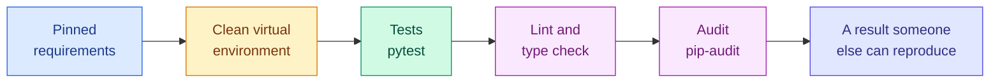

# Testing and Package Management

**Level:** 🟡 Intermediate &nbsp;|&nbsp; **Effort:** Detailed module &nbsp;|&nbsp; **Module:** [01 Python Foundations](README.md)

---

## 🎯 Learning Objectives

By the end of this topic you will be able to:

- Write and run tests with pytest, and read a failure report
- Choose what is worth testing in machine-learning code — and what is not
- Test floating-point results, expected exceptions, and code that touches files
- Keep tests off the network with `monkeypatch`
- Explain why dependencies are pinned, and what `pip freeze` gets wrong
- Reproduce someone else's environment from their requirements file

## 📚 Prerequisites

[Topic 8: Type Hints, Dataclasses, Logging and Debugging](08-type-hints-dataclasses-logging-debugging.md)

---

## 1. Why test machine-learning code

The recurring theme of the last two topics: ML code fails by producing a **plausible wrong number**.
Nothing crashes. Tests are how that becomes visible.

The highest-value tests are almost never about the model. They are about the boring code around it —
the loader that drops a row, the split that overlaps, the metric that divides by the wrong
denominator. **That code decides whether your results mean anything, and it is completely
deterministic**, which makes it perfectly testable.

---

## 2. pytest in five minutes

pytest finds files named `test_*.py`, functions named `test_*`, and uses plain `assert`.

```bash
pip install -r requirements-dev.txt      # pytest is pinned there
pytest -q                                # run everything
pytest tests/test_metrics.py             # one file
pytest -k "leakage"                      # tests whose name matches
pytest -x                                # stop at the first failure
```

Here is a complete run — a passing test and a failing one — executed for real:

```python
import re
import subprocess
import sys
import tempfile
from pathlib import Path

test_source = '''
def accuracy(correct, total):
    return correct / total


def test_all_correct():
    assert accuracy(50, 50) == 1.0


def test_typical_case():
    assert accuracy(43, 50) == 0.9
'''

with tempfile.TemporaryDirectory() as tmp:
    path = Path(tmp) / "test_metrics.py"
    path.write_text(test_source, encoding="utf-8")
    result = subprocess.run(
        [sys.executable, "-m", "pytest", "-q", "-p", "no:cacheprovider", str(path)],
        capture_output=True,
        text=True,
        cwd=tmp,
    )

output = result.stdout.replace(str(path), "test_metrics.py").replace(tmp + "/", "")
print(re.sub(r" in [\d.]+s", " in 0.01s", output))
```

**Output:**
```
.F                                                                       [100%]
=================================== FAILURES ===================================
______________________________ test_typical_case _______________________________

    def test_typical_case():
>       assert accuracy(43, 50) == 0.9
E       assert 0.86 == 0.9
E        +  where 0.86 = accuracy(43, 50)

test_metrics.py:11: AssertionError
=========================== short test summary info ============================
FAILED test_metrics.py::test_typical_case - assert 0.86 == 0.9
1 failed, 1 passed in 0.01s
```

> The `subprocess` wrapper is only so this page can show you a genuine run. **You would just type
> `pytest`.** The timestamp is normalised because `scripts/check_examples.py` compares this output
> exactly, and a duration changes every run.

Look at what the failure told you: not "assertion failed", but `assert 0.86 == 0.9` **and** where the
`0.86` came from. That is pytest rewriting your `assert` statement to explain itself. It is the
reason pytest needs no special assertion methods.

### ⚠️ `assert` in tests, `raise` in code

[Topic 8](08-type-hints-dataclasses-logging-debugging.md) said never to validate input with
`assert`, because `python -O` strips it. That still holds. **Tests are the exception**: pytest is
never run with `-O`, and assertions are its entire interface. Validate with `raise` in your code;
assert in your tests.

### Anatomy of a good test

```python
def zero_division_safe_accuracy(correct, total):
    if total == 0:
        raise ValueError("total must be greater than 0")
    return correct / total


def test_accuracy_counts_only_correct_predictions():
    # Arrange - set up the inputs
    correct, total = 43, 50

    # Act - do the one thing under test
    result = zero_division_safe_accuracy(correct, total)

    # Assert - state the expected behaviour
    assert result == 0.86


test_accuracy_counts_only_correct_predictions()
print("passed")
```

**Output:**
```
passed
```

**The name is the specification.** `test_accuracy_counts_only_correct_predictions` tells a reader
what the code is supposed to do; `test_accuracy_2` tells them nothing. When it fails at 3am, the
name is the first thing anyone reads.

---

## 3. The four patterns you will use constantly

### Floating point: `pytest.approx`

[Topic 1](01-variables-and-data-types.md) showed that `0.1 + 0.2 != 0.3`. Every float assertion in
ML code hits this. Never compare floats with `==`.

```python
import pytest

mean = (0.1 + 0.2 + 0.3) / 3

print(f"exact equality:  {mean == 0.2}")
print(f"with approx:     {mean == pytest.approx(0.2)}")
print(f"explicit tolerance: {mean == pytest.approx(0.2, abs=1e-9)}")
```

**Output:**
```
exact equality:  False
with approx:     True
explicit tolerance: True
```

`approx` works on lists and dictionaries too, which makes it the right tool for comparing whole
vectors of predictions.

### Expected exceptions: `pytest.raises`

A function that is *supposed* to reject bad input needs a test proving it does — otherwise nothing
stops someone deleting the check.

```python
import pytest


def train_test_split(data, test_fraction):
    if not 0 < test_fraction < 1:
        raise ValueError(f"test_fraction must be in (0, 1), got {test_fraction}")
    cut = int(len(data) * (1 - test_fraction))
    return data[:cut], data[cut:]


with pytest.raises(ValueError, match="must be in"):
    train_test_split([1, 2, 3, 4], test_fraction=20)

print("the guard is tested, so it cannot be quietly removed")
```

**Output:**
```
the guard is tested, so it cannot be quietly removed
```

**Use `match=`.** Without it the test passes on *any* `ValueError` — including one raised by a bug
somewhere else entirely, which is how a test starts passing for the wrong reason.

### Many cases, one test: `parametrize`

```python
import re
import subprocess
import sys
import tempfile
from pathlib import Path

test_source = '''
import pytest


def normalise_label(raw):
    return raw.strip().lower()


@pytest.mark.parametrize(
    "raw, expected",
    [
        ("cat", "cat"),
        ("  CAT  ", "cat"),
        ("Cat", "cat"),
        ("", ""),
    ],
)
def test_normalise_label(raw, expected):
    assert normalise_label(raw) == expected
'''

with tempfile.TemporaryDirectory() as tmp:
    path = Path(tmp) / "test_labels.py"
    path.write_text(test_source, encoding="utf-8")
    result = subprocess.run(
        [sys.executable, "-m", "pytest", "-q", "-p", "no:cacheprovider", str(path)],
        capture_output=True,
        text=True,
        cwd=tmp,
    )

print(re.sub(r" in [\d.]+s", " in 0.01s", result.stdout.strip()))
```

**Output:**
```
....                                                                     [100%]
4 passed in 0.01s
```

Four independent tests from one function. Add a case by adding a tuple — and when one fails, pytest
names exactly which input broke, rather than failing a loop at an unknown iteration.

### Files: the `tmp_path` fixture

Tests that write into the repository leave mess behind and interfere with each other. `tmp_path` is
a fresh directory per test, cleaned up automatically.

```python
import re
import subprocess
import sys
import tempfile
from pathlib import Path

test_source = '''
def load_scores(path):
    """Return (scores, skipped) - see topic 5 on counting what you drop."""
    scores, skipped = [], 0
    with path.open(encoding="utf-8") as handle:
        for line in handle:
            line = line.strip()
            if not line:
                continue
            try:
                scores.append(float(line))
            except ValueError:
                skipped += 1
    return scores, skipped


def test_malformed_rows_are_counted_not_hidden(tmp_path):
    path = tmp_path / "scores.txt"
    path.write_text("0.9\\nnot-a-number\\n0.4\\n", encoding="utf-8")

    scores, skipped = load_scores(path)

    assert scores == [0.9, 0.4]
    assert skipped == 1
'''

with tempfile.TemporaryDirectory() as tmp:
    path = Path(tmp) / "test_loader.py"
    path.write_text(test_source, encoding="utf-8")
    result = subprocess.run(
        [sys.executable, "-m", "pytest", "-q", "-p", "no:cacheprovider", str(path)],
        capture_output=True,
        text=True,
        cwd=tmp,
    )

print(re.sub(r" in [\d.]+s", " in 0.01s", result.stdout.strip()))
```

**Output:**
```
.                                                                        [100%]
1 passed in 0.01s
```

`tmp_path` is a **fixture** — an argument pytest fills in for you. You can write your own with
`@pytest.fixture` to share setup (a small DataFrame, a fitted model) across tests.

---

## 4. Tests must not touch the network

A test that calls a real API is slow, costs money, fails when the network hiccups, and cannot run in
CI. Replace the call with `monkeypatch`.

```python
import re
import subprocess
import sys
import tempfile
from pathlib import Path

test_source = '''
import json
import urllib.request


def fetch_label(url):
    """Call a remote classifier. Never called for real in tests."""
    with urllib.request.urlopen(url) as response:
        return json.loads(response.read())["label"]


def summarise(urls, fetcher=fetch_label):
    return [fetcher(url) for url in urls]


def test_summarise_does_not_touch_the_network():
    calls = []

    def fake_fetcher(url):
        calls.append(url)
        return "positive"

    result = summarise(["http://example.invalid/a", "http://example.invalid/b"], fake_fetcher)

    assert result == ["positive", "positive"]
    assert len(calls) == 2
'''

with tempfile.TemporaryDirectory() as tmp:
    path = Path(tmp) / "test_remote.py"
    path.write_text(test_source, encoding="utf-8")
    result = subprocess.run(
        [sys.executable, "-m", "pytest", "-q", "-p", "no:cacheprovider", str(path)],
        capture_output=True,
        text=True,
        cwd=tmp,
    )

print(re.sub(r" in [\d.]+s", " in 0.01s", result.stdout.strip()))
```

**Output:**
```
.                                                                        [100%]
1 passed in 0.01s
```

Notice the design choice: `summarise` takes the fetcher as a parameter. **Code that accepts its
dependencies is testable without any mocking machinery at all.** When you cannot change the
signature, `monkeypatch.setattr` replaces the attribute for the duration of one test:

```python
# check-examples: skip
def test_with_monkeypatch(monkeypatch):
    monkeypatch.setattr(mymodule, "fetch_label", lambda url: "positive")
    assert mymodule.summarise(["http://example.invalid/a"]) == ["positive"]
```

pytest undoes it automatically when the test ends. Never patch by hand — a test that fails partway
through would leave the patch in place and corrupt every test after it.

---

## 5. What to test in ML code

This is where beginners go wrong in both directions — testing nothing, or trying to unit-test model
quality.

| Test this | Because |
| --- | --- |
| **Splits are disjoint** | `set(train).isdisjoint(set(test))` — the leakage check from [Topic 4](04-data-structures.md), as a one-line test |
| **Loaders count what they drop** | Silent row loss is invisible in every downstream metric |
| **Metric edge cases** | Empty input, all-one-class, zero denominators |
| **Shapes and dtypes** | `(n, features)` in, `(n,)` out — catches transposed matrices immediately |
| **Determinism under a fixed seed** | Two runs with the same seed must match, or nothing is reproducible |
| **Save/load round-trips** | A model that predicts differently after reloading is a real and common bug |
| **Preprocessing fitted on train only** | The `Pipeline` invariant from [Topic 6](06-object-oriented-programming.md) |

| Do **not** unit-test this | Instead |
| --- | --- |
| "Accuracy must exceed 0.85" | An evaluation gate on a fixed dataset, run separately from the test suite |
| Third-party library behaviour | Trust scikit-learn; test *your* use of it |
| Exact floating-point model weights | Brittle across platforms and versions — assert behaviour, not internals |

A quality threshold *does* belong in your pipeline — it just is not a unit test. Unit tests must be
fast and deterministic; a training run is neither. Keep them in separate commands so a flaky metric
never blocks a typo fix.

### The leakage test, in full

```python
def split_by_user(user_ids, test_fraction=0.25):
    """Split so that no user appears on both sides - the correct split for user-level data."""
    unique = sorted(set(user_ids))
    cut = int(len(unique) * (1 - test_fraction))
    train_users, test_users = set(unique[:cut]), set(unique[cut:])
    return train_users, test_users


def test_no_user_appears_in_both_splits():
    train_users, test_users = split_by_user(["u1", "u2", "u3", "u4", "u1", "u2"])
    assert train_users.isdisjoint(test_users), (
        f"leakage: {train_users & test_users} appear in both splits"
    )


test_no_user_appears_in_both_splits()
print("no overlap")
```

**Output:**
```
no overlap
```

Six lines, and it permanently rules out the single most expensive mistake in applied machine
learning. **Write this test before you write the model.**

### 💰 Coverage is a floor, not a goal

`pytest --cov` reports which lines ran. Useful for finding untested modules — but a line that ran is
not a line that was *checked*. A test suite calling every function and asserting nothing scores 100%.
Chase uncovered code that matters; do not chase the number.

---

## 6. Package management

### 🍰 Simple explanation

Your code depends on other people's code. Package management is recording **exactly which versions**
so that the program that worked today also works next month, and on someone else's machine.

### The virtual environment, restated

[00 Getting Started](../00-getting-started/README.md) walked through creating one. The reason,
now that you have written a package: **each project gets its own set of installed libraries.**
Without that, two projects needing different NumPy versions cannot coexist.

```bash
python3 -m venv .venv
source .venv/bin/activate          # Windows: .\.venv\Scripts\Activate.ps1
which python                       # confirms you are inside it
```

**If `which python` does not point inside `.venv`, nothing you install next goes where you think.**

### Two requirements files, on purpose

This repository ships the split you should copy:

| File | Holds | Who installs it |
| --- | --- | --- |
| `requirements.txt` | What the code needs to **run** — NumPy, pandas, scikit-learn | Everyone |
| `requirements-dev.txt` | What you need to **develop** — pytest, ruff, mypy | Contributors |

A learner following a lesson should not have to install a linter. Equally, CI must check that
`requirements.txt` works *alone* — this repository has a `learner-install` job doing exactly that,
added after a broken pin shipped unnoticed because CI only ever installed the dev file.

### Pin exact versions

```text
numpy==2.1.3          # exact - reproducible
numpy>=2.0            # a range - "whatever is newest today"
numpy                 # unpinned - a different library every install
```

`>=` and unpinned dependencies mean the version you get depends on **the day you install**. A
notebook that trained fine in March fails in June because a transitive dependency changed a default.
For teaching material and for production, pin with `==`.

### ⚠️ `pip freeze > requirements.txt` is not the answer

It is the most common advice and it is wrong for a top-level requirements file:

- It records **every** installed package, including transitive dependencies you never asked for and
  leftovers from experiments you abandoned
- It captures **platform-specific** packages, so a file written on Windows may not install on Linux
- It loses the distinction between "I need this" and "something else needed this", so nothing can
  ever be safely removed

**Write down what you actually import, pin it, and install into a clean virtual environment to prove
the set resolves.** That last step is not optional — a mutually incompatible pair of pins looks fine
on a machine that already has compatible versions installed. That exact failure has happened in this
repository, which is why it is now a documented rule in
[`CONTENT_CHECKLIST.md`](../CONTENT_CHECKLIST.md).

For projects that need full transitive locking, tools such as `pip-compile` (pip-tools), Poetry and
uv generate a lock file from your top-level list. That is the right answer at production scale; the
two-file split above is the right answer while learning.

### Version numbers mean something

`2.1.3` is `MAJOR.MINOR.PATCH` — a **major** bump is allowed to break your code, a **minor** adds
features compatibly, a **patch** fixes bugs. Python's packaging rules formalise this in
[PEP 440](https://peps.python.org/pep-0440/).

```python
def parse_version(text):
    return tuple(int(part) for part in text.split("."))


installed, required = parse_version("2.1.3"), parse_version("2.0.0")

print(f"installed >= required: {installed >= required}")
print(f"same major version:    {installed[0] == required[0]}")
print(f"safe to upgrade blind: {installed[0] == required[0]}")
```

**Output:**
```
installed >= required: True
same major version:    True
safe to upgrade blind: True
```

> Real version comparison is harder than tuple ordering — `1.0.0rc1`, `2.0.0.post1` and `1.0` all
> break the naive version above. Use `packaging.version.Version` when it matters. The point here is
> only what the three numbers *mean*.

### Installing your own package

From [Topic 5](05-files-exceptions-and-modules.md): once your project has a `pyproject.toml`,

```bash
pip install -e .
```

installs it in **editable** mode — importable from anywhere, while your edits take effect
immediately. This is the correct fix for `ModuleNotFoundError` on your own code, and the reason
`sys.path.append` never needs to appear in your project.

### 🔐 Security note

Dependencies are the most common way untrusted code enters a project. Three habits:

- **Audit your pins.** `pip-audit` checks them against known-vulnerability databases. This
  repository runs it weekly as a blocking gate — an advisory-only audit had already let twelve known
  vulnerabilities ship.
- **Check the name before installing.** Typo-squatted packages on PyPI rely on you typing
  `panads` or `python-dateutils`. Copy names from official documentation.
- **Never `pip install` from an untrusted source**, and treat a package's install step as code
  execution — because it is.

Pinning is a security control as much as a reproducibility one: an unpinned dependency means a
compromised release installs itself the next time anyone runs `pip install`.

---

## 7. Putting it together



That chain is this repository's own CI, and you can run all of it locally:

```bash
pytest -q
ruff check .
python scripts/check_links.py
python scripts/check_examples.py
```

---

## 🧪 Hands-on exercise

Write the test file you would want on the day a data pipeline breaks. Three properties, no model
involved.

```python
def split_by_user(rows, test_fraction=0.25):
    """rows are (user_id, text, label). Split by user so no user spans both sides."""
    if not 0 < test_fraction < 1:
        raise ValueError(f"test_fraction must be in (0, 1), got {test_fraction}")
    users = sorted({user for user, _, _ in rows})
    cut = int(len(users) * (1 - test_fraction))
    train_users = set(users[:cut])
    train = [row for row in rows if row[0] in train_users]
    test = [row for row in rows if row[0] not in train_users]
    return train, test


ROWS = [
    ("u1", "great", "pos"), ("u2", "awful", "neg"),
    ("u3", "fine", "pos"), ("u4", "bad", "neg"),
    ("u1", "loved it", "pos"),
]


def test_no_user_spans_both_splits():
    train, test = split_by_user(ROWS)
    assert {user for user, _, _ in train}.isdisjoint({user for user, _, _ in test})


def test_no_row_is_lost_or_duplicated():
    train, test = split_by_user(ROWS)
    assert len(train) + len(test) == len(ROWS)


def test_invalid_fraction_is_rejected():
    try:
        split_by_user(ROWS, test_fraction=20)
    except ValueError as error:
        assert "must be in" in str(error)
    else:
        raise AssertionError("expected a ValueError")


for test in [test_no_user_spans_both_splits, test_no_row_is_lost_or_duplicated,
             test_invalid_fraction_is_rejected]:
    test()
    print(f"passed: {test.__name__}")
```

**Output:**
```
passed: test_no_user_spans_both_splits
passed: test_no_row_is_lost_or_duplicated
passed: test_invalid_fraction_is_rejected
```

> The loop at the bottom exists so this page can show a real run. In a project you would save this as
> `tests/test_splits.py` and type `pytest`, and the last block would not exist.

**Extend it:** convert the third test to `pytest.raises`, add a `@pytest.mark.parametrize` case for
several invalid fractions, and add a test asserting the split is **deterministic** — that calling it
twice returns identical results.

---

## 🎤 Interview questions

**"What would you test in a machine-learning pipeline?"**

The deterministic parts, which is most of it: that splits are disjoint at the right granularity
(user, session, time), that loaders report rather than hide dropped rows, that metrics handle empty
and single-class input, that shapes and dtypes match the declared contract, that a fixed seed
reproduces a run, and that a model saved and reloaded predicts identically. Model *quality* belongs
to an evaluation gate on a fixed dataset, not to the unit test suite — unit tests must be fast and
deterministic, and training is neither.

**"Why not just `pip freeze > requirements.txt`?"**

It captures the entire environment rather than your actual dependencies: transitive packages,
platform-specific ones, and leftovers from abandoned experiments. It also erases the distinction
between what you need and what something else pulled in, so nothing can ever be safely removed.
Maintain a hand-written top-level list with exact pins, and use a lock file tool if you need
transitive pinning too.

**"How do you keep tests from becoming flaky?"**

No network, no clock, no unseeded randomness, no dependence on test ordering or on files outside a
temporary directory. Inject dependencies so they can be replaced without patching. Anything
genuinely non-deterministic — a training run, an external API — belongs behind a marker so it can be
excluded from the fast suite.

**"What does a virtual environment actually do?"**

It creates a directory with its own `site-packages` and its own interpreter symlink, and prepends it
to `PATH` when activated. `pip install` then writes there instead of into the system Python, so each
project's dependencies are isolated and no project can break another — or the operating system's own
Python tooling.

---

## ✅ Key takeaways

- pytest finds `test_*.py` and `test_*` functions, and **rewrites `assert` to explain the failure.**
- `assert` in tests, `raise` in code — `-O` strips asserts, and tests never run under `-O`.
- The test name is the specification. Write it as a sentence about behaviour.
- Never compare floats with `==`. Use `pytest.approx`.
- `pytest.raises(..., match=...)` — without `match` the test passes on the wrong exception.
- `parametrize` for many cases; `tmp_path` for files; fixtures for shared setup.
- **Tests must not touch the network.** Better still, accept dependencies as parameters.
- Test splits, loaders, shapes, determinism and round-trips. **Do not unit-test model accuracy.**
- Coverage finds untested code; it does not prove tested code is correct.
- Pin with `==`, keep runtime and dev requirements separate, and **install into a clean environment
  to prove the set resolves.**
- `pip freeze` records your environment, not your dependencies.
- Audit your pins. An unpinned dependency is a supply-chain exposure, not just a reproducibility one.

---

## 📚 Official References

- [pytest documentation — pytest-dev](https://docs.pytest.org/en/stable/) — verified 2026-07-27
- [pytest: How to write and report assertions — pytest-dev](https://docs.pytest.org/en/stable/how-to/assert.html) — verified 2026-07-27
- [pytest: How to use fixtures — pytest-dev](https://docs.pytest.org/en/stable/how-to/fixtures.html) — verified 2026-07-27
- [pytest: How to monkeypatch/mock modules and environments — pytest-dev](https://docs.pytest.org/en/stable/how-to/monkeypatch.html) — verified 2026-07-27
- [unittest.mock — Python Software Foundation](https://docs.python.org/3/library/unittest.mock.html) — verified 2026-07-27
- [venv — Python Software Foundation](https://docs.python.org/3/library/venv.html) — verified 2026-07-27
- [pip documentation — Python Packaging Authority](https://pip.pypa.io/en/stable/) — verified 2026-07-27
- [Python Packaging User Guide — Python Packaging Authority](https://packaging.python.org/en/latest/) — verified 2026-07-27
- [PEP 440: Version Identification and Dependency Specification — Python Software Foundation](https://peps.python.org/pep-0440/) — verified 2026-07-27
- [pip-audit — Python Packaging Authority](https://github.com/pypa/pip-audit) — verified 2026-07-27

---

## 🔗 Navigation

[← Topic 8: Type Hints, Dataclasses, Logging and Debugging](08-type-hints-dataclasses-logging-debugging.md) &nbsp;|&nbsp;
[Module home](README.md) &nbsp;|&nbsp;
[Topic 10: Working with JSON, CSV and APIs →](10-json-csv-and-apis.md)
