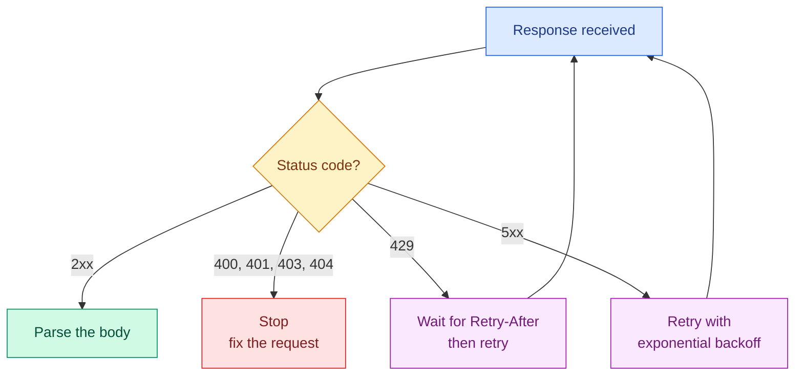

# Working with JSON, CSV and APIs

**Level:** 🟡 Intermediate &nbsp;|&nbsp; **Effort:** Detailed module &nbsp;|&nbsp; **Module:** [01 Python Foundations](README.md)

---

## 🎯 Learning Objectives

By the end of this topic you will be able to:

- Read and write JSON, including the cases that silently produce invalid files
- Use JSON Lines (JSONL), the format almost every language-model dataset arrives in
- Read and write CSV correctly — including the two bugs everyone hits once
- Call an HTTP API with a timeout, check the status, and parse the response
- Page through an API without loading everything into memory
- Keep credentials out of your code and out of your logs

## 📚 Prerequisites

[Topic 9: Testing and Package Management](09-testing-and-package-management.md)

---

## 1. Where your data actually comes from

Before a dataset is a DataFrame, it is a file or a response. Three formats cover nearly all of it:

| Format | You meet it as | Strength | Weakness |
| --- | --- | --- | --- |
| **JSON** | API responses, configs | Nested structures, self-describing | Whole file must be parsed at once |
| **JSONL** | LLM training and evaluation sets | Streamable, appendable, one record per line | No schema, larger than binary formats |
| **CSV** | Exports, tabular datasets | Universal, human-readable | No types, no nesting, quoting is fiddly |

The fourth — **Parquet** — is what you graduate to for large tabular data, and it belongs with
storage in [03 Data Foundations](../03-data-foundations/README.md).

---

## 2. JSON

### 🍰 Simple explanation

JavaScript Object Notation (JSON) is a text format for nested data. Python's `json` module converts
between JSON text and Python objects.

### ⚙️ Four functions, and which is which

| Function | Direction | Works on |
| --- | --- | --- |
| `json.loads` | text → Python | a string (**s** for string) |
| `json.load` | file → Python | an open file object |
| `json.dumps` | Python → text | returns a string |
| `json.dump` | Python → file | writes to an open file |

```python
import json

text = '{"model": "logreg", "accuracy": 0.86, "tuned": true, "notes": null, "tags": ["baseline"]}'

record = json.loads(text)

for key, value in record.items():
    print(f"{key:<9} {str(value):<12} {type(value).__name__}")
```

**Output:**
```
model     logreg       str
accuracy  0.86         float
tuned     True         bool
notes     None         NoneType
tags      ['baseline'] list
```

Note the conversions: JSON `true` became Python `True`, and `null` became `None`. **JSON has no
tuples, no sets, no dates and no NaN** — a fact that causes every problem in the next section.

### Writing readable JSON

```python
import json

config = {"epochs": 10, "learning_rate": 0.01, "name": "café-baseline"}

print(json.dumps(config))
print(json.dumps(config, indent=2, sort_keys=True))
print(json.dumps(config, ensure_ascii=False))
```

**Output:**
```
{"epochs": 10, "learning_rate": 0.01, "name": "caf\u00e9-baseline"}
{
  "epochs": 10,
  "learning_rate": 0.01,
  "name": "caf\u00e9-baseline"
}
{"epochs": 10, "learning_rate": 0.01, "name": "café-baseline"}
```

**Look at what happened to `café`.** By default `json.dumps` escapes every non-ASCII character, so
the file is valid but unreadable — and a dataset of French, Hindi or Chinese text becomes a wall of
`\uXXXX`. Only the third line, with `ensure_ascii=False`, keeps it legible. The escaped form parses
back identically; this is about whether a human can review the data.

**`sort_keys=True` is worth a habit** too: it makes two config files comparable with `diff`, and
makes a hash of the config stable.

### ⚠️ Three JSON traps

```python
import json
from datetime import date

# 1. NaN and Infinity are not valid JSON, but Python emits them by default
print(json.dumps({"score": float("nan")}))
try:
    json.dumps({"score": float("nan")}, allow_nan=False)
except ValueError as error:
    # Python 3.12 appends the offending value to this message; trim it so the
    # output below is the same on every supported interpreter.
    print(f"   strict mode refuses it: {str(error).split(':')[0]}")

# 2. Dates are not serialisable at all
try:
    json.dumps({"run_date": date(2026, 7, 27)})
except TypeError as error:
    print(f"2. {error}")
print(f"   fix: {json.dumps({'run_date': date(2026, 7, 27).isoformat()})}")

# 3. Dictionary keys are always strings after a round trip
original = {1: "cat", 2: "dog"}
restored = json.loads(json.dumps(original))
print(f"3. {original} -> {restored}")
```

**Output:**
```
{"score": NaN}
   strict mode refuses it: Out of range float values are not JSON compliant
2. Object of type date is not JSON serializable
   fix: {"run_date": "2026-07-27"}
3. {1: 'cat', 2: 'dog'} -> {'1': 'cat', '2': 'dog'}
```

The first is the dangerous one. `{"score": NaN}` is **not valid JSON** — Python writes it happily and
some other parser, in some other language, rejects your file weeks later. If the file leaves your
process, pass `allow_nan=False` and decide explicitly what a missing score should be.

### Reading nested responses without crashing

API responses are nested and inconsistent. `response["data"]["items"][0]["label"]` raises `KeyError`
or `IndexError` the first time a field is absent.

```python
response = {
    "data": {"items": [{"label": "positive", "score": 0.91}]},
    "meta": {"request_id": "abc123"},
}

empty = {"data": {"items": []}, "meta": {}}


def first_label(payload):
    """Reach into the response defensively, with a sensible fallback."""
    items = payload.get("data", {}).get("items", [])
    if not items:
        return None
    return items[0].get("label")


print(f"populated: {first_label(response)}")
print(f"empty:     {first_label(empty)}")
```

**Output:**
```
populated: positive
empty:     None
```

**Chained `.get()` with defaults is the readable version of six nested `if` statements.** For
anything more complex than this, validate the whole payload once at the boundary — a dataclass with
`__post_init__` from [Topic 8](08-type-hints-dataclasses-logging-debugging.md), or a library such as
Pydantic — rather than defending at every access.

---

## 3. JSON Lines

### 🍰 Simple explanation

One JSON object per line. No enclosing array, no commas between records.

```text
{"text": "great film", "label": "positive"}
{"text": "awful", "label": "negative"}
```

This is the format for fine-tuning datasets, evaluation sets and logged model outputs, for three
reasons: you can **append** a record without rewriting the file, you can **stream** it one line at a
time, and one corrupt line does not destroy the rest.

```python
import json
import tempfile
from pathlib import Path

records = [
    {"text": "great film", "label": "positive"},
    {"text": "awful", "label": "negative"},
    {"text": "not bad", "label": "positive"},
]

with tempfile.TemporaryDirectory() as tmp:
    path = Path(tmp) / "reviews.jsonl"

    with path.open("w", encoding="utf-8") as handle:
        for record in records:
            handle.write(json.dumps(record, ensure_ascii=False) + "\n")

    # Appending one more record does not touch what is already there
    with path.open("a", encoding="utf-8") as handle:
        handle.write(json.dumps({"text": "loved it", "label": "positive"}) + "\n")

    def read_jsonl(path):
        """Yield one record at a time, reporting bad lines instead of dying."""
        with path.open(encoding="utf-8") as handle:
            for number, line in enumerate(handle, start=1):
                line = line.strip()
                if not line:
                    continue
                try:
                    yield json.loads(line)
                except json.JSONDecodeError as error:
                    print(f"  line {number} is not valid JSON: {error.msg}")

    for record in read_jsonl(path):
        print(f"{record['label']:<9} {record['text']}")
```

**Output:**
```
positive  great film
negative  awful
positive  not bad
positive  loved it
```

That reader is a generator — [Topic 7](07-pythonic-patterns.md) — so a 40 GB JSONL file costs you one
line of memory. A single 40 GB JSON *array* would have to be parsed in full before you saw record
one.

---

## 4. CSV

### ⚠️ Do not split on commas

The bug everyone writes once:

```python
line = 'The film, surprisingly, was great,positive'

print(f"naive split:  {line.split(',')}")

import csv
import io

# The same line as it actually appears in a CSV file: the free-text field is quoted.
csv_line = '"The film, surprisingly, was great",positive'

print(f"csv module:   {next(csv.reader(io.StringIO(csv_line)))}")
```

**Output:**
```
naive split:  ['The film', ' surprisingly', ' was great', 'positive']
csv module:   ['The film, surprisingly, was great', 'positive']
```

A comma inside quoted text is data, not a separator. Free-text columns — reviews, comments, product
descriptions — contain commas constantly. **Always use the `csv` module.**

### `DictReader` and `DictWriter`

Reading rows as dictionaries means your code refers to `row["label"]`, not `row[3]` — which survives
someone adding a column.

```python
import csv
import tempfile
from pathlib import Path

rows = [
    {"text": "The film, surprisingly, was great", "label": "positive", "score": 0.91},
    {"text": 'He said "no"', "label": "negative", "score": 0.12},
]

with tempfile.TemporaryDirectory() as tmp:
    path = Path(tmp) / "reviews.csv"

    with path.open("w", encoding="utf-8", newline="") as handle:
        writer = csv.DictWriter(handle, fieldnames=["text", "label", "score"])
        writer.writeheader()
        writer.writerows(rows)

    print("--- file on disk ---")
    print(path.read_text(encoding="utf-8"), end="")

    print("--- parsed back ---")
    with path.open(encoding="utf-8", newline="") as handle:
        for row in csv.DictReader(handle):
            print(f"{row['label']:<9} {row['score']:<5} {row['text']}")
```

**Output:**
```
--- file on disk ---
text,label,score
"The film, surprisingly, was great",positive,0.91
"He said ""no""",negative,0.12
--- parsed back ---
positive  0.91  The film, surprisingly, was great
negative  0.12  He said "no"
```

The module quoted the comma-bearing field and doubled the internal quotes, then read both back
exactly. You would not have got that right by hand.

### ⚠️ `newline=""` is not optional

Open a CSV file without it and on Windows you get a blank line between every row, because the `csv`
module handles line endings itself and the file object translates them a second time. It is in the
documentation, it looks like a typo, and it is required.

### ⚠️ CSV has no types

Every value read from a CSV file is a **string**. Nothing warns you.

```python
import csv
import io

text = "label,score\npositive,0.91\nnegative,0.12\n"

rows = list(csv.DictReader(io.StringIO(text)))

first = rows[0]["score"]
print(f"value {first!r} has type {type(first).__name__}")
print(f"sum of strings: {rows[0]['score'] + rows[1]['score']}")
print(f"converted:      {float(rows[0]['score']) + float(rows[1]['score'])}")
```

**Output:**
```
value '0.91' has type str
sum of strings: 0.910.12
converted:      1.03
```

`"0.91" + "0.12"` is `"0.910.12"` — concatenation, not addition, and no error. **Convert types at
the boundary**, immediately after reading, and count what fails to convert rather than dropping it
silently ([Topic 5](05-files-exceptions-and-modules.md)).

---

## 5. HTTP APIs

### The status codes you must recognise

| Code | Means | Your move |
| --- | --- | --- |
| 200 | OK | Parse it |
| 201 | Created | Parse it |
| 400 | Bad request | **Your** payload is wrong — fix the call, do not retry |
| 401 / 403 | Unauthenticated / forbidden | Credential problem — do not retry |
| 404 | Not found | The resource does not exist — do not retry |
| 429 | Too many requests | Slow down — retry after the `Retry-After` delay |
| 500 / 502 / 503 | Server-side failure | Transient — retry with backoff |



**The split that matters: 4xx means stop, 5xx and 429 mean wait and try again.** Retrying a 400
forever is a common and pointless bug.

### A real request

The examples below start a small HTTP server on `localhost` and call it for real. **No external
network is involved** — which is the same reason your tests must not touch one
([Topic 9](09-testing-and-package-management.md)).

```python
import json
import threading
from http.server import BaseHTTPRequestHandler, HTTPServer

import requests


class Handler(BaseHTTPRequestHandler):
    def do_GET(self):
        if self.path.startswith("/reviews"):
            status, body = 200, {"items": [{"id": 1, "text": "great"}]}
        else:
            status, body = 404, {"error": "not found"}
        payload = json.dumps(body).encode("utf-8")
        self.send_response(status)
        self.send_header("Content-Type", "application/json")
        self.send_header("Content-Length", str(len(payload)))
        self.end_headers()
        self.wfile.write(payload)

    def log_message(self, *args):
        pass                    # keep the test output clean


server = HTTPServer(("127.0.0.1", 0), Handler)
threading.Thread(target=server.serve_forever, daemon=True).start()
base = f"http://127.0.0.1:{server.server_address[1]}"

response = requests.get(f"{base}/reviews", params={"limit": 10}, timeout=10)

print(f"status:       {response.status_code}")
print(f"content type: {response.headers['Content-Type']}")
print(f"parsed:       {response.json()['items']}")

missing = requests.get(f"{base}/nope", timeout=10)
print(f"missing:      {missing.status_code}")
try:
    missing.raise_for_status()
except requests.HTTPError as error:
    print(f"raise_for_status: {type(error).__name__}")

server.shutdown()
```

**Output:**
```
status:       200
content type: application/json
parsed:       [{'id': 1, 'text': 'great'}]
missing:      404
raise_for_status: HTTPError
```

### ⚠️ Always pass a timeout

`requests` has **no default timeout**. Omit it and a hung server hangs your program forever — no
error, no traceback, a training job that appears to be running and is not.

```python
# check-examples: skip
requests.get(url)                  # can block indefinitely
requests.get(url, timeout=10)      # correct
```

Pass one on every single call. There is no situation where waiting forever is the behaviour you want.

### ⚠️ A 404 is not an exception

`requests` treats any response as success — including 404 and 500. `response.json()` on an error page
raises a confusing `JSONDecodeError` instead of telling you the request failed. **Call
`raise_for_status()`, or check `response.ok`, before you parse.**

### Pagination as a generator

APIs return data in pages. A generator ([Topic 7](07-pythonic-patterns.md)) turns that into a single
stream the caller can iterate, without holding every page in memory.

```python
import json
import threading
from http.server import BaseHTTPRequestHandler, HTTPServer
from urllib.parse import parse_qs, urlparse

import requests

PAGES = {
    "1": {"items": ["a", "b"], "next_page": "2"},
    "2": {"items": ["c", "d"], "next_page": "3"},
    "3": {"items": ["e"], "next_page": None},
}


class Handler(BaseHTTPRequestHandler):
    def do_GET(self):
        page = parse_qs(urlparse(self.path).query).get("page", ["1"])[0]
        payload = json.dumps(PAGES[page]).encode("utf-8")
        self.send_response(200)
        self.send_header("Content-Type", "application/json")
        self.send_header("Content-Length", str(len(payload)))
        self.end_headers()
        self.wfile.write(payload)

    def log_message(self, *args):
        pass


server = HTTPServer(("127.0.0.1", 0), Handler)
threading.Thread(target=server.serve_forever, daemon=True).start()
base = f"http://127.0.0.1:{server.server_address[1]}"


def fetch_all(url):
    """Yield every item across every page. One page in memory at a time."""
    page = "1"
    requests_made = 0
    while page is not None:
        response = requests.get(url, params={"page": page}, timeout=10)
        response.raise_for_status()
        payload = response.json()
        requests_made += 1
        yield from payload["items"]
        page = payload["next_page"]
    print(f"({requests_made} requests made)")


print(list(fetch_all(f"{base}/items")))

server.shutdown()
```

**Output:**
```
(3 requests made)
['a', 'b', 'c', 'd', 'e']
```

The `(3 requests made)` line prints *before* the list because `list()` must exhaust the generator
before it can print — a small reminder of how lazily generators actually run.

### Retrying, with backoff

Retry **transient** failures only, and wait longer each time. Hammering a struggling server at full
speed makes an outage worse.

```python
import itertools

CODES = [503, 503, 200]
RETRYABLE = {429, 500, 502, 503, 504}


def call_with_retry(codes, max_attempts=4, base_delay=0.5, sleep=lambda seconds: None):
    """Retry transient failures with exponential backoff. `sleep` is injected so this is testable."""
    for attempt, status in zip(itertools.count(1), codes):
        if status not in RETRYABLE:
            return f"finished with {status} after {attempt} attempt(s)"
        if attempt == max_attempts:
            return f"giving up after {attempt} attempts, last status {status}"
        delay = base_delay * 2 ** (attempt - 1)
        print(f"  attempt {attempt}: status {status}, waiting {delay}s")
        sleep(delay)
    return "ran out of responses"


print(call_with_retry(CODES))
print(call_with_retry([400, 400]))
```

**Output:**
```
  attempt 1: status 503, waiting 0.5s
  attempt 2: status 503, waiting 1.0s
finished with 200 after 3 attempt(s)
finished with 400 after 1 attempt(s)
```

**The 400 returns immediately.** A malformed request will be malformed on the fourth attempt too.
Note also that `sleep` is a parameter — the injection idea from
[Topic 9](09-testing-and-package-management.md), which is why this example runs instantly instead of
pausing for 1.5 seconds.

> In production, use the retry support in `urllib3`/`requests` adapters or a library such as
> `tenacity` rather than hand-rolling. Write it once by hand to understand what it is doing, then
> use the maintained one. And honour `Retry-After` on a 429 — the server is telling you the answer.

---

## 6. 🔐 Credentials

**Never put an API key in your code.** Not in a notebook, not in a config file you commit, not in a
comment "temporarily". Anything committed to Git is in the history permanently, and public
repositories are scanned for keys within minutes.

```python
import os

api_key = os.environ.get("MODEL_API_KEY")

if not api_key:
    print("MODEL_API_KEY is not set - refusing to continue")
else:
    print(f"key loaded, {len(api_key)} characters")

headers = {"Authorization": f"Bearer {api_key}"} if api_key else {}
print(f"header keys sent: {list(headers)}")
```

**Output:**
```
MODEL_API_KEY is not set - refusing to continue
header keys sent: []
```

The workflow:

1. Put real values in `.env` — which is in `.gitignore`, already, in this repository
2. Document the *names* in `.env.example`, with empty values, and commit that
3. Load with `python-dotenv`, or export them in your shell
4. **Fail loudly when a key is missing.** A silent fallback to an unauthenticated call produces a
   confusing 401 much later

And from [Topic 8](08-type-hints-dataclasses-logging-debugging.md): log whether the key is present,
never its value. A key in a log file is a leaked key. See [`SECURITY.md`](../SECURITY.md).

### Treat API responses as untrusted input

A response is data from somewhere else. Never `eval` it, never `pickle.loads` it, and check the shape
before indexing into it. If you are feeding the text to a language model, remember it can contain
instructions — the prompt-injection problem covered in
[14 Prompt Engineering](../14-prompt-engineering/README.md).

---

## 🧪 Hands-on exercise

Build the small pipeline you will write a hundred times: fetch, validate, store as JSONL, export a
tabular summary as CSV.

```python
import csv
import io
import json


def validate(record):
    """Return a clean record, or None with a reason. Never trust the source's shape."""
    if not isinstance(record, dict):
        return None, f"not an object: {type(record).__name__}"
    text = record.get("text")
    label = record.get("label")
    if not isinstance(text, str) or not text.strip():
        return None, "missing or empty text"
    if label not in {"positive", "negative"}:
        return None, f"unexpected label {label!r}"
    return {"text": text.strip(), "label": label}, None


raw = [
    {"text": "great film", "label": "positive"},
    {"text": "   ", "label": "positive"},
    {"text": "awful", "label": "sad"},
    "not even an object",
    {"text": "awful", "label": "negative"},
    {"text": "The film, surprisingly, was great", "label": "positive"},
]

clean, rejected = [], []
for record in raw:
    result, reason = validate(record)
    (clean if result else rejected).append(result or reason)

print(f"kept {len(clean)}, rejected {len(rejected)}")
for reason in rejected:
    print(f"  rejected: {reason}")

jsonl = "\n".join(json.dumps(record, ensure_ascii=False) for record in clean)
print("--- jsonl ---")
print(jsonl)

buffer = io.StringIO()
writer = csv.DictWriter(buffer, fieldnames=["label", "text"], lineterminator="\n")
writer.writeheader()
for record in clean:
    writer.writerow({"label": record["label"], "text": record["text"]})
print("--- csv ---")
print(buffer.getvalue(), end="")
```

**Output:**
```
kept 3, rejected 3
  rejected: missing or empty text
  rejected: unexpected label 'sad'
  rejected: not an object: str
--- jsonl ---
{"text": "great film", "label": "positive"}
{"text": "awful", "label": "negative"}
{"text": "The film, surprisingly, was great", "label": "positive"}
--- csv ---
label,text
positive,great film
negative,awful
positive,"The film, surprisingly, was great"
```

**Extend it:** write both files to a `tmp_path` and add pytest tests asserting the record count
survives the round trip; add a `--limit` command-line argument with `argparse`; make `validate`
return a dataclass instead of a dictionary.

---

## 🎤 Interview questions

**"Why is JSONL preferred over JSON for large datasets?"**

Each line is an independent record, so the file can be appended to without rewriting, streamed
without loading it all into memory, split across workers at line boundaries, and survive one corrupt
record. A single JSON array must be parsed in full before you can read the first element, and adding
a record means rewriting the whole file.

**"What goes wrong when you parse CSV by splitting on commas?"**

Quoted fields containing commas get shredded — one review becomes four columns, and every subsequent
column shifts. Embedded quotes, embedded newlines and different delimiters break too. The `csv`
module implements the quoting rules; hand-rolled splitting silently corrupts exactly the free-text
columns you care about.

**"How should a client handle API errors?"**

Distinguish permanent from transient. 4xx other than 429 means the request itself is wrong — fail
fast and surface it. 429 and 5xx are transient — retry with exponential backoff and a cap, honouring
`Retry-After` when present. Always set a timeout, always check the status before parsing, and log
enough to diagnose without logging credentials or payload contents.

**"Where do API keys belong?"**

In the environment, loaded at runtime, never in source control. Commit a `.env.example` documenting
the names with empty values; keep the real `.env` gitignored. Fail loudly at startup when a required
key is missing, and never log the value — only whether it is present.

---

## ✅ Key takeaways

- `loads`/`dumps` for strings, `load`/`dump` for files. The **s** is for string.
- JSON has no dates, no tuples and no NaN. **`json.dumps` writes `NaN` anyway, producing invalid
  JSON** — pass `allow_nan=False` for anything leaving your process.
- Dictionary keys come back as strings after a JSON round trip.
- Use `sort_keys=True` so configs diff cleanly; `ensure_ascii=False` for non-English text.
- **JSONL for datasets**: appendable, streamable, corrupt-line tolerant.
- **Never split CSV on commas.** Use `csv`, open with `newline=""`, prefer `DictReader`.
- **Every CSV value is a string.** Convert at the boundary and count what fails.
- **`requests` has no default timeout.** Pass one on every call.
- A 404 is not an exception — call `raise_for_status()` before parsing.
- Retry 429 and 5xx with exponential backoff; never retry a 400.
- Credentials come from the environment, fail loudly when missing, and are never logged.

---

## 📚 Official References

- [json — Python Software Foundation](https://docs.python.org/3/library/json.html) — verified 2026-07-27
- [csv — Python Software Foundation](https://docs.python.org/3/library/csv.html) — verified 2026-07-27
- [urllib.request — Python Software Foundation](https://docs.python.org/3/library/urllib.request.html) — verified 2026-07-27
- [os.environ — Python Software Foundation](https://docs.python.org/3/library/os.html#os.environ) — verified 2026-07-27
- [Requests: HTTP for Humans — Python Software Foundation / Kenneth Reitz](https://requests.readthedocs.io/en/latest/) — verified 2026-07-27
- [RFC 8259: The JavaScript Object Notation (JSON) Data Interchange Format — IETF](https://datatracker.ietf.org/doc/html/rfc8259) — verified 2026-07-27
- [RFC 4180: Common Format and MIME Type for CSV Files — IETF](https://datatracker.ietf.org/doc/html/rfc4180) — verified 2026-07-27
- [HTTP response status codes — MDN Web Docs *(community resource)*](https://developer.mozilla.org/en-US/docs/Web/HTTP/Status) — verified 2026-07-27
- [JSON Lines *(community resource)*](https://jsonlines.org/) — verified 2026-07-27

---

## 🔗 Navigation

[← Topic 9: Testing and Package Management](09-testing-and-package-management.md) &nbsp;|&nbsp;
[Module home](README.md) &nbsp;|&nbsp;
[Topic 11: NumPy Essentials →](11-numpy-essentials.md)
