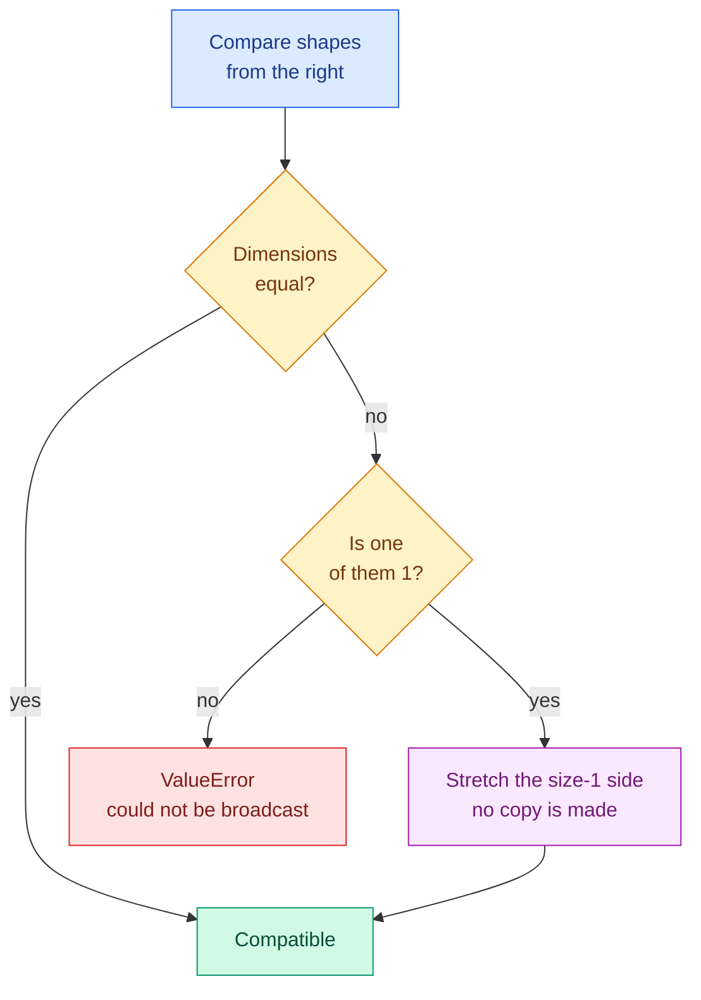

# NumPy Essentials

**Level:** 🟡 Intermediate &nbsp;|&nbsp; **Effort:** Detailed module &nbsp;|&nbsp; **Module:** [01 Python Foundations](README.md)

---

## 🎯 Learning Objectives

By the end of this topic you will be able to:

- Explain what an `ndarray` is and why it is not a list
- Create, reshape and index arrays, including boolean masks
- Predict when a slice is a **view** and when it is a copy
- Apply broadcasting deliberately, and read the error when it fails
- Get `axis=0` and `axis=1` right the first time
- Handle missing values without silently poisoning every statistic
- Load a real CSV file into arrays and find a faulty sensor in it

## 📚 Prerequisites

[Topic 10: Working with JSON, CSV and APIs](10-json-csv-and-apis.md), and the pinned environment:

```bash
pip install -r requirements.txt      # numpy==2.1.3
```

Every example below was executed with **NumPy 2.1.3**. Run the examples from the repository root,
since some of them read files from `datasets/samples/`.

---

## 1. Why NumPy exists

### 🍰 Simple explanation

A Python list is a box of loosely-related objects. A NumPy array is a **single block of memory
holding one type of number**, with the shape written on the outside.

### 🏠 Real-life analogy

A list is a shopping bag — anything can go in, and to find the heaviest item you must lift every one
out and weigh it. An array is an **egg carton**: fixed size, fixed slots, everything the same shape.
Because the layout is known in advance, whole-carton operations happen at once.

### ⚙️ The difference, concretely

```python
import numpy as np

prices_list = [100, 200, 300]
prices_array = np.array([100, 200, 300])

print(f"list  * 2 -> {prices_list * 2}")
print(f"array * 2 -> {prices_array * 2}")
```

**Output:**
```
list  * 2 -> [100, 200, 300, 100, 200, 300]
array * 2 -> [200 400 600]
```

**Same syntax, completely different meaning.** `*` on a list repeats it; on an array it multiplies
every element. Nearly all numerical Python assumes the second behaviour, which is why arrays — not
lists — are the substrate for pandas, scikit-learn and PyTorch.

The speed difference is the other half. Rather than quote a number that depends on your machine,
measure it:

```python
import time

import numpy as np

values = list(range(200_000))
array = np.arange(200_000)

start = time.perf_counter()
python_result = sum(value * value for value in values)
python_seconds = time.perf_counter() - start

start = time.perf_counter()
numpy_result = int(np.sum(array * array))
numpy_seconds = time.perf_counter() - start

print(f"same answer:  {python_result == numpy_result}")
print(f"numpy faster: {numpy_seconds < python_seconds}")
```

**Output:**
```
same answer:  True
numpy faster: True
```

> The result is printed as a **boolean, not a ratio**, on purpose. The speed-up depends on your CPU,
> your NumPy build and what else the machine is doing — a documented "42× faster" would be a
> fabrication on your hardware. Run it yourself and look at the two numbers.

The reason: the loop runs in compiled C over a contiguous block of memory, with no Python object
created per element.

---

## 2. Creating arrays, and `dtype`

```python
import numpy as np

print(f"from a list:  {np.array([1.5, 2.5, 3.5])}")
print(f"zeros:        {np.zeros(3)}")
print(f"ones 2x3:\n{np.ones((2, 3))}")
print(f"arange:       {np.arange(0, 10, 2)}")
print(f"linspace:     {np.linspace(0, 1, 5)}")
```

**Output:**
```
from a list:  [1.5 2.5 3.5]
zeros:        [0. 0. 0.]
ones 2x3:
[[1. 1. 1.]
 [1. 1. 1.]]
arange:       [0 2 4 6 8]
linspace:     [0.   0.25 0.5  0.75 1.  ]
```

`arange` takes a **step**; `linspace` takes a **count** and includes the endpoint. Reach for
`linspace` when you care about the number of points, `arange` when you care about the spacing.

### Shape, size and dtype

```python
import numpy as np

matrix = np.array([[1, 2, 3], [4, 5, 6]])

print(f"shape:  {matrix.shape}")
print(f"ndim:   {matrix.ndim}")
print(f"size:   {matrix.size}")
print(f"dtype:  {matrix.dtype}")
print(f"as float32: {matrix.astype(np.float32).dtype}")
```

**Output:**
```
shape:  (2, 3)
ndim:   2
size:   6
dtype:  int64
as float32: float32
```

### ⚠️ An array has exactly one type

Assigning a float into an integer array **truncates silently**:

```python
import numpy as np

counts = np.array([1, 2, 3])
counts[0] = 9.99

print(f"stored: {counts}   dtype: {counts.dtype}")

scores = np.array([1.0, 2.0, 3.0])
scores[0] = 9.99
print(f"stored: {scores}  dtype: {scores.dtype}")
```

**Output:**
```
stored: [9 2 3]   dtype: int64
stored: [9.99 2.   3.  ]  dtype: float64
```

`9.99` became `9`. No warning. **Check the dtype whenever numbers look wrong** — this is one of the
most common silent-wrong-answer bugs in numerical code.

### 💰 dtype is a memory decision

`float64` is the default and costs twice the memory of `float32`. On a 10-million-row feature matrix
that is the difference between 800 MB and 400 MB, and deep-learning frameworks default to `float32`
for exactly that reason.

```python
import numpy as np

values = np.ones(1_000_000)

print(f"float64: {values.nbytes / 1e6:.1f} MB")
print(f"float32: {values.astype(np.float32).nbytes / 1e6:.1f} MB")
print(f"float16: {values.astype(np.float16).nbytes / 1e6:.1f} MB")
```

**Output:**
```
float64: 8.0 MB
float32: 4.0 MB
float16: 2.0 MB
```

Precision is the trade. `float32` has roughly 7 decimal digits, `float16` roughly 3 — see
[Topic 1](01-variables-and-data-types.md) on why that matters for accumulated sums.

---

## 3. Indexing, slicing — and the view trap

```python
import numpy as np

matrix = np.array([[10, 11, 12], [20, 21, 22], [30, 31, 32]])

print(f"one element  matrix[1, 2]:   {matrix[1, 2]}")
print(f"whole row    matrix[1]:      {matrix[1]}")
print(f"whole column matrix[:, 1]:   {matrix[:, 1]}")
print(f"sub-block    matrix[:2, 1:]:\n{matrix[:2, 1:]}")
```

**Output:**
```
one element  matrix[1, 2]:   22
whole row    matrix[1]:      [20 21 22]
whole column matrix[:, 1]:   [11 21 31]
sub-block    matrix[:2, 1:]:
[[11 12]
 [21 22]]
```

`matrix[1, 2]` — one pair of brackets, row then column. `matrix[1][2]` also works but builds an
intermediate array, so prefer the comma.

### ⚠️ Slicing a list copies. Slicing an array does not.

This is the single most surprising difference for anyone arriving from plain Python:

```python
import numpy as np

original_list = [1, 2, 3, 4]
piece = original_list[:2]
piece[0] = 999
print(f"list stayed:    {original_list}")

original_array = np.array([1, 2, 3, 4])
view = original_array[:2]
view[0] = 999
print(f"array changed:  {original_array}")

safe = original_array[:2].copy()
safe[0] = -1
print(f"with .copy():   {original_array}")
```

**Output:**
```
list stayed:    [1, 2, 3, 4]
array changed:  [999   2   3   4]
with .copy():   [999   2   3   4]
```

A NumPy slice is a **view** — a window onto the same memory. Writing through it writes to the
original. This is a feature: slicing a 4 GB array costs nothing. It is also a bug waiting to happen
when you slice out a "training subset", modify it, and silently corrupt the full dataset.

**Rule: if you intend to modify a slice, call `.copy()`.** You can always check:

```python
import numpy as np

data = np.arange(6)
view = data[::2]
copy = data[::2].copy()

print(f"view shares memory: {np.shares_memory(data, view)}")
print(f"copy shares memory: {np.shares_memory(data, copy)}")
print(f"fancy index shares: {np.shares_memory(data, data[[0, 2, 4]])}")
```

**Output:**
```
view shares memory: True
copy shares memory: False
fancy index shares: False
```

Note the third line: indexing with a **list of positions** ("fancy indexing") always copies, while a
**slice** views. That asymmetry catches people out.

---

## 4. Boolean masks — the feature you will use most

Comparing an array to a value gives an array of booleans, which can then be used to select.

```python
import numpy as np

temperatures = np.array([18.2, 21.5, 148.0, 19.7, 20.1])

mask = temperatures > 40
print(f"mask:      {mask}")
print(f"selected:  {temperatures[mask]}")
print(f"how many:  {mask.sum()}")
print(f"any at all: {mask.any()}")
print(f"positions: {np.where(mask)[0]}")
```

**Output:**
```
mask:      [False False  True False False]
selected:  [148.]
how many:  1
any at all: True
positions: [2]
```

**`mask.sum()` counts `True` values** because `True` is 1 — the cleanest way to count matching rows
in the whole language.

### ⚠️ Use `&` and `|`, and bracket everything

```python
import numpy as np

temperatures = np.array([18.2, 21.5, 148.0, 19.7, 20.1])

plausible = (temperatures > 15) & (temperatures < 30)
print(f"plausible:  {temperatures[plausible]}")

try:
    temperatures[(temperatures > 15) and (temperatures < 30)]
except ValueError as error:
    print(f"'and' fails: {str(error)[:52]}...")
```

**Output:**
```
plausible:  [18.2 21.5 19.7 20.1]
'and' fails: The truth value of an array with more than one eleme...
```

Python's `and`/`or` ask for a single true-or-false answer, and an array of five booleans has no
single answer. Use `&` and `|` — and **wrap each comparison in parentheses**, because `&` binds
tighter than `>`.

### Replacing values conditionally

```python
import numpy as np

temperatures = np.array([18.2, 21.5, 148.0, 19.7])

cleaned = np.where(temperatures > 60, np.nan, temperatures)
print(f"cleaned:  {cleaned}")

clipped = np.clip(temperatures, 0, 45)
print(f"clipped:  {clipped}")
```

**Output:**
```
cleaned:  [18.2 21.5  nan 19.7]
clipped:  [18.2 21.5 45.  19.7]
```

`np.where(condition, if_true, if_false)` is the vectorised `if`. **Choose deliberately between the
two**: `nan` says "we do not know", `clip` says "we know it was at most 45". Clipping an impossible
sensor reading to 45 invents a measurement that was never taken.

---

## 5. Broadcasting

### 🍰 Simple explanation

When shapes do not match, NumPy stretches the smaller one — without copying — so the operation
works elementwise.

```python
import numpy as np

matrix = np.array([[1.0, 2.0, 3.0], [4.0, 5.0, 6.0]])

print(f"add a scalar:\n{matrix + 100}")
print(f"add a row (3,):\n{matrix + np.array([10, 20, 30])}")
print(f"add a column (2,1):\n{matrix + np.array([[100], [200]])}")
```

**Output:**
```
add a scalar:
[[101. 102. 103.]
 [104. 105. 106.]]
add a row (3,):
[[11. 22. 33.]
 [14. 25. 36.]]
add a column (2,1):
[[101. 102. 103.]
 [204. 205. 206.]]
```

### ⚙️ The rule

Compare shapes from the **right**. Dimensions are compatible when they are equal, or one of them
is 1.

```text
matrix   (2, 3)
row         (3,)   ->  (2, 3)   ✅  the row is reused for both rows
column   (2, 1)    ->  (2, 3)   ✅  the column is reused across all three columns
mismatch    (2,)   ->  error    ❌  3 and 2 are neither equal nor 1
```



```python
import numpy as np

matrix = np.ones((2, 3))

try:
    matrix + np.array([1.0, 2.0])
except ValueError as error:
    print(error)
```

**Output:**
```
operands could not be broadcast together with shapes (2,3) (2,) 
```

**Read the two shapes in that message right-to-left.** `3` against `2`: not equal, neither is 1, so
it fails. The fix is almost always to reshape the second operand to `(2, 1)` — you meant a column.

### 💻 Why it matters: standardising features

Standardisation — subtracting the mean and dividing by the standard deviation of each column — is
broadcasting in two lines, with no loop.

```python
import numpy as np

features = np.array([
    [100.0, 0.5],
    [150.0, 0.7],
    [200.0, 0.2],
    [250.0, 0.9],
])

means = features.mean(axis=0)
stds = features.std(axis=0)

standardised = (features - means) / stds

print(f"column means:  {means}")
print(f"column stds:   {stds.round(4)}")
print(f"standardised:\n{standardised.round(3)}")
print(f"new means:     {standardised.mean(axis=0).round(10)}")
print(f"new stds:      {standardised.std(axis=0)}")
```

**Output:**
```
column means:  [175.      0.575]
column stds:   [55.9017  0.2586]
standardised:
[[-1.342 -0.29 ]
 [-0.447  0.483]
 [ 0.447 -1.45 ]
 [ 1.342  1.257]]
new means:     [0. 0.]
new stds:      [1. 1.]
```

Two columns on wildly different scales (hundreds versus fractions) now both have mean 0 and standard
deviation 1. Distance-based models need this; without it the `100–250` column drowns out the other
entirely.

### 🔐 The leakage warning, again

`means` and `stds` must be computed on **training data only**, then applied unchanged to the test
set. Recomputing them over the full dataset leaks information about the test set into training —
the structural fix is the `Pipeline` from
[Topic 6](06-object-oriented-programming.md), and the topic is covered properly in
[03 Data Foundations](../03-data-foundations/README.md).

---

## 6. Axes

More NumPy confusion comes from `axis` than from anything else.

**`axis` names the dimension that disappears.**

```python
import numpy as np

matrix = np.array([[1, 2, 3], [4, 5, 6]])

print(f"matrix shape:            {matrix.shape}")
print(f"sum()          ->        {matrix.sum()}")
print(f"sum(axis=0)    -> {matrix.sum(axis=0)}   shape {matrix.sum(axis=0).shape}  (rows collapsed)")
print(f"sum(axis=1)    -> {matrix.sum(axis=1)}      shape {matrix.sum(axis=1).shape}  (columns collapsed)")
print(f"sum(axis=0, keepdims=True) shape {matrix.sum(axis=0, keepdims=True).shape}")
```

**Output:**
```
matrix shape:            (2, 3)
sum()          ->        21
sum(axis=0)    -> [5 7 9]   shape (3,)  (rows collapsed)
sum(axis=1)    -> [ 6 15]      shape (2,)  (columns collapsed)
sum(axis=0, keepdims=True) shape (1, 3)
```

With rows as samples and columns as features — the standard machine-learning layout — this becomes
easy to remember:

| You want | Use |
| --- | --- |
| One number **per feature** (column means) | `axis=0` |
| One number **per sample** (row totals) | `axis=1` |

`keepdims=True` keeps the collapsed dimension as `1`, so the result still broadcasts against the
original. It is the difference between `(3,)` and `(1, 3)`, and it is what makes
`matrix - matrix.mean(axis=1, keepdims=True)` work.

---

## 7. Missing values

`np.nan` is a float that means "not a number". **It contaminates every computation it touches.**

```python
import numpy as np

readings = np.array([18.2, np.nan, 19.7, 20.1])

print(f"mean:      {readings.mean()}")
print(f"nanmean:   {np.nanmean(readings):.4f}")
print(f"max:       {readings.max()}")
print(f"nanmax:    {np.nanmax(readings)}")
print(f"nan == nan: {np.nan == np.nan}")
print(f"isnan:      {np.isnan(readings)}")
print(f"how many:   {np.isnan(readings).sum()}")
```

**Output:**
```
mean:      nan
nanmean:   19.3333
max:       nan
nanmax:    20.1
nan == nan: False
isnan:      [False  True False False]
how many:   1
```

Three things to take away:

1. **One missing value makes the whole mean `nan`.** That is NumPy being honest, not broken.
2. Use the `nan`-aware functions — `nanmean`, `nanmax`, `nansum` — when skipping is what you want.
3. **`nan == nan` is `False`.** Never test for missing values with `==`; use `np.isnan`.

Skipping is a decision, not a default. Before reaching for `nanmean`, ask *why* the value is
missing — a sensor that fails when it is coldest produces missing values that are anything but
random, and dropping them biases the answer upward.

---

## 🧪 Hands-on lab: find the broken sensor

Real data, from this repository. The file has three sensors, some missing readings, one impossible
value and one sensor that quietly stopped changing — see
[`datasets/samples/README.md`](../datasets/samples/README.md).

```python
import numpy as np

data = np.genfromtxt(
    "datasets/samples/sensor_readings.csv",
    delimiter=",",
    names=True,
    dtype=None,
    encoding="utf-8",
)

sensor_ids = data["sensor_id"]
temperatures = data["temperature_c"]

print(f"rows loaded:      {len(data)}")
print(f"missing readings: {np.isnan(temperatures).sum()}")
print(f"naive mean:       {temperatures.mean()}")
print(f"nan-aware mean:   {np.nanmean(temperatures):.2f}")
print()
print(f"{'sensor':<8}{'n':>4}{'mean':>8}{'min':>8}{'max':>9}{'std':>8}")
for sensor in ["s-01", "s-02", "s-03"]:
    rows = temperatures[sensor_ids == sensor]
    print(
        f"{sensor:<8}{len(rows):>4}{np.nanmean(rows):>8.2f}"
        f"{np.nanmin(rows):>8.2f}{np.nanmax(rows):>9.2f}{np.nanstd(rows):>8.2f}"
    )
```

**Output:**
```
rows loaded:      240
missing readings: 2
naive mean:       nan
nan-aware mean:   18.14

sensor     n    mean     min      max     std
s-01      80   17.54   10.71    24.90    4.34
s-02      80   17.77   11.35    25.36    4.19
s-03      80   19.09   10.75   148.00   15.16
```

**Two faults are already visible.** `s-03` has a maximum of 148 °C — impossible — and a standard
deviation more than three times its neighbours', because that single value drags it up. The naive mean is
`nan` because two readings are missing.

The second fault is hidden. Find it by looking at how much each sensor *moves*:

```python
import numpy as np

data = np.genfromtxt(
    "datasets/samples/sensor_readings.csv",
    delimiter=",",
    names=True,
    dtype=None,
    encoding="utf-8",
)

sensor_ids = data["sensor_id"]
temperatures = data["temperature_c"]

# Remove the physically impossible reading before looking for subtler faults.
plausible = np.where(temperatures > 60, np.nan, temperatures)

print("consecutive identical readings (a sensor that stopped responding):")
for sensor in ["s-01", "s-02", "s-03"]:
    rows = plausible[sensor_ids == sensor]
    unchanged = np.diff(rows) == 0
    print(f"  {sensor}: {unchanged.sum()} repeats, rounded std {np.nanstd(rows):.2f}")

s02 = plausible[sensor_ids == "s-02"]
stuck_value = 21.5
run = np.where(s02 == stuck_value)[0]
print(f"\ns-02 reads exactly {stuck_value} at positions {run}")
print(f"consecutive?      {bool(np.all(np.diff(run) == 1))}")
```

**Output:**
```
consecutive identical readings (a sensor that stopped responding):
  s-01: 0 repeats, rounded std 4.34
  s-02: 5 repeats, rounded std 4.19
  s-03: 0 repeats, rounded std 4.42

s-02 reads exactly 21.5 at positions [30 31 32 33 34 35]
consecutive?      True
```

A working thermometer never reports precisely the same float twice in a row. **Five repeats across
six consecutive readings is a dead sensor**, and its mean and standard deviation look completely
normal — which is why summary statistics alone would never have found it.

Notice also that `s-03`'s standard deviation dropped from 15.16 to 4.42 once the impossible value
was removed: it is now in line with the other two.

**Extend the lab:** count missing values per sensor; compute each sensor's hourly average using a
boolean mask per hour; and decide — writing down your reasoning — whether the six stuck readings
should be dropped, interpolated, or kept with a flag column.

---

## 8. Reproducible randomness

Use a `Generator` with an explicit seed. The old `np.random.seed()` interface manipulates hidden
global state, and NumPy's own documentation now recommends against it.

```python
import numpy as np

rng = np.random.default_rng(seed=42)
first = rng.normal(size=3)

rng = np.random.default_rng(seed=42)
second = rng.normal(size=3)

print(f"first:  {first.round(4)}")
print(f"second: {second.round(4)}")
print(f"identical: {np.array_equal(first, second)}")
```

**Output:**
```
first:  [ 0.3047 -1.04    0.7505]
second: [ 0.3047 -1.04    0.7505]
identical: True
```

**Seed everything you want to reproduce**, and record the seed alongside the result — the
`frozen=True` config dataclass from
[Topic 8](08-type-hints-dataclasses-logging-debugging.md) is exactly the right home for it.

---

## 🎤 Interview questions

**"Why is NumPy faster than a Python list for numerical work?"**

An array is a contiguous block of memory holding one fixed-width type, so operations run as compiled
C loops over that block with no per-element Python object, no type dispatch and no pointer chasing.
A list holds pointers to individually boxed objects scattered in memory, and every arithmetic
operation goes through the interpreter. The array layout also lets the CPU use vector instructions
and the cache effectively.

**"What is broadcasting, and when does it fail?"**

It is NumPy applying an operation between different-shaped arrays by virtually stretching size-1
dimensions, without allocating the expanded array. Shapes are compared from the right and must be
equal or 1 at each position. It fails when two dimensions are different and neither is 1 — the
common cause being a `(n,)` array used where an `(n, 1)` column was meant.

**"What is the difference between a view and a copy?"**

A view shares memory with the original, so writing to it changes the original; basic slicing
produces views. A copy is independent; `.copy()`, fancy indexing with a list of positions, and
boolean-mask indexing all produce copies. It matters because modifying a slice you believed was
independent silently corrupts the source array — check with `np.shares_memory`.

**"How do you handle NaN, and what is the risk of `nanmean`?"**

`np.isnan` to detect (never `== np.nan`, which is always False), and `nanmean`/`nansum`/`nanmax` to
compute while skipping. The risk is that skipping assumes the values are missing at random. If a
sensor drops readings when it is coldest, `nanmean` returns a biased estimate that looks perfectly
reasonable. Decide why data is missing before deciding how to skip it.

---

## ✅ Key takeaways

- An array is one type, one block of memory, with a shape. `*` multiplies; it does not repeat.
- **Assigning a float into an `int64` array truncates silently.** Check `dtype` when numbers look wrong.
- `float32` halves the memory of `float64` — the reason deep-learning frameworks default to it.
- **Basic slicing gives a view; fancy and boolean indexing give copies.** Use `.copy()` before
  modifying, and `np.shares_memory` to check.
- Boolean masks are the core skill: `array[array > 40]`, `mask.sum()` to count.
- Use `&` and `|`, never `and`/`or`, and bracket every comparison.
- Broadcasting compares shapes **from the right**; equal or 1 at each position.
- **`axis` is the dimension that disappears.** `axis=0` per feature, `axis=1` per sample.
- One `nan` makes an entire `mean()` `nan`. Use `np.isnan`, never `== np.nan`.
- **`nanmean` assumes data is missing at random.** Often it is not.
- Seed with `np.random.default_rng(seed)` and record the seed.

---

## 📚 Official References

- [NumPy documentation — NumPy Developers](https://numpy.org/doc/stable/) — verified 2026-07-27
- [NumPy: the absolute basics for beginners — NumPy Developers](https://numpy.org/doc/stable/user/absolute_beginners.html) — verified 2026-07-27
- [Broadcasting — NumPy Developers](https://numpy.org/doc/stable/user/basics.broadcasting.html) — verified 2026-07-27
- [Indexing on ndarrays — NumPy Developers](https://numpy.org/doc/stable/user/basics.indexing.html) — verified 2026-07-27
- [Data types — NumPy Developers](https://numpy.org/doc/stable/user/basics.types.html) — verified 2026-07-27
- [Copies and views — NumPy Developers](https://numpy.org/doc/stable/user/basics.copies.html) — verified 2026-07-27
- [Random Generator — NumPy Developers](https://numpy.org/doc/stable/reference/random/generator.html) — verified 2026-07-27

---

## 🔗 Navigation

[← Topic 10: Working with JSON, CSV and APIs](10-json-csv-and-apis.md) &nbsp;|&nbsp;
[Module home](README.md) &nbsp;|&nbsp;
Topic 12: pandas Essentials *(next to be written)*
