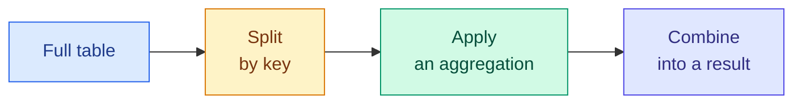

# pandas Essentials

**Level:** 🟡 Intermediate &nbsp;|&nbsp; **Effort:** Detailed module &nbsp;|&nbsp; **Module:** [01 Python Foundations](README.md)

---

## 🎯 Learning Objectives

By the end of this topic you will be able to:

- Load a CSV file into a DataFrame and inspect what you actually got
- Select rows and columns with `.loc` and `.iloc` without guessing which to use
- Filter with boolean masks and avoid the chained-assignment trap
- Clean a genuinely messy dataset: whitespace, casing, duplicates, missing values
- Aggregate with `groupby`, and join two tables without silently multiplying rows
- Resample a time series and spot a faulty sensor in it

## 📚 Prerequisites

[Topic 11: NumPy Essentials](11-numpy-essentials.md) — a DataFrame is arrays underneath, and the
NaN rules carry over unchanged.

```bash
pip install -r requirements.txt      # pandas==2.2.3
```

Examples were executed with **pandas 2.2.3** and read files from `datasets/samples/`, so run them
from the repository root.

---

## 1. What pandas adds to NumPy

### 🍰 Simple explanation

NumPy gives you a grid of numbers. pandas gives you a **spreadsheet**: columns have names, rows have
an index, and different columns can hold different types.

| | NumPy `ndarray` | pandas `DataFrame` |
| --- | --- | --- |
| Column types | One for the whole array | One per column |
| Column access | By position, `data[:, 3]` | By name, `data["price"]` |
| Missing values | `np.nan`, floats only | `NaN`/`NA` across types |
| Best for | Maths, model input | Loading, cleaning, exploring |

**You use both.** pandas to load and clean; `.to_numpy()` to hand a clean matrix to scikit-learn.

### The two objects

A **Series** is one labelled column. A **DataFrame** is a dictionary of Series sharing an index.

```python
import pandas as pd

scores = pd.Series([0.91, 0.42, 0.77], name="accuracy")
print(scores)
print(f"\nvalues are a numpy array: {type(scores.to_numpy()).__name__}")
```

**Output:**
```
0    0.91
1    0.42
2    0.77
Name: accuracy, dtype: float64

values are a numpy array: ndarray
```

---

## 2. Loading and looking

**Always look at the data before doing anything to it.** Four calls, every time.

```python
import pandas as pd

reviews = pd.read_csv("datasets/samples/reviews.csv")

print(f"shape: {reviews.shape}")
print("\ndtypes:")
print(reviews.dtypes.to_string())
print("\nmissing values per column:")
print(reviews.isna().sum().to_string())
print(f"\nduplicate rows: {reviews.duplicated().sum()}")
```

**Output:**
```
shape: (62, 5)

dtypes:
review_id     object
text          object
label         object
rating       float64
source        object

missing values per column:
review_id    0
text         0
label        0
rating       4
source       0

duplicate rows: 2
```

### ⚠️ An integer column with a missing value becomes a float

Look at `rating` in that output. The CSV holds `1`–`5`, but the dtype is `float64`, because
`NaN` is a float and NumPy columns hold one type.

```python
import pandas as pd

reviews = pd.read_csv("datasets/samples/reviews.csv")

print(f"rating dtype:      {reviews['rating'].dtype}")
print(f"first few values:  {reviews['rating'].head(3).tolist()}")
print(f"nullable integer:  {reviews['rating'].astype('Int64').head(3).tolist()}")
```

**Output:**
```
rating dtype:      float64
first few values:  [2.0, 2.0, 1.0]
nullable integer:  [2, 2, 1]
```

`Int64` with a capital I is pandas' **nullable** integer type — it holds whole numbers *and*
missing values. Use it when `4.0` instead of `4` would be confusing or would leak into a report.

### `head`, `info` and `describe`

```python
import pandas as pd

reviews = pd.read_csv("datasets/samples/reviews.csv")

print(reviews[["review_id", "label", "rating", "source"]].head(3).to_string(index=False))
print("\nnumeric summary:")
print(reviews[["rating"]].describe().round(3).to_string())
```

**Output:**
```
review_id    label  rating source
     r001 negative     2.0  kiosk
     r002 negative     2.0    web
     r003 negative     1.0    web

numeric summary:
       rating
count  58.000
mean    3.328
std     1.526
min     1.000
25%     2.000
50%     4.000
75%     5.000
max     5.000
```

`describe()` gives count, mean, spread and quartiles. **The `count` line is the one to read first**
— when it is lower than the number of rows, you have missing values.

---

## 3. Selecting: `.loc` and `.iloc`

The single most common source of confusion in pandas. The rule is short:

| | Uses | Endpoint |
| --- | --- | --- |
| **`.loc`** | **L**abels — index values and column names | **inclusive** |
| **`.iloc`** | **I**nteger positions | exclusive, like a Python slice |

```python
import pandas as pd

reviews = pd.read_csv("datasets/samples/reviews.csv")

print("one column (a Series):")
print(reviews["label"].head(2).to_string())

print("\ntwo columns (a DataFrame):")
print(reviews[["review_id", "label"]].head(2).to_string(index=False))

print("\n.loc[0:2] - label slice, endpoint INCLUDED:")
print(reviews.loc[0:2, ["review_id", "label"]].to_string(index=False))

print("\n.iloc[0:2] - position slice, endpoint excluded:")
print(reviews.iloc[0:2][["review_id", "label"]].to_string(index=False))
```

**Output:**
```
one column (a Series):
0    negative
1    negative

two columns (a DataFrame):
review_id    label
     r001 negative
     r002 negative

.loc[0:2] - label slice, endpoint INCLUDED:
review_id    label
     r001 negative
     r002 negative
     r003 negative

.iloc[0:2] - position slice, endpoint excluded:
review_id    label
     r001 negative
     r002 negative
```

**`.loc[0:2]` returns three rows; `.iloc[0:2]` returns two.** That is not a bug — labels are not
positions, and a label slice includes its endpoint the way a dictionary lookup would.

> After filtering or sorting, the index no longer matches position at all. `.iloc[0]` is then the
> first row *shown*, while `.loc[0]` is whichever row was originally row 0 — possibly not present.
> **When in doubt, use `.loc`** and be explicit about labels.

### Filtering with boolean masks

Exactly the NumPy syntax from [Topic 11](11-numpy-essentials.md), including `&` / `|` and the
brackets.

```python
import pandas as pd

reviews = pd.read_csv("datasets/samples/reviews.csv")

low_rated = reviews[reviews["rating"] <= 2]
mobile_positive = reviews[(reviews["source"] == "mobile") & (reviews["label"] == "positive")]

print(f"rows with rating <= 2:            {len(low_rated)}")
print(f"positive reviews from mobile:     {len(mobile_positive)}")
print(f"rows where rating is missing:     {reviews['rating'].isna().sum()}")
print(f"sources present:                  {sorted(reviews['source'].unique())}")
print("\nreviews from kiosk or web, first 3 ids:")
print(reviews[reviews["source"].isin(["kiosk", "web"])]["review_id"].head(3).tolist())
```

**Output:**
```
rows with rating <= 2:            23
positive reviews from mobile:     12
rows where rating is missing:     4
sources present:                  ['kiosk', 'mobile', 'web']

reviews from kiosk or web, first 3 ids:
['r001', 'r002', 'r003']
```

`.isin([...])` replaces a chain of `|` comparisons and reads far better.

### ⚠️ Chained assignment does not reliably work

```python
import pandas as pd

reviews = pd.read_csv("datasets/samples/reviews.csv")

# Correct: one .loc call that selects rows AND the column being written.
reviews.loc[reviews["rating"].isna(), "rating"] = 0
print(f"missing after .loc assignment: {reviews['rating'].isna().sum()}")
```

**Output:**
```
missing after .loc assignment: 0
```

Writing `frame[frame["rating"].isna()]["rating"] = 0` instead is **chained assignment**: the first
bracket may return a copy, so the write lands on a temporary object and is discarded. pandas used to
warn about this with `SettingWithCopyWarning`; with Copy-on-Write — the default from pandas 3.0, and
available in 2.2 — it silently does nothing at all.

**Always assign through a single `.loc[rows, column]`.**

---

## 4. Cleaning the reviews data

The dataset has documented faults ([dataset card](../datasets/samples/README.md)). Here is each one
and its fix.

```python
import pandas as pd

reviews = pd.read_csv("datasets/samples/reviews.csv")

print("BEFORE")
print(reviews["label"].value_counts().to_string())
print(f"rows: {len(reviews)}   duplicates: {reviews.duplicated().sum()}")

# 1. Whitespace and casing - string methods live under .str
reviews["text"] = reviews["text"].str.strip()
reviews["label"] = reviews["label"].str.strip().str.lower()

# 2. Exact duplicate rows
reviews = reviews.drop_duplicates()

print("\nAFTER")
print(reviews["label"].value_counts().to_string())
print(f"rows: {len(reviews)}   duplicates: {reviews.duplicated().sum()}")
```

**Output:**
```
BEFORE
label
positive    36
negative    23
POSITIVE     2
NEGATIVE     1
rows: 62   duplicates: 2

AFTER
label
positive    36
negative    24
rows: 60   duplicates: 0
```

**Four apparent classes collapse into two.** `POSITIVE` and `positive` were counted separately —
had you trained on this without normalising, the model would have learned two labels for one
concept, and your accuracy would have looked inexplicably poor.

### Missing values: a decision, not a default

```python
import pandas as pd

reviews = pd.read_csv("datasets/samples/reviews.csv")
reviews["label"] = reviews["label"].str.strip().str.lower()

print(f"rows: {len(reviews)}, missing ratings: {reviews['rating'].isna().sum()}")

dropped = reviews.dropna(subset=["rating"])
filled_zero = reviews.fillna({"rating": 0})
filled_median = reviews.fillna({"rating": reviews["rating"].median()})

print(f"\ndropna     -> {len(dropped)} rows, mean rating {dropped['rating'].mean():.3f}")
print(f"fill 0     -> {len(filled_zero)} rows, mean rating {filled_zero['rating'].mean():.3f}")
print(f"fill median-> {len(filled_median)} rows, mean rating {filled_median['rating'].mean():.3f}")
```

**Output:**
```
rows: 62, missing ratings: 4

dropna     -> 58 rows, mean rating 3.328
fill 0     -> 62 rows, mean rating 3.113
fill median-> 62 rows, mean rating 3.371
```

Three defensible options, three different answers. **Filling with 0 is almost always wrong here** —
a rating of 0 is not on the scale, and it drags the mean down as though those reviewers were
furious. Filling with the median hides the uncertainty; dropping loses rows and biases the result if
ratings are not missing at random.

There is no default. Decide, write down why, and keep the count of what you changed.

### Adding columns: vectorised, not `apply`

```python
import pandas as pd

reviews = pd.read_csv("datasets/samples/reviews.csv")
reviews["label"] = reviews["label"].str.strip().str.lower()

reviews["text_length"] = reviews["text"].str.len()
reviews["is_positive"] = (reviews["label"] == "positive").astype(int)
reviews["rating_band"] = pd.cut(
    reviews["rating"], bins=[0, 2, 3, 5], labels=["low", "mid", "high"]
)

print(reviews[["review_id", "text_length", "is_positive", "rating_band"]].head(4).to_string(index=False))
print(f"\nmean length, positive: {reviews.loc[reviews['is_positive'] == 1, 'text_length'].mean():.1f}")
print(f"mean length, negative: {reviews.loc[reviews['is_positive'] == 0, 'text_length'].mean():.1f}")
```

**Output:**
```
review_id  text_length  is_positive rating_band
     r001           58            0         low
     r002           73            0         low
     r003           67            0         low
     r004           60            1        high

mean length, positive: 58.3
mean length, negative: 58.3
```

**Both means are 58.3.** That is not a coincidence to gloss over: the review text in this dataset
is assembled from templates, so length carries no information about sentiment at all. A real dataset
might well show a difference — but the honest reading here is *this feature is useless for this
task*, and noticing that early is worth more than engineering it further. It is also a fair
illustration of what synthetic data cannot teach you.

`.str` and `.dt` are **accessors** — they apply a string or datetime operation down a whole column
at C speed. `.apply(lambda row: ...)` runs a Python function per row and is typically far slower.
Reach for `apply` only when no vectorised equivalent exists, and expect to pay for it.

---

## 5. `groupby` — split, apply, combine



```python
import pandas as pd

reviews = pd.read_csv("datasets/samples/reviews.csv")
reviews["label"] = reviews["label"].str.strip().str.lower()
reviews = reviews.drop_duplicates()

print("mean rating by source:")
print(reviews.groupby("source")["rating"].mean().round(3).to_string())

print("\nseveral statistics at once:")
summary = reviews.groupby("source").agg(
    n=("review_id", "count"),
    mean_rating=("rating", "mean"),
    missing_ratings=("rating", lambda values: values.isna().sum()),
)
print(summary.round(3).to_string())

print("\ntwo keys:")
print(reviews.groupby(["source", "label"]).size().to_string())
```

**Output:**
```
mean rating by source:
source
kiosk     3.500
mobile    3.105
web       3.320

several statistics at once:
         n  mean_rating  missing_ratings
source                                  
kiosk   14        3.500                2
mobile  20        3.105                1
web     26        3.320                1

two keys:
source  label   
kiosk   negative     5
        positive     9
mobile  negative     8
        positive    12
web     negative    11
        positive    15
```

**`groupby` skips NaN by default when aggregating** — `mean` is computed over present values only.
That is usually what you want, but it means two groups can have means computed from different
numbers of rows, which is why the `n` and `missing_ratings` columns above are worth carrying.

### `value_counts` and `crosstab`

```python
import pandas as pd

reviews = pd.read_csv("datasets/samples/reviews.csv")
reviews["label"] = reviews["label"].str.strip().str.lower()
reviews = reviews.drop_duplicates()

print("class balance:")
print(reviews["label"].value_counts().to_string())
print("\nas proportions:")
print(reviews["label"].value_counts(normalize=True).round(3).to_string())
print("\nlabel against source:")
print(pd.crosstab(reviews["source"], reviews["label"]).to_string())
```

**Output:**
```
class balance:
label
positive    36
negative    24

as proportions:
label
positive    0.6
negative    0.4

label against source:
label   negative  positive
source                    
kiosk          5         9
mobile         8        12
web           11        15
```

**Check class balance before you model anything.** A classifier on a 90/10 split can score 90% by
always predicting the majority class, and that number will look like success.

---

## 6. Joining tables

```python
import pandas as pd

reviews = pd.read_csv("datasets/samples/reviews.csv").drop_duplicates()

sources = pd.DataFrame(
    {
        "source": ["web", "mobile", "kiosk"],
        "channel_type": ["online", "online", "in-store"],
    }
)

joined = reviews.merge(sources, on="source", how="left", validate="many_to_one")

print(f"rows before: {len(reviews)}   rows after: {len(joined)}")
print("\nreviews by channel type:")
print(joined["channel_type"].value_counts().to_string())
```

**Output:**
```
rows before: 60   rows after: 60

reviews by channel type:
channel_type
online      46
in-store    14
```

| `how=` | Keeps |
| --- | --- |
| `left` | every row of the left table (the default choice for enrichment) |
| `inner` | only rows matching in both |
| `outer` | everything from both sides |
| `right` | every row of the right table |

### ⚠️ A join can multiply your rows

If the right table has **two** rows per key, every matching left row is duplicated. On a dataset of
any size this is silent and catastrophic — your row count grows, every aggregate shifts, and nothing
raises.

```python
import pandas as pd

left = pd.DataFrame({"source": ["web", "mobile"], "review_id": ["r1", "r2"]})
duplicated_lookup = pd.DataFrame(
    {"source": ["web", "web", "mobile"], "channel_type": ["online", "ONLINE", "online"]}
)

careless = left.merge(duplicated_lookup, on="source", how="left")
print(f"2 rows joined to a table with a duplicate key -> {len(careless)} rows")

try:
    left.merge(duplicated_lookup, on="source", how="left", validate="many_to_one")
except Exception as error:
    print(f"validate= catches it: {type(error).__name__}: {error}")
```

**Output:**
```
2 rows joined to a table with a duplicate key -> 3 rows
validate= catches it: MergeError: Merge keys are not unique in right dataset; not a many-to-one merge
```

**Pass `validate=` on every merge.** It states the relationship you believe holds — `many_to_one`,
`one_to_one` — and raises immediately when the data disagrees. Checking `len()` before and after is
the fallback when you cannot.

---

## 7. Time series: the sensor data

```python
import pandas as pd

sensors = pd.read_csv(
    "datasets/samples/sensor_readings.csv",
    parse_dates=["timestamp"],
)

print(f"shape: {sensors.shape}")
print(f"timestamp dtype: {sensors['timestamp'].dtype}")
print(f"range: {sensors['timestamp'].min()} to {sensors['timestamp'].max()}")

print("\nper-sensor summary:")
print(
    sensors.groupby("sensor_id")["temperature_c"]
    .agg(["count", "mean", "min", "max", "std"])
    .round(2)
    .to_string()
)
```

**Output:**
```
shape: (240, 4)
timestamp dtype: datetime64[ns]
range: 2026-03-01 00:00:00 to 2026-03-04 07:00:00

per-sensor summary:
           count   mean    min     max    std
sensor_id                                    
s-01          78  17.54  10.71   24.90   4.37
s-02          80  17.77  11.35   25.36   4.22
s-03          80  19.09  10.75  148.00  15.25
```

`parse_dates` turns the column into real timestamps — without it you have strings, and comparisons
sort lexicographically rather than chronologically.

**The 148 °C reading is visible immediately**, and it inflates `s-03`'s standard deviation. The
`count` column shows the missing readings: not every sensor has all 80.

> ⚠️ **These standard deviations differ slightly from the ones in
> [Topic 11](11-numpy-essentials.md)** — 4.37 here against 4.34 there. Neither is wrong.
> `numpy.nanstd` divides by `n` (the population standard deviation, `ddof=0`); pandas `.std()`
> divides by `n - 1` (the sample standard deviation, `ddof=1`). Both libraries document their
> default, and they disagree. When a number moves after you port code between the two, this is
> usually why — pass `ddof=` explicitly if it matters.

### Finding the stuck sensor

```python
import pandas as pd

sensors = pd.read_csv("datasets/samples/sensor_readings.csv", parse_dates=["timestamp"])

# Drop the physically impossible reading before looking for subtler faults.
sensors.loc[sensors["temperature_c"] > 60, "temperature_c"] = pd.NA

changes = sensors.groupby("sensor_id")["temperature_c"].apply(
    lambda values: (values.diff() == 0).sum()
)

print("consecutive identical readings per sensor:")
print(changes.to_string())
print("\nstd after removing the impossible value:")
print(sensors.groupby("sensor_id")["temperature_c"].std().round(2).to_string())
```

**Output:**
```
consecutive identical readings per sensor:
sensor_id
s-01    0
s-02    5
s-03    0

std after removing the impossible value:
sensor_id
s-01    4.37
s-02    4.22
s-03    4.45
```

A working thermometer does not report the identical float twice in a row. **`s-02` does it five
times**, and its mean and standard deviation look entirely normal — summary statistics alone would
never have caught it.

### Resampling

```python
import pandas as pd

sensors = pd.read_csv("datasets/samples/sensor_readings.csv", parse_dates=["timestamp"])
sensors.loc[sensors["temperature_c"] > 60, "temperature_c"] = pd.NA

s01 = sensors[sensors["sensor_id"] == "s-01"].set_index("timestamp")

print("6-hourly mean temperature for s-01:")
print(s01["temperature_c"].resample("6h").mean().round(2).head(6).to_string())
```

**Output:**
```
6-hourly mean temperature for s-01:
timestamp
2026-03-01 00:00:00    12.84
2026-03-01 06:00:00    18.01
2026-03-01 12:00:00    23.05
2026-03-01 18:00:00    17.11
2026-03-02 00:00:00    12.54
2026-03-02 06:00:00    18.70
Freq: 6h
```

`resample` is `groupby` for time. It needs a datetime **index**, which is why `set_index` comes
first. Use it to turn irregular readings into a regular grid before any modelling.

---

## 💰 dtypes are a memory decision here too

```python
import pandas as pd

reviews = pd.read_csv("datasets/samples/reviews.csv")

as_object = reviews["source"].memory_usage(deep=True)
as_category = reviews["source"].astype("category").memory_usage(deep=True)

print(f"source as object:   {as_object} bytes")
print(f"source as category: {as_category} bytes")
print(f"unique values: {reviews['source'].nunique()} out of {len(reviews)} rows")
```

**Output:**
```
source as object:   3449 bytes
source as category: 463 bytes
unique values: 3 out of 62 rows
```

A **category** dtype stores each distinct string once and holds integer codes per row. On a column
with few distinct values and many rows — country, plan, label, source — the saving is large. On a
column of mostly-unique strings it costs more than it saves.

---

### 🔐 Security note

- **`pd.read_pickle` executes code.** So does `joblib.load`. Never point either at a file you did
  not produce. `read_csv`, `read_json` and `read_parquet` are the safe readers for untrusted data.
- **A DataFrame in a notebook is still personal data.** `df.head()` output gets committed inside
  `.ipynb` files, pasted into tickets and shared in screenshots. Strip notebook outputs before
  committing — this repository pins `nbstripout` for exactly that — and never print raw rows of
  anything containing personal information.
- **Be careful with `read_excel` and `read_html` on untrusted files**; both pull in parsers with a
  much larger attack surface than CSV.

## 🧪 Hands-on lab: a cleaning report

Cleaning silently is how data disappears. Produce a report instead.

```python
import pandas as pd

raw = pd.read_csv("datasets/samples/reviews.csv")
report = {"rows_in": len(raw)}

clean = raw.copy()
clean["text"] = clean["text"].str.strip()
clean["label"] = clean["label"].str.strip().str.lower()

report["labels_recased"] = int((raw["label"] != clean["label"]).sum())
report["text_stripped"] = int((raw["text"] != clean["text"]).sum())

before = len(clean)
clean = clean.drop_duplicates()
report["duplicates_removed"] = before - len(clean)

report["missing_ratings"] = int(clean["rating"].isna().sum())
clean = clean.dropna(subset=["rating"])

report["rows_out"] = len(clean)
report["retained_pct"] = round(100 * len(clean) / len(raw), 1)

for key, value in report.items():
    print(f"{key:<20} {value}")

print("\nfinal class balance:")
print(clean["label"].value_counts().to_string())
```

**Output:**
```
rows_in              62
labels_recased       3
text_stripped        2
duplicates_removed   2
missing_ratings      4
rows_out             56
retained_pct         90.3

final class balance:
label
positive    33
negative    23
```

**Every number in that report is a question someone will ask later.** "Why does the model see fewer
rows than the export?" has an answer now.

**Extend it:** write the report to JSON beside the cleaned file (Topic 10); add a
`pytest` test asserting `rows_out + duplicates_removed + missing_ratings == rows_in`; and add a
column recording *why* each dropped row was dropped instead of discarding it.

---

## 🎤 Interview questions

**"What is the difference between `.loc` and `.iloc`?"**

`.loc` selects by label — index values and column names — and its slices include the endpoint.
`.iloc` selects by integer position and excludes the endpoint like a normal Python slice. They
coincide only on a default `RangeIndex` that has never been filtered or sorted; after any of those,
label and position diverge and mixing them up returns the wrong rows without error.

**"Why did my integer column become a float?"**

Because it has a missing value. `NaN` is a float, and a NumPy-backed column holds a single type, so
the whole column is promoted to `float64`. Use the nullable `Int64` dtype if you need whole numbers
alongside missing values.

**"How can a merge silently corrupt your data?"**

If the key is not unique on the side you are joining to, each matching row is duplicated — row
counts grow, aggregates shift, and no error is raised. Pass `validate="many_to_one"` (or the
appropriate relationship) so pandas raises instead, and compare row counts before and after.

**"When would you not use `apply`?"**

Almost always. `apply` runs a Python function per row or element, giving up vectorisation; the
built-in vectorised operations, `.str`/`.dt` accessors, `np.where`, `pd.cut` and `groupby.agg`
cover most needs and run in compiled code. Use `apply` when no vectorised equivalent exists, and
treat it as a known cost rather than a default.

---

## ✅ Key takeaways

- pandas is for loading, cleaning and exploring; hand NumPy arrays to the model at the end.
- **Look first**: `shape`, `dtypes`, `isna().sum()`, `duplicated().sum()` — every time.
- An integer column with a missing value silently becomes `float64`. `Int64` is the nullable fix.
- **`.loc` is labels and includes the endpoint; `.iloc` is positions and does not.**
- Assign through one `.loc[rows, column]`. Chained assignment writes to a temporary and is lost.
- `.str` and `.dt` accessors are vectorised; `apply` is a per-row Python loop.
- **Normalise casing before counting classes**, or one class looks like two.
- Filling missing values with 0 invents data. Choose deliberately and record what you changed.
- Check class balance before modelling.
- **Pass `validate=` on every merge** — a duplicate key multiplies rows silently.
- `parse_dates` at read time; `set_index` before `resample`.
- `category` dtype for low-cardinality string columns.

---

## 📚 Official References

- [pandas documentation — pandas development team](https://pandas.pydata.org/docs/) — verified 2026-07-27
- [10 minutes to pandas — pandas development team](https://pandas.pydata.org/docs/user_guide/10min.html) — verified 2026-07-27
- [Indexing and selecting data — pandas development team](https://pandas.pydata.org/docs/user_guide/indexing.html) — verified 2026-07-27
- [Group by: split-apply-combine — pandas development team](https://pandas.pydata.org/docs/user_guide/groupby.html) — verified 2026-07-27
- [Merge, join, concatenate and compare — pandas development team](https://pandas.pydata.org/docs/user_guide/merging.html) — verified 2026-07-27
- [Working with missing data — pandas development team](https://pandas.pydata.org/docs/user_guide/missing_data.html) — verified 2026-07-27
- [Copy-on-Write — pandas development team](https://pandas.pydata.org/docs/user_guide/copy_on_write.html) — verified 2026-07-27
- [Time series / date functionality — pandas development team](https://pandas.pydata.org/docs/user_guide/timeseries.html) — verified 2026-07-27

---

## 🔗 Navigation

[← Topic 11: NumPy Essentials](11-numpy-essentials.md) &nbsp;|&nbsp;
[Module home](README.md) &nbsp;|&nbsp;
[Topic 13: Visualisation →](13-visualisation.md)
