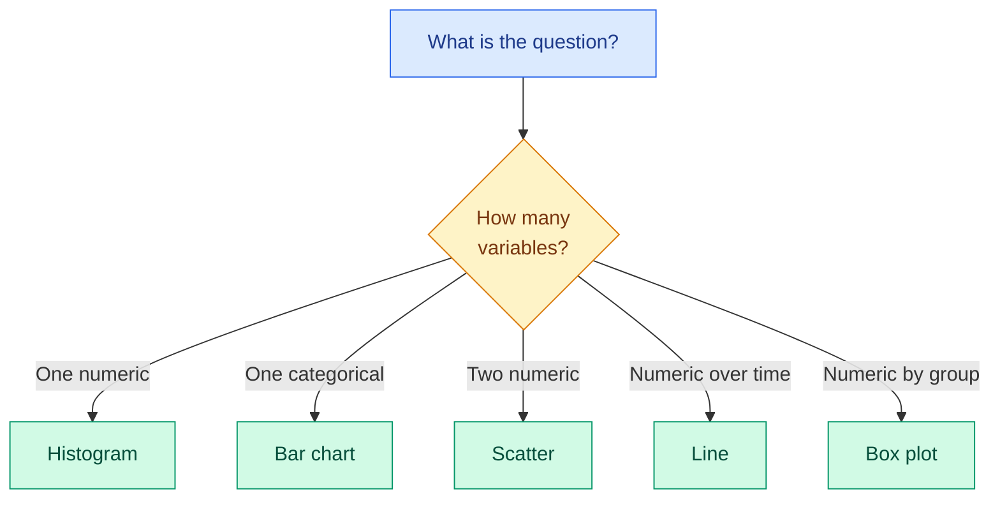

# Visualisation

**Level:** 🟡 Intermediate &nbsp;|&nbsp; **Effort:** Detailed module &nbsp;|&nbsp; **Module:** [01 Python Foundations](README.md)

---

## 🎯 Learning Objectives

By the end of this topic you will be able to:

- Explain why summary statistics are not enough, and prove it
- Choose the right chart for the question you are asking
- Build a labelled Matplotlib figure using the object-oriented interface
- Save figures reproducibly, including from a script with no display attached
- Recognise the chart choices that mislead — truncated axes, wrong chart type, bad colour
- Say when to reach for seaborn or Plotly instead

## 📚 Prerequisites

[Topic 12: pandas Essentials](12-pandas-essentials.md)

```bash
pip install -r requirements.txt      # matplotlib==3.9.2, seaborn==0.13.2, plotly==5.24.1
```

### 🧪 How these examples are verified

A chart is an image, and `scripts/check_examples.py` compares text. So every example here draws the
figure and then **prints facts about it** — how many series, what the axis labels say, what the data
limits are, whether the file was written. Those printed facts are what CI checks.

That is not a workaround; it is how you test plotting code in a real project. It also means every
figure below provably has axis labels, because a missing one would fail the build.

---

## 1. Why look at the data at all

### The case for it, in numbers

Four datasets. Identical means, identical standard deviations, identical correlation, identical
regression line. **They are not remotely the same data.**

```python
import numpy as np

# Anscombe's quartet (F. J. Anscombe, 1973) - four datasets constructed to share statistics.
x_common = [10, 8, 13, 9, 11, 14, 6, 4, 12, 7, 5]
quartet = {
    "I":   (x_common, [8.04, 6.95, 7.58, 8.81, 8.33, 9.96, 7.24, 4.26, 10.84, 4.82, 5.68]),
    "II":  (x_common, [9.14, 8.14, 8.74, 8.77, 9.26, 8.10, 6.13, 3.10, 9.13, 7.26, 4.74]),
    "III": (x_common, [7.46, 6.77, 12.74, 7.11, 7.81, 8.84, 6.08, 5.39, 8.15, 6.42, 5.73]),
    "IV":  ([8, 8, 8, 8, 8, 8, 8, 19, 8, 8, 8],
            [6.58, 5.76, 7.71, 8.84, 8.47, 7.04, 5.25, 12.50, 5.56, 7.91, 6.89]),
}

print(f"{'set':<5}{'mean x':>8}{'mean y':>8}{'std y':>8}{'corr':>8}{'slope':>8}")
for name, (xs, ys) in quartet.items():
    x, y = np.array(xs, dtype=float), np.array(ys, dtype=float)
    slope, _ = np.polyfit(x, y, 1)
    print(
        f"{name:<5}{x.mean():>8.2f}{y.mean():>8.2f}{y.std(ddof=1):>8.3f}"
        f"{np.corrcoef(x, y)[0, 1]:>8.3f}{slope:>8.3f}"
    )
```

**Output:**
```
set    mean x  mean y   std y    corr   slope
I        9.00    7.50   2.032   0.816   0.500
II       9.00    7.50   2.032   0.816   0.500
III      9.00    7.50   2.030   0.816   0.500
IV       9.00    7.50   2.031   0.817   0.500
```

Every row agrees to two decimal places — the tiny wobble in the third is in the published data
itself, not an error here. Plotted, set I is a normal cloud, set II is a clean curve,
set III is a straight line with one outlier, and set IV is a vertical stack with a single distant
point. **A model fitted to all four would report the same fit and be badly wrong on three of them.**

This is the entire argument for visualisation: `describe()` cannot tell you the shape of your data.

---

## 2. Matplotlib: use the object-oriented interface

There are two ways to use Matplotlib. Tutorials often show `plt.plot(...)`, which draws on a hidden
"current" figure. **Prefer `fig, ax = plt.subplots()`** — it names what you are drawing on, and it is
the only sane option once you have more than one panel.

```python
import matplotlib

matplotlib.use("Agg")          # a non-interactive backend - see the note below

import matplotlib.pyplot as plt
import numpy as np

x = np.linspace(0, 10, 100)

fig, ax = plt.subplots(figsize=(6, 4))
ax.plot(x, np.sin(x), label="sin")
ax.plot(x, np.cos(x), label="cos", linestyle="--")

ax.set_xlabel("x")
ax.set_ylabel("value")
ax.set_title("Two labelled series")
ax.legend()

# What CI actually checks:
print(f"series drawn:  {len(ax.lines)}")
print(f"x label:       {ax.get_xlabel()!r}")
print(f"y label:       {ax.get_ylabel()!r}")
print(f"title:         {ax.get_title()!r}")
print(f"legend labels: {[text.get_text() for text in ax.get_legend().get_texts()]}")
plt.close(fig)
```

**Output:**
```
series drawn:  2
x label:       'x'
y label:       'value'
title:         'Two labelled series'
legend labels: ['sin', 'cos']
```

### `matplotlib.use("Agg")` — why it is there

`Agg` is a backend that renders to an image buffer instead of a window. **Set it before importing
`pyplot`** whenever code runs somewhere with no display: continuous integration, a container, a
server, a cron job. Without it, plotting can fail outright or block waiting for a GUI that will
never appear.

### ⚠️ Close your figures

`plt.close(fig)` is not decoration. Matplotlib keeps every unclosed figure alive, so a loop that
draws 500 charts holds 500 figures in memory and eventually warns then crashes. In a notebook you
rarely notice; in a batch job you certainly will.

---

## 3. Choosing the chart

The chart follows from the **question**, not from what looks impressive.

| Your question | Chart |
| --- | --- |
| How is one numeric variable distributed? | Histogram (or KDE) |
| How do groups compare on one number? | Bar chart |
| Do two numeric variables relate? | Scatter |
| How does something change over time? | Line |
| How does a distribution differ across groups? | Box plot or violin |
| Where are the missing values? | Heatmap of `isna()` |
| Are my classes balanced? | Bar chart of `value_counts()` |



### 💻 A histogram of real data

```python
import matplotlib

matplotlib.use("Agg")

import matplotlib.pyplot as plt
import pandas as pd

housing = pd.read_csv("datasets/samples/housing.csv")

fig, ax = plt.subplots(figsize=(6, 4))
counts, edges, _ = ax.hist(housing["price_thousands"], bins=20, edgecolor="white")
ax.set_xlabel("price (thousands)")
ax.set_ylabel("number of properties")
ax.set_title("Distribution of property prices")

print(f"properties:      {len(housing)}")
print(f"bins:            {len(counts)}")
print(f"all accounted:   {int(counts.sum()) == len(housing)}")
print(f"tallest bin:     {int(counts.max())} properties")
print(f"range plotted:   {edges[0]:.1f} to {edges[-1]:.1f}")
plt.close(fig)
```

**Output:**
```
properties:      150
bins:            20
all accounted:   True
tallest bin:     15 properties
range plotted:   113.4 to 774.0
```

**`counts.sum() == len(housing)`** is the assertion worth making about any histogram: every point
landed in a bin, so nothing was silently clipped off the edge.

### 💻 Scatter: does area explain price?

```python
import matplotlib

matplotlib.use("Agg")

import matplotlib.pyplot as plt
import numpy as np
import pandas as pd

housing = pd.read_csv("datasets/samples/housing.csv")

fig, ax = plt.subplots(figsize=(6, 4))
ax.scatter(housing["area_sqm"], housing["price_thousands"], alpha=0.6, s=25)

slope, intercept = np.polyfit(housing["area_sqm"], housing["price_thousands"], 1)
line_x = np.array([housing["area_sqm"].min(), housing["area_sqm"].max()])
ax.plot(line_x, slope * line_x + intercept, color="crimson", label="least squares fit")

ax.set_xlabel("area (square metres)")
ax.set_ylabel("price (thousands)")
ax.set_title("Price against floor area")
ax.legend()

correlation = housing["area_sqm"].corr(housing["price_thousands"])
print(f"points plotted: {len(ax.collections[0].get_offsets())}")
print(f"fitted slope:   {slope:.2f} per square metre")
print(f"correlation:    {correlation:.3f}")
plt.close(fig)
```

**Output:**
```
points plotted: 150
fitted slope:   3.27 per square metre
correlation:    0.964
```

The dataset card records that the true coefficient on `area_sqm` is **3.2**
([dataset card](../datasets/samples/README.md)). The fitted slope above is close but not equal —
partly noise, and partly because this single-variable fit absorbs some of the effect of the
variables it ignores. Topic 14 fits all four properly.

### 💻 Small multiples beat one crowded chart

```python
import matplotlib

matplotlib.use("Agg")

import matplotlib.pyplot as plt
import pandas as pd

sensors = pd.read_csv("datasets/samples/sensor_readings.csv", parse_dates=["timestamp"])

fig, axes = plt.subplots(1, 3, figsize=(12, 3.5), sharey=True)

for ax, sensor in zip(axes, ["s-01", "s-02", "s-03"], strict=True):
    rows = sensors[sensors["sensor_id"] == sensor]
    ax.plot(rows["timestamp"], rows["temperature_c"], linewidth=1)
    ax.set_title(sensor)
    ax.set_xlabel("time")
    ax.tick_params(axis="x", labelrotation=45)

axes[0].set_ylabel("temperature (C)")
fig.suptitle("Raw temperature by sensor - one panel each")

print(f"panels:        {len(axes)}")
print(f"shared y-axis: {axes[0].get_ylim() == axes[2].get_ylim()}")
print(f"y range:       {axes[0].get_ylim()[0]:.0f} to {axes[0].get_ylim()[1]:.0f}")
print(f"panel titles:  {[ax.get_title() for ax in axes]}")
plt.close(fig)
```

**Output:**
```
panels:        3
shared y-axis: True
y range:       4 to 155
panel titles:  ['s-01', 's-02', 's-03']
```

**Look at that y range.** Because the axes are shared and `s-03` contains the 148 °C spike, all three
panels are squashed into the bottom of the plot and the daily cycle is invisible. That is the chart
telling you to clean the data first — exactly the fault found in
[Topic 11](11-numpy-essentials.md).

`sharey=True` is the right default when panels are comparable: **unshared axes make different
scales look identical.** Here it costs you detail, which is a fair trade for not being misled.

---

## 4. ⚠️ Charts that mislead

### Truncated axes exaggerate

```python
import matplotlib

matplotlib.use("Agg")

import matplotlib.pyplot as plt

models = ["baseline", "v2", "v3"]
accuracy = [0.910, 0.923, 0.931]

fig, (honest, misleading) = plt.subplots(1, 2, figsize=(9, 3.5))

honest.bar(models, accuracy)
honest.set_ylim(0, 1)
honest.set_title("y starts at 0")
honest.set_ylabel("accuracy")

misleading.bar(models, accuracy, color="darkorange")
misleading.set_ylim(0.90, 0.94)
misleading.set_title("y starts at 0.90")
misleading.set_ylabel("accuracy")

honest_span = honest.get_ylim()[1] - honest.get_ylim()[0]
misleading_span = misleading.get_ylim()[1] - misleading.get_ylim()[0]

print(f"real difference, baseline to v3: {accuracy[2] - accuracy[0]:.3f}")
print(f"honest y-span:      {honest_span:.2f}")
print(f"truncated y-span:   {misleading_span:.2f}")
print(f"visual exaggeration: {honest_span / misleading_span:.0f}x")
plt.close(fig)
```

**Output:**
```
real difference, baseline to v3: 0.021
honest y-span:      1.00
truncated y-span:   0.04
visual exaggeration: 25x
```

Both panels plot the same three numbers. The right-hand one makes a **2.1 percentage point**
improvement look like a landslide, because the axis covers a range 25 times smaller.

**For bar charts, start the y-axis at zero** — the bar's *length* is the encoding, and truncating it
lies. For line charts showing change over time, a truncated axis is often legitimate; label it
clearly.

### Colour

- **Do not encode information in colour alone.** Around 1 in 12 men has some form of colour-vision
  deficiency. Add markers, line styles, direct labels or annotations.
- **Avoid red-green pairs** for exactly that reason.
- Use a **sequential** colormap (`viridis`) for magnitude, a **diverging** one (`coolwarm`) only when
  there is a meaningful midpoint such as zero.
- Never use `jet` or `rainbow`: they invent visual boundaries where the data is smooth.

### Other traps

| Trap | Why it misleads |
| --- | --- |
| Pie chart with many slices | People compare angles badly; a bar chart is almost always clearer |
| Dual y-axes | Any correlation can be manufactured by choosing the two scales |
| Overplotting thousands of points | Solid blob hides density — use `alpha`, sampling or a hexbin |
| No axis labels or units | The single most common failing, and it makes a chart unreadable |

---

## 5. Saving figures

```python
import tempfile
from pathlib import Path

import matplotlib

matplotlib.use("Agg")

import matplotlib.pyplot as plt

fig, ax = plt.subplots(figsize=(5, 3))
ax.plot([1, 2, 3], [2, 4, 3], marker="o")
ax.set_xlabel("epoch")
ax.set_ylabel("loss")
ax.set_title("Training loss")

with tempfile.TemporaryDirectory() as tmp:
    png = Path(tmp) / "loss.png"
    svg = Path(tmp) / "loss.svg"
    fig.savefig(png, dpi=150, bbox_inches="tight")
    fig.savefig(svg, bbox_inches="tight")

    print(f"png written: {png.exists()}, {png.stat().st_size > 1000} (non-trivial size)")
    print(f"svg written: {svg.exists()}")
    print(f"svg is text: {svg.read_text(encoding='utf-8').lstrip().startswith('<?xml')}")

plt.close(fig)
```

**Output:**
```
png written: True, True (non-trivial size)
svg written: True
svg is text: True
```

- `dpi=150` or higher for anything going in a document; the default is low for print.
- **`bbox_inches="tight"`** stops long axis labels being cut off — the most common "why is my label
  missing" complaint.
- **SVG for anything with text**: it stays sharp at any zoom and the labels remain real text.
- Save to a path you construct, never to the current directory by accident.

---

## 6. seaborn and Plotly

**seaborn** sits on top of Matplotlib and knows about DataFrames. One line does grouping, aggregation
and styling that would take a dozen in raw Matplotlib.

```python
import matplotlib

matplotlib.use("Agg")

import matplotlib.pyplot as plt
import pandas as pd
import seaborn as sns

reviews = pd.read_csv("datasets/samples/reviews.csv")
reviews["label"] = reviews["label"].str.strip().str.lower()

fig, ax = plt.subplots(figsize=(6, 4))
sns.boxplot(data=reviews, x="source", y="rating", hue="label", ax=ax)
ax.set_xlabel("source")
ax.set_ylabel("rating")
ax.set_title("Rating distribution by source and sentiment")

print(f"axes label:   {ax.get_xlabel()!r} / {ax.get_ylabel()!r}")
print(f"legend title: {ax.get_legend().get_title().get_text()!r}")
print(f"groups drawn: {len(ax.get_legend().get_texts())}")
plt.close(fig)
```

**Output:**
```
axes label:   'source' / 'rating'
legend title: 'label'
groups drawn: 2
```

Because a seaborn chart **is** a Matplotlib chart, you keep the whole Matplotlib API for adjusting
it afterwards.

**Plotly** produces interactive HTML — hover, zoom, toggle series. That is worth a lot in a
notebook or a dashboard, and worth nothing in a printed report.

```python
import plotly.express as px
import pandas as pd

housing = pd.read_csv("datasets/samples/housing.csv")

figure = px.scatter(
    housing,
    x="area_sqm",
    y="price_thousands",
    color="bedrooms",
    labels={"area_sqm": "area (square metres)", "price_thousands": "price (thousands)"},
    title="Price against area, coloured by bedroom count",
)

html = figure.to_html(include_plotlyjs=False, full_html=False)
print(f"traces:        {len(figure.data)}")
print(f"x axis title:  {figure.layout.xaxis.title.text!r}")
print(f"renders html:  {html.startswith('<div>')}")
```

**Output:**
```
traces:        1
x axis title:  'area (square metres)'
renders html:  True
```

| Use | When |
| --- | --- |
| **Matplotlib** | Full control, publication output, anything saved as an image |
| **seaborn** | Statistical charts from a DataFrame, quickly |
| **Plotly** | Interactivity matters — exploration, dashboards, sharing a notebook |

---

### 🔐 Security note

**A chart is a data export.** A scatter plot of individual records shows individual records — a
figure with one point per patient, customer or employee can identify people, and small-group
aggregates can too. Before a figure leaves your team:

- Plot aggregates rather than individual rows when the rows describe people
- Suppress or merge groups small enough to identify someone
- Remember that an SVG contains the **plotted values as text** — anyone can read them out of the
  file, so exporting SVG is exporting data
- Check axis labels and titles for anything internal you did not mean to publish

## 🧪 Hands-on lab: the chart that changes the decision

Plot the sensor data before and after cleaning, and let the figure make the argument.

```python
import matplotlib

matplotlib.use("Agg")

import matplotlib.pyplot as plt
import pandas as pd

sensors = pd.read_csv("datasets/samples/sensor_readings.csv", parse_dates=["timestamp"])
s03 = sensors[sensors["sensor_id"] == "s-03"].copy()

cleaned = s03.copy()
cleaned.loc[cleaned["temperature_c"] > 60, "temperature_c"] = None

fig, (raw_ax, clean_ax) = plt.subplots(1, 2, figsize=(11, 3.5))

raw_ax.plot(s03["timestamp"], s03["temperature_c"], linewidth=1)
raw_ax.set_title("s-03 raw")
raw_ax.set_ylabel("temperature (C)")

clean_ax.plot(cleaned["timestamp"], cleaned["temperature_c"], linewidth=1, color="seagreen")
clean_ax.set_title("s-03 with the impossible reading removed")

for ax in (raw_ax, clean_ax):
    ax.set_xlabel("time")
    ax.tick_params(axis="x", labelrotation=45)

print(f"raw y-range:     {raw_ax.get_ylim()[0]:.0f} to {raw_ax.get_ylim()[1]:.0f}")
print(f"cleaned y-range: {clean_ax.get_ylim()[0]:.0f} to {clean_ax.get_ylim()[1]:.0f}")
print(f"points dropped:  {int(s03['temperature_c'].notna().sum() - cleaned['temperature_c'].notna().sum())}")
print(f"daily cycle now visible: {clean_ax.get_ylim()[1] - clean_ax.get_ylim()[0] < 30}")
plt.close(fig)
```

**Output:**
```
raw y-range:     4 to 155
cleaned y-range: 10 to 26
points dropped:  1
daily cycle now visible: True
```

**One bad point compressed the entire chart.** The raw panel spans well over a hundred degrees and
shows a flat line with one spike; the cleaned panel spans a few tens of degrees and shows the daily
temperature cycle that was there the whole time.

**Extend it:** add the six stuck readings as highlighted markers using `ax.scatter` on a filtered
subset; add a horizontal line at the sensor's median with `ax.axhline`; and save the figure to
`datasets/processed/` — which is gitignored, so it will not be committed.

---

## 🎤 Interview questions

**"Why plot the data if you already have summary statistics?"**

Because summary statistics are lossy. Anscombe's quartet is four datasets with identical means,
variances, correlation and regression line, and four completely different shapes — one linear, one
curved, one linear with an outlier, one nearly degenerate. The same is true of the Datasaurus Dozen.
Any of those would produce the same model diagnostics while breaking a linear model in different
ways, and only a plot distinguishes them.

**"How can a bar chart mislead?"**

Most commonly by truncating the y-axis. A bar encodes value by length, so starting the axis above
zero makes a small difference look enormous. Others: sorting by something other than the value being
compared, using area or 3D effects that distort the perceived ratio, and inconsistent scales across
panels that invite comparison.

**"What does `matplotlib.use('Agg')` do and when do you need it?"**

It selects a non-interactive raster backend that renders into a buffer rather than a window. You
need it wherever there is no display — CI, containers, servers, scheduled jobs — and it must be set
before `pyplot` is imported. Without it, plotting may error or hang waiting for a GUI.

**"When would you use Plotly over Matplotlib?"**

When interactivity carries real value: exploring a dataset where hovering to read a point matters,
or sharing a notebook or dashboard where the reader wants to zoom and filter. For a static image in
a paper, a report or a repository, Matplotlib gives finer control over the output and produces a
smaller, more portable artefact.

---

## ✅ Key takeaways

- **Summary statistics cannot show shape.** Anscombe's quartet proves it in one table.
- Use `fig, ax = plt.subplots()`, not the implicit `plt.plot` state machine.
- Set `matplotlib.use("Agg")` **before importing pyplot** anywhere without a display.
- `plt.close(fig)` in loops, or memory grows until the process dies.
- Pick the chart from the question: distribution → histogram, relationship → scatter, over time → line.
- **Bar charts start at zero.** A truncated axis turns 2 points into a landslide.
- Never encode meaning in colour alone; avoid red-green and `jet`.
- Assert `counts.sum() == len(data)` on a histogram so nothing is silently clipped.
- `bbox_inches="tight"` and `dpi>=150` when saving; SVG when the text must stay sharp.
- seaborn for fast statistical charts, Plotly for interactivity, Matplotlib underneath both.
- **Test plotting code by asserting on the figure object** — labels, series counts, limits.

---

## 📚 Official References

- [Matplotlib documentation — The Matplotlib development team](https://matplotlib.org/stable/) — verified 2026-07-27
- [Matplotlib: Quick start guide — The Matplotlib development team](https://matplotlib.org/stable/users/explain/quick_start.html) — verified 2026-07-27
- [Matplotlib: Backends — The Matplotlib development team](https://matplotlib.org/stable/users/explain/figure/backends.html) — verified 2026-07-27
- [Choosing colormaps in Matplotlib — The Matplotlib development team](https://matplotlib.org/stable/users/explain/colors/colormaps.html) — verified 2026-07-27
- [seaborn documentation — Michael Waskom](https://seaborn.pydata.org/) — verified 2026-07-27
- [Plotly Open Source Graphing Library for Python — Plotly](https://plotly.com/python/) — verified 2026-07-27
- [pandas: Chart visualization — pandas development team](https://pandas.pydata.org/docs/user_guide/visualization.html) — verified 2026-07-27

---

## 🔗 Navigation

[← Topic 12: pandas Essentials](12-pandas-essentials.md) &nbsp;|&nbsp;
[Module home](README.md) &nbsp;|&nbsp;
[Topic 14: Your First scikit-learn Model →](14-your-first-scikit-learn-model.md)
