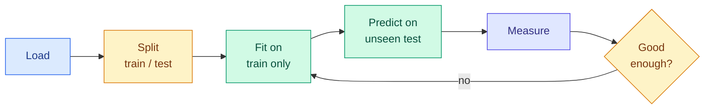

# Your First scikit-learn Model

**Level:** 🟡 Intermediate &nbsp;|&nbsp; **Effort:** Detailed module &nbsp;|&nbsp; **Module:** [01 Python Foundations](README.md)

---

## 🎯 Learning Objectives

By the end of this topic you will be able to:

- Take a CSV file to a trained, evaluated model without skipping a step
- Split data correctly, and explain what the test set is for
- Use `fit`/`predict`/`score`, and recognise the pattern from earlier topics
- Build a `Pipeline` so preprocessing cannot leak
- Read regression and classification metrics, and pick the right one
- Compare a fitted model against a **known** ground truth
- Say what this workflow does *not* yet prove

## 📚 Prerequisites

Topics [11](11-numpy-essentials.md), [12](12-pandas-essentials.md) and
[13](13-visualisation.md).

```bash
pip install -r requirements.txt      # scikit-learn==1.5.2
```

Examples were executed with **scikit-learn 1.5.2** and read from `datasets/samples/`, so run them
from the repository root.

> **This is the mechanics, not the theory.** Why gradient descent converges, what a loss surface
> looks like and when a linear model is the wrong choice belong to
> [02 Mathematics for AI](../02-mathematics-for-ai/README.md) and
> [05 Machine Learning](../05-machine-learning/README.md). Here you learn the moves.

---

## 1. The shape of every supervised problem



Two conventions you will see everywhere:

- **`X`** — the features, a 2-D array shaped `(n_samples, n_features)`. Capital, because it is a matrix.
- **`y`** — the target, a 1-D array of length `n_samples`. Lowercase, because it is a vector.

```python
import pandas as pd

housing = pd.read_csv("datasets/samples/housing.csv")

feature_names = ["area_sqm", "bedrooms", "age_years", "distance_km"]
X = housing[feature_names]
y = housing["price_thousands"]

print(f"X shape: {X.shape}   (samples, features)")
print(f"y shape: {y.shape}   (samples,)")
print(f"features: {feature_names}")
print(f"any missing values: {X.isna().any().any() or y.isna().any()}")
```

**Output:**
```
X shape: (150, 4)   (samples, features)
y shape: (150,)   (samples,)
features: ['area_sqm', 'bedrooms', 'age_years', 'distance_km']
any missing values: False
```

---

## 2. The split, and why it is not optional

```python
import pandas as pd
from sklearn.model_selection import train_test_split

housing = pd.read_csv("datasets/samples/housing.csv")
X = housing[["area_sqm", "bedrooms", "age_years", "distance_km"]]
y = housing["price_thousands"]

X_train, X_test, y_train, y_test = train_test_split(
    X, y, test_size=0.2, random_state=42
)

print(f"train: {X_train.shape[0]} samples")
print(f"test:  {X_test.shape[0]} samples")
print(f"no overlap: {set(X_train.index).isdisjoint(set(X_test.index))}")
print(f"reproducible: {X_train.index[0] == train_test_split(X, y, test_size=0.2, random_state=42)[0].index[0]}")
```

**Output:**
```
train: 120 samples
test:  30 samples
no overlap: True
reproducible: True
```

**The test set exists to answer one question: how does this model do on data it has never seen?**
The moment you use it to make a decision — choosing a model, tuning a parameter, deciding when to
stop — it stops being unseen and its estimate becomes optimistic. That is what a *validation* set is
for; the test set is opened once, at the end.

`random_state=42` makes the split reproducible. Without it, every run gives different numbers and
you cannot tell an improvement from luck. **Always set it, and record it** — the frozen config
dataclass from [Topic 8](08-type-hints-dataclasses-logging-debugging.md) is where it belongs.

That `isdisjoint` check is the leakage test from [Topic 4](04-data-structures.md), now doing real
work.

### ⚠️ A random split is not always the right split

| Your data | Correct split |
| --- | --- |
| Independent rows | Random — what `train_test_split` does |
| Multiple rows **per user** | Split by *user*, or the same person appears on both sides |
| A time series | Split by *time* — training on the future is not a prediction |
| Rare positive class | `stratify=y`, so both sides keep the class balance |

Getting this wrong produces excellent scores and a model that fails in production. It is the single
most expensive mistake in applied machine learning, and it is covered properly in
[03 Data Foundations](../03-data-foundations/README.md).

---

## 3. Fit, predict, score

Every scikit-learn estimator has the same three methods — the duck-typed interface you built by
hand in [Topic 6](06-object-oriented-programming.md).

```python
import pandas as pd
from sklearn.linear_model import LinearRegression
from sklearn.metrics import mean_absolute_error, r2_score
from sklearn.model_selection import train_test_split

housing = pd.read_csv("datasets/samples/housing.csv")
feature_names = ["area_sqm", "bedrooms", "age_years", "distance_km"]
X, y = housing[feature_names], housing["price_thousands"]

X_train, X_test, y_train, y_test = train_test_split(X, y, test_size=0.2, random_state=42)

model = LinearRegression()
model.fit(X_train, y_train)              # learn from training data only
predictions = model.predict(X_test)      # apply to unseen data

print(f"first 3 predictions: {predictions[:3].round(1)}")
print(f"first 3 actual:      {y_test.head(3).round(1).tolist()}")
print()
print(f"R2 on test:  {r2_score(y_test, predictions):.4f}")
print(f"MAE on test: {mean_absolute_error(y_test, predictions):.2f} thousand")
print(f"R2 on train: {model.score(X_train, y_train):.4f}")
```

**Output:**
```
first 3 predictions: [460.2 223.9 554.4]
first 3 actual:      [465.3, 246.6, 525.2]

R2 on test:  0.9846
MAE on test: 16.68 thousand
R2 on train: 0.9885
```

**Read the last two lines together.** Training and test R² are close, so the model is not
memorising — it generalises. A large gap the other way (train 0.99, test 0.61) is overfitting.

### 🌍 What the model actually learned

This dataset is unusual: the generating process is **published** in its
[dataset card](../datasets/samples/README.md). So you can check the model against the truth, which
you can essentially never do with real data.

```python
import pandas as pd
from sklearn.linear_model import LinearRegression
from sklearn.model_selection import train_test_split

housing = pd.read_csv("datasets/samples/housing.csv")
feature_names = ["area_sqm", "bedrooms", "age_years", "distance_km"]
X, y = housing[feature_names], housing["price_thousands"]
X_train, X_test, y_train, y_test = train_test_split(X, y, test_size=0.2, random_state=42)

model = LinearRegression().fit(X_train, y_train)

truth = {"area_sqm": 3.2, "bedrooms": 12.0, "age_years": -1.4, "distance_km": -4.5}

print(f"{'feature':<14}{'learned':>10}{'true':>10}{'error':>10}")
for name, learned in zip(feature_names, model.coef_, strict=True):
    print(f"{name:<14}{learned:>10.2f}{truth[name]:>10.2f}{learned - truth[name]:>10.2f}")
print(f"{'intercept':<14}{model.intercept_:>10.2f}{60.0:>10.2f}{model.intercept_ - 60.0:>10.2f}")
```

**Output:**
```
feature          learned      true     error
area_sqm            3.29      3.20      0.09
bedrooms           13.18     12.00      1.18
age_years          -1.42     -1.40     -0.02
distance_km        -4.25     -4.50      0.25
intercept          41.09     60.00    -18.91
```

**The coefficients recover the true generating process closely, and the intercept much less so.**
That is normal and worth understanding: the intercept is the predicted price of a property with zero
area, zero bedrooms and age zero — far outside the range of anything in the data, so nothing
constrains it well. **Never interpret an intercept that describes an impossible input.**

The slopes are recovered well because 120 training samples with a genuinely linear relationship is a
comfortable amount of data. Real problems are neither linear nor this obliging.

---

## 4. Scaling, leakage, and why you want a Pipeline

Many models — anything distance- or penalty-based — need features on comparable scales.
`area_sqm` runs to 200 while `bedrooms` runs to 5.

**The wrong way**, which quietly leaks:

```python
# check-examples: skip
scaler = StandardScaler().fit(X)          # fitted on EVERYTHING, test included
X_scaled = scaler.transform(X)
X_train, X_test, ... = train_test_split(X_scaled, y)    # too late
```

The scaler has already seen the test set's mean and standard deviation, so information from the test
set is baked into the training features. Your score improves and the improvement is fictional.

**The right way** — a `Pipeline`, which is the composition idea from
[Topic 6](06-object-oriented-programming.md) made concrete:

```python
import pandas as pd
from sklearn.linear_model import Ridge
from sklearn.metrics import mean_absolute_error, r2_score
from sklearn.model_selection import train_test_split
from sklearn.pipeline import Pipeline
from sklearn.preprocessing import StandardScaler

housing = pd.read_csv("datasets/samples/housing.csv")
X = housing[["area_sqm", "bedrooms", "age_years", "distance_km"]]
y = housing["price_thousands"]
X_train, X_test, y_train, y_test = train_test_split(X, y, test_size=0.2, random_state=42)

pipeline = Pipeline([
    ("scale", StandardScaler()),
    ("model", Ridge(alpha=1.0)),
])

pipeline.fit(X_train, y_train)
predictions = pipeline.predict(X_test)

print(f"steps: {[name for name, _ in pipeline.steps]}")
print(f"R2:    {r2_score(y_test, predictions):.4f}")
print(f"MAE:   {mean_absolute_error(y_test, predictions):.2f} thousand")

scaler = pipeline.named_steps["scale"]
print(f"\nscaler learned means from {scaler.n_samples_seen_} samples")
print(f"training samples:            {len(X_train)}")
print(f"test set never seen by the scaler: {scaler.n_samples_seen_ == len(X_train)}")
```

**Output:**
```
steps: ['scale', 'model']
R2:    0.9852
MAE:   16.39 thousand

scaler learned means from 120 samples
training samples:            120
test set never seen by the scaler: True
```

**That last line is the whole point.** `pipeline.fit` fits the scaler on training data only;
`pipeline.predict` *reuses* those statistics. Leakage is not something you have to remember to
avoid — the structure prevents it.

---

## 5. Evaluating honestly

### One split is one sample

A single train/test split gives one number, and that number depends on which rows happened to land
in the test set. **Cross-validation** rotates the held-out slice.

```python
import numpy as np
import pandas as pd
from sklearn.linear_model import LinearRegression
from sklearn.model_selection import KFold, cross_val_score

housing = pd.read_csv("datasets/samples/housing.csv")
X = housing[["area_sqm", "bedrooms", "age_years", "distance_km"]]
y = housing["price_thousands"]

folds = KFold(n_splits=5, shuffle=True, random_state=42)
scores = cross_val_score(LinearRegression(), X, y, cv=folds, scoring="r2")

print(f"fold scores: {scores.round(4)}")
print(f"mean:  {scores.mean():.4f}")
print(f"std:   {scores.std():.4f}")
print(f"range: {scores.min():.4f} to {scores.max():.4f}")
```

**Output:**
```
fold scores: [0.9846 0.9867 0.9933 0.9847 0.9826]
mean:  0.9864
std:   0.0037
range: 0.9826 to 0.9933
```

**Report the mean *and* the spread.** A model scoring 0.95 ± 0.01 is a different proposition from
one scoring 0.95 ± 0.12, and quoting only the mean hides that entirely.

### Always compare against a baseline

A score means nothing on its own. The first question about any model is: **is it better than the
obvious thing?**

```python
import pandas as pd
from sklearn.dummy import DummyRegressor
from sklearn.linear_model import LinearRegression
from sklearn.metrics import mean_absolute_error, r2_score
from sklearn.model_selection import train_test_split

housing = pd.read_csv("datasets/samples/housing.csv")
X = housing[["area_sqm", "bedrooms", "age_years", "distance_km"]]
y = housing["price_thousands"]
X_train, X_test, y_train, y_test = train_test_split(X, y, test_size=0.2, random_state=42)

baseline = DummyRegressor(strategy="mean").fit(X_train, y_train)
model = LinearRegression().fit(X_train, y_train)

print(f"{'model':<20}{'R2':>10}{'MAE':>10}")
for name, estimator in [("always the mean", baseline), ("linear regression", model)]:
    prediction = estimator.predict(X_test)
    print(f"{name:<20}{r2_score(y_test, prediction):>10.4f}{mean_absolute_error(y_test, prediction):>10.2f}")
```

**Output:**
```
model                       R2       MAE
always the mean        -0.0147    135.92
linear regression       0.9846     16.68
```

**R² = 0 is what "predict the mean every time" scores** — that is the meaning of the number: the
fraction of variance explained beyond the trivial answer.

Note the baseline actually scored **−0.0147**, not exactly 0, and the reason is worth knowing. It
predicts the mean of the *training* set, while R² is computed against the mean of the *test* set.
Those two means differ slightly, so the baseline lands a fraction below zero. A negative R² means
worse than predicting the mean — which happens more often than people admit.

### Regression metrics

| Metric | Reads as | Note |
| --- | --- | --- |
| **MAE** | Average error in the target's own units | Easy to explain; treats all errors equally |
| **RMSE** | Like MAE but punishes large errors more | Use when big misses are disproportionately bad |
| **R²** | Fraction of variance explained | 0 = predicting the mean, 1 = perfect, negative = worse than the mean |

**Quote at least one metric in real units.** "MAE of 14 thousand" tells a stakeholder something;
"R² of 0.96" does not.

---

## 6. Classification, briefly

Same three methods, different metrics. Here the target is the sentiment label from `reviews.csv`.

```python
import pandas as pd
from sklearn.dummy import DummyClassifier
from sklearn.feature_extraction.text import TfidfVectorizer
from sklearn.linear_model import LogisticRegression
from sklearn.metrics import accuracy_score, classification_report
from sklearn.model_selection import train_test_split
from sklearn.pipeline import Pipeline

reviews = pd.read_csv("datasets/samples/reviews.csv")
reviews["label"] = reviews["label"].str.strip().str.lower()
reviews["text"] = reviews["text"].str.strip()
reviews = reviews.drop_duplicates()

X, y = reviews["text"], reviews["label"]
X_train, X_test, y_train, y_test = train_test_split(
    X, y, test_size=0.25, random_state=42, stratify=y
)

pipeline = Pipeline([
    ("tfidf", TfidfVectorizer()),
    ("model", LogisticRegression(max_iter=1000)),
])
pipeline.fit(X_train, y_train)
predictions = pipeline.predict(X_test)

baseline = DummyClassifier(strategy="most_frequent").fit(X_train, y_train)

print(f"baseline accuracy: {accuracy_score(y_test, baseline.predict(X_test)):.3f}")
print(f"model accuracy:    {accuracy_score(y_test, predictions):.3f}")
print()
print(classification_report(y_test, predictions, zero_division=0))
```

**Output:**
```
baseline accuracy: 0.600
model accuracy:    1.000

              precision    recall  f1-score   support

    negative       1.00      1.00      1.00         6
    positive       1.00      1.00      1.00         9

    accuracy                           1.00        15
   macro avg       1.00      1.00      1.00        15
weighted avg       1.00      1.00      1.00        15

```

`stratify=y` keeps the class balance in both splits — essential when one class is rarer.

### ⚠️ This result is too good, and you should distrust it

**Accuracy near 1.0 on a first attempt is a warning, not a triumph.** Here the reason is knowable:
the review text is generated from a small set of templates
([dataset card](../datasets/samples/README.md)), so the same phrases appear in training and test
rows. The model is matching template fragments, not learning sentiment.

That is a **near-duplicate leakage** problem, and it is extremely common with real text too —
scraped datasets are full of reposts, boilerplate and repeated descriptions. The lesson to carry
forward: when a score looks wonderful, go looking for the leak before you celebrate.

### ⚠️ Accuracy is the wrong metric for imbalanced classes

With 99 negatives and 1 positive, predicting "negative" always scores 99% accuracy and finds nothing.

| Metric | Answers |
| --- | --- |
| **Precision** | Of what I flagged, how much was right? |
| **Recall** | Of what was actually there, how much did I find? |
| **F1** | The harmonic mean, when you need both |

Which matters is a decision about consequences, not statistics: screening for a disease wants
recall, filtering spam into a folder people rarely check wants precision.
[07 Model Evaluation](../07-model-evaluation/README.md) covers this properly.

---

## 7. Saving the model — and the 🔐 warning

```python
import tempfile
from pathlib import Path

import joblib
import pandas as pd
from sklearn.linear_model import LinearRegression
from sklearn.model_selection import train_test_split

housing = pd.read_csv("datasets/samples/housing.csv")
X = housing[["area_sqm", "bedrooms", "age_years", "distance_km"]]
y = housing["price_thousands"]
X_train, X_test, y_train, y_test = train_test_split(X, y, test_size=0.2, random_state=42)

model = LinearRegression().fit(X_train, y_train)
original = model.predict(X_test)

with tempfile.TemporaryDirectory() as tmp:
    path = Path(tmp) / "model.joblib"
    joblib.dump(model, path)
    reloaded = joblib.load(path)
    reloaded_predictions = reloaded.predict(X_test)

print(f"file written:            {path.name}")
print(f"identical predictions:   {(original == reloaded_predictions).all()}")
```

**Output:**
```
file written:            model.joblib
identical predictions:   True
```

That round-trip check is one of the tests recommended in
[Topic 9](09-testing-and-package-management.md) — a model that predicts differently after reloading
is a real and common bug.

### 🔐 Never load a model file you do not trust

`joblib` and `pickle` **execute code while loading**. A malicious `.joblib` or `.pkl` file runs
arbitrary commands the moment you open it — there is no safe "just inspect it" mode. Treat a model
file exactly as you would treat a script from a stranger.

- Load only artefacts you or your team produced, from storage you control
- Verify a checksum when a file crosses a trust boundary
- For sharing across organisations, prefer formats without code execution, such as ONNX
- **Never** load a model straight from a user upload or an untrusted download

Save the configuration alongside the model — the `asdict` JSON from
[Topic 8](08-type-hints-dataclasses-logging-debugging.md) — so six months later you know which data
and which seed produced it.

---

## 🧪 Hands-on lab: the whole thing, end to end

Every step from earlier topics, in one script: load, inspect, split, baseline, pipeline, evaluate,
compare against truth.

```python
import numpy as np
import pandas as pd
from sklearn.dummy import DummyRegressor
from sklearn.linear_model import LinearRegression
from sklearn.metrics import mean_absolute_error, r2_score, root_mean_squared_error
from sklearn.model_selection import KFold, cross_val_score, train_test_split
from sklearn.pipeline import Pipeline
from sklearn.preprocessing import StandardScaler

RANDOM_STATE = 42
FEATURES = ["area_sqm", "bedrooms", "age_years", "distance_km"]

housing = pd.read_csv("datasets/samples/housing.csv")

print("1. DATA")
print(f"   rows {len(housing)}, missing values {int(housing.isna().sum().sum())}, "
      f"duplicates {int(housing.duplicated().sum())}")

X, y = housing[FEATURES], housing["price_thousands"]
X_train, X_test, y_train, y_test = train_test_split(
    X, y, test_size=0.2, random_state=RANDOM_STATE
)
print("\n2. SPLIT")
print(f"   train {len(X_train)}, test {len(X_test)}, "
      f"disjoint {set(X_train.index).isdisjoint(set(X_test.index))}")

pipeline = Pipeline([("scale", StandardScaler()), ("model", LinearRegression())])
pipeline.fit(X_train, y_train)
predictions = pipeline.predict(X_test)
baseline = DummyRegressor(strategy="mean").fit(X_train, y_train)

print("\n3. RESULTS ON THE HELD-OUT TEST SET")
print(f"   {'':<18}{'R2':>9}{'MAE':>9}{'RMSE':>9}")
for name, prediction in [
    ("baseline (mean)", baseline.predict(X_test)),
    ("linear pipeline", predictions),
]:
    print(f"   {name:<18}{r2_score(y_test, prediction):>9.4f}"
          f"{mean_absolute_error(y_test, prediction):>9.2f}"
          f"{root_mean_squared_error(y_test, prediction):>9.2f}")

folds = KFold(n_splits=5, shuffle=True, random_state=RANDOM_STATE)
scores = cross_val_score(pipeline, X, y, cv=folds, scoring="r2")
print(f"\n4. CROSS-VALIDATION\n   R2 {scores.mean():.4f} +/- {scores.std():.4f}")

print("\n5. AGAINST THE KNOWN TRUTH")
raw_model = LinearRegression().fit(X_train, y_train)
truth = {"area_sqm": 3.2, "bedrooms": 12.0, "age_years": -1.4, "distance_km": -4.5}
for name, learned in zip(FEATURES, raw_model.coef_, strict=True):
    print(f"   {name:<14}learned {learned:>7.2f}   true {truth[name]:>6.2f}")

residuals = y_test - predictions
print(f"\n6. RESIDUALS\n   mean {residuals.mean():.3f}, std {residuals.std():.2f}, "
      f"generating noise sigma was 18.0")
```

**Output:**
```
1. DATA
   rows 150, missing values 0, duplicates 0

2. SPLIT
   train 120, test 30, disjoint True

3. RESULTS ON THE HELD-OUT TEST SET
                            R2      MAE     RMSE
   baseline (mean)     -0.0147   135.92   166.60
   linear pipeline      0.9846    16.68    20.52

4. CROSS-VALIDATION
   R2 0.9864 +/- 0.0037

5. AGAINST THE KNOWN TRUTH
   area_sqm      learned    3.29   true   3.20
   bedrooms      learned   13.18   true  12.00
   age_years     learned   -1.42   true  -1.40
   distance_km   learned   -4.25   true  -4.50

6. RESIDUALS
   mean 2.480, std 20.72, generating noise sigma was 18.0
```

**Read step 6 carefully.** The residual standard deviation is **20.72** against a generating noise
sigma of **18.0** — the same order, slightly above, which is what you expect when it is estimated
from only 30 test rows. The model has therefore captured essentially all the *learnable* signal, and
no amount of extra modelling can beat that floor: the remaining error is noise by construction.

The residual mean of 2.48 rather than 0 is the same small-sample effect. On 30 points, that is
noise, not bias — but on a real project you would check it does not grow with the prediction, which
is what a residual plot is for ([Topic 13](13-visualisation.md)).

Knowing when you have hit the noise floor is one of the most useful judgements in applied machine
learning, and this dataset is a rare case where you can see it directly.

**Extend it:** plot predicted against actual with a 45-degree reference line
([Topic 13](13-visualisation.md)); add `bedrooms` as a one-hot encoded categorical with
`ColumnTransformer` and see whether it helps; and write a pytest test asserting the pipeline beats
the baseline.

---

## 8. What this does *not* prove

A tidy workflow and a good number are not the same as a good model.

- **The relationship really is linear here**, by construction. A linear model was guaranteed to work.
- **150 rows is tiny.** Estimates from small samples move a lot between splits.
- **Synthetic data has none of the hard parts**: no shifting definitions, no schema drift, no
  ambiguous labels, no seasonality, no adversarial users.
- **A test score is a snapshot.** Production data changes; the model does not
  ([29 MLOps](../29-mlops/README.md)).
- **Nothing here checks fairness, robustness or calibration**
  ([26 Responsible AI](../26-responsible-ai/README.md)).

You have learned the mechanics. The judgement comes next.

---

## 🎤 Interview questions

**"Walk me through training your first model."**

Load and inspect the data — shape, dtypes, missing values, duplicates. Separate features `X` from
target `y`. Split into train and test with a fixed random state, choosing the split strategy that
matches the data's structure (random, grouped, or by time). Fit a trivial baseline first so there is
something to beat. Put preprocessing and the estimator into a `Pipeline` so the scaler is fitted on
training data only. Fit, predict on the test set, and report a metric in real units alongside a
variance estimate from cross-validation. Then check whether the result is suspiciously good.

**"Why use a Pipeline instead of scaling first?"**

Fitting a scaler on the whole dataset lets the test set's mean and standard deviation influence the
training features — leakage, producing an optimistic score that will not hold. A `Pipeline` fits
every step on training data only and reuses those parameters at predict time, so the correct
behaviour is structural rather than something you must remember. It also means cross-validation
refits preprocessing inside each fold, which is the only correct way to do it.

**"What does R² = 0 mean?"**

The model performs exactly as well as predicting the mean of the target for every sample. R² is the
proportion of variance explained relative to that baseline, so 1.0 is perfect, 0 is no better than
the mean, and negative values mean actively worse than the mean.

**"Your first model scores 99% accuracy. What do you do?"**

Distrust it and look for a leak. Common causes: a feature computed using the target, near-duplicate
rows spanning both splits, splitting randomly when rows are grouped by user or ordered in time, or
preprocessing fitted before the split. Check the class balance too — 99% accuracy on 99% negatives
is what a constant predictor achieves. Compare against a dummy baseline before believing anything.

---

## ✅ Key takeaways

- `X` is `(n_samples, n_features)`, `y` is `(n_samples,)`. Every estimator uses `fit`/`predict`.
- **The test set is opened once.** Use it to decide anything and it stops being an honest estimate.
- Set and record `random_state`, or you cannot tell improvement from luck.
- **Match the split to the data**: grouped for repeated users, chronological for time series,
  stratified for rare classes.
- **Always fit a dummy baseline first.** A score without a comparison is not information.
- Put preprocessing in a `Pipeline` — it makes leakage structurally impossible.
- Report a metric in real units (MAE) plus a spread from cross-validation, not one bare number.
- `R2 = 0` means "no better than predicting the mean"; negative means worse.
- **A suspiciously high score is a bug report.** Look for the leak.
- Never interpret an intercept describing an input that cannot exist.
- **`joblib`/`pickle` execute code on load.** Never open an untrusted model file.
- Good mechanics do not make a good model. Data quality and judgement decide that.

---

## 📚 Official References

- [scikit-learn documentation — scikit-learn developers](https://scikit-learn.org/stable/) — verified 2026-07-27
- [Getting Started — scikit-learn developers](https://scikit-learn.org/stable/getting_started.html) — verified 2026-07-27
- [Cross-validation: evaluating estimator performance — scikit-learn developers](https://scikit-learn.org/stable/modules/cross_validation.html) — verified 2026-07-27
- [Pipelines and composite estimators — scikit-learn developers](https://scikit-learn.org/stable/modules/compose.html) — verified 2026-07-27
- [Metrics and scoring — scikit-learn developers](https://scikit-learn.org/stable/modules/model_evaluation.html) — verified 2026-07-27
- [Common pitfalls and recommended practices — scikit-learn developers](https://scikit-learn.org/stable/common_pitfalls.html) — verified 2026-07-27
- [Model persistence — scikit-learn developers](https://scikit-learn.org/stable/model_persistence.html) — verified 2026-07-27
- [joblib documentation — Joblib developers](https://joblib.readthedocs.io/en/stable/) — verified 2026-07-27

---

## 🔗 Navigation

[← Topic 13: Visualisation](13-visualisation.md) &nbsp;|&nbsp;
[Module home](README.md) &nbsp;|&nbsp;
[Next module: 02 Mathematics for AI →](../02-mathematics-for-ai/README.md)
