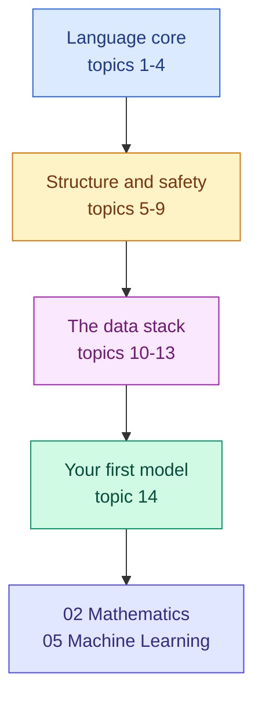

<!-- status: authored -->

# 01. Python Foundations

**Level:** 🟢 Beginner → 🟡 Intermediate &nbsp;|&nbsp; **Effort:** Multi-session &nbsp;|&nbsp; **Status:** ✅ Complete

Python from your first variable to AI-ready code. Every example here is about data, text or
models — because you are learning Python *in order to do machine learning*, and generic
"print a shopping list" exercises waste your time.

---

## 🎯 Learning Objectives

By the end of this module you will be able to:

- Write, run and debug Python scripts and notebooks with confidence
- Choose the right built-in data structure for a given data task, and say why
- Read and write JSON, CSV and HTTP API responses
- Use NumPy arrays and pandas DataFrames for real data manipulation
- Structure code into modules, packages and tested functions
- Read the Python you will meet in machine-learning libraries and tutorials

## 📚 Prerequisites

[00 Getting Started](../00-getting-started/README.md) — you need a working Python, an activated
virtual environment, and a terminal you are not afraid of.

```bash
source .venv/bin/activate      # Windows: .\.venv\Scripts\Activate.ps1
python --version               # 3.10 or newer
```

---

## 📑 Topics

| # | Topic | Covers | Status |
| --- | --- | --- | --- |
| 1 | [Variables, Data Types and Operators](01-variables-and-data-types.md) | Names, `int`/`float`/`str`/`bool`, arithmetic, comparison, truthiness | ✅ |
| 2 | [Control Flow](02-control-flow.md) | `if`/`elif`/`else`, `for`, `while`, `break`, comprehensions | ✅ |
| 3 | [Functions](03-functions.md) | Arguments, defaults, `*args`/`**kwargs`, scope, closures, the mutable-default trap | ✅ |
| 4 | [Data Structures](04-data-structures.md) | Lists, tuples, sets, dictionaries, strings — and when to use which | ✅ |
| 5 | [Files, Exceptions, Modules and Packages](05-files-exceptions-and-modules.md) | `with`, `pathlib`, catching specifically, raising clearly, imports, project layout | ✅ |
| 6 | [Object-Oriented Programming](06-object-oriented-programming.md) | Classes, `self`, inheritance, duck typing, composition, the `fit`/`predict` pattern | ✅ |
| 7 | [Pythonic Patterns](07-pythonic-patterns.md) | Iterators, generators, decorators, context managers, `itertools` | ✅ |
| 8 | [Type Hints, Dataclasses, Logging and Debugging](08-type-hints-dataclasses-logging-debugging.md) | Modern Python for maintainable ML code | ✅ |
| 9 | [Testing and Package Management](09-testing-and-package-management.md) | pytest, fixtures, what to test in ML code, virtual environments, dependency pinning | ✅ |
| 10 | [Working with JSON, CSV and APIs](10-json-csv-and-apis.md) | JSON, JSONL, CSV quoting, HTTP status handling, pagination, credentials | ✅ |
| 11 | [NumPy Essentials](11-numpy-essentials.md) | Arrays, dtype, views vs copies, boolean masks, broadcasting, axes, NaN | ✅ |
| 12 | [pandas Essentials](12-pandas-essentials.md) | DataFrames, `.loc`/`.iloc`, cleaning, `groupby`, merging, time series | ✅ |
| 13 | [Visualisation](13-visualisation.md) | Anscombe's quartet, chart choice, misleading axes, saving figures | ✅ |
| 14 | [Your First scikit-learn Model](14-your-first-scikit-learn-model.md) | Split, baseline, `Pipeline`, metrics, model against known truth | ✅ |

**All fourteen topics are written and verified.** Read them in order — each builds on the last, and
topic 14 assembles the whole module into one working model.

---

## 🗺️ How the pieces fit



**You do not need all of this before starting machine learning.** Topics 1–4 plus 11–12 (NumPy and
pandas) are enough to begin [05 Machine Learning](../05-machine-learning/README.md). The rest makes
your code maintainable, which matters the moment anyone else reads it — including you, in a month.

**If you are impatient**, read 1–4, then jump to 11, 12 and 14 to build something, then come back
for 5–10 when your code starts being hard to change. That moment usually arrives sooner than
expected.

---

## 📊 The data you will use

From topic 10 onward the examples use real committed files rather than toy literals:

| Dataset | Used by | Contains, on purpose |
| --- | --- | --- |
| [`reviews.csv`](../datasets/samples/reviews.csv) | 12, 14 | missing ratings, wrong-case labels, duplicates, commas inside text |
| [`sensor_readings.csv`](../datasets/samples/sensor_readings.csv) | 11, 12, 13 | missing readings, an impossible 148 °C spike, a silently dead sensor |
| [`housing.csv`](../datasets/samples/housing.csv) | 13, 14 | a regression whose **true coefficients are published** |
| [`customers.jsonl`](../datasets/samples/customers.jsonl) | 10 | nested records with absent optional fields |

They are synthetic, generated by a committed script, and documented in
[`datasets/samples/README.md`](../datasets/samples/README.md) — including the limits of what
synthetic data can teach you.

## 🧪 Running the examples

Every code block in this module has been executed and its **real output** is shown beneath it.
That is enforced, not promised — `scripts/check_examples.py` runs every documented example in
continuous integration and fails the build if the output disagrees with the document:

```bash
python scripts/check_examples.py 01-python-foundations/
```

If your own output differs from what is printed here, something is wrong with your environment —
go back to [00 Getting Started](../00-getting-started/README.md#-troubleshooting).

## 📝 Practice

- Quiz: [`quizzes/01-python-foundations.md`](../quizzes/01-python-foundations.md)
- Answers: [`quizzes/answers/01-python-foundations.md`](../quizzes/answers/01-python-foundations.md)
- Assignments: [`assignments/01-python-foundations.md`](../assignments/01-python-foundations.md)

---

## ⚠️ How to actually learn this

**Type the examples. Do not copy-paste them.** The muscle memory and the typos are both part of
learning — you will meet those same typos as real errors later, and having seen them once is worth
more than reading a correct example twice.

**Break things deliberately.** Change a value, delete a line, and predict the error before you run
it. Being able to predict an error is the skill; reading one is not.

**Do not aim for fluency before moving on.** You will write Python for the rest of this repository.
Reading fluency comes from use, not from finishing a syllabus.

---

## 📚 Official References

- [The Python Tutorial — Python Software Foundation](https://docs.python.org/3/tutorial/) — verified 2026-07-27
- [Python Standard Library — Python Software Foundation](https://docs.python.org/3/library/) — verified 2026-07-27
- [Python Language Reference — Python Software Foundation](https://docs.python.org/3/reference/) — verified 2026-07-27
- [PEP 8 Style Guide — Python Software Foundation](https://peps.python.org/pep-0008/) — verified 2026-07-27

---

## 🔗 Navigation

[← 00 Getting Started](../00-getting-started/README.md) &nbsp;|&nbsp;
[🏠 Repository Home](../README.md) &nbsp;|&nbsp;
[Topic 1: Variables and Data Types →](01-variables-and-data-types.md)

**Next module:** [02 Mathematics for AI](../02-mathematics-for-ai/README.md)
