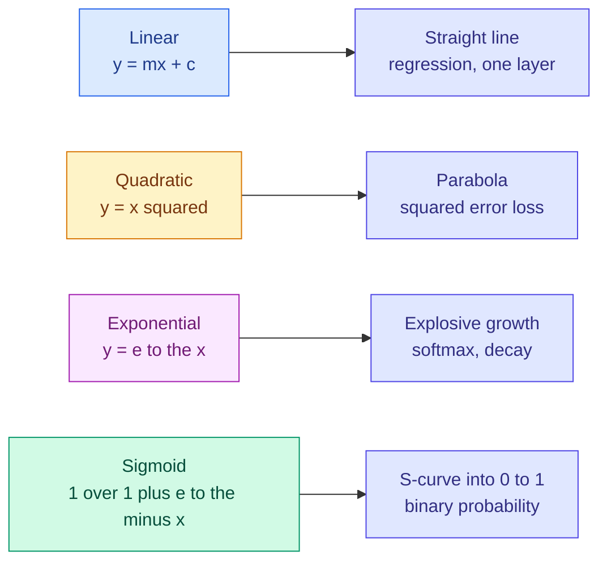

# Basic Mathematics for AI

**Level:** 🟢 Beginner &nbsp;|&nbsp; **Effort:** Detailed module &nbsp;|&nbsp; **Module:** [02 Mathematics for AI](README.md)

---

## 🎯 Learning Objectives

By the end of this topic you will be able to:

- Read the notation that appears in every machine-learning paper: Σ, Π, subscripts, superscripts
- Explain what a logarithm is and why loss functions are full of them
- Work with exponentials, and say why `exp` turns any number into a positive one
- Recognise the handful of functions that appear everywhere: linear, quadratic, exponential, sigmoid
- Convert a written formula into working NumPy, and check it against the library version

## 📚 Prerequisites

[01 Python Foundations](../01-python-foundations/README.md), particularly
[NumPy](../01-python-foundations/11-numpy-essentials.md).

```bash
pip install -r requirements.txt      # numpy==2.1.3
```

---

## 1. Why this topic exists

**You do not need university mathematics to do machine learning. You do need to stop being
frightened of the notation**, because every explanation worth reading uses it.

This topic covers the symbols and functions that appear constantly. Each one is introduced with the
AI problem it solves, never as a formula for its own sake.

| You will meet | It appears in |
| --- | --- |
| Σ (summation) | Every loss function, every mean, every dot product |
| log | Cross-entropy loss, log-likelihood, perplexity, learning-rate schedules |
| exp | Softmax, sigmoid, Gaussian distributions, temperature in language models |
| Subscripts and superscripts | Indexing samples, features, layers and time steps |

---

## 2. Notation you must be able to read

### Subscripts and superscripts

| Notation | Means |
| --- | --- |
| `x_i` (xᵢ) | The **i-th item** in a collection — sample i, feature i |
| `x^2` | x squared — a power |
| `x^(l)` | Often "layer l" in deep learning, **not** a power. Context decides. |
| `y_hat` (ŷ) | The **predicted** value, as opposed to `y`, the true value |
| `n` | Number of samples |
| `d` | Number of features (dimensions) |

**The hat is the single most useful symbol to recognise.** `y` is truth, `ŷ` is what the model
said, and every loss function is some measurement of the gap between them.

### Σ — summation

Σ means "add up". The notation says where to start, where to stop, and what to add:

```text
  n
  Σ  x_i        =  x_1 + x_2 + ... + x_n
 i=1
```

Read it as a `for` loop, because that is exactly what it is:

```python
import numpy as np

x = [3.0, 1.0, 4.0, 1.0, 5.0]

# The formula, written as a loop
total = 0.0
for value in x:
    total += value

print(f"loop:      {total}")
print(f"sum():     {sum(x)}")
print(f"np.sum():  {np.sum(x)}")
print(f"the mean:  {np.sum(x) / len(x)}")
```

**Output:**
```
loop:      14.0
sum():     14.0
np.sum():  14.0
the mean:  2.8
```

The mean has its own notation, `x̄` ("x bar"), and is just that sum divided by n:

```text
        1   n
  x̄  =  ─   Σ  x_i
        n  i=1
```

### Π — product

Π is the same idea with multiplication instead of addition. It appears when combining
probabilities of independent events.

```python
import math

probabilities = [0.9, 0.8, 0.95]

product = 1.0
for p in probabilities:
    product *= p

print(f"product:      {product:.4f}")
print(f"math.prod:    {math.prod(probabilities):.4f}")
print(f"as a sum of logs: {math.exp(sum(math.log(p) for p in probabilities)):.4f}")
```

**Output:**
```
product:      0.6840
math.prod:    0.6840
as a sum of logs: 0.6840
```

**That last line is the trick that makes machine learning numerically possible.** Multiplying 10,000
probabilities together underflows to exactly zero in floating point; adding their logarithms does
not. Section 4 explains why.

---

## 3. Powers, roots and their rules

```python
import numpy as np

print(f"2 ** 10        = {2 ** 10}")
print(f"2 ** 0         = {2 ** 0}")
print(f"2 ** -1        = {2 ** -1}")
print(f"9 ** 0.5       = {9 ** 0.5}        (a square root is a power of one half)")
print(f"np.sqrt(9)     = {np.sqrt(9)}")
print(f"8 ** (1 / 3)   = {8 ** (1 / 3)}        (cube root, exact here)")
print(f"(2 ** 0.5) ** 2 = {(2 ** 0.5) ** 2!r}   <- not exactly 2")
print(f"equals 2?      {(2 ** 0.5) ** 2 == 2}")
```

**Output:**
```
2 ** 10        = 1024
2 ** 0         = 1
2 ** -1        = 0.5
9 ** 0.5       = 3.0        (a square root is a power of one half)
np.sqrt(9)     = 3.0
8 ** (1 / 3)   = 2.0        (cube root, exact here)
(2 ** 0.5) ** 2 = 2.0000000000000004   <- not exactly 2
equals 2?      False
```

Three rules do almost all the work:

| Rule | Example | Why it matters |
| --- | --- | --- |
| `a^m · a^n = a^(m+n)` | `2³·2⁴ = 2⁷` | Multiplying becomes adding — the basis of logarithms |
| `(a^m)^n = a^(mn)` | `(2³)² = 2⁶` | Simplifies compound growth |
| `a^-n = 1/a^n` | `2⁻¹ = 0.5` | Negative powers are reciprocals |

### ⚠️ Floating point again

Square-rooting 2 and squaring it back does **not** return exactly 2 — the same representation issue
as [`0.1 + 0.2 != 0.3`](../01-python-foundations/01-variables-and-data-types.md). Note that the cube
root above *is* exact on this platform: whether a given expression rounds back cleanly depends on
the specific values, which is exactly why you cannot rely on it. **Never compare computed floats
with `==`** — use `math.isclose` or `np.allclose`.

---

## 4. Logarithms — the most useful function in machine learning

### 🍰 Simple explanation

A logarithm asks: **"what power do I need to raise the base to, to get this number?"**

`log₁₀(1000) = 3`, because 10³ = 1000.

### 🏠 Real-life analogy

Logarithms are how humans naturally perceive things. The difference between £1 and £10 feels like
the difference between £100 and £1,000 — both are "ten times more". Earthquake magnitude, sound in
decibels and musical octaves are all logarithmic for the same reason.

### ⚙️ The property that matters

**A logarithm turns multiplication into addition.**

```text
  log(a · b) = log(a) + log(b)
  log(a / b) = log(a) − log(b)
  log(a^n)   = n · log(a)
```

```python
import numpy as np

a, b = 50.0, 400.0

print(f"log(a * b)         = {np.log(a * b):.6f}")
print(f"log(a) + log(b)    = {np.log(a) + np.log(b):.6f}")
print(f"log(a ** 3)        = {np.log(a ** 3):.6f}")
print(f"3 * log(a)         = {3 * np.log(a):.6f}")
```

**Output:**
```
log(a * b)         = 9.903488
log(a) + log(b)    = 9.903488
log(a ** 3)        = 11.736069
3 * log(a)         = 11.736069
```

### 💻 Why this saves machine learning from underflow

A language model assigns a probability to each token. The probability of a 1,000-token sequence is
the product of 1,000 numbers each well below 1.

```python
import numpy as np

rng = np.random.default_rng(0)
token_probabilities = rng.uniform(0.001, 0.05, size=1000)

naive = np.prod(token_probabilities)
log_version = np.sum(np.log(token_probabilities))

print(f"multiplying directly:  {naive}")
print(f"sum of logs:           {log_version:.2f}")
print(f"is the direct answer usable? {naive > 0}")
print(f"recovered probability: {np.exp(log_version)}")
```

**Output:**
```
multiplying directly:  0.0
sum of logs:           -3868.87
is the direct answer usable? False
recovered probability: 0.0
```

**The direct product is exactly `0.0`.** Not "very small" — the true value is far below the smallest
number a `float64` can represent, so it underflows to zero, and every subsequent calculation is
meaningless. The sum of logarithms is a perfectly ordinary negative number.

This is why you will see **log-likelihood** everywhere instead of likelihood, and why cross-entropy
loss is defined with a logarithm inside it.

### `log`, `ln` and `log₂`

| Written | Base | Used for |
| --- | --- | --- |
| `ln(x)` or `np.log(x)` | e ≈ 2.71828 | The default in mathematics and NumPy |
| `log₂(x)` | 2 | Information theory — entropy in **bits** |
| `log₁₀(x)` | 10 | Human-readable scales, plots |

```python
import numpy as np

x = 8.0
print(f"np.log(x)   (base e) = {np.log(x):.6f}")
print(f"np.log2(x)  (base 2) = {np.log2(x)}")
print(f"np.log10(x) (base 10)= {np.log10(x):.6f}")
print(f"change of base: log2(x) = ln(x)/ln(2) = {np.log(x) / np.log(2)}")
```

**Output:**
```
np.log(x)   (base e) = 2.079442
np.log2(x)  (base 2) = 3.0
np.log10(x) (base 10)= 0.903090
change of base: log2(x) = ln(x)/ln(2) = 3.0
```

### ⚠️ `log(0)` is negative infinity

```python
import numpy as np

predictions = np.array([0.9, 0.0, 0.7])       # the model was certain about the middle one

with np.errstate(divide="ignore"):
    logs = np.log(predictions)

print(f"log of each:  {logs}")
print(f"their mean:   {logs.mean()}")

epsilon = 1e-15
clipped = np.log(np.clip(predictions, epsilon, 1.0))
print(f"with clipping: {clipped.round(4)}")
print(f"their mean:    {clipped.mean():.4f}")
```

**Output:**
```
log of each:  [-0.10536052        -inf -0.35667494]
their mean:   -inf
with clipping: [ -0.1054 -34.5388  -0.3567]
their mean:    -11.6669
```

A model that predicts probability exactly 0 for the correct class produces an **infinite loss**, and
the gradient becomes `nan`, and training dies. Every real implementation adds a tiny `epsilon`
inside the logarithm, or works in log-space throughout. If you see `1e-15` in a loss function, this
is why.

---

## 5. The exponential function

`exp(x)` is `e^x`. It is the inverse of `ln`, and it has one property that machine learning leans on
constantly: **it turns any real number into a positive one.**

```python
import numpy as np

for value in [-10.0, -1.0, 0.0, 1.0, 10.0]:
    print(f"exp({value:>6.1f}) = {np.exp(value):>15.6f}")
```

**Output:**
```
exp( -10.0) =        0.000045
exp(  -1.0) =        0.367879
exp(   0.0) =        1.000000
exp(   1.0) =        2.718282
exp(  10.0) =    22026.465795
```

That is exactly what you need when a model produces an unbounded score and you want a probability.

### 💻 Softmax: scores to probabilities

```python
import numpy as np

scores = np.array([2.0, 1.0, 0.1])          # raw model outputs, called "logits"

exponentiated = np.exp(scores)
probabilities = exponentiated / np.sum(exponentiated)

print(f"logits:        {scores}")
print(f"after exp:     {exponentiated.round(4)}   (all positive)")
print(f"probabilities: {probabilities.round(4)}")
print(f"sum to 1:      {probabilities.sum():.10f}")
```

**Output:**
```
logits:        [2.  1.  0.1]
after exp:     [7.3891 2.7183 1.1052]   (all positive)
probabilities: [0.659  0.2424 0.0986]
sum to 1:      1.0000000000
```

Two steps: `exp` makes everything positive, then dividing by the total makes it sum to 1. That is
the whole of softmax, and it converts any vector of scores into a probability distribution.

### ⚠️ Softmax overflows if you write it naively

```python
import numpy as np

large = np.array([1000.0, 1001.0, 1002.0])

with np.errstate(over="ignore", invalid="ignore"):
    naive = np.exp(large) / np.sum(np.exp(large))

stable = np.exp(large - np.max(large)) / np.sum(np.exp(large - np.max(large)))

print(f"naive:  {naive}")
print(f"stable: {stable.round(6)}")
print(f"sums to 1: {stable.sum():.10f}")
```

**Output:**
```
naive:  [nan nan nan]
stable: [0.090031 0.244728 0.665241]
sums to 1: 1.0000000000
```

`exp(1000)` overflows to `inf`, and `inf / inf` is `nan`. **Subtracting the maximum first changes
nothing mathematically** — the constant cancels in the ratio — but keeps every exponent at or below
zero. Every production softmax does this. It is the most common numerical-stability trick in the
field.

---

## 6. Functions you will meet constantly



### The linear function

`y = mx + c` — `m` is the slope, `c` is the intercept. **A single-layer neural network is exactly
this**, with `m` called a weight and `c` called a bias.

```python
import numpy as np

def linear(x, weight, bias):
    """A straight line. Also: one neuron with no activation function."""
    return weight * x + bias

x = np.array([0.0, 1.0, 2.0, 3.0])
y = linear(x, weight=2.5, bias=1.0)

print(f"x: {x}")
print(f"y: {y}")
print(f"slope from two points: {(y[3] - y[0]) / (x[3] - x[0])}")
print(f"intercept (value at x=0): {y[0]}")
```

**Output:**
```
x: [0. 1. 2. 3.]
y: [1.  3.5 6.  8.5]
slope from two points: 2.5
intercept (value at x=0): 1.0
```

That slope calculation — rise over run — **is a derivative**, computed exactly, for the one function
where it is constant everywhere. Topic 4 generalises it to curves.

### The sigmoid

```python
import numpy as np

def sigmoid(x):
    """Squash any real number into (0, 1). The classic binary-probability function."""
    return 1.0 / (1.0 + np.exp(-x))

for value in [-6.0, -2.0, 0.0, 2.0, 6.0]:
    print(f"sigmoid({value:>5.1f}) = {sigmoid(value):.6f}")
```

**Output:**
```
sigmoid( -6.0) = 0.002473
sigmoid( -2.0) = 0.119203
sigmoid(  0.0) = 0.500000
sigmoid(  2.0) = 0.880797
sigmoid(  6.0) = 0.997527
```

Note `sigmoid(0) = 0.5` exactly, and that it **saturates**: beyond about ±6 the output barely
changes. That flatness is the origin of the vanishing-gradient problem in
[08 Deep Learning](../08-deep-learning/README.md) — where the curve is flat, the gradient is nearly
zero, and learning stalls.

### ⚠️ Naive sigmoid overflows too

```python
import numpy as np

def naive_sigmoid(x):
    return 1.0 / (1.0 + np.exp(-x))

def stable_sigmoid(x):
    """Use the algebraically identical form that keeps exp() arguments negative."""
    return np.where(
        x >= 0,
        1.0 / (1.0 + np.exp(-np.abs(x))),
        np.exp(-np.abs(x)) / (1.0 + np.exp(-np.abs(x))),
    )

values = np.array([-800.0, 0.0, 800.0])

with np.errstate(over="ignore"):
    print(f"naive:  {naive_sigmoid(values)}")
print(f"stable: {stable_sigmoid(values)}")
```

**Output:**
```
naive:  [0.  0.5 1. ]
stable: [0.  0.5 1. ]
```

The naive version raises an overflow warning at `-800` because `exp(800)` is beyond `float64`. The
stable form gives the same answers with no warning.

---

## 🧪 Hands-on lab: cross-entropy from scratch

Every idea in this topic — Σ, log, epsilon, the difference between `y` and `ŷ` — appears in one
short formula. **Binary cross-entropy** is the standard loss for two-class classification:

```text
              1   n
  Loss  =  − ───  Σ  [ y_i · log(ŷ_i)  +  (1 − y_i) · log(1 − ŷ_i) ]
              n  i=1
```

It looks worse than it is. Because `y` is either 0 or 1, **exactly one of the two terms survives per
sample**: if the true label is 1 you keep `log(ŷ)`, and if it is 0 you keep `log(1 − ŷ)`.

```python
import numpy as np

def binary_cross_entropy(y_true, y_pred, epsilon=1e-15):
    """Average cross-entropy. epsilon keeps log() away from zero."""
    y_pred = np.clip(y_pred, epsilon, 1 - epsilon)
    per_sample = y_true * np.log(y_pred) + (1 - y_true) * np.log(1 - y_pred)
    return -np.mean(per_sample)


y_true = np.array([1, 1, 0, 0])

confident_right = np.array([0.95, 0.90, 0.05, 0.10])
unsure         = np.array([0.55, 0.60, 0.45, 0.40])
confident_wrong = np.array([0.05, 0.10, 0.95, 0.90])

print(f"confident and right: {binary_cross_entropy(y_true, confident_right):.4f}")
print(f"unsure:              {binary_cross_entropy(y_true, unsure):.4f}")
print(f"confident and wrong: {binary_cross_entropy(y_true, confident_wrong):.4f}")
print()
print(f"predicting exactly 0 for a true 1: {binary_cross_entropy(np.array([1]), np.array([0.0])):.4f}")
print(f"without the epsilon clip it would be: inf")
```

**Output:**
```
confident and right: 0.0783
unsure:              0.5543
confident and wrong: 2.6492

predicting exactly 0 for a true 1: 34.5388
without the epsilon clip it would be: inf
```

**Read those three numbers as the loss doing its job.** Being confidently right is cheap, being
unsure costs more, and **being confidently wrong is punished enormously** — which is precisely the
behaviour you want, because a model that is certain and mistaken is the dangerous kind.

The last line shows the epsilon earning its place: without the clip, a single confident mistake
produces infinite loss and kills the run.

**Extend it:** plot the loss for a true label of 1 as `ŷ` goes from 0.01 to 0.99
([Topic 13](../01-python-foundations/13-visualisation.md)); implement the multi-class version using
softmax outputs; and write a pytest test asserting the loss is lower for a better prediction.

---

## 🎤 Interview questions

**"Why do machine-learning implementations work with log-probabilities?"**

Two reasons. Numerically, multiplying many probabilities underflows to zero in floating point, while
summing their logarithms does not — a 1,000-token sequence probability is representable in log-space
and is exactly `0.0` otherwise. Mathematically, logarithms turn products into sums, which makes
derivatives far simpler, and since `log` is monotonic, whatever maximises the likelihood also
maximises the log-likelihood.

**"What does subtracting the maximum before a softmax achieve?"**

Numerical stability with no change to the result. `exp` of a large logit overflows to infinity and
the ratio becomes `nan`. Subtracting a constant from every logit multiplies numerator and
denominator by the same factor, so it cancels exactly, while ensuring every exponent is at most
zero.

**"Why is there an epsilon inside cross-entropy?"**

Because `log(0)` is negative infinity. If a model assigns probability zero to the true class the
loss is infinite and the gradient becomes `nan`, ending training. Clipping predictions into
`[ε, 1−ε]` bounds the worst-case loss while barely affecting normal values.

**"What does the sigmoid's shape tell you about training?"**

It saturates: past roughly ±6 the output is flat, so its derivative is almost zero. Neurons driven
into that region stop learning because almost no gradient flows back — the vanishing-gradient
problem, and the main reason ReLU replaced sigmoid in hidden layers.

---

## ✅ Key takeaways

- **Σ is a `for` loop** that adds; Π is one that multiplies. `ŷ` is the prediction, `y` is the truth.
- Logarithms turn multiplication into addition, which is why they are everywhere.
- **Multiplying many probabilities underflows to exactly zero.** Work in log-space.
- `log(0)` is `-inf` — every real loss function clips with an epsilon.
- `exp` turns any real number positive, which is how scores become probabilities.
- **Always subtract the max before a softmax.** Same answer, no overflow.
- A linear function `y = mx + c` is one neuron: weight and bias.
- The sigmoid saturates past about ±6, and flat means no gradient.
- Never compare computed floats with `==`.

---

## 📚 Official References

- [NumPy: Mathematical functions — NumPy Developers](https://numpy.org/doc/stable/reference/routines.math.html) — verified 2026-08-31
- [NumPy: Logarithms — NumPy Developers](https://numpy.org/doc/stable/reference/generated/numpy.log.html) — verified 2026-08-31
- [Python: math module — Python Software Foundation](https://docs.python.org/3/library/math.html) — verified 2026-08-31
- [scikit-learn: log_loss — scikit-learn developers](https://scikit-learn.org/stable/modules/generated/sklearn.metrics.log_loss.html) — verified 2026-08-31
- [PyTorch: torch.nn.functional.softmax — PyTorch Foundation](https://pytorch.org/docs/stable/generated/torch.nn.functional.softmax.html) — verified 2026-08-31

---

## 🔗 Navigation

[← Module home](README.md) &nbsp;|&nbsp;
[🏠 Repository Home](../README.md) &nbsp;|&nbsp;
[Topic 2: Linear Algebra — Vectors and Matrices →](02-linear-algebra-vectors-and-matrices.md)
