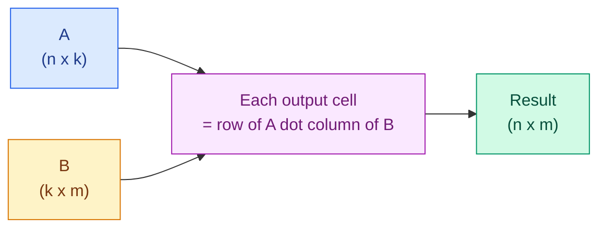

# Linear Algebra: Vectors and Matrices

**Level:** 🟡 Intermediate &nbsp;|&nbsp; **Effort:** Detailed module &nbsp;|&nbsp; **Module:** [02 Mathematics for AI](README.md)

---

## 🎯 Learning Objectives

By the end of this topic you will be able to:

- Say what a scalar, vector, matrix and tensor are, and read their shapes
- Compute a dot product by hand and explain what it measures
- Explain why **a neural network layer is a matrix multiplication**
- Get matrix shapes right, and debug the error when they disagree
- Use transpose, identity, inverse and rank, and say when an inverse does not exist
- Solve a linear system without ever calling `inv`

## 📚 Prerequisites

[Topic 1: Basic Mathematics](01-basic-mathematics.md) and
[NumPy Essentials](../01-python-foundations/11-numpy-essentials.md).

---

## 1. The four objects

| Name | Dimensions | Shape | In machine learning |
| --- | --- | --- | --- |
| **Scalar** | 0 | `()` | A learning rate, a loss value |
| **Vector** | 1 | `(d,)` | One sample's features; one embedding |
| **Matrix** | 2 | `(n, d)` | A whole dataset; a layer's weights |
| **Tensor** | 3+ | `(b, h, w, c)` | A batch of images; attention scores |

**"Tensor" in deep learning just means "array with any number of dimensions".** It carries a
stricter meaning in physics and pure mathematics; in PyTorch it does not.

```python
import numpy as np

scalar = np.array(3.14)
vector = np.array([1.0, 2.0, 3.0])
matrix = np.array([[1.0, 2.0, 3.0], [4.0, 5.0, 6.0]])
tensor = np.zeros((2, 3, 4))

for name, obj in [("scalar", scalar), ("vector", vector), ("matrix", matrix), ("tensor", tensor)]:
    print(f"{name:<8} ndim={obj.ndim}  shape={str(obj.shape):<12} size={obj.size}")
```

**Output:**
```
scalar   ndim=0  shape=()           size=1
vector   ndim=1  shape=(3,)         size=3
matrix   ndim=2  shape=(2, 3)       size=6
tensor   ndim=3  shape=(2, 3, 4)    size=24
```

### ⚠️ `(3,)` and `(3, 1)` are not the same thing

```python
import numpy as np

flat = np.array([1.0, 2.0, 3.0])
column = flat.reshape(3, 1)
row = flat.reshape(1, 3)

print(f"flat:   shape {flat.shape}, ndim {flat.ndim}")
print(f"column: shape {column.shape}, ndim {column.ndim}")
print(f"row:    shape {row.shape}, ndim {row.ndim}")
print()
print(f"flat + flat      -> shape {(flat + flat).shape}")
print(f"column + row     -> shape {(column + row).shape}   <- broadcasting, probably not what you wanted")
```

**Output:**
```
flat:   shape (3,), ndim 1
column: shape (3, 1), ndim 2
row:    shape (1, 3), ndim 2

flat + flat      -> shape (3,)
column + row     -> shape (3, 3)   <- broadcasting, probably not what you wanted
```

**That last line is a bug generator.** Adding a `(3, 1)` column to a `(1, 3)` row broadcasts into a
`(3, 3)` matrix rather than raising. If your loss suddenly becomes a matrix, this is why — check
shapes before blaming the maths.

---

## 2. Vector arithmetic

```python
import numpy as np

a = np.array([2.0, 3.0])
b = np.array([1.0, -1.0])

print(f"a + b        = {a + b}")
print(f"a - b        = {a - b}")
print(f"3 * a        = {3 * a}          (scaling: same direction, longer)")
print(f"a * b        = {a * b}       (elementwise, NOT the dot product)")
```

**Output:**
```
a + b        = [3. 2.]
a - b        = [1. 4.]
3 * a        = [6. 9.]          (scaling: same direction, longer)
a * b        = [ 2. -3.]       (elementwise, NOT the dot product)
```

**`*` is elementwise in NumPy, never a dot product.** This trips up everyone arriving from MATLAB.

---

## 3. The dot product

### 🍰 Simple explanation

Multiply matching entries, then add them all up. One vector in, one vector out, **one number**.

```text
  a · b  =  Σ  a_i · b_i
            i
```

### 🏠 Real-life analogy

A shopping basket. One vector holds quantities, the other holds prices. The dot product is the
total bill — and notice it collapses two lists into a single meaningful number.

```python
import numpy as np

quantities = np.array([2, 1, 3])
prices = np.array([1.50, 3.00, 0.75])

by_hand = sum(q * p for q, p in zip(quantities, prices, strict=True))

print(f"by hand:     {by_hand}")
print(f"np.dot:      {np.dot(quantities, prices)}")
print(f"@ operator:  {quantities @ prices}")
print(f"sum of products: {np.sum(quantities * prices)}")
```

**Output:**
```
by hand:     8.25
np.dot:      8.25
@ operator:  8.25
sum of products: 8.25
```

All four are the same operation. **`@` is the modern spelling** and the one to prefer.

### ⚙️ What it measures

The dot product is `|a| · |b| · cos(θ)`, where θ is the angle between the vectors. So its **sign
tells you about direction**:

```python
import numpy as np

reference = np.array([1.0, 0.0])

for name, vector in [
    ("same direction",   np.array([2.0, 0.0])),
    ("45 degrees",       np.array([1.0, 1.0])),
    ("perpendicular",    np.array([0.0, 3.0])),
    ("opposite",         np.array([-1.0, 0.0])),
]:
    dot = reference @ vector
    print(f"{name:<16} dot = {dot:>6.2f}")
```

**Output:**
```
same direction   dot =   2.00
45 degrees       dot =   1.00
perpendicular    dot =   0.00
opposite         dot =  -1.00
```

| Dot product | Meaning |
| --- | --- |
| Large positive | Pointing the same way |
| Zero | **Perpendicular** — no shared direction at all |
| Negative | Pointing opposite ways |

**This is the entire basis of similarity search.** Two document embeddings pointing the same way
mean similar documents — covered in
[15 Embeddings and Vector Search](../15-embeddings-and-vector-search/README.md). It is also what
attention computes in [11 Transformers](../11-transformers/README.md): the score between a query and
a key is a dot product.

---

## 4. Matrix multiplication — the operation everything is built on

### ⚙️ The rule

To multiply `A @ B`: **the inner dimensions must match**, and the result takes the outer ones.

```text
  A is (n × k)      B is (k × m)      A @ B is (n × m)
          └───── must match ─────┘
```

Each output entry is the **dot product of a row of A with a column of B**.



```python
import numpy as np

A = np.array([[1.0, 2.0],
              [3.0, 4.0],
              [5.0, 6.0]])          # (3, 2)

B = np.array([[7.0, 8.0, 9.0],
              [10.0, 11.0, 12.0]])  # (2, 3)

C = A @ B

print(f"A shape {A.shape} @ B shape {B.shape} -> {C.shape}")
print(C)
print()
print(f"top-left entry by hand: {A[0, 0]}*{B[0, 0]} + {A[0, 1]}*{B[1, 0]} = {A[0] @ B[:, 0]}")
```

**Output:**
```
A shape (3, 2) @ B shape (2, 3) -> (3, 3)
[[ 27.  30.  33.]
 [ 61.  68.  75.]
 [ 95. 106. 117.]]

top-left entry by hand: 1.0*7.0 + 2.0*10.0 = 27.0
```

### ⚠️ The shape error you will meet most often

```python
import numpy as np

A = np.ones((3, 2))
B = np.ones((3, 2))

try:
    A @ B
except ValueError as error:
    print(f"ValueError: {error}")

print(f"\nfix by transposing: {(A @ B.T).shape}")
print(f"the other transpose: {(A.T @ B).shape}")
```

**Output:**
```
ValueError: matmul: Input operand 1 has a mismatch in its core dimension 0, with gufunc signature (n?,k),(k,m?)->(n?,m?) (size 3 is different from 2)

fix by transposing: (3, 3)
the other transpose: (2, 2)
```

**Read the numbers in that message.** `(3,2)` and `(3,2)`: the inner dimensions are 2 and 3, which
disagree. Transposing one operand fixes it — but **which** transpose you need depends on what you
meant, and the two give different shapes. Decide from the meaning, not by trying both.

### ⚠️ Order matters

```python
import numpy as np

A = np.array([[1.0, 2.0], [3.0, 4.0]])
B = np.array([[0.0, 1.0], [1.0, 0.0]])

print(f"A @ B:\n{A @ B}")
print(f"B @ A:\n{B @ A}")
print(f"equal? {np.array_equal(A @ B, B @ A)}")
```

**Output:**
```
A @ B:
[[2. 1.]
 [4. 3.]]
B @ A:
[[3. 4.]
 [1. 2.]]
equal? False
```

Matrix multiplication is **not commutative**. `A @ B` and `B @ A` are different operations, and
frequently only one of them is even shape-valid.

---

## 5. 🌍 A neural network layer *is* a matrix multiplication

This is the payoff for the whole topic.

A layer takes a batch of inputs, multiplies by a weight matrix, adds a bias, and applies an
activation function:

```text
  output = activation( X @ W + b )
```

```python
import numpy as np

rng = np.random.default_rng(42)

batch_size, n_features, n_neurons = 4, 3, 5

X = rng.normal(size=(batch_size, n_features))       # 4 samples, 3 features each
W = rng.normal(size=(n_features, n_neurons)) * 0.5  # weights
b = np.zeros(n_neurons)                             # bias, one per neuron

pre_activation = X @ W + b
output = np.maximum(0, pre_activation)              # ReLU

print(f"X {X.shape} @ W {W.shape} + b {b.shape}")
print(f"-> pre-activation {pre_activation.shape}")
print(f"-> after ReLU     {output.shape}")
print()
print(f"parameters in this layer: {W.size} weights + {b.size} biases = {W.size + b.size}")
print(f"fraction of ReLU outputs that are zero: {(output == 0).mean():.2f}")
```

**Output:**
```
X (4, 3) @ W (3, 5) + b (5,)
-> pre-activation (4, 5)
-> after ReLU     (4, 5)

parameters in this layer: 15 weights + 5 biases = 20
fraction of ReLU outputs that are zero: 0.45
```

**Every dimension in that shape chain has a name**: `(samples, features) @ (features, neurons)` →
`(samples, neurons)`. The bias broadcasts across the batch — the broadcasting rule from
[NumPy Essentials](../01-python-foundations/11-numpy-essentials.md), doing real work.

Stack a few of these and you have a neural network. **The maths of a forward pass is genuinely this
simple**; the difficulty lies in choosing the weights, which is what
[Topic 5](05-gradient-descent-and-backpropagation.md) is about.

### 💰 Why shapes are a cost decision

```python
import numpy as np

def layer_cost(n_in, n_out, batch=1):
    """Parameters stored, and multiply-accumulate operations per forward pass."""
    return n_in * n_out + n_out, batch * n_in * n_out

for n_in, n_out in [(768, 768), (768, 3072), (4096, 4096)]:
    params, flops = layer_cost(n_in, n_out, batch=32)
    print(f"{n_in:>5} -> {n_out:<5} params {params:>12,}   MACs/batch {flops:>15,}")
```

**Output:**
```
  768 -> 768   params      590,592   MACs/batch      18,874,368
  768 -> 3072  params    2,362,368   MACs/batch      75,497,472
 4096 -> 4096  params   16,781,312   MACs/batch     536,870,912
```

Doubling a layer's width **quadruples** its cost, because the weight matrix grows in both
dimensions. That single fact drives most architecture and hardware decisions in
[13 Large Language Models](../13-large-language-models/README.md) and
[32 Model Optimization](../32-model-optimization/README.md).

---

## 6. Transpose, identity, inverse and rank

### Transpose — flip rows and columns

```python
import numpy as np

A = np.array([[1, 2, 3], [4, 5, 6]])

print(f"A shape {A.shape}:\n{A}")
print(f"A.T shape {A.T.shape}:\n{A.T}")
print(f"(A.T).T is A again: {np.array_equal((A.T).T, A)}")
```

**Output:**
```
A shape (2, 3):
[[1 2 3]
 [4 5 6]]
A.T shape (3, 2):
[[1 4]
 [2 5]
 [3 6]]
(A.T).T is A again: True
```

### Identity — the matrix that changes nothing

```python
import numpy as np

I = np.eye(3)
A = np.array([[1.0, 2.0, 3.0], [4.0, 5.0, 6.0], [7.0, 8.0, 10.0]])

print(f"identity:\n{I}")
print(f"A @ I equals A: {np.allclose(A @ I, A)}")
```

**Output:**
```
identity:
[[1. 0. 0.]
 [0. 1. 0.]
 [0. 0. 1.]]
A @ I equals A: True
```

`I` is the matrix equivalent of the number 1. **Note `np.allclose`, not `==`** — floating point,
again.

### Inverse — the matrix equivalent of dividing

`A_inv @ A = I`. It exists only for square matrices, and **not even for all of those**.

```python
import numpy as np

A = np.array([[2.0, 1.0], [1.0, 3.0]])
A_inv = np.linalg.inv(A)

print(f"A_inv:\n{A_inv.round(4)}")
print(f"A_inv @ A:\n{(A_inv @ A).round(10)}")
print(f"is it the identity? {np.allclose(A_inv @ A, np.eye(2))}")
```

**Output:**
```
A_inv:
[[ 0.6 -0.2]
 [-0.2  0.4]]
A_inv @ A:
[[ 1. -0.]
 [ 0.  1.]]
is it the identity? True
```

### ⚠️ Singular matrices have no inverse

```python
import numpy as np

singular = np.array([[1.0, 2.0],
                     [2.0, 4.0]])       # row 2 is exactly 2x row 1

print(f"determinant: {np.linalg.det(singular)}")
print(f"rank: {np.linalg.matrix_rank(singular)} (out of 2 - the rows are not independent)")

try:
    np.linalg.inv(singular)
except np.linalg.LinAlgError as error:
    print(f"LinAlgError: {error}")
```

**Output:**
```
determinant: 0.0
rank: 1 (out of 2 - the rows are not independent)
LinAlgError: Singular matrix
```

**Rank counts genuinely independent rows.** Here the second row carries no new information, so rank
is 1, the determinant is 0, and no inverse exists.

This is exactly what happens when two features in your dataset are perfectly correlated — duplicated
columns, or a one-hot encoding that kept all categories. Linear regression then has no unique
solution. It is called **multicollinearity**, and it is why `drop_first=True` exists in
`pd.get_dummies`.

### ⚠️ Near-singular is worse than singular

```python
import numpy as np

almost = np.array([[1.0, 2.0],
                   [2.0, 4.0000001]])

print(f"determinant: {np.linalg.det(almost):.12f}")
print(f"rank: {np.linalg.matrix_rank(almost)}")
print(f"condition number: {np.linalg.cond(almost):.2e}")   # the last digits are roundoff

inverse = np.linalg.inv(almost)
print(f"inverse has huge entries:\n{inverse.round(0)}")
```

**Output:**
```
determinant: 0.000000100000
rank: 2
condition number: 2.50e+08
inverse has huge entries:
[[ 40000001. -20000000.]
 [-20000000.  10000000.]]
```

**No error is raised.** A near-singular matrix inverts "successfully" into enormous numbers, and any
tiny error in your data is amplified by roughly the condition number — here a quarter of a billion.
`float64` carries about 16 significant digits, so amplifying by 10⁸ leaves you perhaps 8 trustworthy
ones, and a slightly worse matrix leaves none. The answer can be numerically worthless while nothing
complains.

---

## 7. 🧪 Hands-on lab: solving a linear system properly

Fitting a linear model means solving `A x = b` for `x`. The textbook answer is
`x = A⁻¹ b`. **Do not do that.**

```python
import numpy as np

rng = np.random.default_rng(0)
A = rng.normal(size=(500, 500))
b = rng.normal(size=500)

by_inverse = np.linalg.inv(A) @ b
by_solve = np.linalg.solve(A, b)

print(f"same answer to 8 decimals: {np.allclose(by_inverse, by_solve, atol=1e-8)}")
print(f"largest disagreement below 1e-9: {np.abs(by_inverse - by_solve).max() < 1e-9}")
print()
# Residuals this small are rounding noise. Their exact digits depend on which CPU kernels the
# linear-algebra library picks, so we check their size rather than print them.
residual_inverse = np.abs(A @ by_inverse - b).max()
residual_solve = np.abs(A @ by_solve - b).max()
print(f"residual via inv() below 1e-9:   {residual_inverse < 1e-9}")
print(f"residual via solve() below 1e-9: {residual_solve < 1e-9}")
```

**Output:**
```
same answer to 8 decimals: True
largest disagreement below 1e-9: True

residual via inv() below 1e-9:   True
residual via solve() below 1e-9: True
```

**On a well-conditioned random matrix, both are accurate to rounding noise** — around 10⁻¹² here —
and which of the two is marginally smaller changes from one processor to another. That is why the
example checks the size instead of printing the digits: the repository's own continuous integration
disagreed with a laptop about the third significant figure.

`np.linalg.solve` factorises the matrix and solves directly. Computing an explicit inverse does
strictly more work and accumulates more rounding error, and on an ill-conditioned matrix the gap
becomes serious rather than cosmetic.

**Rule: if you are about to write `inv(A) @ b`, write `solve(A, b)` instead.** For non-square or
rank-deficient systems, `np.linalg.lstsq` gives the least-squares answer — which is precisely what
linear regression computes.

```python
import numpy as np
import pandas as pd

housing = pd.read_csv("datasets/samples/housing.csv")

features = ["area_sqm", "bedrooms", "age_years", "distance_km"]
X = housing[features].to_numpy()
y = housing["price_thousands"].to_numpy()

# Add a column of ones so the model can learn an intercept.
X_with_bias = np.column_stack([np.ones(len(X)), X])

coefficients, residuals, rank, singular_values = np.linalg.lstsq(X_with_bias, y, rcond=None)

print(f"design matrix shape: {X_with_bias.shape}, rank {rank}")
print()
print(f"{'term':<14}{'solved':>10}{'true':>10}")
truth = [60.0, 3.2, 12.0, -1.4, -4.5]
for name, solved, true_value in zip(["intercept", *features], coefficients, truth, strict=True):
    print(f"{name:<14}{solved:>10.2f}{true_value:>10.2f}")
```

**Output:**
```
design matrix shape: (150, 5), rank 5

term              solved      true
intercept          50.25     60.00
area_sqm            3.25      3.20
bedrooms           12.84     12.00
age_years          -1.47     -1.40
distance_km        -4.44     -4.50
```

**That is linear regression, computed with one linear-algebra call** — no scikit-learn, no gradient
descent. `LinearRegression` solves exactly this least-squares problem underneath.

The coefficients differ slightly from the ones in
[Topic 14 of module 01](../01-python-foundations/14-your-first-scikit-learn-model.md) — 3.25 here
against 3.29 there — and the reason is not the method. **That topic fits only the 120-row training
split; this fits all 150 rows.** Different data, same algorithm. Compare like with like before
concluding two implementations disagree.

Full rank (5 out of 5) confirms the four features carry independent information — no
multicollinearity here.

**Extend it:** duplicate a column and watch the rank drop; compare `lstsq` timings against
`sklearn`; and add a strongly correlated feature to see the condition number rise.

---

## 🎤 Interview questions

**"Why is a neural network layer a matrix multiplication?"**

Each neuron computes a weighted sum of all its inputs — a dot product between the input vector and
that neuron's weight vector. Stacking every neuron's weight vector as columns of a matrix `W` makes
the whole layer one operation, `X @ W + b`, computing every neuron for every sample in the batch at
once. That formulation is what lets GPUs run a layer as a single highly optimised kernel.

**"What does the dot product tell you geometrically?"**

It equals `|a||b|cos(θ)`. The sign indicates whether vectors point broadly the same way (positive),
perpendicular (zero) or opposite (negative). Normalising both to unit length makes it exactly the
cosine of the angle, which is cosine similarity — the standard metric for comparing embeddings.

**"When does a matrix have no inverse, and why should you care?"**

When its rows or columns are linearly dependent — rank less than its dimension, determinant zero.
In practice this means two features carry the same information: duplicated columns, or a one-hot
encoding retaining every category. Linear regression then has no unique solution. Worse is the
*near*-singular case, which raises no error but produces an enormous condition number and answers
dominated by rounding noise.

**"Why prefer `solve` over computing an inverse?"**

`solve` factorises and back-substitutes, doing less work and accumulating less rounding error than
forming an explicit inverse and then multiplying. The inverse is rarely the thing you actually want
— you want the solution — and on ill-conditioned systems the accuracy gap is significant.

---

## ✅ Key takeaways

- Scalar, vector, matrix, tensor differ only in number of dimensions. Check `shape` constantly.
- **`(3,)`, `(3,1)` and `(1,3)` behave differently**, and mixing them broadcasts silently.
- `*` is elementwise; `@` is matrix multiplication. Never confuse them.
- **The dot product measures alignment.** Zero means perpendicular. It underpins similarity and attention.
- `(n,k) @ (k,m) -> (n,m)`: **inner dimensions must match**, outer ones survive.
- Matrix multiplication is not commutative.
- **A layer is `activation(X @ W + b)`.** That is the whole forward pass.
- Doubling layer width quadruples parameters and compute.
- Rank counts independent rows; rank-deficient means no inverse and no unique regression solution.
- **Near-singular raises no error** but returns numerically worthless answers — check `cond`.
- **Use `solve`, not `inv`.** Use `lstsq` for least squares.

---

## 📚 Official References

- [NumPy: Linear algebra — NumPy Developers](https://numpy.org/doc/stable/reference/routines.linalg.html) — verified 2026-08-31
- [numpy.linalg.solve — NumPy Developers](https://numpy.org/doc/stable/reference/generated/numpy.linalg.solve.html) — verified 2026-08-31
- [numpy.linalg.lstsq — NumPy Developers](https://numpy.org/doc/stable/reference/generated/numpy.linalg.lstsq.html) — verified 2026-08-31
- [numpy.matmul — NumPy Developers](https://numpy.org/doc/stable/reference/generated/numpy.matmul.html) — verified 2026-08-31
- [PyTorch: Tensors — PyTorch Foundation](https://pytorch.org/docs/stable/tensors.html) — verified 2026-08-31
- [PyTorch: torch.nn.Linear — PyTorch Foundation](https://pytorch.org/docs/stable/generated/torch.nn.Linear.html) — verified 2026-08-31

---

## 🔗 Navigation

[← Topic 1: Basic Mathematics](01-basic-mathematics.md) &nbsp;|&nbsp;
[Module home](README.md) &nbsp;|&nbsp;
[Topic 3: Norms, Eigenvalues and PCA →](03-norms-eigenvalues-and-pca.md)
