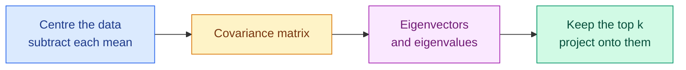

# Norms, Eigenvalues and Principal Component Analysis

**Level:** 🔴 Advanced &nbsp;|&nbsp; **Effort:** Detailed module &nbsp;|&nbsp; **Module:** [02 Mathematics for AI](README.md)

---

## 🎯 Learning Objectives

By the end of this topic you will be able to:

- Measure the length of a vector, and choose between L1 and L2 for the job
- Compute cosine similarity, and say why it beats Euclidean distance for embeddings
- Explain what an eigenvector is without hand-waving
- Read a Singular Value Decomposition (SVD) and say what each factor holds
- Run Principal Component Analysis (PCA), implement it from scratch, and match the library
- Say when PCA is the wrong tool

## 📚 Prerequisites

[Topic 2: Vectors and Matrices](02-linear-algebra-vectors-and-matrices.md)

---

## 1. Norms — how long is a vector?

A **norm** measures size. Different norms answer "how big" in different ways, and the choice has
real consequences for models.

```text
  L1  ‖x‖₁ = Σ |x_i|                 "taxicab" - add the absolute values
  L2  ‖x‖₂ = sqrt( Σ x_i² )          "Euclidean" - straight-line distance
  L∞  ‖x‖∞ = max |x_i|               the largest single component
```

### 🏠 Real-life analogy

You are three blocks east and four blocks north.

- **L2** is the crow's flight: 5 blocks.
- **L1** is the taxi: 7 blocks, because you must follow the streets.
- **L∞** is the longest single leg: 4.

```python
import numpy as np

x = np.array([3.0, -4.0])

print(f"L1  (taxicab):   {np.linalg.norm(x, ord=1)}")
print(f"L2  (euclidean): {np.linalg.norm(x)}")
print(f"L-inf (max):     {np.linalg.norm(x, ord=np.inf)}")
print()
print(f"L2 by hand: {np.sqrt(np.sum(x ** 2))}")
```

**Output:**
```
L1  (taxicab):   7.0
L2  (euclidean): 5.0
L-inf (max):     4.0

L2 by hand: 5.0
```

### 🌍 Why the choice matters: L1 and L2 regularisation

Regularisation adds a norm of the weights to the loss, penalising large weights. **Which norm you
add changes what the model does.**

```python
import numpy as np

# Two weight vectors with the same L2 norm but very different structure.
spread = np.array([0.5, 0.5, 0.5, 0.5])
concentrated = np.array([1.0, 0.0, 0.0, 0.0])

for name, w in [("spread out", spread), ("concentrated", concentrated)]:
    print(f"{name:<14} L1 = {np.linalg.norm(w, 1):.2f}   L2 = {np.linalg.norm(w):.2f}")
```

**Output:**
```
spread out     L1 = 2.00   L2 = 1.00
concentrated   L1 = 1.00   L2 = 1.00
```

**Both have L2 norm 1.0, but their L1 norms differ.** L1 prefers the concentrated vector — most
weights exactly zero — while L2 is indifferent between them and, because it penalises the *square*,
pushes large weights down hardest and rarely all the way to zero.

| Penalty | Called | Effect |
| --- | --- | --- |
| L1 | Lasso | Drives weights to **exactly zero** — feature selection |
| L2 | Ridge, weight decay | Shrinks all weights smoothly, keeps them all |

That is the entire practical difference between Lasso and Ridge, and it follows from the shape of
the norm rather than from anything mysterious.

---

## 2. Distance and similarity

```python
import numpy as np

a = np.array([1.0, 2.0])
b = np.array([4.0, 6.0])

print(f"euclidean distance: {np.linalg.norm(a - b):.4f}")
print(f"manhattan distance: {np.linalg.norm(a - b, ord=1):.4f}")
```

**Output:**
```
euclidean distance: 5.0000
manhattan distance: 7.0000
```

**A distance is the norm of a difference.** That is all.

### Cosine similarity — the one embeddings use

```python
import numpy as np

def cosine_similarity(a, b):
    """Cosine of the angle between two vectors: -1 (opposite) to 1 (identical direction)."""
    return (a @ b) / (np.linalg.norm(a) * np.linalg.norm(b))


short_doc = np.array([1.0, 2.0, 1.0])
long_doc = np.array([10.0, 20.0, 10.0])       # same topic mix, ten times the length
different = np.array([5.0, 0.0, 0.0])

print(f"{'pair':<28}{'euclidean':>11}{'cosine':>9}")
for name, other in [("short vs long (same topic)", long_doc), ("short vs different topic", different)]:
    print(f"{name:<28}{np.linalg.norm(short_doc - other):>11.2f}{cosine_similarity(short_doc, other):>9.4f}")
```

**Output:**
```
pair                          euclidean   cosine
short vs long (same topic)        22.05   1.0000
short vs different topic           4.58   0.4082
```

**Look at what Euclidean distance says.** The long document — identical in topic, merely ten times
longer — is *further* from the short one than a document about something else entirely. Cosine
similarity gives it 1.0, because it ignores magnitude and compares only direction.

This is why vector databases default to cosine similarity: **document length should not decide
relevance.** See [15 Embeddings and Vector Search](../15-embeddings-and-vector-search/README.md).

### The normalisation shortcut

```python
import numpy as np

a = np.array([3.0, 4.0])
b = np.array([1.0, 2.0])

a_unit = a / np.linalg.norm(a)
b_unit = b / np.linalg.norm(b)

print(f"unit vector a: {a_unit.round(4)}, length {np.linalg.norm(a_unit):.6f}")
print(f"cosine similarity: {(a @ b) / (np.linalg.norm(a) * np.linalg.norm(b)):.6f}")
print(f"dot of unit vectors: {a_unit @ b_unit:.6f}")
```

**Output:**
```
unit vector a: [0.6 0.8], length 1.000000
cosine similarity: 0.983870
dot of unit vectors: 0.983870
```

**Normalise once, and cosine similarity becomes a plain dot product.** Vector databases store
normalised vectors for exactly this reason — a dot product is far cheaper than dividing by two norms
on every comparison.

---

## 3. Eigenvectors and eigenvalues

### 🍰 Simple explanation

Multiplying by a matrix usually **rotates** a vector and changes its length. For a few special
vectors it only stretches them — direction unchanged. Those are the **eigenvectors**, and the
stretch factor is the **eigenvalue**.

```text
  A v = λ v          v is an eigenvector, λ (lambda) is its eigenvalue
```

```python
import numpy as np

A = np.array([[3.0, 1.0],
              [0.0, 2.0]])

ordinary = np.array([1.0, 1.0])
print(f"ordinary vector {ordinary} -> {A @ ordinary}   (direction changed)")

eigenvalues, eigenvectors = np.linalg.eig(A)
print()
for i in range(len(eigenvalues)):
    v = eigenvectors[:, i]
    print(f"eigenvector {v.round(4)} -> {(A @ v).round(4)}")
    print(f"   which is {eigenvalues[i]:.1f} x the original: {np.allclose(A @ v, eigenvalues[i] * v)}")
```

**Output:**
```
ordinary vector [1. 1.] -> [4. 2.]   (direction changed)

eigenvector [1. 0.] -> [3. 0.]
   which is 3.0 x the original: True
eigenvector [-0.7071  0.7071] -> [-1.4142  1.4142]
   which is 2.0 x the original: True
```

**The eigenvector comes back pointing the same way, just scaled.** That is the entire definition.

### ⚙️ Why anyone cares

Eigenvectors of a **covariance matrix** point along the directions your data actually varies in, and
the eigenvalues say how much variance lies along each. That is PCA, and it is coming in section 5.

They also explain training stability: the eigenvalues of the Hessian describe the curvature of the
loss surface, and a large ratio between the biggest and smallest means the surface is a narrow
valley that gradient descent zigzags across
([Topic 5](05-gradient-descent-and-backpropagation.md)).

---

## 4. Singular Value Decomposition

**SVD factorises *any* matrix** — square or not, invertible or not — into three pieces:

```text
  A  =  U · Σ · Vᵀ
```

| Factor | Shape | Holds |
| --- | --- | --- |
| `U` | (n × n) | Directions in row space |
| `Σ` (sigma) | diagonal | **Singular values** — importance of each direction, largest first |
| `Vᵀ` | (d × d) | Directions in column (feature) space |

```python
import numpy as np

rng = np.random.default_rng(0)
A = rng.normal(size=(6, 4))

U, singular_values, Vt = np.linalg.svd(A, full_matrices=False)

print(f"A shape:  {A.shape}")
print(f"U shape:  {U.shape}   S shape: {singular_values.shape}   Vt shape: {Vt.shape}")
print(f"singular values: {singular_values.round(4)}")
print(f"already sorted descending: {np.all(np.diff(singular_values) <= 0)}")

reconstructed = U @ np.diag(singular_values) @ Vt
print(f"reconstruction exact: {np.allclose(A, reconstructed)}")
```

**Output:**
```
A shape:  (6, 4)
U shape:  (6, 4)   S shape: (4,)   Vt shape: (4, 4)
singular values: [3.0361 2.0335 1.8563 0.8954]
already sorted descending: True
reconstruction exact: True
```

### 💻 Low-rank approximation: keeping only what matters

Because singular values come sorted, **truncating the small ones gives the best possible
approximation** of that rank.

```python
import numpy as np

rng = np.random.default_rng(1)
# A matrix that is genuinely rank-2, plus a little noise.
true_signal = rng.normal(size=(50, 2)) @ rng.normal(size=(2, 30))
A = true_signal + 0.01 * rng.normal(size=(50, 30))

U, s, Vt = np.linalg.svd(A, full_matrices=False)

print(f"first 5 singular values: {s[:5].round(3)}")
print(f"they drop off a cliff after 2: {s[1] / s[2]:,.0f}x")
print()
for k in [1, 2, 5, 30]:
    approx = U[:, :k] @ np.diag(s[:k]) @ Vt[:k]
    error = np.linalg.norm(A - approx) / np.linalg.norm(A)
    stored = k * (50 + 30 + 1)
    print(f"rank {k:>2}: relative error {error:.4f}, storing {stored:>5} numbers instead of {A.size}")
```

**Output:**
```
first 5 singular values: [39.707 23.329  0.118  0.109  0.106]
they drop off a cliff after 2: 197x

rank  1: relative error 0.5066, storing    81 numbers instead of 1500
rank  2: relative error 0.0081, storing   162 numbers instead of 1500
rank  5: relative error 0.0069, storing   405 numbers instead of 1500
rank 30: relative error 0.0000, storing  2430 numbers instead of 1500
```

**Rank 2 captures essentially everything**, because the data really was rank 2 — and it stores a
tenth of the numbers.

Note the rank-30 row stores **more** numbers than the original matrix. Truncated SVD only saves
space below `k = nd / (n + d + 1)`; above that you are paying for the factorisation and gaining
nothing. This is the mathematics behind image compression, recommender systems
([21 Recommender Systems](../21-recommender-systems/README.md)) and LoRA fine-tuning
([17 Fine-Tuning](../17-fine-tuning/README.md)), where a large weight update is approximated by two
thin matrices.

---

## 5. Principal Component Analysis

### 🍰 Simple explanation

PCA finds the directions your data spreads out along most, and lets you describe each point using
just those few directions instead of all the original features.

### 🏠 Real-life analogy

Photographing a chair. Most angles produce an ambiguous silhouette; one angle captures its shape
best. **PCA finds that angle** — the viewpoint that loses the least information.

### ⚙️ The algorithm, in four steps



### 💻 PCA from scratch, checked against scikit-learn

```python
import numpy as np
import pandas as pd
from sklearn.decomposition import PCA
from sklearn.preprocessing import StandardScaler

housing = pd.read_csv("datasets/samples/housing.csv")
features = ["area_sqm", "bedrooms", "age_years", "distance_km"]
X = housing[features].to_numpy()

# Standardise: PCA follows variance, so unscaled features would dominate by unit alone.
X_scaled = StandardScaler().fit_transform(X)

# --- by hand ---
centred = X_scaled - X_scaled.mean(axis=0)
covariance = np.cov(centred, rowvar=False)
eigenvalues, eigenvectors = np.linalg.eigh(covariance)

order = np.argsort(eigenvalues)[::-1]          # eigh returns ascending
eigenvalues = eigenvalues[order]
eigenvectors = eigenvectors[:, order]

manual_ratio = eigenvalues / eigenvalues.sum()

# --- scikit-learn ---
sklearn_pca = PCA().fit(X_scaled)

print(f"{'component':<12}{'by hand':>10}{'sklearn':>10}{'cumulative':>12}")
cumulative = 0.0
for i in range(len(manual_ratio)):
    cumulative += manual_ratio[i]
    print(f"PC{i + 1:<11}{manual_ratio[i]:>10.4f}{sklearn_pca.explained_variance_ratio_[i]:>10.4f}{cumulative:>12.4f}")

print()
print(f"they agree: {np.allclose(manual_ratio, sklearn_pca.explained_variance_ratio_)}")
```

**Output:**
```
component      by hand   sklearn  cumulative
PC1              0.2782    0.2782      0.2782
PC2              0.2495    0.2495      0.5277
PC3              0.2446    0.2446      0.7722
PC4              0.2278    0.2278      1.0000

they agree: True
```

**The from-scratch version matches the library exactly**, which is the point of writing it: PCA is
covariance plus eigendecomposition, not a black box.

**Now look at the numbers rather than the agreement.** The four components explain 27.8%, 25.0%,
24.5% and 22.8% — almost exactly a quarter each. **PCA has found nothing**, and that is the correct
answer: `housing.csv` was generated with four *independent* features
([dataset card](../datasets/samples/README.md)), so there is no redundancy to remove. Dropping any
component here throws away roughly a quarter of the information.

This is worth seeing before the success case. **PCA only helps when features are correlated.** On
uncorrelated data it is an expensive rotation that buys you nothing, and an explained-variance table
this flat is the signal to stop.

### Reading the result

```python
import numpy as np
import pandas as pd
from sklearn.decomposition import PCA
from sklearn.preprocessing import StandardScaler

housing = pd.read_csv("datasets/samples/housing.csv")
features = ["area_sqm", "bedrooms", "age_years", "distance_km"]
X_scaled = StandardScaler().fit_transform(housing[features].to_numpy())

pca = PCA(n_components=2).fit(X_scaled)
projected = pca.transform(X_scaled)

print(f"original shape:  {X_scaled.shape}")
print(f"projected shape: {projected.shape}")
print(f"variance kept:   {pca.explained_variance_ratio_.sum():.4f}")
print()
print("what each component is made of:")
print(f"{'feature':<14}{'PC1':>8}{'PC2':>8}")
for name, pc1, pc2 in zip(features, pca.components_[0], pca.components_[1], strict=True):
    print(f"{name:<14}{pc1:>8.3f}{pc2:>8.3f}")
```

**Output:**
```
original shape:  (150, 4)
projected shape: (150, 2)
variance kept:   0.5277

what each component is made of:
feature            PC1     PC2
area_sqm         0.470   0.097
bedrooms         0.651   0.189
age_years        0.574  -0.014
distance_km     -0.165   0.977
```

Each component is a **weighted blend of the original features**. Reading those loadings is how you
interpret a component — but note that PC1 here is not "size" or "age" or anything nameable, it is
whatever combination varies most.

### ⚠️ Five ways PCA goes wrong

**1. Forgetting to scale.** PCA maximises variance, and variance depends on units. Measure area in
square millimetres and it dominates every component through unit choice alone.

```python
import numpy as np
import pandas as pd
from sklearn.decomposition import PCA

housing = pd.read_csv("datasets/samples/housing.csv")
features = ["area_sqm", "bedrooms", "age_years", "distance_km"]
X = housing[features].to_numpy()

unscaled = PCA().fit(X)
print(f"unscaled PC1 explains: {unscaled.explained_variance_ratio_[0]:.4f}")
print(f"unscaled PC1 loadings: {unscaled.components_[0].round(3)}")
print(f"  -> dominated by:     {features[np.argmax(np.abs(unscaled.components_[0]))]}")
```

**Output:**
```
unscaled PC1 explains: 0.8831
unscaled PC1 loadings: [ 1.     0.002  0.009 -0.001]
  -> dominated by:     area_sqm
```

That component is almost entirely `area_sqm`, purely because it has the largest numeric range.
**Standardise first, unless the units are genuinely comparable.**

**2. Fitting PCA before splitting.** The same leakage as any other preprocessing step
([module 01, topic 14](../01-python-foundations/14-your-first-scikit-learn-model.md)) — put it in a
`Pipeline`.

**3. Expecting interpretable components.** A component is a blend of every feature. It is usually
not "customer value" or any other tidy concept, and naming it invites over-interpretation.

**4. Assuming variance means importance.** PCA has never seen your target. A low-variance direction
can be exactly the one that predicts it, and PCA will happily discard it.

**5. Using PCA on categorical or one-hot data.** Covariance of a one-hot column is not meaningful in
the way PCA assumes.

### 🌍 When PCA earns its place

- **Compressing embeddings** before storing millions of them — real memory and latency savings
- **Removing multicollinearity** before a linear model (components are uncorrelated by construction)
- **Visualising high-dimensional data** in two dimensions, with the caveat that a 2-component view
  usually discards a great deal
- **Speeding up training** when features far outnumber samples

---

## 🧪 Hands-on lab: compressing embeddings and measuring the damage

Compression is only sensible if you measure what it costs. Here: does reducing dimensionality
preserve which items are *similar*, which is what a retrieval system actually needs?

```python
import numpy as np
from sklearn.decomposition import PCA

rng = np.random.default_rng(42)

# 400 "embeddings" of dimension 64, generated from only 8 underlying factors,
# so there is genuine redundancy for PCA to find - as with real embeddings.
factors = rng.normal(size=(400, 8))
mixing = rng.normal(size=(8, 64))
embeddings = factors @ mixing + 0.1 * rng.normal(size=(400, 64))

def normalise(matrix):
    return matrix / np.linalg.norm(matrix, axis=1, keepdims=True)

full_similarity = normalise(embeddings) @ normalise(embeddings).T
query = 0
true_top5 = np.argsort(full_similarity[query])[::-1][1:6]

print(f"{'dims':>6}{'variance kept':>15}{'top-5 recall':>14}{'memory':>10}")
for k in [2, 4, 8, 16, 32, 64]:
    reduced = PCA(n_components=k, random_state=0).fit_transform(embeddings)
    reduced_similarity = normalise(reduced) @ normalise(reduced).T
    top5 = np.argsort(reduced_similarity[query])[::-1][1:6]
    recall = len(set(top5) & set(true_top5)) / 5
    variance = PCA(n_components=k, random_state=0).fit(embeddings).explained_variance_ratio_.sum()
    print(f"{k:>6}{variance:>15.4f}{recall:>14.1f}{k / 64:>10.1%}")
```

**Output:**
```
  dims  variance kept  top-5 recall    memory
     2         0.3446           0.0      3.1%
     4         0.6281           0.4      6.2%
     8         0.9989           0.8     12.5%
    16         0.9991           0.8     25.0%
    32         0.9995           0.8     50.0%
    64         1.0000           1.0    100.0%
```

**Read the variance column against the recall column, because they disagree.** At 8 dimensions PCA
has captured **99.89%** of the variance — a number that would normally end the discussion — yet
top-5 recall is only **0.8**: one of the five true nearest neighbours has been lost. Recall does not
reach 1.0 until all 64 dimensions are kept.

That gap is the entire lesson. **Explained variance is a proxy for the thing you care about, and on
this task it is an optimistic one.** The missing 0.11% of variance was not evenly spread noise; some
of it was exactly what separated the fifth neighbour from the sixth.

So the number of components is not something you read off a variance table. **You choose it by
measuring the requirement itself** — here neighbour recall — and then decide whether losing one
neighbour in five is acceptable for an eightfold memory saving. That is a product decision, not a
mathematical one.

**Extend it:** plot recall against dimensions ([module 01, topic 13](../01-python-foundations/13-visualisation.md));
raise the noise and watch the usable floor rise; and compare against random projection, which is
cheaper and sometimes competitive.

---

## 🎤 Interview questions

**"Why is cosine similarity preferred over Euclidean distance for embeddings?"**

Because it compares direction and ignores magnitude. Embedding magnitude often reflects document
length or token count rather than meaning, so a long document about a topic can be Euclidean-far
from a short one on the same topic while a document about something else sits closer. Cosine removes
that. Once vectors are normalised to unit length, cosine similarity is just a dot product, so it is
also cheap.

**"What is an eigenvector, in plain terms?"**

A vector that a matrix only scales, never rotates: `Av = λv`. The eigenvalue λ is the scale factor.
They matter because the eigenvectors of a covariance matrix are the directions the data varies
along — the basis of PCA — and the eigenvalues of a Hessian describe the loss surface's curvature,
which governs how gradient descent behaves.

**"How does PCA actually work?"**

Standardise the features, compute the covariance matrix, take its eigenvectors and eigenvalues, sort
by eigenvalue descending, and project the data onto the top k eigenvectors. Each eigenvalue is the
variance along its direction, so the ratio to the total gives explained variance. In practice
libraries use SVD on the centred data instead, which is numerically better behaved and gives the
same result.

**"When would you not use PCA?"**

When you need interpretable features, since components are blends of everything. When the signal is
in a low-variance direction, because PCA is unsupervised and cannot know what predicts your target.
On one-hot or categorical data, where covariance is not meaningful. And when the relationship is
non-linear — PCA only finds linear structure, so UMAP, t-SNE or an autoencoder may suit better.

**"What is the difference between L1 and L2 regularisation?"**

L1 penalises the sum of absolute weights and drives many to exactly zero, performing feature
selection. L2 penalises the sum of squares, shrinking large weights hardest but rarely to zero, so
every feature is kept with reduced influence. L1 suits sparse solutions and many irrelevant
features; L2 suits correlated features you want to retain and shrink together.

---

## ✅ Key takeaways

- A norm measures size; **a distance is the norm of a difference.**
- L1 produces sparsity (Lasso); L2 shrinks smoothly (Ridge, weight decay).
- **Cosine similarity ignores magnitude**, which is why embeddings use it. Normalise once and it
  becomes a dot product.
- An eigenvector is only scaled by its matrix, never rotated. The eigenvalue is the scale.
- SVD factorises **any** matrix; singular values arrive sorted, so truncating gives the best
  low-rank approximation. This underlies compression, recommenders and LoRA.
- **PCA is covariance plus eigendecomposition** — implementable in six lines.
- **Always standardise before PCA**, or units decide your components.
- Fit PCA inside a `Pipeline`, or you leak.
- **PCA is unsupervised: variance is not importance.** It can discard the direction that predicts
  your target.
- Choose the number of components by measuring what you actually need, not by variance alone.

---

## 📚 Official References

- [numpy.linalg.norm — NumPy Developers](https://numpy.org/doc/stable/reference/generated/numpy.linalg.norm.html) — verified 2026-08-31
- [numpy.linalg.eig — NumPy Developers](https://numpy.org/doc/stable/reference/generated/numpy.linalg.eig.html) — verified 2026-08-31
- [numpy.linalg.svd — NumPy Developers](https://numpy.org/doc/stable/reference/generated/numpy.linalg.svd.html) — verified 2026-08-31
- [scikit-learn: Decomposing signals in components (PCA) — scikit-learn developers](https://scikit-learn.org/stable/modules/decomposition.html) — verified 2026-08-31
- [sklearn.decomposition.PCA — scikit-learn developers](https://scikit-learn.org/stable/modules/generated/sklearn.decomposition.PCA.html) — verified 2026-08-31
- [scikit-learn: Regularization in linear models — scikit-learn developers](https://scikit-learn.org/stable/modules/linear_model.html) — verified 2026-08-31

---

## 🔗 Navigation

[← Topic 2: Vectors and Matrices](02-linear-algebra-vectors-and-matrices.md) &nbsp;|&nbsp;
[Module home](README.md) &nbsp;|&nbsp;
[Topic 4: Calculus — Derivatives and Gradients →](04-calculus-derivatives-and-gradients.md)
