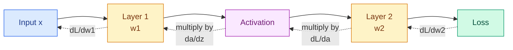

# Calculus: Derivatives and Gradients

**Level:** 🟡 Intermediate &nbsp;|&nbsp; **Effort:** Detailed module &nbsp;|&nbsp; **Module:** [02 Mathematics for AI](README.md)

---

## 🎯 Learning Objectives

By the end of this topic you will be able to:

- Explain a derivative as a slope, and compute one numerically
- Differentiate the handful of functions machine learning actually uses
- Apply the chain rule, and see why it *is* backpropagation
- Compute a gradient and say what direction it points
- Read Jacobian and Hessian without alarm
- Check any hand-derived gradient against a numerical one

## 📚 Prerequisites

[Topic 1: Basic Mathematics](01-basic-mathematics.md) and
[Topic 2: Vectors and Matrices](02-linear-algebra-vectors-and-matrices.md).

---

## 1. Why calculus is in this repository

**Training a model means adjusting parameters to reduce a loss.** To adjust them sensibly you need
to know, for each parameter, *which way to move it and how much it matters*. That quantity is a
derivative. Everything else in this topic is machinery around that one idea.

---

## 2. The derivative is a slope

### 🍰 Simple explanation

The derivative of a function at a point is **how steeply it is rising or falling there**.

### 🏠 Real-life analogy

Walking on a hill. The derivative is the gradient under your feet: positive uphill, negative
downhill, zero on the flat — a summit, a valley floor, or a plateau.

### ⚙️ Definition

Take two points a tiny distance `h` apart and measure rise over run, letting `h` shrink:

```text
              f(x + h) − f(x)
  f'(x) = lim ────────────────
          h→0        h
```

```python
def f(x):
    return x ** 2


def numerical_derivative(function, x, h=1e-5):
    """Rise over run with a very small run. The definition, made finite."""
    return (function(x + h) - function(x)) / h


for x in [0.0, 1.0, 3.0, -2.0]:
    approx = numerical_derivative(f, x)
    exact = 2 * x                     # the derivative of x^2 is 2x
    print(f"x={x:>5.1f}   numerical {approx:>9.5f}   exact {exact:>6.1f}   error {abs(approx - exact):.2e}")
```

**Output:**
```
x=  0.0   numerical   0.00001   exact    0.0   error 1.00e-05
x=  1.0   numerical   2.00001   exact    2.0   error 1.00e-05
x=  3.0   numerical   6.00001   exact    6.0   error 1.00e-05
x= -2.0   numerical  -3.99999   exact   -4.0   error 1.00e-05
```

**At `x = 0` the derivative is 0** — the bottom of the parabola, where the slope is flat. That is
exactly the point an optimiser is trying to reach.

### The central difference is better

```python
def f(x):
    return x ** 2


def forward_difference(function, x, h=1e-5):
    return (function(x + h) - function(x)) / h


def central_difference(function, x, h=1e-5):
    """Look both ways. Error shrinks with h squared rather than h."""
    return (function(x + h) - function(x - h)) / (2 * h)


x = 3.0
exact = 6.0
print(f"forward difference: {forward_difference(f, x):.10f}  error {abs(forward_difference(f, x) - exact):.2e}")
print(f"central difference: {central_difference(f, x):.10f}  error {abs(central_difference(f, x) - exact):.2e}")
```

**Output:**
```
forward difference: 6.0000100000  error 1.00e-05
central difference: 6.0000000000  error 3.93e-11
```

Same cost, dramatically better accuracy. **Use central differences whenever you check a gradient
numerically** — which section 7 shows you should always do.

---

### ⚠️ Making `h` smaller does not keep making it better

The definition says "let h shrink to zero". Floating point disagrees.

```python
def f(x):
    return x ** 2


exact = 6.0
x = 3.0

print(f"{'h':>10}{'central difference':>22}{'absolute error':>18}")
for power in [2, 4, 6, 8, 10, 12, 14, 16]:
    h = 10.0 ** -power
    estimate = (f(x + h) - f(x - h)) / (2 * h)
    print(f"{h:>10.0e}{estimate:>22.12f}{abs(estimate - exact):>18.2e}")
```

**Output:**
```
         h    central difference    absolute error
     1e-02        6.000000000000          1.28e-13
     1e-04        6.000000000013          1.27e-11
     1e-06        6.000000000839          8.39e-10
     1e-08        5.999999963535          3.65e-08
     1e-10        6.000000496442          4.96e-07
     1e-12        6.000533403494          5.33e-04
     1e-14        6.128431095931          1.28e-01
     1e-16        0.000000000000          6.00e+00
```

**The error falls, bottoms out, and then gets worse again.** Two effects fight each other:
truncation error shrinks as `h` shrinks, but **subtracting two nearly-identical floats destroys
significant digits** — catastrophic cancellation — and that grows as `h` shrinks. At `h = 1e-16`,
`f(x+h)` and `f(x-h)` are the same number and the estimate collapses.

The sweet spot for central differences is around `1e-5` to `1e-6`. **Choosing `h` as small as
possible is a natural instinct and the wrong one.**

## 3. The rules you actually need

| Function | Derivative | Where it shows up |
| --- | --- | --- |
| `c` (constant) | `0` | Bias terms w.r.t. inputs |
| `x` | `1` | Identity, skip connections |
| `xⁿ` | `n·xⁿ⁻¹` | Squared error, polynomial features |
| `eˣ` | `eˣ` | Softmax, sigmoid — **it is its own derivative** |
| `ln(x)` | `1/x` | Cross-entropy, log-likelihood |
| `f(x) + g(x)` | `f' + g'` | Summed losses |
| `f(g(x))` | `f'(g(x)) · g'(x)` | **The chain rule — backpropagation** |

```python
import numpy as np


def check(name, function, derivative, x, h=1e-6):
    numerical = (function(x + h) - function(x - h)) / (2 * h)
    analytic = derivative(x)
    print(f"{name:<12} at x={x}:  analytic {analytic:>10.6f}   numerical {numerical:>10.6f}   "
          f"match {np.isclose(analytic, numerical, rtol=1e-5)}")


check("x^3", lambda x: x ** 3, lambda x: 3 * x ** 2, 2.0)
check("exp(x)", np.exp, np.exp, 1.0)
check("ln(x)", np.log, lambda x: 1 / x, 4.0)
check("sigmoid", lambda x: 1 / (1 + np.exp(-x)),
      lambda x: (1 / (1 + np.exp(-x))) * (1 - 1 / (1 + np.exp(-x))), 0.5)
```

**Output:**
```
x^3          at x=2.0:  analytic  12.000000   numerical  12.000000   match True
exp(x)       at x=1.0:  analytic   2.718282   numerical   2.718282   match True
ln(x)        at x=4.0:  analytic   0.250000   numerical   0.250000   match True
sigmoid      at x=0.5:  analytic   0.235004   numerical   0.235004   match True
```

### 💻 The sigmoid derivative is unusually tidy

```python
import numpy as np


def sigmoid(x):
    return 1 / (1 + np.exp(-x))


def sigmoid_derivative(x):
    """s'(x) = s(x) * (1 - s(x)) - expressed using the value you already computed."""
    s = sigmoid(x)
    return s * (1 - s)


print(f"{'x':>6}{'sigmoid':>12}{'derivative':>14}")
for x in [-8.0, -4.0, 0.0, 4.0, 8.0]:
    print(f"{x:>6.1f}{sigmoid(x):>12.6f}{sigmoid_derivative(x):>14.6f}")

print(f"\nmaximum derivative is at x=0: {sigmoid_derivative(0.0)}")
```

**Output:**
```
     x     sigmoid    derivative
  -8.0    0.000335      0.000335
  -4.0    0.017986      0.017663
   0.0    0.500000      0.250000
   4.0    0.982014      0.017663
   8.0    0.999665      0.000335

maximum derivative is at x=0: 0.25
```

**Two things matter here.** The derivative is expressed using the sigmoid's own output, so a forward
pass can cache it and backpropagation gets it free. And it **peaks at 0.25 and collapses toward zero
at both ends** — so stacking ten sigmoid layers multiplies ten numbers each at most 0.25, giving a
gradient below 10⁻⁶. That is the **vanishing gradient problem**, quantified, and the reason ReLU
replaced sigmoid in hidden layers ([08 Deep Learning](../08-deep-learning/README.md)).

---

## 4. The chain rule *is* backpropagation

### 🍰 Simple explanation

If `y` depends on `u`, and `u` depends on `x`, then to find how `y` responds to `x` you **multiply
the two rates together**.

### 🏠 Real-life analogy

Gears. If gear A turns 3× faster than gear B, and B turns 2× faster than C, then A turns 6× faster
than C. Rates multiply along a chain.

```text
  dy     dy    du
  ──  =  ── ·  ──
  dx     du    dx
```

```python
import numpy as np

# A two-step composition: u = 3x + 1, then y = u^2
def u_of_x(x):
    return 3 * x + 1


def y_of_u(u):
    return u ** 2


def y_of_x(x):
    return y_of_u(u_of_x(x))


x = 2.0

du_dx = 3.0                       # derivative of 3x + 1
dy_du = 2 * u_of_x(x)             # derivative of u^2, evaluated at u
dy_dx_chain = dy_du * du_dx

numerical = (y_of_x(x + 1e-6) - y_of_x(x - 1e-6)) / (2e-6)

print(f"u at x=2:        {u_of_x(x)}")
print(f"du/dx:           {du_dx}")
print(f"dy/du:           {dy_du}")
print(f"chain rule:      {dy_du} x {du_dx} = {dy_dx_chain}")
print(f"numerical check: {numerical:.6f}")
print(f"agree: {np.isclose(dy_dx_chain, numerical)}")
```

**Output:**
```
u at x=2:        7.0
du/dx:           3.0
dy/du:           14.0
chain rule:      14.0 x 3.0 = 42.0
numerical check: 42.000000
agree: True
```

### ⚙️ Why this is the whole of backpropagation

A neural network is a long composition: input → layer 1 → activation → layer 2 → … → loss. To find
how the loss responds to a weight in layer 1, you multiply the derivatives back along the chain.



**Backpropagation is not a separate algorithm.** It is the chain rule applied to a computation
graph, with intermediate results cached so nothing is computed twice. That caching is the only
"clever" part.

```python
import numpy as np

# One neuron, one sample, worked end to end by hand.
x, w, b, y_true = 2.0, 0.5, 0.1, 1.0

# --- forward ---
z = w * x + b                       # pre-activation
a = 1 / (1 + np.exp(-z))            # sigmoid
loss = (a - y_true) ** 2            # squared error

# --- backward, one link at a time ---
dloss_da = 2 * (a - y_true)
da_dz = a * (1 - a)
dz_dw = x
dz_db = 1.0

dloss_dw = dloss_da * da_dz * dz_dw
dloss_db = dloss_da * da_dz * dz_db

print(f"forward:  z={z:.4f}  a={a:.6f}  loss={loss:.6f}")
print()
print(f"dloss/da = {dloss_da:.6f}")
print(f"da/dz    = {da_dz:.6f}")
print(f"dz/dw    = {dz_dw}")
print(f"dloss/dw = {dloss_dw:.6f}   (product of the three)")
print(f"dloss/db = {dloss_db:.6f}")

# Numerical check on w
h = 1e-6
def loss_at(weight):
    z_ = weight * x + b
    a_ = 1 / (1 + np.exp(-z_))
    return (a_ - y_true) ** 2

numerical_dw = (loss_at(w + h) - loss_at(w - h)) / (2 * h)
print(f"\nnumerical dloss/dw: {numerical_dw:.6f}")
print(f"analytic matches numerical: {np.isclose(dloss_dw, numerical_dw)}")
```

**Output:**
```
forward:  z=1.1000  a=0.750260  loss=0.062370

dloss/da = -0.499480
da/dz    = 0.187370
dz/dw    = 2.0
dloss/dw = -0.187175   (product of the three)
dloss/db = -0.093587

numerical dloss/dw: -0.187175
analytic matches numerical: True
```

**That is a complete training step's worth of gradient**, computed by multiplying three numbers.
Every deep-learning framework automates exactly this and nothing more mysterious.

---

## 5. Partial derivatives and the gradient

With several inputs, a **partial derivative** ∂f/∂x asks how f changes as *one* variable moves and
the others stay put. Collect them all into a vector and you have the **gradient**, written ∇f.

```python
import numpy as np


def f(x, y):
    """A simple bowl, steeper in x than in y."""
    return 3 * x ** 2 + y ** 2


def gradient(x, y):
    return np.array([6 * x, 2 * y])


def numerical_gradient(function, point, h=1e-6):
    point = np.asarray(point, dtype=float)
    out = np.zeros_like(point)
    for i in range(len(point)):
        step = np.zeros_like(point)
        step[i] = h
        out[i] = (function(*(point + step)) - function(*(point - step))) / (2 * h)
    return out


point = (1.0, 2.0)
print(f"f{point} = {f(*point)}")
print(f"analytic gradient:  {gradient(*point)}")
print(f"numerical gradient: {numerical_gradient(f, point).round(6)}")
print()
print(f"gradient magnitude: {np.linalg.norm(gradient(*point)):.4f}")
print(f"at the minimum (0,0): {gradient(0.0, 0.0)}")
```

**Output:**
```
f(1.0, 2.0) = 7.0
analytic gradient:  [6. 4.]
numerical gradient: [6. 4.]

gradient magnitude: 7.2111
at the minimum (0,0): [0. 0.]
```

### ⚙️ What the gradient points at

**The gradient points in the direction of steepest *increase*.** So to *decrease* a loss you move in
the opposite direction — which is the single line of arithmetic at the heart of all training:

```text
  new_parameter = old_parameter − learning_rate × gradient
```

```python
import numpy as np


def f(x, y):
    return 3 * x ** 2 + y ** 2


def gradient(x, y):
    return np.array([6 * x, 2 * y])


point = np.array([1.0, 2.0])
grad = gradient(*point)
step = 0.1

uphill = f(*(point + step * grad / np.linalg.norm(grad)))
downhill = f(*(point - step * grad / np.linalg.norm(grad)))

print(f"f at the start:            {f(*point):.6f}")
print(f"f after stepping uphill:   {uphill:.6f}")
print(f"f after stepping downhill: {downhill:.6f}")
print(f"downhill really is lower:  {downhill < f(*point)}")
```

**Output:**
```
f at the start:            7.000000
f after stepping uphill:   7.744956
f after stepping downhill: 6.302736
downhill really is lower:  True
```

**The gradient's magnitude also carries information**: large means steep, and near zero means you
are at a minimum, a maximum, or a flat region — which is why "the gradient vanished" is a complaint
about learning having stopped.

---

## 6. Jacobian and Hessian

These sound intimidating and are just bookkeeping.

| Object | Contains | Shape | Answers |
| --- | --- | --- | --- |
| **Gradient** | First derivatives of **one** output | `(n,)` | Which way is downhill? |
| **Jacobian** | First derivatives of **many** outputs | `(m, n)` | How does each output respond to each input? |
| **Hessian** | **Second** derivatives | `(n, n)` | How curved is the surface? |

```python
import numpy as np


def vector_function(x):
    """Two outputs, two inputs - so the Jacobian is 2x2."""
    return np.array([x[0] ** 2 * x[1], 5 * x[0] + np.sin(x[1])])


def analytic_jacobian(x):
    return np.array([
        [2 * x[0] * x[1], x[0] ** 2],
        [5.0,             np.cos(x[1])],
    ])


def numerical_jacobian(function, x, h=1e-6):
    x = np.asarray(x, dtype=float)
    base = function(x)
    out = np.zeros((len(base), len(x)))
    for i in range(len(x)):
        step = np.zeros_like(x)
        step[i] = h
        out[:, i] = (function(x + step) - function(x - step)) / (2 * h)
    return out


point = np.array([2.0, 1.0])
print(f"analytic Jacobian:\n{analytic_jacobian(point).round(6)}")
print(f"numerical Jacobian:\n{numerical_jacobian(vector_function, point).round(6)}")
print(f"agree: {np.allclose(analytic_jacobian(point), numerical_jacobian(vector_function, point))}")
```

**Output:**
```
analytic Jacobian:
[[4.       4.      ]
 [5.       0.540302]]
numerical Jacobian:
[[4.       4.      ]
 [5.       0.540302]]
agree: True
```

### The Hessian and why training is slow in valleys

```python
import numpy as np

# A badly conditioned bowl: very steep in one direction, nearly flat in the other.
hessian = np.array([[100.0, 0.0],
                    [0.0, 1.0]])

eigenvalues = np.linalg.eigvalsh(hessian)

print(f"Hessian:\n{hessian}")
print(f"eigenvalues: {eigenvalues}")
print(f"condition number: {eigenvalues.max() / eigenvalues.min():.0f}")
print(f"all positive -> this is a minimum: {np.all(eigenvalues > 0)}")
```

**Output:**
```
Hessian:
[[100.   0.]
 [  0.   1.]]
eigenvalues: [  1. 100.]
condition number: 100
all positive -> this is a minimum: True
```

**The eigenvalues of the Hessian are the curvature along each principal direction.** Here one
direction is 100× steeper than the other, so the loss surface is a long narrow valley. Gradient
descent bounces across the steep walls while creeping along the shallow floor, and the learning rate
is capped by the steepest direction even though the shallow one needs a big step.

That single fact motivates almost everything in
[Topic 9: Optimisation](09-optimisation-algorithms.md) — momentum, Adam, and feature scaling all
exist to soften this problem. **It is also why standardising features helps**: it makes the bowl
rounder.

---

## 7. 🧪 Hands-on lab: gradient checking

**Every hand-derived gradient should be checked numerically before you trust it.** A wrong gradient
does not crash — it trains slowly, or to a worse answer, and you blame the data for a week.

```python
import numpy as np

rng = np.random.default_rng(0)

X = rng.normal(size=(20, 3))
y_true = rng.normal(size=20)


def loss_and_gradient(w):
    """Mean squared error for a linear model, with its analytic gradient."""
    predictions = X @ w
    errors = predictions - y_true
    loss = np.mean(errors ** 2)
    gradient = (2 / len(y_true)) * (X.T @ errors)
    return loss, gradient


def wrong_gradient(w):
    """The same thing with a subtle error: the factor of 2 is missing."""
    predictions = X @ w
    errors = predictions - y_true
    return np.mean(errors ** 2), (1 / len(y_true)) * (X.T @ errors)


def numerical_gradient(function, w, h=1e-6):
    out = np.zeros_like(w)
    for i in range(len(w)):
        step = np.zeros_like(w)
        step[i] = h
        out[i] = (function(w + step)[0] - function(w - step)[0]) / (2 * h)
    return out


w = rng.normal(size=3)

for name, candidate in [("correct", loss_and_gradient), ("buggy", wrong_gradient)]:
    _, analytic = candidate(w)
    numerical = numerical_gradient(candidate, w)
    relative_error = np.linalg.norm(analytic - numerical) / (
        np.linalg.norm(analytic) + np.linalg.norm(numerical)
    )
    verdict = "PASS" if relative_error < 1e-7 else "FAIL"
    print(f"{name:<9} relative error {relative_error:.3e}   {verdict}")
```

**Output:**
```
correct   relative error 1.434e-10   PASS
buggy     relative error 3.333e-01   FAIL
```

**The buggy gradient still points downhill** — it is exactly half the right size — so training with
it would work, just at half the effective learning rate. Nothing would look broken. Only the check
reveals it.

The standard threshold is a relative error below `1e-7`; anything above `1e-4` is a genuine bug.

**Extend it:** add a regularisation term and re-check; break the gradient in a different way (wrong
sign, transposed matrix) and see which errors the check catches; and write it as a pytest test
([module 01, topic 9](../01-python-foundations/09-testing-and-package-management.md)).

---

## 🎤 Interview questions

**"What is a derivative, and why does machine learning need one?"**

It is the instantaneous rate of change — the slope of a function at a point. Training minimises a
loss by adjusting parameters, and the derivative of the loss with respect to each parameter says
which direction reduces it and by how much per unit change. Without it you would be searching
blindly.

**"Explain the chain rule and its relationship to backpropagation."**

The chain rule says the derivative of a composition is the product of the derivatives along it:
`dy/dx = dy/du · du/dx`. A neural network is a deep composition of layers and activations, so the
derivative of the loss with respect to an early weight is a product of derivatives back through
every later stage. Backpropagation is exactly that computation, organised to cache intermediate
results so each is calculated once — it is the chain rule with dynamic programming, not a separate
algorithm.

**"Why do sigmoid activations cause vanishing gradients?"**

The sigmoid's derivative is `s(1−s)`, which peaks at 0.25 and approaches zero as inputs grow in
either direction. Backpropagation multiplies one such factor per layer, so with ten layers the
gradient is scaled by at most `0.25¹⁰ ≈ 10⁻⁶`. Early layers receive almost no signal and stop
learning. ReLU has derivative 1 for positive inputs, which avoids the compounding shrinkage.

**"What does the Hessian tell you?"**

It holds the second derivatives, describing curvature. Its eigenvalues give curvature along each
principal direction: all positive means a local minimum, mixed signs mean a saddle point. The ratio
of largest to smallest eigenvalue — the condition number — measures how elongated the loss valley
is, and a large ratio is why plain gradient descent zigzags and why momentum, adaptive optimisers
and feature scaling help.

**"How do you verify a gradient implementation?"**

Gradient checking: compare the analytic gradient against a central-difference numerical estimate and
require the relative error to be below about `1e-7`. Use central differences, not forward, and check
at a random point rather than at zero, where many bugs cancel. Do it once during development on a
small input, then disable it — it is far too slow for training.

---

## ✅ Key takeaways

- A derivative is a slope: how fast the output changes as the input moves.
- **Central differences beat forward differences** at identical cost. Use them for checking.
- `eˣ` is its own derivative; `ln(x)` differentiates to `1/x`.
- The sigmoid derivative is `s(1−s)`, **peaking at just 0.25** — vanishing gradients, quantified.
- **The chain rule multiplies rates along a composition, and that is backpropagation.** The only
  extra idea is caching.
- The gradient is the vector of partial derivatives and **points uphill**, so training subtracts it.
- A near-zero gradient means a minimum, a maximum, or a plateau — and no learning.
- Jacobian = first derivatives of many outputs. Hessian = second derivatives = curvature.
- **A large Hessian condition number means a narrow valley**, which is why scaling features and
  adaptive optimisers help.
- **Always gradient-check a hand-derived gradient.** A wrong one does not crash; it quietly
  underperforms.

---

## 📚 Official References

- [numpy.gradient — NumPy Developers](https://numpy.org/doc/stable/reference/generated/numpy.gradient.html) — verified 2026-08-31
- [PyTorch: Autograd mechanics — PyTorch Foundation](https://pytorch.org/docs/stable/notes/autograd.html) — verified 2026-08-31
- [PyTorch: Gradcheck mechanics — PyTorch Foundation](https://pytorch.org/docs/stable/notes/gradcheck.html) — verified 2026-08-31
- [PyTorch: A Gentle Introduction to torch.autograd — PyTorch Foundation](https://pytorch.org/tutorials/beginner/blitz/autograd_tutorial.html) — verified 2026-08-31
- [SciPy: optimize.approx_fprime — SciPy Developers](https://docs.scipy.org/doc/scipy/reference/generated/scipy.optimize.approx_fprime.html) — verified 2026-08-31

---

## 🔗 Navigation

[← Topic 3: Norms, Eigenvalues and PCA](03-norms-eigenvalues-and-pca.md) &nbsp;|&nbsp;
[Module home](README.md) &nbsp;|&nbsp;
[Topic 5: Gradient Descent and Backpropagation →](05-gradient-descent-and-backpropagation.md)
