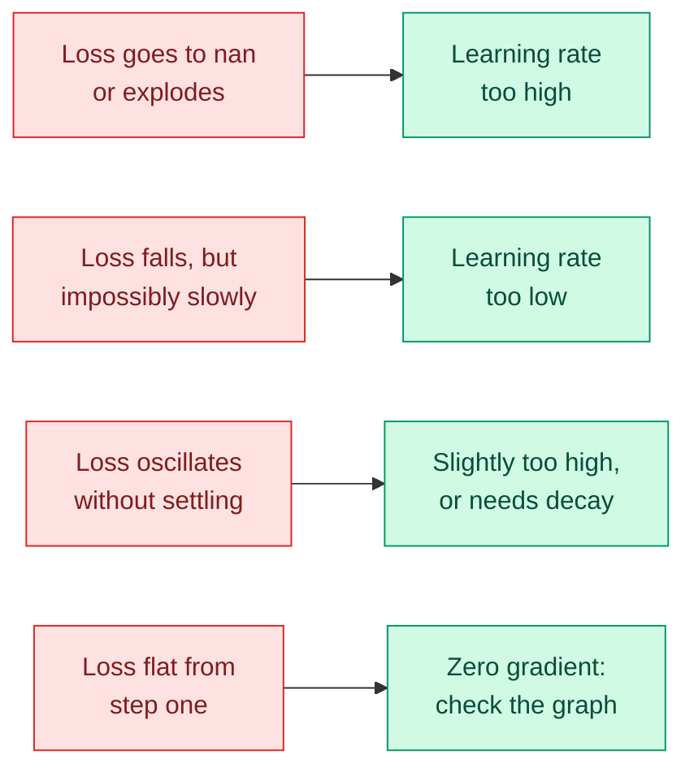

# Gradient Descent and Backpropagation

**Level:** 🟡 Intermediate &nbsp;|&nbsp; **Effort:** Detailed module &nbsp;|&nbsp; **Module:** [02 Mathematics for AI](README.md)

---

## 🎯 Learning Objectives

By the end of this topic you will be able to:

- Implement gradient descent from scratch and watch a loss fall
- Explain what the learning rate does, and diagnose one set too high or too low
- Distinguish batch, stochastic and mini-batch gradient descent
- Implement backpropagation through a small network by hand
- Explain why feature scaling changes how fast training converges
- Recognise the failure modes: divergence, plateaus, exploding gradients

## 📚 Prerequisites

[Topic 4: Derivatives and Gradients](04-calculus-derivatives-and-gradients.md)

---

## 1. The idea in one paragraph

You are on a hillside in fog. You cannot see the valley, but you can feel the slope under your feet.
So you take a step downhill, feel again, and repeat. **That is gradient descent**, and the entire
algorithm is one line:

```text
  θ  ←  θ  −  η · ∇L(θ)
```

θ (theta) is the parameters, η (eta) is the **learning rate** — how big a step to take — and ∇L is
the gradient of the loss. The minus sign is there because the gradient points uphill.

---

## 2. Gradient descent on a function you can check

```python
import numpy as np


def f(x):
    """A parabola with its minimum at x = 3."""
    return (x - 3) ** 2 + 1


def gradient(x):
    return 2 * (x - 3)


x = 10.0
learning_rate = 0.1

print(f"{'step':>5}{'x':>10}{'f(x)':>10}{'gradient':>11}")
for step in range(9):
    if step % 2 == 0:
        print(f"{step:>5}{x:>10.4f}{f(x):>10.4f}{gradient(x):>11.4f}")
    x = x - learning_rate * gradient(x)

print(f"\nfinal x: {x:.6f}   (true minimum is at 3)")
print(f"final f(x): {f(x):.6f}   (true minimum value is 1)")
```

**Output:**
```
 step         x      f(x)   gradient
    0   10.0000   50.0000    14.0000
    2    7.4800   21.0704     8.9600
    4    5.8672    9.2208     5.7344
    6    4.8350    4.3673     3.6700
    8    4.1744    2.3792     2.3488

final x: 3.939524   (true minimum is at 3)
final f(x): 1.882706   (true minimum value is 1)
```

**Watch the gradient shrink as x approaches 3.** The steps get smaller automatically, because the
gradient itself is smaller near the minimum. Gradient descent decelerates into a minimum without
being told to.

---

## 3. The learning rate is the thing you will get wrong

```python
import numpy as np


def f(x):
    return (x - 3) ** 2 + 1


def gradient(x):
    return 2 * (x - 3)


def run(learning_rate, steps=25, start=10.0):
    x = start
    for _ in range(steps):
        x = x - learning_rate * gradient(x)
        if not np.isfinite(x):
            return x
    return x


print(f"{'learning rate':>15}{'x after 25 steps':>22}   {'verdict':<30}")
for lr, verdict in [
    (0.001, "far too slow"),
    (0.01,  "slow but working"),
    (0.1,   "healthy"),
    (0.9,   "oscillating, still converging"),
    (1.0,   "stuck bouncing forever"),
    (1.1,   "diverging"),
]:
    result = run(lr)
    shown = f"{result:.6f}" if np.isfinite(result) else str(result)
    print(f"{lr:>15}{shown:>22}   {verdict:<30}")
```

**Output:**
```
  learning rate      x after 25 steps   verdict                       
          0.001              9.658273   far too slow                  
           0.01              7.224253   slow but working              
            0.1              3.026445   healthy                       
            0.9              2.973555   oscillating, still converging 
            1.0             -4.000000   stuck bouncing forever        
            1.1           -664.773517   diverging                     
```

**Three distinct failures in one table.**

- **Too small** — it works, but you may need a million steps you cannot afford.
- **At exactly 1.0** here the update overshoots to a mirror-image point and bounces forever, never
  converging and never diverging.
- **Above that** it overshoots further each time and diverges to infinity — which in real training
  appears as a loss that becomes `nan` within a few batches.



**The one non-negotiable habit: print the loss every epoch.** Every failure above is obvious from
the loss curve within seconds, and invisible from the final number alone.

---

## 4. Linear regression by gradient descent

Now on real data, with a known right answer to check against.

```python
import numpy as np
import pandas as pd

housing = pd.read_csv("datasets/samples/housing.csv")
features = ["area_sqm", "bedrooms", "age_years", "distance_km"]
X_raw = housing[features].to_numpy()
y = housing["price_thousands"].to_numpy()

# Standardise, then add a bias column.
X = (X_raw - X_raw.mean(axis=0)) / X_raw.std(axis=0)
X = np.column_stack([np.ones(len(X)), X])

def loss_and_gradient(w):
    predictions = X @ w
    errors = predictions - y
    loss = np.mean(errors ** 2)
    gradient = (2 / len(y)) * (X.T @ errors)
    return loss, gradient


w = np.zeros(X.shape[1])
learning_rate = 0.1

print(f"{'epoch':>7}{'loss':>14}")
for epoch in range(301):
    loss, gradient = loss_and_gradient(w)
    if epoch % 50 == 0:
        print(f"{epoch:>7}{loss:>14.4f}")
    w = w - learning_rate * gradient

exact = np.linalg.lstsq(X, y, rcond=None)[0]
print()
print(f"gradient descent: {w.round(3)}")
print(f"exact solution:   {exact.round(3)}")
print(f"agree to 3 decimals: {np.allclose(w, exact, atol=1e-3)}")
```

**Output:**
```
  epoch          loss
      0   180032.1246
     50      324.1776
    100      324.1776
    150      324.1776
    200      324.1776
    250      324.1776
    300      324.1776

gradient descent: [391.386 157.13   18.055 -24.049 -27.591]
exact solution:   [391.386 157.13   18.055 -24.049 -27.591]
agree to 3 decimals: True
```

**Gradient descent converged to the same answer `lstsq` computes directly.** For linear regression
the exact solution exists, so you would never iterate — but for a neural network there is no closed
form, and iterating is all you have.

### ⚠️ Why the standardisation line matters

```python
import numpy as np
import pandas as pd

housing = pd.read_csv("datasets/samples/housing.csv")
features = ["area_sqm", "bedrooms", "age_years", "distance_km"]
X_raw = housing[features].to_numpy()
y = housing["price_thousands"].to_numpy()


def train(X, learning_rate, epochs=300):
    X = np.column_stack([np.ones(len(X)), X])
    w = np.zeros(X.shape[1])
    for _ in range(epochs):
        errors = X @ w - y
        w = w - learning_rate * (2 / len(y)) * (X.T @ errors)
        # "Diverged" must catch finite-but-absurd values too, not just inf and nan.
        if not np.all(np.isfinite(w)) or np.max(np.abs(w)) > 1e12:
            return None
    return np.mean((X @ w - y) ** 2)


X_scaled = (X_raw - X_raw.mean(axis=0)) / X_raw.std(axis=0)

print(f"{'learning rate':>15}{'unscaled':>16}{'scaled':>14}")
for lr in [0.1, 0.01, 0.001, 0.0001]:
    unscaled = train(X_raw, lr)
    scaled = train(X_scaled, lr)
    u = "diverged" if unscaled is None else f"{unscaled:.2f}"
    s = "diverged" if scaled is None else f"{scaled:.2f}"
    print(f"{lr:>15}{u:>16}{s:>14}")
```

**Output:**
```
  learning rate        unscaled        scaled
            0.1        diverged        324.18
           0.01        diverged        325.17
          0.001        diverged      54313.07
         0.0001        diverged     159682.12
```

**The unscaled version diverges at every learning rate that works for the scaled one.** The reason
is the Hessian condition number from [Topic 4](04-calculus-derivatives-and-gradients.md): `area_sqm`
spans hundreds while `bedrooms` spans single digits, so the loss surface is an extremely narrow
valley. The largest safe learning rate is set by the steepest direction, and that leaves the shallow
directions crawling.

**Standardising makes the bowl rounder**, which is why scaling is not a nicety — it decides whether
gradient descent works at all.

---

## 5. Batch, stochastic and mini-batch

| Variant | Gradient computed on | Trade-off |
| --- | --- | --- |
| **Batch** | The entire dataset | Smooth, accurate, and impossible above a certain size |
| **Stochastic (SGD)** | One sample | Very noisy, very cheap, escapes shallow minima |
| **Mini-batch** | 32–512 samples | The practical compromise — and what everyone actually uses |

```python
import numpy as np

rng = np.random.default_rng(0)
n = 2000
X = np.column_stack([np.ones(n), rng.normal(size=(n, 3))])
true_w = np.array([1.0, 2.0, -3.0, 0.5])
y = X @ true_w + rng.normal(scale=0.5, size=n)


def train(batch_size, epochs=20, learning_rate=0.05, seed=0):
    generator = np.random.default_rng(seed)
    w = np.zeros(X.shape[1])
    updates = 0
    for _ in range(epochs):
        order = generator.permutation(n)
        for start in range(0, n, batch_size):
            idx = order[start:start + batch_size]
            errors = X[idx] @ w - y[idx]
            w = w - learning_rate * (2 / len(idx)) * (X[idx].T @ errors)
            updates += 1
    return w, updates, np.mean((X @ w - y) ** 2)


print(f"{'batch size':>12}{'updates':>10}{'final MSE':>12}{'distance to truth':>20}")
for batch_size in [n, 256, 32, 1]:
    w, updates, mse = train(batch_size)
    label = "full batch" if batch_size == n else str(batch_size)
    print(f"{label:>12}{updates:>10}{mse:>12.4f}{np.linalg.norm(w - true_w):>20.4f}")
```

**Output:**
```
  batch size   updates   final MSE   distance to truth
  full batch        20      0.4902              0.4898
         256       160      0.2619              0.0146
          32      1260      0.2623              0.0245
           1     40000      0.4008              0.3758
```

**Read that table carefully, because it does not say "smaller is better".**

Full batch made 20 updates in 20 epochs and barely moved. Batch sizes 256 and 32 made 160 and 1,260
updates and landed close to the true weights. But **batch size 1, despite making 40,000 updates,
ended up further from the truth than either** — worse, on this run, than batch size 256 by a factor
of twenty-five.

That is not a bug; it is what pure stochastic gradient descent does. Each update uses a single
sample, so the gradient is a very noisy estimate of the real one, and with a **constant** learning
rate the parameters never settle — they hover in a region around the optimum whose size is set by
the noise and the step size. More updates do not help once you are hovering.

Two consequences worth carrying: **mini-batch is a genuine sweet spot** rather than a compromise
forced by memory, and **learning-rate decay exists precisely to shrink that hovering region** as
training proceeds ([Topic 9](09-optimisation-algorithms.md)). The noise is not purely a cost — it
helps escape shallow minima and narrow ravines — but it has to be reduced eventually if you want to
converge rather than orbit.

---

## 6. 🧪 Hands-on lab: backpropagation from scratch

A two-layer network solving XOR — the classic problem a single linear layer **cannot** solve, which
makes it a genuine test that the hidden layer and its gradients work.

```python
import numpy as np

rng = np.random.default_rng(42)

X = np.array([[0.0, 0.0], [0.0, 1.0], [1.0, 0.0], [1.0, 1.0]])
y = np.array([[0.0], [1.0], [1.0], [0.0]])          # XOR: true when inputs differ


def sigmoid(z):
    return 1 / (1 + np.exp(-z))


# Two layers: 2 inputs -> 4 hidden -> 1 output
W1 = rng.normal(size=(2, 4)) * 1.0
b1 = np.zeros((1, 4))
W2 = rng.normal(size=(4, 1)) * 1.0
b2 = np.zeros((1, 1))

learning_rate = 0.5

print(f"{'epoch':>7}{'loss':>12}")
for epoch in range(6001):
    # ---- forward ----
    z1 = X @ W1 + b1
    a1 = sigmoid(z1)
    z2 = a1 @ W2 + b2
    a2 = sigmoid(z2)

    loss = np.mean((a2 - y) ** 2)

    # ---- backward: chain rule, layer by layer ----
    d_loss_d_a2 = 2 * (a2 - y) / len(y)
    d_a2_d_z2 = a2 * (1 - a2)
    delta2 = d_loss_d_a2 * d_a2_d_z2          # (4, 1)

    grad_W2 = a1.T @ delta2
    grad_b2 = delta2.sum(axis=0, keepdims=True)

    delta1 = (delta2 @ W2.T) * (a1 * (1 - a1))  # push the error back through layer 2
    grad_W1 = X.T @ delta1
    grad_b1 = delta1.sum(axis=0, keepdims=True)

    # ---- update ----
    W2 -= learning_rate * grad_W2
    b2 -= learning_rate * grad_b2
    W1 -= learning_rate * grad_W1
    b1 -= learning_rate * grad_b1

    if epoch % 1000 == 0:
        print(f"{epoch:>7}{loss:>12.6f}")

predictions = sigmoid(sigmoid(X @ W1 + b1) @ W2 + b2)
print()
print(f"{'input':>10}{'target':>9}{'predicted':>12}{'rounded':>10}")
for inputs, target, prediction in zip(X, y.ravel(), predictions.ravel(), strict=True):
    print(f"{str(inputs):>10}{target:>9.0f}{prediction:>12.4f}{round(prediction):>10}")

print(f"\nall four correct: {np.array_equal(np.round(predictions.ravel()), y.ravel())}")
```

**Output:**
```
  epoch        loss
      0    0.277470
   1000    0.144211
   2000    0.014909
   3000    0.004657
   4000    0.002506
   5000    0.001655
   6000    0.001215

     input   target   predicted   rounded
   [0. 0.]        0      0.0219         0
   [0. 1.]        1      0.9634         1
   [1. 0.]        1      0.9662         1
   [1. 1.]        0      0.0436         0

all four correct: True
```

**That is a working neural network in about twenty lines, with no framework.** Every step is
something from earlier topics:

| Line | Comes from |
| --- | --- |
| `X @ W1 + b1` | Matrix multiplication, [Topic 2](02-linear-algebra-vectors-and-matrices.md) |
| `sigmoid(z)` | The exponential, [Topic 1](01-basic-mathematics.md) |
| `a1 * (1 - a1)` | The sigmoid derivative, [Topic 4](04-calculus-derivatives-and-gradients.md) |
| `delta2 @ W2.T` | The chain rule pushing error backwards |
| `W -= lr * grad` | Gradient descent, this topic |

**`delta1 = (delta2 @ W2.T) * (a1 * (1 - a1))` is the line that *is* backpropagation.** It takes the
error at layer 2, maps it back through layer 2's weights, and multiplies by the local derivative of
layer 1's activation. Every framework does exactly this, for arbitrary graphs, automatically.

### ⚠️ Why this network needs a hidden layer

```python
import numpy as np

X = np.array([[0.0, 0.0], [0.0, 1.0], [1.0, 0.0], [1.0, 1.0]])
y = np.array([0.0, 1.0, 1.0, 0.0])

# The best possible straight-line fit to XOR.
X_bias = np.column_stack([np.ones(4), X])
w = np.linalg.lstsq(X_bias, y, rcond=None)[0]
predictions = X_bias @ w

print(f"best linear weights: {w.round(4)}")
print(f"predictions:         {predictions.round(4)}")
print(f"every prediction is 0.5: {np.allclose(predictions, 0.5)}")
print(f"mean squared error:  {np.mean((predictions - y) ** 2):.4f}")
```

**Output:**
```
best linear weights: [ 0.5  0.  -0. ]
predictions:         [0.5 0.5 0.5 0.5]
every prediction is 0.5: True
mean squared error:  0.2500
```

**The best straight line predicts 0.5 for all four inputs** — a complete failure, and not a training
problem. No line separates XOR, so no amount of gradient descent on a single linear layer will ever
solve it. **The hidden layer plus a non-linear activation is what makes the difference**, and this
is the concrete reason depth exists.

**Extend the lab:** replace sigmoid with ReLU in the hidden layer and compare convergence speed; add
gradient checking ([Topic 4](04-calculus-derivatives-and-gradients.md)) against these analytic
gradients; and remove the non-linearity to confirm the network collapses to a linear model.

---

## 7. Failure modes you will actually hit

| Symptom | Likely cause | Fix |
| --- | --- | --- |
| Loss becomes `nan` | Learning rate too high; `log(0)`; exploding gradients | Lower the rate, clip gradients, add epsilon |
| Loss flat from step 1 | Zero gradients — dead ReLUs, saturated sigmoids, or a disconnected graph | Check initialisation and activations |
| Loss falls then rises | Rate too high for the later, sharper region | Learning-rate decay |
| Loss oscillates | Batch too small, or rate slightly too high | Larger batch, or lower rate |
| Training loss falls, validation rises | Overfitting, not an optimisation problem | Regularise, get more data, stop earlier |

### Exploding gradients and clipping

```python
import numpy as np

gradient = np.array([120.0, -80.0, 45.0])
max_norm = 5.0

norm = np.linalg.norm(gradient)
clipped = gradient * min(1.0, max_norm / norm)

print(f"original gradient: {gradient}, norm {norm:.2f}")
print(f"clipped gradient:  {clipped.round(4)}, norm {np.linalg.norm(clipped):.4f}")
print(f"direction preserved: {np.allclose(clipped / np.linalg.norm(clipped), gradient / norm)}")
```

**Output:**
```
original gradient: [120. -80.  45.], norm 151.08
clipped gradient:  [ 3.9714 -2.6476  1.4893], norm 5.0000
direction preserved: True
```

**Clipping rescales the whole vector, so the direction is unchanged and only the step length is
capped.** That is why it is safe: you still move downhill, just not catastrophically far. It is
standard practice in recurrent networks and transformer training.

---

## 🎤 Interview questions

**"Explain gradient descent to someone non-technical."**

You are on a hillside in fog trying to reach the valley. You cannot see where it is, but you can
feel which way the ground slopes, so you step downhill, feel again, and repeat. The step size is the
learning rate: too small and you take forever; too large and you stride over the valley to the
opposite slope and end up higher than you started.

**"What happens if the learning rate is too high?"**

Each update overshoots the minimum, landing somewhere with a larger gradient, so the next step
overshoots further. Parameters grow without bound and the loss becomes `inf` then `nan`, usually
within a handful of batches. Slightly-too-high produces oscillation instead: the loss bounces around
a floor it never settles into.

**"Batch versus stochastic versus mini-batch — how do you choose?"**

Full batch gives the exact gradient but one update per pass, and is infeasible when data exceeds
memory. Stochastic uses one sample: extremely noisy but many updates, and the noise can escape poor
minima. Mini-batch is the practical middle and what is used in practice, with the size chosen to fit
memory and use the hardware efficiently — powers of two are conventional for that reason, not a
mathematical one.

**"Why does feature scaling speed up gradient descent?"**

Unscaled features produce a loss surface that is a long narrow valley, since a unit change in a
large-range feature affects the loss far more than in a small-range one. The safe learning rate is
capped by the steepest direction, so the shallow directions converge extremely slowly and the path
zigzags. Standardising makes the surface closer to circular, so one learning rate suits every
direction. In the example above, the unscaled problem diverged at every rate that worked scaled.

**"What is backpropagation actually doing?"**

Applying the chain rule to a computation graph, from the loss backwards, caching intermediate
results so each partial derivative is computed once. At each layer it takes the error signal from
the layer above, multiplies by that layer's local derivative, and passes it further back — giving
the gradient of the loss with respect to every parameter in one backward pass rather than one pass
per parameter.

---

## ✅ Key takeaways

- Gradient descent is `θ ← θ − η∇L`. The minus sign is because the gradient points uphill.
- **Steps shrink automatically near a minimum**, because the gradient does.
- The learning rate is the parameter you will get wrong: too low wastes time, too high diverges to
  `nan`, and a critical value bounces forever.
- **Print the loss every epoch.** Every failure mode is obvious from the curve and invisible from
  the final number.
- **Unscaled features can make gradient descent diverge at every usable learning rate.** Scaling is
  not cosmetic.
- Mini-batch wins because it makes many more updates per pass than full batch.
- **`delta_prev = (delta @ W.T) * activation_derivative` is backpropagation**, one line per layer.
- XOR needs a hidden layer and a non-linearity: the best linear model predicts 0.5 for everything.
- Gradient clipping caps step length while preserving direction.

---

## 📚 Official References

- [PyTorch: Optimizing model parameters — PyTorch Foundation](https://pytorch.org/tutorials/beginner/basics/optimization_tutorial.html) — verified 2026-08-31
- [PyTorch: torch.optim — PyTorch Foundation](https://pytorch.org/docs/stable/optim.html) — verified 2026-08-31
- [PyTorch: clip_grad_norm_ — PyTorch Foundation](https://pytorch.org/docs/stable/generated/torch.nn.utils.clip_grad_norm_.html) — verified 2026-08-31
- [scikit-learn: SGDRegressor — scikit-learn developers](https://scikit-learn.org/stable/modules/generated/sklearn.linear_model.SGDRegressor.html) — verified 2026-08-31
- [scikit-learn: Stochastic Gradient Descent — scikit-learn developers](https://scikit-learn.org/stable/modules/sgd.html) — verified 2026-08-31

---

## 🔗 Navigation

[← Topic 4: Derivatives and Gradients](04-calculus-derivatives-and-gradients.md) &nbsp;|&nbsp;
[Module home](README.md) &nbsp;|&nbsp;
[Topic 6: Probability →](06-probability.md)
