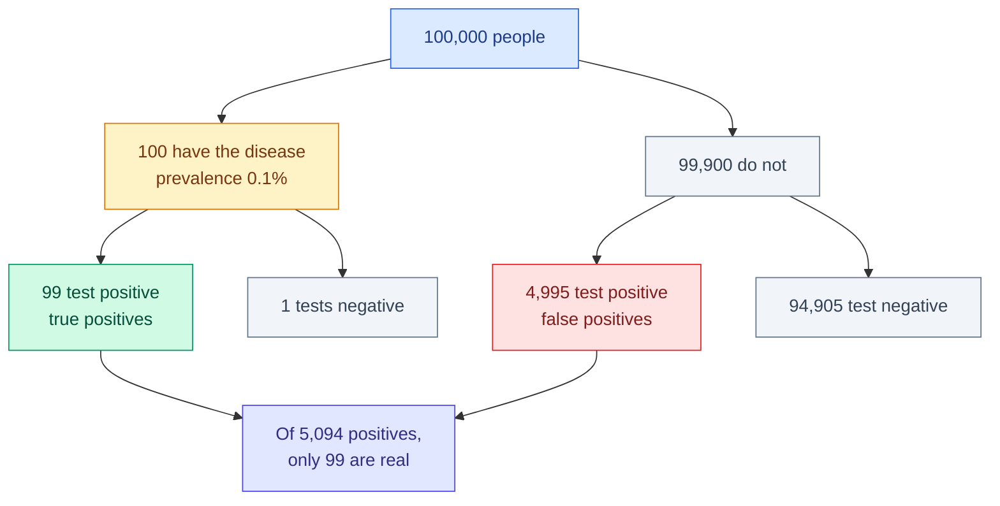

# Probability

**Level:** 🟡 Intermediate &nbsp;|&nbsp; **Effort:** Detailed module &nbsp;|&nbsp; **Module:** [02 Mathematics for AI](README.md)

---

## 🎯 Learning Objectives

By the end of this topic you will be able to:

- Use the basic rules of probability without second-guessing yourself
- Explain conditional probability and independence, and test for them
- Apply Bayes' theorem, and explain why a 99% accurate test is often wrong
- Recognise the distributions that appear in machine learning and what each models
- Explain Maximum Likelihood Estimation (MLE) and how it produces familiar loss functions
- Say what Maximum A Posteriori (MAP) adds, and why it is regularisation

## 📚 Prerequisites

[Topic 1: Basic Mathematics](01-basic-mathematics.md) — particularly logarithms.

---

## 1. Why probability is unavoidable

**Every machine-learning model outputs a belief, not a fact.** A classifier saying "spam" is really
saying "0.94 probability of spam". Understanding what that number means — and when it is
meaningless — is the difference between using a model and trusting it blindly.

---

## 2. The rules

| Rule | Statement | In words |
| --- | --- | --- |
| Range | `0 ≤ P(A) ≤ 1` | Nothing is more certain than certain |
| Complement | `P(not A) = 1 − P(A)` | |
| Addition | `P(A or B) = P(A) + P(B) − P(A and B)` | Do not double-count the overlap |
| Multiplication | `P(A and B) = P(A) · P(B given A)` | |
| Independence | `P(A and B) = P(A) · P(B)` | Only when A tells you nothing about B |

```python
import numpy as np

rng = np.random.default_rng(42)
rolls = rng.integers(1, 7, size=100_000)

p_even = np.mean(rolls % 2 == 0)
p_over_4 = np.mean(rolls > 4)
p_over_3 = np.mean(rolls > 3)

print("A genuinely independent pair - 'even' and 'greater than 4':")
both_a = np.mean((rolls % 2 == 0) & (rolls > 4))
print(f"  P(even) x P(>4) = {p_even * p_over_4:.4f}   P(even and >4) = {both_a:.4f}")
print(f"  independent: only 6 is both, and 1/6 = 1/2 x 1/3 exactly")

print("\nA dependent pair - 'even' and 'greater than 3':")
both_b = np.mean((rolls % 2 == 0) & (rolls > 3))
either_b = np.mean((rolls % 2 == 0) | (rolls > 3))
print(f"  P(even) x P(>3) = {p_even * p_over_3:.4f}   P(even and >3) = {both_b:.4f}")
print(f"  addition rule:  {p_even + p_over_3 - both_b:.4f} = P(even or >3) {either_b:.4f}")
print(f"  multiplying would understate it by {both_b - p_even * p_over_3:.4f}")
```

**Output:**
```
A genuinely independent pair - 'even' and 'greater than 4':
  P(even) x P(>4) = 0.1669   P(even and >4) = 0.1659
  independent: only 6 is both, and 1/6 = 1/2 x 1/3 exactly

A dependent pair - 'even' and 'greater than 3':
  P(even) x P(>3) = 0.2503   P(even and >3) = 0.3328
  addition rule:  0.6678 = P(even or >3) 0.6677
  multiplying would understate it by 0.0825
```

**Note that independence is not obvious by inspection.** "Even" and "greater than 4" *are*
independent on a fair die — knowing the roll exceeds 4 leaves the chance of even at exactly a half,
since {5, 6} contains one of each. But "even" and "greater than 3" are *not*: {4, 5, 6} contains two
even values out of three, so the conditional probability jumps to 2/3.

Nothing about the phrasing signals which is which. **You have to check.** Assuming independence
where it does not hold understates joint probabilities — here by about 0.08 — and it is one of the
most common modelling errors there is.

---

## 3. Conditional probability

```text
  P(A | B)  =  P(A and B) / P(B)          "probability of A, given B"
```

```python
import numpy as np

rng = np.random.default_rng(42)
rolls = rng.integers(1, 7, size=100_000)

over_3 = rolls > 3
p_even_given_over_3 = np.mean(rolls[over_3] % 2 == 0)

print(f"P(even)              = {np.mean(rolls % 2 == 0):.4f}")
print(f"P(even | roll > 3)   = {p_even_given_over_3:.4f}   (2 of {{4,5,6}} are even, theory 0.6667)")
print(f"by the formula       = {np.mean(over_3 & (rolls % 2 == 0)) / np.mean(over_3):.4f}")
print(f"conditioning changed the answer: {abs(p_even_given_over_3 - np.mean(rolls % 2 == 0)):.4f}")
```

**Output:**
```
P(even)              = 0.4996
P(even | roll > 3)   = 0.6643   (2 of {4,5,6} are even, theory 0.6667)
by the formula       = 0.6643
conditioning changed the answer: 0.1647
```

**Conditioning is filtering.** `P(A | B)` restricts attention to the rows where B happened, then
asks how often A holds there. That is exactly what `rolls[over_3]` does in code — a boolean mask
([module 01, topic 11](../01-python-foundations/11-numpy-essentials.md)) is a conditional
probability waiting to be averaged.

---

## 4. Bayes' theorem

```text
              P(B | A) · P(A)
  P(A | B) = ─────────────────
                   P(B)
```

| Term | Name | Means |
| --- | --- | --- |
| `P(A)` | Prior | What you believed before seeing evidence |
| `P(B given A)` | Likelihood | How probable the evidence is if A is true |
| `P(A given B)` | Posterior | Your updated belief |
| `P(B)` | Evidence | How probable the evidence is overall |

### 🌍 The medical test that fools everyone

A disease affects 1 in 1,000 people. A test catches 99% of cases and has a 5% false-positive rate.
**You test positive. What is the probability you have the disease?**

Most people say around 95%. Compute it:

```python
prevalence = 0.001
sensitivity = 0.99          # P(positive | disease)
false_positive_rate = 0.05  # P(positive | no disease)

p_positive = sensitivity * prevalence + false_positive_rate * (1 - prevalence)
posterior = (sensitivity * prevalence) / p_positive

print(f"P(disease) before testing: {prevalence:.4f}")
print(f"P(positive)              : {p_positive:.4f}")
print(f"P(disease | positive)    : {posterior:.4f}")
print()
print("Out of 100,000 people:")
sick = 100_000 * prevalence
print(f"  {sick:.0f} have it, of whom {sick * sensitivity:.0f} test positive")
healthy = 100_000 - sick
print(f"  {healthy:.0f} do not, of whom {healthy * false_positive_rate:.0f} test positive anyway")
print(f"  so of {sick * sensitivity + healthy * false_positive_rate:.0f} positives, "
      f"{sick * sensitivity:.0f} are real")
```

**Output:**
```
P(disease) before testing: 0.0010
P(positive)              : 0.0509
P(disease | positive)    : 0.0194

Out of 100,000 people:
  100 have it, of whom 99 test positive
  99900 do not, of whom 4995 test positive anyway
  so of 5094 positives, 99 are real
```

**Under 2%.** The counting version makes it obvious: false positives from the enormous healthy
population overwhelm the handful of true positives, because the disease is rare.



### ⚠️ Why this matters for your models

**This is the base-rate problem, and it is the single most common misreading of a model's output.**
Any classifier hunting a rare event — fraud, intrusion, a manufacturing defect, a rare disease —
produces mostly false positives even at excellent accuracy.

```python
def precision_at_prevalence(prevalence, recall=0.99, false_positive_rate=0.01, population=1_000_000):
    true_positives = population * prevalence * recall
    false_positives = population * (1 - prevalence) * false_positive_rate
    return true_positives / (true_positives + false_positives)


print(f"{'prevalence':>12}{'precision':>12}{'meaning':>34}")
for prevalence, meaning in [
    (0.5, "balanced classes"),
    (0.05, "1 in 20"),
    (0.001, "1 in 1,000"),
    (0.00001, "1 in 100,000 - fraud territory"),
]:
    print(f"{prevalence:>12}{precision_at_prevalence(prevalence):>12.4f}{meaning:>34}")
```

**Output:**
```
  prevalence   precision                           meaning
         0.5      0.9900                  balanced classes
        0.05      0.8390                           1 in 20
       0.001      0.0902                        1 in 1,000
       1e-05      0.0010    1 in 100,000 - fraud territory
```

**Same model, same 99% recall and 1% false-positive rate.** Precision collapses from 99% to under
0.1% purely because the event became rarer. Nothing about the model changed.

This is why [07 Model Evaluation](../07-model-evaluation/README.md) insists on precision and recall
over accuracy, and why deploying a fraud detector without knowing the base rate guarantees an
overwhelmed review team.

---

## 5. Distributions worth knowing

| Distribution | Models | Appears in |
| --- | --- | --- |
| **Bernoulli** | One yes/no trial | Binary classification output |
| **Binomial** | Successes in n trials | A/B test conversions |
| **Categorical** | One pick from k classes | Softmax output, next-token prediction |
| **Normal (Gaussian)** | Measurements clustered around a mean | Noise, weight initialisation, the CLT |
| **Uniform** | Every value equally likely | Random search, dropout masks |
| **Poisson** | Counts of rare events per interval | Arrivals, defects, request rates |
| **Exponential** | Waiting time between events | Latency modelling |

```python
import numpy as np

rng = np.random.default_rng(0)
size = 200_000

samples = {
    "bernoulli(p=0.3)": rng.binomial(1, 0.3, size),
    "binomial(n=10,p=0.3)": rng.binomial(10, 0.3, size),
    "normal(mu=0,sd=1)": rng.normal(0, 1, size),
    "uniform(0,1)": rng.uniform(0, 1, size),
    "poisson(lambda=3)": rng.poisson(3, size),
    "exponential(scale=2)": rng.exponential(2, size),
}

print(f"{'distribution':<24}{'mean':>9}{'std':>9}{'theoretical mean':>19}")
theory = {"bernoulli(p=0.3)": 0.3, "binomial(n=10,p=0.3)": 3.0, "normal(mu=0,sd=1)": 0.0,
          "uniform(0,1)": 0.5, "poisson(lambda=3)": 3.0, "exponential(scale=2)": 2.0}
for name, values in samples.items():
    print(f"{name:<24}{values.mean():>9.4f}{values.std():>9.4f}{theory[name]:>19.4f}")
```

**Output:**
```
distribution                 mean      std   theoretical mean
bernoulli(p=0.3)           0.2991   0.4579             0.3000
binomial(n=10,p=0.3)       3.0053   1.4521             3.0000
normal(mu=0,sd=1)          0.0026   0.9998             0.0000
uniform(0,1)               0.5007   0.2890             0.5000
poisson(lambda=3)          3.0003   1.7336             3.0000
exponential(scale=2)       1.9992   1.9955             2.0000
```

### The Normal distribution and the 68–95–99.7 rule

```python
import numpy as np

rng = np.random.default_rng(1)
values = rng.normal(loc=100, scale=15, size=500_000)

for k in [1, 2, 3]:
    within = np.mean(np.abs(values - 100) < k * 15)
    print(f"within {k} standard deviation(s): {within:.4f}")

print()
print(f"P(value > 130) = {np.mean(values > 130):.4f}  (two standard deviations above)")
```

**Output:**
```
within 1 standard deviation(s): 0.6841
within 2 standard deviation(s): 0.9545
within 3 standard deviation(s): 0.9972

P(value > 130) = 0.0226  (two standard deviations above)
```

**Memorise 68 / 95 / 99.7.** It converts a standard deviation into an intuition instantly, and it is
why "three sigma" means "surprising" — under 0.3% of a Normal population lies outside.

---

## 6. Maximum Likelihood Estimation

### 🍰 Simple explanation

MLE asks: **which parameter value makes the data I actually observed most probable?**

### 💻 Estimating a coin's bias

```python
import numpy as np

rng = np.random.default_rng(7)
true_p = 0.7
flips = rng.binomial(1, true_p, size=200)

def log_likelihood(p, data):
    """Log-probability of observing this data if the coin's bias were p."""
    return np.sum(data * np.log(p) + (1 - data) * np.log(1 - p))

candidates = np.linspace(0.05, 0.95, 19)
scores = [log_likelihood(p, flips) for p in candidates]
best = candidates[int(np.argmax(scores))]

print(f"observed heads: {flips.sum()} out of {len(flips)}")
print(f"{'candidate p':>13}{'log-likelihood':>18}")
for p, score in zip(candidates, scores, strict=True):
    if p in (0.35, 0.55, 0.65, 0.7, 0.75, 0.85):
        print(f"{p:>13.2f}{score:>18.2f}")
print()
print(f"best candidate on the grid: {best:.2f}")
print(f"closed-form MLE (the sample mean): {flips.mean():.4f}")
print(f"true value: {true_p}")
```

**Output:**
```
observed heads: 143 out of 200
  candidate p    log-likelihood
         0.35           -174.68
         0.65           -121.44
         0.70           -119.63
         0.75           -120.16
         0.85           -131.38

best candidate on the grid: 0.70
closed-form MLE (the sample mean): 0.7150
true value: 0.7
```

**For a Bernoulli the MLE is just the observed proportion** — the search confirms what algebra
proves. Note the log-likelihoods are negative: they are logs of probabilities, which are below 1.

### ⚙️ MLE produces the loss functions you already use

This is the connection worth carrying away.

```python
import numpy as np

rng = np.random.default_rng(0)
y_true = rng.normal(size=50)
y_pred = y_true + rng.normal(scale=0.5, size=50)

sigma = 0.5
n = len(y_true)

# Negative log-likelihood under "the errors are Normal with fixed variance"
nll = 0.5 * n * np.log(2 * np.pi * sigma ** 2) + np.sum((y_true - y_pred) ** 2) / (2 * sigma ** 2)
mse = np.mean((y_true - y_pred) ** 2)

print(f"negative log-likelihood: {nll:.4f}")
print(f"mean squared error:      {mse:.4f}")
print()
print("NLL = constant + (n / 2 sigma^2) * MSE, so minimising one minimises the other:")
constant = 0.5 * n * np.log(2 * np.pi * sigma ** 2)
print(f"  constant + scale * MSE = {constant + (n / (2 * sigma ** 2)) * mse:.4f}")
print(f"  matches NLL: {np.isclose(nll, constant + (n / (2 * sigma ** 2)) * mse)}")
```

**Output:**
```
negative log-likelihood: 36.7331
mean squared error:      0.2544

NLL = constant + (n / 2 sigma^2) * MSE, so minimising one minimises the other:
  constant + scale * MSE = 36.7331
  matches NLL: True
```

**Mean squared error is not an arbitrary choice.** It is the negative log-likelihood of the data
under the assumption that errors are Normally distributed with constant variance. Likewise,
**cross-entropy is the negative log-likelihood under a Bernoulli or Categorical assumption**.

Every loss function encodes an assumption about your noise. MSE assumes Gaussian errors — which is
exactly why it is so sensitive to outliers, since a Gaussian says large errors are essentially
impossible, so the model contorts itself to explain them.

---

## 7. Maximum A Posteriori — and why it is regularisation

MLE uses only the data. **MAP adds a prior belief** about the parameters:

```text
  MLE:  argmax  P(data | θ)
  MAP:  argmax  P(data | θ) · P(θ)
```

```python
import numpy as np

# One head in three flips. MLE says the coin lands heads a third of the time.
heads, flips = 1, 3

mle = heads / flips

# A Beta(a, b) prior expressing "coins are usually roughly fair".
for a, b, description in [(1, 1, "flat - no opinion"), (2, 2, "mildly fair"), (10, 10, "strongly fair")]:
    map_estimate = (heads + a - 1) / (flips + a + b - 2)
    print(f"prior Beta({a},{b}) {description:<20} MAP estimate {map_estimate:.4f}")

print(f"\nMLE (no prior):                          {mle:.4f}")
```

**Output:**
```
prior Beta(1,1) flat - no opinion    MAP estimate 0.3333
prior Beta(2,2) mildly fair          MAP estimate 0.4000
prior Beta(10,10) strongly fair        MAP estimate 0.4762

MLE (no prior):                          0.3333
```

**With three flips, MLE claims the coin is heavily biased.** A prior expressing "coins are usually
fair" pulls the estimate back toward 0.5, and the more confident the prior, the harder it pulls. As
data accumulates the prior's influence fades — which is exactly the behaviour you want.

### The connection to regularisation

| Prior on weights | Equivalent penalty | Known as |
| --- | --- | --- |
| Gaussian, centred at 0 | L2 (sum of squares) | Ridge, weight decay |
| Laplace, centred at 0 | L1 (sum of absolute values) | Lasso |

**L2 regularisation is MAP estimation with a Gaussian prior.** "Keep the weights small" and "I
believe weights are near zero" are the same statement in two languages — which explains why
regularisation strength behaves like confidence in that belief, and why it matters most when data is
scarce.

---

## 🧪 Hands-on lab: a naive Bayes classifier from scratch

Bayes' theorem, the independence assumption and log-space arithmetic, in one working classifier.

```python
import numpy as np
import pandas as pd

reviews = pd.read_csv("datasets/samples/reviews.csv")
reviews["label"] = reviews["label"].str.strip().str.lower()
reviews["text"] = reviews["text"].str.strip().str.lower()
reviews = reviews.drop_duplicates().reset_index(drop=True)

split = int(0.75 * len(reviews))
train, test = reviews.iloc[:split], reviews.iloc[split:]


def tokenise(text):
    return [word.strip('.,"') for word in text.split()]


vocabulary = sorted({word for text in train["text"] for word in tokenise(text)})
classes = sorted(train["label"].unique())

# P(class) - the prior
priors = {c: np.log(np.mean(train["label"] == c)) for c in classes}

# P(word | class) with Laplace smoothing, so an unseen word never gives probability zero
word_log_probabilities = {}
for c in classes:
    texts = train.loc[train["label"] == c, "text"]
    counts = {word: 1 for word in vocabulary}          # start every count at 1
    total = len(vocabulary)
    for text in texts:
        for word in tokenise(text):
            if word in counts:
                counts[word] += 1
                total += 1
    word_log_probabilities[c] = {w: np.log(counts[w] / total) for w in vocabulary}


def predict(text):
    """Sum log-probabilities rather than multiplying probabilities - see topic 1."""
    scores = {}
    for c in classes:
        score = priors[c]
        for word in tokenise(text):
            if word in word_log_probabilities[c]:
                score += word_log_probabilities[c][word]
        scores[c] = score
    return max(scores, key=scores.get)


predictions = [predict(text) for text in test["text"]]
accuracy = np.mean([p == actual for p, actual in zip(predictions, test["label"], strict=True)])

print(f"training reviews: {len(train)}, test reviews: {len(test)}")
print(f"vocabulary size:  {len(vocabulary)}")
print(f"class priors:     {{{', '.join(f'{c}: {np.exp(v):.3f}' for c, v in priors.items())}}}")
print(f"accuracy:         {accuracy:.4f}")
print()
for text, prediction, actual in list(zip(test['text'], predictions, test['label'], strict=True))[:3]:
    print(f"  predicted {prediction:<9} actual {actual:<9} {text[:44]}...")
```

**Output:**
```
training reviews: 45, test reviews: 15
vocabulary size:  75
class priors:     {negative: 0.333, positive: 0.667}
accuracy:         1.0000

  predicted negative  actual negative  frustrating from the start - the second half...
  predicted negative  actual negative  frustrating from the start - the dialogue is...
  predicted positive  actual positive  genuinely impressed - i would happily watch ...
```

Three ideas from this topic are doing the work:

1. **Bayes' theorem** — the posterior is prior times likelihood, and since the evidence term is the
   same for every class, comparing numerators suffices.
2. **The "naive" independence assumption** — treating each word as independent given the class. It
   is plainly false (words are correlated), and the classifier works anyway. Naive Bayes is the
   standard demonstration that a wrong assumption can still be a useful one.
3. **Log-space arithmetic** — multiplying dozens of small word probabilities would underflow to
   zero, so we add logarithms instead ([Topic 1](01-basic-mathematics.md)).

**Treat the accuracy with suspicion**, for the reason given in
[module 01, topic 14](../01-python-foundations/14-your-first-scikit-learn-model.md): this text is
template-generated, so phrases repeat between train and test. The classifier is partly matching
templates. It demonstrates the mathematics correctly; it does not demonstrate that naive Bayes
solves sentiment analysis.

**Extend it:** add the Laplace smoothing parameter as an argument and see how accuracy varies;
compare against `sklearn.naive_bayes.MultinomialNB`; and handle unseen words explicitly instead of
skipping them.

---

## 🎤 Interview questions

**"A test is 99% accurate for a disease affecting 1 in 1,000. You test positive. Should you worry?"**

Less than most people assume. With 1,000,000 people, 1,000 have the disease and about 990 test
positive; 999,000 do not and, at a 5% false-positive rate, about 49,950 still test positive. So
roughly 990 of 50,940 positives are real — under 2%. The base rate dominates, which is why a very
accurate test for a rare condition still yields mostly false positives, and why screening
programmes retest rather than diagnose on one result.

**"Why do loss functions use logarithms?"**

Two reasons. Numerically, products of many probabilities underflow to zero while sums of logs do
not. Conceptually, most losses *are* negative log-likelihoods: minimising cross-entropy maximises
the likelihood of the observed labels under a Bernoulli or Categorical model, and minimising mean
squared error maximises it under a Gaussian error model. The logarithm is part of the derivation,
not a trick added afterwards.

**"What is the difference between MLE and MAP?"**

MLE picks the parameters that make the observed data most probable, using the data alone. MAP
multiplies the likelihood by a prior over parameters and maximises the product, so it incorporates
belief held before seeing data. MAP with a Gaussian prior is L2 regularisation and with a Laplace
prior is L1. The prior matters most when data is scarce, and its influence vanishes as the dataset
grows.

**"When does the naive independence assumption hurt?"**

When features are strongly correlated, because the model counts the same evidence repeatedly and
becomes badly overconfident — its predicted probabilities are unusable even when its argmax is
right. It matters most when you need calibrated probabilities rather than a ranking, and it is why
naive Bayes is a reasonable classifier and a poor probability estimator.

---

## ✅ Key takeaways

- `P(A and B) = P(A)P(B)` **only when the events are independent** — check rather than assume.
- Conditioning is filtering: `P(A|B)` restricts to the cases where B held.
- **Bayes: posterior ∝ likelihood × prior.**
- **The base rate dominates for rare events.** A 99%-accurate test for a 1-in-1,000 disease is
  wrong over 98% of the times it fires.
- Same model, rarer event, collapsing precision — which is why accuracy is the wrong metric.
- Remember 68 / 95 / 99.7 for the Normal distribution.
- MLE picks the parameters making the observed data most probable.
- **MSE is the negative log-likelihood under Gaussian errors; cross-entropy under Bernoulli.**
  Every loss encodes a noise assumption — and MSE's is why it is outlier-sensitive.
- **MAP = MLE + prior, and that is exactly regularisation**: Gaussian prior → L2, Laplace → L1.
- Naive Bayes' independence assumption is false and often useful anyway — but it wrecks calibration.

---

## 📚 Official References

- [NumPy: Random Generator distributions — NumPy Developers](https://numpy.org/doc/stable/reference/random/generator.html) — verified 2026-08-31
- [SciPy: Statistical functions — SciPy Developers](https://docs.scipy.org/doc/scipy/reference/stats.html) — verified 2026-08-31
- [SciPy: Probability distributions tutorial — SciPy Developers](https://docs.scipy.org/doc/scipy/tutorial/stats.html) — verified 2026-08-31
- [scikit-learn: Naive Bayes — scikit-learn developers](https://scikit-learn.org/stable/modules/naive_bayes.html) — verified 2026-08-31
- [scikit-learn: Probability calibration — scikit-learn developers](https://scikit-learn.org/stable/modules/calibration.html) — verified 2026-08-31

---

## 🔗 Navigation

[← Topic 5: Gradient Descent and Backpropagation](05-gradient-descent-and-backpropagation.md) &nbsp;|&nbsp;
[Module home](README.md) &nbsp;|&nbsp;
[Topic 7: Descriptive Statistics and Sampling →](07-descriptive-statistics-and-sampling.md)
