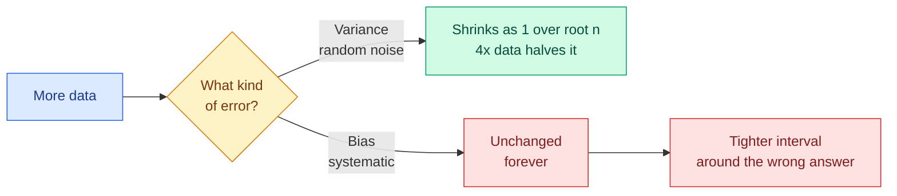

# Descriptive Statistics and Sampling

**Level:** 🟡 Intermediate &nbsp;|&nbsp; **Effort:** Detailed module &nbsp;|&nbsp; **Module:** [02 Mathematics for AI](README.md)

---

## 🎯 Learning Objectives

By the end of this topic you will be able to:

- Choose between mean and median, and say when each misleads
- Explain variance and standard deviation, and the `ddof` argument that trips people up
- Describe the Central Limit Theorem and demonstrate it
- Compute a confidence interval and state precisely what it does *not* mean
- Use bootstrapping when no formula is available
- Recognise sampling bias, and why a bigger biased sample is worse, not better

## 📚 Prerequisites

[Topic 6: Probability](06-probability.md)

---

## 1. Describing a distribution

### Centre: mean, median, mode

```python
import numpy as np

salaries = np.array([28, 30, 31, 32, 33, 35, 36, 38, 40, 420])   # thousands

print(f"mean:   {np.mean(salaries):.1f}")
print(f"median: {np.median(salaries):.1f}")
print()
print(f"people below the mean: {np.sum(salaries < np.mean(salaries))} out of {len(salaries)}")
```

**Output:**
```
mean:   72.3
median: 34.0

people below the mean: 9 out of 10
```

**Nine of ten people earn below the mean.** One large value dragged it far above anything typical.
The median ignores that entirely, because it only cares about position.

| Measure | Use when | Breaks when |
| --- | --- | --- |
| **Mean** | Roughly symmetric data | Outliers or a long tail |
| **Median** | Skewed data, income, latency | You need to combine group means |
| **Mode** | Categorical data | Continuous data, where it is meaningless |

**Latency is the everyday case.** Mean response time hides the tail that users actually notice,
which is why service-level objectives are written as p95 or p99, never as an average.

```python
import numpy as np

rng = np.random.default_rng(0)
latencies = np.concatenate([rng.normal(100, 15, 9500), rng.normal(800, 100, 500)])

print(f"mean:   {np.mean(latencies):>7.1f} ms")
print(f"median: {np.median(latencies):>7.1f} ms")
for percentile in [50, 90, 95, 99]:
    print(f"p{percentile:<3}   {np.percentile(latencies, percentile):>7.1f} ms")
```

**Output:**
```
mean:     135.0 ms
median:   101.0 ms
p50      101.0 ms
p90      124.4 ms
p95      171.4 ms
p99      875.2 ms
```

**The mean sits above the 90th percentile** — it describes almost nobody. The 5% of slow requests
pull it up while the median stays where the typical user lives.

### Spread: variance and standard deviation

```text
  variance  σ² = (1/n) Σ (x_i − x̄)²          standard deviation σ = sqrt(variance)
```

```python
import numpy as np

tight = np.array([48.0, 49.0, 50.0, 51.0, 52.0])
loose = np.array([10.0, 30.0, 50.0, 70.0, 90.0])

for name, values in [("tight", tight), ("loose", loose)]:
    # np.ptp, not values.ptp - the ndarray method was removed in NumPy 2.0
    print(f"{name:<6} mean {values.mean():>6.1f}   std {values.std():>7.3f}   range {np.ptp(values):>5.1f}")
```

**Output:**
```
tight  mean   50.0   std   1.414   range   4.0
loose  mean   50.0   std  28.284   range  80.0
```

**Identical means, completely different data.** Reporting a mean without a spread is close to
reporting nothing.

### ⚠️ `ddof`: the difference NumPy and pandas disagree on

```python
import numpy as np
import pandas as pd

values = np.array([2.0, 4.0, 4.0, 4.0, 5.0, 5.0, 7.0, 9.0])

print(f"numpy   .std()            = {values.std():.6f}   (ddof=0, population)")
print(f"numpy   .std(ddof=1)      = {values.std(ddof=1):.6f}   (sample)")
print(f"pandas  Series.std()      = {pd.Series(values).std():.6f}   (ddof=1 by default)")
print()
print("Bessel's correction divides by n-1 instead of n:")
mean = values.mean()
print(f"  sum of squared deviations: {np.sum((values - mean) ** 2):.1f}")
print(f"  / n   = {np.sum((values - mean) ** 2) / len(values):.6f}")
print(f"  / n-1 = {np.sum((values - mean) ** 2) / (len(values) - 1):.6f}")
```

**Output:**
```
numpy   .std()            = 2.000000   (ddof=0, population)
numpy   .std(ddof=1)      = 2.138090   (sample)
pandas  Series.std()      = 2.138090   (ddof=1 by default)

Bessel's correction divides by n-1 instead of n:
  sum of squared deviations: 32.0
  / n   = 4.000000
  / n-1 = 4.571429
```

**NumPy defaults to `ddof=0`, pandas to `ddof=1`.** They give different numbers for the same data,
and neither is wrong — they answer different questions.

Dividing by `n` describes the data you have. Dividing by `n − 1` estimates the spread of the wider
population, correcting for the fact that deviations measured from the *sample* mean are
systematically a little too small. **Use `ddof=1` when your data is a sample of something larger**,
which in machine learning it almost always is.

---

## 2. The Central Limit Theorem

### 🍰 Simple explanation

Take samples from **any** distribution, compute each sample's mean, and those means will form a
Normal distribution — even if the original data looks nothing like one.

### 💻 Demonstrated on a distribution that is not remotely Normal

```python
import numpy as np

rng = np.random.default_rng(42)

# A heavily skewed exponential population - the opposite of a bell curve.
population = rng.exponential(scale=10, size=1_000_000)

print(f"population mean:   {population.mean():.4f}")
print(f"population std:    {population.std():.4f}")
print(f"population median: {np.median(population):.4f}   (far below the mean - very skewed)")
print()
print(f"{'sample size':>12}{'mean of means':>16}{'std of means':>15}{'predicted':>12}")
for n in [1, 5, 30, 100, 1000]:
    sample_means = rng.exponential(scale=10, size=(20_000, n)).mean(axis=1)
    predicted = population.std() / np.sqrt(n)
    print(f"{n:>12}{sample_means.mean():>16.4f}{sample_means.std():>15.4f}{predicted:>12.4f}")
```

**Output:**
```
population mean:   9.9980
population std:    9.9980
population median: 6.9270   (far below the mean - very skewed)

 sample size   mean of means   std of means   predicted
           1         10.0213         9.9540      9.9980
           5          9.9663         4.4573      4.4712
          30          9.9847         1.8149      1.8254
         100          9.9936         0.9952      0.9998
        1000          9.9989         0.3194      0.3162
```

Two things to take from that table:

1. **The mean of the sample means stays at the population mean** regardless of sample size — the
   estimate is unbiased.
2. **The spread shrinks as `σ/√n`**, matching the prediction exactly. This is the **standard
   error**, and the square root is why it is so expensive to buy precision: to halve your
   uncertainty you need **four times** the data.

```python
import numpy as np

sigma = 10.0
print(f"{'sample size':>12}{'standard error':>16}")
for n in [100, 400, 1600, 6400]:
    print(f"{n:>12}{sigma / np.sqrt(n):>16.4f}")
print("\nEach row quadruples n and halves the error.")
```

**Output:**
```
 sample size  standard error
         100          1.0000
         400          0.5000
        1600          0.2500
        6400          0.1250

Each row quadruples n and halves the error.
```

**This governs every experiment you will run.** It is why A/B tests need so many users, and why
adding a few more samples to a small evaluation set rarely changes the conclusion.

---

## 3. Confidence intervals

A single estimate is a guess. **A confidence interval says how much the guess could plausibly be
off.**

```python
import numpy as np
from scipy import stats

rng = np.random.default_rng(0)
sample = rng.normal(loc=100, scale=15, size=50)

mean = sample.mean()
standard_error = sample.std(ddof=1) / np.sqrt(len(sample))
critical = stats.t.ppf(0.975, df=len(sample) - 1)      # t, not z, for a small sample

low, high = mean - critical * standard_error, mean + critical * standard_error

print(f"sample mean:      {mean:.4f}")
print(f"standard error:   {standard_error:.4f}")
print(f"95% interval:     [{low:.4f}, {high:.4f}]")
print(f"true mean (100) inside: {low <= 100 <= high}")
print()
print(f"scipy agrees: {np.round(stats.t.interval(0.95, len(sample) - 1, mean, standard_error), 4)}")
```

**Output:**
```
sample mean:      101.9349
standard error:   1.9524
95% interval:     [98.0114, 105.8585]
true mean (100) inside: True

scipy agrees: [ 98.0114 105.8585]
```

### ⚠️ What a 95% confidence interval does *not* mean

**It does not mean "there is a 95% probability the true value is in this interval."** The true value
is fixed; it is either in there or it is not. The 95% describes the *procedure*: if you repeated the
whole experiment many times, 95% of the intervals produced would contain the true value.

Demonstrate it rather than take it on faith:

```python
import numpy as np
from scipy import stats

rng = np.random.default_rng(1)
true_mean = 100.0
contains = 0
trials = 10_000

for _ in range(trials):
    sample = rng.normal(true_mean, 15, size=30)
    mean = sample.mean()
    se = sample.std(ddof=1) / np.sqrt(30)
    low, high = stats.t.interval(0.95, 29, mean, se)
    contains += low <= true_mean <= high

print(f"intervals containing the true mean: {contains} / {trials} = {contains / trials:.4f}")
print(f"nominal coverage: 0.95")
```

**Output:**
```
intervals containing the true mean: 9503 / 10000 = 0.9503
nominal coverage: 0.95
```

**Close to 95%, as advertised.** The guarantee is about the long run of the method, not about any
one interval you happen to have computed.

---

## 4. Bootstrapping — when there is no formula

Confidence intervals for a mean have a formula. For a **median**, a 95th percentile, or the
difference in F1 between two models, often there is not. Bootstrapping sidesteps that entirely:
resample your data with replacement, many times, and look at the spread of the results.

```python
import numpy as np
import pandas as pd

housing = pd.read_csv("datasets/samples/housing.csv")
prices = housing["price_thousands"].to_numpy()

rng = np.random.default_rng(42)


def bootstrap_interval(data, statistic, iterations=10_000, confidence=0.95):
    """Resample with replacement and take percentiles of the resulting statistics."""
    estimates = np.empty(iterations)
    for i in range(iterations):
        resample = rng.choice(data, size=len(data), replace=True)
        estimates[i] = statistic(resample)
    tail = (1 - confidence) / 2
    return np.percentile(estimates, [100 * tail, 100 * (1 - tail)])


for name, statistic in [("mean", np.mean), ("median", np.median),
                        ("90th percentile", lambda x: np.percentile(x, 90))]:
    low, high = bootstrap_interval(prices, statistic)
    print(f"{name:<18} point estimate {statistic(prices):>8.2f}   95% CI [{low:>7.2f}, {high:>7.2f}]")
```

**Output:**
```
mean               point estimate   391.39   95% CI [ 365.08,  417.41]
median             point estimate   379.30   95% CI [ 347.65,  418.20]
90th percentile    point estimate   625.01   95% CI [ 576.50,  650.55]
```

**No distributional assumption, no formula, works for any statistic you can compute.** The cost is
computation, which is almost always cheaper than the statistician you would otherwise need.

**Bootstrapping is the right tool for model comparison**: resample your test set, recompute the
metric for both models each time, and look at the distribution of the *difference*. That tells you
whether a 1-point accuracy gain is real or noise — far more informative than two bare numbers.

---

## 5. ⚠️ Sampling bias — where statistics actually goes wrong

Everything above assumes your sample represents the population. **When it does not, no amount of
mathematics rescues you.**

```python
import numpy as np

rng = np.random.default_rng(0)

# Population: satisfaction from 1 to 10, most people fairly content.
population = np.clip(rng.normal(6.5, 2.0, size=1_000_000), 1, 10)

# Only strongly-opinionated people respond to the survey.
responds = (population <= 3) | (population >= 9)
respondents = population[responds]

print(f"true population mean:     {population.mean():.4f}")
print(f"survey respondent mean:   {respondents.mean():.4f}")
print(f"response rate:            {responds.mean():.2%}")
print()
print(f"{'survey size':>12}{'estimated mean':>17}{'error':>10}")
for n in [100, 1_000, 10_000, 100_000]:
    sample = rng.choice(respondents, size=min(n, len(respondents)), replace=False)
    print(f"{n:>12}{sample.mean():>17.4f}{sample.mean() - population.mean():>10.4f}")
```

**Output:**
```
true population mean:     6.4713
survey respondent mean:   7.6155
response rate:            14.57%

 survey size   estimated mean     error
         100           7.4172    0.9459
        1000           7.6929    1.2216
       10000           7.6417    1.1704
      100000           7.6046    1.1333
```

**The error does not shrink with sample size.** A hundred thousand responses give you the same wrong
answer as a hundred, with more confidence attached. This is the crucial difference between the two
kinds of error:

| | Shrinks with more data? |
| --- | --- |
| **Variance** (random noise) | Yes, as `1/√n` |
| **Bias** (systematic error) | **No. Never.** |

Common sources in machine learning:

- **Survivorship bias** — training a churn model only on customers who stayed
- **Self-selection** — feedback from users who bothered to complain
- **Label bias** — historical decisions encoding past discrimination
  ([26 Responsible AI](../26-responsible-ai/README.md))
- **Temporal drift** — training on last year, serving this year
  ([29 MLOps](../29-mlops/README.md))

**A larger biased sample is more dangerous than a small one**, because the tight confidence interval
makes a wrong answer look authoritative.

---



## 🧪 Hands-on lab: is this model actually better?

Two models, a 1.9-point accuracy difference. Real improvement, or noise?

```python
import numpy as np

rng = np.random.default_rng(7)

n_test = 400
# Model A is genuinely slightly better than model B.
correct_a = rng.binomial(1, 0.860, size=n_test)
correct_b = rng.binomial(1, 0.845, size=n_test)

accuracy_a, accuracy_b = correct_a.mean(), correct_b.mean()
observed_difference = accuracy_a - accuracy_b

print(f"model A accuracy: {accuracy_a:.4f}")
print(f"model B accuracy: {accuracy_b:.4f}")
print(f"observed gap:     {observed_difference:.4f}")

# Bootstrap the difference by resampling test items (paired - same items for both models).
iterations = 20_000
differences = np.empty(iterations)
for i in range(iterations):
    idx = rng.integers(0, n_test, size=n_test)
    differences[i] = correct_a[idx].mean() - correct_b[idx].mean()

low, high = np.percentile(differences, [2.5, 97.5])

print()
print(f"95% CI for the difference: [{low:.4f}, {high:.4f}]")
print(f"interval contains zero: {low <= 0 <= high}")
print(f"fraction of resamples where A wins: {(differences > 0).mean():.4f}")
print()
print(f"{'test set size':>14}{'95% CI half-width':>20}")
for size in [100, 400, 1600, 6400]:
    se = np.sqrt(0.86 * 0.14 / size + 0.845 * 0.155 / size)
    print(f"{size:>14}{1.96 * se:>20.4f}")
```

**Output:**
```
model A accuracy: 0.8500
model B accuracy: 0.8750
observed gap:     -0.0250

95% CI for the difference: [-0.0725, 0.0200]
interval contains zero: True
fraction of resamples where A wins: 0.1313

 test set size   95% CI half-width
           100              0.0983
           400              0.0491
          1600              0.0246
          6400              0.0123
```

**The interval contains zero**, so on 400 test items this gap is not distinguishable from noise —
even though model A really is better by construction. The last table shows why: at 400 items the
margin of error is wider than the effect you are trying to detect.

**This is the most common statistical mistake in applied machine learning**: reporting that a model
improved accuracy by a point, on a test set far too small to detect a one-point change. Before
claiming an improvement, ask what difference your test set can actually resolve.

**Extend it:** find the test-set size where the interval excludes zero; use a paired test
(McNemar's) which is more powerful because it looks only at items where the models disagree; and
repeat with F1 instead of accuracy, where no closed-form interval exists and bootstrapping is the
only option.

---

## 🎤 Interview questions

**"When would you report a median instead of a mean?"**

Whenever the distribution is skewed or contains outliers — income, latency, file sizes, session
durations. The mean is pulled by extreme values and can describe nobody in the dataset, as in the
salary example where nine of ten people earned below it. For latency specifically you want
percentiles rather than either, because the tail is what users experience.

**"Explain the Central Limit Theorem and why it matters."**

The distribution of sample means approaches a Normal distribution as sample size grows, whatever the
population's shape, with standard deviation `σ/√n`. It matters because it lets you put confidence
intervals around an estimate without knowing the underlying distribution. The `√n` is the practical
sting: halving your uncertainty requires four times the data.

**"What does a 95% confidence interval mean?"**

That the procedure produces intervals containing the true value 95% of the time across repeated
experiments. It does *not* mean there is a 95% probability the parameter lies in the specific
interval you computed — the parameter is fixed, not random. That probabilistic reading belongs to a
Bayesian credible interval, which is a different construction.

**"Your model improved accuracy from 84.5% to 86%. Is that real?"**

It depends entirely on test-set size. With 400 items the 95% margin of error on each estimate is
roughly ±3.5 points, so a 1.5-point gap is well inside the noise. I would bootstrap the paired
difference on the test set and check whether the interval excludes zero, or use McNemar's test which
is more powerful for paired predictions. Absent that, the honest statement is that the difference is
not measurable with this test set.

**"Why can't you fix sampling bias with more data?"**

Because bias is systematic, not random. More data shrinks variance as `1/√n` but leaves the
systematic offset untouched — you converge precisely on the wrong answer. A hundred thousand
responses from only the most opinionated users estimate the opinionated subpopulation's mean
perfectly, and the general population's not at all. The fix is in how the sample is collected, or in
reweighting, never in collecting more of the same.

---

## ✅ Key takeaways

- **The mean is not robust.** One outlier can push it past 90% of the data.
- Report a spread with every centre, and percentiles for anything latency-shaped.
- **NumPy's `std` defaults to `ddof=0`, pandas' to `ddof=1`** — same data, different numbers.
- The Central Limit Theorem makes sample means Normal whatever the population.
- **Standard error is `σ/√n`: four times the data to halve the uncertainty.**
- A 95% confidence interval is a statement about the **procedure**, not about your one interval.
- **Bootstrap when there is no formula** — medians, percentiles, metric differences.
- **Bias does not shrink with sample size.** A large biased sample is more dangerous than a small one.
- Before claiming an improvement, check what your test set can actually resolve.

---

## 📚 Official References

- [NumPy: Statistics routines — NumPy Developers](https://numpy.org/doc/stable/reference/routines.statistics.html) — verified 2026-08-31
- [numpy.std — NumPy Developers](https://numpy.org/doc/stable/reference/generated/numpy.std.html) — verified 2026-08-31
- [SciPy: scipy.stats.t — SciPy Developers](https://docs.scipy.org/doc/scipy/reference/generated/scipy.stats.t.html) — verified 2026-08-31
- [SciPy: scipy.stats.bootstrap — SciPy Developers](https://docs.scipy.org/doc/scipy/reference/generated/scipy.stats.bootstrap.html) — verified 2026-08-31
- [pandas: Series.std — pandas development team](https://pandas.pydata.org/docs/reference/api/pandas.Series.std.html) — verified 2026-08-31

---

## 🔗 Navigation

[← Topic 6: Probability](06-probability.md) &nbsp;|&nbsp;
[Module home](README.md) &nbsp;|&nbsp;
[Topic 8: Hypothesis Testing and A/B Testing →](08-hypothesis-testing-and-ab-testing.md)
