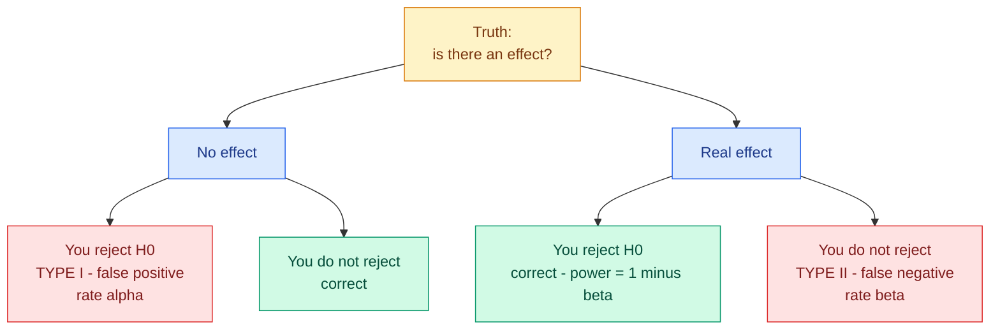

# Hypothesis Testing and A/B Testing

**Level:** 🟡 Intermediate &nbsp;|&nbsp; **Effort:** Detailed module &nbsp;|&nbsp; **Module:** [02 Mathematics for AI](README.md)

---

## 🎯 Learning Objectives

By the end of this topic you will be able to:

- State a null hypothesis and say what a p-value does and does not mean
- Choose an appropriate test, and run it with SciPy
- Distinguish Type I from Type II errors, and connect them to precision and recall
- Report an effect size, and explain why significance alone is not enough
- Compute the sample size an A/B test needs **before** running it
- Recognise p-hacking, peeking and the multiple-comparisons problem

## 📚 Prerequisites

[Topic 7: Descriptive Statistics and Sampling](07-descriptive-statistics-and-sampling.md)

---

## 1. The question hypothesis testing answers

You changed something and a number moved. **Would a number like that have moved anyway?**

| Term | Meaning |
| --- | --- |
| **Null hypothesis (H₀)** | The boring explanation: nothing changed, this is noise |
| **Alternative (H₁)** | Something really did change |
| **p-value** | If H₀ were true, how often would you see a result this extreme? |
| **α (alpha)** | The threshold you set in advance, conventionally 0.05 |

**You never "prove" the alternative.** You either reject the null or fail to reject it, which is not
the same as accepting it.

---

## 2. What a p-value actually is

The cleanest way to understand it is to generate data where the null is **true by construction**,
and watch what p-values do.

```python
import numpy as np
from scipy import stats

rng = np.random.default_rng(0)

# Both groups drawn from the SAME distribution - there is genuinely no effect.
p_values = []
for _ in range(4_000):
    a = rng.normal(100, 15, size=50)
    b = rng.normal(100, 15, size=50)
    p_values.append(stats.ttest_ind(a, b).pvalue)

p_values = np.array(p_values)

print(f"experiments run: {len(p_values)}")
print(f"p < 0.05: {np.mean(p_values < 0.05):.4f}   <- 'significant' results with NO real effect")
print(f"p < 0.01: {np.mean(p_values < 0.01):.4f}")
print()
print("p-values under a true null are uniform:")
for low, high in [(0.0, 0.2), (0.2, 0.4), (0.4, 0.6), (0.6, 0.8), (0.8, 1.0)]:
    print(f"  {low:.1f} to {high:.1f}: {np.mean((p_values >= low) & (p_values < high)):.4f}")
```

**Output:**
```
experiments run: 4000
p < 0.05: 0.0490   <- 'significant' results with NO real effect
p < 0.01: 0.0075

p-values under a true null are uniform:
  0.0 to 0.2: 0.1955
  0.2 to 0.4: 0.2018
  0.4 to 0.6: 0.1943
  0.6 to 0.8: 0.2075
  0.8 to 1.0: 0.2010
```

**Two things worth internalising.**

When there is no effect at all, **5% of experiments still produce p < 0.05.** That is not a flaw —
it is the definition of α. Run twenty honest experiments on nothing and expect one "discovery".

And under a true null, p-values are **uniformly distributed**: 0.03 is exactly as likely as 0.93.
A p-value is not a measure of how wrong the null is.

### ⚠️ What a p-value is not

| It does **not** mean | Why |
| --- | --- |
| "The probability the null is true" | It is computed *assuming* the null; it cannot also evaluate it |
| "The probability the result is a fluke" | Same confusion, restated |
| "The effect is large" | With enough data, a trivial effect gets a tiny p-value |
| "p = 0.06 means no effect" | 0.05 is a convention, not a law of nature |

**The single most common misreading**: p is `P(data | H₀)`, not `P(H₀ | data)`. Swapping those is
the base-rate error from [Topic 6](06-probability.md) in another costume.

---

## 3. Choosing a test

| Question | Test | SciPy |
| --- | --- | --- |
| Two independent group means | Independent t-test | `stats.ttest_ind` |
| Before and after, same subjects | Paired t-test | `stats.ttest_rel` |
| Two conversion rates | Chi-squared or two-proportion z | `stats.chi2_contingency` |
| Two distributions of any shape | Mann-Whitney U | `stats.mannwhitneyu` |
| Three or more group means | ANOVA | `stats.f_oneway` |
| Two paired classifiers | McNemar's | `statsmodels` |

```python
import numpy as np
from scipy import stats

rng = np.random.default_rng(42)

control = rng.normal(100, 15, size=200)
treatment = rng.normal(105, 15, size=200)          # a real 5-point effect

result = stats.ttest_ind(control, treatment)

print(f"control mean:   {control.mean():.4f}")
print(f"treatment mean: {treatment.mean():.4f}")
print(f"difference:     {treatment.mean() - control.mean():.4f}")
print()
print(f"t-statistic: {result.statistic:.4f}")
print(f"p-value:     {result.pvalue:.6f}")
print(f"reject the null at 0.05: {result.pvalue < 0.05}")
```

**Output:**
```
control mean:   99.5432
treatment mean: 105.3012
difference:     5.7579

t-statistic: -4.0271
p-value:     0.000068
reject the null at 0.05: True
```

### ⚠️ The paired test is more powerful — use it when the data is paired

```python
import numpy as np
from scipy import stats

rng = np.random.default_rng(1)

# 40 users, each measured before and after. People differ hugely from each other,
# but the change within each person is a consistent +2.
baseline = rng.normal(100, 25, size=40)
after = baseline + rng.normal(2, 3, size=40)

independent = stats.ttest_ind(baseline, after)
paired = stats.ttest_rel(baseline, after)

print(f"mean change: {(after - baseline).mean():.4f}")
print()
print(f"independent t-test p-value: {independent.pvalue:.4f}   significant: {independent.pvalue < 0.05}")
print(f"paired t-test p-value:      {paired.pvalue:.6f}   significant: {paired.pvalue < 0.05}")
```

**Output:**
```
mean change: 1.5621

independent t-test p-value: 0.7698   significant: False
paired t-test p-value:      0.000074   significant: True
```

**Same data, opposite conclusions.** The independent test drowns the real effect in the huge
between-person variation. The paired test looks only at each person's *change*, cancelling that
variation entirely. **Using an unpaired test on paired data throws away most of your power** — and
it is the usual reason a real effect fails to reach significance.

---

## 4. Type I and Type II errors

|  | H₀ true (no effect) | H₀ false (real effect) |
| --- | --- | --- |
| **Reject H₀** | **Type I error** (α) — false positive | Correct |
| **Fail to reject** | Correct | **Type II error** (β) — false negative |

**Power = 1 − β**: the probability of detecting an effect that genuinely exists. The convention is
80%, which means **one in five real effects is missed even in a well-designed study**.

```python
import numpy as np
from scipy import stats

rng = np.random.default_rng(0)


def power(effect, n, trials=600, sigma=15.0):
    """Fraction of experiments that detect a real effect of this size."""
    detected = 0
    for _ in range(trials):
        a = rng.normal(100, sigma, size=n)
        b = rng.normal(100 + effect, sigma, size=n)
        detected += stats.ttest_ind(a, b).pvalue < 0.05
    return detected / trials


print(f"{'effect':>8}{'n=50':>10}{'n=200':>10}{'n=800':>10}")
for effect in [1.0, 3.0, 5.0, 10.0]:
    row = "".join(f"{power(effect, n):>10.3f}" for n in [50, 200, 800])
    print(f"{effect:>8.1f}{row}")
```

**Output:**
```
  effect      n=50     n=200     n=800
     1.0     0.070     0.133     0.275
     3.0     0.167     0.512     0.988
     5.0     0.390     0.903     1.000
    10.0     0.908     1.000     1.000
```

**Read the top-left corner.** A real 1-point effect with 50 samples per group is detected about 7%
of the time — so 93% of the time you would conclude "no effect" about something real. A
non-significant result from an underpowered study says almost nothing.

**This connects directly to model evaluation.** Type I error is a false positive, Type II is a false
negative, and choosing α is choosing a precision/recall trade-off
([07 Model Evaluation](../07-model-evaluation/README.md)).

---



## 5. Effect size — significance is not importance

```python
import numpy as np
from scipy import stats


def cohens_d(a, b):
    """Standardised difference between two means. Unitless, so comparable across studies."""
    pooled_std = np.sqrt(((len(a) - 1) * a.std(ddof=1) ** 2 + (len(b) - 1) * b.std(ddof=1) ** 2)
                         / (len(a) + len(b) - 2))
    return (b.mean() - a.mean()) / pooled_std


rng = np.random.default_rng(3)

print(f"{'n per group':>13}{'difference':>13}{'p-value':>12}{'Cohen d':>10}{'significant':>13}")
for n in [50, 500, 5_000, 50_000, 500_000]:
    a = rng.normal(100, 15, size=n)
    b = rng.normal(100.3, 15, size=n)          # a real but trivial 0.3-point effect
    p = stats.ttest_ind(a, b).pvalue
    print(f"{n:>13}{b.mean() - a.mean():>13.4f}{p:>12.6f}{cohens_d(a, b):>10.4f}"
          f"{str(p < 0.05):>13}")
```

**Output:**
```
  n per group   difference     p-value   Cohen d  significant
           50      -2.2990    0.477040   -0.1428        False
          500      -1.1045    0.240013   -0.0744        False
         5000       0.3266    0.278080    0.0217        False
        50000       0.1385    0.143222    0.0093        False
       500000       0.2921    0.000000    0.0195         True
```

**Follow the last column down.** The same trivial 0.3-point effect is invisible at every small
sample size and then becomes significant once the sample is large enough — and it is *still* 0.3
points. Cohen's d stays around 0.02 throughout, which is negligible by any standard.

Note also how erratic the observed differences are at small n: at 50 per group the measured
difference has the wrong sign entirely. Small samples do not merely fail to detect small effects,
they report them backwards.

| Cohen's d | Conventionally |
| --- | --- |
| 0.2 | Small |
| 0.5 | Medium |
| 0.8 | Large |

**"Statistically significant" means "probably not zero", not "worth acting on".** With enough
traffic, any difference at all becomes significant. Always report the effect size and a confidence
interval alongside the p-value, and decide using the effect, not the p.

---

## 6. 🧪 Hands-on lab: an A/B test done properly

### Step 1 — sample size, computed *before* running

```python
import numpy as np
from scipy import stats


def required_sample_size(baseline_rate, minimum_detectable_effect, alpha=0.05, power=0.8):
    """Users needed per variant for a two-sided two-proportion test."""
    treatment_rate = baseline_rate + minimum_detectable_effect
    z_alpha = stats.norm.ppf(1 - alpha / 2)
    z_power = stats.norm.ppf(power)
    pooled = (baseline_rate + treatment_rate) / 2
    numerator = (z_alpha * np.sqrt(2 * pooled * (1 - pooled))
                 + z_power * np.sqrt(baseline_rate * (1 - baseline_rate)
                                     + treatment_rate * (1 - treatment_rate))) ** 2
    return int(np.ceil(numerator / minimum_detectable_effect ** 2))


print(f"baseline conversion 5%, 80% power, alpha 0.05\n")
print(f"{'effect to detect':>18}{'relative':>11}{'users per variant':>20}")
for effect in [0.05, 0.02, 0.01, 0.005, 0.002]:
    n = required_sample_size(0.05, effect)
    print(f"{effect:>18.3f}{effect / 0.05:>10.0%}{n:>20,}")
```

**Output:**
```
baseline conversion 5%, 80% power, alpha 0.05

  effect to detect   relative   users per variant
             0.050      100%                 435
             0.020       40%               2,213
             0.010       20%               8,158
             0.005       10%              31,234
             0.002        4%             189,938
```

**This table decides whether the experiment is worth running at all.** Detecting a 10% relative
improvement needs tens of thousands of users per variant; a 4% relative improvement needs hundreds
of thousands. If you do not have that traffic, running the test produces a coin flip dressed as
evidence, and the honest response is to redesign the experiment rather than run it.

### Step 2 — run it, and report more than a p-value

```python
import numpy as np
from scipy import stats

rng = np.random.default_rng(2026)

n_per_variant = 20_000
control_rate, treatment_rate = 0.050, 0.056        # a real 12% relative lift

control = rng.binomial(1, control_rate, size=n_per_variant)
treatment = rng.binomial(1, treatment_rate, size=n_per_variant)

c_conv, t_conv = control.mean(), treatment.mean()

table = np.array([[control.sum(), len(control) - control.sum()],
                  [treatment.sum(), len(treatment) - treatment.sum()]])
chi2, p_value, _, _ = stats.chi2_contingency(table)

# Confidence interval for the difference in proportions
se = np.sqrt(c_conv * (1 - c_conv) / n_per_variant + t_conv * (1 - t_conv) / n_per_variant)
difference = t_conv - c_conv
low, high = difference - 1.96 * se, difference + 1.96 * se

print(f"control:   {control.sum():>6,} conversions / {n_per_variant:,} = {c_conv:.4f}")
print(f"treatment: {treatment.sum():>6,} conversions / {n_per_variant:,} = {t_conv:.4f}")
print()
print(f"absolute difference: {difference:+.4f}")
print(f"relative lift:       {difference / c_conv:+.2%}")
print(f"95% CI (absolute):   [{low:+.4f}, {high:+.4f}]")
print(f"p-value:             {p_value:.6f}")
print(f"significant at 0.05: {p_value < 0.05}")
print()
print(f"CI excludes zero: {not (low <= 0 <= high)}")
print(f"worst case in the interval: {low / c_conv:+.2%} relative")
print(f"best case in the interval:  {high / c_conv:+.2%} relative")
```

**Output:**
```
control:    1,023 conversions / 20,000 = 0.0512
treatment:  1,067 conversions / 20,000 = 0.0534

absolute difference: +0.0022
relative lift:       +4.30%
95% CI (absolute):   [-0.0022, +0.0066]
p-value:             0.333965
significant at 0.05: False

CI excludes zero: False
worst case in the interval: -4.23% relative
best case in the interval:  +12.83% relative
```

**This test failed to detect a real effect, and step 1 predicted it would.**

The lift is genuine — the simulation was built with a 12% relative improvement. But the observed
difference is +4.3%, the confidence interval runs from −4.2% to +12.8%, and the p-value is 0.33.
On these results the honest conclusion is "we cannot tell", and a team that shipped on the point
estimate would be shipping on noise.

**Look back at the sample-size table.** Detecting a 10% relative lift on a 5% baseline needs
**31,234 users per variant**. This test used 20,000. It was underpowered before a single user saw
it, and no amount of careful analysis afterwards recovers that.

Run it at the size step 1 asked for and the picture changes:

```python
import numpy as np
from scipy import stats

rng = np.random.default_rng(2026)

for n in [20_000, 40_000, 120_000]:
    control = rng.binomial(1, 0.050, size=n)
    treatment = rng.binomial(1, 0.056, size=n)
    c, tr = control.mean(), treatment.mean()
    se = np.sqrt(c * (1 - c) / n + tr * (1 - tr) / n)
    difference = tr - c
    low, high = difference - 1.96 * se, difference + 1.96 * se
    table = np.array([[control.sum(), n - control.sum()],
                      [treatment.sum(), n - treatment.sum()]])
    p_value = stats.chi2_contingency(table)[1]
    print(f"n={n:>7,}  lift {difference / c:>+7.2%}  "
          f"CI [{low / c:>+7.2%}, {high / c:>+7.2%}]  p={p_value:.4f}  "
          f"{'DETECTED' if p_value < 0.05 else 'not detected'}")
```

**Output:**
```
n= 20,000  lift  +4.30%  CI [ -4.23%, +12.83%]  p=0.3340  not detected
n= 40,000  lift +11.78%  CI [ +5.59%, +17.97%]  p=0.0002  DETECTED
n=120,000  lift +12.77%  CI [ +9.16%, +16.38%]  p=0.0000  DETECTED
```

At 40,000 per variant the effect is detected cleanly, and at 120,000 the interval tightens around
the true 12%. **The extra users bought precision, not luck.**

**Report the interval, not just the verdict.** "A 12% lift, somewhere between 6% and 18%" is an
honest summary a decision-maker can act on. "p = 0.03" is not, and "+4.3%" from an underpowered test
is worse than useless — it invites a decision the data does not support.

### ⚠️ Step 3 — the mistakes that invalidate the whole thing

**Peeking.** Checking significance repeatedly and stopping when it appears inflates the false
positive rate far above 5%:

```python
import numpy as np
from scipy import stats

rng = np.random.default_rng(11)


def experiment_with_peeking(peeks, n_total=4000):
    """A/A test - NO real effect. Stop early the first time p < 0.05."""
    a = rng.normal(0, 1, size=n_total)
    b = rng.normal(0, 1, size=n_total)
    checkpoints = np.linspace(n_total // peeks, n_total, peeks).astype(int)
    for n in checkpoints:
        if stats.ttest_ind(a[:n], b[:n]).pvalue < 0.05:
            return True
    return False


print(f"{'peeks':>7}{'false positive rate':>22}")
for peeks in [1, 2, 5, 10, 20]:
    rate = np.mean([experiment_with_peeking(peeks) for _ in range(1200)])
    print(f"{peeks:>7}{rate:>22.4f}")
```

**Output:**
```
  peeks   false positive rate
      1                0.0442
      2                0.0933
      5                0.1342
     10                0.1850
     20                0.2533
```

**There is no real effect in any of those runs.** With one look you get the promised 5%. Peeking
twenty times, you "find" an effect roughly a quarter of the time. **Fix the sample size in advance
and look once**, or use a sequential testing method designed for repeated looks.

**Multiple comparisons.** Testing twenty metrics at α = 0.05 gives you about a 64% chance of at
least one false positive:

```python
alpha = 0.05
for n_tests in [1, 5, 10, 20, 50]:
    family_wise = 1 - (1 - alpha) ** n_tests
    bonferroni = alpha / n_tests
    print(f"{n_tests:>3} tests: P(at least one false positive) = {family_wise:.4f}   "
          f"Bonferroni-corrected alpha = {bonferroni:.4f}")
```

**Output:**
```
  1 tests: P(at least one false positive) = 0.0500   Bonferroni-corrected alpha = 0.0500
  5 tests: P(at least one false positive) = 0.2262   Bonferroni-corrected alpha = 0.0100
 10 tests: P(at least one false positive) = 0.4013   Bonferroni-corrected alpha = 0.0050
 20 tests: P(at least one false positive) = 0.6415   Bonferroni-corrected alpha = 0.0025
 50 tests: P(at least one false positive) = 0.9231   Bonferroni-corrected alpha = 0.0010
```

Decide your **primary** metric before the experiment. Everything else is exploratory and must be
labelled as such.

**Other invalidators:** stopping early because the result looks good; changing the variant mid-test;
ignoring novelty effects in the first days; and comparing groups that were never randomised
comparably.

**Extend the lab:** implement a sequential test with alpha spending; add a guardrail metric that
must *not* degrade; and compute how long the test must run given your daily traffic.

---

## 🎤 Interview questions

**"What is a p-value?"**

The probability of observing data at least as extreme as yours, *assuming the null hypothesis is
true*. It is `P(data | H₀)`, not `P(H₀ | data)` — it cannot tell you the probability that the null
is true, because it was computed by assuming it. Under a true null, p-values are uniformly
distributed, so 5% of no-effect experiments produce p < 0.05 by construction.

**"A result is significant with p = 0.001. Should you ship it?"**

Not on that basis alone. Significance says the effect is probably not zero; it says nothing about
size. With a large sample a 0.1% improvement reaches p = 0.001 while being commercially worthless. I
would look at the effect size and its confidence interval, weigh the implementation and maintenance
cost, and check guardrail metrics did not degrade. Statistical significance is an input to the
decision, not the decision.

**"Why is peeking at an A/B test a problem?"**

Each look is another chance to cross the threshold, so the false-positive rate compounds far beyond
the nominal α — twenty looks takes 5% to roughly 25%. Stopping the moment you see significance
guarantees you stop on favourable noise. Either fix the sample size in advance and analyse once, or
use a sequential design with alpha spending that accounts for repeated looks.

**"How do you determine how long to run a test?"**

Compute the required sample size before starting, from the baseline rate, the smallest effect worth
detecting, α and the desired power, then divide by daily traffic. The minimum detectable effect is a
business decision, not a statistical one: if a 1% relative lift is not worth acting on, do not power
the test to find it. If the required duration is implausible, redesign rather than run it
underpowered.

**"What is the difference between Type I and Type II errors?"**

Type I rejects a true null — a false positive, controlled by α. Type II fails to reject a false null
— a false negative, with rate β, where power is 1 − β. They trade off: lowering α to reduce false
positives increases false negatives unless you increase sample size. It is the same trade-off as
precision versus recall in classification.

---

## ✅ Key takeaways

- A p-value is `P(data | H₀)`. **It is not the probability the null is true.**
- **Under a true null, 5% of experiments produce p < 0.05.** That is α, working as designed.
- Use a **paired** test on paired data — an unpaired test can miss a real effect entirely.
- Type I is a false positive, Type II a false negative. Power is 1 − β, conventionally 80%, which
  still misses one real effect in five.
- **An underpowered non-significant result tells you almost nothing.**
- **Significance is not importance.** With enough data a trivial effect is significant — report
  effect size and a confidence interval.
- Compute the required sample size **before** running the test, and be willing not to run it.
- **Peeking inflates false positives from 5% toward 25%.** Fix n in advance and look once.
- Twenty metrics at α = 0.05 give roughly a 64% chance of a false positive. Pick a primary metric.

---

## 📚 Official References

- [SciPy: statistical tests — SciPy Developers](https://docs.scipy.org/doc/scipy/reference/stats.html#hypothesis-tests) — verified 2026-08-31
- [scipy.stats.ttest_ind — SciPy Developers](https://docs.scipy.org/doc/scipy/reference/generated/scipy.stats.ttest_ind.html) — verified 2026-08-31
- [scipy.stats.ttest_rel — SciPy Developers](https://docs.scipy.org/doc/scipy/reference/generated/scipy.stats.ttest_rel.html) — verified 2026-08-31
- [scipy.stats.chi2_contingency — SciPy Developers](https://docs.scipy.org/doc/scipy/reference/generated/scipy.stats.chi2_contingency.html) — verified 2026-08-31
- [The ASA Statement on p-Values: Context, Process, and Purpose — American Statistical Association](https://www.amstat.org/asa/files/pdfs/p-valuestatement.pdf) — verified 2026-08-31

---

## 🔗 Navigation

[← Topic 7: Descriptive Statistics and Sampling](07-descriptive-statistics-and-sampling.md) &nbsp;|&nbsp;
[Module home](README.md) &nbsp;|&nbsp;
[Topic 9: Optimisation Algorithms →](09-optimisation-algorithms.md)
