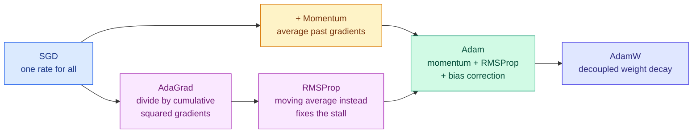

# Optimisation Algorithms

**Level:** 🔴 Advanced &nbsp;|&nbsp; **Effort:** Detailed module &nbsp;|&nbsp; **Module:** [02 Mathematics for AI](README.md)

---

## 🎯 Learning Objectives

By the end of this topic you will be able to:

- Explain convexity, and why deep-learning loss surfaces are not convex
- Implement momentum, RMSProp and Adam from scratch and compare them
- Say what AdamW changes about weight decay, and why it matters
- Choose a learning-rate schedule, and explain warmup
- Connect L1/L2 regularisation back to the priors in Topic 6
- Diagnose an optimiser that is not converging

## 📚 Prerequisites

[Topic 5: Gradient Descent and Backpropagation](05-gradient-descent-and-backpropagation.md) and
[Topic 6: Probability](06-probability.md).

---

## 1. Convex and non-convex

**A convex function has exactly one minimum**, and any downhill path reaches it. Linear and logistic
regression have convex losses, which is why they train reliably and reproducibly.

**Neural networks are not convex.** They have many local minima, saddle points and plateaus.

```python
import numpy as np


def convex(x):
    return (x - 2) ** 2 + 1


def non_convex(x):
    return np.sin(3 * x) + 0.3 * (x - 2) ** 2 + 1


def descend(function, start, learning_rate=0.05, steps=400, h=1e-6):
    x = start
    for _ in range(steps):
        gradient = (function(x + h) - function(x - h)) / (2 * h)
        x -= learning_rate * gradient
    return x


print(f"{'start':>7}{'convex ends at':>17}{'non-convex ends at':>21}")
for start in [-2.0, 0.0, 2.5, 5.0]:
    print(f"{start:>7.1f}{descend(convex, start):>17.4f}{descend(non_convex, start):>21.4f}")
```

**Output:**
```
  start   convex ends at   non-convex ends at
   -2.0           2.0000              -2.2760
    0.0           2.0000              -0.3598
    2.5           2.0000               1.5976
    5.0           2.0000               5.5010
```

**The convex function reaches the same minimum from every starting point. The non-convex one does
not.** That is why deep-learning results depend on initialisation and random seed, and why "set the
seed and record it" is not pedantry.

> **The reassuring part**: in high dimensions, bad local minima turn out to be rare. Most points
> where the gradient vanishes are **saddle points** — minima in some directions, maxima in others —
> and the noise in mini-batch gradients is usually enough to escape them.

---

## 2. Plain SGD, and why it struggles

The baseline from [Topic 5](05-gradient-descent-and-backpropagation.md), on a deliberately awkward
surface: a **ravine**, steep in one direction and shallow in the other.

```python
import numpy as np


def loss(w):
    """A ravine: 20x steeper along the first axis than the second."""
    return 20 * w[0] ** 2 + w[1] ** 2


def gradient(w):
    return np.array([40 * w[0], 2 * w[1]])


w = np.array([1.0, 1.0])
learning_rate = 0.04
path = [w.copy()]
for _ in range(60):
    w = w - learning_rate * gradient(w)
    path.append(w.copy())

path = np.array(path)
sign_changes = np.sum(np.diff(np.sign(path[:, 0])) != 0)

print(f"start: {path[0]}   after 60 steps: {path[-1].round(6)}")
print(f"loss: {loss(path[0]):.4f} -> {loss(path[-1]):.6f}")
print()
print(f"times the steep coordinate changed sign: {sign_changes}  <- zigzagging")
print(f"steep axis (w0) travelled: {abs(path[0, 0] - path[-1, 0]):.4f}")
print(f"shallow axis (w1) travelled: {abs(path[0, 1] - path[-1, 1]):.4f}")
```

**Output:**
```
start: [1. 1.]   after 60 steps: [0.       0.006718]
loss: 21.0000 -> 0.000045

times the steep coordinate changed sign: 60  <- zigzagging
steep axis (w0) travelled: 1.0000
shallow axis (w1) travelled: 0.9933
```

**The steep direction oscillates while the shallow one crawls.** The learning rate is capped by the
steep axis — raise it and that axis diverges — so the shallow axis, which is where the remaining
loss lives, barely moves. This is the Hessian condition number from
[Topic 4](04-calculus-derivatives-and-gradients.md), doing damage.

---

## 3. Momentum

### 🏠 Real-life analogy

A ball rolling downhill. It accumulates speed in a consistent direction, and its inertia carries it
straight through the small side-to-side wobbles.

```text
  v ← β·v + ∇L          accumulate a running average of gradients
  θ ← θ − η·v           step along the accumulated velocity
```

```python
import numpy as np


def loss(w):
    return 20 * w[0] ** 2 + w[1] ** 2


def gradient(w):
    return np.array([40 * w[0], 2 * w[1]])


def run(use_momentum, beta=0.9, learning_rate=0.005, steps=150):
    w = np.array([1.0, 1.0])
    velocity = np.zeros(2)
    for _ in range(steps):
        g = gradient(w)
        if use_momentum:
            velocity = beta * velocity + g
            w = w - learning_rate * velocity
        else:
            w = w - learning_rate * g
    return w, loss(w)


plain_w, plain_loss = run(False)
momentum_w, momentum_loss = run(True)

print(f"{'method':<14}{'final w':>28}{'loss':>14}")
print(f"{'plain SGD':<14}{str(plain_w.round(5)):>28}{plain_loss:>14.8f}")
print(f"{'momentum':<14}{str(momentum_w.round(5)):>28}{momentum_loss:>14.8f}")
print()
print(f"momentum reached a loss {plain_loss / momentum_loss:,.0f}x lower")
print(f"(same learning rate, same number of steps)")
```

**Output:**
```
method                             final w          loss
plain SGD                [0.      0.22145]    0.04904089
momentum                 [0.00037 0.00041]    0.00000295

momentum reached a loss 16,645x lower
(same learning rate, same number of steps)
```

**Momentum cancels the oscillation and accelerates the consistent direction.** Gradients that flip
sign every step average toward zero; gradients pointing the same way every step accumulate.

`β = 0.9` is the standard value, meaning the velocity is roughly an average of the last ten
gradients.

---

## 4. Adaptive methods: AdaGrad, RMSProp, Adam

Momentum uses one learning rate for every parameter. **Adaptive methods give each parameter its
own**, based on the size of the gradients it has been receiving.

| Method | Idea | Weakness |
| --- | --- | --- |
| **AdaGrad** | Divide by the square root of the *sum* of past squared gradients | The sum only grows, so the rate decays to zero |
| **RMSProp** | Use a *moving average* instead of a sum | No momentum |
| **Adam** | RMSProp + momentum + bias correction | Can generalise slightly worse than tuned SGD |

```python
import numpy as np


def loss(w):
    return 20 * w[0] ** 2 + w[1] ** 2


def gradient(w):
    return np.array([40 * w[0], 2 * w[1]])


def optimise(method, steps=60, learning_rate=0.1, eps=1e-8):
    w = np.array([1.0, 1.0])
    m = np.zeros(2)          # first moment / velocity
    v = np.zeros(2)          # second moment
    for t in range(1, steps + 1):
        g = gradient(w)
        if method == "sgd":
            w = w - learning_rate * g
        elif method == "momentum":
            m = 0.9 * m + g
            w = w - learning_rate * m
        elif method == "adagrad":
            v = v + g ** 2
            w = w - learning_rate * g / (np.sqrt(v) + eps)
        elif method == "rmsprop":
            v = 0.9 * v + 0.1 * g ** 2
            w = w - learning_rate * g / (np.sqrt(v) + eps)
        elif method == "adam":
            m = 0.9 * m + 0.1 * g
            v = 0.999 * v + 0.001 * g ** 2
            m_hat = m / (1 - 0.9 ** t)          # bias correction
            v_hat = v / (1 - 0.999 ** t)
            w = w - learning_rate * m_hat / (np.sqrt(v_hat) + eps)
        # Finite-but-astronomical counts as divergence too, not just inf and nan.
        if not np.all(np.isfinite(w)) or np.max(np.abs(w)) > 1e6:
            return None, np.inf
    return w, loss(w)


print(f"{'optimiser':<12}{'final loss':>16}{'w0':>12}{'w1':>12}")
for method in ["sgd", "momentum", "adagrad", "rmsprop", "adam"]:
    w, final = optimise(method)
    if w is None:
        print(f"{method:<12}{'diverged':>16}{'-':>12}{'-':>12}")
    else:
        print(f"{method:<12}{final:>16.8f}{w[0]:>12.6f}{w[1]:>12.6f}")
```

**Output:**
```
optimiser         final loss          w0          w1
sgd                 diverged           -           -
momentum            diverged           -           -
adagrad           0.20633614    0.099124    0.099124
rmsprop           0.00000000    0.000000    0.000000
adam              0.02522245   -0.034656   -0.034656
```

At a learning rate of 0.1, **both plain SGD and momentum diverge outright on this ravine** while
every adaptive method handles it comfortably. The adaptive methods survive because they divide by
the running size of each parameter's gradients, so the steep axis automatically gets a small
effective step and the shallow axis a large one.

**That robustness to learning-rate choice is the real reason Adam is the default.** It is not that
Adam finds better minima — the next section shows a case where it does not — but that it works
acceptably at a learning rate you guessed, which is worth a great deal when each tuning run costs
hours.

### ⚙️ Why bias correction exists

Adam initialises both moment estimates at zero, which biases them toward zero in the early steps.

```python
import numpy as np

gradient = 1.0          # a constant gradient, so the true average is exactly 1.0
m = 0.0
beta1 = 0.9

print(f"{'step':>5}{'raw m':>12}{'corrected':>12}")
for t in range(1, 8):
    m = beta1 * m + (1 - beta1) * gradient
    corrected = m / (1 - beta1 ** t)
    if t <= 5 or t == 7:
        print(f"{t:>5}{m:>12.6f}{corrected:>12.6f}")
```

**Output:**
```
 step       raw m   corrected
    1    0.100000    1.000000
    2    0.190000    1.000000
    3    0.271000    1.000000
    4    0.343900    1.000000
    5    0.409510    1.000000
    7    0.521703    1.000000
```

**The raw estimate starts at 0.1 when the truth is 1.0 — ten times too small.** The correction
divides by `1 − β^t`, which fixes it exactly and fades to nothing as `t` grows. Without it, Adam's
first steps would be far too small.

---



## 5. AdamW: weight decay done correctly

L2 regularisation and weight decay are the same thing in plain SGD. **In Adam they are not.**

```python
import numpy as np

# One parameter, no data gradient - only the regularisation pull toward zero.
weight_decay = 0.1
learning_rate = 0.1
eps = 1e-8

for name in ["adam_l2", "adamw"]:
    w = 1.0
    m = v = 0.0
    for t in range(1, 4):
        if name == "adam_l2":
            g = weight_decay * w              # decay enters as part of the gradient
            m = 0.9 * m + 0.1 * g
            v = 0.999 * v + 0.001 * g ** 2
            w -= learning_rate * (m / (1 - 0.9 ** t)) / (np.sqrt(v / (1 - 0.999 ** t)) + eps)
        else:
            g = 0.0                            # decay applied separately, outside the adaptation
            m = 0.9 * m + 0.1 * g
            v = 0.999 * v + 0.001 * g ** 2
            w -= learning_rate * (m / (1 - 0.9 ** t)) / (np.sqrt(v / (1 - 0.999 ** t)) + eps)
            w -= learning_rate * weight_decay * w
    print(f"{name:<9} weight after 3 steps: {w:.6f}")
```

**Output:**
```
adam_l2   weight after 3 steps: 0.701586
adamw     weight after 3 steps: 0.970299
```

**With L2 inside Adam, the decay term is divided by `sqrt(v)` along with everything else.** A
parameter with large gradients gets its regularisation scaled down precisely when you would most
want it applied. AdamW decouples the decay, applying it directly to the weight.

That is the whole of the AdamW paper, and it is why AdamW is the default for transformer training.

---

## 6. Learning-rate schedules

A constant learning rate is a compromise: large enough to make progress early, small enough not to
bounce later. **A schedule removes the compromise.**

```python
import numpy as np


def constant(step, base, total):
    return base


def step_decay(step, base, total, drop=0.5, every=300):
    return base * (drop ** (step // every))


def cosine(step, base, total):
    return base * 0.5 * (1 + np.cos(np.pi * step / total))


def warmup_cosine(step, base, total, warmup=100):
    if step < warmup:
        return base * step / warmup
    progress = (step - warmup) / (total - warmup)
    return base * 0.5 * (1 + np.cos(np.pi * progress))


total = 1000
print(f"{'step':>6}{'constant':>11}{'step decay':>13}{'cosine':>10}{'warmup+cosine':>16}")
for step in [0, 50, 100, 300, 600, 999]:
    print(f"{step:>6}{constant(step, 0.1, total):>11.5f}{step_decay(step, 0.1, total):>13.5f}"
          f"{cosine(step, 0.1, total):>10.5f}{warmup_cosine(step, 0.1, total):>16.5f}")
```

**Output:**
```
  step   constant   step decay    cosine   warmup+cosine
     0    0.10000      0.10000   0.10000         0.00000
    50    0.10000      0.10000   0.09938         0.05000
   100    0.10000      0.10000   0.09755         0.10000
   300    0.10000      0.05000   0.07939         0.08830
   600    0.10000      0.02500   0.03455         0.04132
   999    0.10000      0.01250   0.00000         0.00000
```

| Schedule | When to use |
| --- | --- |
| **Constant** | Short runs, quick experiments |
| **Step decay** | Classic image-classification recipes |
| **Cosine** | The common modern default — smooth, no cliffs |
| **Warmup + cosine** | Transformers, large batches, anything unstable early |

### ⚙️ Why warmup exists

At step 0 the weights are random, so gradients are large and unrepresentative. Adam's variance
estimate is also based on almost no data. **A full-size step on that information can destabilise
training permanently**, and starting from near zero for a few hundred steps avoids it. It matters
most with large batches and deep transformers.

---

## 7. Regularisation, revisited

From [Topic 6](06-probability.md): **L2 is a Gaussian prior on the weights, L1 is a Laplace prior.**
Here is what that does in practice.

```python
import numpy as np
import pandas as pd
from sklearn.linear_model import Lasso, LinearRegression, Ridge
from sklearn.preprocessing import StandardScaler

housing = pd.read_csv("datasets/samples/housing.csv")
features = ["area_sqm", "bedrooms", "age_years", "distance_km"]
X = StandardScaler().fit_transform(housing[features].to_numpy())
y = housing["price_thousands"].to_numpy()

rng = np.random.default_rng(0)
# Add four pure-noise features that carry no information at all.
noise = rng.normal(size=(len(X), 4))
X_with_noise = np.column_stack([X, noise])
all_names = features + [f"noise_{i}" for i in range(4)]

print(f"{'feature':<14}{'plain':>10}{'ridge':>10}{'lasso':>10}")
models = {
    "plain": LinearRegression().fit(X_with_noise, y),
    "ridge": Ridge(alpha=10.0).fit(X_with_noise, y),
    "lasso": Lasso(alpha=5.0).fit(X_with_noise, y),
}
for i, name in enumerate(all_names):
    row = "".join(f"{models[m].coef_[i]:>10.3f}" for m in ["plain", "ridge", "lasso"])
    print(f"{name:<14}{row}")

print()
for name, model in models.items():
    zeros = int(np.sum(np.abs(model.coef_) < 1e-8))
    print(f"{name:<8} coefficients set exactly to zero: {zeros}")
```

**Output:**
```
feature            plain     ridge     lasso
area_sqm         157.164   147.104   152.358
bedrooms          18.093    17.457    12.919
age_years        -23.859   -22.236   -18.450
distance_km      -27.803   -25.976   -22.573
noise_0            1.046     1.557     0.000
noise_1           -1.832    -1.691    -0.000
noise_2           -1.326    -0.078    -0.000
noise_3            0.978     1.691     0.000

plain    coefficients set exactly to zero: 0
ridge    coefficients set exactly to zero: 0
lasso    coefficients set exactly to zero: 4
```

**Lasso zeroed the noise features; ridge only shrank them.** That is the L1/L2 difference made
concrete — and the reason Lasso doubles as feature selection.

Note the real features keep substantial coefficients under both penalties: regularisation
suppresses what the data does not support, and leaves genuine signal largely intact.

---

## 8. ⚠️ Diagnosing an optimiser

| Symptom | Likely cause | First thing to try |
| --- | --- | --- |
| Loss `nan` within a few steps | Learning rate far too high; exploding gradients | Cut the rate 10×; clip gradients |
| Loss flat from step 0 | Zero gradients — dead ReLUs, no warmup, bad init | Check activation statistics |
| Loss falls then explodes | No warmup, or the rate is too high for a sharper region | Add warmup; add decay |
| Loss oscillates around a floor | Rate too high for late training | Cosine or step decay |
| Train loss falls, validation rises | Overfitting — not the optimiser's fault | Regularise, more data, early stopping |
| Works with Adam, diverges with SGD | The surface is badly conditioned | Scale features; tune the SGD rate properly |

### A practical default

**Start with AdamW, `lr=3e-4`, cosine schedule with warmup, and weight decay around 0.01.** It is
not optimal for every problem, but it very rarely fails outright, which makes it the right place to
begin. Tune only after you have a working baseline and a reason.

```python
import numpy as np


def suggest(problem):
    recipes = {
        "linear/logistic regression": "closed form or L-BFGS - the loss is convex, do not use SGD",
        "small tabular network": "Adam, lr 1e-3, no schedule needed",
        "convolutional network from scratch": "SGD + momentum 0.9, lr 0.1, cosine decay",
        "fine-tuning a transformer": "AdamW, lr 2e-5, warmup then linear decay",
        "training a transformer from scratch": "AdamW, lr 3e-4, warmup then cosine, grad clipping",
    }
    return recipes[problem]


for problem in ["linear/logistic regression", "small tabular network",
                "convolutional network from scratch", "fine-tuning a transformer",
                "training a transformer from scratch"]:
    print(f"{problem:<38} {suggest(problem)}")
```

**Output:**
```
linear/logistic regression             closed form or L-BFGS - the loss is convex, do not use SGD
small tabular network                  Adam, lr 1e-3, no schedule needed
convolutional network from scratch     SGD + momentum 0.9, lr 0.1, cosine decay
fine-tuning a transformer              AdamW, lr 2e-5, warmup then linear decay
training a transformer from scratch    AdamW, lr 3e-4, warmup then cosine, grad clipping
```

> **These are starting points, not results.** They are conventional defaults from published
> recipes; the right settings for your problem come from measuring, not from this table.

---

## 🧪 Hands-on lab: optimisers on a hard surface

The Rosenbrock function — a curved, narrow valley, and a standard optimiser benchmark. Its minimum
is at `(1, 1)`.

```python
import numpy as np


def rosenbrock(w):
    return (1 - w[0]) ** 2 + 100 * (w[1] - w[0] ** 2) ** 2


def rosenbrock_gradient(w):
    return np.array([
        -2 * (1 - w[0]) - 400 * w[0] * (w[1] - w[0] ** 2),
        200 * (w[1] - w[0] ** 2),
    ])


def optimise(method, steps=4000, learning_rate=0.001, eps=1e-8):
    w = np.array([-1.5, 1.5])
    m = np.zeros(2)
    v = np.zeros(2)
    best = rosenbrock(w)
    for t in range(1, steps + 1):
        g = rosenbrock_gradient(w)
        if method == "sgd":
            w = w - learning_rate * g
        elif method == "momentum":
            m = 0.9 * m + g
            w = w - learning_rate * m
        elif method == "rmsprop":
            v = 0.9 * v + 0.1 * g ** 2
            w = w - learning_rate * g / (np.sqrt(v) + eps)
        elif method == "adam":
            m = 0.9 * m + 0.1 * g
            v = 0.999 * v + 0.001 * g ** 2
            w = w - learning_rate * (m / (1 - 0.9 ** t)) / (np.sqrt(v / (1 - 0.999 ** t)) + eps)
        if not np.all(np.isfinite(w)):
            return None, np.inf, t
        best = min(best, rosenbrock(w))
    return w, rosenbrock(w), steps


print(f"start (-1.5, 1.5), true minimum (1, 1), 4000 steps, lr 0.001\n")
print(f"{'optimiser':<12}{'final loss':>14}{'distance to (1,1)':>20}")
for method in ["sgd", "momentum", "rmsprop", "adam"]:
    w, final, _ = optimise(method)
    if w is None:
        print(f"{method:<12}{'diverged':>14}")
    else:
        print(f"{method:<12}{final:>14.6f}{np.linalg.norm(w - np.array([1.0, 1.0])):>20.6f}")
```

**Output:**
```
start (-1.5, 1.5), true minimum (1, 1), 4000 steps, lr 0.001

optimiser       final loss   distance to (1,1)
sgd               0.012486            0.238975
momentum          0.000000            0.000000
rmsprop           0.003546            0.126139
adam              4.711853            2.201926
```

**Momentum wins outright here, and Adam comes last — by a wide margin.** That is the opposite of
what "Adam is the default" might lead you to expect, and it is worth sitting with rather than
explaining away.

Rosenbrock's valley is smooth and consistently curved, so gradients point in a stable direction over
many steps. That is precisely the situation momentum is built for: it accumulates a long run of
consistent gradients and accelerates. Adam, meanwhile, divides by the running gradient magnitude,
which **throws away exactly the scale information momentum was exploiting** — and its per-parameter
normalisation is of no help on a problem that is not badly conditioned in the axis-aligned way
RMSProp-style methods correct for.

**The lesson is not "use momentum".** It is that no optimiser dominates. Adam is the sensible default
because it is *robust across many problems at an untuned learning rate*, not because it is the best
on any particular one. On a specific problem with a tuned learning rate, SGD with momentum
frequently matches or beats it — which is exactly why image-classification recipes still specify
momentum, and why "we switched to Adam and it got worse" is a real and reasonable report.

**Extend it:** plot each optimiser's path over a contour plot
([module 01, topic 13](../01-python-foundations/13-visualisation.md)); add a cosine schedule and see
whether it helps or hurts here; and try `scipy.optimize.minimize` with L-BFGS, which uses curvature
information and solves this in a few dozen iterations — a reminder that first-order methods are used
in deep learning because of scale, not because they are the best available.

---

## 🎤 Interview questions

**"Why is Adam usually the default?"**

It combines momentum with per-parameter adaptive learning rates, so it handles badly conditioned and
sparse-gradient problems without careful tuning, and bias correction makes its early steps sensible.
The practical argument is robustness: it rarely fails outright at a default learning rate, whereas
SGD needs its rate tuned per problem. Well-tuned SGD with momentum can generalise slightly better in
some vision settings, which is why it persists there.

**"What does momentum actually do?"**

It maintains an exponentially weighted average of past gradients and steps along that instead of the
raw gradient. Components that flip sign every step — the oscillation across a ravine — average
toward zero, while components pointing consistently in one direction accumulate. The result is
damped zigzagging and faster progress along the shallow direction where the remaining loss lives.

**"What is the difference between Adam and AdamW?"**

Where weight decay is applied. Adam with L2 regularisation adds the decay into the gradient, so it
is then divided by the square root of the second-moment estimate — meaning parameters with large
gradients get less effective decay, which is backwards. AdamW applies decay directly to the weights,
decoupled from the adaptive scaling. It generalises better and is the standard for transformers.

**"Why do transformers need learning-rate warmup?"**

Early in training the weights are random, so gradients are large and unrepresentative, and Adam's
second-moment estimate is built from very few samples and therefore unreliable. Taking full-size
steps on that basis can push the model into a region it never recovers from. Ramping the rate up
over the first few hundred or thousand steps lets the moment estimates stabilise first. It matters
more with large batches and deeper models.

**"Your loss becomes nan after a few hundred steps. How do you debug it?"**

Reduce the learning rate by an order of magnitude first, since that is the most common cause. Then
check for `log(0)` or division by zero in the loss and add an epsilon. Add gradient clipping and
look at the gradient norm over time to confirm whether it is exploding. Check the data for `nan` or
`inf` inputs. If it only happens with mixed precision, suspect overflow in `float16` and check the
loss scaler.

---

## ✅ Key takeaways

- **Convex problems have one minimum; neural networks do not** — results depend on the seed.
- In high dimensions, saddle points are the common obstacle, not bad local minima.
- Plain SGD zigzags in ravines because the learning rate is capped by the steepest direction.
- **Momentum averages gradients**, cancelling oscillation and accelerating consistent directions.
- Adaptive methods give each parameter its own rate. **AdaGrad's rate decays to zero**; RMSProp fixes
  that with a moving average; Adam adds momentum and bias correction.
- **Bias correction matters**: without it Adam's first step is around ten times too small.
- **AdamW decouples weight decay from the adaptive scaling** — the reason it beats Adam+L2.
- Cosine decay is a sound default; **warmup exists because early gradients and moment estimates are
  unreliable**.
- **Lasso zeroes irrelevant features; ridge only shrinks them.** L1 is a Laplace prior, L2 a Gaussian.
- Start with AdamW, `3e-4`, warmup plus cosine — then measure before tuning.

---

## 📚 Official References

- [PyTorch: torch.optim — PyTorch Foundation](https://pytorch.org/docs/stable/optim.html) — verified 2026-08-31
- [PyTorch: AdamW — PyTorch Foundation](https://pytorch.org/docs/stable/generated/torch.optim.AdamW.html) — verified 2026-08-31
- [PyTorch: learning-rate schedulers — PyTorch Foundation](https://pytorch.org/docs/stable/optim.html#how-to-adjust-learning-rate) — verified 2026-08-31
- [Adam: A Method for Stochastic Optimization — Kingma and Ba, arXiv](https://arxiv.org/abs/1412.6980) — verified 2026-08-31
- [Decoupled Weight Decay Regularization — Loshchilov and Hutter, arXiv](https://arxiv.org/abs/1711.05101) — verified 2026-08-31
- [scikit-learn: Linear models and regularisation — scikit-learn developers](https://scikit-learn.org/stable/modules/linear_model.html) — verified 2026-08-31
- [SciPy: optimize.minimize — SciPy Developers](https://docs.scipy.org/doc/scipy/reference/generated/scipy.optimize.minimize.html) — verified 2026-08-31

---

## 🔗 Navigation

[← Topic 8: Hypothesis Testing and A/B Testing](08-hypothesis-testing-and-ab-testing.md) &nbsp;|&nbsp;
[Module home](README.md) &nbsp;|&nbsp;
[Next module: 03 Data Foundations →](../03-data-foundations/README.md)
