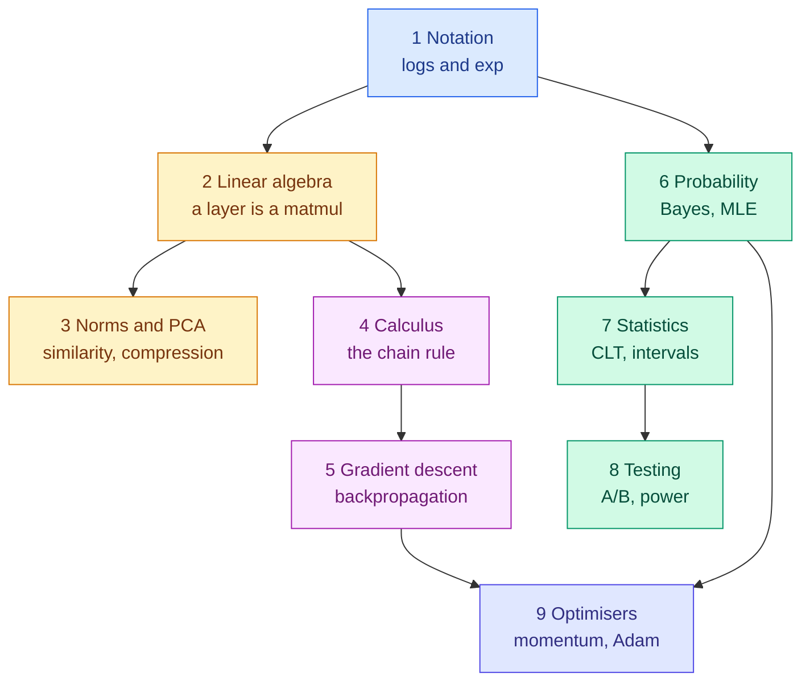

<!-- status: authored -->

# 02. Mathematics for AI and Machine Learning

**Level:** 🟢 Beginner → 🔴 Advanced &nbsp;|&nbsp; **Effort:** Multi-session &nbsp;|&nbsp; **Status:** ✅ Complete

The mathematics you actually need, each idea introduced by the AI problem it solves. No formula
appears here without an answer to "what is this for?", and every one is implemented in NumPy and
checked against a library.

---

## 🎯 Learning Objectives

By the end of this module you will be able to:

- Read the notation used in machine-learning papers and documentation
- Explain why a matrix multiplication *is* what a neural network layer does
- Compute and interpret gradients well enough to reason about training
- Apply probability and statistics to model evaluation and experiments
- Implement each core operation in NumPy from scratch, and verify it

## 📚 Prerequisites

[01 Python Foundations](../01-python-foundations/README.md) — especially
[NumPy](../01-python-foundations/11-numpy-essentials.md). Every example here is NumPy code.

```bash
pip install -r requirements.txt      # numpy==2.1.3, scipy==1.14.1, scikit-learn==1.5.2
```

Run the examples from the repository root; several read `datasets/samples/housing.csv`.

---

## 📑 Topics

| # | Topic | Covers | Level |
| --- | --- | --- | --- |
| 1 | [Basic Mathematics](01-basic-mathematics.md) | Σ and Π, powers, logarithms, exp, softmax, sigmoid, cross-entropy | 🟢 |
| 2 | [Vectors and Matrices](02-linear-algebra-vectors-and-matrices.md) | Shapes, dot product, matrix multiplication, rank, inverse, `solve` | 🟡 |
| 3 | [Norms, Eigenvalues and PCA](03-norms-eigenvalues-and-pca.md) | L1/L2, cosine similarity, eigenvectors, SVD, PCA from scratch | 🔴 |
| 4 | [Derivatives and Gradients](04-calculus-derivatives-and-gradients.md) | Slopes, the chain rule, gradients, Jacobian, Hessian, gradient checking | 🟡 |
| 5 | [Gradient Descent and Backpropagation](05-gradient-descent-and-backpropagation.md) | Learning rates, batch sizes, backprop by hand, a network solving XOR | 🟡 |
| 6 | [Probability](06-probability.md) | Conditional probability, Bayes, base rates, distributions, MLE, MAP | 🟡 |
| 7 | [Descriptive Statistics and Sampling](07-descriptive-statistics-and-sampling.md) | Mean vs median, `ddof`, the CLT, confidence intervals, bootstrapping, bias | 🟡 |
| 8 | [Hypothesis Testing and A/B Testing](08-hypothesis-testing-and-ab-testing.md) | p-values, Type I/II errors, power, effect size, sample size, p-hacking | 🟡 |
| 9 | [Optimisation Algorithms](09-optimisation-algorithms.md) | Convexity, momentum, RMSProp, Adam, AdamW, schedules, regularisation | 🔴 |

---

## 🗺️ How the pieces fit



**There are two independent tracks.** Topics 2 → 5 → 9 are how models *train*; topics 6 → 7 → 8 are
how you *evaluate* them and decide whether a change helped. You can read either first. Topic 1
underpins both.

---

## 🧭 Which topics do you actually need?

| If you are | Read |
| --- | --- |
| Heading for deep learning | 1, 2, 4, 5, 9 |
| Doing applied ML on tabular data | 1, 3, 6, 7, 8 |
| Running experiments and A/B tests | 6, 7, 8 |
| Working on embeddings or retrieval | 2, 3 |
| Preparing for interviews | All nine — every one has an interview section |

**You do not need to finish this module before starting
[05 Machine Learning](../05-machine-learning/README.md).** Topics 1, 2 and 6 are enough to begin.
Come back for the rest when you hit something you cannot reason about.

---

## 🧪 Every example is verified

Each code block was executed and shows its **real** output, enforced in continuous integration:

```bash
python scripts/check_examples.py --strict 02-mathematics-for-ai/
```

If your output differs, your environment differs — check your pinned versions first.

**Several results in this module contradict the tidy story you may have been told.** Adam loses to
momentum on the Rosenbrock benchmark; PCA finds nothing useful in `housing.csv` because its features
are independent; keeping 99.89% of the variance still loses a nearest neighbour. Those outputs are
real, and they are left in because the disagreements teach more than the agreements would.

## 📝 Practice

- Quiz: [`quizzes/02-mathematics-for-ai.md`](../quizzes/02-mathematics-for-ai.md)
- Answers: [`quizzes/answers/02-mathematics-for-ai.md`](../quizzes/answers/02-mathematics-for-ai.md)
- Assignments: [`assignments/02-mathematics-for-ai.md`](../assignments/02-mathematics-for-ai.md)

---

## ⚠️ How to get through this module

**Do not read it like a textbook.** Type the examples, change the numbers, and predict what will
happen before you run them. The gap between your prediction and the output is where the learning is.

**When a formula looks impenetrable, find the loop inside it.** Σ is a `for` loop; a matrix
multiplication is two nested loops of dot products. Every formula here is code you could write.

**You will forget the details.** That is expected and fine. What you want to retain is *which tool
applies to which problem* — that a narrow valley means you need momentum, that a rare event means
precision will collapse, that a small test set cannot resolve a one-point improvement. The formulas
are lookup; the judgement is the skill.

---

## 📚 Official References

- [NumPy: Linear algebra — NumPy Developers](https://numpy.org/doc/stable/reference/routines.linalg.html) — verified 2026-08-31
- [SciPy: Statistical functions — SciPy Developers](https://docs.scipy.org/doc/scipy/reference/stats.html) — verified 2026-08-31
- [PyTorch: Autograd mechanics — PyTorch Foundation](https://pytorch.org/docs/stable/notes/autograd.html) — verified 2026-08-31
- [scikit-learn: Linear models — scikit-learn developers](https://scikit-learn.org/stable/modules/linear_model.html) — verified 2026-08-31

---

## 🔗 Navigation

[← 01 Python Foundations](../01-python-foundations/README.md) &nbsp;|&nbsp;
[🏠 Repository Home](../README.md) &nbsp;|&nbsp;
[Topic 1: Basic Mathematics →](01-basic-mathematics.md)

**Next module:** [03 Data Foundations](../03-data-foundations/README.md)
