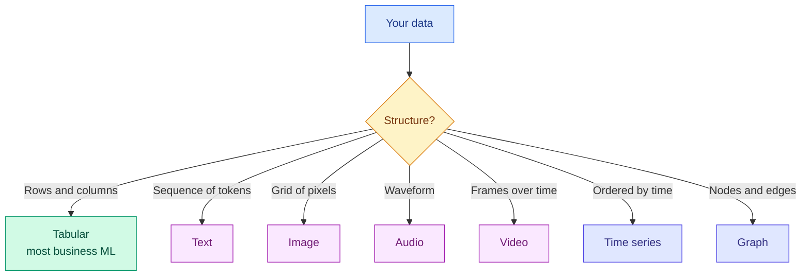

# Data Types and Modalities

**Level:** 🟢 Beginner &nbsp;|&nbsp; **Effort:** Short module &nbsp;|&nbsp; **Module:** [03 Data Foundations](README.md)

---

## 🎯 Learning Objectives

By the end of this topic you will be able to:

- Classify data as structured, semi-structured or unstructured, and pick tooling accordingly
- Name the seven modalities you will meet, and what each costs to store and process
- Explain why a model never sees text or images — only numbers
- Recognise which modality a problem really is, which is not always obvious
- Estimate storage for a dataset before you commit to collecting it

## 📚 Prerequisites

[01 Python Foundations](../01-python-foundations/README.md), particularly
[JSON, CSV and APIs](../01-python-foundations/10-json-csv-and-apis.md).

---

## 1. Three degrees of structure

| Kind | Has a fixed schema? | Examples | Query with |
| --- | --- | --- | --- |
| **Structured** | Yes | CSV, database tables, Parquet | SQL, pandas |
| **Semi-structured** | Partly — keys vary | JSON, JSONL, XML, logs | Document stores, `.get()` chains |
| **Unstructured** | No | Text, images, audio, video | Models that produce embeddings |

**The boundary matters because it decides your tooling.** A structured dataset can be filtered with
a `WHERE` clause; an unstructured one needs a model to turn it into something searchable at all —
which is the entire premise of
[15 Embeddings and Vector Search](../15-embeddings-and-vector-search/README.md).

```python
import csv
import io
import json

structured = "review_id,label,rating\nr001,positive,5\nr002,negative,2\n"
semi_structured = '{"customer_id": "c001", "plan": "pro", "usage": {"requests": 31703}}'
unstructured = "The film, surprisingly, was great - I would happily watch it again."

rows = list(csv.DictReader(io.StringIO(structured)))
record = json.loads(semi_structured)

print(f"structured:      {len(rows)} rows, fixed columns {list(rows[0])}")
print(f"semi-structured: top-level keys {list(record)}, nested under 'usage': {list(record['usage'])}")
print(f"unstructured:    {len(unstructured)} characters, {len(unstructured.split())} words, no schema at all")
```

**Output:**
```
structured:      2 rows, fixed columns ['review_id', 'label', 'rating']
semi-structured: top-level keys ['customer_id', 'plan', 'usage'], nested under 'usage': ['requests']
unstructured:    67 characters, 12 words, no schema at all
```

**Notice what you can ask of each.** "How many rows have rating 5" is a one-liner on the first.
"What is this review about" is not answerable from the third without a model.

---

## 2. The seven modalities



| Modality | Shape a model sees | Typical size per item | Module |
| --- | --- | --- | --- |
| **Tabular** | `(n_samples, n_features)` | Bytes | [05 Machine Learning](../05-machine-learning/README.md) |
| **Text** | `(n_tokens,)` of integer IDs | Kilobytes | [10 NLP](../10-natural-language-processing/README.md) |
| **Image** | `(height, width, channels)` | Kilobytes to megabytes | [09 Computer Vision](../09-computer-vision/README.md) |
| **Audio** | `(n_samples,)` at a sample rate | Megabytes per minute | [24 Speech and Audio](../24-speech-and-audio-ai/README.md) |
| **Video** | `(frames, height, width, channels)` | Gigabytes per hour | [23 Multimodal AI](../23-multimodal-ai/README.md) |
| **Time series** | `(timesteps, features)`, **order matters** | Bytes | [20 Time Series](../20-time-series/README.md) |
| **Graph** | Nodes, edges, adjacency | Varies | [22 Graph ML](../22-graph-machine-learning/README.md) |

### ⚠️ Tabular is still most of the work

The attention goes to language and images. **Most machine learning that earns money is tabular** —
churn, fraud, pricing, demand, credit, recommendations. Gradient-boosted trees on a well-built
feature table remain hard to beat there, and no amount of deep learning changes that.

---

## 3. Everything becomes numbers

**A model never sees text, an image or a sound.** Each modality is converted to numbers first, and
the conversion is where most of the information is won or lost.

```python
import numpy as np

# --- text: characters to integer IDs (a toy tokeniser) ---
text = "cat sat"
vocabulary = {char: index for index, char in enumerate(sorted(set(text)))}
token_ids = np.array([vocabulary[char] for char in text])
print(f"text:       {text!r}")
print(f"vocabulary: {vocabulary}")
print(f"as numbers: {token_ids}  shape {token_ids.shape}")

# --- image: a tiny greyscale picture is just a matrix ---
image = np.array([[0, 128, 255],
                  [64, 192, 32]], dtype=np.uint8)
print(f"\nimage shape {image.shape}, dtype {image.dtype}, range {image.min()}-{image.max()}")
print(f"as a model sees it (scaled to 0-1):\n{(image / 255).round(3)}")

# --- audio: amplitude sampled over time ---
sample_rate = 8
seconds = 1
t = np.linspace(0, seconds, sample_rate * seconds, endpoint=False)
waveform = np.round(np.sin(2 * np.pi * 2 * t), 3)
print(f"\naudio: {sample_rate} samples/second, {len(waveform)} values")
print(f"waveform: {waveform}")
```

**Output:**
```
text:       'cat sat'
vocabulary: {' ': 0, 'a': 1, 'c': 2, 's': 3, 't': 4}
as numbers: [2 1 4 0 3 1 4]  shape (7,)

image shape (2, 3), dtype uint8, range 0-255
as a model sees it (scaled to 0-1):
[[0.    0.502 1.   ]
 [0.251 0.753 0.125]]

audio: 8 samples/second, 8 values
waveform: [ 0.  1.  0. -1. -0.  1.  0. -1.]
```

**Three completely different things, three arrays of numbers.** That is why the same mathematics
from [02 Mathematics for AI](../02-mathematics-for-ai/README.md) applies to all of them.

### 💰 The size difference is enormous

```python
def bytes_per_item(modality):
    sizes = {
        "one tabular row, 20 float64 features": 20 * 8,
        "one 512-token text embedding, float32": 512 * 4,
        "one 224x224 RGB image, uint8": 224 * 224 * 3,
        "one second of 44.1kHz stereo audio, int16": 44_100 * 2 * 2,
        "one second of 1080p30 video, uint8": 30 * 1920 * 1080 * 3,
    }
    return sizes[modality]


print(f"{'item':<44}{'bytes':>16}{'relative':>12}")
baseline = bytes_per_item("one tabular row, 20 float64 features")
for name in ["one tabular row, 20 float64 features",
             "one 512-token text embedding, float32",
             "one 224x224 RGB image, uint8",
             "one second of 44.1kHz stereo audio, int16",
             "one second of 1080p30 video, uint8"]:
    size = bytes_per_item(name)
    print(f"{name:<44}{size:>16,}{size / baseline:>11,.0f}x")
```

**Output:**
```
item                                                   bytes    relative
one tabular row, 20 float64 features                     160          1x
one 512-token text embedding, float32                  2,048         13x
one 224x224 RGB image, uint8                         150,528        941x
one second of 44.1kHz stereo audio, int16            176,400      1,102x
one second of 1080p30 video, uint8               186,624,000  1,166,400x
```

**A second of video is about 1.2 million times a tabular row.** That ratio decides your storage
bill, your data-loading strategy, whether you can hold a dataset in memory, and how long an epoch
takes. Estimate it *before* you start collecting.

---

## 4. ⚠️ Identifying the modality is not always obvious

The mistake is treating data as the shape it arrives in rather than the shape the problem is.

| Arrives as | Often really is | Why it matters |
| --- | --- | --- |
| A table with a `timestamp` column | **Time series** | Rows are not independent — a random split leaks the future |
| A table of `user_id`, `item_id`, `rating` | **Graph** or interaction matrix | Splitting by row puts the same user on both sides |
| A CSV whose cells contain sentences | **Text** | The column is not a category, and one-hot encoding it is hopeless |
| Scanned PDFs of tables | **Image**, until OCR makes it tabular | The extraction step is where the errors are |

```python
import pandas as pd

sensors = pd.read_csv("datasets/samples/sensor_readings.csv", parse_dates=["timestamp"])

print(f"looks tabular: shape {sensors.shape}, columns {list(sensors.columns)}")
print()
print("but the rows are not independent:")
s01 = sensors[sensors["sensor_id"] == "s-01"]["temperature_c"].dropna()
print(f"  correlation between a reading and the next: {s01.autocorr(lag=1):.4f}")
print(f"  correlation with the reading 12 steps later: {s01.autocorr(lag=12):.4f}")
```

**Output:**
```
looks tabular: shape (240, 4), columns ['timestamp', 'sensor_id', 'temperature_c', 'humidity_pct']

but the rows are not independent:
  correlation between a reading and the next: 0.9232
  correlation with the reading 12 steps later: -0.9523
```

**A correlation that strong between consecutive rows means they are not independent samples.**
Shuffling them into a random train/test split lets the model see readings from either side of every
test point — an almost perfect predictor, and a completely fictional score. This is covered properly
in [Topic 6: Splits](06-splits-sampling-and-class-imbalance.md).

Note also the negative correlation at lag 12: half a day later, the daily cycle has inverted.

---

## 5. 🔐 Different modalities, different risks

| Modality | Specific risk |
| --- | --- |
| **Tabular** | Direct personal data; re-identification by combining "anonymous" columns |
| **Text** | Names, addresses and credentials embedded in free text; prompt injection |
| **Image** | Faces; location metadata in EXIF; incidental bystanders |
| **Audio** | Voice is biometric; background conversations |
| **Video** | All of the above at once |
| **Graph** | Relationships are themselves sensitive, even with nodes anonymised |

**Two things generalise.** First, **"anonymised" tabular data frequently is not** — a handful of
quasi-identifiers such as postcode, birth date and sex can single out an individual. Second,
**metadata leaks**: an image file carries capture time and often GPS coordinates that nobody
intended to publish.

Strip metadata on ingest, and treat a re-identification check as part of anonymisation rather than
an afterthought. See [`SECURITY.md`](../SECURITY.md) and
[26 Responsible AI](../26-responsible-ai/README.md).

---

## 🧪 Hands-on lab: profile four real files

Before anything else, know what you have. This repository ships four sample files
([dataset card](../datasets/samples/README.md)) — profile them by modality.

```python
import json
from pathlib import Path

import pandas as pd

samples = Path("datasets/samples")

print(f"{'file':<24}{'kind':<18}{'size':>10}{'records':>10}  shape / structure")
print("-" * 92)

for name in ["reviews.csv", "sensor_readings.csv", "housing.csv"]:
    frame = pd.read_csv(samples / name)
    size = (samples / name).stat().st_size
    numeric = frame.select_dtypes("number").shape[1]
    text_columns = [c for c in frame.columns
                    if frame[c].dtype == object and frame[c].astype(str).str.contains(" ").any()]
    kind = "tabular + text" if text_columns else "tabular"
    print(f"{name:<24}{kind:<18}{size:>10,}{len(frame):>10}  "
          f"{frame.shape[1]} cols ({numeric} numeric), free text: {text_columns or 'none'}")

records = [json.loads(line) for line in (samples / "customers.jsonl").read_text(encoding="utf-8").splitlines()]
keys = {key for record in records for key in record}
always = {key for key in keys if all(key in record for record in records)}
print(f"{'customers.jsonl':<24}{'semi-structured':<18}"
      f"{(samples / 'customers.jsonl').stat().st_size:>10,}{len(records):>10}  "
      f"keys seen {sorted(keys)}")
print(f"{'':<24}{'':<18}{'':>10}{'':>10}  always present: {sorted(always)}")
print(f"{'':<24}{'':<18}{'':>10}{'':>10}  optional: {sorted(keys - always)}")
```

**Output:**
```
file                    kind                    size   records  shape / structure
--------------------------------------------------------------------------------------------
reviews.csv             tabular + text         5,087        62  5 cols (1 numeric), free text: ['text']
sensor_readings.csv     tabular                8,670       240  4 cols (2 numeric), free text: none
housing.csv             tabular                4,128       150  6 cols (5 numeric), free text: none
customers.jsonl         semi-structured        6,524        40  keys seen ['contact', 'customer_id', 'plan', 'region', 'tags', 'usage']
                                                                always present: ['customer_id', 'plan', 'region', 'tags', 'usage']
                                                                optional: ['contact']
```

**The last two lines are the whole difference between structured and semi-structured.** A CSV
guarantees every row has every column, even if the value is empty. A JSONL file does not — `contact`
is simply absent from some records, and code that assumes otherwise raises `KeyError` on a quarter
of the file.

**Extend it:** add a column-level profile — dtype, null count, distinct count, and a sample value —
for each tabular file; detect which columns are really categorical despite being stored as integers;
and write the profile to JSON so two versions of a dataset can be diffed.

---

## 🎤 Interview questions

**"What is the difference between structured, semi-structured and unstructured data?"**

Structured data has a fixed schema known in advance — every record has the same fields with the same
types, so it can be queried directly with SQL. Semi-structured data carries its own schema
inline and varies between records, like JSON where optional keys may be absent. Unstructured data
has no schema at all — raw text, images, audio — and generally must be converted into vectors by a
model before it can be searched or filtered meaningfully.

**"How do you decide which modality a problem is?"**

By what determines the answer, not by the file format. A table with a timestamp column is a time
series if the ordering carries information, which changes how you split it. User-item interactions
arrive as a table but behave as a graph, so splitting by row leaks users across the boundary.
Getting this wrong usually shows up as an evaluation that is far too good.

**"Why is data size a design constraint rather than a detail?"**

Because the ratio between modalities is enormous — a second of 1080p video is roughly a million
times a tabular row. That determines whether the dataset fits in memory, whether you need streaming
data loading, how long an epoch takes, what storage costs, and whether augmentation happens on the
fly or in advance. It is worth estimating before collection, not after.

**"What privacy risks are specific to unstructured data?"**

Personal information appears in places a schema would not flag: names and addresses inside free
text, faces and bystanders in images, GPS coordinates in EXIF metadata, and voice as a biometric in
audio. There is no column to redact, so you need detection rather than selection. Tabular data has
its own version of this — quasi-identifiers such as postcode plus birth date can re-identify
individuals even after the obvious columns are dropped.

---

## ✅ Key takeaways

- Structure decides tooling: SQL for structured, `.get()` chains for semi-structured, models for
  unstructured.
- Seven modalities — tabular, text, image, audio, video, time series, graph.
- **Tabular is still the majority of applied machine learning**, whatever the headlines say.
- **Models only ever see numbers.** The conversion step is where information is won or lost.
- A second of video is around a million times a tabular row. **Estimate storage before collecting.**
- **The modality is the one the problem has, not the one the file has** — a timestamp column usually
  means time series, and consecutive rows are not independent.
- A CSV guarantees every column exists; JSONL does not.
- Each modality carries its own privacy risk, and metadata leaks more than people expect.

---

## 📚 Official References

- [pandas: dtypes and data structures — pandas development team](https://pandas.pydata.org/docs/user_guide/basics.html#dtypes) — verified 2026-09-01
- [NumPy: data types — NumPy Developers](https://numpy.org/doc/stable/user/basics.types.html) — verified 2026-09-01
- [Python: json module — Python Software Foundation](https://docs.python.org/3/library/json.html) — verified 2026-09-01
- [scikit-learn: Dataset loading utilities — scikit-learn developers](https://scikit-learn.org/stable/datasets.html) — verified 2026-09-01
- [Datasheets for Datasets — Gebru et al., arXiv](https://arxiv.org/abs/1803.09010) — verified 2026-09-01

---

## 🔗 Navigation

[← Module home](README.md) &nbsp;|&nbsp;
[🏠 Repository Home](../README.md) &nbsp;|&nbsp;
[Topic 2: Collection, Ingestion and Labelling →](02-collection-ingestion-and-labelling.md)
