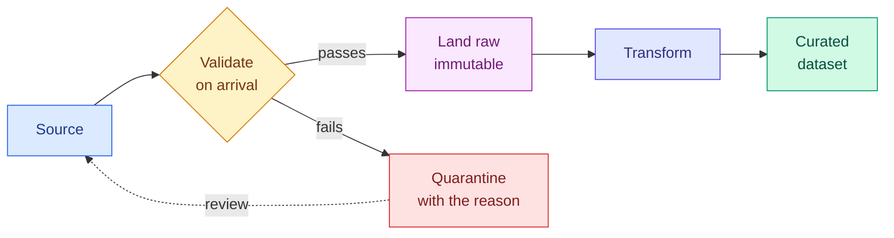

# Collection, Ingestion, Labelling and Annotation

**Level:** 🟢 Beginner &nbsp;|&nbsp; **Effort:** Detailed module &nbsp;|&nbsp; **Module:** [03 Data Foundations](README.md)

---

## 🎯 Learning Objectives

By the end of this topic you will be able to:

- Choose a collection method, and name the bias each one introduces
- Write an ingestion step that validates on arrival rather than trusting the source
- Measure inter-annotator agreement, and say why raw agreement is misleading
- Design a labelling guideline that reduces disagreement instead of hiding it
- Explain why label noise caps your model's achievable accuracy
- State the consent and licensing questions to ask before collecting anything

## 📚 Prerequisites

[Topic 1: Data Types](01-data-types.md)

---

## 1. Where data comes from, and what each source costs you

| Source | Strength | Bias it introduces |
| --- | --- | --- |
| **Product logs** | Cheap, large, real behaviour | Only your existing users, only what you instrumented |
| **Public datasets** | Free, comparable, benchmarked | Often stale; may not match your distribution |
| **Purchased data** | Fast, broad | Provenance and licensing frequently unclear |
| **Surveys** | Direct answers | Self-selection — see [module 02, topic 7](../02-mathematics-for-ai/07-descriptive-statistics-and-sampling.md) |
| **Scraping** | Access to what exists publicly | Legal and terms-of-service risk; no consent |
| **Manual collection** | Exactly what you need | Slow and expensive |
| **Synthetic generation** | Unlimited, controllable | Only contains what you put in — see [Topic 7](07-synthetic-data-augmentation-and-feature-stores.md) |

**Every source is biased. The question is whether you know how**, and whether that bias is
acceptable for the decision the model will drive.

### ⚠️ The bias nobody notices: you only log what you instrumented

```python
# A recommendation log records what users clicked. What it cannot record:
# items they never saw, because the existing recommender never showed them.
impressions = {"item_a": 10_000, "item_b": 8_000, "item_c": 50, "item_d": 0}
clicks = {"item_a": 900, "item_b": 640, "item_c": 20, "item_d": 0}

print(f"{'item':<9}{'shown':>9}{'clicks':>9}{'observed CTR':>15}")
for item in impressions:
    shown, clicked = impressions[item], clicks[item]
    rate = f"{clicked / shown:.4f}" if shown else "unknown"
    print(f"{item:<9}{shown:>9,}{clicked:>9,}{rate:>15}")

print()
print("Training on this teaches the model that item_d is bad.")
print("It has no evidence about item_d at all - it was never shown.")
```

**Output:**
```
item         shown   clicks   observed CTR
item_a      10,000      900         0.0900
item_b       8,000      640         0.0800
item_c          50       20         0.4000
item_d           0        0        unknown

Training on this teaches the model that item_d is bad.
It has no evidence about item_d at all - it was never shown.
```

**This is feedback-loop bias**, and it compounds: the model learns from what the previous model
chose to show, then decides what the next model sees. Breaking it needs deliberate exploration —
showing some items randomly — which costs short-term performance to buy long-term data.

---

## 2. Ingestion: validate at the boundary

**The moment data enters your system is the cheapest place to catch problems.** A malformed row
rejected on arrival costs seconds; the same row discovered after training costs a day.



**Two rules that pay for themselves.** Keep the raw landing zone **immutable** — you cannot
reprocess data you overwrote. And **quarantine with the reason attached**, because a rejected-rows
folder with no explanation is a folder nobody ever opens.

```python
import json
from dataclasses import dataclass, field


@dataclass
class IngestionReport:
    """What happened during ingestion. Counts, not vibes."""
    accepted: int = 0
    rejected: dict = field(default_factory=dict)

    def reject(self, reason):
        self.rejected[reason] = self.rejected.get(reason, 0) + 1

    @property
    def total(self):
        return self.accepted + sum(self.rejected.values())

    def summary(self):
        rate = self.accepted / self.total if self.total else 0.0
        return {"total": self.total, "accepted": self.accepted,
                "acceptance_rate": round(rate, 4), "rejected": self.rejected}


def ingest(records):
    report = IngestionReport()
    clean = []
    for record in records:
        if not isinstance(record, dict):
            report.reject("not an object")
        elif "customer_id" not in record:
            report.reject("missing customer_id")
        elif record.get("plan") not in {"free", "pro", "enterprise"}:
            report.reject(f"unknown plan {record.get('plan')!r}")
        elif not isinstance(record.get("usage", {}).get("requests_last_30d"), int):
            report.reject("usage.requests_last_30d missing or not an integer")
        else:
            report.accepted += 1
            clean.append(record)
    return clean, report


incoming = [
    {"customer_id": "c001", "plan": "pro", "usage": {"requests_last_30d": 100}},
    {"customer_id": "c002", "plan": "gold", "usage": {"requests_last_30d": 50}},
    {"plan": "free", "usage": {"requests_last_30d": 5}},
    "not a record",
    {"customer_id": "c005", "plan": "free", "usage": {"requests_last_30d": "many"}},
    {"customer_id": "c006", "plan": "enterprise", "usage": {"requests_last_30d": 9000}},
]

clean, report = ingest(incoming)
print(json.dumps(report.summary(), indent=2))
```

**Output:**
```
{
  "total": 6,
  "accepted": 2,
  "acceptance_rate": 0.3333,
  "rejected": {
    "unknown plan 'gold'": 1,
    "missing customer_id": 1,
    "not an object": 1,
    "usage.requests_last_30d missing or not an integer": 1
  }
}
```

**An acceptance rate is a metric you should alert on.** It is normally stable; a sudden drop means
the upstream schema changed, and finding that out from a dashboard beats finding it out from a model
that silently trained on 40% of the data.

### 🔐 Ingestion is a trust boundary

Data arriving from outside your system is **untrusted input**, whatever its source:

- **Never `pickle.load` or `eval` anything that arrived over a network.** Both execute code.
- **Validate types and ranges**, not just presence — a negative age or a 300% percentage is a signal
  that something upstream broke.
- **Cap sizes.** An unbounded field is a denial-of-service vector and a memory bug.
- **Strip metadata** on ingest — EXIF GPS coordinates in uploaded images are the classic leak.
- **Record provenance**: source, timestamp, and a checksum, so you can answer "where did this row
  come from" months later.

---

## 3. Labelling: the part everyone underestimates

For supervised learning, **labels are usually the bottleneck** — more expensive than compute, slower
than modelling, and the single biggest determinant of the ceiling on your accuracy.

### The ceiling that label noise imposes

```python
import numpy as np

rng = np.random.default_rng(0)
n = 20_000

true_labels = rng.integers(0, 2, size=n)

print(f"{'label noise':>13}{'best achievable accuracy':>28}")
for noise in [0.0, 0.02, 0.05, 0.10, 0.20]:
    flip = rng.random(n) < noise
    observed = np.where(flip, 1 - true_labels, true_labels)
    # A *perfect* model predicts the true label. Scored against noisy labels, it cannot exceed:
    print(f"{noise:>13.0%}{np.mean(observed == true_labels):>28.4f}")
```

**Output:**
```
  label noise    best achievable accuracy
           0%                      1.0000
           2%                      0.9799
           5%                      0.9526
          10%                      0.9008
          20%                      0.7951
```

**With 10% label noise, a model that is always right scores 90%** — and any team chasing 95% is
chasing something unreachable. Worse, a model that *does* score 95% on those labels has learned to
reproduce the annotation errors.

**Before optimising a model, measure your labels.** If a 3-point improvement is the goal and label
noise is 8%, the labels are the project.

### Measuring agreement properly

Raw agreement flatters you when classes are imbalanced, because two annotators guessing the majority
class agree most of the time by luck. **Cohen's kappa corrects for that.**

```python
import numpy as np


def cohens_kappa(a, b):
    """Agreement corrected for what chance alone would produce."""
    a, b = np.asarray(a), np.asarray(b)
    observed = np.mean(a == b)
    categories = set(a) | set(b)
    expected = sum((np.mean(a == c) * np.mean(b == c)) for c in categories)
    return (observed - expected) / (1 - expected)


rng = np.random.default_rng(1)
n = 1000

# A rare positive class: 5% of items.
truth = (rng.random(n) < 0.05).astype(int)

annotators = {
    "both always say 'no'": (np.zeros(n, int), np.zeros(n, int)),
    "both genuinely good": (np.where(rng.random(n) < 0.05, 1 - truth, truth),
                            np.where(rng.random(n) < 0.05, 1 - truth, truth)),
    "one careful, one guessing": (truth, (rng.random(n) < 0.05).astype(int)),
}

print(f"{'annotator pair':<28}{'raw agreement':>16}{'Cohen kappa':>14}")
for name, (a, b) in annotators.items():
    print(f"{name:<28}{np.mean(a == b):>16.4f}{cohens_kappa(a, b):>14.4f}")
```

**Output:**
```
annotator pair                 raw agreement   Cohen kappa
both always say 'no'                  1.0000           nan
both genuinely good                   0.8890        0.3863
one careful, one guessing             0.9030       -0.0509
```

**Look at the first row.** Two annotators who never mark anything positive agree 100% of the time
and have learned nothing. Kappa returns `nan` here, because chance agreement is already 100% and the
correction divides by zero — an undefined kappa is itself the warning. The third row shows raw
agreement above 90% while kappa reveals *negative* agreement: worse than chance.

**The middle row is the one worth sitting with.** Both annotators are genuinely competent — each
mislabels only 5% of items — yet kappa is 0.39, merely "fair". That is not a mistake in the
simulation. **On a rare class, a small error rate destroys kappa**, because almost all the positives
are exactly where the disagreements land. If your task has a 5% positive rate, expect modest kappa
from good annotators and budget for overlap and adjudication accordingly.

| Kappa | Conventionally read as |
| --- | --- |
| < 0.20 | Slight — your guidelines are not working |
| 0.21–0.40 | Fair |
| 0.41–0.60 | Moderate |
| 0.61–0.80 | Substantial |
| > 0.80 | Almost perfect |

**Low kappa is a guideline problem, not an annotator problem.** The fix is clearer definitions and
worked edge cases, not scolding.

---

## 4. Writing a labelling guideline that works

A guideline is a specification for a human classifier. The failure mode is always the same: it
covers the obvious cases and says nothing about the boundary.

**A usable guideline contains:**

1. **One-sentence definition per label** — the least useful part, but necessary
2. **Positive examples**, including atypical ones
3. **Negative examples**, especially near-misses
4. **Explicit edge-case rulings** — this is the part that actually reduces disagreement
5. **A "cannot tell" option**, so uncertainty is recorded rather than guessed
6. **A tie-breaking rule** for genuinely ambiguous items

```python
guideline = {
    "label": "negative sentiment",
    "definition": "The author expresses dissatisfaction with the product or experience.",
    "positive_examples": ["Awful - I checked the time twice.",
                          "I wanted to like this, but nothing lands."],
    "negative_examples": ["The plot was dark and unsettling."],
    "edge_cases": {
        "mixed opinion": "Label by the author's overall verdict, not the harshest sentence.",
        "criticism of the shipping, not the product": "Not negative for THIS task. Use 'other'.",
        "sarcasm": "Label the intended meaning, not the literal words. If unsure, 'cannot tell'.",
        "describes dark subject matter positively": "Not negative - see negative_examples.",
    },
    "allow_cannot_tell": True,
}

print(f"label: {guideline['label']}")
print(f"edge cases documented: {len(guideline['edge_cases'])}")
for case, ruling in guideline["edge_cases"].items():
    print(f"  - {case}: {ruling}")
print(f"\n'cannot tell' permitted: {guideline['allow_cannot_tell']}")
```

**Output:**
```
label: negative sentiment
edge cases documented: 4
  - mixed opinion: Label by the author's overall verdict, not the harshest sentence.
  - criticism of the shipping, not the product: Not negative for THIS task. Use 'other'.
  - sarcasm: Label the intended meaning, not the literal words. If unsure, 'cannot tell'.
  - describes dark subject matter positively: Not negative - see negative_examples.

'cannot tell' permitted: True
```

**The third edge case is the interesting one.** "The plot was dark and unsettling" is praise for a
thriller, and an annotator without that ruling will split roughly evenly on it. One sentence in the
guideline removes an entire category of disagreement.

### Practical approaches to labelling at scale

| Approach | Trade-off |
| --- | --- |
| **Expert labelling** | Highest quality, slowest, most expensive |
| **Crowdsourcing with overlap** | Cheaper; needs multiple annotators per item and agreement checks |
| **Weak supervision** | Rules and heuristics generate noisy labels at scale |
| **Active learning** | Label only what the model is most uncertain about |
| **Model-assisted pre-labelling** | Fast, but **anchors annotators to the model's mistakes** |
| **Programmatic from behaviour** | A click is a label — but a proxy one, not the thing you want |

**The last two deserve caution.** Pre-labelling measurably biases annotators toward accepting what
they are shown, so review-only workflows inherit the model's blind spots. And behavioural proxies
answer a different question: "did they click" is not "was it good", and optimising the proxy will
eventually cost you the thing it was standing in for.

---

## 5. 🔐 Consent, licensing and provenance

**Questions to answer before collecting, not after:**

- **Do you have a lawful basis?** Consent, contract or legitimate interest are not
  interchangeable, and consent must be specific and revocable.
- **What licence does this data carry?** "Publicly visible" is not "freely usable". Terms of service
  frequently prohibit scraping and model training explicitly.
- **Can you honour deletion?** If someone withdraws consent, can you remove their data from your
  training set — and from models already trained on it?
- **Is it personal data?** If so, minimise: collect only fields you will use, and set a retention
  period.
- **Who is not represented?** A dataset that under-covers a group produces a model that fails that
  group ([26 Responsible AI](../26-responsible-ai/README.md)).

**Record provenance for every dataset** — source, date, licence, collection method, and known
limitations. This repository's [dataset card](../datasets/samples/README.md) is a small worked
example, and the practice comes from
[Datasheets for Datasets](https://arxiv.org/abs/1803.09010).

> **This is not legal advice.** Data protection rules vary by jurisdiction and change. Get advice
> from qualified counsel for anything involving personal data.

---

## 🧪 Hands-on lab: an ingestion pipeline that reports

Ingest `customers.jsonl`, validate every record, and produce a report you could put on a dashboard.

```python
import json
from collections import Counter
from pathlib import Path

VALID_PLANS = {"free", "pro", "enterprise"}
VALID_REGIONS = {"eu-west", "us-east", "ap-south", "eu-north"}


def validate(record):
    """Return (clean_record, None) or (None, reason). Check types and ranges, not just presence."""
    if not isinstance(record, dict):
        return None, "not an object"
    if not isinstance(record.get("customer_id"), str):
        return None, "customer_id missing or not a string"
    if record.get("plan") not in VALID_PLANS:
        return None, f"plan not in {sorted(VALID_PLANS)}"
    if record.get("region") not in VALID_REGIONS:
        return None, "region not recognised"
    usage = record.get("usage")
    if not isinstance(usage, dict):
        return None, "usage block missing"
    requests = usage.get("requests_last_30d")
    if not isinstance(requests, int) or requests < 0:
        return None, "requests_last_30d missing, wrong type, or negative"
    if not isinstance(usage.get("storage_gb"), (int, float)) or usage["storage_gb"] < 0:
        return None, "storage_gb missing, wrong type, or negative"
    return record, None


lines = Path("datasets/samples/customers.jsonl").read_text(encoding="utf-8").splitlines()

accepted, rejected = [], Counter()
for line in lines:
    record, reason = validate(json.loads(line))
    if record is None:
        rejected[reason] += 1
    else:
        accepted.append(record)

report = {
    "records_in": len(lines),
    "accepted": len(accepted),
    "acceptance_rate": round(len(accepted) / len(lines), 4),
    "rejected": dict(rejected),
    "coverage": {
        "with_contact_block": sum(1 for r in accepted if "contact" in r),
        "without_contact_block": sum(1 for r in accepted if "contact" not in r),
        "with_tags": sum(1 for r in accepted if r["tags"]),
    },
    "distribution": {
        "plan": dict(Counter(r["plan"] for r in accepted)),
        "region": dict(sorted(Counter(r["region"] for r in accepted).items())),
    },
}

print(json.dumps(report, indent=2))
```

**Output:**
```
{
  "records_in": 40,
  "accepted": 40,
  "acceptance_rate": 1.0,
  "rejected": {},
  "coverage": {
    "with_contact_block": 30,
    "without_contact_block": 10,
    "with_tags": 24
  },
  "distribution": {
    "plan": {
      "pro": 17,
      "free": 13,
      "enterprise": 10
    },
    "region": {
      "ap-south": 9,
      "eu-north": 8,
      "eu-west": 11,
      "us-east": 12
    }
  }
}
```

**Every record passed, and the report is still worth having.** The `coverage` block records that a
quarter of records have no `contact` — an *optional field*, not an error, but something downstream
code must handle and something you want to notice if it changes. The `distribution` block is your
baseline for detecting drift later ([29 MLOps](../29-mlops/README.md)).

**Extend it:** add a schema-version field and reject records from an unknown version; alert when the
acceptance rate falls below a threshold; add a checksum of the input file to the report so the same
ingestion can be proven reproducible.

---

## 🎤 Interview questions

**"How does data collection introduce bias?"**

Every method selects. Logs only contain users you already have and events you instrumented; surveys
over-represent people willing to answer; scraped data reflects what is public, which is not
representative. The most insidious in machine learning is feedback-loop bias: a recommender's logs
record only items the previous model chose to show, so the next model has no evidence about anything
never displayed. Breaking that requires deliberate exploration, which costs short-term performance.

**"Why measure inter-annotator agreement, and why not use raw agreement?"**

Because label quality caps model quality, and disagreement between annotators is a direct estimate
of label noise. Raw agreement is misleading under class imbalance: two annotators who always pick
the majority class agree almost perfectly while conveying no information. Cohen's kappa corrects for
chance agreement, so it exposes that case as near zero.

**"Your labels have 8% noise. What does that mean for a target of 95% accuracy?"**

That the target is unreachable as stated. Scored against noisy labels, a perfect model tops out
around 92%, and anything scoring 95% has learned to reproduce annotation errors. The right response
is to improve the labels — clarify guidelines, add overlap and adjudication on the disputed cases —
or to re-specify the target against a smaller, carefully adjudicated gold set.

**"What would you check before training on a purchased or scraped dataset?"**

Licence and terms of service, since public visibility does not grant training rights. Provenance and
collection method, so you know what bias to expect. Whether it contains personal data and whether
there is a lawful basis and a deletion path. Whether it overlaps with your evaluation set, which
would inflate every score. And representation gaps, since under-covered groups become the groups the
model fails.

---

## ✅ Key takeaways

- **Every collection method is biased**; the job is knowing how, not avoiding it.
- **You only log what you instrumented** — feedback loops mean a model has no evidence about items
  the previous model never showed.
- **Validate at the boundary.** Land raw data immutably; quarantine rejects *with the reason*.
- Track acceptance rate as a metric and alert on it — a drop means the schema changed upstream.
- Ingestion is a trust boundary: no `pickle`, no `eval`, check types and ranges, strip metadata.
- **Label noise caps achievable accuracy.** 10% noise means a perfect model scores 90%.
- **Raw agreement flatters under imbalance.** Use Cohen's kappa.
- Low agreement is a guideline problem — fix it with documented edge cases and a "cannot tell" option.
- Model-assisted pre-labelling anchors annotators to the model's mistakes.
- Record provenance, licence and known limitations for every dataset.

---

## 📚 Official References

- [Datasheets for Datasets — Gebru et al., arXiv](https://arxiv.org/abs/1803.09010) — verified 2026-09-01
- [scikit-learn: cohen_kappa_score — scikit-learn developers](https://scikit-learn.org/stable/modules/generated/sklearn.metrics.cohen_kappa_score.html) — verified 2026-09-01
- [Python: json module — Python Software Foundation](https://docs.python.org/3/library/json.html) — verified 2026-09-01
- [Python: dataclasses — Python Software Foundation](https://docs.python.org/3/library/dataclasses.html) — verified 2026-09-01
- [Pydantic — Pydantic developers *(community resource)*](https://docs.pydantic.dev/latest/) — verified 2026-09-01

---

## 🔗 Navigation

[← Topic 1: Data Types](01-data-types.md) &nbsp;|&nbsp;
[Module home](README.md) &nbsp;|&nbsp;
[Topic 3: Cleaning — Missing Values, Duplicates and Outliers →](03-cleaning-missing-duplicates-outliers.md)
