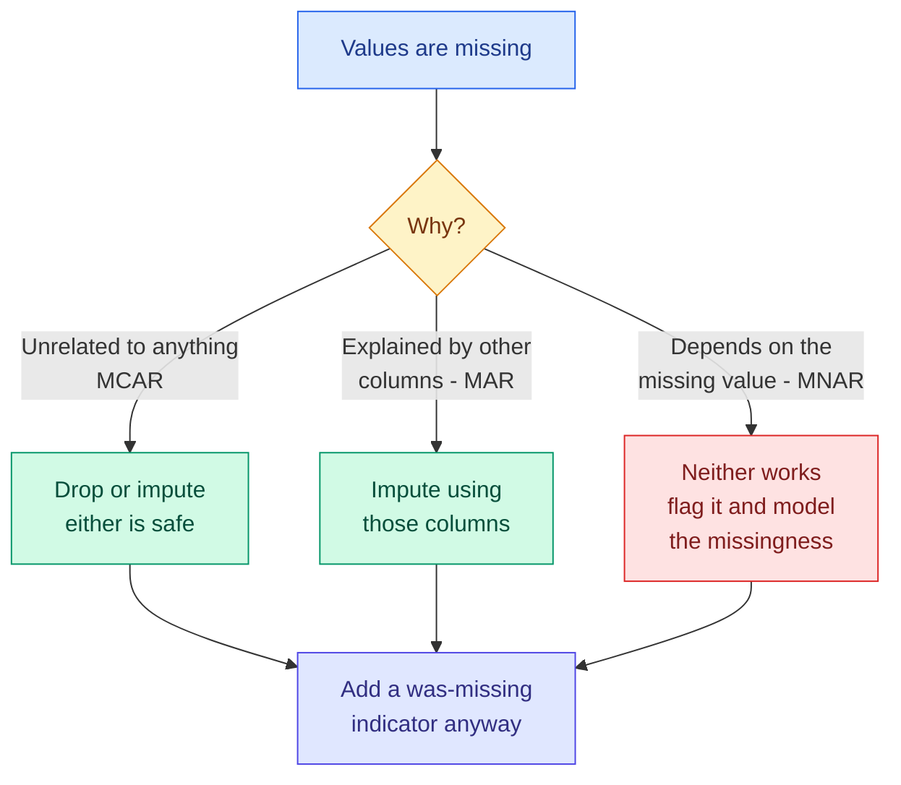

# Cleaning: Missing Values, Duplicates, Outliers and Scaling

**Level:** 🟡 Intermediate &nbsp;|&nbsp; **Effort:** Detailed module &nbsp;|&nbsp; **Module:** [03 Data Foundations](README.md)

---

## 🎯 Learning Objectives

By the end of this topic you will be able to:

- Diagnose *why* values are missing before deciding how to handle them
- Choose between dropping, imputing and flagging — and defend the choice
- Find duplicates that are not byte-identical
- Distinguish an outlier that is an error from one that is the signal
- Apply normalisation, standardisation and log transforms, and say which suits what
- Produce a cleaning report so nothing disappears silently

## 📚 Prerequisites

[Topic 2: Collection and Ingestion](02-collection-ingestion-and-labelling.md) and
[pandas Essentials](../01-python-foundations/12-pandas-essentials.md).

---

## 1. Missing values: diagnose before you treat

**The mechanism matters more than the method.** Statisticians name three, and the names are worth
knowing because they determine whether your fix is valid.

| Mechanism | Means | Safe to drop? |
| --- | --- | --- |
| **MCAR** (missing completely at random) | Missingness unrelated to anything | Yes — you lose data, not correctness |
| **MAR** (missing at random) | Explained by *other observed* columns | Yes, if you impute using those columns |
| **MNAR** (missing not at random) | Depends on the **missing value itself** | **No** — dropping or imputing biases the result |

**MNAR is the dangerous one**, and it is common: high earners decline to state income, faulty
sensors fail in extreme conditions, dissatisfied customers skip the survey.

```python
import numpy as np

rng = np.random.default_rng(0)
n = 20_000
true_income = rng.lognormal(mean=10.5, sigma=0.6, size=n)

# MCAR: a random 20% vanish for unrelated reasons.
mcar = true_income.copy()
mcar[rng.random(n) < 0.20] = np.nan

# MNAR: the highest earners are the ones who decline to answer.
mnar = true_income.copy()
probability_missing = 1 / (1 + np.exp(-(np.log(true_income) - 11.2) * 3))
mnar[rng.random(n) < probability_missing] = np.nan

print(f"true mean income:        {true_income.mean():>12,.0f}")
print(f"MCAR, dropping missing:  {np.nanmean(mcar):>12,.0f}   "
      f"error {np.nanmean(mcar) - true_income.mean():>+9,.0f}")
print(f"MNAR, dropping missing:  {np.nanmean(mnar):>12,.0f}   "
      f"error {np.nanmean(mnar) - true_income.mean():>+9,.0f}")
print()
print(f"missing under MCAR: {np.isnan(mcar).mean():.1%}")
print(f"missing under MNAR: {np.isnan(mnar).mean():.1%}")
```

**Output:**
```
true mean income:              43,504
MCAR, dropping missing:        43,490   error       -13
MNAR, dropping missing:        35,809   error    -7,695

missing under MCAR: 20.3%
missing under MNAR: 20.4%
```

**Both datasets look equally incomplete. Only one gives the right answer.** Dropping MNAR rows
understates mean income substantially, and no imputation method recovers what was never recorded —
because the reason for missingness *is* the value.

### ⚠️ How to tell them apart

You cannot prove MCAR from the data alone, but you can find strong evidence against it:

```python
import numpy as np
import pandas as pd

sensors = pd.read_csv("datasets/samples/sensor_readings.csv", parse_dates=["timestamp"])

sensors["temp_missing"] = sensors["temperature_c"].isna()
sensors["humidity_missing"] = sensors["humidity_pct"].isna()

print("missing values by column:")
print(sensors[["temperature_c", "humidity_pct"]].isna().sum().to_string())

print("\nmissing temperature, by sensor:")
print(sensors.groupby("sensor_id")["temp_missing"].sum().to_string())

print("\nmissing humidity, by sensor:")
print(sensors.groupby("sensor_id")["humidity_missing"].sum().to_string())
```

**Output:**
```
missing values by column:
temperature_c    2
humidity_pct     2

missing temperature, by sensor:
sensor_id
s-01    2
s-02    0
s-03    0

missing humidity, by sensor:
sensor_id
s-01    0
s-02    0
s-03    2
```

**The missingness is not spread evenly — it is concentrated in specific sensors.** That rules out
MCAR immediately. Whether it is MAR or MNAR depends on *why* those sensors failed, which is a
question for whoever runs them, not something the data can answer.

**Always cross-tabulate missingness against your other columns.** Missing values clustered in one
group, one time window or one source are telling you something.



### Choosing a treatment

```python
import numpy as np
import pandas as pd

reviews = pd.read_csv("datasets/samples/reviews.csv")
ratings = reviews["rating"]

print(f"rows: {len(ratings)}, missing: {ratings.isna().sum()}")
print()
print(f"{'strategy':<28}{'n':>6}{'mean':>9}{'std':>8}  note")
print(f"{'drop the rows':<28}{ratings.dropna().shape[0]:>6}"
      f"{ratings.dropna().mean():>9.3f}{ratings.dropna().std():>8.3f}  loses 4 rows")
print(f"{'fill with 0':<28}{len(ratings):>6}"
      f"{ratings.fillna(0).mean():>9.3f}{ratings.fillna(0).std():>8.3f}  invents an off-scale value")
print(f"{'fill with the mean':<28}{len(ratings):>6}"
      f"{ratings.fillna(ratings.mean()).mean():>9.3f}{ratings.fillna(ratings.mean()).std():>8.3f}  "
      f"mean preserved, variance shrunk")
print(f"{'fill with the median':<28}{len(ratings):>6}"
      f"{ratings.fillna(ratings.median()).mean():>9.3f}"
      f"{ratings.fillna(ratings.median()).std():>8.3f}  robust to skew")

# The option people forget: keep the information that it WAS missing.
frame = reviews.copy()
frame["rating_was_missing"] = frame["rating"].isna().astype(int)
frame["rating"] = frame["rating"].fillna(frame["rating"].median())
print(f"\nmedian + indicator column: {frame['rating_was_missing'].sum()} rows flagged")
print("the model can now learn whether missingness itself predicts the target")
```

**Output:**
```
rows: 62, missing: 4

strategy                         n     mean     std  note
drop the rows                   58    3.328   1.526  loses 4 rows
fill with 0                     62    3.113   1.690  invents an off-scale value
fill with the mean              62    3.328   1.475  mean preserved, variance shrunk
fill with the median            62    3.371   1.485  robust to skew

median + indicator column: 4 rows flagged
the model can now learn whether missingness itself predicts the target
```

**Mean imputation preserves the mean and shrinks the variance** — it makes the data look more
certain than it is, which propagates into over-confident models.

**The indicator column is the underused option.** If missingness is informative — and under MNAR it
always is — a binary "was missing" flag lets the model use that signal instead of pretending the
imputed value is real.

| Strategy | Use when |
| --- | --- |
| Drop rows | MCAR, few rows, plenty of data |
| Drop the column | Mostly missing and not critical |
| Mean / median | MCAR or MAR, and you need a complete matrix |
| Forward fill | Time series where the last value persists |
| Model-based (KNN, iterative) | MAR with strong correlations between columns |
| **Median + indicator** | **Almost always a reasonable default** |
| Leave as `NaN` | Your model handles it — LightGBM and XGBoost do |

### 🔐 Imputation must be fitted on training data only

Computing a median over the whole dataset and using it to fill test rows leaks test information
into training. Use a `Pipeline`
([module 01, topic 14](../01-python-foundations/14-your-first-scikit-learn-model.md)) so the
imputer's statistics come from the training fold alone.

---

## 2. Duplicates that are not identical

`drop_duplicates()` finds byte-identical rows. **Real duplicates rarely are.**

```python
import pandas as pd

records = pd.DataFrame({
    "customer_id": ["c1", "c2", "c3", "c4", "c5", "c6"],
    "email": ["  Ann@Example.COM ", "ann@example.com", "bob@example.com",
              "bob@example.com", "carol@example.com", "carol+news@example.com"],
    "name": ["Ann Smith", "ann smith", "Bob Jones", "Bob Jones", "Carol Wu", "Carol Wu"],
})

print(f"exact duplicates: {records.duplicated().sum()}")

normalised = records.copy()
normalised["email_key"] = normalised["email"].str.strip().str.lower()
normalised["name_key"] = normalised["name"].str.strip().str.lower()

print(f"after normalising case and whitespace: "
      f"{normalised.duplicated(subset=['email_key']).sum()} duplicate emails")
print(f"duplicate names: {normalised.duplicated(subset=['name_key']).sum()}")
print()
for key, group in normalised.groupby("name_key"):
    if len(group) > 1:
        print(f"  same person? {key!r}: {list(group['customer_id'])} "
              f"emails {list(group['email'].str.strip())}")
```

**Output:**
```
exact duplicates: 0
after normalising case and whitespace: 2 duplicate emails
duplicate names: 3

  same person? 'ann smith': ['c1', 'c2'] emails ['Ann@Example.COM', 'ann@example.com']
  same person? 'bob jones': ['c3', 'c4'] emails ['bob@example.com', 'bob@example.com']
  same person? 'carol wu': ['c5', 'c6'] emails ['carol@example.com', 'carol+news@example.com']
```

**Zero exact duplicates, three real ones.** Case, whitespace and email plus-addressing all hide
them. Carol's two rows are the genuinely hard case: `carol@` and `carol+news@` deliver to the same
mailbox, but deciding they are one customer is a **business rule**, not a data-cleaning fact.

| Duplicate type | How to find it |
| --- | --- |
| Exact | `duplicated()` |
| Case and whitespace | Normalise, then `duplicated()` |
| Formatting (phone, dates, addresses) | Canonicalise to one format first |
| Near-duplicate text | Similarity threshold — shingles, MinHash, embeddings |
| Same entity, different keys | Entity resolution — genuinely hard, needs business rules |

### ⚠️ Deduplicate *before* splitting, or you leak

Near-duplicate rows split across train and test are one of the most common causes of an
impossibly good score — the model has effectively seen the test set. This is exactly what happens
with the template-generated text in `reviews.csv`
([module 01, topic 14](../01-python-foundations/14-your-first-scikit-learn-model.md)).

---

## 3. Outliers: error or signal?

**The question is never "is this an outlier" but "is this wrong".**

```python
import numpy as np
import pandas as pd

sensors = pd.read_csv("datasets/samples/sensor_readings.csv")
temperatures = sensors["temperature_c"].dropna()

# Three detection methods, on the same data.
z_scores = (temperatures - temperatures.mean()) / temperatures.std()
q1, q3 = temperatures.quantile([0.25, 0.75])
iqr = q3 - q1
median = temperatures.median()
mad = (temperatures - median).abs().median()
modified_z = 0.6745 * (temperatures - median) / mad

print(f"{'method':<26}{'flagged':>9}{'threshold':>28}")
print(f"{'z-score > 3':<26}{(z_scores.abs() > 3).sum():>9}"
      f"{f'mean {temperatures.mean():.2f} +/- 3 x {temperatures.std():.2f}':>28}")
print(f"{'IQR 1.5 rule':<26}{((temperatures < q1 - 1.5 * iqr) | (temperatures > q3 + 1.5 * iqr)).sum():>9}"
      f"{f'[{q1 - 1.5 * iqr:.2f}, {q3 + 1.5 * iqr:.2f}]':>28}")
print(f"{'modified z (MAD) > 3.5':<26}{(modified_z.abs() > 3.5).sum():>9}"
      f"{f'median {median:.2f}, MAD {mad:.2f}':>28}")
print()
print(f"the extreme value: {temperatures.max()}")
print(f"its z-score: {z_scores.max():.4f}")
print(f"its modified z: {modified_z.max():.4f}")
```

**Output:**
```
method                      flagged                   threshold
z-score > 3                       1     mean 18.14 +/- 3 x 9.49
IQR 1.5 rule                      1               [1.29, 34.00]
modified z (MAD) > 3.5            1      median 17.02, MAD 4.04

the extreme value: 148.0
its z-score: 13.6783
its modified z: 21.8678
```

**All three methods flag it**, and with one bad value among 238 that is what you would expect. Note
though that the robust method flags it far more emphatically — a modified z of 21.9 against a
z-score of 13.7 — because the outlier inflates the very standard deviation the z-score divides by.

**That inflation becomes fatal once there is more than one outlier**, an effect called *masking*:

```python
import numpy as np

rng = np.random.default_rng(3)
clean = rng.normal(20, 2, 200)

print(f"{'outliers added':>16}{'z-score finds':>16}{'modified z finds':>19}")
for k in [1, 5, 15, 30]:
    data = np.append(clean, np.full(k, 150.0))
    z = np.abs((data - data.mean()) / data.std())
    median = np.median(data)
    mad = np.median(np.abs(data - median))
    modified = np.abs(0.6745 * (data - median) / mad)
    print(f"{k:>16}{int((z > 3).sum()):>16}{int((modified > 3.5).sum()):>19}")
```

**Output:**
```
  outliers added   z-score finds   modified z finds
               1               1                  1
               5               5                  5
              15              15                 15
              30               0                 30
```

**With 30 identical outliers the z-score method finds none of them.** They have inflated the
standard deviation so much that they no longer look unusual relative to it — while the MAD-based
method finds every one, because the median and median absolute deviation barely moved.

**Use robust statistics to detect outliers.** Using the mean and standard deviation to find outliers
is using a ruler the outliers are bending.

### ⚠️ Do not delete outliers reflexively

```python
import numpy as np
import pandas as pd

sensors = pd.read_csv("datasets/samples/sensor_readings.csv")

print("The 148 C reading and the stuck sensor are BOTH anomalies.")
print("Only one of them is an outlier in value.\n")

s02 = sensors[sensors["sensor_id"] == "s-02"]["temperature_c"].dropna()
stuck = (s02.diff() == 0).sum()

print(f"s-03 max temperature:        {sensors[sensors.sensor_id == 's-03']['temperature_c'].max()}")
print(f"  -> flagged by every value-based outlier method")
print(f"s-02 consecutive identical:  {stuck}")
print(f"  -> flagged by NONE of them, because 21.50 C is a perfectly normal temperature")
```

**Output:**
```
The 148 C reading and the stuck sensor are BOTH anomalies.
Only one of them is an outlier in value.

s-03 max temperature:        148.0
  -> flagged by every value-based outlier method
s-02 consecutive identical:  5
  -> flagged by NONE of them, because 21.50 C is a perfectly normal temperature
```

**The dead sensor is invisible to every value-based detector**, because its readings are entirely
plausible. Finding it required looking at *variation*, not values
([module 01, topic 11](../01-python-foundations/11-numpy-essentials.md)).

**A decision framework:**

| Situation | Action |
| --- | --- |
| Physically impossible (148 °C, negative age, 300%) | Set to `NaN` and treat as missing |
| Plausible but extreme, and you know the cause | Keep it; consider a robust model or a log transform |
| Plausible and unexplained | **Keep it and investigate.** It may be the thing you are looking for |
| Fraud, intrusion, equipment failure | **The outliers are the target.** Deleting them deletes the problem |

**Never delete outliers to make a model look better.** In fraud, anomaly detection and predictive
maintenance, the outliers are the entire point.

---

## 4. Scaling and transformation

| Transform | Formula | Result | Use for |
| --- | --- | --- | --- |
| **Normalisation** (min-max) | `(x − min) / (max − min)` | `[0, 1]` | Bounded inputs, images |
| **Standardisation** (z-score) | `(x − μ) / σ` | mean 0, std 1 | The general default |
| **Robust scaling** | `(x − median) / IQR` | median 0 | When outliers are present |
| **Log transform** | `log(x)` or `log1p(x)` | Compresses a long tail | Skewed positive data |

```python
import numpy as np
import pandas as pd

housing = pd.read_csv("datasets/samples/housing.csv")
area = housing["area_sqm"].to_numpy()

minmax = (area - area.min()) / (area.max() - area.min())
standard = (area - area.mean()) / area.std()
q1, q3 = np.percentile(area, [25, 75])
robust = (area - np.median(area)) / (q3 - q1)

print(f"{'transform':<18}{'min':>10}{'max':>10}{'mean':>10}{'std':>10}")
for name, values in [("original", area), ("min-max", minmax),
                     ("standardised", standard), ("robust", robust)]:
    print(f"{name:<18}{values.min():>10.3f}{values.max():>10.3f}"
          f"{values.mean():>10.3f}{values.std():>10.3f}")
```

**Output:**
```
transform                min       max      mean       std
original              45.200   209.500   120.801    48.292
min-max                0.000     1.000     0.460     0.294
standardised          -1.565     1.837     0.000     1.000
robust                -0.840     1.115     0.060     0.575
```

### ⚠️ Min-max scaling is destroyed by a single outlier

```python
import numpy as np

clean = np.array([10.0, 12.0, 11.0, 13.0, 12.0, 11.0])
with_outlier = np.append(clean, 1000.0)


def minmax(x):
    return (x - x.min()) / (x.max() - x.min())


print(f"clean data, min-max scaled:        {minmax(clean).round(4)}")
print(f"with one outlier, min-max scaled:  {minmax(with_outlier).round(4)}")
print()
print(f"the real values now span only: {minmax(with_outlier)[:6].max() - minmax(with_outlier)[:6].min():.4f}")
print("every genuine observation has been crushed into a tiny range near zero")
```

**Output:**
```
clean data, min-max scaled:        [0.     0.6667 0.3333 1.     0.6667 0.3333]
with one outlier, min-max scaled:  [0.    0.002 0.001 0.003 0.002 0.001 1.   ]

the real values now span only: 0.0030
every genuine observation has been crushed into a tiny range near zero
```

**One bad value compressed all the real data into 0.3% of the range.** Standardisation degrades more
gracefully; robust scaling barely notices. **Check for outliers before choosing min-max.**

### 💻 Log transforms for skewed data

```python
import numpy as np
import pandas as pd
from scipy import stats

rng = np.random.default_rng(0)
income = rng.lognormal(mean=10.5, sigma=0.8, size=5000)

print(f"{'':<16}{'mean':>12}{'median':>12}{'skew':>10}")
print(f"{'original':<16}{income.mean():>12,.0f}{np.median(income):>12,.0f}{stats.skew(income):>10.3f}")
logged = np.log1p(income)
print(f"{'after log1p':<16}{logged.mean():>12.3f}{np.median(logged):>12.3f}{stats.skew(logged):>10.3f}")
print()
print(f"back-transformed median: {np.expm1(np.median(logged)):,.0f}")
print(f"back-transformed mean:   {np.expm1(logged.mean()):,.0f}  <- NOT the original mean")
print(f"original mean was:       {income.mean():,.0f}")
```

**Output:**
```
                        mean      median      skew
original              49,637      35,521     2.649
after log1p           10.496      10.478     0.019

back-transformed median: 35,521
back-transformed mean:   36,184  <- NOT the original mean
original mean was:       49,637
```

**Use `log1p`, not `log`** — it handles zeros, which real count data is full of.

And note the last three lines: **the exponential of the mean of the logs is not the mean.** It is
the geometric mean, which is always smaller. If you train on log-transformed targets and back-
transform your predictions, you are predicting the median, not the mean — a real and frequently
missed bias in revenue and demand forecasting.

---

## 🧪 Hands-on lab: a defensible cleaning report

Clean `reviews.csv` end to end, and account for every row.

```python
import json

import numpy as np
import pandas as pd

raw = pd.read_csv("datasets/samples/reviews.csv")
report = {"rows_in": len(raw), "steps": []}
frame = raw.copy()


def step(name, before, after, detail=""):
    report["steps"].append({"step": name, "rows_before": before,
                            "rows_after": after, "removed": before - after, "detail": detail})


# 1. Normalise text fields
n = len(frame)
frame["text"] = frame["text"].str.strip()
frame["label"] = frame["label"].str.strip().str.lower()
step("normalise whitespace and case", n, len(frame),
     f"{int((raw['label'] != frame['label']).sum())} labels recased, "
     f"{int((raw['text'] != frame['text']).sum())} texts stripped")

# 2. Exact duplicates, only findable AFTER normalising
n = len(frame)
frame = frame.drop_duplicates()
step("drop exact duplicates", n, len(frame))

# 3. Near-duplicate text - the dangerous kind
n = len(frame)
duplicate_text = int(frame.duplicated(subset=["text"]).sum())
step("check duplicate text", n, len(frame), f"{duplicate_text} rows share text with another row")

# 4. Missing values - flag, then impute
missing = int(frame["rating"].isna().sum())
frame["rating_was_missing"] = frame["rating"].isna().astype(int)
frame["rating"] = frame["rating"].fillna(frame["rating"].median())
report["missing_ratings_imputed"] = missing

# 5. Validity checks
report["validity"] = {
    "labels": sorted(frame["label"].unique()),
    "rating_range": [float(frame["rating"].min()), float(frame["rating"].max())],
    "ratings_out_of_range": int(((frame["rating"] < 1) | (frame["rating"] > 5)).sum()),
    "empty_texts": int((frame["text"].str.len() == 0).sum()),
}

report["rows_out"] = len(frame)
report["retained"] = f"{len(frame) / len(raw):.1%}"
report["class_balance"] = frame["label"].value_counts().to_dict()

print(json.dumps(report, indent=2))
print()
accounted = report["rows_out"] + sum(s["removed"] for s in report["steps"])
print(f"rows accounted for: {accounted} of {report['rows_in']} -> {accounted == report['rows_in']}")
```

**Output:**
```
{
  "rows_in": 62,
  "steps": [
    {
      "step": "normalise whitespace and case",
      "rows_before": 62,
      "rows_after": 62,
      "removed": 0,
      "detail": "3 labels recased, 2 texts stripped"
    },
    {
      "step": "drop exact duplicates",
      "rows_before": 62,
      "rows_after": 60,
      "removed": 2,
      "detail": ""
    },
    {
      "step": "check duplicate text",
      "rows_before": 60,
      "rows_after": 60,
      "removed": 0,
      "detail": "25 rows share text with another row"
    }
  ],
  "missing_ratings_imputed": 4,
  "validity": {
    "labels": [
      "negative",
      "positive"
    ],
    "rating_range": [
      1.0,
      5.0
    ],
    "ratings_out_of_range": 0,
    "empty_texts": 0
  },
  "rows_out": 60,
  "retained": "96.8%",
  "class_balance": {
    "positive": 36,
    "negative": 24
  }
}

rows accounted for: 62 of 62 -> True
```

**That final assertion is the point of the whole exercise.** Every row is either in the output or
explained by a step that removed it. A cleaning script without that check can lose rows silently,
and nobody notices until the numbers do not reconcile months later.

**Note what the report flags but does not fix**: rows sharing identical text. Those are near-
duplicates that will leak across a split, and the decision about them belongs in
[Topic 6](06-splits-sampling-and-class-imbalance.md) — deduplicating text before splitting, not
after.

**Extend it:** add the report to a `pytest` test asserting the reconciliation; write the cleaned
frame and the report together so they travel as a pair; add a `--dry-run` flag that reports without
writing.

---

## 🎤 Interview questions

**"How do you decide what to do with missing values?"**

First work out why they are missing. If missingness is unrelated to anything (MCAR), dropping loses
data but not correctness. If it is explained by other observed columns (MAR), impute using those
columns. If it depends on the missing value itself (MNAR) — high earners declining to state income —
then both dropping and imputing bias the result, and no method recovers what was never recorded. In
practice I cross-tabulate missingness against other columns to rule out MCAR, and default to median
imputation plus a binary "was missing" indicator so the model can use missingness as a signal.

**"Why not use z-scores to detect outliers?"**

Because outliers inflate the standard deviation used to judge them, so they mask themselves. With a
single outlier the effect is mild, but add a contaminated group — 30 identical bad readings among
200 — and the z-score method finds *none* of them, while a MAD-based modified z-score finds every
one. Robust alternatives use statistics the outliers cannot move much: the median and median
absolute deviation, or the IQR rule. Detect robustly, then decide separately what to do.

**"When should you not remove outliers?"**

Whenever they might be the signal. In fraud detection, anomaly detection and predictive maintenance
the outliers are the target, and removing them removes the problem. Also when they are plausible but
unexplained — those deserve investigation, not deletion. Removing outliers is defensible when a
value is physically impossible, and in that case the honest treatment is to mark it missing rather
than quietly overwrite it.

**"What is the risk of min-max scaling?"**

It is defined entirely by the two most extreme values, so a single outlier compresses all the real
data into a narrow band — in the example above, into 0.3% of the range. It also does not bound test
data, which can fall outside `[0, 1]` if it exceeds the training range. Standardisation degrades
more gracefully and robust scaling barely reacts, so min-max is best reserved for genuinely bounded
quantities such as pixel values.

**"You log-transform your target and train a regression. What must you remember?"**

That back-transforming a prediction with `exp` gives the geometric mean, not the arithmetic mean, so
predictions are systematically low if you report them as expected values. If the business needs
expected revenue you need a correction, or a model with an appropriate link function. Also use
`log1p`/`expm1` rather than `log`/`exp` so zeros are handled.

---

## ✅ Key takeaways

- **Diagnose the mechanism first.** MCAR, MAR and MNAR need different treatments, and MNAR cannot be
  fixed by imputation.
- Cross-tabulate missingness against other columns — clustering rules out MCAR immediately.
- **Mean imputation shrinks variance**, making data look more certain than it is.
- **Median plus a "was missing" indicator is a good default**, because missingness is often
  informative.
- Fit imputers on training data only, inside a `Pipeline`.
- **Real duplicates are rarely byte-identical.** Normalise case and whitespace first, and remember
  entity resolution is a business rule.
- **Deduplicate before splitting**, or near-duplicates leak.
- **Never use the mean and standard deviation to detect outliers** — outliers bend the ruler. With
  30 contaminated points in 200, the z-score method finds none of them. Use MAD or IQR.
- Impossible values become `NaN`; plausible extremes get investigated, not deleted. **In fraud and
  anomaly detection the outliers are the target.**
- A dead sensor is invisible to value-based detection — look at variation.
- **One outlier destroys min-max scaling.** Use `log1p` for skew, and remember `exp(mean(log(x)))`
  is the geometric mean.
- Reconcile: every input row is either in the output or explained by a step.

---

## 📚 Official References

- [pandas: Working with missing data — pandas development team](https://pandas.pydata.org/docs/user_guide/missing_data.html) — verified 2026-09-01
- [pandas: DataFrame.drop_duplicates — pandas development team](https://pandas.pydata.org/docs/reference/api/pandas.DataFrame.drop_duplicates.html) — verified 2026-09-01
- [scikit-learn: Imputation of missing values — scikit-learn developers](https://scikit-learn.org/stable/modules/impute.html) — verified 2026-09-01
- [scikit-learn: Preprocessing data — scikit-learn developers](https://scikit-learn.org/stable/modules/preprocessing.html) — verified 2026-09-01
- [scikit-learn: Novelty and outlier detection — scikit-learn developers](https://scikit-learn.org/stable/modules/outlier_detection.html) — verified 2026-09-01
- [scipy.stats.skew — SciPy Developers](https://docs.scipy.org/doc/scipy/reference/generated/scipy.stats.skew.html) — verified 2026-09-01

---

## 🔗 Navigation

[← Topic 2: Collection, Ingestion and Labelling](02-collection-ingestion-and-labelling.md) &nbsp;|&nbsp;
[Module home](README.md) &nbsp;|&nbsp;
[Topic 4: Encoding and Data Validation →](04-encoding-and-data-validation.md)
