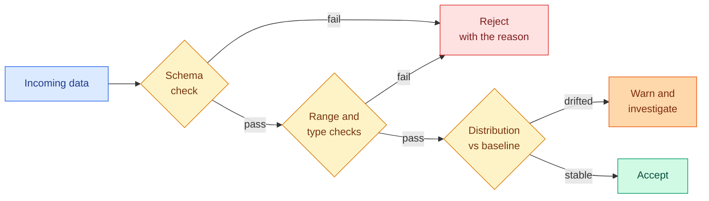

# Encoding Categorical Data and Data Validation

**Level:** 🟡 Intermediate &nbsp;|&nbsp; **Effort:** Detailed module &nbsp;|&nbsp; **Module:** [03 Data Foundations](README.md)

---

## 🎯 Learning Objectives

By the end of this topic you will be able to:

- Choose an encoding for a categorical column, and say why the obvious one is often wrong
- Explain why label encoding breaks non-tree models
- Handle high-cardinality columns and unseen categories at inference time
- Use target encoding without leaking the target
- Write schema and distribution checks that fail loudly
- Distinguish schema drift from data drift

## 📚 Prerequisites

[Topic 3: Cleaning](03-cleaning-missing-duplicates-outliers.md)

---

## 1. Models need numbers; categories are not numbers

A model cannot consume `"eu-west"`. The question is what number to give it, and **the wrong choice
invents relationships that do not exist.**

### ⚠️ Label encoding invents an ordering

```python
import numpy as np
import pandas as pd

regions = pd.Series(["eu-west", "us-east", "ap-south", "eu-north"])
codes = pd.Series(pd.factorize(regions)[0], index=regions)

print("label encoding assigns:")
print(codes.to_string())
print()
print("which silently asserts:")
print(f"  ap-south ({codes['ap-south']}) > us-east ({codes['us-east']}) > eu-west ({codes['eu-west']})")
print(f"  and that eu-north - eu-west = {codes['eu-north'] - codes['eu-west']}, as though that meant something")
print(f"  and that the 'average region' of eu-west and ap-south is "
      f"{(codes['eu-west'] + codes['ap-south']) / 2}, which is us-east")
```

**Output:**
```
label encoding assigns:
eu-west     0
us-east     1
ap-south    2
eu-north    3

which silently asserts:
  ap-south (2) > us-east (1) > eu-west (0)
  and that eu-north - eu-west = 3, as though that meant something
  and that the 'average region' of eu-west and ap-south is 1.0, which is us-east
```

**Linear models, distance-based models and neural networks all take that ordering literally.** They
will compute averages and distances between region codes as though the numbers meant something.

**Tree models are the exception**: they only split on thresholds, so a label-encoded category is
merely a series of yes/no partitions. That is why LightGBM and CatBoost handle categorical columns
directly and why label encoding is defensible there — and nowhere else.

### One-hot encoding

```python
import pandas as pd

customers = pd.DataFrame({"region": ["eu-west", "us-east", "ap-south", "eu-west"]})

one_hot = pd.get_dummies(customers, columns=["region"], dtype=int)
dropped = pd.get_dummies(customers, columns=["region"], drop_first=True, dtype=int)

print("full one-hot:")
print(one_hot.to_string(index=False))
print(f"\ncolumns: {one_hot.shape[1]}, and every row sums to {int(one_hot.sum(axis=1).iloc[0])}")
print("\nwith drop_first=True:")
print(dropped.to_string(index=False))
print(f"columns: {dropped.shape[1]}")
```

**Output:**
```
full one-hot:
 region_ap-south  region_eu-west  region_us-east
               0               1               0
               0               0               1
               1               0               0
               0               1               0

columns: 3, and every row sums to 1

with drop_first=True:
 region_eu-west  region_us-east
              1               0
              0               1
              0               0
              1               0
columns: 2
```

**`drop_first=True` exists because of the dummy-variable trap.** With all k columns present, they
sum to 1 in every row — a perfect linear dependency, which makes the design matrix singular and
linear regression's solution non-unique. That is exactly the rank deficiency from
[module 02, topic 2](../02-mathematics-for-ai/02-linear-algebra-vectors-and-matrices.md).

Drop one for linear models. **Keep all of them for tree models**, where the redundancy is harmless
and dropping one makes the trees work harder to isolate the dropped category.

### The encoding decision table

| Encoding | Use when | Watch out for |
| --- | --- | --- |
| **One-hot** | Low cardinality (< ~15), any model | Column explosion |
| **Label / ordinal** | **Genuinely ordered** data, or tree models | Invents order everywhere else |
| **Ordinal with explicit mapping** | Small, medium, large | Get the order right by hand |
| **Target / mean encoding** | High cardinality, tree models | **Leaks the target unless done inside folds** |
| **Frequency encoding** | High cardinality, cheap | Two categories with equal frequency collide |
| **Hashing** | Very high cardinality, streaming | Collisions; not interpretable |
| **Learned embedding** | Very high cardinality, neural networks | Needs enough data per category |

---

## 2. High cardinality and the unseen-category problem

```python
import numpy as np
import pandas as pd

rng = np.random.default_rng(0)
n = 5000
# A realistic long tail: a few common values, a great many rare ones.
postcodes = [f"PC{i:04d}" for i in range(800)]
weights = 1 / (np.arange(1, 801) ** 1.2)
weights /= weights.sum()
column = pd.Series(rng.choice(postcodes, size=n, p=weights))

counts = column.value_counts()
print(f"rows: {n}, distinct values: {counts.size}")
print(f"one-hot would create {counts.size} columns")
print()
print(f"{'appearing once':>18}: {(counts == 1).sum()} categories")
print(f"{'appearing <5 times':>18}: {(counts < 5).sum()} categories")
print(f"top 20 cover {counts.head(20).sum() / n:.1%} of rows")
print(f"the long tail below 5 covers only {counts[counts < 5].sum() / n:.1%}")
```

**Output:**
```
rows: 5000, distinct values: 503
one-hot would create 503 columns

    appearing once: 217 categories
appearing <5 times: 391 categories
top 20 cover 66.8% of rows
the long tail below 5 covers only 13.6%
```

**One-hot encoding this creates hundreds of columns, most of them nearly all zeros.** A category
appearing once contributes a column that is a near-perfect identifier for that single row — which
a flexible model will happily memorise.

**A practical fix: collapse the tail.**

```python
import numpy as np
import pandas as pd

rng = np.random.default_rng(0)
n = 5000
postcodes = [f"PC{i:04d}" for i in range(800)]
weights = 1 / (np.arange(1, 801) ** 1.2)
weights /= weights.sum()
column = pd.Series(rng.choice(postcodes, size=n, p=weights))

counts = column.value_counts()

for threshold in [1, 5, 20, 50]:
    keep = counts[counts >= threshold].index
    collapsed = column.where(column.isin(keep), "__other__")
    coverage = (collapsed != "__other__").mean()
    print(f"min count {threshold:>3}: {collapsed.nunique():>4} categories, "
          f"{coverage:>6.1%} of rows keep their own category")
```

**Output:**
```
min count   1:  503 categories, 100.0% of rows keep their own category
min count   5:  113 categories,  86.4% of rows keep their own category
min count  20:   32 categories,  72.3% of rows keep their own category
min count  50:   14 categories,  61.6% of rows keep their own category
```

### ⚠️ The category you have never seen before

**Training data does not contain every category that will arrive in production.** A new postcode, a
new product, a new country.

```python
import pandas as pd
from sklearn.preprocessing import OneHotEncoder

train = pd.DataFrame({"region": ["eu-west", "us-east", "ap-south"]})
live = pd.DataFrame({"region": ["eu-west", "antarctica"]})     # a category never seen in training

strict = OneHotEncoder(handle_unknown="error", sparse_output=False).fit(train[["region"]])
try:
    strict.transform(live[["region"]])
except ValueError as error:
    print(f"handle_unknown='error': {str(error)[:78]}...")

tolerant = OneHotEncoder(handle_unknown="ignore", sparse_output=False).fit(train[["region"]])
encoded = tolerant.transform(live[["region"]])
print(f"\nhandle_unknown='ignore' gives:\n{encoded}")
print(f"the unseen category becomes all zeros: {encoded[1].sum() == 0}")
```

**Output:**
```
handle_unknown='error': Found unknown categories ['antarctica'] in column 0 during transform...

handle_unknown='ignore' gives:
[[0. 1. 0.]
 [0. 0. 0.]]
the unseen category becomes all zeros: True
```

**Neither behaviour is automatically right.** Failing loudly is correct when an unknown category
means something upstream broke. Encoding to all-zeros is correct when new categories are expected
and the model should fall back to its bias term. **What is never right is discovering the choice by
accident in production** — `pd.get_dummies` applied separately to train and live data produces
different columns entirely and fails in a far more confusing way.

**Use a fitted encoder inside a `Pipeline`, not `pd.get_dummies`, for anything that will serve
predictions.**

---

## 3. Target encoding, and how it leaks

Target encoding replaces a category with the mean target for that category. It is powerful for
high-cardinality columns and **it leaks the target unless you are careful**.

```python
import numpy as np
import pandas as pd

rng = np.random.default_rng(42)
n = 600
# A category with NO relationship to the target at all - pure noise.
frame = pd.DataFrame({
    "category": rng.integers(0, 200, size=n).astype(str),
    "target": rng.normal(size=n),
})

# The naive version: compute the mean using every row, including the row itself.
means = frame.groupby("category")["target"].transform("mean")
frame["naive_encoding"] = means

print(f"correlation between a USELESS feature and the target:")
print(f"  naive target encoding: {frame['naive_encoding'].corr(frame['target']):.4f}")

# Leave-one-out: exclude the row's own target from its own encoding.
sums = frame.groupby("category")["target"].transform("sum")
counts = frame.groupby("category")["target"].transform("count")
loo = (sums - frame["target"]) / (counts - 1).replace(0, np.nan)
frame["loo_encoding"] = loo.fillna(frame["target"].mean())

print(f"  leave-one-out encoding: {frame['loo_encoding'].corr(frame['target']):.4f}")
print()
print(f"categories: {frame['category'].nunique()}, rows per category: {n / frame['category'].nunique():.1f}")
```

**Output:**
```
correlation between a USELESS feature and the target:
  naive target encoding: 0.5813
  leave-one-out encoding: 0.0164

categories: 192, rows per category: 3.1
```

**The category is pure noise, and naive target encoding manufactures a correlation with the
target.** With few rows per category, each row's own target dominates its own encoding — the feature
is effectively a copy of the label. A model trained on it scores brilliantly in cross-validation and
collapses in production.

**Target encoding must be fitted inside each cross-validation fold**, using only that fold's
training rows, plus smoothing toward the global mean for rare categories. scikit-learn's
`TargetEncoder` does this with internal cross-fitting; hand-rolled versions usually do not.

---

## 4. Validation: fail loudly, and early

Cleaning fixes what you found. **Validation catches what you did not think to look for.**



**Three layers, in order of cost to detect:**

1. **Schema** — do the expected columns exist, with the expected types? Cheapest, catches most.
2. **Ranges and values** — are numbers plausible, are categories known?
3. **Distribution** — has the *shape* changed, even though every row is individually valid?

```python
import json

import pandas as pd

EXPECTED_SCHEMA = {
    "property_id": {"dtype": "object", "unique": True, "nullable": False},
    "area_sqm": {"dtype": "float64", "min": 20.0, "max": 500.0, "nullable": False},
    "bedrooms": {"dtype": "int64", "min": 1, "max": 10, "nullable": False},
    "age_years": {"dtype": "int64", "min": 0, "max": 200, "nullable": False},
    "distance_km": {"dtype": "float64", "min": 0.0, "max": 100.0, "nullable": False},
    "price_thousands": {"dtype": "float64", "min": 0.0, "max": 10_000.0, "nullable": False},
}


def validate_schema(frame, schema):
    failures = []
    missing = set(schema) - set(frame.columns)
    unexpected = set(frame.columns) - set(schema)
    if missing:
        failures.append(f"missing columns: {sorted(missing)}")
    if unexpected:
        failures.append(f"unexpected columns: {sorted(unexpected)}")

    for column, rules in schema.items():
        if column not in frame.columns:
            continue
        actual = str(frame[column].dtype)
        if actual != rules["dtype"]:
            failures.append(f"{column}: dtype {actual}, expected {rules['dtype']}")
        nulls = int(frame[column].isna().sum())
        if nulls and not rules["nullable"]:
            failures.append(f"{column}: {nulls} nulls in a non-nullable column")
        if rules.get("unique") and frame[column].duplicated().any():
            failures.append(f"{column}: expected unique, found duplicates")
        if "min" in rules and not frame[column].isna().all():
            below = int((frame[column] < rules["min"]).sum())
            above = int((frame[column] > rules["max"]).sum())
            if below or above:
                failures.append(f"{column}: {below} below min, {above} above max")
    return failures


housing = pd.read_csv("datasets/samples/housing.csv")
print(f"housing.csv: {validate_schema(housing, EXPECTED_SCHEMA) or 'all checks passed'}")

# Now break it the way reality breaks it.
broken = housing.copy()
broken.loc[0, "bedrooms"] = 99
broken.loc[1, "area_sqm"] = None
broken = broken.rename(columns={"distance_km": "distance_to_centre_km"})

print("\nafter an upstream change:")
for failure in validate_schema(broken, EXPECTED_SCHEMA):
    print(f"  - {failure}")
```

**Output:**
```
housing.csv: all checks passed

after an upstream change:
  - missing columns: ['distance_km']
  - unexpected columns: ['distance_to_centre_km']
  - area_sqm: 1 nulls in a non-nullable column
  - bedrooms: 0 below min, 1 above max
```

**Every one of those failures is silent without validation.** A renamed column becomes a missing
feature; a null in a non-nullable column becomes an imputed value nobody chose; `bedrooms = 99`
becomes a training example teaching the model something false.

### Distribution checks: schema drift versus data drift

```python
import numpy as np
import pandas as pd

rng = np.random.default_rng(0)
baseline = pd.Series(rng.normal(120, 45, 5000))


def population_stability_index(expected, actual, bins=10):
    """PSI: how much a distribution has moved. A standard drift metric."""
    edges = np.quantile(expected, np.linspace(0, 1, bins + 1))
    edges[0], edges[-1] = -np.inf, np.inf
    expected_pct = np.histogram(expected, bins=edges)[0] / len(expected)
    actual_pct = np.histogram(actual, bins=edges)[0] / len(actual)
    expected_pct = np.clip(expected_pct, 1e-6, None)
    actual_pct = np.clip(actual_pct, 1e-6, None)
    return float(np.sum((actual_pct - expected_pct) * np.log(actual_pct / expected_pct)))


scenarios = {
    "identical distribution": rng.normal(120, 45, 5000),
    "slight shift (+5)": rng.normal(125, 45, 5000),
    "moderate shift (+20)": rng.normal(140, 45, 5000),
    "variance doubled": rng.normal(120, 90, 5000),
    "different population": rng.normal(200, 45, 5000),
}

print(f"{'scenario':<26}{'PSI':>9}  interpretation")
for name, sample in scenarios.items():
    psi = population_stability_index(baseline, pd.Series(sample))
    verdict = "stable" if psi < 0.1 else ("investigate" if psi < 0.25 else "significant drift")
    print(f"{name:<26}{psi:>9.4f}  {verdict}")
```

**Output:**
```
scenario                        PSI  interpretation
identical distribution       0.0055  stable
slight shift (+5)            0.0173  stable
moderate shift (+20)         0.1942  investigate
variance doubled             0.4566  significant drift
different population         2.7597  significant drift
```

**Every one of those samples would pass a schema check** — all floats, all in range, no nulls. Only
the distribution check notices that the population changed.

| Kind of drift | Means | Detected by |
| --- | --- | --- |
| **Schema drift** | Columns added, removed, renamed or retyped | Schema check — fail hard |
| **Data drift** | Input distribution moved | PSI, KS test — warn and investigate |
| **Concept drift** | The input-output *relationship* changed | Falling live metrics only |

**Concept drift is the one you cannot see in the inputs at all**, which is why monitoring model
performance — not just model inputs — is a separate requirement
([29 MLOps](../29-mlops/README.md)).

> **Conventional PSI thresholds are 0.1 and 0.25.** They are rules of thumb from credit scoring, not
> laws. Calibrate against your own history before alerting on them.

---

### 🔐 Security note

Validation is a security control, not only a quality one.

- **A schema check is an input filter.** Unbounded string fields are a denial-of-service and a
  memory-exhaustion vector; cap lengths and reject oversized payloads before they reach a model.
- **Category values from outside your system are untrusted.** An unbounded category space lets a
  hostile source create unlimited encoder entries — a slow memory-exhaustion attack against a
  service that fits encoders at runtime. Use a fixed vocabulary with an `__other__` bucket.
- **Target encoding embeds the target into a feature**, so a fitted encoder can disclose statistics
  about the labels. If labels are sensitive — health outcomes, credit decisions — the encoder is
  sensitive too, and shipping it to a client discloses aggregate information about your training
  population.
- **Never rebuild an encoder from user-supplied data at inference time.** Load a fitted artefact
  from storage you control, and remember that `joblib` and `pickle` execute code on load
  ([Topic 5](05-lineage-versioning-privacy-and-leakage.md)).

## 🧪 Hands-on lab: an encode-and-validate pipeline

Encode correctly, validate before and after, and prove no leakage.

```python
import numpy as np
import pandas as pd
from sklearn.compose import ColumnTransformer
from sklearn.linear_model import LinearRegression
from sklearn.metrics import mean_absolute_error
from sklearn.model_selection import train_test_split
from sklearn.pipeline import Pipeline
from sklearn.preprocessing import OneHotEncoder, StandardScaler

housing = pd.read_csv("datasets/samples/housing.csv")

# Turn bedrooms into a genuine category, so there is something to encode.
housing["bedroom_band"] = pd.cut(housing["bedrooms"], bins=[0, 1, 2, 3, 10],
                                 labels=["one", "two", "three", "four_plus"]).astype(str)

numeric = ["area_sqm", "age_years", "distance_km"]
categorical = ["bedroom_band"]

X = housing[numeric + categorical]
y = housing["price_thousands"]
X_train, X_test, y_train, y_test = train_test_split(X, y, test_size=0.2, random_state=42)

preprocess = ColumnTransformer([
    ("numeric", StandardScaler(), numeric),
    ("categorical", OneHotEncoder(handle_unknown="ignore", drop="first", sparse_output=False),
     categorical),
])

model = Pipeline([("prep", preprocess), ("model", LinearRegression())])
model.fit(X_train, y_train)
predictions = model.predict(X_test)

encoder = model.named_steps["prep"].named_transformers_["categorical"]
scaler = model.named_steps["prep"].named_transformers_["numeric"]

print(f"train rows {len(X_train)}, test rows {len(X_test)}")
print(f"categories learned: {list(encoder.categories_[0])}")
print(f"columns after drop_first: {len(encoder.get_feature_names_out(categorical))}")
print(f"feature names: {list(encoder.get_feature_names_out(categorical))}")
print()
print(f"scaler saw {scaler.n_samples_seen_} samples; training set has {len(X_train)}")
print(f"no test data reached the preprocessing: {scaler.n_samples_seen_ == len(X_train)}")
print()
print(f"MAE: {mean_absolute_error(y_test, predictions):.2f} thousand")

# An unseen category at prediction time - handled, not crashed.
unseen = pd.DataFrame({"area_sqm": [120.0], "age_years": [10], "distance_km": [5.0],
                       "bedroom_band": ["twelve"]})
print(f"\nprediction for an unseen category: {model.predict(unseen)[0]:.2f} thousand")
print("(handle_unknown='ignore' encoded it as all zeros - the model fell back to its baseline)")
```

**Output:**
```
train rows 120, test rows 30
categories learned: ['four_plus', 'one', 'three', 'two']
columns after drop_first: 3
feature names: ['bedroom_band_one', 'bedroom_band_three', 'bedroom_band_two']

scaler saw 120 samples; training set has 120
no test data reached the preprocessing: True

MAE: 16.10 thousand

prediction for an unseen category: 461.10 thousand
(handle_unknown='ignore' encoded it as all zeros - the model fell back to its baseline)
```

**Three things are true here that would not be with `pd.get_dummies`.** The encoder learned its
categories from training data only. The scaler's statistics come from 120 rows, provably. And an
unseen category at inference produces a prediction rather than a crash or a shape mismatch.

**Extend it:** add a schema check before `fit` and assert it passes; compute PSI between the train
and test feature distributions and confirm they are stable; and add a category to the test set that
does not appear in training, then compare `handle_unknown="error"` against `"ignore"` and decide
which your use case wants.

---

## 🎤 Interview questions

**"Why is label encoding a problem for linear models?"**

Because it assigns arbitrary integers that the model interprets as a real numeric scale. It asserts
that one category is greater than another, that differences between codes are meaningful, and that
the average of two categories is a third. Linear models, distance-based methods and neural networks
all act on that. Tree models are the exception, since they only split on thresholds, which is why
label encoding is acceptable there and nowhere else.

**"How do you encode a column with 10,000 distinct values?"**

Not with one-hot. Options are collapsing the long tail into an `__other__` bucket by minimum
frequency; frequency encoding; hashing when the space is unbounded or streaming; target encoding
with proper cross-fitting for tree models; or a learned embedding if you are using a neural network
and have enough rows per category. The choice depends on the model and on how much data supports
each category — a category with one row supports nothing.

**"How does target encoding leak, and how do you prevent it?"**

If a category's encoded value is the mean target computed over all rows including the row itself,
each row's own label contributes to its own feature. With few rows per category the feature becomes
close to a copy of the label, so cross-validation scores look excellent and production collapses.
Prevent it by computing the encoding inside each fold using only that fold's training rows, using
leave-one-out or cross-fitting, and smoothing rare categories toward the global mean.

**"What is the difference between schema drift, data drift and concept drift?"**

Schema drift is structural — a column renamed, added or retyped — and should fail hard immediately.
Data drift means the input distribution moved while the schema held, detected with PSI or a KS test,
and warrants investigation rather than an outright failure. Concept drift means the relationship
between inputs and target changed, which is invisible in the inputs entirely and only shows up as
falling live performance. That last one is why you monitor outcomes, not just inputs.

**"Why use scikit-learn's OneHotEncoder rather than pd.get_dummies?"**

Because `get_dummies` has no notion of fitting. Applied separately to training and serving data it
produces different columns whenever the category sets differ, giving shape mismatches or silently
misaligned features. A fitted encoder learns its categories once, applies them consistently, and has
an explicit policy for unseen values via `handle_unknown`. It also composes into a `Pipeline`, so
encoding is fitted on training folds only.

---

## ✅ Key takeaways

- **Label encoding invents an ordering** that linear, distance-based and neural models take
  literally. Trees are the exception.
- `drop_first=True` avoids the dummy-variable trap for linear models; keep all columns for trees.
- High cardinality needs tail collapsing, frequency encoding, hashing or embeddings — not one-hot.
- **Unseen categories will arrive.** Choose `handle_unknown` deliberately; never let
  `pd.get_dummies` decide by accident.
- **Naive target encoding manufactures correlation with the target even from pure noise.** Fit it
  inside folds.
- Validate in three layers: schema, ranges, then distribution.
- **A renamed column is silent without a schema check** and becomes a missing feature.
- Schema drift fails hard; data drift warns; **concept drift is invisible in the inputs**.
- PSI thresholds of 0.1 and 0.25 are conventions, not laws — calibrate against your own history.
- Use fitted encoders in a `Pipeline` for anything that will serve predictions.

---

## 📚 Official References

- [scikit-learn: Encoding categorical features — scikit-learn developers](https://scikit-learn.org/stable/modules/preprocessing.html#encoding-categorical-features) — verified 2026-09-01
- [sklearn.preprocessing.OneHotEncoder — scikit-learn developers](https://scikit-learn.org/stable/modules/generated/sklearn.preprocessing.OneHotEncoder.html) — verified 2026-09-01
- [sklearn.preprocessing.TargetEncoder — scikit-learn developers](https://scikit-learn.org/stable/modules/generated/sklearn.preprocessing.TargetEncoder.html) — verified 2026-09-01
- [sklearn.compose.ColumnTransformer — scikit-learn developers](https://scikit-learn.org/stable/modules/generated/sklearn.compose.ColumnTransformer.html) — verified 2026-09-01
- [pandas: get_dummies — pandas development team](https://pandas.pydata.org/docs/reference/api/pandas.get_dummies.html) — verified 2026-09-01
- [Great Expectations documentation *(community resource)*](https://docs.greatexpectations.io/docs/home/) — verified 2026-09-01

---

## 🔗 Navigation

[← Topic 3: Cleaning](03-cleaning-missing-duplicates-outliers.md) &nbsp;|&nbsp;
[Module home](README.md) &nbsp;|&nbsp;
[Topic 5: Lineage, Versioning, Privacy and Leakage →](05-lineage-versioning-privacy-and-leakage.md)
