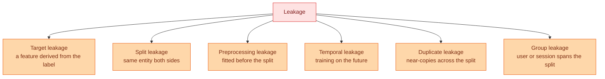

# Lineage, Versioning, Privacy and Leakage

**Level:** 🔴 Advanced &nbsp;|&nbsp; **Effort:** Detailed module &nbsp;|&nbsp; **Module:** [03 Data Foundations](README.md)

---

## 🎯 Learning Objectives

By the end of this topic you will be able to:

- Record lineage so any result can be traced back to the data that produced it
- Version datasets without committing gigabytes to Git
- Recognise the six kinds of leakage, and detect each one
- Explain why leakage produces excellent scores and worthless models
- Apply minimisation, pseudonymisation and anonymisation, and say how they differ
- Explain why k-anonymity is not enough

## 📚 Prerequisites

[Topic 4: Encoding and Validation](04-encoding-and-data-validation.md)

---

## 1. Lineage: which data produced this number?

Six months after a model ships, someone asks why it made a decision. **Without lineage you cannot
answer.**

```python
import hashlib
import json
from dataclasses import asdict, dataclass, field
from pathlib import Path


@dataclass(frozen=True)
class DatasetVersion:
    """Enough to reproduce a dataset exactly, and to prove which one was used."""
    name: str
    path: str
    content_hash: str
    rows: int
    source: str
    created: str
    transformations: tuple = field(default_factory=tuple)

    @classmethod
    def from_file(cls, path, source, created, transformations=()):
        data = Path(path).read_bytes()
        return cls(
            name=Path(path).name,
            path=str(path),
            content_hash=hashlib.sha256(data).hexdigest()[:16],
            rows=data.count(b"\n") - 1,
            source=source,
            created=created,
            transformations=tuple(transformations),
        )


version = DatasetVersion.from_file(
    "datasets/samples/housing.csv",
    source="scripts/make_sample_datasets.py (synthetic, seed 20260729)",
    created="2026-08-31",
    transformations=("generated", "no cleaning applied"),
)

print(json.dumps(asdict(version), indent=2))
print()
print("Change one byte of the file and the hash changes, so a stale copy cannot masquerade")
print("as the version a result was computed from.")
```

**Output:**
```
{
  "name": "housing.csv",
  "path": "datasets/samples/housing.csv",
  "content_hash": "81541777a0f6a923",
  "rows": 150,
  "source": "scripts/make_sample_datasets.py (synthetic, seed 20260729)",
  "created": "2026-08-31",
  "transformations": [
    "generated",
    "no cleaning applied"
  ]
}

Change one byte of the file and the hash changes, so a stale copy cannot masquerade
as the version a result was computed from.
```

**The content hash is what makes this more than a comment.** A path and a date can drift; a hash
cannot. Store this alongside the model
([module 01, topic 14](../01-python-foundations/14-your-first-scikit-learn-model.md)) and "which
data produced this model" has an answer that survives people leaving the team.

### What a lineage record should capture

| Field | Why |
| --- | --- |
| Source system and query | Where it came from |
| Extraction timestamp | Data changes; "the customers table" is not a fixed thing |
| Content hash | Detects silent modification |
| Row and column counts | Cheap tripwire for truncation |
| Transformations applied, in order | The gap between raw and what you trained on |
| Code version (git SHA) | The transformations are code |
| Schema version | Lets you reject data from an unknown shape |

---

## 2. Versioning data without wrecking your repository

**Git is designed for text that changes in small diffs.** A 2 GB Parquet file is neither, and
committing one bloats the repository permanently — history keeps every version forever.

| Approach | How it works | Suits |
| --- | --- | --- |
| **Commit it** | Only for genuinely small files | This repository's `datasets/samples/` (kilobytes) |
| **Generate it** | Commit the *script*, not the output | Synthetic data — the approach used here |
| **Content-addressed storage** | Store by hash in object storage; commit a pointer | Most real datasets |
| **DVC / LakeFS / Delta Lake** | Git-like versioning over object storage | Teams, larger data |
| **Immutable partitions** | `date=2026-09-01/` directories, never rewritten | Streaming and warehouse data |

**This repository uses the second and shows the fourth pattern's core idea**: a committed pointer
file that identifies content by hash.

```python
import hashlib
import json
from pathlib import Path

# The pattern: commit a small pointer, store the real bytes elsewhere by hash.
def make_pointer(path):
    data = Path(path).read_bytes()
    digest = hashlib.sha256(data).hexdigest()
    return {
        "path": str(path),
        "sha256": digest,
        "size_bytes": len(data),
        "storage_uri": f"s3://example-bucket/datasets/{digest[:2]}/{digest}",
    }


pointer = make_pointer("datasets/samples/housing.csv")
print(json.dumps(pointer, indent=2))
print()
print(f"the pointer is {len(json.dumps(pointer))} bytes; the data is {pointer['size_bytes']} bytes")
print("for a 2 GB dataset the pointer is still about 200 bytes")
```

**Output:**
```
{
  "path": "datasets/samples/housing.csv",
  "sha256": "81541777a0f6a9235c3dd2bdfb17bc65c628a96a30ed85cab74c6ac65256c17b",
  "size_bytes": 4128,
  "storage_uri": "s3://example-bucket/datasets/81/81541777a0f6a9235c3dd2bdfb17bc65c628a96a30ed85cab74c6ac65256c17b"
}

the pointer is 253 bytes; the data is 4128 bytes
for a 2 GB dataset the pointer is still about 200 bytes
```

**Two properties make this work.** Identical content produces one stored object regardless of how
many datasets reference it, and **a dataset cannot change without its pointer changing** — so a
commit that alters data is visible in a diff.

---

## 3. Leakage: the failure that looks like success

**Leakage is information in your training data that will not be available at prediction time.** It
produces excellent validation scores and models that fail immediately in production.



### Target leakage: the feature that knows the answer

```python
import numpy as np
import pandas as pd
from sklearn.linear_model import LogisticRegression
from sklearn.model_selection import cross_val_score

rng = np.random.default_rng(0)
n = 2000

frame = pd.DataFrame({
    "account_age_days": rng.integers(1, 2000, n),
    "monthly_spend": rng.normal(50, 20, n),
})
# The real relationship is weak and noisy.
logit = -2 + 0.0008 * frame["account_age_days"] - 0.02 * frame["monthly_spend"]
frame["churned"] = (rng.random(n) < 1 / (1 + np.exp(-logit))).astype(int)

# A column that only exists BECAUSE the customer churned.
frame["cancellation_survey_sent"] = frame["churned"] * (rng.random(n) < 0.92)

honest = ["account_age_days", "monthly_spend"]
leaky = honest + ["cancellation_survey_sent"]

print(f"{'features':<28}{'cross-validated accuracy':>28}")
for name, columns in [("honest features", honest), ("with the leaked column", leaky)]:
    score = cross_val_score(LogisticRegression(max_iter=1000), frame[columns],
                            frame["churned"], cv=5).mean()
    print(f"{name:<28}{score:>28.4f}")

print()
print("The leaked column is only ever populated AFTER a customer churns.")
print("At prediction time - for a customer who has not churned - it is always zero.")
print("The model has learned to read the answer, and in production it will read nothing.")
```

**Output:**
```
features                        cross-validated accuracy
honest features                                   0.8775
with the leaked column                            0.9955

The leaked column is only ever populated AFTER a customer churns.
At prediction time - for a customer who has not churned - it is always zero.
The model has learned to read the answer, and in production it will read nothing.
```

**A jump like that is a bug report, not a result.** The rule: for every feature, ask **"would I know
this at the moment I need the prediction?"** A cancellation survey, a refund flag, a closing date, a
support ticket about the outage — all recorded after the event they supposedly predict.

### Group leakage: the same entity on both sides

```python
import numpy as np
import pandas as pd
from sklearn.ensemble import RandomForestClassifier
from sklearn.metrics import accuracy_score
from sklearn.model_selection import GroupShuffleSplit, train_test_split

rng = np.random.default_rng(1)
n_users, per_user = 200, 8
names = [f"u{i:03d}" for i in range(n_users)]

# Each user has a near-constant "fingerprint" feature - and a label that the fingerprint
# does NOT predict. So the only way to get the label right is to recognise the user.
fingerprint = dict(zip(names, rng.normal(0, 5, n_users)))
label_of = dict(zip(names, rng.integers(0, 2, n_users)))

frame = pd.DataFrame({"user": np.repeat(names, per_user)})
frame["feature"] = frame["user"].map(fingerprint) + rng.normal(0, 0.05, len(frame))
frame["label"] = frame["user"].map(label_of)

X, y, groups = frame[["feature"]], frame["label"], frame["user"]

# Wrong: random split - the same user appears in train and test.
Xtr, Xte, ytr, yte = train_test_split(X, y, test_size=0.25, random_state=0)
random_score = accuracy_score(yte, RandomForestClassifier(random_state=0).fit(Xtr, ytr).predict(Xte))

# Right: group split - a user is wholly in train or wholly in test.
splitter = GroupShuffleSplit(n_splits=1, test_size=0.25, random_state=0)
train_idx, test_idx = next(splitter.split(X, y, groups))
group_score = accuracy_score(
    y.iloc[test_idx],
    RandomForestClassifier(random_state=0).fit(X.iloc[train_idx], y.iloc[train_idx]).predict(X.iloc[test_idx]),
)

overlap = len(set(groups.iloc[Xtr.index]) & set(groups.iloc[Xte.index]))

print(f"random split accuracy: {random_score:.4f}")
print(f"group split accuracy:  {group_score:.4f}")
print()
print(f"users appearing in BOTH train and test under the random split: {overlap} of {n_users}")
print(f"under the group split: 0")
```

**Output:**
```
random split accuracy: 0.7175
group split accuracy:  0.5125

users appearing in BOTH train and test under the random split: 184 of 200
under the group split: 0
```

**The label is pure per-user noise — genuinely unpredictable from the feature.** Yet the random
split reports 72% accuracy, because 184 of 200 users appear on both sides: the model recognises the
fingerprint and looks up the label it memorised. The group split reports 51%, which is the truth:
for a user never seen before, this feature says nothing.

**The random split is not measuring what you think.** It answers "can I predict for a user I have
already seen", while production asks "can I predict for a *new* user". Whenever rows are grouped by
user, session, device, patient or store, use `GroupShuffleSplit` or `GroupKFold`.

### Temporal leakage

```python
import numpy as np
import pandas as pd

rng = np.random.default_rng(2)
dates = pd.date_range("2026-01-01", periods=400, freq="D")
frame = pd.DataFrame({"date": dates, "value": np.cumsum(rng.normal(0, 1, 400)) + 100})

# Random split: the test set is surrounded by training points from either side.
shuffled = frame.sample(frac=1, random_state=0)
random_train, random_test = shuffled.iloc[:300], shuffled.iloc[300:]

# Chronological split: train on the past, test on the future.
time_train, time_test = frame.iloc[:300], frame.iloc[300:]

print(f"{'split':<16}{'train dates':>26}{'test dates':>26}")
print(f"{'random':<16}{f'{random_train.date.min().date()} to {random_train.date.max().date()}':>26}"
      f"{f'{random_test.date.min().date()} to {random_test.date.max().date()}':>26}")
print(f"{'chronological':<16}{f'{time_train.date.min().date()} to {time_train.date.max().date()}':>26}"
      f"{f'{time_test.date.min().date()} to {time_test.date.max().date()}':>26}")
print()
overlap = (random_test.date < random_train.date.max()).sum()
print(f"random split: {overlap} of {len(random_test)} test points fall INSIDE the training period")
print("so the model interpolates between known neighbours instead of forecasting")
```

**Output:**
```
split                          train dates                test dates
random            2026-01-01 to 2027-02-04  2026-01-10 to 2027-02-03
chronological     2026-01-01 to 2026-10-27  2026-10-28 to 2027-02-04

random split: 100 of 100 test points fall INSIDE the training period
so the model interpolates between known neighbours instead of forecasting
```

**Under a random split the test dates are interleaved with training dates.** For a time series that
is not prediction, it is interpolation — and it is why a naive forecast evaluation can look superb
and then fail on the first real week.

### A leakage checklist

| Kind | Detect it by | Fix |
| --- | --- | --- |
| **Target** | A single feature with implausible importance | Ask "would I know this at prediction time?" |
| **Split** | Row identifiers appearing on both sides | `isdisjoint` assertion |
| **Preprocessing** | Scaler or imputer fitted before splitting | `Pipeline` |
| **Temporal** | Test timestamps inside the training range | Chronological split |
| **Duplicate** | Identical or near-identical rows across the split | Deduplicate **before** splitting |
| **Group** | Same user, session or device on both sides | `GroupShuffleSplit`, `GroupKFold` |

**The universal symptom is a score that is too good.** Treat it as a bug report every time.

---

## 4. Privacy

### Three levels, frequently confused

| Level | What it does | Reversible? |
| --- | --- | --- |
| **Minimisation** | Do not collect what you will not use | N/A — the strongest control |
| **Pseudonymisation** | Replace identifiers with tokens, keep a mapping | **Yes** — still personal data |
| **Anonymisation** | Remove identifiability entirely | No — if done properly |

**Pseudonymised data is still personal data** under most data-protection regimes, because the
mapping exists. Calling it "anonymised" in a design document is a common and consequential error.

```python
import hashlib

def pseudonymise(value, salt):
    """Deterministic token. Reversible by anyone who has the salt and can guess inputs."""
    return hashlib.sha256((salt + value).encode()).hexdigest()[:12]


emails = ["ann@example.com", "bob@example.com", "ann@example.com"]
salt = "a-secret-kept-elsewhere"

for email in emails:
    print(f"{email:<20} -> {pseudonymise(email, salt)}")

print()
print("Same input, same token - which is what makes joins possible, and what makes it reversible.")
print("Anyone with the salt can hash a guessed email and confirm whether it is present.")
```

**Output:**
```
ann@example.com      -> 50432b7d76cc
bob@example.com      -> 302c7a6b15c4
ann@example.com      -> 50432b7d76cc

Same input, same token - which is what makes joins possible, and what makes it reversible.
Anyone with the salt can hash a guessed email and confirm whether it is present.
```

**That last line is the flaw people miss.** Hashing an email is not anonymisation: the space of
email addresses is guessable, so a hash is a lookup key for anyone holding the salt. Rotate salts,
store them separately from the data, and do not describe the result as anonymous.

### ⚠️ k-anonymity, and why it is not enough

```python
import pandas as pd

records = pd.DataFrame({
    "postcode": ["SW1A", "SW1A", "SW1A", "EC2R", "EC2R", "EC2R"],
    "age_band": ["30-39", "30-39", "30-39", "40-49", "40-49", "40-49"],
    "condition": ["flu", "flu", "flu", "asthma", "diabetes", "flu"],
})

groups = records.groupby(["postcode", "age_band"])
k = groups.size().min()

print(f"k-anonymity: every combination of quasi-identifiers appears at least {k} times")
print()
for keys, group in groups:
    conditions = set(group["condition"])
    print(f"  {keys}: {len(group)} people, conditions {sorted(conditions)}"
          f"{'   <- ALL THE SAME' if len(conditions) == 1 else ''}")

print()
print("The first group satisfies k=3 and still discloses everything:")
print("knowing someone is in SW1A and aged 30-39 tells you they have flu.")
```

**Output:**
```
k-anonymity: every combination of quasi-identifiers appears at least 3 times

  ('EC2R', '40-49'): 3 people, conditions ['asthma', 'diabetes', 'flu']
  ('SW1A', '30-39'): 3 people, conditions ['flu']   <- ALL THE SAME

The first group satisfies k=3 and still discloses everything:
knowing someone is in SW1A and aged 30-39 tells you they have flu.
```

**k-anonymity protects against identifying *which row* someone is, not against learning their
sensitive value.** When every row in a group shares an attribute, the group discloses it. That is
the *homogeneity attack*, and it is why l-diversity and t-closeness exist — and why differential
privacy, which bounds what any single individual's presence can change about an output, has largely
superseded the whole family.

### 🔐 Practical rules

- **Minimise first.** The safest data is the data you did not collect.
- **Never commit personal data**, pseudonymised or not. This repository's datasets are synthetic for
  that reason.
- **Strip metadata** on ingest — EXIF GPS is the classic.
- **Free text and images contain identifiers no schema flags.** Detection, not column selection.
- **Set a retention period** and enforce it automatically.
- **Have a deletion path**, including from training sets and, ideally, from models.
- **Quasi-identifiers combine.** Postcode, birth date and sex identify a large fraction of a
  population; dropping the name column is not anonymisation.

> **Not legal advice.** Requirements vary by jurisdiction and change. Consult qualified counsel for
> anything involving personal data, and see [26 Responsible AI](../26-responsible-ai/README.md).

---

## 🧪 Hands-on lab: a leakage audit

Run this before trusting any model.

```python
import numpy as np
import pandas as pd


def leakage_audit(frame, target, group_column=None, time_column=None, id_column=None):
    """Checks that catch the common leakage patterns. None of these are expensive."""
    findings = []

    # 1. A feature suspiciously correlated with the target
    numeric = frame.select_dtypes("number").drop(columns=[target], errors="ignore")
    for column in numeric.columns:
        correlation = abs(numeric[column].corr(frame[target]))
        if correlation > 0.95:
            findings.append(f"SUSPICIOUS: '{column}' correlates {correlation:.4f} with the target")

    # 2. A feature that is constant within each target class (a derived flag)
    for column in numeric.columns:
        per_class = frame.groupby(target)[column].nunique()
        if (per_class == 1).all():
            findings.append(f"SUSPICIOUS: '{column}' takes one value per target class")

    # 3. Duplicate rows, which will span any split
    duplicates = int(frame.duplicated().sum())
    if duplicates:
        findings.append(f"{duplicates} exact duplicate rows - deduplicate BEFORE splitting")

    # 4. Repeated entities, which need a group split
    if group_column:
        counts = frame[group_column].value_counts()
        repeated = int((counts > 1).sum())
        if repeated:
            findings.append(
                f"{repeated} values of '{group_column}' appear more than once "
                f"(max {counts.max()}) - use GroupShuffleSplit, not train_test_split")

    # 5. Time ordering, which forbids a random split
    if time_column:
        findings.append(
            f"'{time_column}' present - use a chronological split, "
            f"range {frame[time_column].min()} to {frame[time_column].max()}")

    # 6. Non-unique identifiers
    if id_column and frame[id_column].duplicated().any():
        findings.append(f"'{id_column}' is not unique - {int(frame[id_column].duplicated().sum())} repeats")

    return findings


print("=== housing.csv ===")
housing = pd.read_csv("datasets/samples/housing.csv")
for finding in leakage_audit(housing, "price_thousands", id_column="property_id") or ["no findings"]:
    print(f"  {finding}")

print("\n=== reviews.csv ===")
reviews = pd.read_csv("datasets/samples/reviews.csv")
reviews["is_positive"] = (reviews["label"].str.strip().str.lower() == "positive").astype(int)
for finding in leakage_audit(reviews, "is_positive", id_column="review_id") or ["no findings"]:
    print(f"  {finding}")

print("\n=== sensor_readings.csv ===")
sensors = pd.read_csv("datasets/samples/sensor_readings.csv", parse_dates=["timestamp"])
sensors["is_warm"] = (sensors["temperature_c"] > 18).astype(int)
for finding in leakage_audit(sensors, "is_warm", group_column="sensor_id",
                             time_column="timestamp") or ["no findings"]:
    print(f"  {finding}")
```

**Output:**
```
=== housing.csv ===
  SUSPICIOUS: 'area_sqm' correlates 0.9639 with the target

=== reviews.csv ===
  2 exact duplicate rows - deduplicate BEFORE splitting
  'review_id' is not unique - 2 repeats

=== sensor_readings.csv ===
  3 values of 'sensor_id' appear more than once (max 80) - use GroupShuffleSplit, not train_test_split
  'timestamp' present - use a chronological split, range 2026-03-01 00:00:00 to 2026-03-04 07:00:00
```

**Read the `housing.csv` finding carefully, because it is wrong.**

The audit flags `area_sqm` for correlating 0.96 with price. That is not leakage — floor area is a
legitimate, causally sensible predictor that is perfectly well known before a sale. The audit cannot
tell the difference between "suspiciously informative" and "genuinely informative", because that
distinction is about *when the value becomes available*, which is not in the data.

**This is the correct behaviour for an automated check: it produces candidates, and a human
adjudicates.** An audit tuned to never raise a false positive would also miss real leakage. Treat
every finding as a question to answer, not a verdict.

The other two files show genuine findings. `reviews.csv` has duplicate rows and repeated
`review_id` values, both of which will span a split. `sensor_readings.csv` has repeated groups *and*
a time column, so it needs a group-aware **and** chronological treatment — neither a random split
nor a plain group split is sufficient on its own.

**Extend it:** add a check for near-duplicate text using a similarity threshold; add a check that
flags any feature whose name contains words like `final`, `closed`, `resolved` or `cancelled`, which
are frequently post-outcome; and turn the audit into a `pytest` test that fails the build.

---

## 🎤 Interview questions

**"What is data leakage and why is it so dangerous?"**

It is information present in training that will not be available at prediction time. It is dangerous
precisely because it does not look like a bug: validation scores improve, so it is rewarded by every
process you have. The failure only appears in production, where the leaked signal is absent, and by
then the model has been approved on the strength of the inflated number. The universal warning sign
is a score that is better than the problem should allow.

**"Name the kinds of leakage and how you would detect each."**

Target leakage — a feature derived from the outcome, spotted by implausible feature importance and
by asking whether the value exists at prediction time. Split leakage — the same row or entity on
both sides, caught with a disjointness assertion. Preprocessing leakage — scalers or imputers fitted
before the split, prevented structurally by a Pipeline. Temporal leakage — test points inside the
training time range, fixed with a chronological split. Duplicate leakage — near-identical rows
spanning the split, fixed by deduplicating first. Group leakage — a user or session in both sets,
fixed with GroupKFold.

**"What is the difference between pseudonymisation and anonymisation?"**

Pseudonymisation replaces identifiers with tokens while a mapping still exists, so it is reversible
and the data remains personal data under most regimes. Anonymisation removes identifiability
irreversibly. Hashing an email is pseudonymisation, not anonymisation, because the input space is
small enough to enumerate — anyone with the salt can confirm whether a given address is present.

**"Why is k-anonymity insufficient?"**

Because it guarantees only that each combination of quasi-identifiers appears k times, not that the
group is diverse in the sensitive attribute. If all k people in a group share a diagnosis, knowing
someone is in that group discloses it entirely — the homogeneity attack. l-diversity and t-closeness
address that, and differential privacy takes a different approach by bounding how much any single
individual's presence can change an output.

**"How would you version a 50 GB dataset?"**

Not in Git. Store the bytes in content-addressed object storage and commit a small pointer file
containing the hash, size and URI, so the repository stays small while a diff still shows when data
changed. Tools like DVC or LakeFS automate that. For continuously arriving data, immutable
date-partitioned directories that are never rewritten give versioning for free. In every case,
record the hash alongside the model so a result can be traced to the exact bytes that produced it.

---

## ✅ Key takeaways

- **A content hash makes lineage real.** Paths and dates drift; hashes do not.
- Record source, timestamp, hash, row counts, transformations and code version.
- **Never commit large data to Git** — history keeps every version forever. Commit a pointer, or the
  script that generates it.
- **Leakage produces great scores and worthless models**, and every process you have rewards it.
- Six kinds: target, split, preprocessing, temporal, duplicate, group.
- For every feature ask: **"would I know this at the moment I need the prediction?"**
- A random split on grouped data measures "predict for a known user", not "predict for a new user".
- A random split on a time series is interpolation, not forecasting.
- **Pseudonymised data is still personal data.** Hashing an email is not anonymisation.
- **k-anonymity does not stop the homogeneity attack** — a uniform group discloses its attribute.
- Minimisation is the strongest privacy control: the safest data is what you never collected.

---

## 📚 Official References

- [scikit-learn: Common pitfalls — data leakage — scikit-learn developers](https://scikit-learn.org/stable/common_pitfalls.html#data-leakage) — verified 2026-09-01
- [sklearn.model_selection.GroupShuffleSplit — scikit-learn developers](https://scikit-learn.org/stable/modules/generated/sklearn.model_selection.GroupShuffleSplit.html) — verified 2026-09-01
- [sklearn.model_selection.TimeSeriesSplit — scikit-learn developers](https://scikit-learn.org/stable/modules/generated/sklearn.model_selection.TimeSeriesSplit.html) — verified 2026-09-01
- [Python: hashlib — Python Software Foundation](https://docs.python.org/3/library/hashlib.html) — verified 2026-09-01
- [DVC documentation *(community resource)*](https://dvc.org/doc) — verified 2026-09-01
- [The Algorithmic Foundations of Differential Privacy — Dwork and Roth *(community resource)*](https://www.cis.upenn.edu/~aaroth/Papers/privacybook.pdf) — verified 2026-09-01

---

## 🔗 Navigation

[← Topic 4: Encoding and Validation](04-encoding-and-data-validation.md) &nbsp;|&nbsp;
[Module home](README.md) &nbsp;|&nbsp;
[Topic 6: Splits, Sampling and Class Imbalance →](06-splits-sampling-and-class-imbalance.md)
