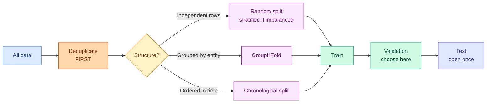

# Splits, Sampling and Class Imbalance

**Level:** 🟡 Intermediate &nbsp;|&nbsp; **Effort:** Detailed module &nbsp;|&nbsp; **Module:** [03 Data Foundations](README.md)

---

## 🎯 Learning Objectives

By the end of this topic you will be able to:

- Choose the right split strategy for the structure your data actually has
- Explain what train, validation and test sets are each for, and what breaks when you confuse them
- Use stratified, grouped and time-series splits correctly
- Size a test set so it can resolve the difference you care about
- Handle class imbalance, and say why resampling is often the wrong first move
- Explain why resampling belongs inside the cross-validation loop

## 📚 Prerequisites

[Topic 5: Lineage, Versioning, Privacy and Leakage](05-lineage-versioning-privacy-and-leakage.md)

---

## 1. Three sets, three jobs

| Set | Used for | Touched how often |
| --- | --- | --- |
| **Train** | Fitting parameters | Constantly |
| **Validation** | Choosing between models and hyperparameters | Many times |
| **Test** | One final honest estimate | **Once** |

**The test set is a budget you spend once.** Every decision informed by it — a model choice, a
threshold, an early stop — transfers a little of its information into your model, and its estimate
becomes optimistic. That is not a rule of etiquette; it is the same multiple-comparisons problem
from [module 02, topic 8](../02-mathematics-for-ai/08-hypothesis-testing-and-ab-testing.md).

```python
import numpy as np

rng = np.random.default_rng(0)

# 40 models, all equally useless - each scores 50% in truth.
n_models, test_size = 40, 400
true_accuracy = 0.50

scores = rng.binomial(test_size, true_accuracy, size=n_models) / test_size
best = scores.max()

print(f"{n_models} models, every one genuinely {true_accuracy:.0%} accurate")
print(f"test set size: {test_size}")
print()
print(f"mean measured accuracy:  {scores.mean():.4f}")
print(f"BEST measured accuracy:  {best:.4f}")
print(f"optimism from picking the winner: {best - true_accuracy:+.4f}")
print()
print("Pick the best of 40 on the test set and you report an accuracy that is")
print("about 4 points too high - purely from selection, with no real difference at all.")
```

**Output:**
```
40 models, every one genuinely 50% accurate
test set size: 400

mean measured accuracy:  0.4968
BEST measured accuracy:  0.5325
optimism from picking the winner: +0.0325

Pick the best of 40 on the test set and you report an accuracy that is
about 4 points too high - purely from selection, with no real difference at all.
```

**That is why the validation set exists.** Selection happens there, and the test set stays sealed so
its estimate is unbiased.



---

## 2. Stratification: keeping the class balance

```python
import numpy as np
import pandas as pd
from sklearn.model_selection import train_test_split

rng = np.random.default_rng(7)
n = 1000
# 3% positive class - realistic for fraud, defects or rare disease.
y = pd.Series((rng.random(n) < 0.03).astype(int))
X = pd.DataFrame({"feature": rng.normal(size=n)})

print(f"overall positive rate: {y.mean():.4f} ({y.sum()} of {n})")
print()
print(f"{'split':<16}{'train positives':>18}{'test positives':>17}{'test rate':>12}")
for seed in [0, 1, 2]:
    _, _, ytr, yte = train_test_split(X, y, test_size=0.2, random_state=seed)
    print(f"{'random ' + str(seed):<16}{ytr.sum():>18}{yte.sum():>17}{yte.mean():>12.4f}")

for seed in [0, 1, 2]:
    _, _, ytr, yte = train_test_split(X, y, test_size=0.2, random_state=seed, stratify=y)
    print(f"{'stratified ' + str(seed):<16}{ytr.sum():>18}{yte.sum():>17}{yte.mean():>12.4f}")
```

**Output:**
```
overall positive rate: 0.0250 (25 of 1000)

split              train positives   test positives   test rate
random 0                        17                8      0.0400
random 1                        21                4      0.0200
random 2                        19                6      0.0300
stratified 0                    20                5      0.0250
stratified 1                    20                5      0.0250
stratified 2                    20                5      0.0250
```

**Without stratification the test positive count swings between splits.** With a 3% class and 200
test rows you expect 6 positives; landing on 3 or 9 changes your measured recall enormously and none
of that variation is about the model.

**Stratify whenever a class is rare.** It costs nothing and removes a source of noise you cannot
otherwise control.

### ⚠️ Stratification does not fix a class too rare to evaluate

```python
import numpy as np

print(f"{'positive rate':>15}{'test size':>12}{'expected positives':>21}{'verdict':>28}")
for rate in [0.05, 0.01, 0.001]:
    for size in [200, 2_000, 20_000]:
        expected = rate * size
        verdict = ("unusable" if expected < 5 else
                   "very noisy" if expected < 30 else "workable")
        print(f"{rate:>15.3f}{size:>12,}{expected:>21.1f}{verdict:>28}")
```

**Output:**
```
  positive rate   test size   expected positives                     verdict
          0.050         200                 10.0                  very noisy
          0.050       2,000                100.0                    workable
          0.050      20,000               1000.0                    workable
          0.010         200                  2.0                    unusable
          0.010       2,000                 20.0                  very noisy
          0.010      20,000                200.0                    workable
          0.001         200                  0.2                    unusable
          0.001       2,000                  2.0                    unusable
          0.001      20,000                 20.0                  very noisy
```

**With a 0.1% positive rate and 2,000 test rows you expect two positives.** Recall measured on two
examples is meaningless whatever you do to the split. The answer is a bigger test set, or a
different metric, not a cleverer split.

---

## 3. Grouped and time-series splits

### Grouped data

```python
import numpy as np
import pandas as pd
from sklearn.model_selection import GroupKFold, KFold

rng = np.random.default_rng(0)
frame = pd.DataFrame({
    "patient": np.repeat([f"p{i:02d}" for i in range(20)], 5),
    "scan": range(100),
})

plain = KFold(n_splits=5, shuffle=True, random_state=0)
grouped = GroupKFold(n_splits=5)

print(f"{'fold':<7}{'KFold: patients in both':>26}{'GroupKFold: patients in both':>32}")
for fold, ((tr1, te1), (tr2, te2)) in enumerate(zip(
        plain.split(frame), grouped.split(frame, groups=frame["patient"]), strict=True)):
    overlap_plain = len(set(frame.patient.iloc[tr1]) & set(frame.patient.iloc[te1]))
    overlap_group = len(set(frame.patient.iloc[tr2]) & set(frame.patient.iloc[te2]))
    print(f"{fold:<7}{overlap_plain:>26}{overlap_group:>32}")
```

**Output:**
```
fold      KFold: patients in both    GroupKFold: patients in both
0                              14                               0
1                              15                               0
2                              13                               0
3                              14                               0
4                              14                               0
```

**Every fold of the plain `KFold` puts nearly every patient on both sides.** For medical imaging that
means the model can memorise a patient rather than learn the condition, and the reported accuracy
describes a task nobody needs solved.

### Time series

```python
import numpy as np
import pandas as pd
from sklearn.model_selection import TimeSeriesSplit

dates = pd.date_range("2026-01-01", periods=300, freq="D")
frame = pd.DataFrame({"date": dates, "value": np.arange(300)})

splitter = TimeSeriesSplit(n_splits=5)

print(f"{'fold':<6}{'train':>10}{'test':>8}   train period                test period")
for fold, (train_idx, test_idx) in enumerate(splitter.split(frame)):
    tr, te = frame.iloc[train_idx], frame.iloc[test_idx]
    print(f"{fold:<6}{len(tr):>10}{len(te):>8}   "
          f"{tr.date.min().date()} to {tr.date.max().date()}   "
          f"{te.date.min().date()} to {te.date.max().date()}")
```

**Output:**
```
fold       train    test   train period                test period
0             50      50   2026-01-01 to 2026-02-19   2026-02-20 to 2026-04-10
1            100      50   2026-01-01 to 2026-04-10   2026-04-11 to 2026-05-30
2            150      50   2026-01-01 to 2026-05-30   2026-05-31 to 2026-07-19
3            200      50   2026-01-01 to 2026-07-19   2026-07-20 to 2026-09-07
4            250      50   2026-01-01 to 2026-09-07   2026-09-08 to 2026-10-27
```

**The training window grows and the test window always follows it.** That is the only honest way to
evaluate a forecast: every prediction is made using nothing but the past.

### ⚠️ Add a gap when features look backwards

If a feature is a 7-day rolling average, the last training row and the first test row **share
data**. A gap between them removes that overlap.

```python
import numpy as np
import pandas as pd

dates = pd.date_range("2026-01-01", periods=100, freq="D")
frame = pd.DataFrame({"date": dates, "value": np.arange(100.0)})
frame["rolling_7d"] = frame["value"].rolling(7).mean()

split_at = 80
naive_train, naive_test = frame.iloc[:split_at], frame.iloc[split_at:]

gap = 7
gapped_train, gapped_test = frame.iloc[:split_at - gap], frame.iloc[split_at:]

print(f"naive split: last training row is {naive_train.date.iloc[-1].date()}")
print(f"  its rolling_7d covers {naive_train.date.iloc[-7].date()} to {naive_train.date.iloc[-1].date()}")
print(f"  first test row is {naive_test.date.iloc[0].date()}")
print(f"  that test row's rolling_7d covers "
      f"{frame.date.iloc[split_at - 6].date()} to {frame.date.iloc[split_at].date()}")
print(f"  -> the test feature is built from {gap - 1} training days")
print()
print(f"with a {gap}-day gap: training ends {gapped_train.date.iloc[-1].date()}, "
      f"testing starts {gapped_test.date.iloc[0].date()}")
print("  -> no shared days")
```

**Output:**
```
naive split: last training row is 2026-03-21
  its rolling_7d covers 2026-03-15 to 2026-03-21
  first test row is 2026-03-22
  that test row's rolling_7d covers 2026-03-16 to 2026-03-22
  -> the test feature is built from 6 training days

with a 7-day gap: training ends 2026-03-14, testing starts 2026-03-22
  -> no shared days
```

**The test row's own feature is computed partly from training days.** With a gap equal to the
longest lookback window, that overlap disappears. Forgetting this is a subtle, common and
expensive form of temporal leakage.

---

## 4. Sizing the test set

**A test set too small to detect the difference you care about is not a test set.** This is the
sample-size question from
[module 02, topic 8](../02-mathematics-for-ai/08-hypothesis-testing-and-ab-testing.md), applied to
model comparison.

```python
import numpy as np

def margin_of_error(accuracy, n, z=1.96):
    return z * np.sqrt(accuracy * (1 - accuracy) / n)


print(f"{'test size':>11}{'95% margin':>13}{'can it resolve...':>20}")
for n in [100, 400, 1_000, 5_000, 20_000, 100_000]:
    margin = margin_of_error(0.85, n)
    resolves = "0.1 point?" if margin < 0.001 else \
               "0.5 point?" if margin < 0.005 else \
               "1 point?" if margin < 0.01 else \
               "2 points?" if margin < 0.02 else "5 points?" if margin < 0.05 else "nothing small"
    print(f"{n:>11,}{margin:>13.4f}{resolves:>20}")
```

**Output:**
```
  test size   95% margin   can it resolve...
        100       0.0700       nothing small
        400       0.0350           5 points?
      1,000       0.0221           5 points?
      5,000       0.0099            1 point?
     20,000       0.0049          0.5 point?
    100,000       0.0022          0.5 point?
```

**To resolve a one-point accuracy difference you need on the order of 5,000 test examples**, and a
400-item test set cannot see anything below about 3.5 points. Decide what difference matters, then
size accordingly — or state plainly that your test set cannot answer the question.

---

## 5. Class imbalance

### ⚠️ Imbalance is not automatically a problem

**The first question is whether imbalance is actually hurting you**, not which resampling method to
reach for.

```python
import numpy as np
from sklearn.dummy import DummyClassifier
from sklearn.linear_model import LogisticRegression
from sklearn.metrics import average_precision_score, f1_score, roc_auc_score
from sklearn.model_selection import train_test_split

rng = np.random.default_rng(0)
n = 20_000

X = rng.normal(size=(n, 4))
logit = -4.2 + 1.4 * X[:, 0] + 0.9 * X[:, 1]
y = (rng.random(n) < 1 / (1 + np.exp(-logit))).astype(int)

X_train, X_test, y_train, y_test = train_test_split(X, y, test_size=0.3, random_state=0, stratify=y)

print(f"positive rate: {y.mean():.4f} ({y.sum()} of {n})")
print()
baseline = DummyClassifier(strategy="most_frequent").fit(X_train, y_train)
model = LogisticRegression(max_iter=1000).fit(X_train, y_train)

print(f"{'model':<24}{'accuracy':>10}{'F1':>9}{'ROC AUC':>10}{'PR AUC':>9}")
for name, estimator in [("always predict majority", baseline), ("logistic regression", model)]:
    prediction = estimator.predict(X_test)
    proba = estimator.predict_proba(X_test)[:, 1]
    print(f"{name:<24}{(prediction == y_test).mean():>10.4f}{f1_score(y_test, prediction, zero_division=0):>9.4f}"
          f"{roc_auc_score(y_test, proba):>10.4f}{average_precision_score(y_test, proba):>9.4f}")
```

**Output:**
```
positive rate: 0.0440 (880 of 20000)

model                     accuracy       F1   ROC AUC   PR AUC
always predict majority     0.9560   0.0000    0.5000   0.0440
logistic regression         0.9573   0.1467    0.8544   0.2922
```

**The do-nothing baseline scores 98% accuracy and an F1 of zero.** That is the imbalance trap in one
line: accuracy is uninformative here, and any threshold-based metric depends on a threshold nobody
chose deliberately.

**Note that ROC AUC is respectable for the real model while PR AUC is far lower.** ROC AUC is
insensitive to class prevalence, which makes it flattering on rare-event problems; precision-recall
AUC is the honest summary. This is the base-rate effect from
[module 02, topic 6](../02-mathematics-for-ai/06-probability.md).

### What to try, in order

```python
import numpy as np
from sklearn.linear_model import LogisticRegression
from sklearn.metrics import average_precision_score, f1_score, precision_score, recall_score
from sklearn.model_selection import train_test_split

rng = np.random.default_rng(0)
n = 20_000
X = rng.normal(size=(n, 4))
logit = -4.2 + 1.4 * X[:, 0] + 0.9 * X[:, 1]
y = (rng.random(n) < 1 / (1 + np.exp(-logit))).astype(int)
X_train, X_test, y_train, y_test = train_test_split(X, y, test_size=0.3, random_state=0, stratify=y)

plain = LogisticRegression(max_iter=1000).fit(X_train, y_train)
weighted = LogisticRegression(max_iter=1000, class_weight="balanced").fit(X_train, y_train)

proba = plain.predict_proba(X_test)[:, 1]

print(f"{'approach':<34}{'precision':>11}{'recall':>9}{'F1':>8}")
for name, prediction in [
    ("default threshold 0.5", plain.predict(X_test)),
    ("class_weight='balanced'", weighted.predict(X_test)),
    ("threshold tuned to 0.10", (proba >= 0.10).astype(int)),
    ("threshold tuned to 0.05", (proba >= 0.05).astype(int)),
]:
    print(f"{name:<34}{precision_score(y_test, prediction, zero_division=0):>11.4f}"
          f"{recall_score(y_test, prediction, zero_division=0):>9.4f}"
          f"{f1_score(y_test, prediction, zero_division=0):>8.4f}")

print()
print(f"PR AUC is identical for every threshold: {average_precision_score(y_test, proba):.4f}")
print("because the ranking never changed - only where the line was drawn.")
```

**Output:**
```
approach                            precision   recall      F1
default threshold 0.5                  0.6111   0.0833  0.1467
class_weight='balanced'                0.1356   0.7803  0.2311
threshold tuned to 0.10                0.2072   0.5909  0.3068
threshold tuned to 0.05                0.1429   0.7500  0.2400

PR AUC is identical for every threshold: 0.2922
because the ranking never changed - only where the line was drawn.
```

**Moving the threshold changes precision and recall dramatically while the ranking is untouched.**
That is the key insight: **most "class imbalance problems" are threshold problems.** The model was
never broken; the default 0.5 cut-off simply did not match the cost of the two error types.

| Approach | When | Note |
| --- | --- | --- |
| **1. Change the metric** | Always first | Accuracy is not the metric; use PR AUC, F1, recall at fixed precision |
| **2. Tune the threshold** | Almost always | Free, reversible, no retraining |
| **3. Class weights** | Model supports it | `class_weight="balanced"` in scikit-learn |
| **4. Collect more minority data** | If possible | The only method that adds information |
| **5. Undersample the majority** | Huge datasets | Discards data |
| **6. Oversample / SMOTE** | Last resort | **Adds no information**; can encourage overfitting |

**Resampling is last, not first.** It changes the base rate your model sees, so its output
probabilities no longer reflect reality and need recalibration
([07 Model Evaluation](../07-model-evaluation/README.md)).

### 🔐 Resampling inside the fold, never before

```python
import numpy as np
from sklearn.linear_model import LogisticRegression
from sklearn.metrics import average_precision_score
from sklearn.model_selection import StratifiedKFold

rng = np.random.default_rng(3)
n = 4000
X = rng.normal(size=(n, 3))
y = (rng.random(n) < 0.05).astype(int)          # the features are pure noise: nothing to learn


def oversample(X_part, y_part, generator):
    minority = np.flatnonzero(y_part == 1)
    extra = generator.choice(minority, size=(y_part == 0).sum() - len(minority), replace=True)
    index = np.concatenate([np.arange(len(y_part)), extra])
    return X_part[index], y_part[index]


# WRONG: oversample the whole dataset, then cross-validate.
X_all, y_all = oversample(X, y, rng)
wrong = []
for train_idx, test_idx in StratifiedKFold(5, shuffle=True, random_state=0).split(X_all, y_all):
    model = LogisticRegression(max_iter=1000).fit(X_all[train_idx], y_all[train_idx])
    wrong.append(average_precision_score(y_all[test_idx], model.predict_proba(X_all[test_idx])[:, 1]))

# RIGHT: oversample only the training fold.
right = []
for train_idx, test_idx in StratifiedKFold(5, shuffle=True, random_state=0).split(X, y):
    X_res, y_res = oversample(X[train_idx], y[train_idx], rng)
    model = LogisticRegression(max_iter=1000).fit(X_res, y_res)
    right.append(average_precision_score(y[test_idx], model.predict_proba(X[test_idx])[:, 1]))

print("features are pure noise - the honest PR AUC is the positive rate, about 0.05")
print()
print(f"oversampled BEFORE splitting: PR AUC {np.mean(wrong):.4f}")
print(f"oversampled INSIDE each fold: PR AUC {np.mean(right):.4f}")
```

**Output:**
```
features are pure noise - the honest PR AUC is the positive rate, about 0.05

oversampled BEFORE splitting: PR AUC 0.5288
oversampled INSIDE each fold: PR AUC 0.0511
```

**Oversampling before the split copies minority rows into both train and test**, so the model is
scored on rows it memorised. On features containing no signal whatsoever, that produces a
respectable-looking score. Resample inside the fold — `imbalanced-learn`'s `Pipeline` does this
correctly; scikit-learn's plain `Pipeline` does not resample at all.

---

## 🧪 Hands-on lab: choose the split the data demands

```python
import numpy as np
import pandas as pd
from sklearn.model_selection import GroupShuffleSplit, train_test_split


def recommend_split(frame, target=None, group_column=None, time_column=None):
    """Pick a split strategy from the structure of the data, and say why."""
    reasons = []
    strategy = "random"

    if time_column is not None:
        strategy = "chronological"
        reasons.append(f"'{time_column}' present: a random split would train on the future")
    if group_column is not None:
        repeated = int((frame[group_column].value_counts() > 1).sum())
        if repeated:
            strategy = "grouped" if strategy == "random" else "grouped + chronological"
            reasons.append(f"{repeated} repeated values of '{group_column}': entities would span the split")
    if target is not None and frame[target].nunique() <= 20:
        rate = frame[target].value_counts(normalize=True).min()
        if rate < 0.2:
            reasons.append(f"minority class is {rate:.1%}: stratify, and check the test set has enough")
    if int(frame.duplicated().sum()):
        reasons.append(f"{int(frame.duplicated().sum())} duplicate rows: deduplicate BEFORE splitting")
    return strategy, reasons


datasets = {
    "housing.csv": (pd.read_csv("datasets/samples/housing.csv"), None, None, None),
    "reviews.csv": (pd.read_csv("datasets/samples/reviews.csv"), "label", None, None),
    "sensor_readings.csv": (pd.read_csv("datasets/samples/sensor_readings.csv", parse_dates=["timestamp"]),
                            None, "sensor_id", "timestamp"),
}

for name, (frame, target, group, time) in datasets.items():
    strategy, reasons = recommend_split(frame, target, group, time)
    print(f"{name}")
    print(f"  recommended split: {strategy.upper()}")
    for reason in reasons:
        print(f"    - {reason}")
    print()

# Apply the grouped recommendation and prove it holds.
sensors = pd.read_csv("datasets/samples/sensor_readings.csv", parse_dates=["timestamp"])
splitter = GroupShuffleSplit(n_splits=1, test_size=0.34, random_state=0)
train_idx, test_idx = next(splitter.split(sensors, groups=sensors["sensor_id"]))
train_sensors = set(sensors.sensor_id.iloc[train_idx])
test_sensors = set(sensors.sensor_id.iloc[test_idx])

print(f"grouped split: train sensors {sorted(train_sensors)}, test sensors {sorted(test_sensors)}")
print(f"disjoint: {train_sensors.isdisjoint(test_sensors)}")
print()
print("But note what a grouped split on 3 sensors actually gives you:")
print(f"  training on {len(train_sensors)} sensors, testing on {len(test_sensors)}")
print("  with so few groups, the estimate is extremely noisy - the group split is correct,")
print("  and the dataset is simply too small to evaluate generalisation across sensors.")
```

**Output:**
```
housing.csv
  recommended split: RANDOM

reviews.csv
  recommended split: RANDOM
    - minority class is 1.6%: stratify, and check the test set has enough
    - 2 duplicate rows: deduplicate BEFORE splitting

sensor_readings.csv
  recommended split: GROUPED + CHRONOLOGICAL
    - 'timestamp' present: a random split would train on the future
    - 3 repeated values of 'sensor_id': entities would span the split

grouped split: train sensors ['s-01'], test sensors ['s-02', 's-03']
disjoint: True

But note what a grouped split on 3 sensors actually gives you:
  training on 1 sensors, testing on 2
  with so few groups, the estimate is extremely noisy - the group split is correct,
  and the dataset is simply too small to evaluate generalisation across sensors.
```

**Look at what it says about `reviews.csv`: "minority class is 1.6%".** That is not a real minority
class — it is the single `NEGATIVE` row that
[Topic 3](03-cleaning-missing-duplicates-outliers.md) showed is just `negative` in the wrong case.
Profiling before cleaning produces exactly this kind of phantom finding, which is why the cleaning
step comes first and why an automated recommendation is a prompt to look, not an instruction to
follow.

**The last block is the honest ending.** Choosing the right split does not manufacture statistical
power. Three sensors cannot support a claim about unseen sensors, and the correct response is to say
so rather than to report a number from a one-sensor test set.

**Extend it:** implement a combined grouped-and-chronological split for the sensor data; add the
recommendation function to a `pytest` test that fails if a dataset gains a time column; and compute
how many sensors you would need to resolve a 5% difference between two models.

---

## 🎤 Interview questions

**"Why do you need a validation set as well as a test set?"**

Because selection inflates scores. Every time you use a set to choose between options — models,
hyperparameters, thresholds — you fit a little to its noise, so its estimate becomes optimistic.
Picking the best of 40 identical, genuinely useless models on a 400-item set yields an apparent
4-point gain from selection alone. The validation set absorbs that; the test set stays sealed so its
single estimate is unbiased.

**"When is a random split wrong?"**

When rows are not independent. Grouped data — multiple rows per user, patient, session or device —
needs a group split, or the model memorises the entity instead of learning the task. Ordered data
needs a chronological split, since a random one trains on the future. Data with near-duplicates
needs deduplication first. And rare classes need stratification so the test set contains enough
positives to measure anything.

**"How do you handle class imbalance?"**

In order: change the metric, because accuracy is meaningless when the majority class is 98%; then
tune the decision threshold, which is free and usually sufficient, since most imbalance problems are
really threshold problems; then class weights; then collect more minority data, which is the only
option that adds information. Resampling and SMOTE come last, add no information, and distort
predicted probabilities so they need recalibration. Whatever you use must happen inside the
cross-validation fold.

**"Why must resampling happen inside the fold?"**

Because oversampling before splitting copies minority rows into both training and validation, so the
model is evaluated on rows it has memorised. On data with no signal at all, that alone can produce a
respectable-looking score. The same applies to any fitted transformation — scalers, imputers,
encoders — and it is why pipelines exist.

**"Your test set is 400 items. What can you conclude from a 1-point accuracy improvement?"**

Nothing. At 85% accuracy on 400 items the 95% margin of error is about 3.5 points, so a 1-point
difference is well inside the noise. To resolve one point you need roughly 5,000 test examples. The
honest response is to say the test set cannot answer the question, and either enlarge it or use a
paired comparison such as McNemar's test, which is more powerful because it only considers items
where the models disagree.

---

## ✅ Key takeaways

- **Train fits, validation selects, test confirms — once.** Selection over 40 models can inflate a
  score by 4 points with no real difference.
- **Deduplicate before splitting.** Everything else is downstream of that.
- Stratify whenever a class is rare — but **stratification cannot fix a class too rare to evaluate**.
- Grouped data needs `GroupKFold`; ordered data needs a chronological split.
- **Add a gap equal to your longest lookback window**, or rolling features leak across the boundary.
- **A one-point difference needs about 5,000 test examples.** Size for the difference you care about.
- Accuracy is meaningless under imbalance — a do-nothing baseline scored 98%.
- **ROC AUC flatters rare-event problems; PR AUC is the honest summary.**
- **Most imbalance problems are threshold problems.** Tune the threshold before resampling anything.
- Resampling adds no information and distorts probabilities. **It must happen inside the fold.**
- Choosing the right split does not create statistical power that the data does not have.

---

## 📚 Official References

- [scikit-learn: Cross-validation — scikit-learn developers](https://scikit-learn.org/stable/modules/cross_validation.html) — verified 2026-09-01
- [sklearn.model_selection.StratifiedKFold — scikit-learn developers](https://scikit-learn.org/stable/modules/generated/sklearn.model_selection.StratifiedKFold.html) — verified 2026-09-01
- [sklearn.model_selection.GroupKFold — scikit-learn developers](https://scikit-learn.org/stable/modules/generated/sklearn.model_selection.GroupKFold.html) — verified 2026-09-01
- [sklearn.model_selection.TimeSeriesSplit — scikit-learn developers](https://scikit-learn.org/stable/modules/generated/sklearn.model_selection.TimeSeriesSplit.html) — verified 2026-09-01
- [scikit-learn: Metrics for imbalanced classification — scikit-learn developers](https://scikit-learn.org/stable/modules/model_evaluation.html#precision-recall-f-measure-metrics) — verified 2026-09-01
- [imbalanced-learn documentation *(community resource)*](https://imbalanced-learn.org/stable/) — verified 2026-09-01

---

## 🔗 Navigation

[← Topic 5: Lineage, Versioning, Privacy and Leakage](05-lineage-versioning-privacy-and-leakage.md) &nbsp;|&nbsp;
[Module home](README.md) &nbsp;|&nbsp;
[Topic 7: Synthetic Data, Augmentation and Feature Stores →](07-synthetic-data-augmentation-and-feature-stores.md)
