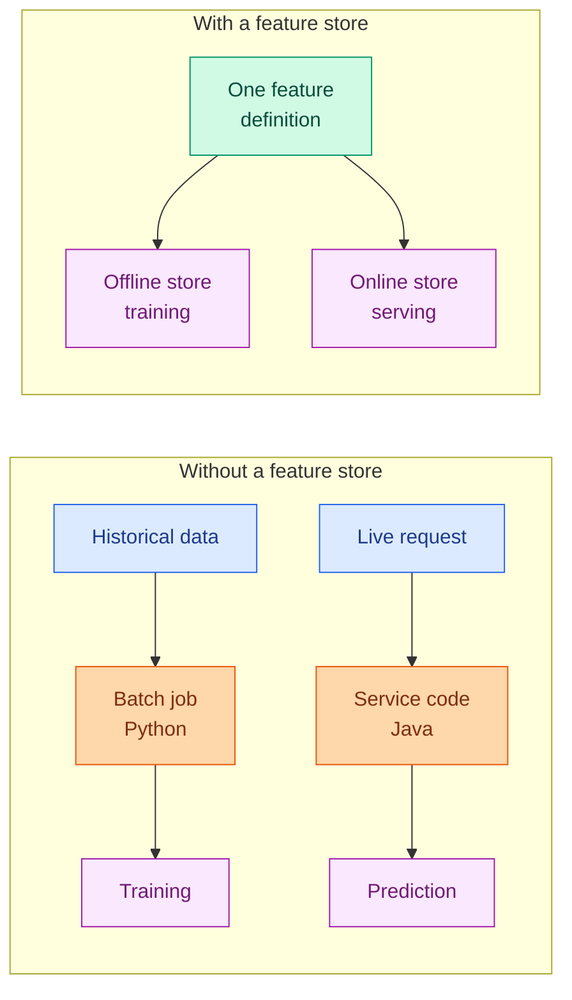

# Synthetic Data, Augmentation and Feature Stores

**Level:** 🟡 Intermediate &nbsp;|&nbsp; **Effort:** Detailed module &nbsp;|&nbsp; **Module:** [03 Data Foundations](README.md)

---

## 🎯 Learning Objectives

By the end of this topic you will be able to:

- Say what synthetic data can and cannot teach, and when it is the right tool
- Apply augmentation correctly, and recognise transformations that destroy the label
- Explain why augmentation belongs to training only
- Describe what a feature store solves, and why train/serve skew is the core problem
- Explain point-in-time correctness and why naive feature joins leak
- Decide whether you need a feature store at all

## 📚 Prerequisites

[Topic 6: Splits, Sampling and Class Imbalance](06-splits-sampling-and-class-imbalance.md)

---

## 1. Synthetic data

### When it genuinely helps

| Use | Why it works |
| --- | --- |
| **Teaching and examples** | Reproducible, no licensing, no privacy risk — this repository's datasets |
| **Testing pipelines** | You control the edge cases; you can generate the row that breaks things |
| **Privacy-constrained development** | Build against realistic shapes without touching personal data |
| **Rare-event simulation** | Generate failure modes you have too few real examples of |
| **Benchmarking with known truth** | You know the true coefficients, so you can measure recovery |

**The last one is why `housing.csv` exists in this repository** — its generating coefficients are
published, so
[module 01, topic 14](../01-python-foundations/14-your-first-scikit-learn-model.md) can compare a
fitted model against the truth, which real data never permits.

### ⚠️ Synthetic data contains only what you put in

```python
import numpy as np
import pandas as pd
from sklearn.linear_model import LinearRegression
from sklearn.metrics import r2_score
from sklearn.model_selection import train_test_split

rng = np.random.default_rng(0)
n = 2000

# Synthetic: a clean linear relationship, exactly as generated.
x = rng.uniform(0, 100, n)
synthetic_y = 3.0 * x + 20 + rng.normal(0, 10, n)

# "Real" data: the same underlying process, plus everything reality adds.
real_y = 3.0 * x + 20 + rng.normal(0, 10, n)
real_y += 40 * (x > 70)                                  # a regime change nobody modelled
real_y[rng.random(n) < 0.03] *= 2.5                      # occasional data-entry errors
real_y += 25 * np.sin(np.arange(n) / 50)                 # seasonality

for name, y in [("synthetic", synthetic_y), ("real-world", real_y)]:
    X_train, X_test, y_train, y_test = train_test_split(
        x.reshape(-1, 1), y, test_size=0.3, random_state=0)
    model = LinearRegression().fit(X_train, y_train)
    print(f"{name:<12} linear model R2: {r2_score(y_test, model.predict(X_test)):.4f}")

print()
print("A model validated only on synthetic data would look finished.")
print("Every phenomenon that makes the real problem hard was absent by construction.")
```

**Output:**
```
synthetic    linear model R2: 0.9880
real-world   linear model R2: 0.7938

A model validated only on synthetic data would look finished.
Every phenomenon that makes the real problem hard was absent by construction.
```

**A model that works perfectly on synthetic data has proved it can learn the process you
programmed.** That is a genuine result about your code and no result at all about the world. This
repository's [dataset card](../datasets/samples/README.md) states the same warning for its own data.

### 🔐 Synthetic data is not automatically private

Generative models trained on personal data can **memorise and reproduce** individual records.
"Synthetic" describes how a row was produced, not whether it discloses anything.

- Generative models can emit near-copies of training rows, especially outliers
- **Outliers are the most memorised and the most identifying**
- Ask for a membership-inference evaluation before claiming a synthetic dataset is safe to share
- Differential privacy during generation gives a formal bound; nothing else does

---

## 2. Augmentation

Augmentation creates variations of existing labelled examples. **Unlike synthetic data it starts
from real data**, which is why it usually works better.

```python
import numpy as np

rng = np.random.default_rng(0)

# A tiny "image" - augmentation that preserves the label.
image = np.arange(9).reshape(3, 3)

print("original:")
print(image)
print(f"\nhorizontal flip:\n{np.fliplr(image)}")
print(f"\nrotate 90:\n{np.rot90(image)}")
print(f"\nwith noise:\n{(image + rng.normal(0, 0.3, image.shape)).round(2)}")
print(f"\nbrightness shift:\n{image + 2}")
```

**Output:**
```
original:
[[0 1 2]
 [3 4 5]
 [6 7 8]]

horizontal flip:
[[2 1 0]
 [5 4 3]
 [8 7 6]]

rotate 90:
[[2 5 8]
 [1 4 7]
 [0 3 6]]

with noise:
[[0.04 0.96 2.19]
 [3.03 3.84 5.11]
 [6.39 7.28 7.79]]

brightness shift:
[[ 2  3  4]
 [ 5  6  7]
 [ 8  9 10]]
```

### ⚠️ The transformation must preserve the label

| Domain | Safe | **Destroys the label** |
| --- | --- | --- |
| Natural images | Flip, crop, rotate slightly, colour jitter | Vertical flip when orientation matters |
| **Digit recognition** | Small rotations, slight shifts | **Horizontal flip** — 2 does not mirror to 2; 6 becomes something else |
| Medical imaging | Small rotations, intensity shifts | Flips — anatomy is not symmetric; left and right lungs differ |
| Text | Synonym swap, back-translation | Negation removal, entity swap in NER |
| Audio | Time stretch, noise, pitch shift | Reversal, extreme pitch shift for speaker ID |
| Time series | Jitter, window slicing, scaling | **Shuffling** — order *is* the signal |

```python
import numpy as np

# Horizontal flip on digits: fine for a photo of a cat, wrong for a "2".
digit_2 = np.array([
    [0, 1, 1, 0],
    [0, 0, 0, 1],
    [0, 1, 1, 0],
    [1, 0, 0, 0],
    [1, 1, 1, 1],
])

print("a crude '2':")
for row in digit_2:
    print("  " + "".join("#" if v else "." for v in row))
print("\nhorizontally flipped:")
for row in np.fliplr(digit_2):
    print("  " + "".join("#" if v else "." for v in row))
print("\nStill labelled '2' by the augmentation. It is not a 2.")
print("The model is now being taught that this shape means 2, which will cost it accuracy.")
```

**Output:**
```
a crude '2':
  .##.
  ...#
  .##.
  #...
  ####

horizontally flipped:
  .##.
  #...
  .##.
  ...#
  ####

Still labelled '2' by the augmentation. It is not a 2.
The model is now being taught that this shape means 2, which will cost it accuracy.
```

**Every augmentation encodes an assumption about what does not change the label.** Get it wrong and
you are adding labelled noise — worse than adding nothing.

### 🔐 Augment training data only

```python
import numpy as np

rng = np.random.default_rng(1)
train_size, test_size = 800, 200

print("WRONG: augment everything, then split")
print("  an augmented copy of a training image lands in the test set")
print("  the model has effectively seen the test data")
print()
print("RIGHT: split, then augment the training set only")
print(f"  train {train_size} -> {train_size * 5} augmented")
print(f"  test  {test_size} -> {test_size} untouched")
print()
print("The test set must reflect the real distribution, not your augmentation policy.")
print("Test-time augmentation is a separate, deliberate technique - not the same thing.")
```

**Output:**
```
WRONG: augment everything, then split
  an augmented copy of a training image lands in the test set
  the model has effectively seen the test data

RIGHT: split, then augment the training set only
  train 800 -> 4000 augmented
  test  200 -> 200 untouched

The test set must reflect the real distribution, not your augmentation policy.
Test-time augmentation is a separate, deliberate technique - not the same thing.
```

**Augmenting before splitting is duplicate leakage** ([Topic 5](05-lineage-versioning-privacy-and-leakage.md))
with extra steps: near-copies of the same image on both sides.

---

## 3. Feature stores and train/serve skew

### The problem they solve

**Training features are computed in a batch job over historical data. Serving features are computed
live, in a request handler.** Two implementations of the same feature, in different languages,
maintained by different people. They drift.

```python
import numpy as np
import pandas as pd

rng = np.random.default_rng(0)
events = pd.DataFrame({
    "user": ["u1"] * 10,
    "amount": rng.uniform(10, 100, 10).round(2),
})

# Training pipeline: pandas, over the whole history.
training_feature = events["amount"].mean()

# Serving code: written separately, in a hurry, six months later.
def serving_feature(amounts):
    """Rolling mean of the last 5 transactions - a 'small optimisation' nobody documented."""
    return sum(amounts[-5:]) / 5

serving_value = serving_feature(events["amount"].tolist())

print(f"training-time value: {training_feature:.4f}")
print(f"serving-time value:  {serving_value:.4f}")
print(f"difference:          {abs(training_feature - serving_value):.4f}")
print()
print("The model was trained on one definition and is being served another.")
print("Nothing errors. Accuracy simply degrades, and the cause is invisible in the model.")
```

**Output:**
```
training-time value: 59.5470
serving-time value:  77.0980
difference:          17.5510

The model was trained on one definition and is being served another.
Nothing errors. Accuracy simply degrades, and the cause is invisible in the model.
```

**This is train/serve skew, and it is one of the most common causes of a model that "worked in
testing".** The model is fine; the feature is not the one it was trained on.



**A feature store's central promise is one definition, two access paths** — an offline store for
training and an online store for low-latency serving, both derived from the same code.

### ⚠️ Point-in-time correctness

The second thing a feature store provides is harder to build by hand and easier to get wrong.

```python
import pandas as pd

# Labels: did this user churn, and when did we need to know?
labels = pd.DataFrame({
    "user": ["u1", "u1", "u2"],
    "prediction_time": pd.to_datetime(["2026-03-01", "2026-06-01", "2026-03-01"]),
    "churned": [0, 1, 0],
})

# A feature that changes over time.
features = pd.DataFrame({
    "user": ["u1", "u1", "u1", "u2", "u2"],
    "valid_from": pd.to_datetime(["2026-01-01", "2026-04-01", "2026-07-01",
                                  "2026-01-01", "2026-05-01"]),
    "support_tickets": [0, 7, 12, 1, 2],
})

# WRONG: join on user only, taking the latest value.
latest = features.sort_values("valid_from").groupby("user").last().reset_index()
naive = labels.merge(latest[["user", "support_tickets"]], on="user")

# RIGHT: as-of join - the value that was true AT the prediction time.
correct = pd.merge_asof(
    labels.sort_values("prediction_time"),
    features.sort_values("valid_from"),
    left_on="prediction_time", right_on="valid_from", by="user", direction="backward",
)

print("naive join (latest value for each user):")
print(naive.to_string(index=False))
print("\npoint-in-time correct join:")
print(correct[["user", "prediction_time", "churned", "support_tickets"]].to_string(index=False))
```

**Output:**
```
naive join (latest value for each user):
user prediction_time  churned  support_tickets
  u1      2026-03-01        0               12
  u1      2026-06-01        1               12
  u2      2026-03-01        0                2

point-in-time correct join:
user prediction_time  churned  support_tickets
  u1      2026-03-01        0                0
  u2      2026-03-01        0                1
  u1      2026-06-01        1                7
```

**Look at u1's first row.** The naive join gives it 12 support tickets — a value that did not exist
until July, four months after the March prediction. The model would learn that high ticket counts
predict churn using information from the future.

**`merge_asof` with `direction="backward"` is the fix**, and it is the operation a feature store
performs for you. Building training sets by hand without it is one of the most common sources of
temporal leakage in production systems.

### ⚠️ You probably do not need a feature store

**Feature stores are infrastructure, and infrastructure has a cost.** They earn their place when:

- Multiple models share features
- Features must be served at low latency
- Training and serving are written in different languages or by different teams
- Point-in-time correctness is genuinely hard because features change often

They are overhead when you have one model, batch predictions, and one team maintaining both paths.
**A shared Python module containing the feature functions, imported by both training and serving,
solves most of the skew problem for a fraction of the effort.** Reach for the platform when you have
outgrown the module, not before.

---

## 🧪 Hands-on lab: prove your feature computation is skew-free

The cheapest defence against train/serve skew is a test that runs both paths on the same input and
asserts they agree.

```python
import numpy as np
import pandas as pd

# ONE definition, used by both paths.
def average_transaction_value(amounts):
    """Mean transaction amount. The single source of truth for this feature."""
    amounts = [float(a) for a in amounts]
    if not amounts:
        return 0.0
    return sum(amounts) / len(amounts)


def batch_features(frame):
    """Training path: compute for every user over history."""
    return frame.groupby("user")["amount"].apply(
        lambda s: average_transaction_value(s.tolist())).rename("avg_value")


def serving_features(recent_amounts):
    """Serving path: compute for one user from a live payload."""
    return {"avg_value": average_transaction_value(recent_amounts)}


rng = np.random.default_rng(0)
events = pd.DataFrame({
    "user": rng.choice(["u1", "u2", "u3"], size=60),
    "amount": rng.uniform(5, 200, 60).round(2),
})

offline = batch_features(events)

print(f"{'user':<6}{'offline (training)':>20}{'online (serving)':>20}{'agree':>8}")
all_agree = True
for user in sorted(events["user"].unique()):
    online = serving_features(events.loc[events["user"] == user, "amount"].tolist())["avg_value"]
    agree = np.isclose(offline[user], online)
    all_agree &= bool(agree)
    print(f"{user:<6}{offline[user]:>20.6f}{online:>20.6f}{str(agree):>8}")

print(f"\nall paths agree: {all_agree}")
print()
print("This passes because both paths call the same function.")
print("Rewrite either one 'for performance' and this test fails immediately -")
print("which is the entire point. Skew is caught in CI, not in production metrics.")

# The edge cases that skew usually hides in.
print()
print(f"{'edge case':<26}{'result':>12}")
for name, amounts in [("no transactions", []), ("one transaction", [42.0]),
                      ("string amounts", ["10", "20"])]:
    print(f"{name:<26}{average_transaction_value(amounts):>12.4f}")
```

**Output:**
```
user    offline (training)    online (serving)   agree
u1              117.987368          117.987368    True
u2               98.438095           98.438095    True
u3              104.266500          104.266500    True

all paths agree: True

This passes because both paths call the same function.
Rewrite either one 'for performance' and this test fails immediately -
which is the entire point. Skew is caught in CI, not in production metrics.

edge case                       result
no transactions                 0.0000
one transaction                42.0000
string amounts                 15.0000
```

**Skew hides in the edge cases**, not the happy path. A user with no transactions returns 0.0 in one
path and raises `ZeroDivisionError` in the other; amounts arriving as strings from JSON work in one
and fail in the other. Testing both paths on the same edge cases is what makes the guarantee real.

**Extend it:** add a property-based test using random inputs; add a point-in-time join test
asserting no feature value postdates its prediction time; and add a serving-latency assertion so a
"small" change to the feature cannot silently blow the request budget.

---

## 🎤 Interview questions

**"When is synthetic data appropriate?"**

For teaching and reproducible examples, for testing pipelines where you need to control edge cases,
for development under privacy constraints, for simulating rare events you lack real examples of, and
for benchmarking where knowing the ground truth matters. It is not appropriate as the primary
evidence that a model works, because it contains only the phenomena you programmed into it — the
regime changes, entry errors and seasonality that make the real problem hard are absent by
construction.

**"Is synthetic data automatically privacy-safe?"**

No. A generative model trained on personal data can memorise and reproduce individual records, and
outliers — the most identifying rows — are the most memorised. "Synthetic" describes how a row was
produced, not what it discloses. Claiming privacy safety requires evidence, such as a
membership-inference evaluation, or generation under differential privacy, which gives a formal
bound.

**"What is train/serve skew and how do you prevent it?"**

It is training features and serving features being computed by different code that has drifted
apart — different languages, different teams, an undocumented optimisation. Nothing errors; accuracy
just degrades, and the model looks like the culprit. Prevention is one definition used by both
paths: a shared library at minimum, a feature store at scale, plus a test that runs both paths on
the same inputs including edge cases and asserts they agree.

**"What is point-in-time correctness?"**

Building a training row using only feature values that were actually known at that row's prediction
time. Joining a label to the *latest* value of a feature imports the future — a user's current
support-ticket count applied to a prediction made four months earlier. The fix is an as-of join
backwards from the prediction timestamp, which is one of the main things a feature store provides.

**"When would you not use a feature store?"**

When you have one model, batch predictions, and a single team owning training and serving. The
infrastructure cost is real and the problem it solves — skew between independently maintained
implementations — does not exist yet. A shared Python module of feature functions imported by both
paths gets most of the benefit for very little cost. Adopt the platform when you have outgrown that,
not in anticipation.

---

## ✅ Key takeaways

- Synthetic data is excellent for teaching, testing, privacy-constrained development and known-truth
  benchmarking.
- **It contains only what you put in.** A model that works on it has learned your generator.
- **Synthetic is not automatically private** — generative models memorise outliers.
- Augmentation starts from real data, which is why it generally beats synthesis.
- **Every augmentation asserts what does not change the label.** Horizontal flip breaks digits;
  shuffling breaks time series.
- **Augment training data only.** Augmenting before splitting is duplicate leakage.
- **Train/serve skew is two implementations of one feature drifting apart** — silent, and blamed on
  the model.
- A feature store gives one definition with offline and online access paths.
- **Point-in-time correctness**: use an as-of join, never the latest value.
- **Most teams do not need a feature store.** A shared feature module solves most skew.
- Test both paths on the same edge cases — that is where skew hides.

---

## 📚 Official References

- [pandas: merge_asof — pandas development team](https://pandas.pydata.org/docs/reference/api/pandas.merge_asof.html) — verified 2026-09-01
- [scikit-learn: Sample generators — scikit-learn developers](https://scikit-learn.org/stable/datasets/sample_generators.html) — verified 2026-09-01
- [PyTorch: Transforms and augmentation — PyTorch Foundation](https://pytorch.org/vision/stable/transforms.html) — verified 2026-09-01
- [Feast: feature store documentation *(community resource)*](https://docs.feast.dev/) — verified 2026-09-01
- [Datasheets for Datasets — Gebru et al., arXiv](https://arxiv.org/abs/1803.09010) — verified 2026-09-01

---

## 🔗 Navigation

[← Topic 6: Splits, Sampling and Class Imbalance](06-splits-sampling-and-class-imbalance.md) &nbsp;|&nbsp;
[Module home](README.md) &nbsp;|&nbsp;
[Topic 8: Storage — SQL, NoSQL, Warehouses and Lakes →](08-storage-sql-nosql-warehouses-and-lakes.md)
