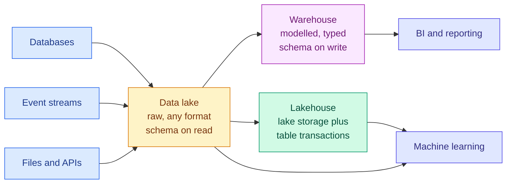

# Storage: SQL, NoSQL, Warehouses, Lakes and Lakehouses

**Level:** 🟡 Intermediate &nbsp;|&nbsp; **Effort:** Detailed module &nbsp;|&nbsp; **Module:** [03 Data Foundations](README.md)

---

## 🎯 Learning Objectives

By the end of this topic you will be able to:

- Choose between a database, a warehouse, a lake and a lakehouse for a given job
- Explain why row storage and columnar storage suit opposite workloads
- Write the SQL an ML practitioner actually needs, and push work into the database
- Say what OLTP and OLAP mean and why you should not run analytics on production
- Recognise when NoSQL is the right answer and when it is fashion
- Explain why Parquet is the default for machine-learning datasets

## 📚 Prerequisites

[Topic 7: Synthetic Data, Augmentation and Feature Stores](07-synthetic-data-augmentation-and-feature-stores.md)

---

## 1. OLTP and OLAP: two opposite jobs

| | **OLTP** (transactional) | **OLAP** (analytical) |
| --- | --- | --- |
| Typical query | "Fetch order 84213" | "Average order value by region, last year" |
| Rows touched | One, or a handful | Millions |
| Columns touched | All of them | Three or four |
| Optimised for | Many small reads and writes | Few enormous scans |
| Storage layout | **Row**-oriented | **Column**-oriented |
| Examples | PostgreSQL, MySQL | BigQuery, Snowflake, Redshift, DuckDB |

### ⚠️ Never run analytics against the production database

A full-table scan for a dashboard competes with the queries serving customers, holds locks, and
evicts the working set from cache. **Replicate to a warehouse and analyse there.** That separation
is the reason warehouses exist.

---

## 2. Row versus column storage

**This single choice explains most of the performance difference between systems.**

```python
# Row storage keeps a record's fields adjacent. Column storage keeps a column's values adjacent.
rows = [
    {"id": 1, "region": "eu-west", "amount": 120.0, "notes": "..."},
    {"id": 2, "region": "us-east", "amount": 85.5, "notes": "..."},
    {"id": 3, "region": "eu-west", "amount": 200.0, "notes": "..."},
]

row_layout = [tuple(record.values()) for record in rows]
column_layout = {key: [record[key] for record in rows] for key in rows[0]}

print("row-oriented (one record contiguous):")
for record in row_layout:
    print(f"  {record}")

print("\ncolumn-oriented (one column contiguous):")
for name, values in column_layout.items():
    print(f"  {name}: {values}")

print()
print("To sum 'amount' over 3 rows:")
print(f"  row store  : read all {len(rows) * len(rows[0])} values, discard "
      f"{len(rows) * (len(rows[0]) - 1)} of them")
print(f"  column store: read {len(rows)} values, discard 0")
```

**Output:**
```
row-oriented (one record contiguous):
  (1, 'eu-west', 120.0, '...')
  (2, 'us-east', 85.5, '...')
  (3, 'eu-west', 200.0, '...')

column-oriented (one column contiguous):
  id: [1, 2, 3]
  region: ['eu-west', 'us-east', 'eu-west']
  amount: [120.0, 85.5, 200.0]
  notes: ['...', '...', '...']

To sum 'amount' over 3 rows:
  row store  : read all 12 values, discard 9 of them
  column store: read 3 values, discard 0
```

**On three rows this is trivial; on a billion it is the entire cost.** An analytical query touching
4 of 60 columns reads 7% of the data in a columnar store and 100% in a row store.

Columnar storage also compresses far better, because adjacent values share a type and often repeat:

```python
import zlib

# Simulated column of repeated categories versus interleaved rows.
column = ("eu-west," * 500 + "us-east," * 500).encode()
interleaved = ("eu-west,120.0,note;us-east,85.5,note;" * 333).encode()

print(f"columnar (sorted, repetitive): {len(column):>6} bytes -> "
      f"{len(zlib.compress(column)):>5} compressed  ({len(zlib.compress(column)) / len(column):.1%})")
print(f"row-like (mixed types):        {len(interleaved):>6} bytes -> "
      f"{len(zlib.compress(interleaved)):>5} compressed  "
      f"({len(zlib.compress(interleaved)) / len(interleaved):.1%})")
```

**Output:**
```
columnar (sorted, repetitive):   8000 bytes ->    50 compressed  (0.6%)
row-like (mixed types):         12321 bytes ->    94 compressed  (0.8%)
```

**Grouping like values together is what makes compression work**, and columnar formats do exactly
that. This is why Parquet files are routinely a fraction of the equivalent CSV.

---

## 3. SQL you actually need

SQLite is in the Python standard library, so everything below runs with no installation.

```python
import sqlite3

import pandas as pd

housing = pd.read_csv("datasets/samples/housing.csv")
reviews = pd.read_csv("datasets/samples/reviews.csv")

connection = sqlite3.connect(":memory:")
housing.to_sql("housing", connection, index=False)
reviews.to_sql("reviews", connection, index=False)

print("--- aggregate, filter, order ---")
query = """
SELECT bedrooms,
       COUNT(*)                AS properties,
       ROUND(AVG(price_thousands), 1) AS avg_price,
       ROUND(MIN(price_thousands), 1) AS cheapest,
       ROUND(MAX(price_thousands), 1) AS dearest
FROM housing
WHERE area_sqm > 80
GROUP BY bedrooms
HAVING COUNT(*) >= 5
ORDER BY avg_price DESC
"""
print(pd.read_sql_query(query, connection).to_string(index=False))
connection.close()
```

**Output:**
```
--- aggregate, filter, order ---
 bedrooms  properties  avg_price  cheapest  dearest
        5          31      490.4     284.9    745.5
        3          23      486.7     249.4    710.3
        2          24      457.5     263.3    697.2
        4          16      440.1     275.2    774.0
        1          15      415.8     208.4    626.9
```

**`WHERE` filters rows before grouping; `HAVING` filters groups after.** Getting those the wrong way
round is the single most common SQL error, and it silently returns different results rather than
failing.

### The clauses in execution order

```text
  FROM      → which tables
  WHERE     → filter rows              (before grouping)
  GROUP BY  → form groups
  HAVING    → filter groups            (after grouping)
  SELECT    → choose columns
  ORDER BY  → sort
  LIMIT     → truncate
```

**You write `SELECT` first but the database evaluates it fifth**, which is why a column alias
defined in `SELECT` cannot be used in `WHERE`.

### Window functions: the one advanced feature worth learning

```python
import sqlite3

import pandas as pd

sensors = pd.read_csv("datasets/samples/sensor_readings.csv")
connection = sqlite3.connect(":memory:")
sensors.to_sql("sensors", connection, index=False)

query = """
SELECT timestamp,
       sensor_id,
       temperature_c,
       ROUND(AVG(temperature_c) OVER (
           PARTITION BY sensor_id ORDER BY timestamp
           ROWS BETWEEN 2 PRECEDING AND CURRENT ROW), 2) AS rolling_3,
       ROUND(temperature_c - LAG(temperature_c) OVER (
           PARTITION BY sensor_id ORDER BY timestamp), 2)  AS change_since_last
FROM sensors
WHERE sensor_id = 's-02' AND temperature_c IS NOT NULL
LIMIT 8
"""
print(pd.read_sql_query(query, connection).to_string(index=False))
connection.close()
```

**Output:**
```
          timestamp sensor_id  temperature_c  rolling_3  change_since_last
2026-03-01T00:00:00      s-02          13.46      13.46                NaN
2026-03-01T01:00:00      s-02          11.63      12.55              -1.83
2026-03-01T02:00:00      s-02          13.15      12.75               1.52
2026-03-01T03:00:00      s-02          13.04      12.61              -0.11
2026-03-01T04:00:00      s-02          12.69      12.96              -0.35
2026-03-01T05:00:00      s-02          13.98      13.24               1.29
2026-03-01T06:00:00      s-02          14.33      13.67               0.35
2026-03-01T07:00:00      s-02          14.84      14.38               0.51
```

**`PARTITION BY` restarts the window for each sensor** — without it the rolling average would spill
across sensors and produce nonsense at every boundary. `LAG` gives the previous row's value, which
is how you compute changes without a self-join.

**Window functions are how feature engineering happens at scale.** Rolling averages, ranks, lags and
time-since-last-event all belong in the database, not in a Python loop over a million rows.

### 🔐 Never build SQL with string formatting

```python
import sqlite3

connection = sqlite3.connect(":memory:")
connection.execute("CREATE TABLE users (id INTEGER, name TEXT)")
connection.execute("INSERT INTO users VALUES (1, 'ann'), (2, 'bob')")

user_input = "ann' OR '1'='1"

# ❌ String formatting - the injected condition matches every row.
unsafe = f"SELECT * FROM users WHERE name = '{user_input}'"
print(f"unsafe query returns {len(connection.execute(unsafe).fetchall())} rows (expected 0)")

# ✅ Parameterised - the input is data, never syntax.
safe = connection.execute("SELECT * FROM users WHERE name = ?", (user_input,)).fetchall()
print(f"parameterised returns {len(safe)} rows")
connection.close()
```

**Output:**
```
unsafe query returns 2 rows (expected 0)
parameterised returns 0 rows
```

**The unsafe query returned every row**, because the input closed the quote and added a condition
that is always true. A real attack replaces the payload with something that drops tables or reads
another one.

**Always pass values as parameters.** This applies to every database library, and to any string that
becomes a query — including ones assembled by a language model
([14 Prompt Engineering](../14-prompt-engineering/README.md)).

---

## 4. NoSQL: when the relational model is the wrong shape

| Type | Model | Good at | Examples |
| --- | --- | --- | --- |
| **Document** | JSON-like records | Varying schemas, nested data | MongoDB, DocumentDB |
| **Key-value** | Key to blob | Very fast lookups, caching | Redis, DynamoDB |
| **Wide-column** | Sparse rows, many columns | Huge write volumes, time series | Cassandra, HBase |
| **Graph** | Nodes and edges | Traversals, relationships | Neo4j |
| **Vector** | Embeddings plus metadata | Similarity search | See [module 15](../15-embeddings-and-vector-search/README.md) |

**Choose NoSQL for a reason you can state.** The common reasons are genuinely varying schemas,
horizontal write scaling beyond a single node, or an access pattern relational databases handle
badly — deep graph traversal, or nearest-neighbour search.

**The common non-reasons** are "it is faster" (not for joins) and "we might need to scale" (you can
migrate later, and a well-indexed PostgreSQL instance handles more than most teams ever reach).

### ⚠️ Schemaless means the schema lives in your code

```python
import json

# The same "collection", three schema generations, all present at once.
documents = [
    {"id": 1, "name": "Ann", "email": "ann@example.com"},
    {"id": 2, "name": "Bob", "contact": {"email": "bob@example.com"}},
    {"id": 3, "fullName": "Carol", "contact": {"email": "carol@example.com", "phone": "123"}},
]

print("extracting an email address from each:")
for document in documents:
    email = document.get("email") or document.get("contact", {}).get("email")
    name = document.get("name") or document.get("fullName")
    print(f"  id {document['id']}: name={name!r} email={email!r}")

print()
print("Every reader must know every historical shape. The schema did not disappear -")
print("it moved from the database, where it was enforced, into every piece of code that reads.")
```

**Output:**
```
extracting an email address from each:
  id 1: name='Ann' email='ann@example.com'
  id 2: name='Bob' email='bob@example.com'
  id 3: name='Carol' email='carol@example.com'

Every reader must know every historical shape. The schema did not disappear -
it moved from the database, where it was enforced, into every piece of code that reads.
```

**Schemaless is a trade, not a free lunch.** A relational database rejects a malformed row once, at
write time. A document store accepts it, and every reader forever after must handle it. Version your
documents explicitly and migrate them, or this accumulates without limit.

---

## 5. Warehouses, lakes and lakehouses



| | **Warehouse** | **Lake** | **Lakehouse** |
| --- | --- | --- | --- |
| Schema | On **write** — validated up front | On **read** — interpreted later | On write, over lake storage |
| Data | Structured, modelled | Anything, raw | Anything, with table semantics |
| Cost | Higher per byte | Cheapest | Between |
| Strength | Fast, governed, trustworthy | Flexible, keeps everything | Both, with transactions |
| Weakness | Rigid; ingest is work | **Becomes a swamp without governance** | Newer, more moving parts |

**"Schema on read" is the defining trade.** A lake accepts anything, which means problems surface
years later at query time rather than at ingest — the **data swamp**. What prevents it is
unglamorous: a catalogue, ownership, retention rules and validation at ingest
([Topic 4](04-encoding-and-data-validation.md)).

**Lakehouse formats** — Delta Lake, Apache Iceberg, Apache Hudi — add transactions, schema
enforcement and time travel on top of Parquet files in object storage. They exist because teams
wanted a warehouse's guarantees at a lake's price.

---

## 6. File formats

```python
import csv
import io
import json

rows = [{"id": i, "region": "eu-west", "amount": 100.0 + i} for i in range(1000)]

csv_buffer = io.StringIO()
writer = csv.DictWriter(csv_buffer, fieldnames=["id", "region", "amount"], lineterminator="\n")
writer.writeheader()
writer.writerows(rows)
csv_bytes = csv_buffer.getvalue().encode()

jsonl_bytes = "".join(json.dumps(r) + "\n" for r in rows).encode()

print(f"{'format':<10}{'bytes':>10}{'relative':>11}  properties")
print(f"{'CSV':<10}{len(csv_bytes):>10,}{1.0:>10.2f}x  no types, no nesting, universal")
print(f"{'JSONL':<10}{len(jsonl_bytes):>10,}{len(jsonl_bytes) / len(csv_bytes):>10.2f}x  "
      f"repeats every key on every line")
```

**Output:**
```
format         bytes   relative  properties
CSV           18,007      1.00x  no types, no nesting, universal
JSONL         49,990      2.78x  repeats every key on every line
```

**JSONL repeats the key names on every single line**, which is why it is larger than CSV for
tabular data and why it is nonetheless the right choice for varying, nested records.

| Format | Layout | Types | Use for |
| --- | --- | --- | --- |
| **CSV** | Row, text | **None** | Interchange, small files, human inspection |
| **JSONL** | Row, text | Partial | Nested or varying records; LLM datasets |
| **Parquet** | **Column**, binary | Full | **The default for ML datasets** |
| **Arrow** | Column, in-memory | Full | Zero-copy exchange between tools |
| **ORC** | Column, binary | Full | Common in the Hadoop and Hive ecosystem |
| **Avro** | Row, binary | Full | Streaming records, strong schema evolution |

**Parquet is the default for machine-learning data** because it is columnar (read only the columns
you need), typed (no re-parsing strings, no dtype guessing), compressed (typically 5–10× smaller
than CSV), and partition-friendly.

> **Parquet needs `pyarrow` or `fastparquet`**, neither of which is pinned in this repository's
> `requirements.txt`, so the snippet below is shown for reference and **is not executed** by the
> example checker. Add the dependency deliberately when you need it.

<!-- check-examples: skip -->
```python
import pandas as pd

frame = pd.read_csv("datasets/samples/housing.csv")

frame.to_parquet("housing.parquet", compression="snappy")

# Read only two columns - the file layout means the rest is never touched.
subset = pd.read_parquet("housing.parquet", columns=["area_sqm", "price_thousands"])

# Partitioned writes: each partition is a directory, and filters skip whole directories.
frame.to_parquet("housing_partitioned/", partition_cols=["bedrooms"])
```

---

## 🧪 Hands-on lab: push the work into the database

The instinct is to load everything into pandas and filter there. **On real data that is backwards.**

```python
import sqlite3

import pandas as pd

housing = pd.read_csv("datasets/samples/housing.csv")
connection = sqlite3.connect(":memory:")
housing.to_sql("housing", connection, index=False)
connection.execute("CREATE INDEX idx_area ON housing(area_sqm)")

# ❌ Load everything, then filter and aggregate in Python.
everything = pd.read_sql_query("SELECT * FROM housing", connection)
in_python = (everything[everything["area_sqm"] > 150]
             .groupby("bedrooms")["price_thousands"]
             .agg(["count", "mean"])
             .round(2))

# ✅ Let the database do it and return only the answer.
in_sql = pd.read_sql_query("""
    SELECT bedrooms,
           COUNT(*) AS count,
           ROUND(AVG(price_thousands), 2) AS mean
    FROM housing
    WHERE area_sqm > 150
    GROUP BY bedrooms
    ORDER BY bedrooms
""", connection)

print("rows transferred to Python:")
print(f"  load-everything approach: {len(everything)}")
print(f"  push-down approach:       {len(in_sql)}")
print(f"  reduction: {len(everything) / len(in_sql):.0f}x fewer rows over the wire")
print()
print("same answer:")
print(in_sql.to_string(index=False))
print()
matches = (in_python["count"].tolist() == in_sql["count"].tolist())
print(f"results agree: {matches}")

# The query planner confirms the index is used.
plan = connection.execute(
    "EXPLAIN QUERY PLAN SELECT * FROM housing WHERE area_sqm > 150").fetchall()
print(f"\nquery plan: {plan[0][-1]}")
connection.close()
```

**Output:**
```
rows transferred to Python:
  load-everything approach: 150
  push-down approach:       5
  reduction: 30x fewer rows over the wire

same answer:
 bedrooms  count   mean
        1      5 546.52
        2     11 543.40
        3     14 569.19
        4      4 632.17
        5     13 626.64

results agree: True

query plan: SEARCH housing USING INDEX idx_area (area_sqm>?)
```

**On 150 rows the difference is academic. On 150 million it is the whole problem** — the
load-everything approach transfers every row across the network and needs memory proportional to the
table, while the push-down approach transfers a handful of aggregated rows.

**The query plan line matters too.** `SEARCH ... USING INDEX` means the database jumped straight to
the matching rows; `SCAN` means it read the entire table. Checking that is how you find the missing
index that is costing you an hour a day.

**Extend it:** add a second table and practise `JOIN` types, checking row counts before and after as
[Topic 5](05-lineage-versioning-privacy-and-leakage.md) recommends; drop the index and compare the
query plan; and write the same aggregation as a window function returning per-row group averages.

---

## 🎤 Interview questions

**"Why are analytical databases column-oriented?"**

Because analytical queries touch few columns across many rows. A columnar layout stores each
column contiguously, so a query using 4 of 60 columns reads roughly 7% of the data rather than all
of it. Values in a column share a type and often repeat, so compression is far more effective, and
vectorised execution can process a column in tight loops. Row storage wins the opposite workload —
fetching or updating one complete record.

**"What is the difference between a data lake and a warehouse?"**

A warehouse enforces schema on write: data is modelled and validated before it lands, so queries are
fast and trustworthy but ingest is work and the structure is rigid. A lake stores raw data of any
shape and applies schema on read, which is flexible and cheap but pushes every problem to query
time — and without a catalogue, ownership and retention it degrades into a swamp. Lakehouse formats
like Delta and Iceberg add transactions and schema enforcement over lake storage to get both.

**"When would you choose NoSQL?"**

When you can name the reason: genuinely varying document schemas, write volume beyond a single
node, or an access pattern relational engines handle badly such as deep graph traversal or
nearest-neighbour search. Not for speed generally — joins are slower — and not for hypothetical
future scale, since migration remains possible and a well-indexed relational database serves more
load than most systems ever see. Schemaless does not remove the schema; it moves it into every
reader.

**"Why is Parquet the default for machine-learning datasets?"**

It is columnar, so loading three features from a hundred-column table reads only those three. It
stores types, so there is no re-parsing and no dtype guessing on load. It compresses well because
columns are homogeneous, typically five to ten times smaller than CSV. And it partitions naturally,
so a filter on the partition key skips entire directories.

**"How do you prevent SQL injection?"**

Parameterised queries — pass values as parameters so the driver treats them as data rather than
syntax. Never build a query by string formatting or concatenation, however trusted the input seems.
Additionally, grant the application only the privileges it needs, so a successful injection has a
limited blast radius. This applies equally to queries assembled by a language model from user text.

---

## ✅ Key takeaways

- **OLTP and OLAP are opposite workloads.** Never run analytics on the production database.
- **Row storage suits whole-record access; columnar suits few-columns-many-rows** — and compresses
  far better because like values sit together.
- `WHERE` filters rows before grouping, `HAVING` filters groups after. SQL is not evaluated in the
  order you write it.
- **Window functions with `PARTITION BY` are how feature engineering scales.**
- **Always parameterise queries.** String formatting returned every row in the example above.
- Choose NoSQL for a reason you can state. **Schemaless moves the schema into every reader.**
- Warehouse = schema on write; lake = schema on read; lakehouse = transactions over lake storage.
- **A lake without governance becomes a swamp**, and the cure is unglamorous: catalogue, ownership,
  retention, validation at ingest.
- **Parquet is the default for ML data**: columnar, typed, compressed, partition-friendly.
- **Push filtering and aggregation into the database.** Check the query plan for `SCAN` versus
  `SEARCH`.

---

## 📚 Official References

- [SQLite documentation — SQLite Consortium](https://www.sqlite.org/docs.html) — verified 2026-09-01
- [Python: sqlite3 — Python Software Foundation](https://docs.python.org/3/library/sqlite3.html) — verified 2026-09-01
- [PostgreSQL documentation — PostgreSQL Global Development Group](https://www.postgresql.org/docs/current/) — verified 2026-09-01
- [Apache Parquet documentation — The Apache Software Foundation](https://parquet.apache.org/docs/) — verified 2026-09-01
- [Apache Arrow documentation — The Apache Software Foundation](https://arrow.apache.org/docs/) — verified 2026-09-01
- [pandas: IO tools — pandas development team](https://pandas.pydata.org/docs/user_guide/io.html) — verified 2026-09-01
- [OWASP SQL Injection Prevention Cheat Sheet — OWASP *(community resource)*](https://cheatsheetseries.owasp.org/cheatsheets/SQL_Injection_Prevention_Cheat_Sheet.html) — verified 2026-09-01

---

## 🔗 Navigation

[← Topic 7: Synthetic Data, Augmentation and Feature Stores](07-synthetic-data-augmentation-and-feature-stores.md) &nbsp;|&nbsp;
[Module home](README.md) &nbsp;|&nbsp;
[Topic 9: Batch versus Stream Processing →](09-batch-versus-stream-processing.md)
