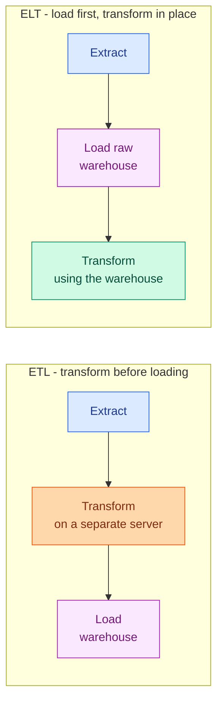

# Batch versus Stream Processing

**Level:** 🔴 Advanced &nbsp;|&nbsp; **Effort:** Detailed module &nbsp;|&nbsp; **Module:** [03 Data Foundations](README.md)

---

## 🎯 Learning Objectives

By the end of this topic you will be able to:

- Choose between batch and stream processing from the latency the problem needs
- Explain ETL and ELT, and why ELT became the default
- Describe what Kafka, Spark and Airflow each actually do
- Explain event time versus processing time, and why late data breaks naive pipelines
- Say what exactly-once means and why at-least-once plus idempotency is usually the answer
- Design an idempotent pipeline step

## 📚 Prerequisites

[Topic 8: Storage](08-storage-sql-nosql-warehouses-and-lakes.md)

---

## 1. Batch or stream?

| | **Batch** | **Stream** |
| --- | --- | --- |
| Processes | Bounded chunks on a schedule | Unbounded events as they arrive |
| Latency | Minutes to hours | Milliseconds to seconds |
| Reprocessing | Trivial — rerun the job | Hard — replay the log |
| Complexity | Low | **Substantially higher** |
| Cost | Efficient per record | Always-on infrastructure |
| Tools | Airflow, Spark, dbt | Kafka, Flink, Spark Structured Streaming |

**Start with batch.** Streaming is genuinely harder to build, test, debug and staff. It earns its
place when the business value of fresher data exceeds that cost — and often it does not.

```python
def recommended_architecture(latency_requirement_seconds, events_per_second):
    """A starting recommendation, not a rule. State the latency the BUSINESS needs."""
    if latency_requirement_seconds >= 3600:
        return "batch (scheduled hourly or daily)"
    if latency_requirement_seconds > 300:
        return "micro-batch (every few minutes)"
    if events_per_second < 100:
        return "streaming, but a simple queue and worker may be enough"
    return "true streaming (Kafka plus a stream processor)"


cases = [
    ("Nightly churn model scoring", 86_400, 10),
    ("Daily sales dashboard", 3_600, 50),
    ("Hourly inventory sync", 1_800, 20),
    ("Fraud check during checkout", 1, 500),
    ("Live personalisation", 5, 20_000),
]

print(f"{'use case':<34}{'latency needed':>16}{'events/s':>11}  recommendation")
for name, latency, rate in cases:
    print(f"{name:<34}{latency:>16,}{rate:>11,}  {recommended_architecture(latency, rate)}")
```

**Output:**
```
use case                            latency needed   events/s  recommendation
Nightly churn model scoring                 86,400         10  batch (scheduled hourly or daily)
Daily sales dashboard                        3,600         50  batch (scheduled hourly or daily)
Hourly inventory sync                        1,800         20  micro-batch (every few minutes)
Fraud check during checkout                      1        500  true streaming (Kafka plus a stream processor)
Live personalisation                             5     20,000  true streaming (Kafka plus a stream processor)
```

**The question is never "is streaming better".** It is "what is the cost of data being an hour old",
and for a great many problems the answer is nothing at all.

---

## 2. ETL and ELT



| | **ETL** | **ELT** |
| --- | --- | --- |
| Transform runs | Before loading, on separate compute | Inside the warehouse, after loading |
| Raw data kept? | Usually **no** | **Yes** |
| Reprocessing | Re-extract from the source | Re-run SQL over data you already have |
| Suits | Limited warehouse capacity, heavy cleansing, compliance filtering | Cheap elastic warehouse compute |

**ELT became the default because warehouse compute got cheap and elastic.** The decisive advantage
is not speed — it is that **keeping raw data means you can fix a transformation bug by re-running
SQL**, rather than re-extracting from a source system that may no longer hold the history.

**ETL still wins** when you must not land raw data at all: filtering personal data before it enters
the warehouse is a legitimate compliance reason to transform first.

---

## 3. The tools, honestly

| Tool | What it actually is | Use it for |
| --- | --- | --- |
| **Kafka** | A distributed, durable, replayable **log** | Decoupling producers from consumers; replay |
| **Spark** | Distributed compute over large datasets | Transformations that exceed one machine |
| **Flink** | Stream-first processing with strong state and time handling | Complex event-time streaming |
| **Airflow** | A scheduler and dependency graph | Orchestrating batch jobs |
| **dbt** | SQL transformations with tests and lineage | The T in ELT |

### ⚠️ Kafka is a log, not a queue

**This distinction explains most of what makes Kafka useful.** A traditional queue deletes a message
once consumed. Kafka keeps it for a retention period, and each consumer group tracks its own
position.

```python
# A simplified partitioned log, to make the mechanics concrete.
class Partition:
    def __init__(self):
        self.records = []

    def append(self, value):
        self.records.append(value)
        return len(self.records) - 1          # the offset


log = Partition()
for event in ["click:a", "click:b", "purchase:a", "click:c"]:
    log.append(event)

# Two independent consumer groups, each with its own offset.
offsets = {"analytics": 0, "fraud_model": 0}

for group in offsets:
    while offsets[group] < len(log.records):
        record = log.records[offsets[group]]
        offsets[group] += 1
    print(f"{group:<14} consumed {offsets[group]} records, offset now {offsets[group]}")

print(f"\nrecords still in the log: {len(log.records)}  <- nothing was deleted")

# A new consumer can replay everything from the beginning.
print("\na new consumer joins and replays from offset 0:")
replay_offset = 0
while replay_offset < len(log.records):
    print(f"  offset {replay_offset}: {log.records[replay_offset]}")
    replay_offset += 1
```

**Output:**
```
analytics      consumed 4 records, offset now 4
fraud_model    consumed 4 records, offset now 4

records still in the log: 4  <- nothing was deleted

a new consumer joins and replays from offset 0:
  offset 0: click:a
  offset 1: click:b
  offset 2: purchase:a
  offset 3: click:c
```

**Replay is the property that matters for machine learning.** Deploy a new model, replay six months
of events through it, and you have a backtest — impossible if consumption destroyed the messages.

**Ordering is guaranteed only within a partition.** Events are assigned to partitions by key, so if
you need a user's events in order, partition by user ID. Across partitions there is no global order,
and expecting one is a common and painful mistake.

---

## 4. Event time versus processing time

**This is where streaming gets genuinely hard.**

- **Event time** — when the thing happened
- **Processing time** — when your system saw it

They differ because of network delays, mobile devices offline, retries and backfills.

```python
from datetime import datetime, timedelta

base = datetime(2026, 9, 1, 12, 0, 0)

events = [
    {"id": "e1", "event_time": base + timedelta(seconds=1),  "arrived": base + timedelta(seconds=2)},
    {"id": "e2", "event_time": base + timedelta(seconds=5),  "arrived": base + timedelta(seconds=6)},
    {"id": "e3", "event_time": base + timedelta(seconds=3),  "arrived": base + timedelta(seconds=95)},
    {"id": "e4", "event_time": base + timedelta(seconds=58), "arrived": base + timedelta(seconds=59)},
]

print(f"{'id':<5}{'event time':>10}{'arrived':>10}{'delay':>9}")
for event in events:
    delay = (event["arrived"] - event["event_time"]).total_seconds()
    print(f"{event['id']:<5}{event['event_time'].strftime('%H:%M:%S'):>10}"
          f"{event['arrived'].strftime('%H:%M:%S'):>10}{delay:>8.0f}s")

window_end = base + timedelta(seconds=60)

by_processing = [e["id"] for e in events if e["arrived"] < window_end]
by_event = [e["id"] for e in events if e["event_time"] < window_end]

print(f"\nfirst-minute window by PROCESSING time: {by_processing}")
print(f"first-minute window by EVENT time:      {by_event}")
print()
print("e3 happened 3 seconds in, but arrived 95 seconds later.")
print("Windowing by processing time silently drops it from the minute it belongs to.")
```

**Output:**
```
id   event time   arrived    delay
e1     12:00:01  12:00:02       1s
e2     12:00:05  12:00:06       1s
e3     12:00:03  12:01:35      92s
e4     12:00:58  12:00:59       1s

first-minute window by PROCESSING time: ['e1', 'e2', 'e4']
first-minute window by EVENT time:      ['e1', 'e2', 'e3', 'e4']

e3 happened 3 seconds in, but arrived 95 seconds later.
Windowing by processing time silently drops it from the minute it belongs to.
```

**Almost always you want event time**, because that is the question being asked: "how many purchases
happened between noon and one" is about when they happened, not when your servers noticed.

**The cost is that you must wait for stragglers.** A *watermark* declares "I believe all events up
to time T have arrived", and anything later is late data — to be dropped, sent to a side output, or
used to update an already-emitted result.

```python
from datetime import datetime, timedelta

base = datetime(2026, 9, 1, 12, 0, 0)
allowed_lateness = timedelta(seconds=30)

arrivals = [
    ("e1", base + timedelta(seconds=1),  base + timedelta(seconds=2)),
    ("e2", base + timedelta(seconds=5),  base + timedelta(seconds=6)),
    ("e3", base + timedelta(seconds=3),  base + timedelta(seconds=95)),
]

watermark = max(a for _, _, a in arrivals) - allowed_lateness

print(f"watermark (latest arrival minus {allowed_lateness.seconds}s lateness allowance): "
      f"{watermark.strftime('%H:%M:%S')}")
print()
for name, event_time, arrived in arrivals:
    status = "on time" if arrived <= event_time + allowed_lateness else "LATE"
    print(f"  {name}: event {event_time.strftime('%H:%M:%S')}, "
          f"arrived {arrived.strftime('%H:%M:%S')} -> {status}")
print()
print("Longer lateness allowance = more correct results, more latency, more state held.")
print("That trade-off is a business decision, not a technical default.")
```

**Output:**
```
watermark (latest arrival minus 30s lateness allowance): 12:01:05

  e1: event 12:00:01, arrived 12:00:02 -> on time
  e2: event 12:00:05, arrived 12:00:06 -> on time
  e3: event 12:00:03, arrived 12:01:35 -> LATE

Longer lateness allowance = more correct results, more latency, more state held.
That trade-off is a business decision, not a technical default.
```

---

## 5. Delivery guarantees and idempotency

| Guarantee | Means | Reality |
| --- | --- | --- |
| **At most once** | Never duplicated, may be lost | Rarely acceptable |
| **At least once** | Never lost, **may be duplicated** | The common default |
| **Exactly once** | Neither lost nor duplicated | Expensive; often only within one system |

**"Exactly once" is usually a story about a closed system.** The moment your pipeline writes to an
external service, a crash between "write succeeded" and "offset committed" produces a duplicate on
retry. **The practical answer is at-least-once delivery plus idempotent processing.**

```python
# A non-idempotent step: re-running it double-counts.
totals = {}

def add_purchase_wrong(user, amount):
    totals[user] = totals.get(user, 0) + amount


for _ in range(3):                       # the message was redelivered twice
    add_purchase_wrong("u1", 50.0)
print(f"non-idempotent after 3 deliveries: {totals}")

# An idempotent step: keyed by event id, so redelivery is a no-op.
processed = {}

def add_purchase_right(event_id, user, amount):
    if event_id in processed:
        return False                     # already applied
    processed[event_id] = (user, amount)
    return True


applied = [add_purchase_right("evt-123", "u1", 50.0) for _ in range(3)]
total = sum(amount for _, amount in processed.values())

print(f"idempotent: applied on delivery {applied} -> total {total}")
print()
print("The fix is not 'stop the duplicates'. It is 'make duplicates harmless'.")
```

**Output:**
```
non-idempotent after 3 deliveries: {'u1': 150.0}
idempotent: applied on delivery [True, False, False] -> total 50.0

The fix is not 'stop the duplicates'. It is 'make duplicates harmless'.
```

**Idempotency is a design property, not a configuration flag.** Practical mechanisms:

- **A deduplication key** — an event ID stored with the result, checked before applying
- **Upsert instead of insert** — `INSERT ... ON CONFLICT DO UPDATE`, so a replay overwrites
- **Overwrite a partition instead of appending** — re-running a day's job replaces that day
- **Deterministic transformations** — the same input always produces the same output

**The partition-overwrite pattern is the one to reach for in batch pipelines.** Writing
`date=2026-09-01/` wholesale means a rerun is safe by construction, with no deduplication state.

### 🔐 Streams are a trust boundary

Everything from [Topic 2](02-collection-ingestion-and-labelling.md) applies, plus:

- **Validate every message.** A producer will eventually ship a malformed one.
- **Never deserialise with `pickle`.** Use JSON, Avro or Protobuf with a schema registry.
- **Bound message size**, or one enormous payload takes down a consumer.
- **A dead-letter queue with the reason attached** — a stream that halts on one bad message is an
  outage, and one that silently drops it is data loss.

---

## 🧪 Hands-on lab: an idempotent, replayable batch step

The single most useful pattern in data engineering: a step you can safely re-run.

```python
import hashlib
import json
import tempfile
from pathlib import Path


def process_partition(events, partition_date, output_root):
    """Write one day's aggregate. Re-running REPLACES the partition rather than appending."""
    directory = Path(output_root) / f"date={partition_date}"
    directory.mkdir(parents=True, exist_ok=True)

    totals = {}
    for event in events:
        totals[event["user"]] = totals.get(event["user"], 0.0) + event["amount"]

    payload = json.dumps(dict(sorted(totals.items())), sort_keys=True)
    (directory / "aggregate.json").write_text(payload, encoding="utf-8")

    return {
        "partition": partition_date,
        "events_in": len(events),
        "users_out": len(totals),
        "content_hash": hashlib.sha256(payload.encode()).hexdigest()[:12],
    }


day_events = [
    {"user": "u1", "amount": 50.0},
    {"user": "u2", "amount": 30.0},
    {"user": "u1", "amount": 20.0},
]

with tempfile.TemporaryDirectory() as tmp:
    first = process_partition(day_events, "2026-09-01", tmp)
    second = process_partition(day_events, "2026-09-01", tmp)          # a rerun
    third = process_partition(day_events, "2026-09-01", tmp)           # and another

    print(f"run 1: {first}")
    print(f"run 2: {second}")
    print(f"run 3: {third}")
    print()
    print(f"identical every time: {first == second == third}")
    print(f"files written: {[p.name for p in (Path(tmp) / 'date=2026-09-01').iterdir()]}")

    # A late-arriving event for the same day: reprocess the whole partition, do not append.
    day_events.append({"user": "u3", "amount": 15.0})
    backfilled = process_partition(day_events, "2026-09-01", tmp)
    print()
    print(f"after a late event, reprocessed: {backfilled}")
    print(f"hash changed: {backfilled['content_hash'] != first['content_hash']}")
    print(f"still exactly one file: "
          f"{len(list((Path(tmp) / 'date=2026-09-01').iterdir()))}")
```

**Output:**
```
run 1: {'partition': '2026-09-01', 'events_in': 3, 'users_out': 2, 'content_hash': 'a4de46a408ab'}
run 2: {'partition': '2026-09-01', 'events_in': 3, 'users_out': 2, 'content_hash': 'a4de46a408ab'}
run 3: {'partition': '2026-09-01', 'events_in': 3, 'users_out': 2, 'content_hash': 'a4de46a408ab'}

identical every time: True
files written: ['aggregate.json']

after a late event, reprocessed: {'partition': '2026-09-01', 'events_in': 4, 'users_out': 3, 'content_hash': '5a0e044322a3'}
hash changed: True
still exactly one file: 1
```

**Three runs, identical output, and no duplicates.** Late data is handled by reprocessing the whole
partition rather than appending a correction, so the partition is always the complete truth for that
day and the content hash tells you when it changed
([Topic 5](05-lineage-versioning-privacy-and-leakage.md)).

**This pattern removes an entire category of production incident.** A job that fails halfway can
simply be re-run; a backfill is the same code with a different date; and there is no deduplication
state to get wrong.

**Extend it:** add a manifest recording the input hash alongside the output hash, so you can tell
whether a partition needs reprocessing; add a `_SUCCESS` marker written last, so readers can
distinguish a complete partition from a job that died mid-write; and make the step skip work entirely
when the input hash is unchanged.

---

## 🎤 Interview questions

**"When would you choose streaming over batch?"**

When the business value of fresher data exceeds the substantial extra cost in complexity, testing,
debugging and staffing. Fraud checks during checkout need sub-second latency and have no batch
alternative. A churn model scored nightly does not, and building it as a stream buys nothing. I
would start from the latency the decision actually requires, not from the volume of data, and treat
batch as the default.

**"What is the difference between ETL and ELT, and why did ELT win?"**

ETL transforms before loading, on separate compute; ELT loads raw data into the warehouse and
transforms in place. ELT became the default as warehouse compute became cheap and elastic, but the
decisive advantage is keeping the raw data: a transformation bug is fixed by re-running SQL over
data you already hold, rather than re-extracting from a source that may not retain history. ETL
still wins when raw data must not land at all, such as filtering personal data for compliance.

**"Explain event time versus processing time."**

Event time is when something happened; processing time is when your system saw it. They diverge
because of network delay, offline devices, retries and backfills. Aggregations almost always want
event time, because the question being asked is about when things happened. The cost is waiting for
stragglers, handled with a watermark that declares how late data may be, plus an explicit policy for
anything later — drop it, route it to a side output, or update the emitted result.

**"Is exactly-once processing achievable?"**

Within a single system with transactional state, yes. Across a boundary to an external service, not
in general — a crash between performing an effect and recording that you performed it produces a
duplicate on retry. The practical answer is at-least-once delivery plus idempotent processing:
deduplication keys, upserts, deterministic transformations, or overwriting a whole partition. The
goal is not to eliminate duplicates but to make them harmless.

**"How would you design a pipeline step that is safe to re-run?"**

Make it deterministic and make its writes replace rather than accumulate. For batch, write
date-partitioned output and overwrite the whole partition, so a rerun or a backfill produces exactly
the same result. Record a content hash so you can tell whether output changed. Write a success
marker last so readers can distinguish complete partitions from interrupted ones. For streaming,
carry an event ID and check it before applying an effect, or use upserts keyed on it.

---

## ✅ Key takeaways

- **Start with batch.** Streaming costs far more to build, test and operate; the question is what
  stale data costs.
- **ELT won because keeping raw data means you can fix a bug with SQL** instead of re-extracting.
- **Kafka is a replayable log, not a queue** — that is what makes backtesting a new model possible.
- Ordering is guaranteed only **within a partition**; partition by the key whose order you need.
- **Event time is what you almost always want**; processing time silently misplaces late events.
- A watermark trades latency and held state against correctness. That is a business decision.
- **Exactly-once rarely survives an external boundary.** Use at-least-once plus idempotency.
- **Make duplicates harmless rather than impossible**: dedup keys, upserts, partition overwrite.
- **Overwrite whole partitions in batch pipelines** — reruns and backfills become safe by
  construction.
- Streams are a trust boundary: validate, never `pickle`, bound sizes, dead-letter with the reason.

---

## 📚 Official References

- [Apache Kafka documentation — The Apache Software Foundation](https://kafka.apache.org/documentation/) — verified 2026-09-01
- [Apache Spark documentation — The Apache Software Foundation](https://spark.apache.org/docs/latest/) — verified 2026-09-01
- [Spark Structured Streaming Programming Guide — The Apache Software Foundation](https://spark.apache.org/docs/latest/structured-streaming-programming-guide.html) — verified 2026-09-01
- [Apache Flink documentation — The Apache Software Foundation](https://nightlies.apache.org/flink/flink-docs-stable/) — verified 2026-09-01
- [Apache Airflow documentation — The Apache Software Foundation](https://airflow.apache.org/docs/) — verified 2026-09-01
- [dbt documentation *(community resource)*](https://docs.getdbt.com/) — verified 2026-09-01

---

## 🔗 Navigation

[← Topic 8: Storage](08-storage-sql-nosql-warehouses-and-lakes.md) &nbsp;|&nbsp;
[Module home](README.md) &nbsp;|&nbsp;
[Next module: 04 AI Foundations →](../04-ai-foundations/README.md)
