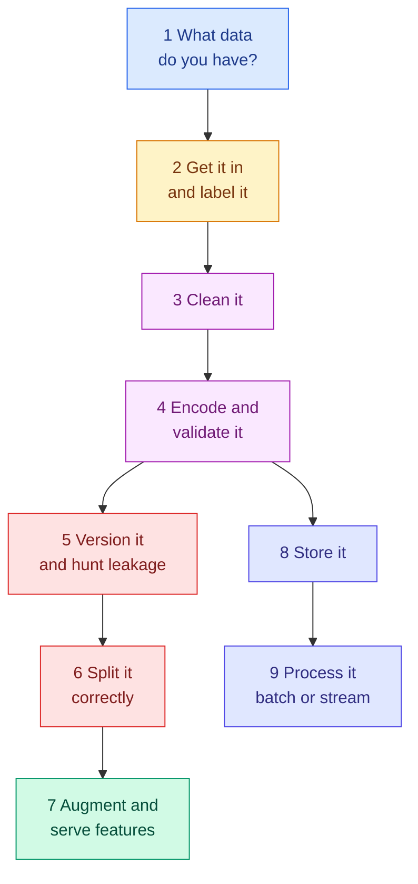

<!-- status: authored -->

# 03. Data Foundations

**Level:** 🟢 Beginner → 🔴 Advanced &nbsp;|&nbsp; **Effort:** Multi-session &nbsp;|&nbsp; **Status:** ✅ Complete

The full data lifecycle — types, collection, cleaning, validation, versioning, splitting, storage
and processing — and how each data problem becomes a model problem.

> **If you read one module before building anything, read this one.** Most failed machine-learning
> projects fail here, not in the modelling. A leaked feature, a split that puts the same user on both
> sides, or a label set with 10% noise will beat any amount of architecture work.

---

## 🎯 Learning Objectives

By the end of this module you will be able to:

- Classify data as structured, semi-structured or unstructured and pick tooling accordingly
- Clean a messy dataset: missing values, duplicates, outliers, encoding
- Split data correctly and recognise leakage before it destroys an evaluation
- Explain data versioning, lineage and quality checks in a team setting
- Choose storage and processing architectures from the requirements, not the fashion

## 📚 Prerequisites

[01 Python Foundations](../01-python-foundations/README.md) — particularly
[pandas](../01-python-foundations/12-pandas-essentials.md). Topics 5 and 6 also use ideas from
[02 Mathematics for AI](../02-mathematics-for-ai/README.md), but you can read them without it.

```bash
pip install -r requirements.txt      # pandas==2.2.3, numpy==2.1.3, scikit-learn==1.5.2
```

Run the examples from the repository root — most read files from `datasets/samples/`.

---

## 📑 Topics

| # | Topic | Covers | Level |
| --- | --- | --- | --- |
| 1 | [Data Types and Modalities](01-data-types.md) | Structured to unstructured, seven modalities, everything becomes numbers | 🟢 |
| 2 | [Collection, Ingestion and Labelling](02-collection-ingestion-and-labelling.md) | Collection bias, validating at the boundary, label noise, Cohen's kappa | 🟢 |
| 3 | [Cleaning](03-cleaning-missing-duplicates-outliers.md) | MCAR/MAR/MNAR, non-identical duplicates, robust outlier detection, scaling | 🟡 |
| 4 | [Encoding and Validation](04-encoding-and-data-validation.md) | One-hot vs label vs target encoding, unseen categories, schema and drift checks | 🟡 |
| 5 | [Lineage, Versioning, Privacy and Leakage](05-lineage-versioning-privacy-and-leakage.md) | Content hashing, six kinds of leakage, pseudonymisation, k-anonymity | 🔴 |
| 6 | [Splits, Sampling and Class Imbalance](06-splits-sampling-and-class-imbalance.md) | Train/validation/test, grouped and time splits, imbalance, threshold tuning | 🟡 |
| 7 | [Synthetic Data, Augmentation and Feature Stores](07-synthetic-data-augmentation-and-feature-stores.md) | What synthetic data can teach, label-preserving augmentation, train/serve skew | 🟡 |
| 8 | [Storage](08-storage-sql-nosql-warehouses-and-lakes.md) | OLTP vs OLAP, row vs columnar, SQL, NoSQL, lakes, lakehouses, Parquet | 🟡 |
| 9 | [Batch versus Stream Processing](09-batch-versus-stream-processing.md) | ETL vs ELT, Kafka as a log, event time, idempotency | 🔴 |

---

## 🗺️ How the pieces fit



**Topics 5 and 6 are the ones that save projects.** They are marked in red above deliberately —
leakage and splitting are where an evaluation quietly stops meaning anything, and no later module
can recover from getting them wrong.

**Topics 8 and 9 are infrastructure** and can be read separately when you need them.

---

## 🧭 Which topics do you actually need?

| If you are | Read |
| --- | --- |
| About to train your first real model | 3, 5, 6 — in that order |
| Debugging a model that scored well and failed live | **5**, then 6, then 7 |
| Building a data pipeline | 2, 4, 8, 9 |
| Handling personal data | 5, and [26 Responsible AI](../26-responsible-ai/README.md) |
| Preparing for interviews | All nine — each has an interview section |

---

## 🧪 Every example is verified

Each code block was executed and shows its **real** output, enforced in continuous integration:

```bash
python scripts/check_examples.py --strict 03-data-foundations/
```

The examples run against this repository's [sample datasets](../datasets/samples/README.md), whose
faults are documented and deliberate — missing readings, a dead sensor, duplicate rows, wrong-case
labels, an impossible temperature. **The cleaning and leakage examples find real problems in real
committed files**, not in toy literals invented for the page.

One example in [Topic 8](08-storage-sql-nosql-warehouses-and-lakes.md) is marked as not executed,
because Parquet needs a dependency this repository does not pin. It says so where it appears.

## 📝 Practice

- Quiz: [`quizzes/03-data-foundations.md`](../quizzes/03-data-foundations.md)
- Answers: [`quizzes/answers/03-data-foundations.md`](../quizzes/answers/03-data-foundations.md)
- Assignments: [`assignments/03-data-foundations.md`](../assignments/03-data-foundations.md)

---

## ⚠️ The five mistakes this module exists to prevent

1. **Leakage.** A feature recorded after the outcome, or the same entity on both sides of a split.
   It produces excellent scores and worthless models, and every process you have rewards it.
2. **A random split on structured data.** Grouped rows need a group split; ordered rows need a
   chronological one. Getting this wrong is the most common cause of "it worked in testing".
3. **Preprocessing fitted before splitting.** Scalers, imputers, encoders and resampling all leak
   unless they live inside a `Pipeline` and are fitted per fold.
4. **Treating imbalance as a modelling problem.** It is usually a metric and threshold problem, and
   resampling adds no information.
5. **Cleaning silently.** If rows disappear without a count, nobody notices until the numbers stop
   reconciling months later.

**A score that is better than the problem should allow is a bug report.** Treat it as one every time.

---

## 📚 Official References

- [scikit-learn: Common pitfalls and recommended practices — scikit-learn developers](https://scikit-learn.org/stable/common_pitfalls.html) — verified 2026-09-01
- [pandas: User guide — pandas development team](https://pandas.pydata.org/docs/user_guide/index.html) — verified 2026-09-01
- [scikit-learn: Cross-validation — scikit-learn developers](https://scikit-learn.org/stable/modules/cross_validation.html) — verified 2026-09-01
- [Datasheets for Datasets — Gebru et al., arXiv](https://arxiv.org/abs/1803.09010) — verified 2026-09-01

---

## 🔗 Navigation

[← 02 Mathematics for AI](../02-mathematics-for-ai/README.md) &nbsp;|&nbsp;
[🏠 Repository Home](../README.md) &nbsp;|&nbsp;
[Topic 1: Data Types →](01-data-types.md)

**Next module:** [04 AI Foundations](../04-ai-foundations/README.md)
