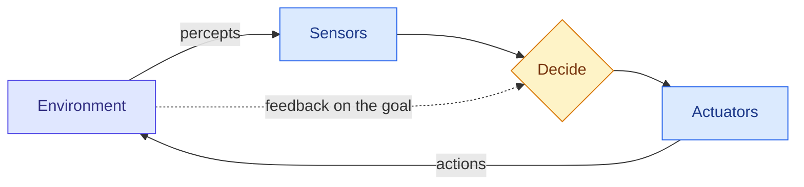

# What Intelligence and Artificial Intelligence Mean

**Level:** 🟢 Beginner &nbsp;|&nbsp; **Effort:** Quick concept &nbsp;|&nbsp; **Module:** [04 AI Foundations](README.md)

---

## 🎯 Learning Objectives

By the end of this topic you will be able to:

- Give a working definition of intelligence that you can actually test a system against
- Describe any AI system as an **agent** that perceives, decides and acts in an environment
- Name the four classic ways of defining Artificial Intelligence (AI), and say which one engineers use
- Explain why "intelligent" is a property of a system *in an environment*, not of a program alone
- Read a product claim of "AI-powered" and ask the questions that reveal what it really does

## 📚 Prerequisites

None. The one code example uses only the Python standard library; if you have not written Python
yet, read the output and the explanation — the idea does not depend on the syntax.

---

## 🍰 1. The simple version

**Intelligence is the ability to reach goals in situations you were not specifically prepared for.**

A calculator is extremely good at arithmetic and nobody calls it intelligent, because it cannot do
anything its designers did not foresee. A child who has never seen a revolving door, and works out
how to get through one, is showing intelligence — adapting to something new.

**Artificial Intelligence (AI) is the engineering effort to build machines that do that.** In
practice, the field uses the word much more loosely: any machine doing a task that would need
intelligence if a person did it — recognising a face, translating a sentence, choosing a chess move.

## 🏠 2. Real-life analogy

> Think of two new employees at a help desk.
>
> The first is given a binder of scripted answers. For the questions in the binder, they are fast and
> perfect. For anything else, they are stuck.
>
> The second is given the same binder, but also watches which answers actually solve customers'
> problems and adjusts. After a month they handle questions the binder never mentioned.
>
> Both are doing the job. Only the second is showing what we mean by intelligence.

**Where the analogy breaks down:** the second employee also *understands* the customer, has common
sense, and knows when to ask a manager. A learning system has none of that by default. It adjusts
to the feedback it receives — and nothing else.

---

## ⚙️ 3. Four ways to define AI

The standard textbook, Russell and Norvig's *Artificial Intelligence: A Modern Approach*, sorts
definitions along two questions: do we care about **thinking** or **acting**, and do we measure
against **humans** or against an ideal of **rationality**?

| | Measured against humans | Measured against rationality |
| --- | --- | --- |
| **Thinking** | Thinking humanly — model human cognition (cognitive science) | Thinking rationally — reach correct conclusions by logic |
| **Acting** | Acting humanly — behave indistinguishably from a person (the Turing Test) | **Acting rationally — do whatever best achieves the goal** |

**Modern engineering works almost entirely in the bottom-right cell.** We rarely care whether a
fraud model *thinks* like an analyst; we care whether it catches fraud. That is the **rational
agent** view, and it is the frame for the rest of this repository.

### The agent view

An **agent** is anything that perceives its environment and acts on it:



| Agent | Percepts | Actions | Goal |
| --- | --- | --- | --- |
| Spam filter | Email text, sender | Deliver or quarantine | Few missed spam, fewer lost real emails |
| Self-driving car | Camera, lidar, radar | Steer, brake, accelerate | Arrive safely |
| Chess engine | Board position | Choose a move | Win |
| Chat assistant | Your message, conversation history | Produce a reply | A helpful, truthful answer |

This frame is useful precisely because it forces three questions every AI project must answer:
**what can the system observe, what can it do, and how do we measure success?** A surprising number
of failed projects never wrote those three answers down.

### Definitions of intelligence you can test

Two research definitions are worth knowing because they are measurable:

- **Legg and Hutter (2007):** intelligence is an agent's ability to achieve goals across a **wide
  range of environments**. The emphasis is *wide range* — one environment is a skill, not intelligence.
- **Chollet (2019):** intelligence is **skill-acquisition efficiency** — how quickly a system gains
  new skills from limited experience and prior knowledge. Under this definition, a system that needed
  billions of examples to learn a task is less intelligent than one that needed ten, even if both
  end up equally good.

Neither is universally accepted. Both are more useful than "a machine that thinks", because you can
design an experiment around them.

---

## 💻 4. Code example — automation versus adaptation

The same task, two agents. One follows a fixed rule; the other adjusts from feedback. The world
changes halfway through.

```python
"""A fixed-rule thermostat versus one that learns from feedback, in a world that changes."""

import random

random.seed(7)


def comfortable(temperature: float, preferred: float) -> bool:
    return abs(temperature - preferred) <= 1.0


class RuleThermostat:
    """Automation: a human chose 21 degrees once. It never changes its mind."""

    def __init__(self) -> None:
        self.target = 21.0

    def act(self) -> float:
        return self.target

    def feedback(self, too_cold: bool) -> None:
        pass                                   # ignores every complaint


class LearningThermostat:
    """A minimal learner: nudges its target towards what the occupant complains about."""

    def __init__(self) -> None:
        self.target = 21.0

    def act(self) -> float:
        return self.target

    def feedback(self, too_cold: bool) -> None:
        self.target += 0.5 if too_cold else -0.5


def run(agent, preferences: list[float]) -> float:
    hits = 0
    for preferred in preferences:
        setting = agent.act() + random.uniform(-0.3, 0.3)   # the heater is imprecise
        if comfortable(setting, preferred):
            hits += 1
        else:
            agent.feedback(too_cold=setting < preferred)
    return hits / len(preferences)


# 100 days with an occupant who likes 21, then 100 days with one who likes 24.
world = [21.0] * 100 + [24.0] * 100

for name, agent in [("rule-based", RuleThermostat()), ("learning", LearningThermostat())]:
    first = run(agent, world[:100])
    second = run(agent, world[100:])
    print(f"{name:<10}  comfortable days: first occupant {first:.0%}, "
          f"second occupant {second:.0%}, final target {agent.target:.1f}")
```

**Output:**
```
rule-based  comfortable days: first occupant 100%, second occupant 0%, final target 21.0
learning    comfortable days: first occupant 100%, second occupant 95%, final target 23.5
```

**Read the output carefully — there are three lessons in it.**

1. **In an unchanging world, the rule is just as good.** Both score 100% for the first occupant.
   If your environment never changes, automation is cheaper, simpler and easier to audit. That is a
   legitimate engineering choice, not a failure of ambition.
2. **When the world changes, only the adaptive agent recovers.** It lost five days complaining its
   way from 21.0 up to 23.5, then was comfortable for the other 95.
3. **It stopped at 23.5, not 24.** Once the setting was inside the comfort band, complaints stopped —
   and so did learning. **A learning system learns only from the feedback it gets.** No complaint,
   no correction. That is exactly how real models drift into "good enough" and stay there.

**This is a teaching example**, not a control system. Real thermostats that learn use schedules,
occupancy sensors and models of how quickly a room heats — but the principle is the same.

---

## 🌍 5. Real-world example — what "AI-powered" means on a product page

"AI-powered" is a marketing phrase, not a technical claim. When evaluating a product, a vendor or
your own team's proposal, translate it with the agent questions:

| Ask | What a weak answer sounds like | What a strong answer sounds like |
| --- | --- | --- |
| What does it observe? | "It uses all your data" | "Transaction amount, merchant category, device, time since last purchase" |
| What does it decide? | "It makes smart decisions" | "A fraud score from 0 to 1; above 0.8 the payment is held" |
| How is success measured? | "Customers love it" | "Recall on confirmed fraud, and the false-hold rate, tracked weekly" |
| Does it learn after deployment? | "It keeps getting smarter" | "Retrained monthly on labelled outcomes; frozen between releases" |
| What happens outside its experience? | "It handles everything" | "New merchant types fall back to rules and are flagged for review" |

A large share of systems sold as AI are fixed rules, a search index, or a model trained once and
never updated. **None of those is wrong** — but you need to know which one you are buying, because
each fails differently.

### Regulators have definitions too

Policy bodies define AI systems for the purpose of deciding what rules apply. The Organisation for
Economic Co-operation and Development (OECD) definition, which the European Union's AI Act closely
follows, describes a machine-based system that **infers from its inputs** how to produce outputs —
predictions, content, recommendations or decisions — that can influence physical or virtual
environments, with varying autonomy and adaptiveness.

Notice the word **infers**. A system that only executes explicitly programmed rules may fall outside
such definitions; a model trained from data generally falls inside. Whether a specific system is in
scope of a specific regulation is a legal question — this repository does not give legal advice, and
you should read the current text and consult qualified counsel.

---

## ⚠️ 6. Common mistakes

| Mistake | Why it happens | Fix |
| --- | --- | --- |
| "It is AI, so it understands" | Fluent output looks like understanding | Judge by measured behaviour on cases it has not seen |
| Calling every automation "AI" | Marketing incentive | Ask: does it learn, or infer, or only execute rules? |
| Assuming a learning system improves forever | "Learning" sounds open-ended | It improves only on feedback it receives, and can learn the wrong thing |
| Defining success after building | Excitement about the technique | Write down percepts, actions and the success metric first |
| Treating one benchmark as intelligence | A single number is easy to report | High skill in one environment is a skill; test across environments |

## 🔐 7. Security and safety note

**Anthropomorphism is a security risk.** When people believe a system understands them, they trust
it with decisions and data it should not have. Two concrete consequences:

- **Automation bias** — people accept a system's output even when their own evidence contradicts it.
  Design reviews should ask how a human can notice and override a wrong answer.
- **Over-privileged agents** — an assistant that "seems smart" gets granted access to email,
  payments or production systems. Grant permissions for what the system *demonstrably* does
  reliably, not for what it appears to understand. This is covered properly in
  [28 AI Security](../28-ai-security/README.md) and [18 AI Agents](../18-ai-agents/README.md).

---

## 🎤 8. Interview questions

<details>
<summary><b>Q1: How would you define Artificial Intelligence in a way that is useful to an engineer?</b></summary>

As a rational agent: a system that perceives an environment and chooses actions that best achieve a
stated goal. That definition is useful because it forces three specifications — the inputs the system
can observe, the actions it can take, and the metric that defines success — and every one of them is
testable.

It is worth contrasting with "acting humanly" (the Turing Test) and "thinking humanly" (cognitive
modelling). Engineering rarely needs either: a fraud model is judged by the fraud it catches, not by
whether it reasons like an analyst. Mentioning that the field contains both learning approaches and
hand-written rule systems shows you know AI is broader than Machine Learning.
</details>

<details>
<summary><b>Q2: A stakeholder says "our system is intelligent because it has 99% accuracy". How do you respond?</b></summary>

Accuracy on one test set measures a **skill in one environment**, not intelligence and not
robustness. I would ask: 99% on what distribution, collected how, and compared to what baseline? If
99% of cases are one class, predicting that class scores 99% and learns nothing. Then I would ask how
it performs on data from a different time period, region or customer segment, because a definition
like Legg and Hutter's makes the *range* of environments the point.

The practical outcome is an evaluation plan: a baseline, a held-out set that reflects production, and
at least one deliberately shifted set. That turns a marketing number into an engineering claim.
</details>

<details>
<summary><b>Q3: When would you deliberately choose a fixed rule over a learning system?</b></summary>

When the environment is stable, the rule is known and explainable, errors are expensive to explain,
or there is too little labelled data to learn from. Tax calculations, input validation, and hard
safety limits are good examples — a learned model adds uncertainty without adding value.

Many production systems combine both: rules for hard constraints and known cases, a model for the
ambiguous middle, and rules again as a guardrail on the model's output. The trade-off is adaptability
against predictability, auditability and cost.
</details>

---

## ✅ Key takeaways

- **Intelligence is reaching goals in situations you were not specifically prepared for.** Skill in
  one fixed situation is not the same thing.
- Engineers use the **rational agent** view: percepts, actions, and a measurable goal.
- **In a stable world, a rule is as good as a learner** — and cheaper and more auditable.
- **A learning system learns only from the feedback it receives**, and stops when feedback stops.
- "AI-powered" is a marketing phrase. Ask what it observes, decides, measures and does when surprised.
- Regulatory definitions centre on systems that **infer** outputs; scope questions are legal ones.
- Believing a system understands leads to over-trust and over-privilege — both security risks.

---

## 📚 Official References

- [Artificial Intelligence — Stanford Encyclopedia of Philosophy](https://plato.stanford.edu/entries/artificial-intelligence/) — verified 2026-09-14
- [Artificial Intelligence: A Modern Approach, textbook site — Russell and Norvig, UC Berkeley](https://aima.cs.berkeley.edu/) — verified 2026-09-14
- [Universal Intelligence: A Definition of Machine Intelligence — Legg and Hutter, arXiv](https://arxiv.org/abs/0712.3329) — verified 2026-09-14
- [On the Measure of Intelligence — Chollet, arXiv](https://arxiv.org/abs/1911.01547) — verified 2026-09-14
- [OECD AI Principles and definition of an AI system — OECD.AI](https://oecd.ai/en/ai-principles) — verified 2026-09-14 (policy page; revised periodically)
- [Regulation (EU) 2024/1689, the Artificial Intelligence Act — EUR-Lex, European Union](https://eur-lex.europa.eu/eli/reg/2024/1689/oj) — verified 2026-09-14 (legal text; read the current consolidated version)

---

## 🔗 Navigation

[← Module home](README.md) &nbsp;|&nbsp;
[🏠 Repository Home](../README.md) &nbsp;|&nbsp;
[Topic 2: AI, ML, Deep Learning and Generative AI →](02-ai-ml-deep-learning-and-generative-ai.md)
