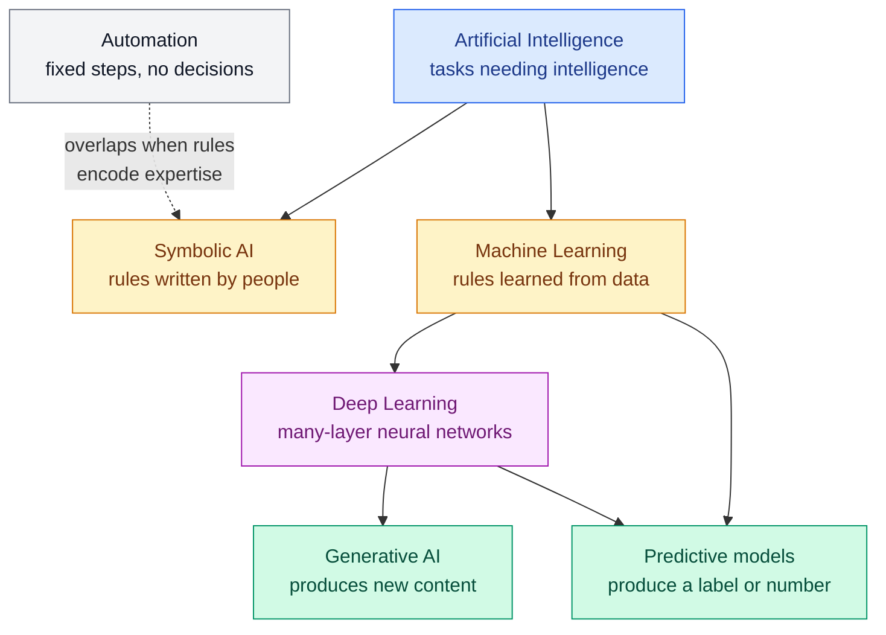

# AI, Machine Learning, Deep Learning and Generative AI

**Level:** 🟢 Beginner &nbsp;|&nbsp; **Effort:** Short module &nbsp;|&nbsp; **Module:** [04 AI Foundations](README.md)

---

## 🎯 Learning Objectives

By the end of this topic you will be able to:

- Draw the containment relationship between Artificial Intelligence (AI), Machine Learning (ML),
  Deep Learning (DL) and Generative AI — and place symbolic AI correctly on it
- Tell automation from AI, and AI from ML, using one test question each
- Explain what deep learning adds that other ML does not, with a concrete failure it fixes
- Distinguish predictive from generative models by what they output
- Choose the simplest approach that fits a problem, and justify why

## 📚 Prerequisites

- [Topic 1: What Intelligence and AI Mean](01-what-intelligence-and-ai-mean.md)
- The code uses scikit-learn; if you have not met it, read
  [Your First scikit-learn Model](../01-python-foundations/14-your-first-scikit-learn-model.md) —
  or read only the outputs, which carry the lesson.

```bash
pip install -r requirements.txt      # scikit-learn==1.5.2, numpy==2.1.3
```

---

## 🍰 1. The simple version

Imagine teaching a new cook.

- **Automation** is a vending machine: press B4, get a sandwich. Nobody would call it a cook.
- **AI** is anything that makes food decisions a cook would make. That includes a very detailed
  recipe book with rules like "if the sauce is too thick, add water" — someone wrote those rules.
- **Machine learning** is a cook who was never given the rules. They tasted thousands of dishes
  with ratings, and worked out for themselves what makes a sauce good.
- **Deep learning** is a machine-learning cook who also worked out *what to pay attention to* —
  nobody told them "check the thickness"; they discovered thickness mattered.
- **Generative AI** is a cook who, having tasted thousands of dishes, invents a new one.

## 🏠 2. The picture everyone should be able to draw



**Two things this picture gets right that a set of nested circles gets wrong:**

1. **Symbolic AI is AI but not ML.** Chess engines built on search and medical expert systems built
   from rules are AI without learning anything. Topic 4 covers them.
2. **"Predictive versus generative" cuts across the layers.** A deep network can be predictive (an
   image classifier) and a non-deep model can be generative (the word-pair model below). Generative
   AI, as the term is used today, means large deep models — but the idea is older than deep learning.

**Where the picture breaks down:** these are overlapping families, not tidy boxes. Real systems mix
them — a large language model (generative, deep) is often wrapped in hand-written rules (symbolic)
that block unsafe outputs.

---

## ⚙️ 3. One test question for each boundary

| Boundary | Ask | If yes | If no |
| --- | --- | --- | --- |
| Automation vs AI | Does it make a decision a skilled person would otherwise make? | AI | Automation |
| Symbolic AI vs ML | Did a person write the decision rules, or were they estimated from data? | Written: symbolic. Estimated: ML | — |
| ML vs deep learning | Did people design the input features, or did a multi-layer network learn its own? | Learned representations: DL | Hand-built features: classical ML |
| Predictive vs generative | Is the output one choice from a fixed set, or a new artefact? | New artefact: generative | Label or number: predictive |

### Machine learning, stated precisely

Tom Mitchell's widely used definition: a program **learns** from experience E with respect to a task
T and performance measure P if its performance at T, as measured by P, improves with E. A spam filter
(T) improves at catching spam, measured by accuracy (P), as it sees more labelled email (E).

**The useful part is the last clause.** If nothing about the system improves with data, it is not
machine learning, whatever the brochure says.

---

## 💻 4. Code example — rules versus learning, on the same problem

A person writes a spam rule. A Naive Bayes model — a simple probabilistic classifier covered in
[05 Machine Learning](../05-machine-learning/README.md) — learns from twelve labelled messages.

```python
"""The same spam problem solved by hand-written rules and by a model that learns them."""

from sklearn.feature_extraction.text import CountVectorizer
from sklearn.naive_bayes import MultinomialNB

train = [
    ("win a free prize now", "spam"),
    ("claim your free cash reward", "spam"),
    ("urgent: your account prize is waiting", "spam"),
    ("limited offer, win cash today", "spam"),
    ("exclusive reward, claim now", "spam"),
    ("congratulations you won a voucher", "spam"),
    ("lunch at noon tomorrow?", "ham"),
    ("here are the meeting notes", "ham"),
    ("can you review my pull request", "ham"),
    ("the train is delayed, running late", "ham"),
    ("dinner plans for friday", "ham"),
    ("attached is the quarterly report", "ham"),
]
test = [
    ("free prize inside", "spam"),
    ("claim your voucher reward today", "spam"),   # no word from the rule list
    ("congratulations, exclusive cash offer", "spam"),
    ("notes from the review meeting", "ham"),
    ("is the free parking near the office?", "ham"),  # 'free' in an innocent message
    ("running late for lunch", "ham"),
]

SPAM_WORDS = {"free", "win", "prize"}          # what a human wrote down


def rule_filter(message: str) -> str:
    words = set(message.lower().replace(",", " ").replace("?", " ").split())
    return "spam" if words & SPAM_WORDS else "ham"


texts, labels = zip(*train)
vectoriser = CountVectorizer()
model = MultinomialNB().fit(vectoriser.fit_transform(texts), labels)

print(f"{'message':<42}{'truth':<7}{'rules':<7}{'learned'}")
rule_hits = learned_hits = 0
for message, truth in test:
    by_rule = rule_filter(message)
    by_model = model.predict(vectoriser.transform([message]))[0]
    rule_hits += by_rule == truth
    learned_hits += by_model == truth
    print(f"{message:<42}{truth:<7}{by_rule:<7}{by_model}")

print(f"\naccuracy: rules {rule_hits}/{len(test)}, learned {learned_hits}/{len(test)}")

# The model's "rules" are numbers it estimated, not words someone typed.
spam_index = list(model.classes_).index("spam")
log_ratio = model.feature_log_prob_[spam_index] - model.feature_log_prob_[1 - spam_index]
vocabulary = vectoriser.get_feature_names_out()
strongest = sorted(zip(log_ratio, vocabulary), reverse=True)[:5]
print("most spam-indicative words the model found:", [word for _, word in strongest])
```

**Output:**
```
message                                   truth  rules  learned
free prize inside                         spam   spam   spam
claim your voucher reward today           spam   ham    spam
congratulations, exclusive cash offer     spam   ham    spam
notes from the review meeting             ham    ham    ham
is the free parking near the office?      ham    spam   ham
running late for lunch                    ham    ham    ham

accuracy: rules 3/6, learned 6/6
most spam-indicative words the model found: ['your', 'win', 'reward', 'prize', 'now']
```

**The rules fail in both directions.** They miss spam that avoids the three listed words, and flag an
innocent message about free parking. Every fix means a person writing another rule — forever.

**Now look at the last line, because it is the more important lesson.** The strongest spam signal the
model found is **"your"**. That is not insight; in twelve training messages, "your" happened to appear
only in spam. The model will happily flag "your meeting notes are attached". **Learning finds
correlations in the data you gave it, including accidental ones.** And a perfect 6/6 on six test
messages proves almost nothing — [03 Data Foundations](../03-data-foundations/06-splits-sampling-and-class-imbalance.md)
explains how large a test set has to be before a score means anything.

---

## 💻 5. Code example — what "deep" buys you

XOR ("exclusive or") is true when exactly one of two inputs is true. It is the smallest problem a
straight-line model cannot solve, and its history matters — see
[Topic 6](06-turing-test-history-and-ai-winters.md).

```python
"""Why depth matters: a linear model cannot learn XOR, a small neural network can."""

import numpy as np
from sklearn.linear_model import LogisticRegression
from sklearn.neural_network import MLPClassifier

X = np.array([[0, 0], [0, 1], [1, 0], [1, 1]])
y = np.array([0, 1, 1, 0])                     # XOR: true when exactly one input is true

linear = LogisticRegression().fit(X, y)
network = MLPClassifier(hidden_layer_sizes=(4,), activation="tanh",
                        solver="lbfgs", random_state=0, max_iter=1000).fit(X, y)

print("inputs  XOR  linear  network")
for inputs, target, a, b in zip(X, y, linear.predict(X), network.predict(X)):
    print(f"{inputs}   {target}     {a}       {b}")
print(f"\naccuracy: linear {linear.score(X, y):.0%}, network {network.score(X, y):.0%}")
```

**Output:**
```
inputs  XOR  linear  network
[0 0]   0     0       0
[0 1]   1     0       1
[1 0]   1     0       1
[1 1]   0     0       0

accuracy: linear 50%, network 100%
```

**The linear model gives up and predicts 0 for everything** — 50%, no better than a coin. No single
straight line separates the true cases from the false ones. The Multi-Layer Perceptron (MLP), with a
hidden layer of four neurons, **invents an intermediate representation** in which a line does work.

That is the whole idea of deep learning at a tiny scale: **layers that learn new features from the
previous layer's features.** With an image, early layers learn edges, later ones shapes, later ones
objects — nobody writes an edge detector. [08 Deep Learning](../08-deep-learning/README.md) builds
this from scratch.

---

## 💻 6. Code example — predictive versus generative

One tiny corpus, two uses. The predictive model answers "which animal is this sentence about?". The
generative model learns which word tends to follow which — a bigram model — and produces new text.

```python
"""Predictive versus generative on one corpus: label a sentence, or produce a new one."""

import random
from collections import Counter, defaultdict

corpus = [
    "the cat sat on the mat",
    "the dog sat on the rug",
    "the cat chased the dog",
    "the dog chased the ball",
    "a cat slept on the rug",
]
labels = ["cat", "dog", "cat", "dog", "cat"]   # which animal the sentence is about

# --- predictive: map an input to one of a fixed set of answers ---
word_counts = {label: Counter() for label in set(labels)}
for sentence, label in zip(corpus, labels):
    word_counts[label].update(sentence.split())


def predict(sentence: str) -> str:
    scores = {label: sum(counts[w] for w in sentence.split()) for label, counts in word_counts.items()}
    return max(sorted(scores), key=scores.get)


print("predictive:", "'the cat sat' ->", predict("the cat sat"))

# --- generative: learn which word follows which, then sample new sequences ---
following = defaultdict(list)
for sentence in corpus:
    words = ["<s>"] + sentence.split() + ["</s>"]
    for current, nxt in zip(words, words[1:]):
        following[current].append(nxt)

random.seed(3)
print("generative samples:")
for _ in range(4):
    word, output = "<s>", []
    while True:
        word = random.choice(following[word])
        if word == "</s>" or len(output) == 12:
            break
        output.append(word)
    sentence = " ".join(output)
    novelty = "new" if sentence not in corpus else "copied from training"
    print(f"  {sentence:<32} ({novelty})")
```

**Output:**
```
predictive: 'the cat sat' -> cat
generative samples:
  the rug                          (new)
  the ball                         (new)
  a cat chased the rug             (new)
  the ball                         (new)
```

**Every sample is "new", and most are nonsense.** "A cat chased the rug" is novel and grammatical;
"the rug" is a fragment the model produced because "rug" was often followed by the end of a sentence.
Novelty is not quality.

A large language model is, at its core, the same **predict-the-next-token** loop — with a
Transformer network instead of a table of word pairs, trained on vastly more text. The jump in
quality is enormous; the output is still sampled from learned statistics, which is why fluent,
confident, wrong answers are possible. [13 Large Language Models](../13-large-language-models/README.md)
covers how.

---

## 🌍 7. Choosing between them in the real world

**Start with the simplest thing that could work, and move inward only when you have evidence.**

| Situation | Reach for | Why |
| --- | --- | --- |
| Rules are known, stable and must be auditable (tax, eligibility, validation) | Rules or plain automation | Predictable, explainable, no training data needed |
| Tabular business data: churn, fraud, pricing, credit | Classical ML — gradient-boosted trees, linear models | Strong accuracy, fast, interpretable enough, modest data |
| Images, audio, raw text where features are hard to hand-design | Deep learning | Learns the features; needs more data and compute |
| Producing text, images, code or summaries | Generative AI | The only family that outputs new artefacts |
| A generative model must not say certain things | Generative AI **plus rules** | Rules as guardrails around a model's output |

**Industry examples:**

- **Banking:** hard rules block sanctioned countries; a gradient-boosted model scores fraud; a
  generative model drafts the case summary an investigator reviews.
- **Retail:** rules apply promotions; ML forecasts demand; deep learning reads product images;
  generative AI writes product descriptions for human editing.
- **Healthcare:** clinical rules flag drug interactions; deep learning highlights regions on a scan
  for a radiologist; neither makes the final decision alone.

## 💰 8. Cost note

Each step inward usually raises cost on four axes: **labelled data, compute, specialist skills, and
difficulty explaining a decision**. A rules engine can run on the smallest server you have; training a
deep model may need Graphics Processing Units (GPUs); running a large generative model is typically
billed per token by a provider. Check the provider's own pricing calculator — prices change often.
The drivers do not.

---

## ⚠️ 9. Common mistakes

| Mistake | Why it happens | Fix |
| --- | --- | --- |
| Using AI, ML and deep learning as synonyms | Media usage | Use the containment picture; name symbolic AI |
| Reaching for deep learning on a 5,000-row table | It is what gets attention | Try gradient-boosted trees and a linear baseline first |
| Believing a learned model found real signal | High accuracy looks like understanding | Inspect what it relies on; "your" was the top spam word |
| Using a generative model for a classification task | One tool for everything | A small classifier is cheaper, faster, easier to evaluate |
| Assuming "generative" means "deep" | Recent history | Bigram models were generative decades before deep learning |

## 🔐 10. Security note

- **Learned models inherit whatever is in the data**, including correlations an attacker can
  exploit. If a spam filter learns that one word signals "safe", spammers will use that word.
  Adversarial manipulation is covered in [28 AI Security](../28-ai-security/README.md).
- **Generative output is untrusted input.** Never pass it to `eval`, a shell or a database query
  unvalidated — a model can be steered into producing exactly the string an attacker wants.
- **Rules are not automatically safer.** They are predictable, which also makes them easy to probe
  and route around. Combine layers rather than relying on one.

---

## 🎤 11. Interview questions

<details>
<summary><b>Q1: Is every machine-learning system an AI system? Is every AI system a machine-learning system?</b></summary>

The first is conventionally yes — ML is a subfield of AI. The second is no: symbolic AI systems such as
rule-based expert systems, classical planners and search-based game engines are AI without learning
from data. A strong answer adds that production systems routinely combine both, for example rules as
hard constraints around a learned model, because the approaches fail in different ways.
</details>

<details>
<summary><b>Q2: Your team wants to use deep learning for a churn model on 20,000 customer rows. What do you advise?</b></summary>

Start with a baseline and classical ML — logistic regression, then gradient-boosted trees — because
on tabular data of that size they are usually as accurate or better, train in seconds, and are easier
to explain to the business. Deep learning's main advantage is learning features from raw, high
dimensional inputs such as pixels or audio; a customer table already has hand-built features.

I would move to a neural approach only with evidence: the tree model has plateaued, there is
unstructured data to add (support-ticket text, for instance), or there is enough data that a
learned representation plausibly helps. The trade-off to name is accuracy against cost,
interpretability and iteration speed.
</details>

<details>
<summary><b>Q3: What is the difference between a predictive and a generative model? Give an example where the line blurs.</b></summary>

A predictive model maps an input to one answer from a fixed space — a class or a number. A generative
model produces a new artefact by sampling, typically one token or pixel at a time from a learned
distribution.

The line blurs because a generative language model is internally a predictor: at each step it predicts
a probability distribution over the next token, then samples. And a large language model can be *used*
as a classifier by asking it to answer "positive" or "negative". That works, but a dedicated small
classifier is usually cheaper, faster and easier to evaluate for a fixed label set.
</details>

<details>
<summary><b>Q4: A model's most important feature for spam turns out to be the word "your". What happened and what do you do?</b></summary>

A spurious correlation: in the training data that word co-occurred with spam by accident, usually
because the dataset is small or collected unrepresentatively. The model has no way to know the
difference between a causal signal and a coincidence.

Actions: collect more and more varied data; evaluate on a held-out set that reflects real traffic;
test targeted counter-examples ("your meeting notes"); and review feature importances as a routine
check. Treating model explanations as a debugging tool is covered in
[27 Explainable AI](../27-explainable-ai/README.md).
</details>

More interview practice on this boundary: [Interview Bank 1 — AI and ML Fundamentals](../38-interview-preparation/01-ai-ml-fundamentals.md).

---

## ✅ Key takeaways

- **AI ⊃ ML ⊃ deep learning.** Symbolic AI sits inside AI but outside ML.
- **Predictive versus generative is a separate axis** — it describes the output, not the depth.
- Automation executes; symbolic AI applies written expertise; **ML estimates rules from data**.
- Rules fail where the writer did not anticipate; **learned models fail where the data misled them**.
- **Deep learning learns its own features** — the XOR network invented a representation a line could separate.
- **Generative output is novel, not necessarily good**, and never trusted input.
- Start simple; move inward on evidence, because each step costs data, compute and explainability.

---

## 📚 Official References

- [scikit-learn: Naive Bayes — scikit-learn developers](https://scikit-learn.org/stable/modules/naive_bayes.html) — verified 2026-09-14
- [scikit-learn: Neural network models, supervised — scikit-learn developers](https://scikit-learn.org/stable/modules/neural_networks_supervised.html) — verified 2026-09-14
- [Artificial Intelligence — Stanford Encyclopedia of Philosophy](https://plato.stanford.edu/entries/artificial-intelligence/) — verified 2026-09-14
- [Attention Is All You Need — Vaswani et al., arXiv](https://arxiv.org/abs/1706.03762) — verified 2026-09-14
- [Artificial Intelligence: A Modern Approach, textbook site — Russell and Norvig, UC Berkeley](https://aima.cs.berkeley.edu/) — verified 2026-09-14

---

## 🔗 Navigation

[← Topic 1: What Intelligence and AI Mean](01-what-intelligence-and-ai-mean.md) &nbsp;|&nbsp;
[🏠 Module Home](README.md) &nbsp;|&nbsp;
[Topic 3: Narrow AI, General AI and Superintelligence →](03-narrow-general-and-superintelligence.md)
