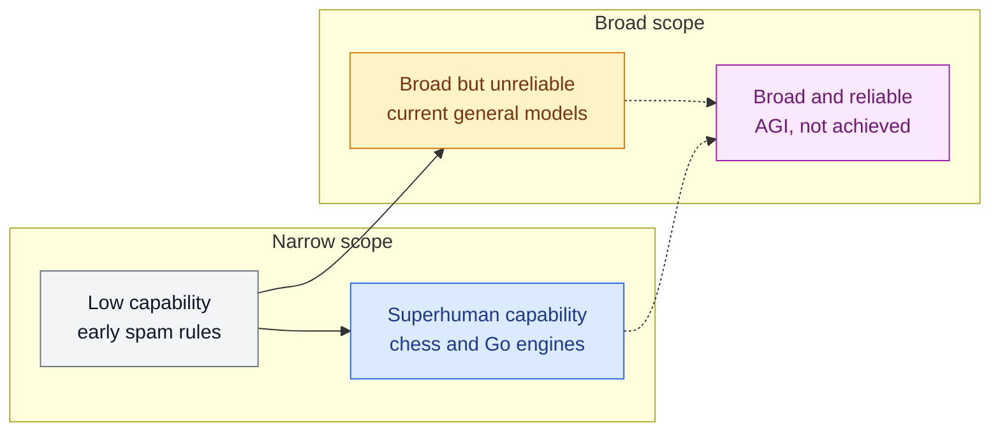

# Narrow AI, General AI and Superintelligence

**Level:** 🟢 Beginner &nbsp;|&nbsp; **Effort:** Quick concept &nbsp;|&nbsp; **Module:** [04 AI Foundations](README.md)

---

## 🎯 Learning Objectives

By the end of this topic you will be able to:

- Define Artificial Narrow Intelligence (ANI), Artificial General Intelligence (AGI) and Artificial
  Superintelligence (ASI), and say which exist today
- Demonstrate, with code, how a highly accurate narrow system fails one small step outside its task
- Separate **capability** (how well) from **generality** (how many different situations)
- Discuss AGI claims and forecasts critically, without either hype or dismissal
- Explain why narrowness is a practical reliability and safety concern, not just a philosophical one

## 📚 Prerequisites

- [Topic 1: What Intelligence and AI Mean](01-what-intelligence-and-ai-mean.md)
- [Topic 2: AI, ML, Deep Learning and Generative AI](02-ai-ml-deep-learning-and-generative-ai.md)

---

## 🍰 1. The simple version

- **Narrow AI** is a brilliant specialist. It plays chess better than any human and cannot boil an
  egg, or even play chess on a board with one extra square.
- **General AI** would be a capable all-rounder: able to learn almost any intellectual task a person
  can, and transfer what it learns from one to another.
- **Superintelligence** would be an all-rounder that is far better than the best humans at nearly
  everything.

**Every AI system deployed today is narrow** in the sense that matters for engineering: it performs
well within the range of situations it was built and tested for, and its behaviour outside that range
is not guaranteed. General-purpose language models have pushed that range much wider — which is why
the question of where "narrow" ends is now genuinely debated.

## 🏠 2. Real-life analogy

> A satnav is superhuman at routing. It knows every road, computes instantly and never gets tired.
> Now close a road that is not in its map. It confidently sends you towards the barrier, again and
> again, because "this road is closed" is not something its world contains.
>
> A local taxi driver sees the barrier, shrugs, and takes a side street they have never used.

The satnav has more **capability** at routing. The driver has more **generality**. Those are
different axes, and most arguments about AGI confuse them.

**Where the analogy breaks down:** modern satnavs *do* reroute around reported closures — because
engineers anticipated that case and added it. That is the pattern: narrow systems get wider by people
foreseeing more situations, not by the system deciding to cope.

---

## ⚙️ 3. The three categories, technically

| | Artificial Narrow Intelligence | Artificial General Intelligence | Artificial Superintelligence |
| --- | --- | --- | --- |
| **Also called** | Weak AI, narrow AI | Strong AI, human-level AI | — |
| **Scope** | One task or a bounded family of tasks | Most cognitive tasks humans can do | Nearly all cognitive tasks |
| **Transfer** | Little outside training conditions | Learns new tasks efficiently from little experience | Beyond human |
| **Exists?** | Yes — every deployed system | No agreed example | No |
| **Examples** | Spam filters, image classifiers, recommendation engines, chess engines, speech recognition | Contested; see below | Hypothetical |

"Strong AI" originally meant something narrower: a philosophical claim that a suitably programmed
machine would literally *have* a mind, not merely behave as if it did. Engineers now mostly use it as a
synonym for AGI. When reading older texts, check which sense is meant.

### Capability and generality are different axes



A Go engine is at the top of capability and the bottom of generality. A large language model answers
questions on medicine, law and code — broad — but can still make errors a novice would not, and can do
so with full confidence. **Neither is AGI, for opposite reasons.**

### Why defining AGI is hard

There is no agreed test. Proposed markers include:

- **Economic** — can perform most economically valuable work a person can do
- **Behavioural** — passes extended, adversarial conversation tests (see the
  [Turing Test](06-turing-test-history-and-ai-winters.md) and its limits)
- **Learning efficiency** — acquires genuinely new skills from little data, which is Chollet's
  measure from [Topic 1](01-what-intelligence-and-ai-mean.md)
- **Breadth of benchmarks** — high scores across many unrelated evaluations

Each can be gamed or argued with. Benchmarks in particular tend to stop being informative once systems
are optimised against them — the Stanford AI Index tracks how quickly established benchmarks have
saturated. **When someone claims AGI has arrived, or is imminent, the first question is: by which
definition, measured how?**

---

## 💻 4. Code example — narrowness you can measure

A classifier is trained on the scikit-learn handwritten digits dataset — 8×8 greyscale images, bundled
with the library so nothing is downloaded. Then the *same* test digits are changed in ways a person
would not even notice as a different task.

```python
"""Narrow AI in one experiment: excellent on its task, helpless one small step outside it."""

import numpy as np
from sklearn.datasets import load_digits
from sklearn.linear_model import LogisticRegression
from sklearn.model_selection import train_test_split

digits = load_digits()                         # 8x8 greyscale digits, pixel values 0-16
X_train, X_test, y_train, y_test = train_test_split(
    digits.data, digits.target, test_size=0.3, random_state=0, stratify=digits.target
)
model = LogisticRegression(max_iter=5000).fit(X_train, y_train)

shifted = np.roll(X_test.reshape(-1, 8, 8), shift=2, axis=2).reshape(-1, 64)   # 2 pixels right
inverted = 16 - X_test                                                        # white on black
blank = np.zeros((1, 64))                                                     # not a digit at all

print(f"test digits, as trained:        {model.score(X_test, y_test):.1%}")
print(f"same digits, shifted 2 pixels:  {model.score(shifted, y_test):.1%}")
print(f"same digits, colours inverted:  {model.score(inverted, y_test):.1%}")
print(f"chance level for 10 classes:    {1 / 10:.1%}")

confidence_normal = model.predict_proba(X_test).max(axis=1)
confidence_inverted = model.predict_proba(inverted).max(axis=1)
print(f"\nmedian confidence on normal digits:   {np.median(confidence_normal):.2f}")
print(f"median confidence on inverted digits: {np.median(confidence_inverted):.2f}  (every one wrong)")
print(f"inverted digits predicted with confidence above 0.9: "
      f"{(confidence_inverted > 0.9).sum()} of {len(inverted)}")

print(f"\nblank image -> still answers digit {model.predict(blank)[0]}; "
      f"'not a digit' is not an option it has")
```

**Output:**
```
test digits, as trained:        96.1%
same digits, shifted 2 pixels:  8.7%
same digits, colours inverted:  0.0%
chance level for 10 classes:    10.0%

median confidence on normal digits:   1.00
median confidence on inverted digits: 1.00  (every one wrong)
inverted digits predicted with confidence above 0.9: 463 of 540

blank image -> still answers digit 8; 'not a digit' is not an option it has
```

**Three lessons, in increasing order of importance.**

1. **96% becomes worse than guessing** after a two-pixel shift. A person would not notice the shift.
   The model learned "which pixels are dark", not "what a 3 looks like".
2. **Inverting colours drops accuracy to exactly zero** — not to chance. The model is systematically,
   not randomly, wrong, because inverted images push every pixel feature the opposite way.
3. **The confidence does not drop.** The median confidence on the inverted digits is the same 1.00 as
   on real ones, and 463 of 540 wrong answers come with over 90% confidence. **A narrow system
   usually cannot tell you that it is outside its competence.** That is the property that makes
   narrowness dangerous in production, and it is not unique to small models.

**Teaching example, deliberately simple.** A convolutional network with data augmentation
([09 Computer Vision](../09-computer-vision/README.md)) would survive a two-pixel shift — because its
designers anticipated shifts. It would still fail on some other change nobody anticipated. The
boundary moves; it does not disappear.

---

## 🌍 5. Real-world consequences of narrowness

| Domain | Trained on | Deployed into | What went wrong, in general terms |
| --- | --- | --- | --- |
| Medical imaging | Scans from one hospital's machines | A hospital with different scanners | Accuracy drops on images with different contrast and artefacts |
| Fraud detection | Fraud patterns before a new payment method | After it launches | Fraudsters move to the pattern the model never saw |
| Self-driving perception | Mostly clear weather, one region | Snow, unusual road markings | Rare conditions are exactly where training data is thin |
| Demand forecasting | A stable period | A sudden shock to buying behaviour | Every learned seasonal pattern stops applying at once |

The engineering response is covered across the curriculum: distribution-shift monitoring
([29 MLOps](../29-mlops/README.md)), evaluating on deliberately shifted test sets
([36 AI Evaluation](../36-ai-evaluation/README.md)), and letting a system abstain or defer to a human
when inputs look unfamiliar.

---

## 🔭 6. AGI and superintelligence — a sober framing

**What is not in dispute:**

- Current general-purpose models are dramatically broader than systems from a decade earlier.
- They remain unreliable in ways that matter: confident errors, sensitivity to phrasing, and
  inconsistent performance on problems that look alike to a person.
- The organisations building them, governments and independent researchers all treat risks from
  increasingly capable systems as a serious subject — see the
  [NIST AI Risk Management Framework](https://www.nist.gov/itl/ai-risk-management-framework).

**What is genuinely in dispute:**

- Whether scaling current approaches leads to AGI, or whether new ideas are required
- What counts as AGI in the first place
- When, if ever — **expert forecasts vary enormously**, and this repository makes no prediction

**Why superintelligence is discussed at all:** a system much more capable than its overseers raises the
**alignment** problem — ensuring its goals and behaviour stay what we intended, when we can no longer
check its work directly. You do not need to hold any view on timelines to see that the smaller,
present-day version of the same problem already exists: the digit model above was confidently wrong,
and nobody could tell from its output. [26 Responsible AI](../26-responsible-ai/README.md) covers
current practice.

---

## ⚠️ 7. Common mistakes

| Mistake | Why it happens | Fix |
| --- | --- | --- |
| "It is superhuman at X, so it is intelligent" | Capability is impressive | Separate capability from generality |
| Treating high confidence as correctness | Probabilities look calibrated | Test on shifted data; confidence was 1.00 on every wrong answer |
| Assuming a broad model is reliable everywhere | Fluency across topics | Evaluate on *your* task and *your* data before trusting it |
| Stating AGI timelines as fact | Headlines | Say which definition, and that forecasts disagree widely |
| Dismissing AGI discussion entirely | Reaction against hype | The present-day version — oversight of capable, opaque systems — is real engineering |

## 🔐 8. Security note

**Out-of-distribution inputs are an attack surface.** If a model's behaviour outside its training
range is unconstrained, an adversary can deliberately send inputs from that range — the inverted
digits above are a benign version of that idea. Defences include input validation, detecting
unfamiliar inputs, abstaining below a confidence or similarity threshold, and human review for
high-impact decisions. Adversarial robustness is covered in [28 AI Security](../28-ai-security/README.md).

---

## 🎤 9. Interview questions

<details>
<summary><b>Q1: What is the difference between narrow AI and general AI, and which one are we building today?</b></summary>

Narrow AI performs within a bounded set of tasks and conditions; general AI would learn and transfer
across most cognitive tasks a person can. Every deployed system is narrow in the engineering sense —
its behaviour outside its tested range is not guaranteed. General-purpose language models have widened
that range dramatically, which is why "narrow" is now a spectrum people argue over rather than a clean
category.

A strong answer separates **capability** from **generality**: a chess engine is superhuman but
narrow; a broad language model covers many domains but is not uniformly reliable. Neither meets any
widely agreed definition of AGI.
</details>

<details>
<summary><b>Q2: Your image classifier is 96% accurate in testing. How would you check whether it is robust enough to deploy?</b></summary>

Build shifted evaluation sets that reflect plausible production changes — different devices, lighting,
positions, demographics, time periods — and measure accuracy on each, not just the pooled number.
Check **confidence on failures**: if wrong answers come with high confidence, thresholding will not save
you. Add a path for unfamiliar inputs — an out-of-distribution detector, an abstain option, or human
review — and monitor input statistics after launch.

In the digits experiment, a two-pixel shift took accuracy from 96% to 9% while confidence stayed near
1.0. That is the failure mode the evaluation plan exists to find before users do.
</details>

<details>
<summary><b>Q3: Someone on your team says AGI will arrive within a few years, so the project should wait. How do you respond?</b></summary>

Separate the forecast from the decision. Expert forecasts vary widely and depend on the definition of
AGI, so no plan should rest on one. Then evaluate the project on what exists now: can a current system
meet our accuracy, latency, cost and safety requirements on our data? If yes, building now creates
value and the data, evaluation and integration work transfers to better models later. If no, waiting
for an undefined milestone is not a plan either — define what capability we would need and how we would
measure it.
</details>

---

## ✅ Key takeaways

- **Every deployed AI system is narrow** in the engineering sense; AGI and ASI have no agreed examples.
- **Capability and generality are different axes.** Superhuman at one thing is not general.
- A 96%-accurate classifier fell to **9% from a two-pixel shift** and **0% from inverted colours**.
- **Confidence stayed at 1.00 on wrong answers.** Narrow systems rarely know they are out of their depth.
- There is no agreed AGI test; ask **which definition, measured how** before accepting any claim.
- Forecasts disagree widely. The present-day version of the alignment problem — overseeing capable,
  opaque systems — is already an engineering concern.

---

## 📚 Official References

- [scikit-learn: Toy datasets, including the digits dataset — scikit-learn developers](https://scikit-learn.org/stable/datasets/toy_dataset.html) — verified 2026-09-14
- [Artificial Intelligence — Stanford Encyclopedia of Philosophy](https://plato.stanford.edu/entries/artificial-intelligence/) — verified 2026-09-14
- [On the Measure of Intelligence — Chollet, arXiv](https://arxiv.org/abs/1911.01547) — verified 2026-09-14
- [AI Index Report — Stanford Institute for Human-Centered AI](https://hai.stanford.edu/ai-index) — verified 2026-09-14 (published annually; figures change each edition)
- [AI Risk Management Framework — National Institute of Standards and Technology](https://www.nist.gov/itl/ai-risk-management-framework) — verified 2026-09-14

---

## 🔗 Navigation

[← Topic 2: AI, ML, Deep Learning and Generative AI](02-ai-ml-deep-learning-and-generative-ai.md) &nbsp;|&nbsp;
[🏠 Module Home](README.md) &nbsp;|&nbsp;
[Topic 4: Symbolic AI and Expert Systems →](04-symbolic-ai-and-expert-systems.md)
