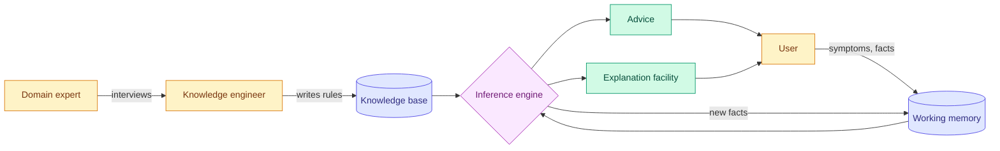

# Symbolic AI, Expert Systems and Rule-Based Systems

**Level:** 🟢 Beginner &nbsp;|&nbsp; **Effort:** Short module &nbsp;|&nbsp; **Module:** [04 AI Foundations](README.md)

---

## 🎯 Learning Objectives

By the end of this topic you will be able to:

- Explain symbolic AI: intelligence as manipulating explicit symbols with explicit rules
- Build a small expert system with a knowledge base and an inference engine
- Trace **forward chaining** (from facts to conclusions) and **backward chaining** (from a goal to evidence)
- Name the problems that ended the expert-system boom — brittleness and the knowledge acquisition bottleneck
- Identify where rule-based systems are still the right engineering choice today

## 📚 Prerequisites

- [Topic 2: AI, ML, Deep Learning and Generative AI](02-ai-ml-deep-learning-and-generative-ai.md)
- The code uses sets and dataclasses from [01 Python Foundations](../01-python-foundations/README.md).
  Standard library only — nothing to install.

---

## 🍰 1. The simple version

**Symbolic AI tries to make a machine intelligent by writing down what an expert knows, as rules,
and letting the machine apply them.**

"If the patient has a fever *and* a stiff neck, *then* suspect meningitis." Write enough of those,
add a program that chains them together, and you have an **expert system** — software that gives
advice in a narrow field the way a specialist would.

From the 1950s to the late 1980s, this was the mainstream of AI research. It produced real,
commercially successful systems. It also hit limits so hard that they helped cause an AI winter —
see [Topic 6](06-turing-test-history-and-ai-winters.md).

## 🏠 2. Real-life analogy

> An expert system is a very thorough **troubleshooting flowchart** in an appliance manual —
> "Is the power light on? No → Is it plugged in? Yes → Replace the fuse."
>
> Now imagine a flowchart that can be entered at any box, run backwards from "replace the fuse" to ask
> which questions would confirm it, and explain every step it took.

**Where the analogy breaks down:** a flowchart is fixed. An inference engine combines rules
dynamically, so conclusions nobody drew as a single path can still emerge from rules that were
written separately. That flexibility is its strength — and makes conflicts between rules hard to spot.

---

## ⚙️ 3. How an expert system is built



| Component | What it holds or does |
| --- | --- |
| **Knowledge base** | Rules of the form IF conditions THEN conclusion — the expertise |
| **Working memory** | The facts known about *this* case, growing as rules fire |
| **Inference engine** | Decides which rules apply and in what order; domain-independent |
| **Explanation facility** | Answers "why did you conclude that?" by replaying the chain of rules |
| **Knowledge engineer** | The person who turns an expert's judgement into rules — the bottleneck |

**The key design idea is separating knowledge from reasoning.** The same inference engine can run a
medical knowledge base or a computer-repair one. That separation is why expert-system "shells" were
sold as products.

### Two ways to reason

- **Forward chaining** is **data-driven**: start with the facts, fire every rule whose conditions are
  satisfied, add the conclusions, repeat until nothing new appears. Good for monitoring and
  configuration — "given everything we know, what follows?"
- **Backward chaining** is **goal-driven**: start with a hypothesis, find rules that would conclude it,
  and try to prove their conditions, recursively. Good for diagnosis — "is it *this* fault?" — because
  it only asks about facts relevant to the hypothesis.

---

## 💻 4. Code example — a working expert system in 70 lines

A computer-repair knowledge base with five rules, both inference strategies, and an explanation trace.
**Teaching example:** production rule engines add conflict resolution, certainty handling and
efficient matching algorithms such as Rete.

```python
"""A tiny expert system: forward chaining, backward chaining, and an explanation trace."""

from dataclasses import dataclass


@dataclass(frozen=True)
class Rule:
    name: str
    conditions: frozenset[str]
    conclusion: str


RULES = [
    Rule("R1", frozenset({"no_power_light"}), "no_power"),
    Rule("R2", frozenset({"no_power", "plugged_in"}), "faulty_power_supply"),
    Rule("R3", frozenset({"power_light", "beeps_three_times"}), "memory_fault"),
    Rule("R4", frozenset({"faulty_power_supply"}), "action_replace_power_supply"),
    Rule("R5", frozenset({"memory_fault"}), "action_reseat_memory"),
]


def forward_chain(facts: set[str]) -> tuple[set[str], list[str]]:
    """Data-driven: fire every rule whose conditions hold, until nothing new appears."""
    known, trace = set(facts), []
    changed = True
    while changed:
        changed = False
        for rule in RULES:
            if rule.conditions <= known and rule.conclusion not in known:
                known.add(rule.conclusion)
                trace.append(f"{rule.name}: {sorted(rule.conditions)} -> {rule.conclusion}")
                changed = True
    return known, trace


def backward_chain(goal: str, facts: set[str], depth: int = 0) -> bool:
    """Goal-driven: to prove the goal, find a rule that concludes it and prove its conditions."""
    indent = "  " * depth
    if goal in facts:
        print(f"{indent}{goal}: given")
        return True
    for rule in RULES:
        if rule.conclusion == goal:
            print(f"{indent}{goal}: try {rule.name}")
            if all(backward_chain(c, facts, depth + 1) for c in sorted(rule.conditions)):
                return True
    print(f"{indent}{goal}: cannot prove")
    return False


symptoms = {"no_power_light", "plugged_in"}
known, trace = forward_chain(symptoms)
print("forward chaining from", sorted(symptoms))
for step in trace:
    print("  ", step)
print("recommended actions:", sorted(f for f in known if f.startswith("action_")))

print("\nbackward chaining: is it a memory fault?")
print("result:", backward_chain("action_reseat_memory", symptoms))

print("\nan unanticipated symptom:")
known, trace = forward_chain({"burning_smell"})
print("  conclusions:", sorted(known - {"burning_smell"}) or "none - no rule mentions it")
```

**Output:**
```
forward chaining from ['no_power_light', 'plugged_in']
   R1: ['no_power_light'] -> no_power
   R2: ['no_power', 'plugged_in'] -> faulty_power_supply
   R4: ['faulty_power_supply'] -> action_replace_power_supply
recommended actions: ['action_replace_power_supply']

backward chaining: is it a memory fault?
action_reseat_memory: try R5
  memory_fault: try R3
    beeps_three_times: cannot prove
  memory_fault: cannot prove
action_reseat_memory: cannot prove
result: False

an unanticipated symptom:
  conclusions: none - no rule mentions it
```

**Read the three sections as the three things symbolic AI is famous for.**

1. **Transparency.** The forward trace *is* the explanation: R1, then R2, then R4. No learned model can
   give a justification this direct. Regulators and auditors value that enormously.
2. **Focus.** Backward chaining asked only about `beeps_three_times` — the one fact that mattered to
   the hypothesis — and stopped. Notice it also stopped at the *first* missing condition of R3 without
   checking `power_light`, because `all()` short-circuits. Real diagnostic systems use this to decide
   which question to ask the user next.
3. **Brittleness.** A burning smell is the most urgent symptom a computer can have. The system says
   nothing, because nobody wrote a rule for it. **It does not know that it does not know.** Topic 3
   showed a learned model failing silently outside its training data; this is the symbolic version of
   the same problem.

---

## 📜 5. What expert systems achieved, and why the boom ended

**Real successes:**

- **MYCIN** (Stanford, 1970s) recommended antibiotics for blood infections using a few hundred rules
  with *certainty factors* — numbers expressing how strongly evidence supports a conclusion. In
  evaluations its recommendations compared well with those of infectious-disease specialists. It was
  never used routinely on patients, for reasons that were as much practical and legal as technical.
- **R1 / XCON** (Digital Equipment Corporation, from around 1980) configured computer orders, and is
  widely reported to have saved the company substantial sums annually.
- Expert systems were deployed through the 1980s in finance, manufacturing, geology and troubleshooting.

**Why the boom collapsed in the late 1980s:**

| Problem | What it means |
| --- | --- |
| **Knowledge acquisition bottleneck** | Experts cannot easily articulate what they know; much expertise is intuitive. Interviewing it into rules was slow and expensive. |
| **Brittleness** | Outside the anticipated cases, systems failed abruptly — no graceful degradation. |
| **Maintenance** | Thousands of interacting rules become hard to change without breaking something; conflicts appear silently. |
| **Common sense** | Everyday knowledge a child has ("a person cannot be in two places at once") had to be written explicitly — and there is an endless amount of it. |
| **Uncertainty** | Real evidence is partial and noisy; rules plus ad hoc certainty numbers handled it poorly. |
| **Hardware economics** | Specialised Lisp machines lost to cheaper general-purpose workstations and PCs. |

The response that eventually won was **learn the rules from data instead of interviewing them out of
people** — statistical machine learning. Probabilistic methods such as Bayesian networks also gave
uncertainty a principled footing.

---

## 🌍 6. Where rules are still the right choice

Symbolic AI did not disappear; it stopped being called AI.

| Use today | Why rules win there |
| --- | --- |
| **Business rules engines** — loan eligibility, insurance underwriting, pricing policies | Must be auditable, change on a policy date, and match written regulation exactly |
| **Clinical decision support** — drug-interaction alerts | Encodes published guidelines; every alert must be traceable to a source |
| **Tax and payroll calculation** | The rules *are* the law; learning them approximately would be wrong |
| **Configuration and compliance checks** — cloud policy, infrastructure-as-code linting | Exact, explainable pass or fail |
| **Guardrails around machine-learning models** | Hard limits a model must never cross, whatever it predicts |
| **Knowledge graphs** (see [Topic 5](05-search-planning-reasoning-and-perception.md)) | Explicit relationships that models can query rather than memorise |

**Modern systems are often hybrids:** a learned model extracts facts from messy input — a scanned
invoice, a support ticket — and rules decide what to do with those facts. Retrieval-Augmented Generation
([16 RAG](../16-rag/README.md)) is a descendant of the same idea: keep knowledge explicit and
inspectable, outside the model.

## ⚖️ 7. Trade-offs

| Choice | You gain | You lose |
| --- | --- | --- |
| Hand-written rules | Transparency, exact control, no training data, easy audit | Coverage, adaptability, graceful failure; maintenance grows with rule count |
| Learned model | Coverage of cases nobody wrote down, adapts with retraining | Direct explanations, guaranteed behaviour; needs labelled data |
| Hybrid — model extracts, rules decide | Most of both | Two systems to test, and a seam where errors hide |

---

## ⚠️ 8. Common mistakes

| Mistake | Why it happens | Fix |
| --- | --- | --- |
| Assuming rule systems are obsolete | "AI" now means ML in conversation | Use rules where exactness and audit matter |
| Adding a rule for every bug report | Each fix is locally sensible | Track rule count and conflicts; test the whole rule set on every change |
| No default for unmatched input | Authors test the cases they wrote | Always return an explicit "no rule applied — refer to a person" outcome |
| Rules that silently contradict | Written by different people at different times | Automated conflict detection; forward-chain the test suite |
| Mistaking an explanation trace for correctness | A clear chain *feels* right | The trace shows the rules were followed, not that the rules are right |

## 🔐 9. Security note

- **Rules are easy to probe.** Anyone who can submit inputs and observe decisions can map a rule set's
  thresholds and craft inputs that pass — the classic example is splitting a transaction just below a
  review limit. Combine rules with anomaly detection and rate limits.
- **Rule and knowledge bases are code.** Store them in version control, review changes, and restrict who
  can edit them; a single edited threshold can open a fraud path.
- **Never build rule engines that evaluate user-supplied expressions with `eval`.** Parse rules into a
  fixed structure — as the frozen `Rule` dataclass above does — so input can only supply data, never code.

---

## 🎤 10. Interview questions

<details>
<summary><b>Q1: What is the difference between forward and backward chaining, and when would you use each?</b></summary>

Forward chaining is data-driven: start with known facts, fire every rule whose conditions hold, add
conclusions, repeat to a fixed point. It suits monitoring, alerting and configuration, where you want
everything that follows from the current state.

Backward chaining is goal-driven: pick a hypothesis, find rules that conclude it, and recursively try to
establish their conditions. It suits diagnosis and question-asking systems, because it only explores
facts relevant to the goal and can prompt a user for the one missing fact. Prolog is the well-known
backward-chaining language; production rule engines are typically forward-chaining.
</details>

<details>
<summary><b>Q2: Why did expert systems fall out of favour, and what replaced them?</b></summary>

Mainly the knowledge acquisition bottleneck — expertise is largely tacit and expensive to turn into
rules — together with brittleness outside anticipated cases, the maintenance cost of large interacting
rule sets, poor handling of uncertainty, and the collapse of specialised hardware. Statistical machine
learning replaced them for most perception and prediction problems by estimating rules from data.

A strong answer adds that rules never went away: business rules engines, clinical alerts, tax logic and
guardrails around models are all symbolic, and hybrid systems use models to extract facts and rules to
act on them.
</details>

<details>
<summary><b>Q3 (scenario): A bank asks whether to replace its credit-eligibility rules with a machine-learning model. What do you recommend?</b></summary>

Split the decision. Hard eligibility criteria that come from regulation or written policy — age,
residency, sanctions, affordability thresholds — should stay as rules: they must be exact, auditable and
traceable to a source. A model is valuable for the judgement layer, estimating default risk from many
signals, where rules cannot capture the interactions.

Then address what the model changes: the need for explanations of adverse decisions, fairness testing
across groups, monitoring for drift, and a clear record of which component made which part of the
decision. The legal requirements depend on jurisdiction, so they need confirming with qualified
counsel rather than assumed.
</details>

---

## ✅ Key takeaways

- **Symbolic AI** represents knowledge as explicit symbols and rules, and reasons by applying them.
- An **expert system** separates the knowledge base from a domain-independent inference engine.
- **Forward chaining** goes facts → conclusions; **backward chaining** goes goal → required evidence.
- Its great strength is **transparency**: the rule trace is the explanation.
- Its great weakness is **brittleness**: a burning smell produced nothing, because no rule mentioned it.
- The **knowledge acquisition bottleneck** and maintenance costs ended the 1980s boom; learning from
  data replaced hand-written rules for most prediction tasks.
- Rules remain the right tool where exactness and audit matter — and as guardrails around models.

---

## 📚 Official References

- [Logic-Based Artificial Intelligence — Stanford Encyclopedia of Philosophy](https://plato.stanford.edu/entries/logic-ai/) — verified 2026-09-14
- [Rule-Based Expert Systems: The MYCIN Experiments of the Stanford Heuristic Programming Project — Buchanan and Shortliffe, full text hosted by the author](https://www.shortliffe.net/Buchanan-Shortliffe-1984/MYCIN%20Book.htm) — verified 2026-09-14
- [Artificial Intelligence — Stanford Encyclopedia of Philosophy](https://plato.stanford.edu/entries/artificial-intelligence/) — verified 2026-09-14
- [Python: dataclasses — Python Software Foundation](https://docs.python.org/3/library/dataclasses.html) — verified 2026-09-14
- [Artificial Intelligence: A Modern Approach, textbook site — Russell and Norvig, UC Berkeley](https://aima.cs.berkeley.edu/) — verified 2026-09-14

---

## 🔗 Navigation

[← Topic 3: Narrow AI, General AI and Superintelligence](03-narrow-general-and-superintelligence.md) &nbsp;|&nbsp;
[🏠 Module Home](README.md) &nbsp;|&nbsp;
[Topic 5: Search, Planning, Reasoning and Perception →](05-search-planning-reasoning-and-perception.md)
