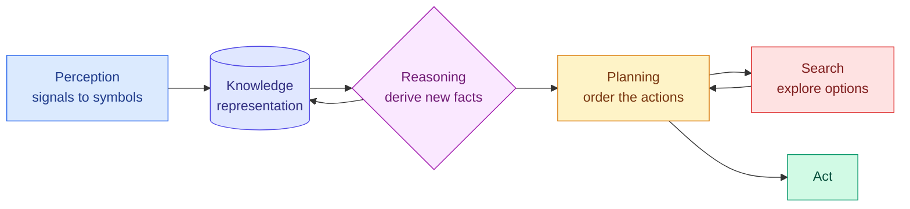

# Search, Planning, Knowledge Representation, Reasoning and Perception

**Level:** 🟡 Intermediate &nbsp;|&nbsp; **Effort:** Detailed module &nbsp;|&nbsp; **Module:** [04 AI Foundations](README.md)

---

## 🎯 Learning Objectives

By the end of this topic you will be able to:

- Formulate a problem as **search** over states, and compare breadth-first search with A* on node expansions
- Explain what a **heuristic** is and the condition that keeps A* optimal
- Build a **planner** that chains actions with preconditions and effects to reach a goal
- Represent knowledge as **triples** and answer queries by inheritance, with exceptions
- Describe **machine perception** as turning raw signals into symbols, and run a hand-made edge detector
- Recognise each of these classical capabilities inside modern AI systems

## 📚 Prerequisites

- [Topic 4: Symbolic AI and Expert Systems](04-symbolic-ai-and-expert-systems.md)
- Python collections (`deque`, `heapq`) and NumPy arrays from
  [01 Python Foundations](../01-python-foundations/README.md)

```bash
pip install -r requirements.txt      # numpy==2.1.3; everything else is the standard library
```

---

## 🍰 1. The simple version

Five abilities an intelligent agent needs, in everyday terms:

| Ability | Everyday version |
| --- | --- |
| **Search** | Trying routes through a maze until one reaches the exit |
| **Planning** | Working out the *order* of steps: find the key before trying the door |
| **Knowledge representation** | Writing facts down in a form you can look things up in |
| **Reasoning** | Working out facts nobody wrote down: a penguin is a bird, so it breathes |
| **Perception** | Turning light, sound or touch into "there is a door on my left" |

For decades each was its own research field. Modern systems still contain all five — often hidden
inside a neural network or wrapped around one.



---

## 🔎 2. Search

### 🏠 Analogy

> You have lost your keys somewhere in the house. **Breadth-first search** checks every spot one step
> from the door, then every spot two steps away, and so on — guaranteed to find the nearest place, but
> it checks the garden as eagerly as the coat hooks. **A\*** uses a hunch — "keys are usually near
> where I put my coat" — to check likely places first, while still guaranteeing it finds the nearest one
> as long as the hunch never *over*-estimates the distance.

### ⚙️ Technically

A **search problem** has a start state, a goal test, actions that move between states, and a cost per
action. A search algorithm decides which state to expand next from the **frontier** — the set of states
reached but not yet explored.

- **Breadth-first search (BFS)** expands in order of depth. It is complete, and optimal when every step
  costs the same, but ignores where the goal is.
- **A\*** (pronounced "A star", Hart, Nilsson and Raphael, 1968) expands the state with the smallest
  $f(n) = g(n) + h(n)$.

### 📐 The formula

$$
f(n) = g(n) + h(n)
$$

| Symbol | Means | Why it is there |
| --- | --- | --- |
| $g(n)$ | Cost already paid to reach state $n$ | Keeps the search honest about distance travelled |
| $h(n)$ | **Heuristic** — an estimate of the cost from $n$ to the goal | Steers expansion towards the goal |
| $f(n)$ | Estimated total cost of the best path through $n$ | The priority used to choose the next state |

**The optimality condition:** if $h$ is **admissible** — it never overestimates the true remaining cost
— A\* returns an optimal path. On a grid where you move up, down, left or right, the **Manhattan
distance** $|row - goal_{row}| + |col - goal_{col}|$ is admissible, because walls can only make the real
path longer, never shorter. With $h = 0$, A\* expands states in cost order, which on unit-cost steps
behaves like BFS.

### 💻 Code example — BFS versus A\* on the same maze

```python
"""Uninformed versus informed search on the same grid: breadth-first search and A*."""

import heapq
from collections import deque

GRID = [
    "S.........",
    ".########.",
    ".#......#.",
    ".#.####.#.",
    "...#..#...",
    "####..###.",
    ".........G",
]
Cell = tuple[int, int]


def find(symbol: str) -> Cell:
    for row, line in enumerate(GRID):
        if symbol in line:
            return row, line.index(symbol)
    raise ValueError(symbol)


def neighbours(cell: Cell) -> list[Cell]:
    row, col = cell
    steps = [(row + 1, col), (row - 1, col), (row, col + 1), (row, col - 1)]
    return [(r, c) for r, c in steps
            if 0 <= r < len(GRID) and 0 <= c < len(GRID[0]) and GRID[r][c] != "#"]


def bfs(start: Cell, goal: Cell) -> tuple[int, int]:
    """Expands outward in rings; knows nothing about where the goal is."""
    frontier, distance, expanded = deque([start]), {start: 0}, 0
    while frontier:
        cell = frontier.popleft()
        expanded += 1
        if cell == goal:
            return distance[cell], expanded
        for nxt in neighbours(cell):
            if nxt not in distance:
                distance[nxt] = distance[cell] + 1
                frontier.append(nxt)
    raise RuntimeError("no path")


def a_star(start: Cell, goal: Cell) -> tuple[int, int]:
    """Orders the frontier by cost so far plus an optimistic guess of cost remaining."""
    def manhattan(cell: Cell) -> int:
        return abs(cell[0] - goal[0]) + abs(cell[1] - goal[1])

    frontier = [(manhattan(start), 0, start)]
    best, expanded, closed = {start: 0}, 0, set()
    while frontier:
        _, cost, cell = heapq.heappop(frontier)
        if cell in closed:
            continue
        closed.add(cell)
        expanded += 1
        if cell == goal:
            return cost, expanded
        for nxt in neighbours(cell):
            if cost + 1 < best.get(nxt, float("inf")):
                best[nxt] = cost + 1
                heapq.heappush(frontier, (cost + 1 + manhattan(nxt), cost + 1, nxt))
    raise RuntimeError("no path")


start, goal = find("S"), find("G")
open_cells = sum(line.count(".") for line in GRID) + 2
print(f"grid has {open_cells} open cells")
for name, search in [("breadth-first", bfs), ("A* manhattan", a_star)]:
    length, expanded = search(start, goal)
    print(f"{name:<14} path length {length}, cells expanded {expanded}")
```

**Output:**
```
grid has 45 open cells
breadth-first  path length 15, cells expanded 32
A* manhattan   path length 15, cells expanded 22
```

**Same path length, fewer expansions.** Both find an optimal 15-step route — A\* is not allowed to trade
quality for speed when its heuristic is admissible. A\* expanded 22 cells to BFS's 32. On a 45-cell toy
maze that saving is modest; on a road network with millions of junctions, a good heuristic is the
difference between milliseconds and minutes.

**The heuristic only helps as much as it is informative.** Walls force detours the Manhattan distance
cannot see, so A\* still explored some dead ends here. Better heuristics — precomputed landmark
distances, for example — are how production route planners go further.

### Search in larger problems

- **Game playing** uses adversarial search: **minimax** assumes the opponent picks their best move, and
  **alpha–beta pruning** skips branches that cannot change the decision. IBM's Deep Blue, which beat
  world chess champion Garry Kasparov in 1997, was built on deep, heavily engineered search.
- **Monte Carlo Tree Search** samples playouts instead of exhausting the tree; combined with neural
  networks it powered DeepMind's AlphaGo ([Topic 6](06-turing-test-history-and-ai-winters.md)).
- **Beam search** keeps only the best few partial solutions at each step. Language models use it as one
  way to choose output tokens — search survives inside generative AI.

---

## 🗺️ 3. Planning

### ⚙️ Technically

**Planning** is search where states are descriptions of the world and actions have **preconditions**
and **effects**. The classic formulation is **STRIPS** (Stanford Research Institute Problem Solver,
Fikes and Nilsson, 1971), built for the Shakey robot at SRI. Each action lists:

- **Preconditions** — facts that must be true to take it
- **Add list** — facts it makes true
- **Delete list** — facts it makes false

A plan is a sequence of actions transforming the initial state into one satisfying the goal.

### 💻 Code example — a planner, and knowledge with exceptions

```python
"""Planning as search over states, and reasoning over a small knowledge graph."""

from collections import deque

# --- planning: STRIPS-style actions with preconditions, add lists and delete lists ---
ACTIONS = {
    "pick_up_key":   ({"at_door", "key_on_floor"}, {"has_key"}, {"key_on_floor"}),
    "walk_to_door":  ({"at_start"}, {"at_door"}, {"at_start"}),
    "unlock_door":   ({"at_door", "has_key"}, {"door_unlocked"}, set()),
    "open_door":     ({"at_door", "door_unlocked"}, {"door_open"}, set()),
    "walk_through":  ({"at_door", "door_open"}, {"in_room"}, {"at_door"}),
}


def plan(initial: set[str], goal: set[str]) -> list[str] | None:
    """Breadth-first search over world states; returns the shortest action sequence."""
    start = frozenset(initial)
    frontier, seen = deque([(start, [])]), {start}
    while frontier:
        state, steps = frontier.popleft()
        if goal <= state:
            return steps
        for name, (pre, add, delete) in ACTIONS.items():
            if pre <= state:
                nxt = frozenset((state - delete) | add)
                if nxt not in seen:
                    seen.add(nxt)
                    frontier.append((nxt, steps + [name]))
    return None


print("plan:", plan({"at_start", "key_on_floor"}, {"in_room"}))
print("plan without a key:", plan({"at_start"}, {"in_room"}))

# --- knowledge representation: facts as (subject, relation, object) triples ---
TRIPLES = {
    ("penguin", "is_a", "bird"), ("sparrow", "is_a", "bird"),
    ("bird", "is_a", "animal"), ("animal", "has", "metabolism"),
    ("bird", "can", "fly"), ("penguin", "cannot", "fly"),
}


def ancestors(entity: str) -> list[str]:
    found, stack = [], [entity]
    while stack:
        current = stack.pop()
        for s, r, o in sorted(TRIPLES):
            if s == current and r == "is_a" and o not in found:
                found.append(o)
                stack.append(o)
    return found


def query(entity: str, relation: str, value: str) -> str:
    """Inherit properties up the is_a chain, but let a more specific fact override."""
    for level in [entity] + ancestors(entity):
        if (level, relation, value) in TRIPLES:
            return f"yes (stated for {level})"
        if (level, "cannot", value) in TRIPLES and relation == "can":
            return f"no (exception stated for {level})"
    return "unknown"


print("\npenguin is a:", ancestors("penguin"))
for entity, relation, value in [("sparrow", "can", "fly"), ("penguin", "can", "fly"),
                                ("penguin", "has", "metabolism"), ("sparrow", "can", "swim")]:
    print(f"{entity} {relation} {value}? {query(entity, relation, value)}")
```

**Output:**
```
plan: ['walk_to_door', 'pick_up_key', 'unlock_door', 'open_door', 'walk_through']
plan without a key: None

penguin is a: ['bird', 'animal']
sparrow can fly? yes (stated for bird)
penguin can fly? no (exception stated for penguin)
penguin has metabolism? yes (stated for animal)
sparrow can swim? unknown
```

**What the planner shows.** Nobody wrote the sequence down. The planner discovered that the key must be
picked up *at the door* before unlocking, purely from preconditions. Remove the key and it correctly
reports that **no plan exists** — a guarantee a system that merely *imitates* plans cannot give.

**The catch:** this planner explores every reachable state. With $n$ independent true/false facts
there are up to $2^n$ states, so real planners depend on heuristics, just as A\* does. Planning with a
handful of facts is easy; planning a warehouse with thousands is a research field.

---

## 🧠 4. Knowledge representation and reasoning

### ⚙️ Technically

**Knowledge representation** chooses a formal structure for facts so a program can reason with them.
Common forms:

| Form | Looks like | Used in |
| --- | --- | --- |
| **Logic** | `∀x Bird(x) → Animal(x)` | Theorem provers, formal verification |
| **Rules** | IF conditions THEN conclusion | Expert systems ([Topic 4](04-symbolic-ai-and-expert-systems.md)) |
| **Semantic networks and triples** | `(penguin, is_a, bird)` | Knowledge graphs, the web's linked data |
| **Frames** | An object with slots and default values | Early object-oriented knowledge bases |
| **Ontologies** | Classes, properties and constraints for a whole domain | Medical terminologies, enterprise data catalogues |

**Reasoning** derives facts that were not stated:

- **Deduction** — guaranteed conclusions from premises: every bird is an animal, a penguin is a bird,
  so a penguin is an animal.
- **Default reasoning** — plausible conclusions that can be withdrawn: birds fly *unless* told otherwise.
  The example above handled this by checking the most specific level first, which is why the penguin
  exception wins over the bird rule.
- **Induction** — generalising from examples. This is what machine learning does.
- **Abduction** — inferring the best explanation: the grass is wet, so it probably rained. Diagnosis
  is abductive.

**Look at the last query.** "Sparrow can swim?" returns `unknown`, not `no`. Symbolic systems must choose
between the **closed-world assumption** — anything not stated is false, as a database assumes — and the
**open-world assumption** — anything not stated is unknown, as knowledge graphs usually assume. The
choice changes answers, and mixing them up is a real source of bugs.

---

## 👁️ 5. Machine perception

### ⚙️ Technically

**Perception** converts raw sensor signals — pixels, audio samples, lidar points — into symbols a
reasoning system can use, such as "edge", "face", "the word *stop*". Classical computer vision built this
from hand-designed filters. A **convolution** slides a small grid of weights, the **kernel**, across an
image and sums the weighted pixels at each position; a kernel with negatives on the left and positives
on the right responds strongly where brightness increases from left to right — a vertical edge.

### 💻 Code example — a hand-made edge detector

```python
"""Machine perception at its smallest: finding an edge in an image with a hand-made filter."""

import numpy as np

image = np.array([
    [10, 10, 10, 200, 200, 200],
    [10, 10, 10, 200, 200, 200],
    [10, 10, 10, 200, 200, 200],
    [10, 10, 10, 200, 200, 200],
])                                              # dark on the left, bright on the right

vertical_edge = np.array([[-1, 0, 1],
                          [-1, 0, 1],
                          [-1, 0, 1]])          # responds where brightness changes left to right


def convolve(img: np.ndarray, kernel: np.ndarray) -> np.ndarray:
    k = kernel.shape[0]
    rows, cols = img.shape[0] - k + 1, img.shape[1] - k + 1
    out = np.zeros((rows, cols), dtype=int)
    for r in range(rows):
        for c in range(cols):
            out[r, c] = int((img[r:r + k, c:c + k] * kernel).sum())
    return out


response = convolve(image, vertical_edge)
print("filter response:\n", response)
print("edge found between columns:", sorted({int(c) + 1 for c in np.argwhere(response > 0)[:, 1]}))

noisy = image + np.random.default_rng(0).integers(-60, 61, size=image.shape)
print("\nsame filter on a noisy image:\n", convolve(noisy, vertical_edge))
```

**Output:**
```
filter response:
 [[  0 570 570   0]
 [  0 570 570   0]]
edge found between columns: [2, 3]

same filter on a noisy image:
 [[  28  637  562  -39]
 [  35  667  634 -109]]
```

**Reading it.** Each output value is centred on one image column, which is why the script adds 1 to the
output position. The strong responses sit on image columns 2 and 3 — exactly the boundary between the
dark and bright halves. Flat regions give 0. On the noisy image the edge still stands out clearly, but
the flat regions are no longer zero — **every perception system must decide what counts as a real
signal**, which is a threshold choice with false positives and false negatives on either side.

**Why this matters for modern AI:** a Convolutional Neural Network (CNN) uses exactly this operation —
but **learns the kernel values from data** instead of having a person write `[-1, 0, 1]`. Its first
layers end up learning edge detectors much like this one, on their own.
[09 Computer Vision](../09-computer-vision/README.md) builds that.

---

## 🌍 6. Where these live in real systems today

| Classical capability | Modern real-world use |
| --- | --- |
| **A\* and graph search** | Route planning in maps and logistics, pathfinding for game characters and warehouse robots |
| **Adversarial and tree search** | Game engines; Monte Carlo Tree Search combined with neural networks in AlphaGo-style systems |
| **Beam search** | Choosing output sequences in translation and speech recognition |
| **Classical planning** | Robotics task planning, spacecraft operations scheduling, workflow automation |
| **Knowledge graphs** | Search-engine fact panels, product catalogues, drug-discovery relationship databases |
| **Logic and constraint solving** | Chip and software verification, timetabling, configuration |
| **Perception** | Every camera, microphone and lidar-driven system — now almost entirely learned |

**A current pattern worth recognising:** AI agents built on large language models
([18 AI Agents](../18-ai-agents/README.md)) are asked to *plan* multi-step tasks. Unlike the STRIPS
planner above, they have no guarantee that a plan is valid or that "no plan exists" is reported
correctly. Production agent designs often reintroduce classical ideas — explicit preconditions, state
validation, and search over candidate plans — to recover some of those guarantees.

## ⚡ 7. Performance note

| Technique | What blows up | Mitigation |
| --- | --- | --- |
| BFS | Memory — it stores the whole frontier | Iterative deepening; A\* with a good heuristic |
| A\* | Memory on huge graphs; weak heuristics degrade towards BFS | Better heuristics, landmark precomputation, bounded-memory variants |
| State-space planning | $2^n$ states for $n$ facts | Heuristic planners, hierarchical decomposition |
| Reasoning over large knowledge bases | Inference chains multiply | Restrict the logic's expressiveness; index; cache derived facts |
| The pure-Python convolution above | Four nested loops | Vectorised libraries; hardware acceleration in deep-learning frameworks |

---

## ⚠️ 8. Common mistakes

| Mistake | Why it happens | Fix |
| --- | --- | --- |
| A heuristic that overestimates | "Faster" seemed better | Keep it admissible, or accept and document non-optimal paths |
| Forgetting a delete list in planning | Effects that remove facts are easy to miss | Test that impossible goals return no plan |
| Treating missing facts as false | Databases work that way | Decide closed-world versus open-world explicitly |
| Default rules without specificity ordering | Rules written flat | Check the most specific fact first, as the penguin query does |
| A fixed threshold on noisy sensor output | Worked on clean test data | Measure false positives and negatives on realistic noise |

## 🔐 9. Security note

- **Knowledge graphs and rule bases are trusted inputs to reasoning.** A single injected triple —
  `(attacker_account, is_a, trusted_vendor)` — propagates to every conclusion that inherits from it.
  Control write access and record provenance for every fact.
- **Search and planning can be driven into worst-case cost.** Inputs crafted to maximise the frontier
  — huge mazes, unsolvable goals — are a resource-exhaustion risk for any public-facing solver. Enforce
  limits on expansions, time and memory, and fail closed.
- **Perception systems can be fooled by crafted inputs** that humans do not notice. This is covered
  defensively in [28 AI Security](../28-ai-security/README.md).

---

## 🎤 10. Interview questions

<details>
<summary><b>Q1: What makes a heuristic admissible, and why does it matter for A*?</b></summary>

A heuristic is admissible if it never overestimates the true cost from a state to the goal. With an
admissible heuristic, A\* is guaranteed to return an optimal path, because any state that could lead to a
cheaper path always has a lower priority than a completed worse path. Manhattan distance on a
four-directional grid is admissible since obstacles only lengthen routes.

The trade-off: a more informative admissible heuristic expands fewer states; an inadmissible one can be
faster but loses the optimality guarantee. Weighted A\*, which inflates the heuristic deliberately, is a
common engineering compromise with a bounded sub-optimality.
</details>

<details>
<summary><b>Q2: How does classical planning differ from asking a language model to produce a plan?</b></summary>

A classical planner searches over an explicit model of actions with preconditions and effects, so every
plan it returns is valid under that model, and it can prove when no plan exists. Its weakness is that
someone must write the model, and it scales poorly without heuristics.

A language model produces plausible plans from learned patterns and needs no hand-written model, but
offers no validity guarantee — a step may have unmet preconditions, and it will not reliably say "this
is impossible". Robust agent systems combine them: let the model propose, then validate steps against
explicit preconditions or tool results before executing.
</details>

<details>
<summary><b>Q3 (scenario): A delivery company's route planner is too slow at peak times. Where do you look?</b></summary>

First measure whether the cost is in search or elsewhere — map loading, traffic data retrieval. If it is
search: check the heuristic's quality (straight-line distance is admissible but weak on road networks),
consider landmark-based or precomputed hierarchical heuristics, cache routes between common hubs, and
bound the search with a time budget returning the best path found. If it is combinatorial — assigning
many deliveries to many vans — that is a vehicle-routing optimisation problem, where heuristic and
metaheuristic solvers trade optimality for speed. State the trade-off explicitly: a guaranteed optimal
route late, or a near-optimal route on time.
</details>

<details>
<summary><b>Q4: What is the closed-world assumption, and when does it cause bugs?</b></summary>

It treats anything not recorded as false. Databases rely on it: a customer absent from the "overdue"
table is not overdue. Knowledge graphs usually adopt the open-world assumption instead — absence means
unknown. Bugs arise when data built under one assumption is queried under the other: an incomplete
allergy list read closed-world becomes "no allergies", which is dangerous. The fix is to represent
"known false" explicitly and make the assumption part of the data contract.
</details>

---

## ✅ Key takeaways

- **Search** explores states; **A\*** uses $f = g + h$ and stays optimal with an **admissible** heuristic.
- On the toy maze, A\* found the same 15-step path expanding **22 cells instead of 32**.
- **Planning** is search over world states with preconditions and effects — and can prove no plan exists.
- **Knowledge representation** picks a structure; **reasoning** derives unstated facts, with defaults and
  exceptions needing a specificity order.
- **Closed-world versus open-world** changes answers — decide it explicitly.
- **Perception** turns signals into symbols; a CNN learns the kernels a person once wrote by hand.
- These ideas are alive inside route planners, game engines, knowledge graphs and agent frameworks.

---

## 📚 Official References

- [A Formal Basis for the Heuristic Determination of Minimum Cost Paths — Hart, Nilsson and Raphael, IEEE (DOI)](https://doi.org/10.1109/TSSC.1968.300136) — verified 2026-09-14
- [STRIPS: A New Approach to the Application of Theorem Proving to Problem Solving — Fikes and Nilsson, hosted by Stanford AI Lab](https://ai.stanford.edu/~nilsson/OnlinePubs-Nils/PublishedPapers/strips.pdf) — verified 2026-09-14
- [Logic-Based Artificial Intelligence — Stanford Encyclopedia of Philosophy](https://plato.stanford.edu/entries/logic-ai/) — verified 2026-09-14
- [Python: heapq — heap queue algorithm — Python Software Foundation](https://docs.python.org/3/library/heapq.html) — verified 2026-09-14
- [NumPy: numpy.convolve — NumPy Developers](https://numpy.org/doc/stable/reference/generated/numpy.convolve.html) — verified 2026-09-14
- [Mastering the game of Go with deep neural networks and tree search — Silver et al., Nature](https://www.nature.com/articles/nature16961) — verified 2026-09-14

---

## 🔗 Navigation

[← Topic 4: Symbolic AI and Expert Systems](04-symbolic-ai-and-expert-systems.md) &nbsp;|&nbsp;
[🏠 Module Home](README.md) &nbsp;|&nbsp;
[Topic 6: The Turing Test, History and AI Winters →](06-turing-test-history-and-ai-winters.md)
