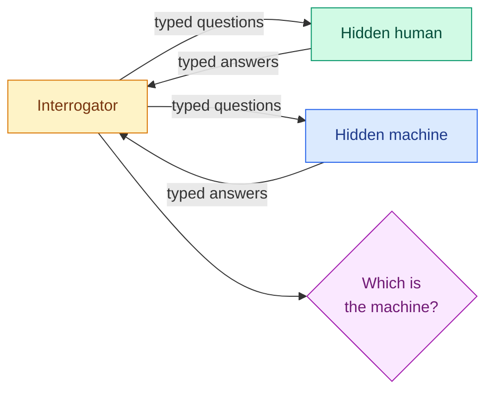

# The Turing Test, the History of AI and the AI Winters

**Level:** 🟢 Beginner &nbsp;|&nbsp; **Effort:** Short module &nbsp;|&nbsp; **Module:** [04 AI Foundations](README.md)

---

## 🎯 Learning Objectives

By the end of this topic you will be able to:

- Describe the Turing Test, what it was designed to replace, and its main criticisms
- Explain the **ELIZA effect** by running a pattern-matching chatbot and seeing where it breaks
- Reproduce the perceptron's XOR limitation that fed into the first AI winter
- Summarise the history of Artificial Intelligence (AI) from the 1950s to today on a timeline
- Explain **both AI winters** — causes, not just dates — and the pattern they share
- Use that pattern to evaluate present-day claims about AI with appropriate scepticism

## 📚 Prerequisites

- [Topic 2: AI, ML, Deep Learning and Generative AI](02-ai-ml-deep-learning-and-generative-ai.md) —
  especially the XOR example
- [Topic 4: Symbolic AI and Expert Systems](04-symbolic-ai-and-expert-systems.md)

```bash
pip install -r requirements.txt      # numpy==2.1.3
```

---

## 🍰 1. The simple version

AI's history is a cycle that has repeated twice, and it is worth recognising:

1. **A genuine breakthrough** — a program proves theorems, a machine learns to recognise shapes, an
   expert system saves a company money.
2. **Extrapolation** — "at this rate, machines will do everything within a generation."
3. **Money and hype** pour in on the strength of the extrapolation.
4. **The hard parts turn out to be hard** — common sense, scale, messy real-world data.
5. **Disappointment and funding cuts** — an **AI winter**.
6. Meanwhile, quieter work continues, and eventually produces the next breakthrough.

The field today is in the most successful period it has ever had. Knowing the cycle does not tell you
whether another winter is coming. It does help you tell a real result from an extrapolation.

## 🏠 2. Real-life analogy

> Think of the history of flight. Early pioneers built wings that flapped like birds' — the obvious
> approach — and failed. Progress came from understanding lift, not from copying feathers. Each time
> someone announced that everyday personal flying machines were just around the corner, they were wrong
> about the timeline, while the underlying engineering kept quietly improving.

**Where the analogy breaks down:** flight had one clear goal — stay in the air. AI's goal,
"intelligence", is itself contested (see [Topic 1](01-what-intelligence-and-ai-mean.md)), so it has
never been obvious when the problem is solved.

---

## 🧪 3. The Turing Test

### ⚙️ What Turing proposed

In his 1950 paper *Computing Machinery and Intelligence*, Alan Turing set aside the question "can
machines think?" as too vague to answer, and replaced it with a game he called the **imitation game**.
A human interrogator exchanges typed messages with two hidden parties — one a person, one a machine —
and tries to tell which is which. If the interrogator cannot reliably do better than chance, the
machine has, in that sense, succeeded.



**The move that made it influential** was replacing an unanswerable philosophical question with a
behavioural test. It is the "acting humanly" cell from [Topic 1](01-what-intelligence-and-ai-mean.md).

### Main criticisms

| Criticism | The point |
| --- | --- |
| **It tests deception, not intelligence** | A system can pass by imitating human errors and evasions, and fail by being too accurate |
| **The Chinese Room** (John Searle, 1980) | Following rules to produce the right symbols need not involve understanding them |
| **It depends on the judge** | Short conversations with unprepared judges are easy to fool; experts probing specific weaknesses are not |
| **It is anthropocentric** | Intelligence unlike ours would fail; a calculator is not less capable for refusing to make arithmetic mistakes |
| **It measures one moment** | Passing a conversation says nothing about reliability, reasoning or safety across a deployment |

Modern language models can hold conversations that many people cannot distinguish from a human's in
short exchanges. That has mostly shown that **the test measures conversational plausibility**, which is
not the same as the properties engineers need — correctness, calibration, robustness. Evaluation today
uses task-specific measurements instead ([36 AI Evaluation](../36-ai-evaluation/README.md)).

### 💻 Code example — the ELIZA effect, and the perceptron that could not learn XOR

Two turning points re-run in a few lines.

**ELIZA** (Joseph Weizenbaum, MIT, 1966) imitated a psychotherapist using keyword patterns and pronoun
swapping. It had no model of meaning at all, yet some users confided in it. Weizenbaum was disturbed by
this, and the tendency to attribute understanding to fluent text is now called the **ELIZA effect**.

**The perceptron** (Frank Rosenblatt, 1958) was one of the first machines that learned from examples,
and it generated enormous excitement. It is a single layer: it can only separate classes with a straight
line.

```python
"""Two historical turning points, re-run: a perceptron on AND and XOR, and an ELIZA-style chatbot."""

import re

import numpy as np


def train_perceptron(X: np.ndarray, y: np.ndarray, epochs: int = 25) -> tuple[np.ndarray, float, list[int]]:
    """Rosenblatt's learning rule: nudge weights towards every misclassified example."""
    weights, bias, errors_per_epoch = np.zeros(X.shape[1]), 0.0, []
    for _ in range(epochs):
        errors = 0
        for inputs, target in zip(X, y):
            predicted = int(inputs @ weights + bias > 0)
            update = target - predicted
            weights += update * inputs
            bias += update
            errors += int(update != 0)
        errors_per_epoch.append(errors)
    return weights, bias, errors_per_epoch


X = np.array([[0, 0], [0, 1], [1, 0], [1, 1]])
for name, y in [("AND", np.array([0, 0, 0, 1])), ("XOR", np.array([0, 1, 1, 0]))]:
    weights, bias, errors = train_perceptron(X, y)
    predictions = (X @ weights + bias > 0).astype(int)
    print(f"{name}: errors per epoch {errors[:8]}... final {errors[-1]}, "
          f"learned {predictions.tolist()} vs target {y.tolist()}")

# ELIZA (1966) had no model of meaning: keyword patterns and pronoun reflection.
REFLECT = {"i": "you", "my": "your", "am": "are", "me": "you", "you": "I", "your": "my"}
PATTERNS = [
    (r"i need (.*)", "Why do you need {0}?"),
    (r"i am (.*)", "How long have you been {0}?"),
    (r".*\bmother\b.*", "Tell me more about your family."),
    (r"(.*)", "Please, go on."),
]


def reflect(fragment: str) -> str:
    return " ".join(REFLECT.get(word, word) for word in fragment.lower().split())


def eliza(message: str) -> str:
    cleaned = message.lower().strip(".!?")
    for pattern, template in PATTERNS:
        match = re.fullmatch(pattern, cleaned)
        if match:
            return template.format(*(reflect(g) for g in match.groups()))
    return "Please, go on."


print()
for message in ["I need a holiday", "I am worried about my exams", "My mother calls daily",
                "What is 17 times 23?", "I am not a mother"]:
    print(f"> {message}\n  {eliza(message)}")
```

**Output:**
```
AND: errors per epoch [1, 3, 3, 2, 1, 0, 0, 0]... final 0, learned [0, 0, 0, 1] vs target [0, 0, 0, 1]
XOR: errors per epoch [2, 3, 4, 4, 4, 4, 4, 4]... final 4, learned [1, 1, 0, 0] vs target [0, 1, 1, 0]

> I need a holiday
  Why do you need a holiday?
> I am worried about my exams
  How long have you been worried about your exams?
> My mother calls daily
  Tell me more about your family.
> What is 17 times 23?
  Please, go on.
> I am not a mother
  How long have you been not a mother?
```

**The perceptron.** On AND, errors fall to zero by the sixth epoch and stay there — the perceptron
convergence theorem guarantees this for any problem a straight line can separate. On XOR, errors never
settle: after 25 epochs it still gets **all four cases wrong**. No amount of training fixes it, because
no line exists. [Topic 2](02-ai-ml-deep-learning-and-generative-ai.md) showed that one hidden layer
solves it — but in 1969 there was no widely known, practical way to train hidden layers.

**ELIZA.** The first three replies feel attentive. Then it cannot do arithmetic, and "I am not a mother"
matches the `i am` pattern before the `mother` pattern, producing nonsense. **Fluency on the expected
inputs; collapse one step outside** — the same lesson as the narrow classifier in
[Topic 3](03-narrow-general-and-superintelligence.md), sixty years earlier. Modern chatbots are
enormously more capable, but the ELIZA effect — trusting fluency as understanding — applies to them in
full.

---

## 📜 4. A timeline of AI

```mermaid
flowchart TD
    subgraph BIRTH["Foundations, 1950s"]
        A1["1950 Turing proposes<br/>the imitation game"]:::birth
        A2["1956 Dartmouth workshop<br/>names the field"]:::birth
        A3["1958 Rosenblatt's<br/>perceptron"]:::birth
    end
    subgraph OPT["Early optimism, 1960s"]
        B1["1966 ELIZA"]:::opt
        B2["1966 to 1972<br/>Shakey robot at SRI"]:::opt
        B3["1969 Minsky and Papert<br/>publish Perceptrons"]:::opt
    end
    subgraph W1["First AI winter, mid 1970s"]
        C1["1973 Lighthill report<br/>in the UK"]:::winter
        C2["Funding cuts in the<br/>UK and US"]:::winter
    end
    subgraph BOOM["Expert system boom, 1980s"]
        D1["R1 XCON saves DEC money<br/>MYCIN in research"]:::boom
        D2["1982 Japan Fifth<br/>Generation project"]:::boom
        D3["1986 backpropagation<br/>popularised"]:::boom
    end
    subgraph W2["Second AI winter, late 1980s to 1990s"]
        E1["1987 Lisp machine<br/>market collapses"]:::winter
        E2["Expert systems prove<br/>costly to maintain"]:::winter
    end
    subgraph STAT["Statistical learning, 1990s to 2000s"]
        F1["1997 Deep Blue<br/>beats Kasparov"]:::stat
        F2["Support vector machines<br/>and ensembles in practice"]:::stat
    end
    subgraph DEEP["Deep learning, 2010s"]
        G1["2012 AlexNet wins<br/>ImageNet by a wide margin"]:::deep
        G2["2016 AlphaGo<br/>beats Lee Sedol"]:::deep
        G3["2017 Transformer<br/>architecture"]:::deep
    end
    subgraph GEN["Generative AI, 2020s"]
        H1["Large language models<br/>at scale"]:::gen
        H2["2022 ChatGPT brings<br/>chat assistants to the public"]:::gen
    end

    BIRTH --> OPT --> W1 --> BOOM --> W2 --> STAT --> DEEP --> GEN

    classDef birth fill:#dbeafe,stroke:#2563eb,color:#1e3a8a
    classDef opt fill:#d1fae5,stroke:#059669,color:#064e3b
    classDef winter fill:#e5e7eb,stroke:#374151,color:#111827
    classDef boom fill:#fef3c7,stroke:#d97706,color:#78350f
    classDef stat fill:#e0e7ff,stroke:#4f46e5,color:#312e81
    classDef deep fill:#fae8ff,stroke:#a21caf,color:#701a75
    classDef gen fill:#fee2e2,stroke:#dc2626,color:#7f1d1d
```



**Winter dates are approximate and disputed.** Historians draw the boundaries differently, and
research never stopped entirely during either one — funding, public attention and commercial interest
collapsed, not the work.

### The founding moment

The **Dartmouth Summer Research Project on Artificial Intelligence** (1956) was proposed in 1955 by John
McCarthy, Marvin Minsky, Nathaniel Rochester and Claude Shannon. The proposal coined the term
"artificial intelligence", and rested on the conjecture that every aspect of learning or intelligence
could in principle be described precisely enough for a machine to simulate it. It also proposed that a
carefully selected group could make significant progress **in a single summer** — the first, and
most-quoted, underestimate in the field's history.

---

## ❄️ 5. The two AI winters

### The first AI winter — roughly the mid-1970s

| Cause | What happened |
| --- | --- |
| **Overpromising** | Early researchers predicted machine translation, general problem-solving and human-level AI within decades or less |
| **Combinatorial explosion** | Methods that worked on toy problems failed on real ones, because the number of possibilities grows exponentially — the planning catch from [Topic 5](05-search-planning-reasoning-and-perception.md) |
| **Limits of perceptrons** | Minsky and Papert's 1969 book proved what single-layer perceptrons cannot compute, including XOR. It contributed to a sharp decline in neural-network research, though historians debate how much of the decline it caused on its own |
| **Machine translation disappointment** | A 1966 US government-commissioned report (ALPAC) concluded machine translation had not delivered, and funding was reduced |
| **The Lighthill report** (1973) | Commissioned by the UK Science Research Council, it judged that AI had failed to achieve its grand objectives, and UK funding was cut sharply |
| **Defence funding shifts** | US defence research funding moved towards mission-oriented projects with nearer-term results |

### The second AI winter — roughly the late 1980s to the mid-1990s

| Cause | What happened |
| --- | --- |
| **Expert-system limits** | The knowledge acquisition bottleneck, brittleness and maintenance cost from [Topic 4](04-symbolic-ai-and-expert-systems.md) |
| **Hardware collapse** | The market for specialised Lisp machines collapsed around 1987, as cheaper general-purpose workstations and PCs caught up |
| **Unmet national programmes** | Japan's Fifth Generation Computer Systems project and comparable initiatives elsewhere did not meet their ambitious goals |
| **Reputation** | "AI" became a term researchers avoided in grant proposals, preferring labels like "machine learning", "informatics" or "knowledge-based systems" |

### What ended them

Not a single breakthrough — **three things accumulating**:

1. **Better methods** — backpropagation for multi-layer networks (popularised in 1986 by Rumelhart,
   Hinton and Williams), probabilistic reasoning, and statistical learning theory.
2. **Data** — the internet and digitisation produced labelled datasets at a scale unimaginable earlier.
   ImageNet was the emblem.
3. **Compute** — Graphics Processing Units (GPUs), designed for games, turned out to accelerate neural
   network training dramatically. AlexNet in 2012 was trained on GPUs.

**Most ideas behind modern deep learning are decades old.** What changed was that data and compute
finally made them work at a scale where they beat alternatives.

---

## 🚀 6. The modern evolution

| Period | Shift | What it enabled |
| --- | --- | --- |
| 1990s–2000s | **From rules to statistics** — learning from data becomes the default | Spam filtering, recommendation, search ranking, fraud detection |
| 2012 onward | **Deep learning** — learned representations beat hand-engineered features | Image recognition, speech recognition, machine translation |
| 2016 | **Deep learning plus search** — AlphaGo combines neural networks with Monte Carlo Tree Search | Superhuman play in Go, long considered far off |
| 2017 onward | **Transformers** — attention-based architectures train efficiently on huge text corpora | Pretrained language models such as BERT and GPT |
| 2020s | **Scale and generality** — very large models, instruction tuning and learning from human feedback | General-purpose assistants, code generation, multimodal models |
| Now | **Systems around models** — retrieval, tools, agents, evaluation and governance | Reliable products built from unreliable components |

The last row is where most engineering effort now goes, and where this repository spends most of its
later modules: [16 RAG](../16-rag/README.md), [18 AI Agents](../18-ai-agents/README.md),
[30 LLMOps](../30-llmops/README.md), [36 AI Evaluation](../36-ai-evaluation/README.md).

---

## 🌍 7. Using history as an engineer

The winters were not caused by bad science. They were caused by **claims running ahead of evidence**,
and budgets following the claims. That is directly useful in a job:

| Historical pattern | The modern question to ask |
| --- | --- |
| Toy problems extrapolated to real ones | Was this demo run on our data, at our scale, with our edge cases? |
| Combinatorial explosion hidden by small examples | How does cost grow with input size, users and data volume? |
| ELIZA effect — fluency mistaken for understanding | How was correctness measured, not how convincing it sounded? |
| Expert systems costly to maintain | Who maintains this after launch — prompts, rules, data pipelines, evaluations? |
| National programmes promising timelines | Is this a result, or a forecast? |

## ⚠️ 8. Common mistakes

| Mistake | Why it happens | Fix |
| --- | --- | --- |
| "Passing the Turing Test means it understands" | The test is famous | It measures conversational plausibility; evaluate the properties you need |
| "Minsky and Papert single-handedly caused the first winter" | Simple stories spread | It was one factor among overpromising, reports and funding shifts |
| "Deep learning is a new idea" | The breakthroughs were recent | Most ideas are decades old; data and compute made them practical |
| "Winters mean nothing happened" | Funding narratives | Research continued; attention and money collapsed |
| Predicting the next winter, or ruling one out | Pattern-matching on history | History teaches questions to ask, not dates |

## 🔐 9. Security and safety note

**The ELIZA effect is a social-engineering vector.** People disclose more to systems that seem to
understand and care. For any conversational product:

- Tell users clearly that they are talking to an automated system.
- Minimise and protect what the conversation collects; assume people will overshare.
- Never let perceived rapport substitute for authentication or authorisation.
- Watch for impersonation — a convincing bot pretending to be a bank's support agent is a fraud tool.

Privacy and disclosure obligations vary by jurisdiction; see [26 Responsible AI](../26-responsible-ai/README.md)
and confirm specifics with qualified counsel.

---

## 🎤 10. Interview questions

<details>
<summary><b>Q1: What is the Turing Test, and is it still a useful measure?</b></summary>

Turing's 1950 imitation game: a judge exchanges text with a hidden human and a hidden machine and tries
to identify the machine. It replaced the vague question "can machines think?" with a behavioural test.

As an engineering measure it is weak. It rewards deception and human-like errors, depends heavily on
the judge and duration, and says nothing about correctness, calibration, robustness or safety. Modern
language models can be conversationally convincing while still making confident errors, which shows the
gap. Useful evaluation instead measures specific capabilities on representative, held-out tasks with
defined metrics. The test remains valuable historically and philosophically — it reframed the question.
</details>

<details>
<summary><b>Q2: What caused the AI winters?</b></summary>

The first, around the mid-1970s: overpromising, methods that did not scale beyond toy problems because
of combinatorial explosion, the demonstrated limits of single-layer perceptrons, disappointing machine
translation, and critical government reviews such as the 1973 Lighthill report, followed by funding
cuts in the UK and US.

The second, from the late 1980s: expert systems proved brittle and expensive to build and maintain, the
specialised Lisp machine market collapsed, and large national programmes missed their goals.

The shared pattern is claims running ahead of evidence, with funding following the claims. Recovery
came from better methods, much more data and much cheaper compute arriving together.
</details>

<details>
<summary><b>Q3: Why could the perceptron not learn XOR, and how was that overcome?</b></summary>

A single-layer perceptron computes a weighted sum and a threshold, so its decision boundary is a single
straight line (a hyperplane in higher dimensions). XOR's positive cases sit on opposite corners of the
square, so no line separates them; the learning rule never converges and errors persist indefinitely.

Adding a hidden layer lets the network build intermediate features in which the classes become
separable. The obstacle was training those hidden weights; backpropagation, popularised in 1986,
provided an efficient way to compute the gradients for every layer.
</details>

<details>
<summary><b>Q4 (scenario): Leadership wants to fund a large AI programme on the strength of an impressive vendor demo. How do you advise them?</b></summary>

Treat the demo as a hypothesis. Ask for a pilot on our own data, at realistic scale, including the
messy and adversarial cases, with success metrics agreed in advance. Establish a baseline — current
process or a simple model — so improvement is measured, not asserted. Estimate the ongoing costs
beyond the build: data pipelines, evaluation, monitoring, retraining, and human review. Stage the
funding against measured milestones.

Both AI winters followed the same pattern of commitments sized to extrapolations from toy results. The
remedy is cheap: measure before scaling.
</details>

---

## ✅ Key takeaways

- The **Turing Test** replaced "can machines think?" with a behavioural test; it measures conversational
  plausibility, not the properties engineers need.
- The **ELIZA effect** — trusting fluency as understanding — was visible in 1966 and applies in full today.
- A single-layer perceptron **never learns XOR**; hidden layers plus backpropagation fixed that.
- **Dartmouth, 1956**, named the field — and proposed making significant progress in one summer.
- **Two AI winters** followed the same pattern: claims ahead of evidence, then funding cuts.
- The deep-learning era came from **old ideas plus data plus compute**, not one new idea.
- History teaches the questions to ask about a demo, not the date of the next winter.

---

## 📚 Official References

- [The Turing Test — Stanford Encyclopedia of Philosophy](https://plato.stanford.edu/entries/turing-test/) — verified 2026-09-14
- [A Proposal for the Dartmouth Summer Research Project on Artificial Intelligence — McCarthy, Minsky, Rochester and Shannon, hosted by Stanford](http://jmc.stanford.edu/articles/dartmouth/dartmouth.pdf) — verified 2026-09-14
- [The Perceptron: A Probabilistic Model for Information Storage and Organization in the Brain — Rosenblatt, Psychological Review (DOI)](https://doi.org/10.1037/h0042519) — verified 2026-09-14
- [Artificial Intelligence: A General Survey (the Lighthill report) — Lighthill, hosted by the Chilton Computing archive](https://www.chilton-computing.org.uk/inf/literature/reports/lighthill_report/p001.htm) — verified 2026-09-14 (archival copy)
- [Learning representations by back-propagating errors — Rumelhart, Hinton and Williams, Nature](https://www.nature.com/articles/323533a0) — verified 2026-09-14
- [ImageNet Classification with Deep Convolutional Neural Networks — Krizhevsky, Sutskever and Hinton, NeurIPS](https://papers.nips.cc/paper/2012/hash/c399862d3b9d6b76c8436e924a68c45b-Abstract.html) — verified 2026-09-14
- [Mastering the game of Go with deep neural networks and tree search — Silver et al., Nature](https://www.nature.com/articles/nature16961) — verified 2026-09-14
- [Attention Is All You Need — Vaswani et al., arXiv](https://arxiv.org/abs/1706.03762) — verified 2026-09-14
- [Python: re — regular expression operations — Python Software Foundation](https://docs.python.org/3/library/re.html) — verified 2026-09-14

## 📖 Additional learning resources

- [AI Index Report — Stanford Institute for Human-Centered AI](https://hai.stanford.edu/ai-index) — verified 2026-09-14 (annual; tracks the modern period)
- [ImageNet — Stanford Vision Lab and Princeton University](https://www.image-net.org/) — verified 2026-09-14

---

## 🔗 Navigation

[← Topic 5: Search, Planning, Reasoning and Perception](05-search-planning-reasoning-and-perception.md) &nbsp;|&nbsp;
[🏠 Module Home](README.md) &nbsp;|&nbsp;
[Next module: 05 Machine Learning →](../05-machine-learning/README.md)
