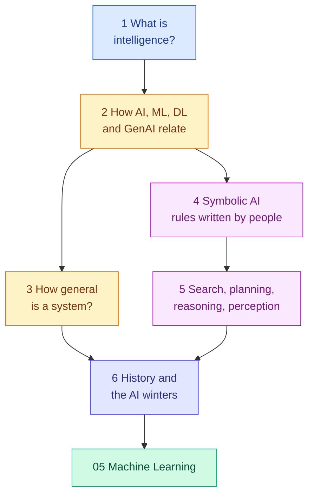

<!-- status: authored -->

# 04. Artificial Intelligence Foundations

**Level:** 🟢 Beginner → 🟡 Intermediate &nbsp;|&nbsp; **Effort:** Short module &nbsp;|&nbsp; **Status:** ✅ Complete

What "intelligence" and "Artificial Intelligence (AI)" actually mean, how AI, Machine Learning (ML),
deep learning and Generative AI relate, the symbolic methods that came first, and the history —
including both AI winters — that explains why the field looks the way it does.

> **This is the orientation module.** It has no prerequisites and can be read in parallel with
> modules 01–03. Every later module assumes you can place its topic on the map drawn here — and
> recognise when a claim about AI is a result and when it is an extrapolation.

---

## 🎯 Learning Objectives

By the end of this module you will be able to:

- Draw the containment relationship between AI, ML, deep learning and Generative AI, with symbolic AI placed correctly
- Distinguish automation from learning systems, and predictive from generative models
- Demonstrate with code why narrow systems fail silently outside their training conditions
- Describe symbolic AI and expert systems, and why they gave way to statistical learning
- Implement search, planning, knowledge representation and a perception filter in miniature
- Summarise the history of AI, including the causes of both AI winters

## 📚 Prerequisites

_None — this module can be started at any time._ The code examples use Python; if you have not
written any yet, read the outputs and explanations, which carry the lessons on their own, and return
to the code after [01 Python Foundations](../01-python-foundations/README.md).

```bash
pip install -r requirements.txt      # scikit-learn==1.5.2, numpy==2.1.3
```

---

## 📑 Topics

| # | Topic | Covers | Level |
| --- | --- | --- | --- |
| 1 | [What Intelligence and AI Mean](01-what-intelligence-and-ai-mean.md) | Four definitions of AI, the rational agent, automation versus adaptation | 🟢 |
| 2 | [AI, ML, Deep Learning and Generative AI](02-ai-ml-deep-learning-and-generative-ai.md) | Containment picture, rules versus learning, why depth solves XOR, predictive versus generative | 🟢 |
| 3 | [Narrow AI, General AI and Superintelligence](03-narrow-general-and-superintelligence.md) | Capability versus generality, a 96% classifier falling to 0%, a sober framing of AGI | 🟢 |
| 4 | [Symbolic AI and Expert Systems](04-symbolic-ai-and-expert-systems.md) | Knowledge base and inference engine, forward and backward chaining, brittleness | 🟢 |
| 5 | [Search, Planning, Reasoning and Perception](05-search-planning-reasoning-and-perception.md) | BFS versus A*, STRIPS planning, knowledge graphs with exceptions, an edge detector | 🟡 |
| 6 | [The Turing Test, History and AI Winters](06-turing-test-history-and-ai-winters.md) | The imitation game, the ELIZA effect, the perceptron and XOR, a timeline, both winters | 🟢 |

---

## 🗺️ How the pieces fit



**Topics 1–3 are the map.** **Topics 4–5 are the classical toolbox**, which still runs inside route
planners, rule engines, knowledge graphs and agent frameworks. **Topic 6 ties them together** — why
symbolic AI gave way to learning, and why claims about AI deserve evidence.

---

## 🧭 Which topics do you actually need?

| If you are | Read |
| --- | --- |
| Completely new to AI | All six, in order |
| A developer who wants the vocabulary fast | 1, 2, 3 |
| Evaluating AI vendors or proposals | 1, 3, 6 |
| About to build agents or planners | 4, 5 — then [18 AI Agents](../18-ai-agents/README.md) |
| Preparing for interviews | 2, 3, 6 — and [Interview Bank 1](../38-interview-preparation/01-ai-ml-fundamentals.md) |

---

## 🧪 Every example is verified

Each code block was executed and shows its **real** output, enforced in continuous integration:

```bash
python scripts/check_examples.py --strict 04-ai-foundations/
```

Several outputs are deliberately uncomfortable, because they are the lessons:

- A spam model's most "spam-like" word is **"your"** — a coincidence in twelve training messages.
- A digit classifier at **96%** drops to **9%** after a two-pixel shift and **0%** on inverted colours —
  with median confidence still **1.00**.
- An expert system says **nothing** about a burning smell, because no rule mentions it.
- ELIZA answers "I am not a mother" with **"How long have you been not a mother?"**

## 📝 Practice

- Quiz: [`quizzes/04-ai-foundations.md`](../quizzes/04-ai-foundations.md)
- Answers: [`quizzes/answers/04-ai-foundations.md`](../quizzes/answers/04-ai-foundations.md)
- Assignments: [`assignments/04-ai-foundations.md`](../assignments/04-ai-foundations.md)

---

## ⚠️ The five misconceptions this module exists to correct

1. **"AI means machine learning."** Symbolic AI — rules, search, planning, logic — is AI without
   learning, and still runs in production.
2. **"High accuracy means intelligence."** Accuracy is skill in one environment. Generality is a
   different axis, and narrow systems rarely know when they are outside it.
3. **"Fluent means understanding."** The ELIZA effect was visible in 1966 and applies in full to modern
   chatbots.
4. **"Learning finds the truth."** Learning finds correlations in the data it was given — including
   accidental ones.
5. **"Deep learning is a new idea."** Most of its ideas are decades old. Data and compute made them work.

---

## 📚 Official References

- [Artificial Intelligence — Stanford Encyclopedia of Philosophy](https://plato.stanford.edu/entries/artificial-intelligence/) — verified 2026-09-14
- [The Turing Test — Stanford Encyclopedia of Philosophy](https://plato.stanford.edu/entries/turing-test/) — verified 2026-09-14
- [Artificial Intelligence: A Modern Approach, textbook site — Russell and Norvig, UC Berkeley](https://aima.cs.berkeley.edu/) — verified 2026-09-14
- [A Proposal for the Dartmouth Summer Research Project on Artificial Intelligence — McCarthy, Minsky, Rochester and Shannon, hosted by Stanford](http://jmc.stanford.edu/articles/dartmouth/dartmouth.pdf) — verified 2026-09-14
- [AI Risk Management Framework — National Institute of Standards and Technology](https://www.nist.gov/itl/ai-risk-management-framework) — verified 2026-09-14

---

## 🔗 Navigation

[← 03 Data Foundations](../03-data-foundations/README.md) &nbsp;|&nbsp;
[🏠 Repository Home](../README.md) &nbsp;|&nbsp;
[Topic 1: What Intelligence and AI Mean →](01-what-intelligence-and-ai-mean.md)

**Next module:** [05 Machine Learning](../05-machine-learning/README.md)
