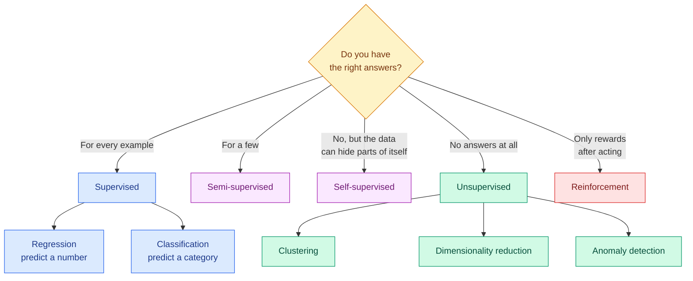

# Types of Learning

**Level:** 🟢 Beginner &nbsp;|&nbsp; **Effort:** Short module &nbsp;|&nbsp; **Module:** [05 Machine Learning](README.md)

---

## 🎯 Learning Objectives

By the end of this topic you will be able to:

- Classify a problem as supervised, unsupervised, semi-supervised, self-supervised or reinforcement learning
- Frame a business question as a learning task: what is the input, the output, and the signal?
- Run supervised and unsupervised learning on the same data and explain why their results differ
- Explain batch versus online learning, and show a batch model failing when the world drifts
- Explain the exploration–exploitation trade-off that defines reinforcement learning

## 📚 Prerequisites

- [04 AI Foundations](../04-ai-foundations/README.md), especially
  [AI, ML, Deep Learning and Generative AI](../04-ai-foundations/02-ai-ml-deep-learning-and-generative-ai.md)
- [Your First scikit-learn Model](../01-python-foundations/14-your-first-scikit-learn-model.md)

```bash
pip install -r requirements.txt      # scikit-learn==1.5.2, numpy==2.1.3
```

---

## 🍰 1. The simple version

Every kind of machine learning answers one question differently: **where does the teaching signal
come from?**

| Type | The signal | Everyday version |
| --- | --- | --- |
| **Supervised** | A correct answer for every example | Flashcards with the answer on the back |
| **Unsupervised** | No answers at all — only the data's own structure | Sorting a box of buttons into piles that look alike |
| **Semi-supervised** | A few answers, lots of unlabelled examples | A handful of flashcards, then a textbook without answers |
| **Self-supervised** | Answers manufactured from the data itself | Covering a word in a sentence and guessing it |
| **Reinforcement** | A reward that arrives after actions, often late | Learning a game by winning and losing |

And a second, independent question: **when does learning happen?**

| Mode | When the model updates |
| --- | --- |
| **Batch (offline)** | Trained once on a fixed dataset, then frozen until the next retraining |
| **Online (incremental)** | Updated continuously as each new example or mini-batch arrives |

## 🏠 2. Real-life analogy

> A new chef learns in five ways. A mentor tastes every dish and says "too salty" — **supervised**.
> They explore the pantry alone and notice spices fall into families — **unsupervised**. The mentor
> labels ten dishes and the chef generalises to a hundred more — **semi-supervised**. They practise by
> hiding one ingredient from a known recipe and working out what is missing — **self-supervised**. And
> they run a restaurant where the only feedback is whether customers come back next week —
> **reinforcement**.

**Where the analogy breaks down:** a chef combines all five without thinking about it. Most deployed
machine-learning systems use exactly one, chosen explicitly — and modern large models are notable
precisely because they chain several (self-supervised pretraining, then supervised tuning, then
reinforcement learning from human feedback).

---

## ⚙️ 3. The map



| Type | Formally | Typical algorithms | Covered in |
| --- | --- | --- | --- |
| Supervised — regression | Learn $f: X \to \mathbb{R}$ from pairs $(x_i, y_i)$ | Linear, ridge, lasso, trees, boosting | [Topic 3](03-regression.md), [5](05-decision-trees-and-random-forests.md), [6](06-boosting.md) |
| Supervised — classification | Learn $f: X \to \{1,\dots,K\}$ | Logistic regression, k-NN, SVM, trees | [Topic 4](04-classification.md) |
| Unsupervised | Find structure in $X$ with no $y$ | k-means, DBSCAN, PCA, isolation forest | [Topic 7](07-clustering.md), [8](08-dimensionality-reduction.md), [9](09-anomaly-detection-and-association-rules.md) |
| Semi- and self-supervised | Use unlabelled $X$ to improve learning from few or no labels | Pseudo-labelling, contrastive and masked prediction | [Topic 10](10-semi-and-self-supervised-learning.md) |
| Reinforcement | Learn a policy maximising cumulative reward | Bandits, Q-learning, policy gradients | [19 Reinforcement Learning](../19-reinforcement-learning/README.md) |

---

## 💻 4. Code example — the same data, with and without labels

The iris dataset: 150 flowers, four measurements each, three species. It ships with scikit-learn.
A supervised classifier is given the species; k-means clustering is not.

The second half compares **batch** and **online** learning on a stream where the underlying
relationship **reverses on day 30** — a simulated version of what happens when customer behaviour,
prices or fraud tactics change.

```python
"""Supervised versus unsupervised on the same data; batch versus online on a drifting stream."""

import numpy as np
from sklearn.cluster import KMeans
from sklearn.datasets import load_iris
from sklearn.linear_model import LogisticRegression, SGDRegressor
from sklearn.metrics import adjusted_rand_score
from sklearn.model_selection import train_test_split
from sklearn.pipeline import make_pipeline
from sklearn.preprocessing import StandardScaler

# --- 1. supervised and unsupervised see the same flowers ---
X, y = load_iris(return_X_y=True)
X_train, X_test, y_train, y_test = train_test_split(X, y, test_size=0.3, random_state=0, stratify=y)

classifier = make_pipeline(StandardScaler(), LogisticRegression()).fit(X_train, y_train)
print(f"supervised   (labels used):   test accuracy {classifier.score(X_test, y_test):.3f}")

clusters = KMeans(n_clusters=3, n_init=10, random_state=0).fit_predict(StandardScaler().fit_transform(X))
print(f"unsupervised (labels hidden): agreement with true species, adjusted Rand {adjusted_rand_score(y, clusters):.3f}")
print("cluster sizes:", np.bincount(clusters).tolist(), " true species sizes:", np.bincount(y).tolist())

# --- 2. batch versus online learning when the world drifts ---
rng = np.random.default_rng(0)
n_days, per_day = 60, 50


def day_of_data(day):
    slope = 2.0 if day < 30 else -1.0          # the relationship reverses on day 30
    x = rng.uniform(-1, 1, size=(per_day, 1))
    return x, slope * x[:, 0] + rng.normal(0, 0.1, size=per_day)


batch_model = SGDRegressor(random_state=0)
online_model = SGDRegressor(random_state=0, learning_rate="constant", eta0=0.05)
history_X, history_y = [], []
batch_errors, online_errors = [], []

for day in range(n_days):
    x, target = day_of_data(day)
    if day >= 5:                                # both start predicting once they have seen data
        batch_errors.append(np.mean((batch_model.predict(x) - target) ** 2))
        online_errors.append(np.mean((online_model.predict(x) - target) ** 2))
    online_model.partial_fit(x, target)         # online: update on every new day
    history_X.append(x)
    history_y.append(target)
    if day == 4:                                # batch: trained once on the first five days
        batch_model.fit(np.vstack(history_X), np.concatenate(history_y))

batch_errors, online_errors = np.array(batch_errors), np.array(online_errors)
print(f"\nmean squared error, days 5-29:  batch {batch_errors[:25].mean():.3f}   online {online_errors[:25].mean():.3f}")
print(f"mean squared error, days 30-59: batch {batch_errors[25:].mean():.3f}   online {online_errors[25:].mean():.3f}")
print(f"learned slope at the end:       batch {batch_model.coef_[0]:+.2f}   online {online_model.coef_[0]:+.2f}   (truth -1.00)")
```

**Output:**
```
supervised   (labels used):   test accuracy 0.978
unsupervised (labels hidden): agreement with true species, adjusted Rand 0.620
cluster sizes: [53, 50, 47]  true species sizes: [50, 50, 50]

mean squared error, days 5-29:  batch 0.013   online 0.010
mean squared error, days 30-59: batch 2.811   online 0.131
learned slope at the end:       batch +1.90   online -1.01   (truth -1.00)
```

**Supervised versus unsupervised.** With labels, 97.8% of test flowers are classified correctly. Without
labels, k-means finds three groups whose agreement with the true species is an Adjusted Rand Index (ARI)
of 0.620 — where 1.0 is perfect agreement and 0.0 is what random grouping would score. It found one
species cleanly (the cluster of exactly 50) and blurred the other two, which overlap in measurement space.

**That is not k-means failing.** Clustering was never told what "species" means. It found groups of
similar measurements, and two species genuinely have similar measurements. **Unsupervised learning
finds structure; it does not find the structure you had in mind.** If you need a particular grouping,
you need labels.

**Batch versus online.** Before day 30 both do well. After the relationship reverses, the batch model keeps
predicting a slope of +1.90 — its error jumps to 2.811 — while the online model tracks the change to
−1.01. **A batch model is a photograph of the past.** It is correct only for as long as the world
matches the photograph.

**The online model paid for that.** Its constant learning rate means it keeps reacting to noise even
when nothing has changed. Online learning is also harder to operate: a bad batch of data, or an attacker
feeding it crafted examples, updates production immediately. Most production systems therefore use
**batch learning with scheduled retraining and drift monitoring** ([29 MLOps](../29-mlops/README.md)),
and reserve online learning for problems where the world changes faster than a retraining cycle.

---

## 💻 5. Code example — reinforcement learning's core trade-off

In **reinforcement learning (RL)**, nobody gives the answer; an agent acts and receives a reward. The
simplest RL problem is the **multi-armed bandit**: several buttons, each paying out with an unknown
probability. The agent must balance **exploring** (trying buttons to learn about them) against
**exploiting** (pressing the best one found so far). An **epsilon-greedy** agent explores with
probability $\varepsilon$ and exploits otherwise.

```python
"""Reinforcement learning at its smallest: an epsilon-greedy agent choosing between three buttons."""

import numpy as np

rng = np.random.default_rng(1)
true_payout = np.array([0.30, 0.55, 0.45])     # unknown to the agent


def play(epsilon, rounds=3000):
    estimates, pulls, reward_total = np.zeros(3), np.zeros(3), 0.0
    for _ in range(rounds):
        if rng.random() < epsilon:
            arm = int(rng.integers(3))          # explore
        else:
            arm = int(np.argmax(estimates))     # exploit the best estimate so far
        reward = float(rng.random() < true_payout[arm])
        pulls[arm] += 1
        estimates[arm] += (reward - estimates[arm]) / pulls[arm]
        reward_total += reward
    return reward_total / rounds, pulls.astype(int).tolist(), estimates.round(2).tolist()


print(f"best possible average reward: {true_payout.max():.3f}")
for epsilon in [0.0, 0.1, 0.5]:
    average, pulls, estimates = play(epsilon)
    print(f"epsilon {epsilon:.1f}: average reward {average:.3f}, pulls per arm {pulls}, estimates {estimates}")
```

**Output:**
```
best possible average reward: 0.550
epsilon 0.0: average reward 0.300, pulls per arm [3000, 0, 0], estimates [0.3, 0.0, 0.0]
epsilon 0.1: average reward 0.542, pulls per arm [114, 2794, 92], estimates [0.31, 0.55, 0.48]
epsilon 0.5: average reward 0.484, pulls per arm [521, 1963, 516], estimates [0.3, 0.55, 0.43]
```

**Never exploring is the worst strategy of all.** With $\varepsilon = 0$, every estimate starts at 0 and
`argmax` picks the first button. It pays out sometimes, its estimate rises above the untried zeros, and
the agent **never tries anything else** — locked onto the worst button, earning 0.300.

**Exploring too much is also costly.** At $\varepsilon = 0.5$ the agent knows the right answer but keeps
wasting half its presses on buttons it already knows are worse. **$\varepsilon = 0.1$ comes within 0.008
of the best possible reward.**

**This is a real production problem**, not a toy. A recommender that only shows what it already believes
users like never learns about new items; that is the feedback-loop bias from
[Collection, Ingestion and Labelling](../03-data-foundations/02-collection-ingestion-and-labelling.md).
Bandits are used for exactly this — ranking experiments, headline testing, ad selection — and full RL is
covered in [19 Reinforcement Learning](../19-reinforcement-learning/README.md).

---

## 🌍 6. Framing a business problem as a learning task

**The most expensive mistake happens before any code: choosing the wrong framing.** Write down three
things first — the input available *at decision time*, the output you need, and where the signal comes
from.

| Business question | Framing | Input at decision time | Signal | Watch out for |
| --- | --- | --- | --- | --- |
| "Will this customer cancel?" | Supervised classification | Usage, tenure, support tickets | Past cancellations | Labels arrive months later; define "cancel" precisely |
| "What will this house sell for?" | Supervised regression | Size, location, age | Past sale prices | Prices drift with the market |
| "What kinds of customers do we have?" | Unsupervised clustering | Behaviour features | None | Clusters need human interpretation to be useful |
| "Is this transaction unusual?" | Unsupervised or semi-supervised anomaly detection | Transaction details | Few confirmed fraud labels | Fraudsters adapt to the model |
| "Which headline gets more clicks?" | Bandit / reinforcement | Headline options | Clicks, after showing | Exploration costs real clicks |
| "Tag 10 million support tickets" | Semi- or self-supervised | Ticket text | A few hundred labelled tickets | Label quality dominates |

**Two framing tests that save projects:**

1. **Could a person do it with the same inputs?** If a domain expert cannot predict churn from the
   available columns, a model probably cannot either.
2. **Is the label available at training time, and the input available at prediction time?** A feature
   recorded after the outcome is leakage — see
   [Lineage, Versioning, Privacy and Leakage](../03-data-foundations/05-lineage-versioning-privacy-and-leakage.md).

## 💰 7. Cost note

The type of learning largely decides cost. **Labels are usually the most expensive input** in supervised
learning — expert annotation, or waiting months for an outcome to be observed. Unsupervised and
self-supervised methods avoid labelling cost but move it into interpretation and compute. Online learning
adds operational cost: continuous pipelines, monitoring and rollback. Reinforcement learning in the real
world pays for exploration with real user experiences. Price the signal before choosing the algorithm.

---

## ⚠️ 8. Common mistakes

| Mistake | Why it happens | Fix |
| --- | --- | --- |
| Expecting clusters to match a known grouping | Clustering looks like classification | If you need a specific grouping, get labels |
| Choosing supervised learning without checking label availability | Tutorials come with labels | Establish how labels are produced, how fast, and at what cost |
| Deploying online learning for "freshness" | It sounds strictly better | Start with batch plus retraining and drift monitoring |
| An agent that never explores | Greedy looks optimal | Always budget some exploration |
| Framing with features unavailable at decision time | They were in the historical table | Check each feature's timestamp against the decision time |

## 🔐 9. Security note

- **Online learning is a poisoning risk.** Anything that updates the model from live input lets an
  attacker steer it by submitting crafted examples. Validate, rate-limit and monitor updates; keep the
  ability to roll back to a known-good model.
- **Reinforcement learning optimises the reward, not your intention.** If the reward can be satisfied in
  an unintended way — clicks from misleading headlines — the agent will find it. Design rewards and
  guardrails together.
- **Unlabelled data still carries personal data.** Clustering customers without labels does not remove
  privacy obligations — see [26 Responsible AI](../26-responsible-ai/README.md).

---

## 🎤 10. Interview questions

<details>
<summary><b>Q1: Explain supervised, unsupervised, semi-supervised, self-supervised and reinforcement learning in one sentence each.</b></summary>

Supervised learning fits a mapping from inputs to known answers. Unsupervised learning finds structure —
groups, directions, anomalies — in inputs with no answers. Semi-supervised learning uses a small labelled
set together with a large unlabelled one. Self-supervised learning creates its own labels from the data,
for example predicting a masked word, and is how large language models are pretrained. Reinforcement
learning learns a policy from rewards received after acting, trading off exploration and exploitation.

A strong answer adds that the choice is driven by **what signal is available and at what cost**, not by
which algorithm is fashionable.
</details>

<details>
<summary><b>Q2: When would you choose online learning over batch learning?</b></summary>

When the data distribution changes faster than a practical retraining cycle — ad click-through, some
fraud patterns, real-time pricing — or when data arrives as a stream too large to store. Otherwise batch
learning with scheduled retraining is usually preferable: it is reproducible, testable before release, and
easy to roll back.

The trade-offs of online learning to name: sensitivity to noise and bad data, vulnerability to poisoning,
harder evaluation because the model is always changing, and more operational machinery. A common middle
ground is frequent batch retraining — daily or hourly — with automated validation gates.
</details>

<details>
<summary><b>Q3 (scenario): A retailer wants to "use AI to segment customers". How do you frame it?</b></summary>

First ask what decision the segments will drive — a marketing budget, product recommendations, a retention
offer. That decides whether this is really unsupervised. If the goal is "customers likely to churn", it is
supervised classification with a churn label, and clustering would be the wrong tool.

If exploratory segmentation genuinely is the goal, use clustering on behavioural features available at
decision time, scale them, try several cluster counts, and have the business interpret and name the
segments. Validate usefulness by whether segments respond differently to actions, ideally through an
experiment. Clusters that do not change a decision are not worth maintaining.
</details>

<details>
<summary><b>Q4: What is the exploration–exploitation trade-off, and where does it appear outside reinforcement learning?</b></summary>

Exploitation chooses the option currently believed best; exploration tries others to improve that belief.
Pure exploitation can lock onto a poor option forever — the greedy bandit above earned 0.300 when 0.550 was
available — while too much exploration wastes reward on known-bad options.

It appears in recommender systems (showing only predicted favourites means never learning about new
items), in A/B testing and adaptive experiments, in hyperparameter search, and in active learning, where
you choose which unlabelled examples to label next.
</details>

---

## ✅ Key takeaways

- The type of learning is decided by **where the signal comes from**: answers, structure, a few answers,
  the data itself, or rewards.
- **Unsupervised learning finds structure, not the structure you had in mind** — ARI 0.620 against species.
- **A batch model is a photograph of the past**: after drift its error went from 0.013 to 2.811.
- Online learning adapts but is noisier, harder to evaluate, and easier to poison.
- **Never exploring locks in the first guess**; a little exploration came within 0.008 of optimal.
- Frame the problem first: input available at decision time, output needed, and the signal's cost.

---

## 📚 Official References

- [scikit-learn: User Guide — scikit-learn developers](https://scikit-learn.org/stable/user_guide.html) — verified 2026-09-14
- [scikit-learn: Clustering — scikit-learn developers](https://scikit-learn.org/stable/modules/clustering.html) — verified 2026-09-14
- [scikit-learn: Stochastic Gradient Descent, including online learning with partial_fit — scikit-learn developers](https://scikit-learn.org/stable/modules/sgd.html) — verified 2026-09-14
- [scikit-learn: Toy datasets — scikit-learn developers](https://scikit-learn.org/stable/datasets/toy_dataset.html) — verified 2026-09-14
- [Reinforcement Learning: An Introduction, book site — Sutton and Barto](http://incompleteideas.net/book/the-book-2nd.html) — verified 2026-09-14

---

## 🔗 Navigation

[← Module home](README.md) &nbsp;|&nbsp;
[🏠 Repository Home](../README.md) &nbsp;|&nbsp;
[Topic 2: Parametric and Instance-Based Models →](02-parametric-and-instance-based-models.md)
