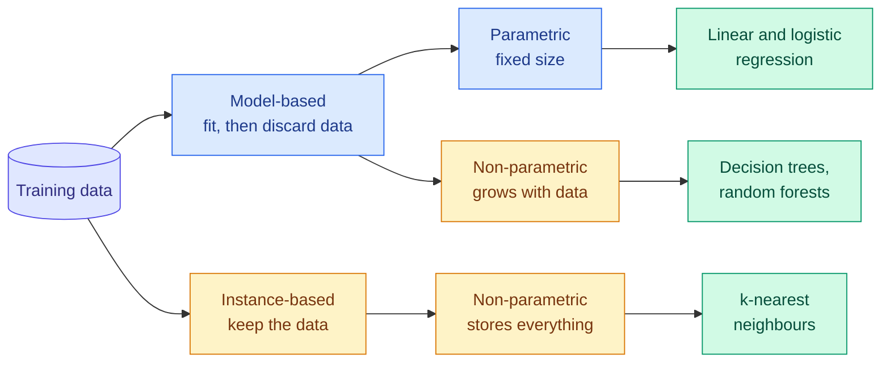

# Parametric and Non-Parametric, Model-Based and Instance-Based

**Level:** 🟡 Intermediate &nbsp;|&nbsp; **Effort:** Quick concept &nbsp;|&nbsp; **Module:** [05 Machine Learning](README.md)

---

## 🎯 Learning Objectives

By the end of this topic you will be able to:

- Define parametric and non-parametric models, and give two examples of each
- Distinguish model-based learning (compress data into a model) from instance-based learning (keep the data)
- Predict how each family behaves as the training set grows — in accuracy, memory and prediction time
- Show that no family extrapolates safely outside its training range, and explain why each fails differently
- Choose between them from the constraints of a real deployment

## 📚 Prerequisites

- [Topic 1: Types of Learning](01-types-of-learning.md)
- [Linear Algebra: Vectors and Matrices](../02-mathematics-for-ai/02-linear-algebra-vectors-and-matrices.md)

```bash
pip install -r requirements.txt      # scikit-learn==1.5.2, numpy==2.1.3
```

---

## 🍰 1. The simple version

There are two ways to learn from examples.

**Summarise, then throw the examples away.** You look at a thousand house sales and conclude "roughly
£3,000 per square metre plus £12,000 per bedroom". From then on you only need those two numbers. That is
**model-based** learning, and when the summary has a fixed number of numbers no matter how much data you
see, the model is **parametric**.

**Keep every example and compare.** To price a house, you find the ten most similar houses you have seen
and average their prices. You never summarise anything. That is **instance-based** learning, and because
what you store grows with the data, it is **non-parametric**.

## 🏠 2. Real-life analogy

> A **parametric** model is a recipe card: "200 g flour, 100 g sugar, bake 25 minutes". It is small, fast
> to use, and if the true best cake needs a technique the card has no line for, no amount of practice
> will add one.
>
> An **instance-based** model is a filing cabinet of every cake you have ever baked, with notes. For a new
> request you pull out the closest ones. It can capture anything you have tried — but the cabinet keeps
> growing, and finding the closest files takes longer every year.

**Where the analogy breaks down:** "non-parametric" does not mean "no parameters". A decision tree or a
random forest has plenty of learned numbers; the point is that **their number grows with the data** instead
of being fixed in advance.

---

## ⚙️ 3. The definitions, precisely

| | Parametric | Non-parametric |
| --- | --- | --- |
| **Definition** | A fixed, finite number of parameters, set before seeing data | Model complexity grows with the amount of data |
| **Assumption** | Strong — the relationship has a particular form | Weak — little assumed about form |
| **Examples** | Linear and logistic regression, naive Bayes, a neural network of fixed size | k-nearest neighbours (k-NN), decision trees, kernel SVMs, Gaussian processes |
| **With little data** | Often better — the assumption fills gaps | Often worse — too little to go on |
| **With lots of data** | Plateaus if the assumption is wrong | Keeps improving |

| | Model-based | Instance-based |
| --- | --- | --- |
| **Learning** | Fit a model, discard training data | Store training data; defer work to prediction |
| **Prediction** | Evaluate the model — fast | Compare to stored examples — cost grows with data |
| **Examples** | Linear regression, trees, neural networks | k-NN, kernel density estimation |
| **Also called** | Eager learning | **Lazy learning** |

The two splits are related but not identical. k-NN is both non-parametric and instance-based. A decision
tree is non-parametric but model-based: its size grows with data, but it does not need the training set to
predict.



---

## 📐 4. The mathematics, briefly

A **parametric** regression model commits to a form with parameters $\theta$:

$$
\hat{y} = f(x; \theta), \qquad \theta \in \mathbb{R}^p \text{ with } p \text{ fixed}
$$

For linear regression $f(x; \theta) = \theta_0 + \theta_1 x$, so $p = 2$ whether you train on fifty rows or
fifty million.

**k-nearest neighbours** regression has no $\theta$ at all. For a query $x$, it finds the set $N_k(x)$ of
the $k$ training points closest to $x$ and averages their targets:

$$
\hat{y}(x) = \frac{1}{k} \sum_{i \in N_k(x)} y_i
$$

| Symbol | Means | Why it matters |
| --- | --- | --- |
| $\theta$ | The learned parameters | A parametric model's entire memory of the data |
| $p$ | Number of parameters | Fixed in advance for parametric models |
| $N_k(x)$ | The $k$ stored training points nearest to $x$ | Requires the whole training set at prediction time |
| $k$ | Number of neighbours | Small $k$ follows noise; large $k$ over-smooths |

**In words:** a parametric model asks "which setting of my fixed knobs fits best?"; k-NN asks "what did
the most similar examples look like?".

---

## 💻 5. Code example — accuracy, memory, speed and extrapolation

The true relationship is curved: $y = \sin x + 0.3x$ plus noise, for $x$ between 0 and 6. We compare a
straight line, a cubic polynomial (both parametric) and k-NN (non-parametric) as the training set grows,
then ask all of them about $x = 9$ — outside anything they have seen.

```python
"""Parametric versus non-parametric: what each stores, how it scales, and where it extrapolates."""

import time

import numpy as np
from sklearn.linear_model import LinearRegression
from sklearn.neighbors import KNeighborsRegressor
from sklearn.preprocessing import PolynomialFeatures
from sklearn.pipeline import make_pipeline
from sklearn.tree import DecisionTreeRegressor

rng = np.random.default_rng(0)


def make_data(n, low=0.0, high=6.0):
    x = rng.uniform(low, high, size=(n, 1))
    return x, np.sin(x[:, 0]) + 0.3 * x[:, 0] + rng.normal(0, 0.2, size=n)


X_test, y_test = make_data(2000)
models = {
    "linear (parametric)": lambda: LinearRegression(),
    "cubic (parametric)": lambda: make_pipeline(PolynomialFeatures(3), LinearRegression()),
    "k-NN, k=10 (non-param.)": lambda: KNeighborsRegressor(n_neighbors=10),
}


def numbers_stored(model) -> int:
    """How many learned numbers the model must keep in order to make a prediction."""
    if hasattr(model, "_fit_X"):                           # k-NN keeps the training set itself
        return model._fit_X.size + np.asarray(model._y).size
    final = model[-1] if hasattr(model, "steps") else model
    return final.coef_.size + 1                            # weights plus the intercept


print(f"{'model':<25}{'n=50':>8}{'n=500':>8}{'n=20000':>9}   numbers stored at n=20000")
for name, build in models.items():
    errors = []
    for n in [50, 500, 20000]:
        X_train, y_train = make_data(n)
        model = build().fit(X_train, y_train)
        errors.append(np.mean((model.predict(X_test) - y_test) ** 2))
    print(f"{name:<25}" + "".join(f"{e:>8.3f}" for e in errors[:2]) + f"{errors[2]:>9.3f}   {numbers_stored(model):,}")

# --- prediction cost grows with the training set for instance-based models ---
X_big, y_big = make_data(200_000)
X_query = rng.uniform(0, 6, size=(20_000, 1))
seconds = {}
for name, model in [("linear", LinearRegression()), ("k-NN", KNeighborsRegressor(n_neighbors=10))]:
    model.fit(X_big, y_big)
    model.predict(X_query[:10])                            # warm up, so we time the real work
    start = time.perf_counter()
    model.predict(X_query)
    seconds[name] = time.perf_counter() - start
# Absolute timings depend on the machine; the ratio between the two does not, in any way that matters.
print(f"\npredicting 20,000 rows after training on 200,000: "
      f"k-NN more than 20x slower than linear: {seconds['k-NN'] > 20 * seconds['linear']}")

# --- extrapolation: ask about x = 9, far outside the training range 0-6 ---
X_train, y_train = make_data(2000)
x_far = np.array([[9.0]])
truth = np.sin(9.0) + 0.3 * 9.0
print(f"\nat x = 9 (trained on 0-6), truth {truth:.2f}:")
for name, model in [("linear", LinearRegression()), ("cubic", make_pipeline(PolynomialFeatures(3), LinearRegression())),
                    ("k-NN", KNeighborsRegressor(n_neighbors=10)), ("decision tree", DecisionTreeRegressor(max_depth=6, random_state=0))]:
    print(f"  {name:<14} predicts {model.fit(X_train, y_train).predict(x_far)[0]:6.2f}")
```

**Output:**
```
model                        n=50   n=500  n=20000   numbers stored at n=20000
linear (parametric)         0.225   0.221    0.221   2
cubic (parametric)          0.050   0.044    0.043   5
k-NN, k=10 (non-param.)     0.090   0.044    0.043   40,000

predicting 20,000 rows after training on 200,000: k-NN more than 20x slower than linear: True

at x = 9 (trained on 0-6), truth 3.11:
  linear         predicts   0.66
  cubic          predicts  17.51
  k-NN           predicts   1.54
  decision tree  predicts   1.52
```

**Read the table in three directions.**

1. **The straight line is stuck at 0.221 whatever the data size.** Its assumption — the relationship is a
   line — is wrong, and 400 times more data cannot fix a wrong assumption. That error is **bias**.
2. **k-NN starts worse than the cubic at n=50 (0.090 against 0.050) and catches up by n=500.** With few
   points, its neighbours are far apart and noisy; with many, it approximates any shape. The cubic got
   lucky: its assumed shape happens to fit this curve well over 0–6.
3. **The cubic stores 5 numbers; k-NN stores 40,000** — every training input and target — and prediction
   was more than 20 times slower. Memory and latency grow with the data for instance-based models.

**Now the extrapolation, which matters more than any of that.** Every model is wrong at $x = 9$, and each
is wrong *in the way its structure dictates*:

- **k-NN and the tree predict about 1.5** — the value at the edge of the training data. Neither can
  predict anything outside the range of targets it has seen; beyond the edge, they go flat.
- **The linear model continues its line** and badly undershoots.
- **The cubic, the best model inside the range, is the worst outside it** — 17.51 against a true 3.11.
  Polynomials grow without bound, so a small error in the fitted coefficients becomes enormous far away.

**A model's accuracy on the range it was trained on says nothing about its behaviour outside it.** In
production, check whether live inputs fall inside the training range — a house far larger than any in
the training data, a price in a currency the model has never seen — and flag or refuse rather than trust
the output.

---

## 🌍 6. Choosing in practice

| Constraint | Leans towards | Why |
| --- | --- | --- |
| Very little data | Parametric | Its assumption fills the gaps |
| Lots of data, unknown shape | Non-parametric — usually tree ensembles | Flexibility pays off with data |
| Tight prediction latency or small devices | Parametric or compact model-based | Fixed, small prediction cost |
| Need to add new examples without retraining | Instance-based | Adding a row is the whole update |
| Need to delete a person's data on request | Instance-based makes it easy; parametric needs retraining | Stored rows can be removed directly |
| Interpretability of the whole model | Parametric, e.g. linear coefficients | A handful of numbers to explain |
| High-dimensional inputs | Avoid plain k-NN | Distances lose meaning as dimensions grow |

**Industry examples:**

- **Credit scoring** often uses logistic regression (parametric) because each coefficient can be explained
  to a regulator and an applicant.
- **"Customers who bought this also bought…"** and similar-item search use nearest-neighbour lookups over
  embeddings — instance-based — because new items must appear immediately. At scale this uses Approximate
  Nearest Neighbour (ANN) indexes ([15 Embeddings and Vector Search](../15-embeddings-and-vector-search/README.md)).
- **Tabular prediction in most industries** uses gradient-boosted trees (non-parametric, model-based):
  flexible like k-NN, but fast at prediction time ([Topic 6](06-boosting.md)).

### The curse of dimensionality

**k-NN assumes that nearby points are similar.** In many dimensions, "nearby" stops meaning much: the
distance to the nearest and the farthest point become nearly equal, because every extra dimension adds
its own random difference. Instance-based methods on raw high-dimensional data need dimensionality
reduction ([Topic 8](08-dimensionality-reduction.md)) or learned embeddings in which distance is meaningful.

## ⚡ 7. Performance note

| Family | Training cost | Prediction cost | Memory |
| --- | --- | --- | --- |
| Linear models | Low | One dot product per row | Number of features |
| Decision trees and ensembles | Moderate | Tree depth × number of trees | Grows with data and trees |
| k-NN, brute force | Almost none | Distance to every stored point | Whole training set |
| k-NN with tree or ANN indexes | Index build | Much less than brute force in low dimensions or approximately | Training set plus index |

---

## ⚠️ 8. Common mistakes

| Mistake | Why it happens | Fix |
| --- | --- | --- |
| Adding data to fix a biased parametric model | "More data always helps" | The line stayed at 0.221; change the model's form |
| Trusting predictions outside the training range | The test score was good | Compare live inputs with training ranges; flag extrapolation |
| k-NN on unscaled features | It worked in a tutorial | Distances are dominated by large-range features — scale first ([Topic 4](04-classification.md)) |
| Treating "non-parametric" as "no parameters" | The name | It means complexity grows with data |
| Shipping k-NN without budgeting latency and memory | Training was instant | Measure prediction cost at production data size |

## 🔐 9. Security and privacy note

- **Instance-based models contain their training data.** A k-NN model file *is* the dataset. If the
  training data is personal or confidential, the model artefact needs the same protection — and a
  prediction can reveal a neighbour's value when $k$ is small.
- **Parametric models can also leak training data**, less directly, through memorisation and membership
  inference. Treat model files as sensitive artefacts; see [28 AI Security](../28-ai-security/README.md).
- **Never unpickle a model file from an untrusted source.** Pickle files can execute code on load — see
  [Your First scikit-learn Model](../01-python-foundations/14-your-first-scikit-learn-model.md).

---

## 🎤 10. Interview questions

<details>
<summary><b>Q1: What is the difference between a parametric and a non-parametric model? Give examples.</b></summary>

A parametric model has a fixed number of parameters decided before training, and assumes a functional form —
linear regression, logistic regression, naive Bayes. A non-parametric model's complexity grows with the data
and assumes little about form — k-nearest neighbours, decision trees, kernel SVMs.

The trade-off: parametric models are data-efficient, fast and interpretable, but carry bias when the assumed
form is wrong, which more data cannot fix. Non-parametric models can fit almost anything given enough data,
but need more of it, can overfit, and — for instance-based ones — cost more memory and prediction time.
</details>

<details>
<summary><b>Q2: Your gradient-boosted model predicts house prices well, but a new development has houses twice as large as any in the training data. What do you expect?</b></summary>

Tree-based models cannot predict outside the range of targets seen in training: past the largest house they
treat every larger value like the largest one, so predictions go flat and will understate these prices.
A linear model would extrapolate the trend, which may be closer or wildly wrong depending on whether the
relationship stays linear.

The engineering response is to detect it: compare incoming feature values against the training
distribution, flag out-of-range inputs for review, and collect data for the new segment before trusting
automated predictions there.
</details>

<details>
<summary><b>Q3: Why does k-NN perform poorly in high dimensions?</b></summary>

It relies on distance being meaningful. As dimensions increase, the ratio between the nearest and farthest
neighbour's distance approaches one, so the "nearest" neighbours are barely nearer than anyone else. You also
need exponentially more data to cover the space densely. Irrelevant features make it worse, because each adds
noise to every distance.

Remedies: feature selection, scaling, dimensionality reduction, or learned embeddings in which distance
reflects similarity — which is what modern vector search relies on.
</details>

---

## ✅ Key takeaways

- **Parametric** = fixed number of parameters and a strong assumption; **non-parametric** = complexity grows with data.
- **Model-based** learning summarises and discards data; **instance-based** (lazy) learning keeps it.
- A wrong parametric assumption is **bias that more data cannot fix** — the line stayed at 0.221.
- Non-parametric models need more data but approximate any shape; k-NN caught the cubic by n=500.
- Instance-based models pay in **memory and prediction time**: 40,000 stored numbers against 5.
- **No model extrapolates safely.** The best model in range predicted 17.51 against a true 3.11 outside it.
- An instance-based model file contains its training data — protect it accordingly.

---

## 📚 Official References

- [scikit-learn: Nearest Neighbors — scikit-learn developers](https://scikit-learn.org/stable/modules/neighbors.html) — verified 2026-09-14
- [scikit-learn: Linear Models — scikit-learn developers](https://scikit-learn.org/stable/modules/linear_model.html) — verified 2026-09-14
- [scikit-learn: Decision Trees — scikit-learn developers](https://scikit-learn.org/stable/modules/tree.html) — verified 2026-09-14
- [scikit-learn: Polynomial features — scikit-learn developers](https://scikit-learn.org/stable/modules/preprocessing.html#polynomial-features) — verified 2026-09-14

---

## 🔗 Navigation

[← Topic 1: Types of Learning](01-types-of-learning.md) &nbsp;|&nbsp;
[🏠 Module Home](README.md) &nbsp;|&nbsp;
[Topic 3: Regression →](03-regression.md)
