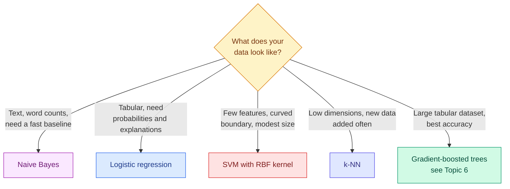

# Classification: Logistic Regression, k-NN, Naive Bayes and SVMs

**Level:** 🟡 Intermediate &nbsp;|&nbsp; **Effort:** Detailed module &nbsp;|&nbsp; **Module:** [05 Machine Learning](README.md)

---

## 🎯 Learning Objectives

By the end of this topic you will be able to:

- Explain how logistic regression turns a linear score into a probability, and how it is trained
- Explain k-nearest neighbours, naive Bayes and support vector machines, and the assumption each makes
- Show why k-NN and SVMs need feature scaling, with a measured accuracy difference
- Show naive Bayes becoming overconfident when its independence assumption is broken
- Explain the kernel trick, and choose between a linear and a non-linear classifier from the data

## 📚 Prerequisites

- [Topic 3: Regression](03-regression.md) — logistic regression reuses its ideas
- [Probability](../02-mathematics-for-ai/06-probability.md) — especially Bayes' theorem
- [Encoding and Validation](../03-data-foundations/04-encoding-and-data-validation.md) — for scaling

```bash
pip install -r requirements.txt      # scikit-learn==1.5.2, numpy==2.1.3
```

---

## 🍰 1. The simple version

**Classification predicts a category**: spam or not, which digit, benign or malignant. Four classic families
do it in four different ways:

| Family | How it decides | Everyday version |
| --- | --- | --- |
| **Logistic regression** | Adds up weighted evidence, converts the total into a probability | A points system: +2 for this, −1 for that, over 5 means yes |
| **k-nearest neighbours** | Looks at the most similar past examples and takes a vote | "People with symptoms like yours mostly had flu" |
| **Naive Bayes** | Multiplies how typical each clue is of each class | A detective treating every clue as independent evidence |
| **Support vector machine** | Draws the boundary with the widest possible gap between classes | Building a road between two towns, as far from both as possible |

## 🏠 2. Real-life analogy

> Four doctors assess the same patient. The first uses a scoring checklist (logistic regression). The
> second recalls the five most similar patients they have treated (k-NN). The third asks how typical each
> symptom is for each disease and multiplies the odds (naive Bayes). The fourth has studied the borderline
> cases most carefully and draws the line where healthy and ill are most clearly separated (SVM).

**Where the analogy breaks down:** a doctor adjusts their method to the case. Each algorithm applies its
assumption rigidly — and when the assumption is wrong for the data, it fails in a characteristic way. The
code below shows each failure.

---

## ⚙️ 3. How each one works

### Logistic regression

A linear score $z = \beta_0 + \beta^\top x$ can be any number. The **sigmoid** function squashes it into a
probability between 0 and 1:

$$
P(y = 1 \mid x) = \sigma(z) = \frac{1}{1 + e^{-z}}
$$

Training minimises **log loss** (cross-entropy), which punishes confident wrong predictions heavily:

$$
\mathcal{L} = -\frac{1}{n}\sum_i \big[ y_i \log p_i + (1 - y_i)\log(1 - p_i) \big]
$$

| Symbol | Means |
| --- | --- |
| $z$ | The linear score — the log-odds of class 1 |
| $\sigma$ | Sigmoid, mapping the score to a probability |
| $p_i$ | Predicted probability that example $i$ is class 1 |
| $e^{\beta_j}$ | The factor by which the **odds** multiply per unit increase in $x_j$ |

Despite its name, logistic regression is a **classifier**. Its boundary is linear: the set where $z = 0$.
scikit-learn applies L2 regularisation by default, so scale features and tune `C` (the inverse of
regularisation strength). Multiple classes are handled with a softmax generalisation.

### k-nearest neighbours (k-NN)

Store the training set. To classify a point, find the $k$ closest training points by distance and take a
majority vote. It is **instance-based** ([Topic 2](02-parametric-and-instance-based-models.md)): no training,
all the work at prediction. Choices that matter: $k$ (small follows noise, large blurs boundaries), the
distance metric, and **feature scale** — distance is dominated by whichever feature has the largest range.

### Naive Bayes

Bayes' theorem gives the probability of a class given the features. The **naive** assumption is that
features are **independent given the class**, so the likelihood becomes a product:

$$
P(y \mid x_1, \dots, x_p) \propto P(y) \prod_{j=1}^{p} P(x_j \mid y)
$$

Each $P(x_j \mid y)$ is estimated separately — a Gaussian per feature for `GaussianNB`, word counts for
`MultinomialNB`. It trains in one pass, works with little data, and is a strong baseline for text. Its
classifications are often good even when independence is false; **its probabilities usually are not**.

### Support vector machines (SVM)

A linear SVM finds the boundary with the **maximum margin** — the widest gap to the nearest training points
of each class. Only those nearest points, the **support vectors**, determine the boundary. A soft margin,
controlled by `C`, allows some points inside the gap or misclassified.

**The kernel trick** lets an SVM draw curved boundaries. A kernel $K(x, x')$ computes a similarity equal to a
dot product in a higher-dimensional feature space, without constructing that space. The Radial Basis Function
(RBF) kernel

$$
K(x, x') = \exp\left(-\gamma \lVert x - x' \rVert^2\right)
$$

corresponds to an infinite-dimensional space. Larger `gamma` makes each support vector's influence more
local, allowing wigglier boundaries. Because the kernel uses distances, **SVMs need scaled features** too.



---

## 💻 4. Code example — four families, three broken assumptions

The breast cancer Wisconsin dataset ships with scikit-learn: 569 tumours described by 30 measurements, each
labelled malignant or benign. **Teaching use only** — nothing here is a medical tool.

```python
"""Four classifier families on the same data - and the assumption each one breaks on."""

import numpy as np
from sklearn.datasets import load_breast_cancer, make_moons
from sklearn.linear_model import LogisticRegression
from sklearn.model_selection import cross_val_score
from sklearn.naive_bayes import GaussianNB
from sklearn.neighbors import KNeighborsClassifier
from sklearn.pipeline import make_pipeline
from sklearn.preprocessing import StandardScaler
from sklearn.svm import SVC

X, y = load_breast_cancer(return_X_y=True)     # 569 tumours, 30 measurements, bundled with scikit-learn

candidates = {
    "logistic regression": make_pipeline(StandardScaler(), LogisticRegression(max_iter=1000)),
    "k-NN, unscaled": KNeighborsClassifier(n_neighbors=5),
    "k-NN, scaled": make_pipeline(StandardScaler(), KNeighborsClassifier(n_neighbors=5)),
    "Gaussian naive Bayes": GaussianNB(),
    "SVM linear, scaled": make_pipeline(StandardScaler(), SVC(kernel="linear")),
    "SVM RBF, unscaled": SVC(kernel="rbf"),
    "SVM RBF, scaled": make_pipeline(StandardScaler(), SVC(kernel="rbf")),
}
print("breast cancer, 5-fold cross-validated accuracy")
for name, model in candidates.items():
    scores = cross_val_score(model, X, y, cv=5)
    print(f"  {name:<22} {scores.mean():.3f}")

print(f"\nwhy scaling matters: feature ranges run from {X.std(axis=0).min():.4f} "
      f"to {X.std(axis=0).max():.1f} standard deviations")

# --- naive Bayes assumes features are independent; copies make it overconfident ---
nb_once = GaussianNB().fit(X, y)
X_copied = np.hstack([X] * 5)                  # every measurement repeated five times
nb_copied = GaussianNB().fit(X_copied, y)
for name, model, data in [("original features", nb_once, X), ("each feature x5", nb_copied, X_copied)]:
    probabilities = model.predict_proba(data).max(axis=1)
    print(f"naive Bayes, {name:<17} accuracy {model.score(data, y):.3f}, "
          f"predictions with confidence above 0.9999: {np.mean(probabilities > 0.9999):.0%}")

# --- a linear boundary cannot follow curved classes; a kernel can ---
X_moons, y_moons = make_moons(n_samples=400, noise=0.2, random_state=0)
print("\ntwo interleaved half-moons, 5-fold cross-validated accuracy")
for name, model in [("logistic regression", LogisticRegression()),
                    ("SVM linear kernel", SVC(kernel="linear")),
                    ("SVM RBF kernel", SVC(kernel="rbf")),
                    ("k-NN, k=15", KNeighborsClassifier(n_neighbors=15))]:
    print(f"  {name:<22} {cross_val_score(model, X_moons, y_moons, cv=5).mean():.3f}")

svm = SVC(kernel="rbf").fit(X_moons, y_moons)
print(f"\nthe RBF SVM keeps {svm.support_.size} of 400 training points as support vectors")
```

**Output:**
```
breast cancer, 5-fold cross-validated accuracy
  logistic regression    0.981
  k-NN, unscaled         0.928
  k-NN, scaled           0.965
  Gaussian naive Bayes   0.939
  SVM linear, scaled     0.972
  SVM RBF, unscaled      0.912
  SVM RBF, scaled        0.974

why scaling matters: feature ranges run from 0.0026 to 568.9 standard deviations
naive Bayes, original features accuracy 0.942, predictions with confidence above 0.9999: 92%
naive Bayes, each feature x5   accuracy 0.944, predictions with confidence above 0.9999: 98%

two interleaved half-moons, 5-fold cross-validated accuracy
  logistic regression    0.875
  SVM linear kernel      0.880
  SVM RBF kernel         0.948
  k-NN, k=15             0.953

the RBF SVM keeps 85 of 400 training points as support vectors
```

**Broken assumption 1 — distances need comparable units.** One feature varies by 0.0026, another by 568.9.
Unscaled, the large one dominates every distance: k-NN loses 3.7 points and the RBF SVM loses 6.2. The same
algorithms, scaled inside a pipeline, are among the best. **Scaling is not optional for distance-based
methods.**

**Broken assumption 2 — naive Bayes counts correlated evidence repeatedly.** Copying every feature five
times adds no information, and accuracy barely moves. But naive Bayes multiplies each copy's likelihood as
if it were new evidence, so predictions with confidence above 99.99% rise from 92% to 98%. Real features are
correlated too — these 30 already include radius, perimeter and area, which measure nearly the same thing —
which is why **naive Bayes probabilities should not be used as real probabilities** without calibration
([07 Model Evaluation](../07-model-evaluation/README.md)).

**Broken assumption 3 — the boundary is straight.** On curved half-moons, the linear models plateau near 88%.
The RBF kernel and k-NN follow the curve to about 95%.

**And the most useful result of all: on the real dataset, plain scaled logistic regression was the best
model, at 98.1%.** Many real classification problems are close to linearly separable after scaling. **Always
fit the simple, interpretable model first**; a more complex one must beat it to earn its place.

**The SVM stores 85 support vectors out of 400.** Prediction cost grows with that number, which is one reason
kernel SVMs struggle on very large datasets.

**Cross-validation caveat:** five folds on 569 rows give noisy estimates. Differences of one or two points
here — say 0.972 against 0.974 — are within noise. How to compare models properly is in
[07 Model Evaluation](../07-model-evaluation/README.md).

---

## 🌍 5. Real-world use

| Industry | Task | Common choice | Why |
| --- | --- | --- | --- |
| Email | Spam filtering baseline | Naive Bayes on word counts | Fast, needs little data, updates cheaply |
| Lending | Default prediction | Logistic regression | Probabilities, explainable per-feature effects, regulatory familiarity |
| Healthcare research | Classification from a small set of measurements | Logistic regression, SVM | Small datasets, need for interpretability |
| Retail | "Customers like you" lookups | k-NN over embeddings | New items and users usable immediately |
| Text and bioinformatics | High-dimensional sparse features | Linear SVM, logistic regression | Linear models excel when features outnumber rows |

## ⚖️ 6. Trade-offs

| Model | Strengths | Weaknesses | Scale features? | Probabilities |
| --- | --- | --- | --- | --- |
| Logistic regression | Fast, interpretable, well-calibrated when well specified | Linear boundary unless features are engineered | Yes (regularised) | Good |
| k-NN | No training, any boundary shape, easy to add data | Slow prediction, memory, poor in high dimensions | **Essential** | Crude vote fractions |
| Naive Bayes | Very fast, tiny data needs, strong for text | Independence assumption; overconfident | Not for Gaussian NB | Poorly calibrated |
| SVM, linear | Strong in high dimensions | No native probabilities | **Essential** | Needs calibration |
| SVM, RBF | Flexible boundaries on modest data | Training scales poorly beyond tens of thousands of rows; two hyperparameters | **Essential** | Needs calibration |

---

## ⚠️ 7. Common mistakes

| Mistake | Why it happens | Fix |
| --- | --- | --- |
| Distance-based models on unscaled features | Tutorials use pre-scaled data | Scaler inside a `Pipeline`; k-NN lost 3.7 points without it |
| Treating naive Bayes probabilities as calibrated | `predict_proba` returns numbers between 0 and 1 | Calibrate, or use only the ranking |
| Reaching for a kernel SVM first | It sounds more powerful | Scaled logistic regression won here |
| Fitting a scaler on all data before cross-validation | One line is easier | Put it in the pipeline so it is refitted per fold |
| Using accuracy on imbalanced classes | It is the default score | See [Splits, Sampling and Class Imbalance](../03-data-foundations/06-splits-sampling-and-class-imbalance.md) |
| Reading logistic coefficients on unscaled data as importance | A big number looks important | Coefficients depend on units; compare only on standardised features |

## 🔐 8. Security note

- **Linear classifiers are easy to evade once their weights are known or probed.** A spam filter's
  strongest negative words become an evasion recipe. Keep model details private where adversaries exist,
  monitor for distribution shift, and combine signals.
- **Probabilities drive decisions.** An overconfident model — like naive Bayes above — makes thresholds and
  risk scores meaningless. Calibrate before any decision is automated on a probability.
- **k-NN exposes neighbours.** With small $k$, a prediction can reveal a specific training record's label;
  treat instance-based models over personal data as personal data.

---

## 🎤 9. Interview questions

<details>
<summary><b>Q1: Why is logistic regression called regression when it is a classifier?</b></summary>

Because it regresses the **log-odds** of the positive class linearly on the features: $\log\frac{p}{1-p} =
\beta_0 + \beta^\top x$. The output is a probability, which becomes a class only after applying a threshold.
It is trained by minimising log loss rather than squared error, and each coefficient is a change in log-odds
per unit of the feature — so $e^{\beta_j}$ is an odds ratio. Its decision boundary is linear.
</details>

<details>
<summary><b>Q2: What is the kernel trick?</b></summary>

Many algorithms, including SVMs, only use the data through dot products between examples. A kernel function
computes the dot product the data would have in a transformed, often much higher-dimensional space, directly
from the original inputs — so the algorithm finds a linear boundary in that space, which is non-linear in the
original one, without ever constructing the transformed features. The RBF kernel corresponds to an
infinite-dimensional space.

The cost is that training works with pairwise similarities, which scales poorly with the number of examples,
and prediction depends on the number of support vectors.
</details>

<details>
<summary><b>Q3: Naive Bayes assumes independent features, which is almost never true. Why does it still work?</b></summary>

Classification only needs the correct class to have the highest score, not accurate probabilities. Violations
of independence often distort all class scores in similar ways, so the ranking survives even though the
probabilities are badly overconfident. With little data it also benefits from having few parameters.

The practical consequence is to trust its predicted class more than its probability: in the example,
duplicating features left accuracy unchanged but raised extreme-confidence predictions from 92% to 98%.
Calibrate if probabilities feed decisions.
</details>

<details>
<summary><b>Q4 (scenario): A k-NN model scored well in a notebook but performs badly in production. What do you check?</b></summary>

Whether scaling is fitted and applied identically in production — a scaler fitted in the notebook but not
saved with the model changes every distance. Whether production data has the same feature units and ranges,
since k-NN is highly sensitive to scale drift. Whether the notebook evaluation leaked, for instance with
duplicates on both sides of the split, which flatters nearest-neighbour methods more than any other. Whether
new data contains many features or categories that make distances less meaningful. And latency — prediction
cost grows with the stored dataset, which can force timeouts or approximations.
</details>

---

## ✅ Key takeaways

- **Logistic regression** turns a linear score into a probability with the sigmoid and trains on log loss.
- **k-NN** votes among neighbours; **naive Bayes** multiplies per-feature likelihoods; **SVMs** maximise the margin.
- **Distance-based models need scaling**: unscaled, k-NN lost 3.7 points and the RBF SVM lost 6.2.
- **Naive Bayes is overconfident** when features are correlated — trust its class more than its probability.
- **Kernels bend the boundary**: on half-moons, RBF reached 0.948 against 0.880 for a linear SVM.
- **Scaled logistic regression beat everything on the real dataset.** Fit the simple model first.

---

## 📚 Official References

- [scikit-learn: Linear Models, including logistic regression — scikit-learn developers](https://scikit-learn.org/stable/modules/linear_model.html) — verified 2026-09-14
- [scikit-learn: Nearest Neighbors — scikit-learn developers](https://scikit-learn.org/stable/modules/neighbors.html) — verified 2026-09-14
- [scikit-learn: Naive Bayes — scikit-learn developers](https://scikit-learn.org/stable/modules/naive_bayes.html) — verified 2026-09-14
- [scikit-learn: Support Vector Machines — scikit-learn developers](https://scikit-learn.org/stable/modules/svm.html) — verified 2026-09-14
- [scikit-learn: Toy datasets, including breast cancer Wisconsin — scikit-learn developers](https://scikit-learn.org/stable/datasets/toy_dataset.html) — verified 2026-09-14
- [An Introduction to Statistical Learning, book site — James, Witten, Hastie, Tibshirani and Taylor](https://www.statlearning.com/) — verified 2026-09-14

---

## 🔗 Navigation

[← Topic 3: Regression](03-regression.md) &nbsp;|&nbsp;
[🏠 Module Home](README.md) &nbsp;|&nbsp;
[Topic 5: Decision Trees and Random Forests →](05-decision-trees-and-random-forests.md)
