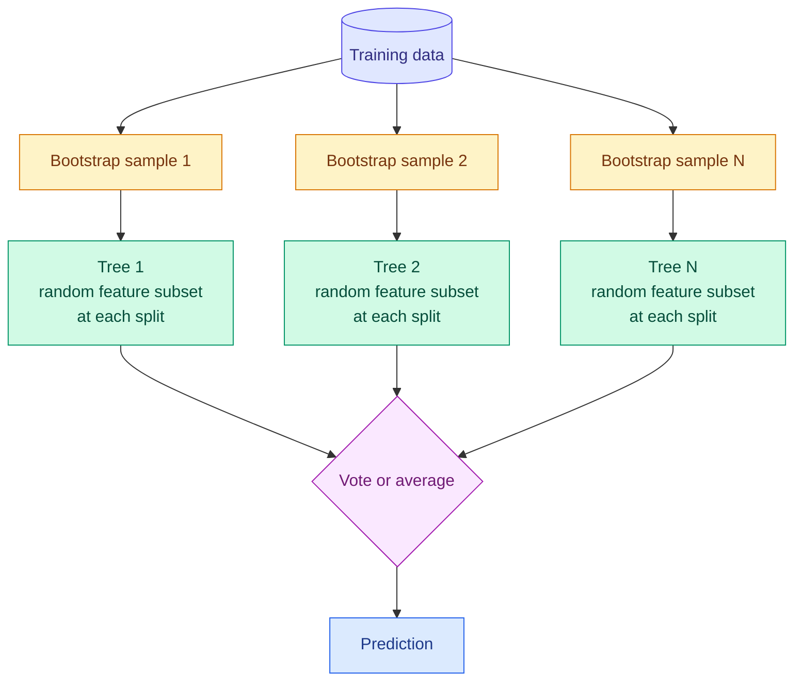

# Decision Trees, Bagging, Random Forests and Extra Trees

**Level:** 🟡 Intermediate &nbsp;|&nbsp; **Effort:** Detailed module &nbsp;|&nbsp; **Module:** [05 Machine Learning](README.md)

---

## 🎯 Learning Objectives

By the end of this topic you will be able to:

- Explain how a decision tree chooses splits using Gini impurity or entropy, and compute one by hand
- Show a tree memorising its training data, and control it with depth and leaf-size limits
- Demonstrate why a single tree is unstable, and why averaging many trees fixes it
- Explain bagging, random forests and extra trees, and the one idea that separates each from the last
- Use out-of-bag estimates, and read feature importances without being misled by them

## 📚 Prerequisites

- [Topic 2: Parametric and Instance-Based Models](02-parametric-and-instance-based-models.md) — trees are non-parametric
- [Topic 4: Classification](04-classification.md) — same dataset, for comparison
- [Probability](../02-mathematics-for-ai/06-probability.md) — for impurity measures

```bash
pip install -r requirements.txt      # scikit-learn==1.5.2, numpy==2.1.3
```

---

## 🍰 1. The simple version

**A decision tree is a game of twenty questions.** "Is the tumour's perimeter above 106? Yes. Are its
concave points above 0.1? Yes. Then: malignant." The tree learns which question to ask first, and which
next, from the data.

Trees are easy to read, need no feature scaling, and handle mixed feature types. They have two serious
flaws: **they memorise** if allowed to keep asking questions, and **they are unstable** — change a few rows
and you can get a completely different tree.

**A random forest fixes both by growing hundreds of deliberately different trees and letting them vote.**
Each tree is a bit wrong in its own way; the errors largely cancel.

## 🏠 2. Real-life analogy

> One expert's opinion on the value of an antique can be swayed by the last few items they saw. Ask
> two hundred appraisers — each shown a slightly different selection of past sales, and each only allowed
> to consider a random handful of features per decision — and average their answers. Individual quirks
> cancel out; what they agree on survives.

**Where the analogy breaks down:** averaging only helps when the appraisers make *different* mistakes. Two
hundred copies of the same appraiser are no better than one — which is exactly why random forests inject
randomness into every tree.

---

## ⚙️ 3. How a tree chooses a split

At each node, the tree tries every feature and every threshold, and picks the split that makes the
resulting groups **purest**.

### 📐 Impurity

For a node with class proportions $p_1, \dots, p_K$:

$$
\text{Gini} = 1 - \sum_{k=1}^{K} p_k^2 \qquad\qquad \text{Entropy} = -\sum_{k=1}^{K} p_k \log_2 p_k
$$

A split's quality is the drop in impurity, weighting each child by its share of the samples:

$$
\Delta = I(\text{parent}) - \frac{n_L}{n} I(\text{left}) - \frac{n_R}{n} I(\text{right})
$$

| Symbol | Means |
| --- | --- |
| $p_k$ | Fraction of the node's samples in class $k$ |
| $I$ | Impurity — Gini or entropy; 0 means a pure node |
| $n_L, n_R$ | Samples going left and right |
| $\Delta$ | Impurity decrease — the tree picks the split with the largest |

### Worked example

A node holds 10 samples: 6 benign, 4 malignant. Gini $= 1 - (0.6^2 + 0.4^2) = 1 - 0.52 = 0.48$.

A candidate split sends 5 benign and 1 malignant left, and 1 benign and 3 malignant right.

- Left: $p = (5/6, 1/6)$ → Gini $= 1 - (0.694 + 0.028) = 0.278$
- Right: $p = (1/4, 3/4)$ → Gini $= 1 - (0.0625 + 0.5625) = 0.375$
- Weighted: $0.6 \times 0.278 + 0.4 \times 0.375 = 0.167 + 0.150 = 0.317$
- Decrease: $0.48 - 0.317 = 0.163$

The tree computes this for every feature and threshold and keeps the best. For regression, the same
procedure uses variance (squared error) instead of impurity, and leaves predict the mean target.

**This greedy search is why trees need no scaling:** a threshold split on area in square metres gives
exactly the same partitions as one in square feet.

---

## 💻 4. Code example — memorisation, readable rules, and instability

The breast cancer dataset from [Topic 4](04-classification.md) — where scaled logistic regression reached
98.1% — so you can compare. **Teaching use only.**

```python
"""Decision trees overfit and are unstable; averaging many of them fixes both."""

import numpy as np
from sklearn.datasets import load_breast_cancer
from sklearn.model_selection import train_test_split
from sklearn.tree import DecisionTreeClassifier, export_text

X, y = load_breast_cancer(return_X_y=True)
names = load_breast_cancer().feature_names
X_train, X_test, y_train, y_test = train_test_split(X, y, test_size=0.3, random_state=0, stratify=y)

# --- 1. depth: a tree can memorise its training set ---
print(f"{'max_depth':>9}{'leaves':>8}{'train':>8}{'test':>8}")
for depth in [1, 2, 4, 8, None]:
    tree = DecisionTreeClassifier(max_depth=depth, random_state=0).fit(X_train, y_train)
    print(f"{str(depth):>9}{tree.get_n_leaves():>8}{tree.score(X_train, y_train):>8.3f}{tree.score(X_test, y_test):>8.3f}")

small = DecisionTreeClassifier(max_depth=2, random_state=0).fit(X_train, y_train)
print("\na depth-2 tree, readable as rules:")
print(export_text(small, feature_names=list(names), decimals=1))

# --- 2. instability: resample the training data and the root split changes ---
rng = np.random.default_rng(0)
roots = []
for _ in range(10):
    rows = rng.integers(0, len(X_train), size=len(X_train))
    tree = DecisionTreeClassifier(random_state=0).fit(X_train[rows], y_train[rows])
    roots.append(str(names[tree.tree_.feature[0]]))
print("root split across 10 bootstrap samples:", sorted(set(roots)))
```

**Output:**
```
max_depth  leaves   train    test
        1       2   0.932   0.889
        2       4   0.942   0.906
        4      12   0.990   0.906
        8      16   1.000   0.906
     None      16   1.000   0.906

a depth-2 tree, readable as rules:
|--- worst perimeter <= 106.1
|   |--- worst concave points <= 0.2
|   |   |--- class: 1
|   |--- worst concave points >  0.2
|   |   |--- class: 0
|--- worst perimeter >  106.1
|   |--- worst concave points <= 0.1
|   |   |--- class: 0
|   |--- worst concave points >  0.1
|   |   |--- class: 0

root split across 10 bootstrap samples: ['mean concave points', 'worst concave points', 'worst perimeter', 'worst radius']
```

**Memorisation.** From depth 8, the tree classifies **every training example correctly** — 100% — while test
accuracy stays at 90.6%. It stopped at 16 leaves only because each leaf was already pure. Depth 2, with
just 4 leaves, matches the test accuracy of the fully grown tree. **Training accuracy of a deep tree tells
you nothing.**

**Readable rules.** The depth-2 tree is something a clinician can check line by line; in this dataset class
0 is malignant and class 1 benign. Notice something odd: both branches under `worst perimeter > 106.1`
predict class 0. The split was chosen because it made the groups *purer*, even though it did not change the
predicted class — impurity and accuracy are different objectives.

**Instability.** Ten bootstrap resamples of the *same* training data produced **four different root
splits**. The top question of the tree — the part everyone reads first — depends on which rows happened to
be sampled. Anyone presenting a single tree's structure as "what drives the outcome" should see this first.

**And compare with Topic 4:** the best single tree, at 90.6%, is well below scaled logistic regression's
98.1%. A single tree is rarely the most accurate model. Its value is interpretability.

### Controlling a tree

| Parameter | Effect |
| --- | --- |
| `max_depth` | Limits the number of questions per path |
| `min_samples_leaf` | Every leaf must contain at least this many samples — often the most effective single control |
| `min_samples_split` | A node needs this many samples before it may split |
| `max_leaf_nodes` | Caps total leaves, growing best-first |
| `ccp_alpha` | Cost-complexity pruning: grows fully, then removes branches that do not earn their complexity |

---

## 🌳 5. Ensembles of trees



| Method | What each tree sees | Split choice | The idea it adds |
| --- | --- | --- | --- |
| **Bagging** (bootstrap aggregating) | A bootstrap sample — rows drawn with replacement | Best split over all features | Averaging trees trained on different samples reduces variance |
| **Random forest** | A bootstrap sample | Best split over a **random subset of features** | Stops every tree using the same dominant feature, so trees disagree more usefully |
| **Extra trees** (extremely randomised trees) | The whole dataset by default | **Random thresholds** on a random feature subset; best of those | Even more decorrelation, and faster training |

### 📐 Why averaging works

If you average $N$ predictions, each with variance $\sigma^2$ and pairwise correlation $\rho$, the variance of
the average is

$$
\rho\,\sigma^2 + \frac{1 - \rho}{N}\,\sigma^2
$$

**More trees shrink only the second term.** The first term, $\rho\sigma^2$, remains however many trees you
add. That is why random forests randomise the features per split: **lowering the correlation $\rho$ between
trees is what makes the ensemble better**, not just adding trees.

### Out-of-bag estimates

A bootstrap sample of $n$ rows leaves out about $(1 - 1/n)^n \approx e^{-1} \approx 36.8\%$ of rows. Each tree can
therefore be evaluated on the rows it never saw. Aggregating those gives the **out-of-bag (OOB) score** — a
built-in validation estimate at no extra cost.

### 💻 Code example — one tree against three ensembles

```python
from sklearn.datasets import load_breast_cancer
from sklearn.ensemble import BaggingClassifier, ExtraTreesClassifier, RandomForestClassifier
from sklearn.model_selection import cross_val_score, train_test_split
from sklearn.tree import DecisionTreeClassifier

X, y = load_breast_cancer(return_X_y=True)
X_train, X_test, y_train, y_test = train_test_split(X, y, test_size=0.3, random_state=0, stratify=y)

print("5-fold cross-validated accuracy")
models = {
    "single tree": DecisionTreeClassifier(random_state=0),
    "bagging, 100 trees": BaggingClassifier(DecisionTreeClassifier(), n_estimators=100, random_state=0),
    "random forest, 100": RandomForestClassifier(n_estimators=100, random_state=0),
    "extra trees, 100": ExtraTreesClassifier(n_estimators=100, random_state=0),
}
for name, model in models.items():
    scores = cross_val_score(model, X, y, cv=5)
    print(f"  {name:<20} {scores.mean():.3f}  (spread across folds {scores.std():.3f})")

forest = RandomForestClassifier(n_estimators=100, oob_score=True, random_state=0).fit(X_train, y_train)
print(f"\nrandom forest out-of-bag estimate {forest.oob_score_:.3f}, held-out test {forest.score(X_test, y_test):.3f}")
```

**Output:**
```
5-fold cross-validated accuracy
  single tree          0.917  (spread across folds 0.016)
  bagging, 100 trees   0.958  (spread across folds 0.029)
  random forest, 100   0.963  (spread across folds 0.022)
  extra trees, 100     0.970  (spread across folds 0.020)

random forest out-of-bag estimate 0.970, held-out test 0.953
```

**Every ensemble beats the single tree by four to five points**, and the ordering follows the table above:
bagging, then random forest, then extra trees, each adding decorrelation. With only 569 rows and five folds,
the gaps between the three ensembles are within noise; the gap between them and one tree is not.

**The OOB estimate of 0.970 came free**, without a separate validation split. It is somewhat optimistic
against the held-out 0.953 here — both are estimates from limited data — but it is useful for quick tuning
when data is too scarce to set aside.

**Scaled logistic regression still won this dataset** (0.981 in [Topic 4](04-classification.md)). Forests are
excellent general-purpose models, not automatic winners. On larger tabular datasets with interactions and
non-linearities, tree ensembles — especially boosted ones ([Topic 6](06-boosting.md)) — usually pull ahead.

---

## 🔍 6. Feature importance, and why it misleads

Random forests report `feature_importances_`: the total impurity decrease each feature achieved, averaged
over trees. It is convenient and computed on training data. **Permutation importance** instead measures how
much held-out accuracy drops when one feature's values are shuffled.

```python
import numpy as np
from sklearn.datasets import load_breast_cancer
from sklearn.ensemble import RandomForestClassifier
from sklearn.inspection import permutation_importance
from sklearn.model_selection import train_test_split

X, y = load_breast_cancer(return_X_y=True)
X_train, X_test, y_train, y_test = train_test_split(X, y, test_size=0.3, random_state=0, stratify=y)

rng = np.random.default_rng(0)
X_noise = np.column_stack([X_train, rng.normal(size=len(X_train))])       # add a pure-noise column
X_noise_test = np.column_stack([X_test, rng.normal(size=len(X_test))])
forest = RandomForestClassifier(n_estimators=100, random_state=0).fit(X_noise, y_train)

impurity = forest.feature_importances_
permutation = permutation_importance(forest, X_noise_test, y_test, n_repeats=5, random_state=0).importances_mean

print("a pure-noise column added to 30 real measurements")
print(f"  impurity importance of the noise column:     {impurity[-1]:.4f}  (never exactly zero)")
print(f"  real features scoring below it on impurity:  {int((impurity[:-1] < impurity[-1]).sum())} of 30")
print(f"  permutation importance of the noise column:  {permutation[-1] + 0.0:+.4f}")
print(f"  real features with no positive permutation importance: {int((permutation[:-1] <= 0).sum())} of 30")
```

**Output:**
```
a pure-noise column added to 30 real measurements
  impurity importance of the noise column:     0.0023  (never exactly zero)
  real features scoring below it on impurity:  2 of 30
  permutation importance of the noise column:  +0.0000
  real features with no positive permutation importance: 21 of 30
```

**Impurity importance gave pure noise a non-zero score, above two genuine tumour measurements.** Trees find
*some* impurity decrease on any feature with many distinct values, so a column of random numbers earns
credit on training data. Permutation importance on test data correctly gives it zero.

**But permutation importance has its own trap: 21 of 30 real measurements also score zero.** They are not
useless. Radius, perimeter and area measure almost the same thing, so shuffling one changes nothing — the
forest simply uses its correlated twins. **Neither method tells you whether a feature matters; each answers
a narrower question**, and correlated features split or hide credit under both. Treat importances as a
debugging aid, never as proof of what drives an outcome. Proper tools are in
[27 Explainable AI](../27-explainable-ai/README.md), and feature selection in
[06 Feature Engineering](../06-feature-engineering/README.md).

---

## 🌍 7. Real-world use

| Industry | Use | Why trees |
| --- | --- | --- |
| Finance | Credit and fraud scoring | Handle mixed features and missing-value patterns; interactions without manual feature crosses |
| Healthcare | Clinical decision rules from shallow trees | A depth-3 tree can be printed on a card and audited |
| Remote sensing | Land-cover classification from satellite bands | Random forests are a long-standing strong baseline |
| Manufacturing | Predicting defects from sensor readings | Robust to unscaled, heterogeneous measurements |
| Bioinformatics | Classification with many features, few samples | Random forests with OOB estimates when data is scarce |

## ⚖️ 8. Trade-offs

| Model | Accuracy | Interpretability | Training | Prediction | Notes |
| --- | --- | --- | --- | --- | --- |
| Shallow tree | Low | Excellent | Fast | Very fast | Unstable structure |
| Deep tree | Low to moderate | Poor | Fast | Very fast | Memorises |
| Random forest | High | Low, via importances | Parallel, moderate | Slower — many trees | Few hyperparameters; hard to overfit with more trees |
| Extra trees | High | Low | Faster than a forest | Similar | Extra randomness can underfit on small, noisy data |

**All tree models extrapolate flat** beyond the training range ([Topic 2](02-parametric-and-instance-based-models.md)).

---

## ⚠️ 9. Common mistakes

| Mistake | Why it happens | Fix |
| --- | --- | --- |
| Trusting a fully grown tree's training accuracy | It reports 100% | Cross-validate; limit depth or leaf size |
| Explaining an outcome from one tree's structure | The root looks like "the cause" | The root changed across 4 of 10 resamples |
| Reading impurity importance as truth | It is the default attribute | Noise outranked two real features; use permutation on held-out data, and account for correlation |
| Believing more trees overfit | True for boosting, not forests | Forests plateau; extra trees only cost time |
| Scaling features for trees | Habit from other models | Unnecessary — though harmless inside a shared pipeline |
| Using a forest to predict beyond the data range | It scored well in range | Detect out-of-range inputs |

## 🔐 10. Security note

- **Model files can be large and contain rich training detail.** Deep trees effectively store training
  examples in their leaves; a leaf with one sample reveals that sample's label. Set `min_samples_leaf` above
  1 where training data is sensitive, and protect model artefacts.
- **Never load a pickled forest from an untrusted source** — see
  [Your First scikit-learn Model](../01-python-foundations/14-your-first-scikit-learn-model.md).
- **Threshold rules are probeable.** A shallow tree used for decisions can be reverse-engineered by
  submitting inputs just either side of a split; combine with monitoring where adversaries exist.

---

## 🎤 11. Interview questions

<details>
<summary><b>Q1: What is the difference between bagging and a random forest?</b></summary>

Both train many trees on bootstrap samples and average them. A random forest additionally considers only a
random subset of features at each split. That matters because in plain bagging, a strong feature tends to be
chosen at the top of every tree, making the trees highly correlated; averaging correlated predictions reduces
variance much less. The ensemble variance is $\rho\sigma^2 + (1-\rho)\sigma^2/N$: more trees only shrink the
second term, and feature subsampling lowers $\rho$. Extra trees go further by also randomising the split
thresholds.
</details>

<details>
<summary><b>Q2: Why do decision trees overfit, and how do you prevent it?</b></summary>

Unconstrained, a tree keeps splitting until every leaf is pure, so it can fit every training example
including noise — in the example it reached 100% training accuracy with no test gain. Prevent it by limiting
depth, requiring a minimum number of samples per leaf or per split, capping leaf count, or pruning with
cost-complexity. Or stop fighting it: use deep trees inside an ensemble, where averaging removes most of the
variance.
</details>

<details>
<summary><b>Q3: Can you trust random forest feature importance?</b></summary>

With caution. Impurity-based importance is computed on training data and is biased towards features with
many possible split points — in the example a column of pure noise scored above two real features.
Permutation importance on held-out data avoids that bias, but with correlated features it can report near
zero for genuinely informative ones, because the model substitutes a correlated feature. In both cases
correlated features share or hide credit. Use importances to debug and to generate hypotheses, compare
methods, group correlated features, and never present them as causal.
</details>

<details>
<summary><b>Q4 (scenario): A regulator requires that every loan decision be explainable. Your random forest is 3 points more accurate than a depth-4 tree. What do you do?</b></summary>

Quantify what 3 points means in money and harm, then consider options rather than a binary choice. A
shallow tree or a logistic regression with well-understood features may meet the requirement directly.
A forest could be used with local explanation methods, but whether post-hoc explanations satisfy the
specific regulation is a question for compliance and qualified counsel, not an engineering assumption.
Another option is using the complex model to find features and interactions, then encoding them into an
interpretable model and measuring how much of the gap it closes. Document the decision and the measured
trade-off either way.
</details>

---

## ✅ Key takeaways

- A tree greedily picks the split with the largest **impurity decrease**; it needs no feature scaling.
- **Unconstrained trees memorise**: 100% training accuracy, no test gain beyond depth 2.
- **Single trees are unstable**: ten resamples gave four different root splits.
- Bagging averages trees; **random forests decorrelate them** with feature subsets; extra trees randomise thresholds too.
- Ensembles beat the single tree by 4–5 points — and logistic regression still won this dataset.
- **OOB scores** are free validation estimates.
- **Impurity importance credits noise; permutation importance hides correlated features.** Neither is causal.

---

## 📚 Official References

- [scikit-learn: Decision Trees — scikit-learn developers](https://scikit-learn.org/stable/modules/tree.html) — verified 2026-09-14
- [scikit-learn: Ensembles, including bagging, random forests and extra trees — scikit-learn developers](https://scikit-learn.org/stable/modules/ensemble.html) — verified 2026-09-14
- [scikit-learn: Permutation feature importance — scikit-learn developers](https://scikit-learn.org/stable/modules/permutation_importance.html) — verified 2026-09-14
- [Random Forests — Breiman, Machine Learning journal, Springer](https://link.springer.com/article/10.1023/A:1010933404324) — verified 2026-09-14
- [The Elements of Statistical Learning, book site — Hastie, Tibshirani and Friedman](https://hastie.su.domains/ElemStatLearn/) — verified 2026-09-14

---

## 🔗 Navigation

[← Topic 4: Classification](04-classification.md) &nbsp;|&nbsp;
[🏠 Module Home](README.md) &nbsp;|&nbsp;
[Topic 6: Boosting →](06-boosting.md)
