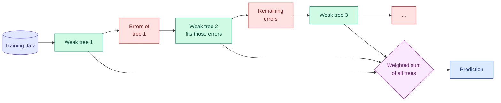

# Boosting: AdaBoost, Gradient Boosting, XGBoost, LightGBM and CatBoost

**Level:** 🔴 Advanced &nbsp;|&nbsp; **Effort:** Detailed module &nbsp;|&nbsp; **Module:** [05 Machine Learning](README.md)

---

## 🎯 Learning Objectives

By the end of this topic you will be able to:

- Explain how boosting differs from bagging: sequential error-correction instead of independent averaging
- Describe AdaBoost's re-weighting and gradient boosting's fitting of residuals — and why the second generalises the first
- Show the learning-rate and number-of-trees trade-off from a measured loss curve
- Use early stopping correctly, and recognise when it costs accuracy
- Compare XGBoost, LightGBM and CatBoost, and choose between them and scikit-learn's own implementation

## 📚 Prerequisites

- [Topic 5: Decision Trees and Random Forests](05-decision-trees-and-random-forests.md)
- [Gradient Descent](../02-mathematics-for-ai/05-gradient-descent-and-backpropagation.md) — gradient
  boosting is gradient descent in the space of functions

```bash
pip install -r requirements.txt      # scikit-learn==1.5.2, numpy==2.1.3
```

XGBoost, LightGBM and CatBoost are **not** installed by this repository's requirements; see section 6.

---

## 🍰 1. The simple version

A random forest asks two hundred people the same question independently, then averages.

**Boosting asks one person, looks at what they got wrong, and asks the next person to focus on exactly
those mistakes.** Then the next, and the next. Each helper is weak — often a tiny tree — but each one fixes
a little of what the team still gets wrong. Added together, they become very strong.

**Gradient-boosted trees are the most successful family of models on tabular data** — the kind of rows and
columns in most business systems. They are the default to beat for churn, fraud, pricing, ranking and risk.

## 🏠 2. Real-life analogy

> A student preparing for an exam takes a practice paper and marks it. The next study session focuses only on
> the questions they got wrong. Then another practice paper, another focused session. Each session is short
> and imperfect, but they compound.
>
> Study with too much intensity on the last paper's mistakes, and the student starts memorising that paper's
> quirks. That is a **learning rate** set too high.

**Where the analogy breaks down:** a student's corrections transfer to new questions through understanding.
A boosted model only corrects errors on the training data, so without a brake it will keep "improving" on
training examples long after it has stopped improving on new ones.

---

## ⚙️ 3. How boosting works



| | Bagging and random forests | Boosting |
| --- | --- | --- |
| Trees trained | Independently, in parallel | **Sequentially** — each depends on the previous |
| Each tree | Deep, low bias, high variance | Shallow, high bias, low variance |
| Combining | Average | Weighted sum |
| Main effect | Reduces **variance** | Reduces **bias** |
| More trees | Never overfits; only costs time | **Can overfit** — must be controlled |

### AdaBoost (Adaptive Boosting)

Freund and Schapire's AdaBoost keeps a **weight on every training example**. After each weak learner — often a
one-split tree called a *stump* — it increases the weights of misclassified examples, so the next learner
concentrates on them. Each learner's vote is weighted by its accuracy. AdaBoost is historically central, and
sensitive to label noise: mislabelled examples get ever larger weights.

### Gradient boosting

Friedman's gradient boosting generalises the idea to **any differentiable loss**. The model is a sum of trees:

$$
F_M(x) = F_0(x) + \eta \sum_{m=1}^{M} h_m(x)
$$

At round $m$, compute for each example the **negative gradient** of the loss with respect to the current
prediction — the direction that would reduce the loss most — and fit a small tree $h_m$ to those values:

$$
r_{im} = -\left.\frac{\partial L(y_i, F(x_i))}{\partial F(x_i)}\right|_{F = F_{m-1}}
$$

| Symbol | Means | Why it matters |
| --- | --- | --- |
| $F_0$ | Initial prediction, such as the mean or the log-odds of the base rate | Where boosting starts |
| $h_m$ | The $m$-th small tree | Fits the current errors |
| $r_{im}$ | Pseudo-residual for example $i$ at round $m$ | For squared error, exactly $y_i - F_{m-1}(x_i)$ — the plain residual |
| $\eta$ | **Learning rate** (shrinkage), typically 0.01–0.3 | Takes only part of each correction |
| $M$ | Number of trees | Too few underfits; too many overfits |

**In words:** this is gradient descent, but instead of updating numbers, each step adds a tree that points
downhill on the loss. With squared error, "downhill" is simply "towards the residuals".

---

## 💻 4. Code example — the learning rate and the number of trees

A synthetic classification problem: 2,000 rows, 10 features, and 5% of labels deliberately flipped so perfect
accuracy is impossible. We record **test log loss after every tree** for four learning rates.

```python
import numpy as np
from sklearn.datasets import make_classification
from sklearn.ensemble import GradientBoostingClassifier
from sklearn.metrics import log_loss
from sklearn.model_selection import train_test_split

X, y = make_classification(n_samples=2000, n_features=10, n_informative=6, n_redundant=2,
                           flip_y=0.05, class_sep=0.8, random_state=0)
X_train, X_test, y_train, y_test = train_test_split(X, y, test_size=0.3, random_state=0, stratify=y)

# Test log loss after every boosting round, for four learning rates.
curves = {}
for rate in [1.0, 0.3, 0.1, 0.02]:
    model = GradientBoostingClassifier(n_estimators=200, learning_rate=rate, max_depth=3, random_state=0)
    model.fit(X_train, y_train)
    curves[rate] = [log_loss(y_test, p) for p in model.staged_predict_proba(X_test)]

print("learning rate 0.1: test log loss by number of trees")
for rounds in [1, 10, 50, 100, 200]:
    print(f"  {rounds:>3} trees: {curves[0.1][rounds - 1]:.4f}")

print(f"\n{'learning rate':>13}{'best round':>12}{'best loss':>11}{'loss at 200':>13}")
for rate, losses in curves.items():
    print(f"{rate:>13}{int(np.argmin(losses)) + 1:>12}{min(losses):>11.4f}{losses[-1]:>13.4f}")
```

**Output:**
```
learning rate 0.1: test log loss by number of trees
    1 trees: 0.6537
   10 trees: 0.4671
   50 trees: 0.3327
  100 trees: 0.3063
  200 trees: 0.2854

learning rate  best round  best loss  loss at 200
          1.0           8     0.3319       0.7317
          0.3         143     0.2749       0.2805
          0.1         198     0.2848       0.2854
         0.02         200     0.3410       0.3410
```

**The first table is boosting working.** A single depth-3 tree gives a loss of 0.6537 — barely better than a
coin, whose log loss is 0.693. Each tree corrects some of what remains, and 200 trees reach 0.2854.

**The second table is the trade-off you will tune on every boosted model.**

- **Learning rate 1.0 reaches its best loss after just 8 trees — then gets far worse**, ending at 0.7317,
  *worse than a coin*. Each tree takes the full correction, so the model quickly starts fitting noise,
  including the 5% of flipped labels, and becomes confidently wrong.
- **0.3 is best here**: 0.2749 at round 143, and only slightly worse by round 200.
- **0.1 is still improving at round 198.** It has not finished; with more trees it would likely match or beat 0.3.
- **0.02 is nowhere near done** at 200 trees.

**Smaller learning rates need more trees, but generally reach a better and more stable optimum**, because
each step is cautious. The practical recipe: pick a smallish learning rate you can afford, and let
**early stopping** choose the number of trees.

---

## 💻 5. Code example — four ensembles and early stopping

```python
import time

from sklearn.datasets import make_classification
from sklearn.ensemble import (AdaBoostClassifier, GradientBoostingClassifier,
                              HistGradientBoostingClassifier, RandomForestClassifier)
from sklearn.model_selection import train_test_split

X, y = make_classification(n_samples=2000, n_features=10, n_informative=6, n_redundant=2,
                           flip_y=0.05, class_sep=0.8, random_state=0)
X_train, X_test, y_train, y_test = train_test_split(X, y, test_size=0.3, random_state=0, stratify=y)

print("test accuracy")
seconds = {}
for name, model in [
    ("AdaBoost, 200 stumps", AdaBoostClassifier(n_estimators=200, algorithm="SAMME", random_state=0)),
    ("random forest, 200", RandomForestClassifier(n_estimators=200, random_state=0)),
    ("gradient boosting, 200", GradientBoostingClassifier(n_estimators=200, random_state=0)),
    ("hist gradient boosting", HistGradientBoostingClassifier(random_state=0)),
]:
    start = time.perf_counter()
    model.fit(X_train, y_train)
    seconds[name] = time.perf_counter() - start
    print(f"  {name:<24} {model.score(X_test, y_test):.3f}")

# Timings vary by machine; the relationship between these two does not.
print(f"\nhistogram boosting trained faster than classic gradient boosting: "
      f"{seconds['hist gradient boosting'] < seconds['gradient boosting, 200']}")

early = HistGradientBoostingClassifier(max_iter=1000, early_stopping=True, validation_fraction=0.15,
                                       n_iter_no_change=20, random_state=0).fit(X_train, y_train)
print(f"early stopping: asked for up to 1000 rounds, stopped after {early.n_iter_}, "
      f"test accuracy {early.score(X_test, y_test):.3f}")
```

**Output:**
```
test accuracy
  AdaBoost, 200 stumps     0.848
  random forest, 200       0.903
  gradient boosting, 200   0.893
  hist gradient boosting   0.915

histogram boosting trained faster than classic gradient boosting: True
early stopping: asked for up to 1000 rounds, stopped after 62, test accuracy 0.893
```

**AdaBoost with stumps is clearly weakest**, at 0.848. One-split trees cannot capture interactions between
features, and the flipped labels attract ever-growing weights.

**Histogram gradient boosting is the most accurate and the fastest.** `HistGradientBoostingClassifier` first
buckets each feature into at most 255 bins, so finding a split means scanning bins instead of every sorted
value. This is the technique LightGBM popularised, and scikit-learn's documentation recommends it over
`GradientBoostingClassifier` for datasets beyond roughly ten thousand rows. It also handles missing values
natively and supports categorical features directly.

**The honest result is the last line.** Early stopping chose 62 rounds — and scored **0.893, below the
default model's 0.915**. It is not broken. To decide when to stop, it holds out 15% of the training data,
so the model trains on less, and on 1,400 rows a 210-row validation set is noisy enough to stop too early.
**Early stopping shines on large datasets and slow learning rates, where it saves many rounds**; on small
data, cross-validating the number of rounds is often better. Always compare against the model without it.

The random forest, at 0.903, is a reminder that a well-tuned boosted model usually edges out a forest on
tabular data — but not by much, and the forest had nothing to tune.

---

## 🧰 6. XGBoost, LightGBM and CatBoost

Three libraries dominate production gradient boosting. All implement the same core idea with engineering
that makes it fast and robust at scale.

| | XGBoost | LightGBM | CatBoost | scikit-learn `HistGradientBoosting*` |
| --- | --- | --- | --- | --- |
| **Origin** | Chen and Guestrin, 2016 | Microsoft, 2017 | Yandex, 2017 | scikit-learn, inspired by LightGBM |
| **Key ideas** | Regularised objective using second-order gradients; sparsity-aware splits | Histogram splits; **leaf-wise** growth; gradient-based sampling | **Ordered boosting** against target leakage; native categorical handling | Histogram splits; native missing values and categoricals |
| **Tree growth** | Level-wise by default | Leaf-wise — deeper and faster, can overfit small data | Symmetric (oblivious) trees | Leaf-wise |
| **Categorical features** | Supported in recent versions | Supported | **Strongest** — its design centre | Supported |
| **GPU training** | Yes | Yes | Yes | No |
| **Distributed training** | Yes — Spark, Dask and others | Yes | Yes | No |
| **Best when** | A mature, flexible default with a wide ecosystem | Very large datasets where training speed matters | Many high-cardinality categorical features | You want no extra dependency and data fits on one machine |

**Which to use?** For learning and for moderate data, scikit-learn's histogram implementation is enough and
adds no dependency. In production, choose by your data — many categoricals point to CatBoost, very large data
to LightGBM, broad tooling to XGBoost — and **benchmark on your own data**. The differences between them on a
given problem are usually smaller than the differences made by feature engineering and tuning.

### Reference code — not executed by this repository

<!-- check-examples: skip -->
```python
# REFERENCE ONLY. These libraries are not in requirements.txt and this block is not run by CI.
# Install and pin them yourself, then check each library's documentation for your installed version.
import xgboost as xgb
import lightgbm as lgb
from catboost import CatBoostClassifier

# X_train, y_train, X_valid, y_valid: your own training and validation splits.

xgb_model = xgb.XGBClassifier(n_estimators=2000, learning_rate=0.05, max_depth=6,
                              early_stopping_rounds=50)
xgb_model.fit(X_train, y_train, eval_set=[(X_valid, y_valid)], verbose=False)

lgb_model = lgb.LGBMClassifier(n_estimators=2000, learning_rate=0.05, num_leaves=31)
lgb_model.fit(X_train, y_train, eval_set=[(X_valid, y_valid)],
              callbacks=[lgb.early_stopping(stopping_rounds=50)])

cat_model = CatBoostClassifier(iterations=2000, learning_rate=0.05, depth=6, verbose=0)
cat_model.fit(X_train, y_train, eval_set=(X_valid, y_valid), early_stopping_rounds=50,
              cat_features=["plan", "region"])          # column names of categorical features
```

**Why this code is not executed:** adding three compiled dependencies for one topic would slow every learner's
install and CI run, and all three follow the scikit-learn estimator interface closely enough that the
executed examples above teach the same behaviour. The shape above reflects each library's documented
interface at the time of writing; **these APIs change between major versions**, so check the linked
documentation for the version you install.

---

## 🎛️ 7. The hyperparameters that matter

| Hyperparameter | scikit-learn name | Effect | Starting point |
| --- | --- | --- | --- |
| Learning rate | `learning_rate` | Smaller is steadier but needs more trees | 0.05–0.1 |
| Number of trees | `n_estimators` / `max_iter` | Too many overfits | Large, with early stopping |
| Tree size | `max_depth`, `max_leaf_nodes` | Controls interaction depth | Depth 3–8, or 31 leaves |
| Minimum samples per leaf | `min_samples_leaf` | Stops tiny noisy leaves | 20 or more on large data |
| Row subsampling | `subsample` | Adds randomness, reduces overfitting — "stochastic gradient boosting" | 0.7–0.9 |
| Feature subsampling | `max_features` | Decorrelates trees, like a forest | 0.7–1.0 |
| L2 regularisation | `l2_regularization` | Shrinks leaf values | Tune if overfitting |

Tune with cross-validation or a held-out validation set — never on the test set. Search strategies are in
[07 Model Evaluation](../07-model-evaluation/README.md).

## 🌍 8. Real-world use

| Industry | Task | Why boosting |
| --- | --- | --- |
| Payments | Real-time fraud scoring | High accuracy on tabular transaction features; fast prediction |
| Search and advertising | Learning to rank, click-through prediction | Ranking objectives supported directly; handles huge feature sets |
| Insurance and lending | Risk and pricing models | Captures non-linear effects; monotonic constraints can enforce "higher income never raises risk" |
| Retail and logistics | Demand forecasting with calendar and promotion features | Interactions between many heterogeneous signals |
| Data-science competitions | Tabular competitions | Gradient-boosted trees have been the dominant winning approach for tabular data |

## 💰 9. Cost note

Boosting's sequential training cannot be parallelised across trees, only within building each tree, so it
costs more time than a forest of the same size. Histogram methods, GPU training and early stopping cut this
sharply. Prediction cost grows with the number and depth of trees — relevant for low-latency serving.
Distributed training on cloud clusters is billed by instance time; use the provider's calculator, since prices
change.

---

## ⚠️ 10. Common mistakes

| Mistake | Why it happens | Fix |
| --- | --- | --- |
| Large learning rate with many trees | Defaults copied between projects | Rate 1.0 ended worse than a coin; lower it and use early stopping |
| Tuning the number of trees on the test set | Convenient | Validation set, early stopping or cross-validation |
| Assuming early stopping always helps | It sounds free | It cost 2 points on small data here; compare |
| Classic `GradientBoostingClassifier` on large data | Familiar name | Use `HistGradientBoosting*` or a dedicated library |
| Target-encoding categoricals before boosting without folds | Leakage is invisible | Use native categorical support or out-of-fold encoding ([Encoding and Validation](../03-data-foundations/04-encoding-and-data-validation.md)) |
| Treating library choice as the main lever | Benchmarks online | Features and tuning usually matter more |

## 🔐 11. Security note

- **Boosting amplifies noisy and poisoned labels.** Every round focuses on examples the model gets wrong —
  including deliberately mislabelled ones an attacker inserted. Validate label sources and monitor for sudden
  changes in hard-example patterns.
- **Model files from these libraries can be loaded from untrusted sources.** Prefer each library's own model
  format over pickle, and verify provenance before loading any model file.
- **Monotonic constraints are a safety tool**: where a relationship must never invert — more collateral must
  never increase credit risk — enforce it rather than hoping the model learns it.

---

## 🎤 12. Interview questions

<details>
<summary><b>Q1: What is the difference between bagging and boosting?</b></summary>

Bagging trains many models independently on bootstrap samples and averages them; it mainly reduces variance,
so it pairs with deep, high-variance trees and more models never overfit. Boosting trains models sequentially,
each correcting the errors of the ensemble so far; it mainly reduces bias, so it uses shallow trees, and too
many rounds or too high a learning rate do overfit. Boosting usually reaches higher accuracy on tabular data
but needs more tuning and cannot parallelise across trees.
</details>

<details>
<summary><b>Q2: Explain gradient boosting in terms of gradient descent.</b></summary>

The model is a sum of functions. At each round we compute the negative gradient of the loss with respect to
each training example's current prediction — for squared error that is simply the residual — and fit a small
tree to approximate it. Adding that tree, scaled by the learning rate, moves the predictions a step downhill
on the loss. So it is gradient descent where the parameters being updated are the function's predictions and
each step is a tree. Any differentiable loss works, which is why the same machinery handles regression,
classification and ranking.
</details>

<details>
<summary><b>Q3: How do learning rate and number of trees interact?</b></summary>

They trade off: a smaller learning rate takes a smaller step per tree, so more trees are needed to reach the
same loss, but the path is steadier and usually reaches a better optimum. A large rate reaches its best quickly
then overfits — in the example, rate 1.0 peaked at 8 trees and ended worse than guessing. The practical
approach is to fix a modest learning rate, set a large maximum number of trees, and choose the number with
early stopping or cross-validation.
</details>

<details>
<summary><b>Q4 (scenario): You must choose between XGBoost, LightGBM and CatBoost for a new fraud model. How do you decide?</b></summary>

Start from data and constraints. Many high-cardinality categorical features — merchant, device, country —
favour CatBoost's native handling. Very large training data and tight retraining windows favour LightGBM's
speed. An existing Spark or Dask platform, or team familiarity, may favour XGBoost's ecosystem. Then benchmark
all candidates, including scikit-learn's histogram implementation, on a time-based split of our own data with
the metric that reflects fraud cost, and compare training time, prediction latency and model size. I would
expect feature engineering and threshold choice to matter more than the library, so I would not spend long on
the choice.
</details>

---

## ✅ Key takeaways

- **Boosting builds trees sequentially, each correcting the ensemble's remaining errors**; it reduces bias.
- **Gradient boosting is gradient descent where each step is a tree** fitted to the negative gradient.
- **Learning rate and tree count trade off**: rate 1.0 peaked at 8 trees then ended worse than a coin.
- **Histogram boosting** was the most accurate and fastest here, and is scikit-learn's recommended implementation.
- **Early stopping is not free**: on small data it cost two points of accuracy. Compare, do not assume.
- XGBoost, LightGBM and CatBoost differ in engineering; **benchmark on your data**, and expect features to matter more.

---

## 📚 Official References

- [scikit-learn: Ensembles, including gradient boosting and histogram-based gradient boosting — scikit-learn developers](https://scikit-learn.org/stable/modules/ensemble.html) — verified 2026-09-14
- [Greedy Function Approximation: A Gradient Boosting Machine — Friedman, The Annals of Statistics (DOI)](https://doi.org/10.1214/aos/1013203451) — verified 2026-09-14
- [XGBoost documentation — XGBoost developers](https://xgboost.readthedocs.io/en/stable/) — verified 2026-09-14 (API changes between major versions)
- [LightGBM documentation — Microsoft](https://lightgbm.readthedocs.io/en/stable/) — verified 2026-09-14 (API changes between major versions)
- [CatBoost documentation — Yandex](https://catboost.ai/docs/en/) — verified 2026-09-14 (API changes between major versions)
- [The Elements of Statistical Learning, book site — Hastie, Tibshirani and Friedman](https://hastie.su.domains/ElemStatLearn/) — verified 2026-09-14

---

## 🔗 Navigation

[← Topic 5: Decision Trees and Random Forests](05-decision-trees-and-random-forests.md) &nbsp;|&nbsp;
[🏠 Module Home](README.md) &nbsp;|&nbsp;
[Topic 7: Clustering →](07-clustering.md)
