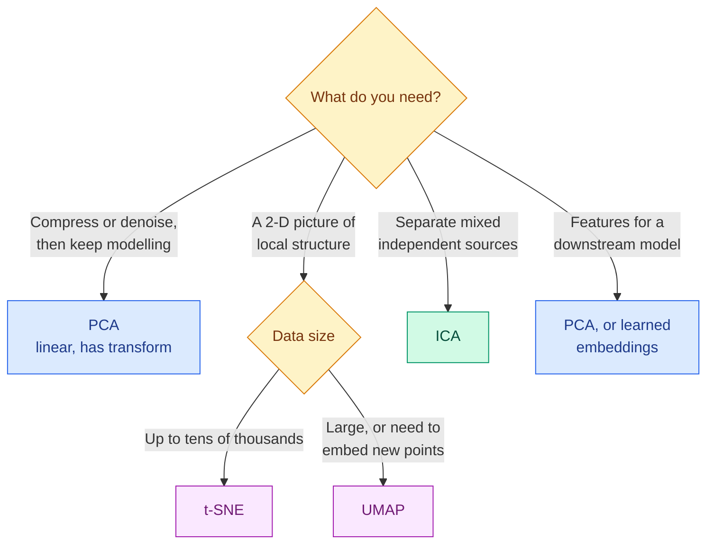

# Dimensionality Reduction: PCA, t-SNE, UMAP and ICA

**Level:** 🔴 Advanced &nbsp;|&nbsp; **Effort:** Short module &nbsp;|&nbsp; **Module:** [05 Machine Learning](README.md)

---

## 🎯 Learning Objectives

By the end of this topic you will be able to:

- Explain the difference between linear projection and non-linear embedding methods
- Show, with a measurement, why t-SNE preserves local neighbourhoods that PCA loses
- Explain what t-SNE plots do **not** show — cluster sizes and distances between clusters — and demonstrate it
- Compare t-SNE and UMAP, and know when neither is appropriate
- Use Independent Component Analysis to separate mixed signals, and explain why PCA cannot

## 📚 Prerequisites

- **[Norms, Eigenvalues and PCA](../02-mathematics-for-ai/03-norms-eigenvalues-and-pca.md) — PCA is taught
  from scratch there.** This topic does not repeat it; it places PCA among its alternatives.
- [Topic 2: Parametric and Instance-Based Models](02-parametric-and-instance-based-models.md) — the curse of dimensionality
- [Topic 7: Clustering](07-clustering.md)

```bash
pip install -r requirements.txt      # scikit-learn==1.5.2, numpy==2.1.3
```

UMAP is not installed by this repository's requirements; see section 5.

---

## 🍰 1. The simple version

A photo of a digit is 64 numbers. A customer might be 300. A text embedding, 1,024. Nobody can look at
that many dimensions, and many algorithms get slower and less reliable as dimensions grow.

**Dimensionality reduction squeezes many numbers into few, keeping what matters.** The methods differ in
what they decide "what matters" means:

| Method | Keeps | Typical use |
| --- | --- | --- |
| **PCA** — Principal Component Analysis | The directions of greatest variance, linearly | Compression, denoising, a preprocessing step |
| **t-SNE** — t-distributed Stochastic Neighbour Embedding | Who is close to whom, non-linearly | **2-D visualisation** |
| **UMAP** — Uniform Manifold Approximation and Projection | Local neighbourhoods, and some global layout, non-linearly | Visualisation and general embeddings |
| **ICA** — Independent Component Analysis | Statistically independent source signals | Separating mixed signals |

## 🏠 2. Real-life analogy

> **PCA** is a shadow puppet: shine a light from the best angle, and the shadow on the wall keeps as much of
> the shape as a flat image can. Every shadow is a straight projection.
>
> **t-SNE** is a seating plan for a wedding: guests who know each other sit at the same table. The plan is
> excellent at keeping friends together — but the distance between two tables tells you nothing about how
> the two groups relate, and the size of a table depends on how the planner arranged the room.
>
> **ICA** is picking out one conversation at a noisy party. Several people talk at once; your ears receive
> a mixture; you separate the voices because each voice is independent of the others.

**Where the analogies break down:** a seating planner knows the guests; t-SNE only knows distances in the
original data, so if those distances are meaningless — unscaled or irrelevant features — the plan is too.

---

## ⚙️ 3. Linear versus non-linear



**PCA** finds orthogonal directions of maximum variance and projects onto the top few. It is linear, fast,
deterministic, and has `transform()`, so new data can be projected with the same mapping.

**t-SNE** (van der Maaten and Hinton, 2008) converts distances in the original space into probabilities that
two points are neighbours, then searches for a low-dimensional layout whose neighbour probabilities match. It
uses a heavy-tailed Student-t distribution in the low-dimensional space, which lets moderately distant points
spread apart and produces the well-separated islands it is known for.

The key hyperparameter is **perplexity** — loosely, how many neighbours each point considers, typically
5–50. t-SNE optimises a non-convex objective, so results vary with the random seed, and it has **no
`transform()` for new points**.

---

## 💻 4. Code example — what PCA and t-SNE keep

The digits dataset again: 8×8 images, 64 pixel values each. We reduce 800 images to 2 dimensions and measure
how often a point's 5 nearest neighbours in 2-D share its label — a direct measure of **local structure kept**.

```python
"""PCA versus t-SNE for visualisation, and what t-SNE distances do not mean."""

import numpy as np
from sklearn.datasets import load_digits
from sklearn.decomposition import PCA
from sklearn.manifold import TSNE
from sklearn.model_selection import cross_val_score
from sklearn.neighbors import KNeighborsClassifier

digits = load_digits()
X, y = digits.data[:800], digits.target[:800]


def neighbour_accuracy(embedding):
    """How well do 2-D neighbours share a label? A proxy for local structure kept."""
    return cross_val_score(KNeighborsClassifier(n_neighbors=5), embedding, y, cv=5).mean()


pca_2d = PCA(n_components=2, random_state=0).fit_transform(X)
print(f"64 pixels -> 2 dimensions, 5-NN accuracy in the embedding")
print(f"  original 64 dimensions:  {neighbour_accuracy(X):.2f}")
print(f"  PCA 2-D:                 {neighbour_accuracy(pca_2d):.2f}")
for perplexity in [5, 30, 100]:
    tsne_2d = TSNE(n_components=2, perplexity=perplexity, init="random", random_state=0).fit_transform(X)
    centres = np.array([tsne_2d[y == d].mean(axis=0) for d in range(10)])
    spread = np.linalg.norm(centres[:, None] - centres[None], axis=-1)
    print(f"  t-SNE 2-D, perplexity {perplexity:<3}: {neighbour_accuracy(tsne_2d):.2f}   "
          f"distance between digit-0 and digit-1 centres: {spread[0, 1]:.0f}")

print(f"\nPCA 2-D keeps {PCA(n_components=2).fit(X).explained_variance_ratio_.sum():.0%} of the variance; "
      f"t-SNE has no transform() for new points: {not hasattr(TSNE(), 'transform')}")
```

**Output:**
```
64 pixels -> 2 dimensions, 5-NN accuracy in the embedding
  original 64 dimensions:  0.93
  PCA 2-D:                 0.51
  t-SNE 2-D, perplexity 5  : 0.94   distance between digit-0 and digit-1 centres: 99
  t-SNE 2-D, perplexity 30 : 0.93   distance between digit-0 and digit-1 centres: 56
  t-SNE 2-D, perplexity 100: 0.92   distance between digit-0 and digit-1 centres: 20

PCA 2-D keeps 28% of the variance; t-SNE has no transform() for new points: True
```

**PCA's two directions keep only 28% of the variance, and neighbours in that 2-D picture share a label only
51% of the time.** Most of what distinguishes one digit from another lives in directions PCA discarded. A PCA
scatter plot of digits looks like overlapping smudges — not because the digits are inseparable, but because
two straight projections cannot show it.

**t-SNE keeps local structure almost perfectly**: 0.92–0.94, matching the original 64 dimensions. In a plot,
you would see ten distinct islands.

**Now the right-hand column — the lesson that most t-SNE plots get wrong.** Same data, same digits, and the
distance between the digit-0 island and the digit-1 island is **99, 56 or 20** depending only on perplexity.
Local neighbourhoods barely changed. **Distances between clusters in a t-SNE plot are not meaningful**, and
neither are cluster sizes or densities: t-SNE expands dense clusters and contracts sparse ones. Never conclude
"these two groups are far apart" or "this group is more spread out" from a t-SNE plot.

**And t-SNE cannot place new points.** It optimises positions for the specific points it was given. For a
reusable mapping, use PCA, UMAP, or a learned embedding.

---

## 🗺️ 5. UMAP

UMAP (McInnes, Healy and Melville, 2018) builds a weighted nearest-neighbour graph in the original space and
optimises a low-dimensional layout with similar graph structure. Compared with t-SNE:

| | t-SNE | UMAP |
| --- | --- | --- |
| Speed on large data | Slower | Usually much faster |
| Global layout | Largely unreliable | Somewhat better preserved — **still not reliable for distances** |
| Embedding new points | No | Yes, `transform()` |
| Output dimensions | Typically 2 or 3 | Any — useful as features |
| Key hyperparameters | Perplexity | `n_neighbors`, `min_dist` |
| In scikit-learn | Yes | No — separate `umap-learn` package |

<!-- check-examples: skip -->
```python
# REFERENCE ONLY. umap-learn is not in requirements.txt and this block is not run by CI.
# Install and pin it yourself, and check the documentation for your installed version.
import umap

reducer = umap.UMAP(n_neighbors=15, min_dist=0.1, n_components=2, random_state=0)
embedding = reducer.fit_transform(X_train)        # X_train: your scaled feature matrix
new_embedding = reducer.transform(X_new)          # unlike t-SNE, new points can be embedded
```

**This block is not executed** because UMAP brings compiled dependencies that would slow every install for one
example; the t-SNE example above demonstrates the same lessons about local structure and misleading global
distances. **The same warnings apply to UMAP plots**: cluster sizes and gaps are shaped by hyperparameters.

---

## 🎧 6. ICA — separating mixed signals

PCA finds directions that are **uncorrelated** and ordered by variance. ICA finds directions that are
**statistically independent** — a much stronger condition — which is exactly what is needed when several
independent sources have been mixed together.

**The model:** observed signals $x$ are an unknown linear mixture of independent sources $s$:

$$
x = A s \qquad\Rightarrow\qquad \hat{s} = W x, \quad W \approx A^{-1}
$$

ICA estimates $W$ by making the recovered components as **non-Gaussian** as possible. That works because, by
the central limit theorem, a mixture of independent signals is more Gaussian than the signals themselves.
Consequence: ICA cannot separate sources that are themselves Gaussian, and recovers sources only up to scale,
sign and order.

```python
import numpy as np
from sklearn.decomposition import PCA, FastICA
from sklearn.preprocessing import StandardScaler

t = np.linspace(0, 8, 2000)
sources = np.column_stack([np.sign(np.sin(3 * t)), np.sin(5 * t) ** 3])   # a square wave and a spiky wave
mixing = np.array([[1.0, 0.6], [0.5, 1.0]])
microphones = sources @ mixing.T                                         # each microphone hears both


def best_match(recovered):
    corr = np.abs(np.corrcoef(sources.T, recovered.T)[:2, 2:])
    return corr.max(axis=1)


ica = FastICA(n_components=2, whiten="unit-variance", random_state=0).fit_transform(microphones)
pca = PCA(n_components=2).fit_transform(StandardScaler().fit_transform(microphones))
print(f"recovering two mixed signals, best |correlation| with each true source (1.00 = perfect)")
print(f"  microphones as recorded: {best_match(microphones).round(2).tolist()}")
print(f"  PCA components:          {best_match(pca).round(2).tolist()}")
print(f"  ICA components:          {best_match(ica).round(2).tolist()}")
```

**Output:**
```
recovering two mixed signals, best |correlation| with each true source (1.00 = perfect)
  microphones as recorded: [0.94, 0.72]
  PCA components:          [0.82, 0.86]
  ICA components:          [1.0, 0.99]
```

**ICA recovers both sources almost exactly** — correlations of 1.0 and 0.99 — from nothing but the two mixed
recordings. **PCA does worse than simply listening to the first microphone** for the square wave: it finds
uncorrelated directions of maximum variance, which are not the directions in which the sources were mixed.
The absolute value in `best_match` is there because ICA may return a source flipped in sign.

**Real uses:** separating brain-signal sources from eye-blink artefacts in electroencephalography (EEG),
separating audio sources, and removing interference from sensor arrays.

---

## 🌍 7. Real-world use

| Use | Method | Note |
| --- | --- | --- |
| Visualising embeddings from a model to debug it | t-SNE or UMAP | Look for mislabelled points inside the wrong island; do not read distances |
| Compressing features before a model | PCA | Reversible, fast, applies to new data |
| Speeding up nearest-neighbour search | PCA to fewer dimensions | Measure recall loss — see the lab in [Norms, Eigenvalues and PCA](../02-mathematics-for-ai/03-norms-eigenvalues-and-pca.md) |
| Single-cell biology | UMAP plots of gene expression | Standard exploratory tool; interpretation still needs experiments |
| EEG and audio | ICA | Artefact and source separation |
| Clustering high-dimensional data | PCA or UMAP, then clustering | Clustering on t-SNE output is risky, since its distances are distorted |

## ⚖️ 8. Trade-offs

| Method | Linear | Deterministic | New points | Preserves | Scales |
| --- | --- | --- | --- | --- | --- |
| PCA | Yes | Yes | Yes | Global variance | Very well |
| t-SNE | No | No — seed-dependent | No | Local neighbourhoods | Moderate |
| UMAP | No | Only with a fixed seed, and slower | Yes | Local, some global | Well |
| ICA | Yes | Up to sign and order | Yes | Independent sources | Well |

---

## ⚠️ 9. Common mistakes

| Mistake | Why it happens | Fix |
| --- | --- | --- |
| Reading distances between t-SNE clusters | The plot looks like a map | The digit-0 to digit-1 gap was 99, 56 or 20 by perplexity alone |
| Reading cluster size or density from t-SNE | Visual intuition | t-SNE equalises densities |
| Using t-SNE output as model features | It looks well separated | No `transform()` for new data; use PCA, UMAP or learned embeddings |
| Judging separability from a PCA plot | Two components look like "the data" | PCA 2-D kept 28% of variance; neighbours dropped to 51% |
| One t-SNE run with default settings | It is slow | Try several perplexities and seeds; trust only what persists |
| Dimensionality reduction on unscaled features | Forgot units | Scale first, unless features share units — as pixels do |
| Fitting PCA on all data before the split | Convenient | Fit inside a pipeline on training data |

## 🔐 10. Security and privacy note

- **Visualisations leak.** A 2-D plot of customer or patient embeddings, shared in a slide deck, can reveal
  group membership and outliers that identify individuals. Apply the same data-handling rules to plots as to
  the data.
- **Reduced data is not anonymised.** PCA is invertible up to the discarded components, and neighbourhood
  embeddings keep individuals' relative positions.
- **Embedding plots can be steered**: an attacker who can insert data points can create or merge visual
  clusters. Do not make decisions from a picture alone.

---

## 🎤 11. Interview questions

<details>
<summary><b>Q1: What is the difference between PCA and t-SNE?</b></summary>

PCA is a linear projection onto the directions of maximum variance. It is deterministic, fast, has a
reusable `transform()` for new data, and preserves global structure, so it suits compression and
preprocessing. t-SNE is a non-linear embedding that preserves local neighbourhoods by matching neighbour
probabilities between the original and low-dimensional spaces. It is excellent for visualising cluster
structure, but it is stochastic, slower, has no transform for new points, and distances between clusters and
cluster sizes in its output are not meaningful. In the example, PCA 2-D kept neighbour agreement at 51% while
t-SNE kept 93%, yet t-SNE's inter-cluster distance changed from 99 to 20 with perplexity alone.
</details>

<details>
<summary><b>Q2: A colleague shows a t-SNE plot and says cluster A is "much closer" to B than to C, so A and B are similar. How do you respond?</b></summary>

t-SNE preserves which points are neighbours, not distances between groups; the gaps depend heavily on
perplexity, initialisation and random seed, and it rescales densities so cluster sizes are also unreliable.
To test the claim, measure distances between cluster centroids or linkage in the original space, check whether
the relationship persists across several perplexities and seeds, or use a method that better preserves global
structure — while still validating in the original space.
</details>

<details>
<summary><b>Q3: When would you use ICA instead of PCA?</b></summary>

When the observed data is a linear mixture of statistically independent, non-Gaussian sources that you want to
recover — separating audio sources, removing eye-blink artefacts from EEG, or unmixing sensor interference.
PCA only decorrelates and orders by variance, which does not correspond to the mixing directions; in the
example PCA recovered the sources with correlations around 0.8 while ICA reached 0.99. ICA cannot separate
Gaussian sources and returns components in arbitrary order, scale and sign.
</details>

---

## ✅ Key takeaways

- **PCA** is linear, fast and reusable; in 2-D it kept 28% of variance and only 51% neighbour agreement on digits.
- **t-SNE** keeps local neighbourhoods (0.92–0.94) and is for **visualisation only**.
- **Distances between t-SNE clusters mean nothing**: 99, 56 or 20 depending on perplexity.
- t-SNE has **no `transform()`**; UMAP does, is faster, and shares the same interpretation warnings.
- **ICA separates independent mixed sources** — 1.0 and 0.99 — where PCA cannot.
- Dimensionality reduction does not anonymise, and plots of personal data are personal data.

---

## 📚 Official References

- [scikit-learn: Manifold learning, including t-SNE — scikit-learn developers](https://scikit-learn.org/stable/modules/manifold.html) — verified 2026-09-14
- [scikit-learn: Decomposing signals in components, including PCA and ICA — scikit-learn developers](https://scikit-learn.org/stable/modules/decomposition.html) — verified 2026-09-14
- [Visualizing Data using t-SNE — van der Maaten and Hinton, Journal of Machine Learning Research](https://www.jmlr.org/papers/v9/vandermaaten08a.html) — verified 2026-09-14
- [UMAP documentation — umap-learn developers](https://umap-learn.readthedocs.io/en/latest/) — verified 2026-09-14 (API changes between versions)

## 📖 Additional learning resources

- [How to Use t-SNE Effectively — Wattenberg, Viégas and Johnson, Distill](https://distill.pub/2016/misread-tsne/) — verified 2026-09-14 (interactive article)

---

## 🔗 Navigation

[← Topic 7: Clustering](07-clustering.md) &nbsp;|&nbsp;
[🏠 Module Home](README.md) &nbsp;|&nbsp;
[Topic 9: Anomaly Detection and Association Rules →](09-anomaly-detection-and-association-rules.md)
