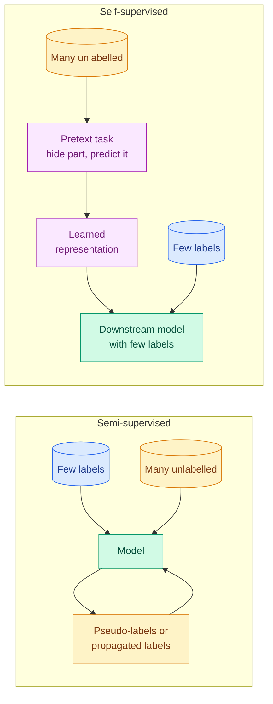

# Semi-Supervised and Self-Supervised Learning

**Level:** 🔴 Advanced &nbsp;|&nbsp; **Effort:** Short module &nbsp;|&nbsp; **Module:** [05 Machine Learning](README.md)

---

## 🎯 Learning Objectives

By the end of this topic you will be able to:

- Explain why unlabelled data can help a model, and the assumptions that must hold for it to help
- Apply self-training with pseudo-labels, and demonstrate how it can make a model **worse**
- Apply label spreading, and explain why it used unlabelled data far more effectively here
- Explain self-supervised learning through pretext tasks: masked prediction and contrastive learning
- Show that a pretext task only helps if it teaches something the downstream model could not compute itself
- Connect these ideas to how foundation models are pretrained

## 📚 Prerequisites

- [Topic 1: Types of Learning](01-types-of-learning.md)
- [Topic 4: Classification](04-classification.md) and [Topic 7: Clustering](07-clustering.md)
- [Collection, Ingestion and Labelling](../03-data-foundations/02-collection-ingestion-and-labelling.md) — why labels are expensive

```bash
pip install -r requirements.txt      # scikit-learn==1.5.2, numpy==2.1.3
```

---

## 🍰 1. The simple version

Labels are expensive. Unlabelled data is often nearly free — millions of images, documents or transactions
that nobody has annotated.

- **Semi-supervised learning** uses **a few labels plus lots of unlabelled data** for the same task. "Here are
  30 labelled digits and 1,227 unlabelled ones; learn to classify digits."
- **Self-supervised learning** uses **no human labels at all** at first. It invents a task whose answer is
  hidden in the data itself — "predict the missing word", "predict the hidden half of the image" — and learns
  useful representations by solving it. Those representations are then used for the real task with few labels.

**Self-supervised learning is how large language models are pretrained**: predicting the next token of text
needs no annotator.

## 🏠 2. Real-life analogy

> **Semi-supervised:** a teacher marks ten of your practice answers. You use those to mark the rest of your own
> homework, then study from all of it. If your self-marking is good, you learn a lot more. If you confidently
> mark wrong answers as right, you learn the wrong things — and more firmly than before.
>
> **Self-supervised:** before any lesson, you read thousands of books, covering words with your thumb and
> guessing them. Nobody teaches you grammar, yet you pick up a great deal of it. Then a short course on
> writing essays goes much faster.

**Where the analogies break down:** people check themselves against common sense. A model has none: nothing
stops it confidently turning its own mistakes into training data.

---

## ⚙️ 3. When can unlabelled data help at all?

Unlabelled data carries information about $P(x)$ — where the data lies — but nothing directly about $P(y \mid x)$.
It helps only if the shape of the data says something about the labels. The standard assumptions:

| Assumption | Statement | Holds for digits? |
| --- | --- | --- |
| **Smoothness** | Points close together tend to share a label | Mostly — similar images are usually the same digit |
| **Cluster** | Data forms clusters, and a cluster tends to share a label | Largely |
| **Low-density separation** | The decision boundary should pass through sparse regions | Largely |
| **Manifold** | High-dimensional data lies near a lower-dimensional surface | Yes |

**If these do not hold — classes overlap heavily in feature space — unlabelled data cannot help, and methods
that assume it will can hurt.**



---

## 🔁 4. Semi-supervised methods

### Self-training (pseudo-labelling)

1. Train a model on the labelled examples.
2. Predict the unlabelled examples.
3. Add the predictions made **above a confidence threshold** to the training set as if they were true labels.
4. Retrain, and repeat until nothing new is added.

It works with any classifier that produces probabilities. Its danger is **confirmation bias**: wrong pseudo-labels
become training data, making the model more confident in its mistakes.

### Label spreading and label propagation

Build a **similarity graph** over all points — labelled and unlabelled — for instance connecting each point to its
nearest neighbours. Labels then flow along the edges: each point repeatedly takes on a weighted blend of its
neighbours' labels, while labelled points are anchored to their known values. The result is a label for every
point that respects the geometry of the data — the smoothness and cluster assumptions, built in directly.

## 💻 5. Code example — 30 labels and 1,227 unlabelled digits

Three labelled examples per digit; all other training labels are hidden. The test set is untouched.

```python
"""Learning from 30 labels and 1,227 unlabelled images: self-training and label spreading."""

import numpy as np
from sklearn.datasets import load_digits
from sklearn.linear_model import LogisticRegression
from sklearn.model_selection import train_test_split
from sklearn.semi_supervised import LabelSpreading, SelfTrainingClassifier

X, y = load_digits(return_X_y=True)
X = X / 16.0
X_pool, X_test, y_pool, y_test = train_test_split(X, y, test_size=0.3, random_state=0, stratify=y)

rng = np.random.default_rng(0)
labelled = np.concatenate([rng.choice(np.flatnonzero(y_pool == d), size=3, replace=False) for d in range(10)])
y_partial = np.full(len(y_pool), -1)            # -1 means "no label" to scikit-learn
y_partial[labelled] = y_pool[labelled]
print(f"{len(X_pool)} training images, of which {len(labelled)} are labelled (3 per digit)")

supervised_small = LogisticRegression(max_iter=2000).fit(X_pool[labelled], y_pool[labelled])
print(f"  supervised, 30 labels only:        {supervised_small.score(X_test, y_test):.3f}")

for threshold in [0.99, 0.7, 0.3]:
    self_training = SelfTrainingClassifier(LogisticRegression(max_iter=2000), threshold=threshold)
    self_training.fit(X_pool, y_partial)
    added = self_training.labeled_iter_ > 0
    wrong = int((self_training.transduction_[added] != y_pool[added]).sum())
    print(f"  self-training, threshold {threshold:<4}:     {self_training.score(X_test, y_test):.3f}   "
          f"pseudo-labels added {int(added.sum())}, of which wrong {wrong}")

spreading = LabelSpreading(kernel="knn", n_neighbors=10).fit(X_pool, y_partial)
print(f"  label spreading, 10-NN graph:      {spreading.score(X_test, y_test):.3f}")

supervised_full = LogisticRegression(max_iter=2000).fit(X_pool, y_pool)
print(f"  supervised, all {len(X_pool)} labels:      {supervised_full.score(X_test, y_test):.3f}")
```

**Output:**
```
1257 training images, of which 30 are labelled (3 per digit)
  supervised, 30 labels only:        0.781
  self-training, threshold 0.99:     0.781   pseudo-labels added 0, of which wrong 0
  self-training, threshold 0.7 :     0.561   pseudo-labels added 1063, of which wrong 410
  self-training, threshold 0.3 :     0.833   pseudo-labels added 1226, of which wrong 225
  label spreading, 10-NN graph:      0.922
  supervised, all 1257 labels:      0.970
```

**The two bookends:** 30 labels give 78.1%; all 1,257 labels give 97.0%. Everything in between is a claim about
how much of that gap unlabelled data can close.

**Self-training is fragile, and one row shows it hurting badly.**

- **At threshold 0.99, nothing happened.** A model trained on 30 examples is never 99% sure, so no pseudo-labels
  were added. Too strict a threshold is simply supervised learning.
- **At threshold 0.7, accuracy fell from 78.1% to 56.1%** — far worse than ignoring the unlabelled data. It added
  1,063 pseudo-labels, and **410 of them — 39% — were wrong**. The model then trained on its own mistakes as if
  they were facts.
- **At threshold 0.3 it improved to 83.3%**, with 225 wrong labels out of 1,226.

**Do not conclude that lower thresholds are better.** The relationship between threshold and result is not
monotonic here, and would change with a different labelled sample, model or dataset. The only safe conclusion is
the practical one: **self-training must be validated on held-out labelled data, every time, against the
supervised baseline** — it can silently destroy a model.

**Label spreading closed most of the gap: 92.2%** from the same 30 labels. Digits satisfy the smoothness and
cluster assumptions well — images of the same digit are near each other — and label spreading uses that structure
directly, instead of trusting one weak model's confidence.

---

## 🧩 6. Self-supervised learning

### Pretext tasks

A **pretext task** is a problem constructed from unlabelled data so that its answer is known automatically. The
model is not really wanted for the pretext task; it is wanted for the **representation** it has to learn to solve
it.

| Family | Pretext task | Well-known examples |
| --- | --- | --- |
| **Masked prediction** | Hide part of the input; predict it | BERT masks words; masked autoencoders hide image patches |
| **Next-token prediction** | Predict the next element of a sequence | GPT-style language models |
| **Contrastive learning** | Pull two augmented views of the same example together; push different examples apart | SimCLR for images; CLIP pairs images with their captions |
| **Other pretext tasks** | Predict rotation, colourise greyscale, order shuffled patches | Earlier computer-vision work |

### 📐 Contrastive learning, briefly

Take an example, create two augmented views — crops, colour changes — and encode both. The **InfoNCE** loss rewards
the model when a view's embedding is more similar to its partner than to the other examples in the batch:

$$
\mathcal{L}_i = -\log \frac{\exp(\text{sim}(z_i, z_i^{+}) / \tau)}{\sum_{k} \exp(\text{sim}(z_i, z_k) / \tau)}
$$

| Symbol | Means |
| --- | --- |
| $z_i, z_i^{+}$ | Embeddings of two views of the same example — the positive pair |
| $z_k$ | Embeddings of every example in the batch, including the positive |
| $\text{sim}$ | Usually cosine similarity ([Norms and Distances](../02-mathematics-for-ai/03-norms-eigenvalues-and-pca.md)) |
| $\tau$ | Temperature, controlling how sharply similarities are compared |

**What the model learns is decided by the augmentations.** If colour changes are treated as "the same example", the
representation learns to ignore colour. Deep contrastive models are built in
[08 Deep Learning](../08-deep-learning/README.md) and [15 Embeddings and Vector Search](../15-embeddings-and-vector-search/README.md).

## 💻 7. Code example — a masked-prediction pretext task, and when it helps

The downstream task: classify digits seeing **only the top half of each image**, with the same 30 labels. The
pretext task: using all 1,257 training images **without labels**, learn to predict the hidden bottom half from the
top half. Then give the classifier the top half **plus** the pretext model's guess at the bottom half.

```python
"""A self-supervised pretext task: predict the hidden bottom half of a digit from its top half."""

import numpy as np
from sklearn.datasets import load_digits
from sklearn.linear_model import LogisticRegression, Ridge
from sklearn.model_selection import train_test_split
from sklearn.neighbors import KNeighborsRegressor

X, y = load_digits(return_X_y=True)
X = X / 16.0
X_pool, X_test, y_pool, y_test = train_test_split(X, y, test_size=0.3, random_state=0, stratify=y)
rng = np.random.default_rng(0)
labelled = np.concatenate([rng.choice(np.flatnonzero(y_pool == d), size=3, replace=False) for d in range(10)])

# Downstream task: classify digits seeing only the TOP half, with just 30 labels.
top_only = LogisticRegression(max_iter=2000).fit(X_pool[labelled, :32], y_pool[labelled])
print(f"30 labels, top-half pixels only:            {top_only.score(X_test[:, :32], y_test):.3f}\n")

top, bottom = X_pool[:, :32], X_pool[:, 32:]    # pretext training uses all 1,257 images and no labels
for name, pretext in [("linear (ridge)", Ridge(alpha=1.0)), ("non-linear (10-NN)", KNeighborsRegressor(n_neighbors=10))]:
    pretext.fit(top, bottom)

    def features(images, model=pretext):
        """Top-half pixels plus the pretext model's guess at the hidden bottom half."""
        return np.hstack([images[:, :32], model.predict(images[:, :32])])

    downstream = LogisticRegression(max_iter=2000).fit(features(X_pool[labelled]), y_pool[labelled])
    print(f"pretext {name:<19} bottom-half R^2 {pretext.score(top, bottom):.3f}")
    print(f"  30 labels, top half plus pretext features: {downstream.score(features(X_test), y_test):.3f}")
```

**Output:**
```
30 labels, top-half pixels only:            0.704

pretext linear (ridge)      bottom-half R^2 0.358
  30 labels, top half plus pretext features: 0.702
pretext non-linear (10-NN)  bottom-half R^2 0.573
  30 labels, top half plus pretext features: 0.763
```

**The non-linear pretext model helped: 70.4% → 76.3%**, using the same 30 labels. It learned, from unlabelled
images, what the bottom of a digit tends to look like given its top, and that knowledge carried into the
classifier. That is the self-supervised idea in miniature.

**The linear pretext model helped not at all — 70.2%, marginally worse.** That is not bad luck, and it is the
more important lesson. A ridge model's predictions are a **linear combination of the top-half pixels**. The
downstream logistic regression could already form any linear combination of those pixels itself. So the pretext
features added **no new information** — only redundant columns. **A pretext task helps only when it teaches the
downstream model something it could not compute from its own inputs.** Deep self-supervised models succeed
because their representations are highly non-linear and trained on vastly more data.

**This is a teaching example.** Production self-supervised learning uses deep networks, millions to billions of
examples, and pretext tasks carefully designed for the data type.

---

## 🌍 8. Real-world use

| Domain | Approach | Why |
| --- | --- | --- |
| Large language models | Self-supervised next-token prediction, then supervised tuning | Text is abundant; labels are not ([13 Large Language Models](../13-large-language-models/README.md)) |
| Search and retrieval | Contrastive text or image–text embeddings | Similarity search without labelled pairs for every query ([15 Embeddings](../15-embeddings-and-vector-search/README.md)) |
| Medical imaging | Self-supervised pretraining on unlabelled scans; fine-tune on few expert labels | Expert annotation is scarce and slow |
| Speech recognition | Self-supervised pretraining on unlabelled audio | Transcribed audio is expensive, especially for less-resourced languages |
| Content moderation and ticket tagging | Semi-supervised or active learning | A few labelled examples, large unlabelled queues |
| Fraud | Semi-supervised with few confirmed cases | Confirmed labels arrive slowly |

**A related approach is active learning**: rather than guessing labels, the model selects which unlabelled
examples a human should label next — typically the most uncertain. It often gives more value per label than
pseudo-labelling, because a person checks the hard cases.

## ⚖️ 9. Trade-offs

| Approach | You gain | You lose |
| --- | --- | --- |
| Self-training | Works with any probabilistic classifier | Confirmation bias; can make the model worse (0.781 → 0.561) |
| Label spreading | Uses data geometry directly; strong when clusters match classes | Graph memory grows quickly with data; needs meaningful distances |
| Self-supervised pretraining | Reusable representations from unlabelled data | Large compute; pretext design matters; transfer is not guaranteed |
| Active learning | Labels spent where they matter most | Needs a human loop and tooling |
| Just labelling more data | Simple, reliable | Cost and time |

---

## ⚠️ 10. Common mistakes

| Mistake | Why it happens | Fix |
| --- | --- | --- |
| Deploying self-training without comparing to the supervised baseline | "More data can only help" | It dropped accuracy by 22 points here |
| Tuning the pseudo-label threshold on the test set | It is the only labelled data left | Keep a labelled validation set aside |
| Evaluating on pseudo-labelled data | It is in the training table | Evaluate only on human-labelled held-out data |
| A pretext task the downstream model could solve itself | Seems like extra signal | The linear pretext added nothing |
| Assuming unlabelled data matches labelled data | It came from the same system | Check distributions; unlabelled data from another period or source can mislead |
| Skipping label quality in the few labels | There are only 30 | With few labels, each wrong one is costly |

## 🔐 11. Security note

- **Unlabelled data is an easy poisoning route.** It is collected with less scrutiny than labelled data, and
  pseudo-labelling turns injected examples into training labels. Record provenance for unlabelled pools, and
  monitor pseudo-label distributions for sudden shifts.
- **Pretrained representations carry their data's content.** Self-supervised models trained on scraped data can
  memorise and leak personal or copyrighted material, and inherit its biases. Know the provenance of any
  pretrained model you build on — see [26 Responsible AI](../26-responsible-ai/README.md) and
  [28 AI Security](../28-ai-security/README.md).
- **Never load a pretrained model file from an untrusted source** in a format that can execute code.

---

## 🎤 12. Interview questions

<details>
<summary><b>Q1: What is the difference between semi-supervised and self-supervised learning?</b></summary>

Semi-supervised learning uses a small labelled set and a large unlabelled set for the same target task, for
example by pseudo-labelling or label propagation. Self-supervised learning uses unlabelled data to solve a
pretext task whose labels come from the data itself — masking, next-token prediction, contrastive pairs — to learn
a general representation, which is then adapted to downstream tasks with few labels. Self-supervised pretraining
is how large language models and many vision and speech models are built.
</details>

<details>
<summary><b>Q2: What is confirmation bias in pseudo-labelling, and how do you guard against it?</b></summary>

When a model's confident but wrong predictions are added as training labels, retraining reinforces those errors,
so the model becomes more confident in its mistakes. In the example, 410 of 1,063 pseudo-labels were wrong and
accuracy fell from 78% to 56%. Guards: always compare against the supervised-only baseline on held-out labelled
data; use calibrated probabilities and conservative thresholds; add pseudo-labels gradually and monitor; balance
pseudo-labels per class; use ensembles or agreement between different models; or use graph-based methods and
active learning instead.
</details>

<details>
<summary><b>Q3: Why does contrastive learning work, and what determines what it learns?</b></summary>

It trains an encoder so that different augmented views of the same example map to nearby embeddings and different
examples map far apart. To succeed it must capture what stays constant across augmentations and discard what
changes. So the augmentations define the invariances: cropping teaches position invariance, colour jitter teaches
colour invariance. Choose augmentations that preserve the information the downstream task needs — colour jitter
would be harmful if colour were the label. Large batches or memory banks supply the negative examples that
prevent all embeddings collapsing together.
</details>

<details>
<summary><b>Q4 (scenario): You have 500 labelled support tickets and 2 million unlabelled ones. How do you build a classifier?</b></summary>

Start with a supervised baseline on the 500, evaluated on a held-out labelled subset. Then use a pretrained text
embedding model — self-supervised pretraining has already been done on far more text — and train a simple
classifier on its embeddings; this is usually the biggest gain. Use active learning to choose the most informative
unlabelled tickets for annotation. Try label spreading over the embedding similarity graph, or cautious
pseudo-labelling, only if it beats the baseline on held-out labels. Check that unlabelled tickets come from the
same period and channels as labelled ones, and review label quality in the 500, since each mistake weighs heavily.
</details>

---

## ✅ Key takeaways

- Unlabelled data helps only when **the data's shape says something about the labels**.
- **Self-training can make a model worse**: 410 wrong pseudo-labels dropped accuracy from 78.1% to 56.1%.
- **Always validate against the supervised baseline** on held-out human labels.
- **Label spreading** used the data's geometry and reached 92.2% from 30 labels.
- **Self-supervised learning** solves a pretext task to learn representations; it is how foundation models are pretrained.
- **A pretext task must teach something new**: the non-linear pretext lifted accuracy to 76.3%; the linear one added nothing.

---

## 📚 Official References

- [scikit-learn: Semi-supervised learning — scikit-learn developers](https://scikit-learn.org/stable/modules/semi_supervised.html) — verified 2026-09-14
- [A Simple Framework for Contrastive Learning of Visual Representations (SimCLR) — Chen et al., arXiv](https://arxiv.org/abs/2002.05709) — verified 2026-09-14
- [BERT: Pre-training of Deep Bidirectional Transformers for Language Understanding — Devlin et al., arXiv](https://arxiv.org/abs/1810.04805) — verified 2026-09-14
- [Masked Autoencoders Are Scalable Vision Learners — He et al., arXiv](https://arxiv.org/abs/2111.06377) — verified 2026-09-14

---

## 🔗 Navigation

[← Topic 9: Anomaly Detection and Association Rules](09-anomaly-detection-and-association-rules.md) &nbsp;|&nbsp;
[🏠 Module Home](README.md) &nbsp;|&nbsp;
[Next module: 06 Feature Engineering →](../06-feature-engineering/README.md)
