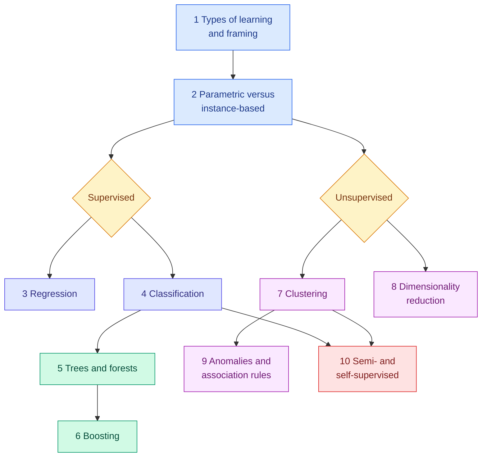

<!-- status: authored -->

# 05. Machine Learning

**Level:** 🟢 Beginner → 🔴 Advanced &nbsp;|&nbsp; **Effort:** Multi-session &nbsp;|&nbsp; **Status:** ✅ Complete

The classical machine-learning algorithm families — supervised, unsupervised, semi-supervised and
self-supervised — what each assumes, where each fails, and how to choose between them.

> **This is the first module where you build models you would recognise in industry.** Every algorithm is run
> on real or deliberately constructed data, and every topic shows the algorithm **failing** as well as
> succeeding — because knowing where a method breaks is what separates choosing a model from copying one.

---

## 🎯 Learning Objectives

By the end of this module you will be able to:

- Frame a business problem as a supervised, unsupervised, semi-supervised or reinforcement learning task
- Explain, implement and tune regression, classification, tree-ensemble, boosting, clustering and dimensionality-reduction methods
- Pick a sensible, simple baseline before reaching for anything complex — and show when the baseline wins
- Recognise overfitting and underfitting from training and held-out error
- Predict how each model family fails: extrapolation, scaling, broken assumptions, unstable structure

## 📚 Prerequisites

- [02 Mathematics for AI](../02-mathematics-for-ai/README.md) — linear algebra, gradients, probability
- [03 Data Foundations](../03-data-foundations/README.md) — splits, leakage and scaling are assumed throughout
- [Your First scikit-learn Model](../01-python-foundations/14-your-first-scikit-learn-model.md)

```bash
pip install -r requirements.txt      # scikit-learn==1.5.2, pandas==2.2.3, numpy==2.1.3
```

Run the examples from the repository root — some read `datasets/samples/`.

---

## 📑 Topics

| # | Topic | Covers | Level |
| --- | --- | --- | --- |
| 1 | [Types of Learning](01-types-of-learning.md) | Supervised to reinforcement, batch versus online under drift, exploration, framing | 🟢 |
| 2 | [Parametric and Instance-Based Models](02-parametric-and-instance-based-models.md) | Fixed versus growing complexity, memory and latency, why nothing extrapolates | 🟡 |
| 3 | [Regression](03-regression.md) | Linear, multiple, polynomial, ridge, lasso, elastic net; recovering a known formula | 🟡 |
| 4 | [Classification](04-classification.md) | Logistic regression, k-NN, naive Bayes, SVMs and kernels; three broken assumptions | 🟡 |
| 5 | [Decision Trees and Random Forests](05-decision-trees-and-random-forests.md) | Impurity, memorisation, instability, bagging, forests, extra trees, importances | 🟡 |
| 6 | [Boosting](06-boosting.md) | AdaBoost, gradient boosting, learning rate, early stopping, XGBoost, LightGBM, CatBoost | 🔴 |
| 7 | [Clustering](07-clustering.md) | k-means, hierarchical, DBSCAN, Gaussian mixtures, spectral; choosing k; scaling | 🟡 |
| 8 | [Dimensionality Reduction](08-dimensionality-reduction.md) | PCA in context, t-SNE and what its plots do not show, UMAP, ICA | 🔴 |
| 9 | [Anomaly Detection and Association Rules](09-anomaly-detection-and-association-rules.md) | Isolation forest, LOF, one-class SVM on real sensor faults; support, confidence, lift | 🟡 |
| 10 | [Semi-Supervised and Self-Supervised Learning](10-semi-and-self-supervised-learning.md) | Self-training, label spreading, pretext tasks, contrastive learning | 🔴 |

---

## 🗺️ How the pieces fit



**Topics 1–2 are the lens** for everything after. **3–6 are supervised learning**, ending with the models that win
most tabular problems. **7–9 are unsupervised.** **10 bridges to deep learning**, where self-supervised pretraining
is how modern foundation models are built.

**What this module deliberately does not repeat:** PCA from scratch is in
[Norms, Eigenvalues and PCA](../02-mathematics-for-ai/03-norms-eigenvalues-and-pca.md); splits and class imbalance are
in [03 Data Foundations](../03-data-foundations/06-splits-sampling-and-class-imbalance.md); metrics, cross-validation
strategy, hyperparameter search and learning curves are owned by [07 Model Evaluation](../07-model-evaluation/README.md).

---

## 🧭 Which topics do you actually need?

| If you are | Read |
| --- | --- |
| New to machine learning | All ten, in order |
| Building a tabular model at work | 2, 3, 5, 6 — then [07 Model Evaluation](../07-model-evaluation/README.md) |
| Exploring data with no labels | 7, 8, 9 |
| Short of labels | 1, 10 |
| Preparing for interviews | 3, 4, 5, 6 — every topic has interview questions |

---

## 🧪 Every example is verified

Each code block was executed and shows its **real** output, enforced in continuous integration:

```bash
python scripts/check_examples.py --strict 05-machine-learning/
```

Every output was also checked to be identical under a generic CPU math kernel, so the numbers do not depend on
your processor. Some of them contradict what you might expect, and that is the point:

- **Scaled logistic regression beat every other classifier** on the breast cancer data — including forests and SVMs.
- **The cubic polynomial, the best model inside its training range, predicted 17.51 against a true 3.11 outside it.**
- **Gradient boosting at learning rate 1.0 ended worse than a coin**; early stopping cost two points on small data.
- **k-means on unscaled ages scored an Adjusted Rand Index of 0.011**; standardised, 1.000.
- **No anomaly detector found the repository's stuck sensor** — a one-line rule did.
- **Self-training dropped accuracy from 78% to 56%** by learning from its own mistakes.

Three libraries — **XGBoost, LightGBM, CatBoost** — and **UMAP** are not pinned by this repository. Their topics teach
the same behaviour with scikit-learn, and show each library's interface as clearly labelled reference code that
is not executed.

## 📝 Practice

- Quiz: [`quizzes/05-machine-learning.md`](../quizzes/05-machine-learning.md)
- Answers: [`quizzes/answers/05-machine-learning.md`](../quizzes/answers/05-machine-learning.md)
- Assignments: [`assignments/05-machine-learning.md`](../assignments/05-machine-learning.md)

---

## ⚠️ The five mistakes this module exists to prevent

1. **Skipping the simple baseline.** A scaled linear model is fast, explainable and — more often than people
   expect — the best model. Anything complex has to beat it to earn its place.
2. **Forgetting to scale distance-based models.** k-NN, SVMs, clustering and regularised regression all change their
   answers with feature units.
3. **Trusting a model outside its training range.** Every family fails there, each in its own characteristic way.
4. **Reading model internals as truth.** Tree structure is unstable, feature importances credit noise and hide
   correlated features, t-SNE distances are arbitrary, and lasso's zeros can be coincidental.
5. **Assuming more data, more trees or more unlabelled examples always help.** Each can make results worse — and
   the only defence is held-out evaluation against a baseline.

---

## 📚 Official References

- [scikit-learn: User Guide — scikit-learn developers](https://scikit-learn.org/stable/user_guide.html) — verified 2026-09-14
- [An Introduction to Statistical Learning, book site — James, Witten, Hastie, Tibshirani and Taylor](https://www.statlearning.com/) — verified 2026-09-14
- [The Elements of Statistical Learning, book site — Hastie, Tibshirani and Friedman](https://hastie.su.domains/ElemStatLearn/) — verified 2026-09-14
- [scikit-learn: Common pitfalls and recommended practices — scikit-learn developers](https://scikit-learn.org/stable/common_pitfalls.html) — verified 2026-09-01

---

## 🔗 Navigation

[← 04 AI Foundations](../04-ai-foundations/README.md) &nbsp;|&nbsp;
[🏠 Repository Home](../README.md) &nbsp;|&nbsp;
[Topic 1: Types of Learning →](01-types-of-learning.md)

**Next module:** [06 Feature Engineering](../06-feature-engineering/README.md)
