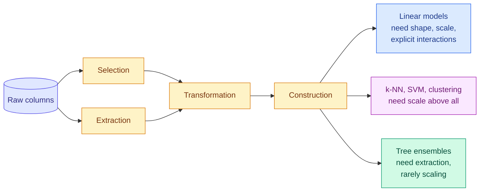
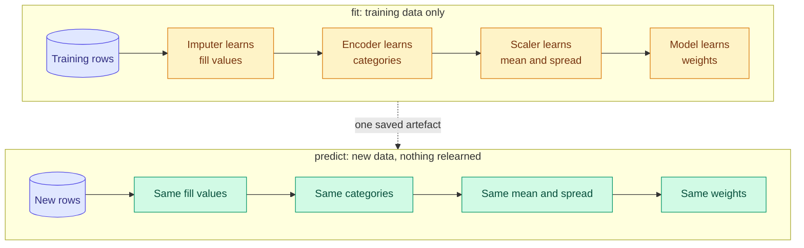

# Features and the Feature Pipeline

**Level:** 🟡 Intermediate &nbsp;|&nbsp; **Effort:** Detailed module &nbsp;|&nbsp; **Module:** [06 Feature Engineering](README.md)

---

## 🎯 Learning Objectives

By the end of this topic you will be able to:

- Say what a feature is, and name the four kinds of feature work: selection, extraction, transformation and construction
- Predict which model families need which feature work — and show that scaling changes k-NN and support vector machines but not a forest
- Build a leakage-free feature pipeline for mixed column types with scikit-learn's `ColumnTransformer`
- Explain why the fitted pipeline, not the model, is the thing you deploy — and what breaks when a scaler is refitted at prediction time

## 📚 Prerequisites

- [05 Machine Learning](../05-machine-learning/README.md) — the models these features feed
- [Encoding and Data Validation](../03-data-foundations/04-encoding-and-data-validation.md) — one-hot encoding and unseen categories
- [Cleaning, Missing Values and Scaling](../03-data-foundations/03-cleaning-missing-duplicates-outliers.md) — the scalers themselves

```bash
pip install -r requirements.txt      # scikit-learn==1.5.2, pandas==2.2.3, numpy==2.1.3
```

Run the examples from the repository root — one reads `datasets/samples/`.

---

## 🍰 1. The simple version

**A feature is a question you answer, with a number, about every example.** "How many square metres is
the flat?" "How many times did this customer call support last quarter?" "Is today a weekend?" A model
never sees a flat, a customer or a day. It sees only the answers to the questions you chose to ask.

**Feature engineering is choosing and shaping those questions.** Ask the wrong ones and no algorithm can
recover. Ask good ones and a simple model often beats a sophisticated one working from raw columns.

Most of the work falls into four kinds:

| Kind | Plain meaning | Example |
| --- | --- | --- |
| **Selection** | Keep the useful questions, drop the rest | Drop 200 columns that carry no signal |
| **Extraction** | Pull a number out of something that is not a number yet | Word counts from text; hour of day from a timestamp |
| **Transformation** | Re-express an answer so a model can use it | Log of income; standardised age |
| **Construction** | Combine answers into a new question | Price per square metre; distance from latitude and longitude |

## 🏠 2. Real-life analogy

> A doctor does not diagnose from a recording of everything the patient said. They turn the visit into a
> chart: temperature, blood pressure, age, "smoker: yes". Some measurements are taken directly, some are
> computed — body mass index is weight over height squared — and some are left off the chart because they
> do not help. The chart is the feature set; the diagnosis is the model.

**Where the analogy breaks down:** a doctor knows *why* a measurement matters. A model only knows whether
it correlated with the label in the training data — which is how a feature that leaks the answer, or a
feature that will not exist at prediction time, gets onto the chart unnoticed. Topics
[3](03-encoding-categorical-features.md) and [7](07-leakage-hunting-and-features-in-production.md) are
about exactly that.

---

## ⚙️ 3. Different models need different feature work

Feature engineering is not a fixed recipe. **What a feature needs depends on the model that will read it.**



| Model family | Scaling | Monotonic transforms such as log | Interactions | Categorical encoding |
| --- | --- | --- | --- | --- |
| Linear and logistic regression | Needed when regularised; changes coefficients' meaning | Often essential | Must be built by hand | One-hot; ordinal codes are meaningless |
| k-nearest neighbours (k-NN), support vector machines (SVMs), clustering | **Essential** — distance is the model | Helpful | Implicit in the distance | One-hot, then scaled |
| Decision trees, forests, boosting | **Irrelevant** — splits are thresholds | **Irrelevant** — same splits | Learned, given enough data | Ordinal codes work; native support in histogram boosting |
| Neural networks | Needed for stable training | Helpful | Learned | Embeddings or one-hot |

### 💻 Code example — the same data, four model families, with and without scaling

The wine dataset has 13 chemical measurements on wildly different scales: one ranges from 0.13 to 0.66,
another from 278 to 1,680. **Teaching use only.**

```python
"""Scaling matters to distance-based models and not at all to a forest."""

import warnings

from sklearn.datasets import load_wine
from sklearn.ensemble import RandomForestClassifier
from sklearn.linear_model import LogisticRegression
from sklearn.model_selection import cross_val_score
from sklearn.neighbors import KNeighborsClassifier
from sklearn.pipeline import make_pipeline
from sklearn.preprocessing import StandardScaler
from sklearn.svm import SVC

warnings.filterwarnings("ignore")      # unscaled logistic regression warns about convergence - itself a hint

X, y = load_wine(return_X_y=True)
print(f"feature ranges: smallest max {X.max(axis=0).min():.2f}, largest max {X.max(axis=0).max():,.0f}\n")

models = {
    "k-nearest neighbours": KNeighborsClassifier(),
    "SVM, RBF kernel": SVC(),
    "logistic regression": LogisticRegression(max_iter=5000),
    "random forest": RandomForestClassifier(random_state=0),
}
print(f"{'5-fold accuracy':<22}{'raw':>8}{'scaled':>8}")
for name, model in models.items():
    raw = cross_val_score(model, X, y, cv=5).mean()
    scaled = cross_val_score(make_pipeline(StandardScaler(), model), X, y, cv=5).mean()
    print(f"{name:<22}{raw:>8.3f}{scaled:>8.3f}")
```

**Output:**
```
feature ranges: smallest max 0.66, largest max 1,680

5-fold accuracy            raw  scaled
k-nearest neighbours     0.691   0.949
SVM, RBF kernel          0.663   0.983
logistic regression      0.961   0.983
random forest            0.983   0.983
```

**k-NN gained 26 points and the SVM 32 from one line of preprocessing.** Unscaled, their distances are
dominated by the two features measured in the hundreds and thousands, magnesium and proline; the other
eleven barely count. Logistic regression gained a little — scaling helped its optimiser converge. **The
forest's score did not change at all**: a threshold split on a feature produces the same partitions
whatever units it is in.

**The lesson is not "always scale".** It is: know what your model family is sensitive to. Scaling a
forest's inputs wastes effort; not scaling an SVM's wastes the SVM.

---

## 🔧 4. The pipeline: feature work is part of the model

Every feature step that **learns something from data** — a mean for imputation, a standard deviation for
scaling, the list of categories for one-hot encoding, a target mean for target encoding — is a fitted
parameter, exactly like a model coefficient. It must be:

1. **Learned from training data only**, or it leaks information from the evaluation data
   ([Leakage](../03-data-foundations/05-lineage-versioning-privacy-and-leakage.md));
2. **Refitted inside every cross-validation fold**, for the same reason;
3. **Saved and reused unchanged at prediction time**, or production receives different features from the
   ones the model learned.

scikit-learn's `Pipeline` and `ColumnTransformer` enforce all three by making the feature steps and the
model a single object with one `fit` and one `predict`.



### 💻 Code example — mixed columns from nested JSON

`datasets/samples/customers.jsonl` has nested fields, a list-valued field and a country that is **absent
entirely** from 10 of 40 records — typical of data from an application programming interface (API). The
pipeline extracts, imputes, encodes, transforms and scales each column type differently, in one object.

```python
import json

import numpy as np
import pandas as pd
from sklearn.compose import ColumnTransformer
from sklearn.impute import SimpleImputer
from sklearn.pipeline import make_pipeline
from sklearn.preprocessing import FunctionTransformer, OneHotEncoder, StandardScaler

with open("datasets/samples/customers.jsonl", encoding="utf-8") as handle:
    records = [json.loads(line) for line in handle]
flat = pd.json_normalize(records)                         # usage.storage_gb, contact.country, ...

# Extraction: turn a list-valued field into numbers a model can read.
flat["tag_count"] = flat["tags"].apply(len)
flat["is_trial"] = flat["tags"].apply(lambda tags: "trial" in tags).astype(int)

categorical = ["plan", "region", "contact.country"]
skewed = ["usage.requests_last_30d", "usage.storage_gb"]

features = ColumnTransformer([
    ("categories", make_pipeline(SimpleImputer(strategy="constant", fill_value="missing"),
                                 OneHotEncoder(handle_unknown="ignore")), categorical),
    ("skewed", make_pipeline(FunctionTransformer(np.log1p, feature_names_out="one-to-one"),
                             StandardScaler()), skewed),
    ("counts", "passthrough", ["tag_count", "is_trial"]),
])
matrix = features.fit_transform(flat)

print(f"missing country in {flat['contact.country'].isna().sum()} of {len(flat)} records")
print(f"{len(flat.columns)} raw columns -> feature matrix of shape {matrix.shape}")
for name in features.get_feature_names_out():
    print("  ", name)
```

**Output:**
```
missing country in 10 of 40 records
9 raw columns -> feature matrix of shape (40, 16)
   categories__plan_enterprise
   categories__plan_free
   categories__plan_pro
   categories__region_ap-south
   categories__region_eu-north
   categories__region_eu-west
   categories__region_us-east
   categories__contact.country_IE
   categories__contact.country_IN
   categories__contact.country_SE
   categories__contact.country_US
   categories__contact.country_missing
   skewed__usage.requests_last_30d
   skewed__usage.storage_gb
   counts__tag_count
   counts__is_trial
```

**Every output column has a traceable name**, which is what makes a model debuggable later. Three things
in this pipeline are deliberate:

- **Missing country became its own category, `missing`, not a guess.** Whether a record has a country is
  itself information — in real systems, missingness often correlates with how a customer signed up.
- **`handle_unknown="ignore"`** means a country first seen in production becomes all zeros instead of a
  crash ([Encoding and Data Validation](../03-data-foundations/04-encoding-and-data-validation.md)).
- **Request counts were logged before scaling.** They span two orders of magnitude; [Topic 2](02-transformations-log-power-and-binning.md)
  shows when that matters.

---

## 🏭 5. Production: the fitted pipeline is the artefact

### ⚠️ Refitting the scaler at prediction time

A common serving bug: the model was trained on standardised features, so the prediction service
"standardises the incoming data" — with a **new** scaler, fitted on whatever arrives.

```python
"""The scaler belongs to the model: refitting it on the prediction batch silently breaks predictions."""

import numpy as np
from sklearn.datasets import load_wine
from sklearn.model_selection import train_test_split
from sklearn.neighbors import KNeighborsClassifier
from sklearn.preprocessing import StandardScaler

X, y = load_wine(return_X_y=True)
X_train, X_test, y_train, y_test = train_test_split(X, y, test_size=0.3, random_state=0, stratify=y)

scaler = StandardScaler().fit(X_train)                       # fitted once, on training data
model = KNeighborsClassifier().fit(scaler.transform(X_train), y_train)

right = model.predict(scaler.transform(X_test))
print(f"training scaler, reused:                accuracy {(right == y_test).mean():.3f}")

# The bug: "standardise the incoming data" with a fresh scaler.
refit = model.predict(StandardScaler().fit_transform(X_test))
print(f"fresh scaler on the whole test set:     accuracy {(refit == y_test).mean():.3f}")

one_class = X_test[y_test == 0]                              # a batch that happens to be one class
batch = model.predict(StandardScaler().fit_transform(one_class))
print(f"fresh scaler on a batch of class 0:     accuracy {(batch == 0).mean():.3f}")

singles = np.array([model.predict(StandardScaler().fit_transform(row.reshape(1, -1)))[0] for row in X_test])
print(f"fresh scaler on one request at a time:  accuracy {(singles == y_test).mean():.3f}"
      f"  - predicted classes: {sorted(set(singles.tolist()))}")
```

**Output:**
```
training scaler, reused:                accuracy 0.963
fresh scaler on the whole test set:     accuracy 0.981
fresh scaler on a batch of class 0:     accuracy 0.556
fresh scaler on one request at a time:  accuracy 0.333  - predicted classes: [0]
```

**The second line is what makes this bug survive review.** Refitted on a large, representative batch, the
scaler learns nearly the training statistics, and accuracy even looks slightly *better* — that 0.981 is
luck on 54 rows, not an improvement. Then production sends a batch from one region, one season or one
customer segment, and the "standardisation" erases exactly the differences the model relies on: 55.6%.
**Sent one request at a time, a single row standardises to all zeros, and the model returns class 0 for
every input** — 33.3%, the rate of guessing.

**The fix is structural, not careful coding:** save the fitted `Pipeline` as one artefact, and make the
prediction service call `pipeline.predict` on raw inputs. There is then no scaler to refit.

### What else the pipeline must carry into production

| Concern | What to do |
| --- | --- |
| **Versioning** | Version the fitted pipeline together with the code that built its features; a model without its feature definition cannot be reproduced |
| **Schema** | Validate inputs against the training schema before `predict` ([Data Validation](../03-data-foundations/04-encoding-and-data-validation.md)) |
| **Train/serve skew** | Compute features with the same code in both paths ([Feature Stores](../03-data-foundations/07-synthetic-data-augmentation-and-feature-stores.md)) |
| **Monitoring** | Track each input feature's distribution, not only the model's accuracy — labels usually arrive late ([Topic 7](07-leakage-hunting-and-features-in-production.md)) |
| **Cost** | Every feature has a compute and storage cost at serving time, and an engineering cost for as long as it exists; drop features that do not earn their place ([Topic 6](06-feature-selection-and-importance.md)) |

---

## 🌍 6. Real-world use

| Domain | Raw data | Engineered features |
| --- | --- | --- |
| Credit risk | Transaction history | Spend in the last 30 days, ratio of debt to income, count of missed payments |
| E-commerce | Clickstream | Sessions per week, time since last purchase, basket size |
| Predictive maintenance | Sensor streams | Rolling mean and variance, time since last service |
| Fraud | Payment events | Distance from usual location, transactions per minute, new-device flag |
| Healthcare | Records | Body mass index, count of prior admissions, days since diagnosis |

In each, **the model is usually a well-understood algorithm; the competitive advantage is the features.**

## ⚠️ 7. Common mistakes

| Mistake | Why it happens | Fix |
| --- | --- | --- |
| Scaling or imputing before splitting | Tutorials do it for brevity | Put every learned step in a `Pipeline` |
| Refitting preprocessing at prediction time | Service code is written separately from training | Deploy the fitted pipeline as one artefact |
| Scaling features for a tree model and expecting a gain | Habit | It changes nothing — the forest scored identically |
| Not scaling for k-NN or an SVM | Forgotten | 26 and 32 points lost in the example |
| Imputing a missing category with the most common value | Looks tidy | Missingness is often information; keep it as its own value |
| Losing track of column names | NumPy arrays have none | `get_feature_names_out()` on the fitted `ColumnTransformer` |

## 🔐 8. Security note

- **Features derived from personal data are personal data.** A "distance from home" feature reveals where
  someone lives. Apply the same access controls, retention limits and minimisation to feature tables as to
  the raw data ([Privacy](../03-data-foundations/05-lineage-versioning-privacy-and-leakage.md)).
- **Validate inputs before they reach the pipeline.** A request with a negative age or a
  10-megabyte string in a category field should be rejected at the boundary, not encoded.
- **A fitted pipeline is code.** Saved with `pickle` or `joblib`, loading it can execute arbitrary code —
  never load a pipeline file from an untrusted source
  ([Your First scikit-learn Model](../01-python-foundations/14-your-first-scikit-learn-model.md)).

---

## 🎤 9. Interview questions

<details>
<summary><b>Q1: Which models need feature scaling, and why?</b></summary>

Any model whose behaviour depends on distances or on the magnitude of coefficients: k-nearest neighbours,
SVMs with most kernels, k-means and other clustering, principal component analysis, regularised linear models
and neural networks. Unscaled, the feature with the largest range dominates the distance or the penalty.
Tree-based models do not need it, because a threshold split partitions the data identically in any units —
in the example the forest's accuracy was unchanged while k-NN gained 26 points.
</details>

<details>
<summary><b>Q2: Why must preprocessing be fitted inside cross-validation?</b></summary>

Every preprocessing step that learns from data — imputation values, scaling statistics, category lists,
target means — is a fitted parameter. Fitting it on all the data before splitting lets information from the
validation fold shape the training features, which inflates the score. Putting the steps in a scikit-learn
`Pipeline` makes cross-validation refit them on each training fold automatically. For simple scaling the
inflation is often small; for target encoding and feature selection it can be dramatic
([Topic 3](03-encoding-categorical-features.md), [Topic 6](06-feature-selection-and-importance.md)).
</details>

<details>
<summary><b>Q3 (scenario): A model scored 96% offline and behaves erratically in production, with nothing in the logs. Where do you look first?</b></summary>

At the features the service computes, compared with the features the model was trained on, for the same
inputs. Common causes are preprocessing refitted at serving time — in the example, standardising one request
at a time made every prediction the same class — a feature reimplemented differently in the service, a
category or unit that changed upstream, and missing values handled differently. Log the feature vector the
model actually receives, replay a few training rows through the service and diff the results. The long-term
fix is deploying the fitted pipeline as one artefact and sharing feature code between both paths.
</details>

---

## ✅ Key takeaways

- A feature is a question answered with a number; the four kinds of feature work are **selection,
  extraction, transformation and construction**.
- **Feature needs depend on the model**: scaling took an SVM from 66% to 98% and left a forest unchanged.
- Every step that learns from data is a **fitted parameter** — fit on training data, refit per fold, reuse at
  prediction time.
- `Pipeline` and `ColumnTransformer` make that structural, with traceable output names.
- **Deploy the fitted pipeline, not the bare model.** Refitting a scaler per request made every prediction
  the same class.

---

## 📚 Official References

- [scikit-learn: Pipelines and composite estimators — scikit-learn developers](https://scikit-learn.org/stable/modules/compose.html) — verified 2026-09-18
- [scikit-learn: Preprocessing data — scikit-learn developers](https://scikit-learn.org/stable/modules/preprocessing.html) — verified 2026-09-18
- [scikit-learn: Common pitfalls and recommended practices — scikit-learn developers](https://scikit-learn.org/stable/common_pitfalls.html) — verified 2026-09-18
- [Rules of Machine Learning — Google for Developers](https://developers.google.com/machine-learning/guides/rules-of-ml) — verified 2026-09-18
- [Working with numerical data, Machine Learning Crash Course — Google for Developers](https://developers.google.com/machine-learning/crash-course/numerical-data) — verified 2026-09-18

The scikit-learn pages track the latest release; this repository pins 1.5.2, and every API used here exists
in that version.

---

## 🔗 Navigation

[← Module home](README.md) &nbsp;|&nbsp;
[🏠 Repository Home](../README.md) &nbsp;|&nbsp;
[Topic 2: Transformations — Log, Power and Binning →](02-transformations-log-power-and-binning.md)
