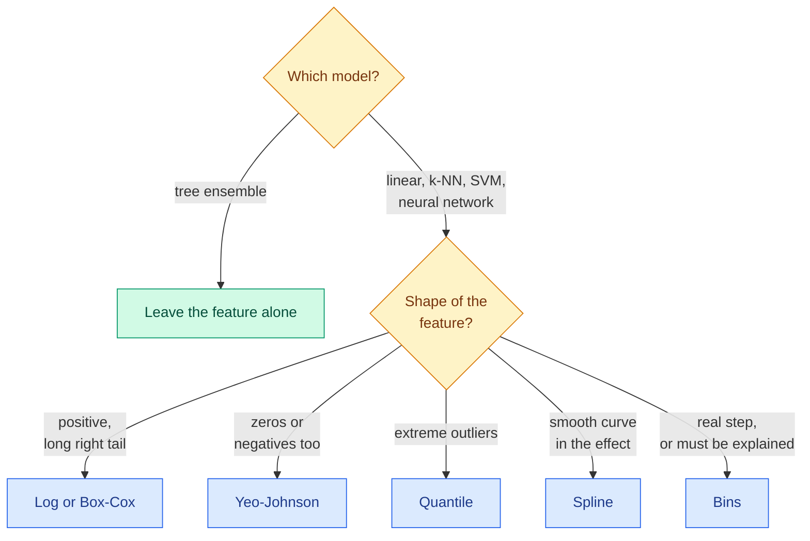

# Transformations: Log, Power, Quantile and Binning

**Level:** 🟡 Intermediate &nbsp;|&nbsp; **Effort:** Short module &nbsp;|&nbsp; **Module:** [06 Feature Engineering](README.md)

---

## 🎯 Learning Objectives

By the end of this topic you will be able to:

- Explain what a monotonic transformation does to a feature, and why it changes a linear model but not a tree
- Choose between log, Box-Cox, Yeo-Johnson, quantile, binning and spline transformations
- State the Box-Cox formula and interpret the power it chooses
- Transform a regression target, and correct the bias that appears when you transform predictions back

## 📚 Prerequisites

- [Topic 1: Features and the Feature Pipeline](01-features-and-the-feature-pipeline.md)
- [Cleaning and Scaling](../03-data-foundations/03-cleaning-missing-duplicates-outliers.md) — scalers, `log1p`, and the back-transform bias this topic builds on
- [Regression](../05-machine-learning/03-regression.md)

```bash
pip install -r requirements.txt      # scikit-learn==1.5.2, scipy==1.14.1, numpy==2.1.3
```

---

## 🍰 1. The simple version

**Many real quantities grow by multiplying, not adding.** Incomes, prices, populations, file sizes, web
traffic: a jump from 10,000 to 20,000 often means as much as a jump from 100,000 to 200,000. On the raw scale
those look nothing alike; on a log scale they are the same step.

A **transformation** re-expresses a feature so that equal steps mean roughly equal things. A straight-line
model can then fit what was a curve.

## 🏠 2. Real-life analogy

> Earthquakes are reported on a magnitude scale, not in joules. Each whole step up is roughly 32 times more
> energy. On the raw energy scale, one great earthquake would dwarf every other on the chart; on the
> magnitude scale you can compare them all. The earthquakes did not change — the ruler did.

**Where the analogy breaks down:** choosing a ruler for a model is not only about readability. It changes
what a linear model *can* represent — and, as the code shows, changes nothing at all for a tree.

---

## ⚙️ 3. The transformation menu

| Transform | Formula or idea | Handles | Use when |
| --- | --- | --- | --- |
| **Log** | $\log x$, or $\log(1 + x)$ with zeros | Positive values | Multiplicative effects, long right tails |
| **Box-Cox** | Power chosen from data (below) | **Strictly positive** values | You want the data to choose the power |
| **Yeo-Johnson** | Box-Cox extended to zero and negatives | Any values | Same, when values can be zero or negative |
| **Quantile** | Replace each value by its rank, mapped to a uniform or normal shape | Anything; ignores outliers' size | Heavy outliers; unknown shape |
| **Binning** | Replace value by its interval | Anything | Interpretability, or a genuinely step-like effect |
| **Spline** | A set of smooth, local curves | Anything | A smooth non-linear effect in a linear model |

### 📐 The Box-Cox transformation

$$
x^{(\lambda)} =
\begin{cases}
\dfrac{x^{\lambda} - 1}{\lambda} & \lambda \neq 0 \\[2mm]
\log x & \lambda = 0
\end{cases}
$$

| Symbol | Means |
| --- | --- |
| $x$ | The original value; must be strictly positive |
| $\lambda$ | The power, chosen by maximum likelihood to make the result as close to normally distributed as possible |
| $\lambda = 1$ | Nothing changes except a shift |
| $\lambda = 0.5$ | Roughly a square root |
| $\lambda = 0$ | Exactly the log — the formula's limit as $\lambda \to 0$ |

**It solves one problem:** you suspect a feature needs compressing but do not know how much. Box-Cox tries
the whole family of powers and picks one. Yeo-Johnson uses the same idea with a formula that also accepts
zero and negative values.

---

## 💻 4. Code example — seven transformations, two models

An outcome that rises with the **log** of income — diminishing returns — and an income feature with a long
right tail. **Teaching use only.**

```python
"""Which transformation helps depends on the model: a linear model cares, a tree does not."""

import numpy as np
from scipy import stats
from sklearn.linear_model import LinearRegression
from sklearn.model_selection import cross_val_score
from sklearn.pipeline import make_pipeline
from sklearn.preprocessing import (FunctionTransformer, KBinsDiscretizer, PowerTransformer,
                                   QuantileTransformer, SplineTransformer)
from sklearn.tree import DecisionTreeRegressor

rng = np.random.default_rng(0)
income = rng.lognormal(mean=10.5, sigma=0.9, size=1000)             # heavily right-skewed
outcome = 20 * np.log(income) + rng.normal(0, 4, 1000)              # diminishing returns to income
X = income.reshape(-1, 1)
print(f"skewness of income: {stats.skew(income):.2f}   (0 is symmetric)\n")

transforms = {
    "none": FunctionTransformer(),
    "log": FunctionTransformer(np.log),
    "Box-Cox": PowerTransformer(method="box-cox"),
    "Yeo-Johnson": PowerTransformer(method="yeo-johnson"),
    "quantile to normal": QuantileTransformer(output_distribution="normal", n_quantiles=200),
    "10 quantile bins": KBinsDiscretizer(n_bins=10, encode="onehot", strategy="quantile"),
    "spline, 6 knots": SplineTransformer(n_knots=6),
}
print(f"{'transform':<20}{'linear R2':>10}{'tree R2':>10}")
for name, transform in transforms.items():
    linear = cross_val_score(make_pipeline(transform, LinearRegression()), X, outcome, cv=5).mean()
    tree = cross_val_score(make_pipeline(transform, DecisionTreeRegressor(max_depth=4, random_state=0)),
                           X, outcome, cv=5).mean()
    print(f"{name:<20}{linear:>10.3f}{tree:>10.3f}")

box_cox = PowerTransformer(method="box-cox").fit(X)
print(f"\nBox-Cox chose lambda = {box_cox.lambdas_[0]:.3f}   (lambda 0 is exactly the log)")
```

**Output:**
```
skewness of income: 3.30   (0 is symmetric)

transform            linear R2   tree R2
none                     0.638     0.931
log                      0.949     0.931
Box-Cox                  0.949     0.931
Yeo-Johnson              0.949     0.931
quantile to normal       0.936     0.931
10 quantile bins         0.892     0.772
spline, 6 knots          0.928     0.931

Box-Cox chose lambda = 0.025   (lambda 0 is exactly the log)
```

**The linear model went from explaining 64% of the variance to 95% with one transformation.** Raw, it was
forced to draw a straight line through a curve, and the few very high incomes dragged the line around.
Logged, the relationship *is* a straight line.

**Box-Cox found the answer on its own.** It chose $\lambda = 0.025$ — practically zero, which is the log. When
you do not know the right transform, letting the data choose is a reasonable first move.

**The tree scored 0.931 under every monotonic transformation — identical to three decimals.** A tree splits
on thresholds, and "income above 40,000" and "log income above 10.6" select exactly the same rows. **Log,
Box-Cox, Yeo-Johnson and quantile transforms are wasted effort for tree models.** (The spline is not a
monotonic transform — it expands one column into several — and here it happened to leave the tree unchanged
too.) Notice also that the tree lost to the transformed linear model: it approximates a smooth curve with
steps.

**Binning cost both models something, for different reasons.** The linear model lost information within each
bin (0.892 against 0.949). The tree dropped to 0.772 because one-hot bins force it to spend a split on each
bin, and a depth-4 tree can only isolate a few. Never one-hot bin a feature before a tree.

---

## 🪣 5. When binning is the right choice anyway

Binning throws information away. It still has real uses:

| Reason | Example |
| --- | --- |
| **The effect genuinely is a step** | A tax rate that changes at a threshold; an age of legal majority |
| **Interpretability is a requirement** | Credit scorecards assign points per band so a decision can be explained line by line |
| **Robustness** | A bin absorbs an extreme value that would otherwise dominate a linear fit |
| **Sparse, noisy data** | Averaging within bands stabilises estimates |

When the effect is smooth and you only want flexibility, prefer a **spline**: it is flexible like bins but
continuous, so predictions do not jump at an arbitrary boundary. Here the 6-knot spline beat 10 bins, 0.928
against 0.892, with fewer columns.



---

## 🎯 6. Transforming the target — and the bias it introduces

Transforming the **target** is different from transforming a feature. You train on $\log y$, then
exponentiate predictions to get back to the original units. [Cleaning and Scaling](../03-data-foundations/03-cleaning-missing-duplicates-outliers.md)
showed that the exponential of a mean of logs is not the mean. Here is what that does to a real model.

```python
"""A log target fits better and forecasts the total too low. Which one matters depends on the question."""

import numpy as np
from sklearn.compose import TransformedTargetRegressor
from sklearn.linear_model import LinearRegression
from sklearn.metrics import mean_absolute_error
from sklearn.model_selection import train_test_split

rng = np.random.default_rng(0)
n = 4000
X = rng.uniform(0, 3, size=(n, 2))
spend = np.exp(2 + 0.6 * X[:, 0] + 0.3 * X[:, 1] + rng.normal(0, 0.8, n))   # multiplicative noise
X_train, X_test, y_train, y_test = train_test_split(X, spend, test_size=0.5, random_state=0)

raw = LinearRegression().fit(X_train, y_train)
logged = TransformedTargetRegressor(LinearRegression(), func=np.log, inverse_func=np.exp).fit(X_train, y_train)

# Correction: exp(mean of logs) is the median; the mean is larger by exp(variance / 2) for log-normal noise.
residuals = np.log(y_train) - logged.regressor_.predict(X_train)
correction = np.exp(residuals.var() / 2)

print(f"{'target':<24}{'MAE':>8}{'median error':>14}{'predicted total / actual':>26}{'negative':>10}")
for name, predictions in [("raw", raw.predict(X_test)),
                          ("log", logged.predict(X_test)),
                          ("log, corrected", logged.predict(X_test) * correction)]:
    print(f"{name:<24}{mean_absolute_error(y_test, predictions):>8.2f}"
          f"{np.median(np.abs(y_test - predictions)):>14.2f}"
          f"{predictions.sum() / y_test.sum():>26.3f}{int((predictions < 0).sum()):>10}")
print(f"\ncorrection factor {correction:.3f}")
```

**Output:**
```
target                       MAE  median error  predicted total / actual  negative
raw                        29.79         20.60                     1.013        68
log                        26.49         12.99                     0.743         0
log, corrected             28.66         17.99                     1.018         0

correction factor 1.370
```

**Each model wins a different contest:**

- **Raw target**: totals are right (1.3% over), but **68 customers are predicted to spend a negative amount**.
  A straight line through multiplicative data dives below zero.
- **Log target**: the best typical error — half the raw model's median error — and no negatives. **But the
  forecast total is 26% too low.** Exponentiating a prediction of $\log y$ gives the median, not the mean.
  Summed across customers, that is a budget shortfall.
- **Log target, corrected**: multiply by $e^{\sigma^2/2}$, where $\sigma^2$ is the variance of the log-scale
  residuals. Totals are back within 2%, still with no negatives, at the cost of a worse typical error.

**The right choice depends on what the prediction is for.** Ranking customers, or a typical-case estimate:
use the log target. Anything that gets summed — revenue, demand, capacity — needs the mean, so correct it or
model the raw scale. The correction assumes the log-scale errors are roughly normal and equally spread;
with other error shapes, the empirical "smearing" estimator — the average of $e^{\text{residual}}$ — is the
safer version.

---

## 🏭 7. Production notes

- **Transforms have fitted parameters too.** Box-Cox's $\lambda$, quantile boundaries and bin edges are
  learned from training data and belong in the pipeline ([Topic 1](01-features-and-the-feature-pipeline.md)).
- **Out-of-range inputs.** A quantile transformer maps anything above the training maximum to the top
  quantile, so a tenfold spike looks like an ordinary high value. A log of zero or a negative gives `-inf` or
  `NaN`, which propagates silently. Validate ranges at the boundary and alert on them.
- **Bin edges drift.** Quantile bins fitted last year may put 40% of this year's customers into the top bin.
  Monitor the share of rows per bin ([Topic 7](07-leakage-hunting-and-features-in-production.md)).
- **Report in original units.** Stakeholders reason in currency, not log-currency; back-transform, and state
  whether a figure is a median or a mean.

## ⚠️ 8. Common mistakes

| Mistake | Why it happens | Fix |
| --- | --- | --- |
| Log-transforming features for a tree model | Habit from linear models | Unchanged R² of 0.931 under every monotonic transform |
| `np.log` on data with zeros | Counts and amounts are often zero | `np.log1p`, or Yeo-Johnson |
| Box-Cox on negative values | It requires strictly positive input | Yeo-Johnson |
| One-hot bins before a tree | Seemed tidy | Tree R² fell from 0.931 to 0.772 |
| Summing back-transformed log predictions | Treating a median as a mean | Totals were 26% low; apply a correction |
| Fitting the transform on all data | Done in a notebook cell before splitting | Keep it in the `Pipeline` |

## 🔐 9. Security note

Transformations do not add a new attack surface, but they hide bad input. A negative or absurd value sent to
a model is silently turned into `NaN`, clipped to the top quantile or dropped into the last bin, and the
model returns a confident answer. **Validate raw inputs against expected ranges before transforming**, and
log rejected requests — a burst of out-of-range values is worth a security alert as well as a data-quality
one.

---

## 🎤 10. Interview questions

<details>
<summary><b>Q1: Why do tree models not need log transforms of their features?</b></summary>

A tree splits on thresholds, and any strictly increasing transformation preserves the order of values, so
every possible split separates exactly the same rows before and after. The fitted tree — and its predictions —
are the same. In the example the tree scored 0.931 under the raw feature, log, Box-Cox, Yeo-Johnson and
quantile transforms alike. Transforming the target is a different matter: it changes the loss the tree
minimises.
</details>

<details>
<summary><b>Q2: What is the difference between Box-Cox and Yeo-Johnson?</b></summary>

Both are families of power transforms whose parameter $\lambda$ is chosen by maximum likelihood to make the
data as close to normal as possible. Box-Cox, $(x^\lambda - 1)/\lambda$ with the log at $\lambda = 0$, is only
defined for strictly positive values. Yeo-Johnson uses a modified formula that also handles zero and negative
values, applying different branches either side of zero. Use Box-Cox for strictly positive data; Yeo-Johnson
otherwise.
</details>

<details>
<summary><b>Q3: You trained a revenue model on log revenue. Finance says the forecast total is consistently low. Why?</b></summary>

Exponentiating a prediction of the mean of log revenue gives the geometric mean — the median, for log-normal
errors — which is below the arithmetic mean. Individual forecasts can look fine while their sum is biased
low; in the example the total was 26% short. Correct by multiplying by $e^{\sigma^2/2}$ using the log-scale
residual variance, or by the smearing estimator (the mean of the exponentiated residuals), or model revenue
on its original scale with a loss suited to it. Also check whether the business needs the mean at all.
</details>

---

## ✅ Key takeaways

- A monotonic transform changes **what a linear model can represent**: R² went from 0.638 to 0.949 with a log.
- **Tree models are indifferent** to monotonic feature transforms — identical scores under all of them.
- **Box-Cox** chooses the power from data (it found $\lambda \approx 0$, the log); **Yeo-Johnson** handles zeros
  and negatives; **quantile** transforms ignore outliers' size; **splines** add smooth flexibility.
- **Bins lose information** — use them for real steps or explainability, and never one-hot them into a tree.
- **A log target predicts the median.** Correct it before summing predictions, or totals come out low.

---

## 📚 Official References

- [scikit-learn: Preprocessing data, non-linear transformation and discretisation — scikit-learn developers](https://scikit-learn.org/stable/modules/preprocessing.html) — verified 2026-09-18
- [scikit-learn: PowerTransformer — scikit-learn developers](https://scikit-learn.org/stable/modules/generated/sklearn.preprocessing.PowerTransformer.html) — verified 2026-09-18
- [scikit-learn: SplineTransformer — scikit-learn developers](https://scikit-learn.org/stable/modules/generated/sklearn.preprocessing.SplineTransformer.html) — verified 2026-09-18
- [scikit-learn: TransformedTargetRegressor — scikit-learn developers](https://scikit-learn.org/stable/modules/generated/sklearn.compose.TransformedTargetRegressor.html) — verified 2026-09-18
- [SciPy: scipy.stats.boxcox — SciPy developers](https://docs.scipy.org/doc/scipy/reference/generated/scipy.stats.boxcox.html) — verified 2026-09-18

---

## 🔗 Navigation

[← Topic 1: Features and the Feature Pipeline](01-features-and-the-feature-pipeline.md) &nbsp;|&nbsp;
[🏠 Module Home](README.md) &nbsp;|&nbsp;
[Topic 3: Encoding Categorical Features →](03-encoding-categorical-features.md)
