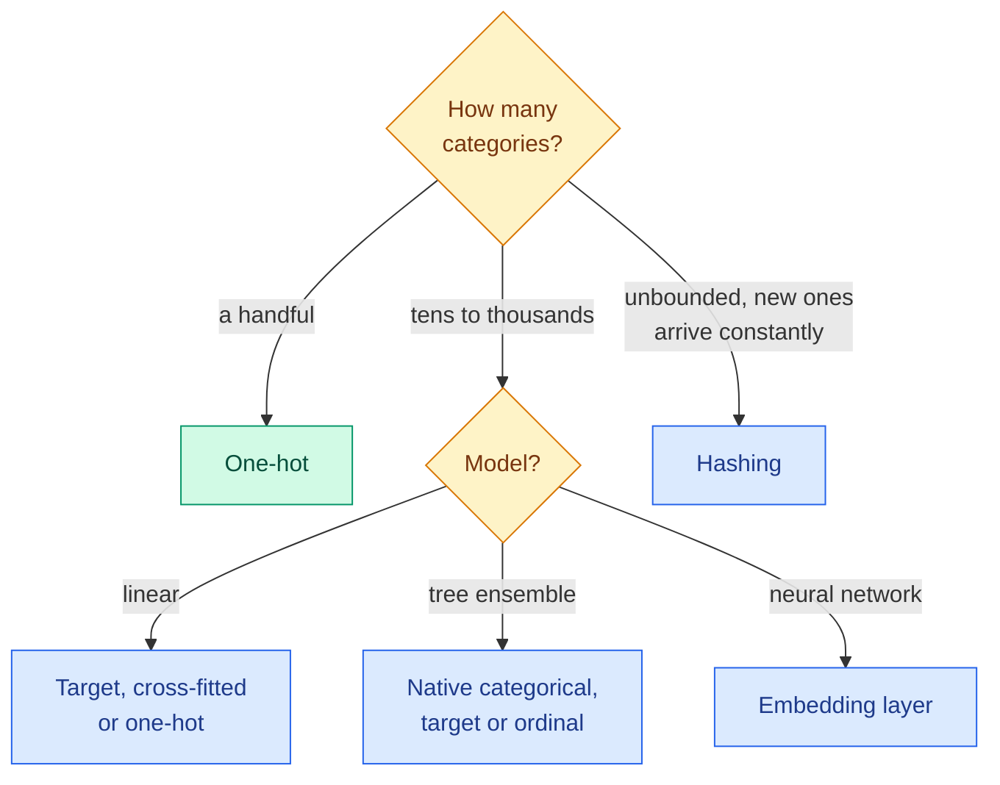
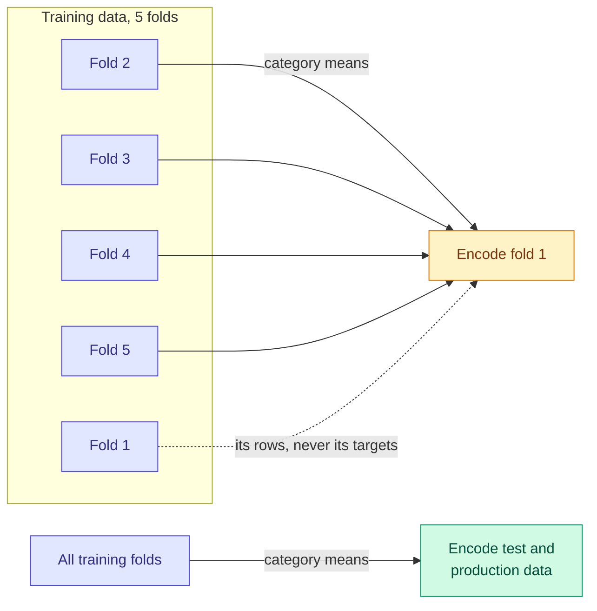

# Encoding Categorical Features: One-Hot, Ordinal, Target, Frequency and Hashing

**Level:** 🟡 Intermediate → 🔴 Advanced &nbsp;|&nbsp; **Effort:** Detailed module &nbsp;|&nbsp; **Module:** [06 Feature Engineering](README.md)

---

## 🎯 Learning Objectives

By the end of this topic you will be able to:

- Choose an encoding from two facts: the category's cardinality and the model family that will read it
- Explain why ordinal codes are meaningless to a linear model but usable by a tree
- Explain target encoding's shrinkage formula, and why it must be cross-fitted
- Recognise the trap in scikit-learn's `TargetEncoder`: `fit().transform()` is not `fit_transform()`
- Use feature hashing for unbounded categories, and size it from the collision rate

## 📚 Prerequisites

- [Encoding and Data Validation](../03-data-foundations/04-encoding-and-data-validation.md) — **read first.** It covers
  label versus one-hot encoding, `drop_first`, high cardinality, unseen categories and leave-one-out target
  encoding. This topic does not repeat them.
- [Topic 1: Features and the Feature Pipeline](01-features-and-the-feature-pipeline.md)
- [Boosting](../05-machine-learning/06-boosting.md) — histogram gradient boosting

```bash
pip install -r requirements.txt      # scikit-learn==1.5.2, pandas==2.2.3, numpy==2.1.3
```

---

## 🍰 1. The simple version

A model needs numbers, and "Lisbon" is not a number. **Encoding decides which number, or numbers, stand in
for a category** — and that choice quietly tells the model what it is allowed to believe about the category.

- Give each city its own on/off column (**one-hot**) and the model learns one adjustment per city.
- Number the cities 1, 2, 3 (**ordinal**) and a linear model believes city 3 is "three times" city 1.
- Replace each city with how often it appears (**frequency**) and the model can only learn "big cities differ
  from small ones".
- Replace each city with its average outcome (**target**) and the model gets the most useful number there
  is — and the easiest one to cheat with.

## 🏠 2. Real-life analogy

> A new manager asks, "How good is each of our 200 branches?" Handing them 200 separate report cards is one-hot.
> Sorting branches alphabetically and numbering them is ordinal — the numbers mean nothing. Ranking them by
> size is frequency — useful only if size matters. Giving each branch last year's average customer
> satisfaction is target encoding — very informative, unless the manager is then graded on predicting last
> year's satisfaction, which they already know.

**Where the analogy breaks down:** the manager would notice a branch with one customer and treat its average
with suspicion. A naive target encoder does not — which is what the shrinkage formula below fixes.

---

## ⚙️ 3. Choosing an encoding

**Two facts decide it: how many distinct values the category has, and which model will read it.**

| Encoding | Columns produced | Linear models | Tree ensembles | Main risk |
| --- | --- | --- | --- | --- |
| **One-hot** | One per category | ✅ The default | ⚠️ Works; many columns dilute splits | Width explodes at high cardinality |
| **Ordinal codes** | One | ❌ Invents an order | ✅ Trees can split codes into groups | Arbitrary order limits what splits can express |
| **Frequency** | One | ⚠️ Only if frequency matters | ⚠️ Same | Different categories with equal counts collide |
| **Target** | One per class | ✅ Compact and strong | ✅ Compact and strong | **Leakage**, unless cross-fitted |
| **Hashing** | Fixed, chosen by you | ✅ | ✅ | Collisions; not reversible |
| **Native categorical** | None — the model handles it | — | ✅ Histogram boosting, up to 255 levels | Only in some models |
| **Learned embeddings** | A dense vector | Via a neural network | — | Needs a neural network; see [15 Embeddings](../15-embeddings-and-vector-search/README.md) |



### 💻 Code example — the same category, four encodings, two model families

200 cities with a long tail — a few big ones, many small — where each city shifts the odds of the outcome,
**unrelated to its size**. Income adds a genuine continuous effect. **Teaching use only.**

```python
"""Four encodings of the same 200-level category, read by a linear model and by gradient boosting."""

import numpy as np
import pandas as pd
from sklearn.base import BaseEstimator, TransformerMixin
from sklearn.compose import ColumnTransformer
from sklearn.ensemble import HistGradientBoostingClassifier
from sklearn.linear_model import LogisticRegression
from sklearn.metrics import roc_auc_score
from sklearn.model_selection import train_test_split
from sklearn.pipeline import make_pipeline
from sklearn.preprocessing import OneHotEncoder, OrdinalEncoder, TargetEncoder


class FrequencyEncoder(BaseEstimator, TransformerMixin):
    """Replace each category by its share of the training rows; unseen categories get 0."""

    def fit(self, X, y=None):
        self.shares_ = X.iloc[:, 0].value_counts(normalize=True)
        return self

    def transform(self, X):
        return X.iloc[:, 0].map(self.shares_).fillna(0.0).to_numpy().reshape(-1, 1)


rng = np.random.default_rng(0)
n, n_cities = 6000, 200
popularity = 1 / np.arange(1, n_cities + 1) ** 1.1                  # a few big cities, a long tail of small ones
city = rng.choice(n_cities, size=n, p=popularity / popularity.sum())
city_effect = rng.normal(0, 1.0, n_cities)                           # each city shifts the odds, unrelated to size
income = rng.normal(0, 1, n)
y = (rng.random(n) < 1 / (1 + np.exp(-(-0.5 + city_effect[city] + 0.8 * income)))).astype(int)
frame = pd.DataFrame({"city": [f"city_{c:03d}" for c in city], "income": income})
X_train, X_test, y_train, y_test = train_test_split(frame, y, test_size=0.3, random_state=0, stratify=y)

encoders = {
    "one-hot": OneHotEncoder(handle_unknown="ignore", sparse_output=False),
    "ordinal codes": OrdinalEncoder(handle_unknown="use_encoded_value", unknown_value=-1),
    "frequency": FrequencyEncoder(),
    "target, cross-fitted": TargetEncoder(random_state=0),
}
print(f"{'test ROC AUC':<22}{'logistic':>10}{'boosting':>10}")
for name, encoder in encoders.items():
    scores = []
    for model in (LogisticRegression(max_iter=2000), HistGradientBoostingClassifier(random_state=0)):
        features = ColumnTransformer([("city", encoder, ["city"]), ("income", "passthrough", ["income"])])
        fitted = make_pipeline(features, model).fit(X_train, y_train)
        scores.append(roc_auc_score(y_test, fitted.predict_proba(X_test)[:, 1]))
    print(f"{name:<22}{scores[0]:>10.3f}{scores[1]:>10.3f}")

native_train, native_test = X_train.astype({"city": "category"}), X_test.copy()
native_test["city"] = pd.Categorical(native_test["city"], categories=native_train["city"].cat.categories)
native = HistGradientBoostingClassifier(categorical_features="from_dtype", random_state=0).fit(native_train, y_train)
print(f"{'native categorical':<22}{'-':>10}{roc_auc_score(y_test, native.predict_proba(native_test)[:, 1]):>10.3f}")
print(f"{'income alone':<22}{roc_auc_score(y_test, X_test['income']):>10.3f}")
true_logit = -0.5 + city_effect[city[X_test.index]] + 0.8 * X_test["income"]
print(f"{'the true formula':<22}{roc_auc_score(y_test, true_logit):>10.3f}")
```

**Output:**
```
test ROC AUC            logistic  boosting
one-hot                    0.767     0.713
ordinal codes              0.678     0.723
frequency                  0.695     0.711
target, cross-fitted       0.763     0.723
native categorical             -     0.724
income alone               0.678
the true formula           0.779
```

ROC AUC, the area under the receiver operating characteristic curve, is 0.5 for random guessing and 1.0 for a
perfect ranking; [07 Model Evaluation](../07-model-evaluation/README.md) covers it properly.

**Ordinal codes gave the linear model exactly nothing.** 0.678 is the score of income alone: the city codes
follow the city names, which here happen to be popularity ranks, and "higher code" says nothing about the
outcome — so the best linear weight is roughly zero. Boosting could use
the same codes (0.723) because a tree can carve the code range into groups.

**Frequency encoding barely helped either model** — by design, city size here is unrelated to the outcome.
Frequency encoding only works when *how common* a category is carries the signal. Check that before using it.

**One-hot and cross-fitted target encoding both got the linear model close to the true formula** — 0.767 and
0.763 against a ceiling of 0.779. Target encoding did it with one column instead of 200.

**Boosting lost to logistic regression with every encoding.** The true relationship is additive on the
log-odds scale — exactly what logistic regression assumes — and 4,200 training rows spread over 200 cities
give boosting a lot of rare categories to overfit. **The best encoding depends on the model, and the best
model depends on the data.** Neither choice can be made from a rule of thumb alone.

---

## 🎯 4. Target encoding: the strongest encoding and the easiest leak

### 📐 Shrinkage towards the global mean

A city with 3 rows and 3 positive outcomes has a mean of 1.0 — almost certainly luck. Target encoders
therefore **shrink** each category's mean towards the overall mean, more strongly for small categories:

$$
\text{encoding}(c) = \frac{n_c \, \bar{y}_c + m \, \bar{y}}{n_c + m}
$$

| Symbol | Means |
| --- | --- |
| $n_c$ | Number of training rows in category $c$ |
| $\bar{y}_c$ | Mean target within category $c$ |
| $\bar{y}$ | Mean target over all training rows |
| $m$ | Smoothing strength: how many rows a category needs before its own mean counts as much as the global mean |

A category with $n_c \gg m$ keeps its own mean; one with $n_c \ll m$ gets nearly the global mean; an unseen
category gets exactly $\bar{y}$. scikit-learn's `TargetEncoder` chooses the strength per category from the
data by default (`smooth="auto"`, an empirical Bayes estimate).

**Shrinkage alone does not stop leakage.** If a row's own target is part of its category's mean, the encoding
still carries a little of the answer — and with many small categories, a little per row adds up to a lot.
The fix is **cross-fitting**: split the training data into folds, and encode each fold using means computed
from the *other* folds only.



Each fold is encoded the same way in turn. Test and production data, which have no targets to leak, are
encoded with means from all the training data.

### 💻 Code example — a pure-noise ID, three ways

A `device_id` with 2,000 values and **no relationship to the outcome at all**, about three rows per ID, next
to one genuinely useful feature.

```python
"""Target encoding a pure-noise ID: in-sample means leak, cross-fitting does not."""

import numpy as np
import pandas as pd
from sklearn.ensemble import HistGradientBoostingClassifier
from sklearn.metrics import roc_auc_score
from sklearn.model_selection import train_test_split
from sklearn.preprocessing import TargetEncoder

rng = np.random.default_rng(0)
n = 6000
frame = pd.DataFrame({
    "device_id": rng.integers(0, 2000, n).astype(str),      # 2,000 IDs, about 3 rows each, no signal at all
    "signal": rng.normal(0, 1, n),                           # one genuinely useful feature
})
y = (rng.random(n) < 1 / (1 + np.exp(-frame["signal"]))).astype(int)
X_train, X_test, y_train, y_test = train_test_split(frame, y, test_size=0.3, random_state=0)


def evaluate(train_encoded, test_encoded):
    features_train = np.column_stack([train_encoded, X_train["signal"]])
    features_test = np.column_stack([test_encoded, X_test["signal"]])
    model = HistGradientBoostingClassifier(random_state=0).fit(features_train, y_train)
    return (roc_auc_score(y_train, model.predict_proba(features_train)[:, 1]),
            roc_auc_score(y_test, model.predict_proba(features_test)[:, 1]))


# 1. Naive: each ID's mean target, computed on the training rows it is then applied to.
means = pd.Series(y_train).groupby(X_train["device_id"].to_numpy()).mean()
naive_train = X_train["device_id"].map(means).to_numpy()
naive_test = X_test["device_id"].map(means).fillna(y_train.mean()).to_numpy()

# 2. scikit-learn's TargetEncoder: fit_transform uses cross-fitting on training data.
encoder = TargetEncoder(random_state=0)
cross_train = encoder.fit_transform(X_train[["device_id"]], y_train).ravel()
cross_test = encoder.transform(X_test[["device_id"]]).ravel()

# 3. The same encoder, used the way every other transformer is used: fit(), then transform().
refit_train = TargetEncoder(random_state=0).fit(X_train[["device_id"]], y_train).transform(X_train[["device_id"]]).ravel()

print(f"{'encoding of a pure-noise ID':<34}{'train AUC':>10}{'test AUC':>10}")
for name, (train_enc, test_enc) in {
    "none (signal only)": (np.zeros(len(X_train)), np.zeros(len(X_test))),
    "naive in-sample means": (naive_train, naive_test),
    "TargetEncoder, cross-fitted": (cross_train, cross_test),
    "TargetEncoder, fit then transform": (refit_train, cross_test),
}.items():
    train_auc, test_auc = evaluate(train_enc, test_enc)
    print(f"{name:<34}{train_auc:>10.3f}{test_auc:>10.3f}")
```

**Output:**
```
encoding of a pure-noise ID        train AUC  test AUC
none (signal only)                     0.777     0.734
naive in-sample means                  0.942     0.554
TargetEncoder, cross-fitted            0.807     0.727
TargetEncoder, fit then transform      0.944     0.556
```

**Naive target encoding made the model worse than ignoring the ID.** On training data the encoded ID looked
like the best feature available — training AUC jumped from 0.777 to 0.942 — because with about two training rows per ID,
each row's own label made up roughly half of its ID's mean. The model leaned on it. On test data, where the ID means nothing, AUC collapsed to
0.554: **far below the 0.734 the model scores with no ID at all.** Leakage does not only inflate a score; it
teaches the model to ignore the features that work.

**Cross-fitting fixed it.** Training AUC barely rose, and test AUC stayed at 0.727 — the noise ID was
correctly treated as nearly useless.

**The last line is the trap.** `TargetEncoder.fit_transform` cross-fits; calling `fit` then `transform` on
the same training data does **not**, and leaks exactly as badly as the naive version (0.556). Every other
scikit-learn transformer gives the same result either way, so this one surprises people. Inside a `Pipeline`
it is handled correctly, because `Pipeline.fit` calls `fit_transform` — another reason to keep feature steps
in one.

---

## #️⃣ 5. Feature hashing: when the categories never stop coming

Some categories are unbounded: user IDs, product SKUs, URLs, search terms. A one-hot vocabulary would grow
forever and has to be stored and shipped with the model. **Hashing** skips the vocabulary: a hash function maps
each value straight to one of a fixed number of columns. New values need no refit — they simply land in a
column.

The price is **collisions**: different values sharing a column, so the model cannot tell them apart.

```python
import numpy as np
from sklearn.feature_extraction import FeatureHasher

ids = [[f"device_{i}"] for i in range(2000)]

print(f"{'columns':>9}{'IDs sharing a column':>24}")
for columns in [256, 4096, 65536, 2**20]:
    hashed = FeatureHasher(n_features=columns, input_type="string", alternate_sign=False).transform(ids)
    _, counts = np.unique(hashed.indices, return_counts=True)
    print(f"{columns:>9}{counts[counts > 1].sum():>17} of 2000")

unseen = FeatureHasher(n_features=4096, input_type="string").transform([["device_never_seen_before"]])
print(f"\na value never seen in training still gets a column: {unseen.indices[0]}")
```

**Output:**
```
  columns    IDs sharing a column
      256             2000 of 2000
     4096              813 of 2000
    65536               63 of 2000
  1048576                2 of 2000

a value never seen in training still gets a column: 1895
```

**Collisions fall as columns grow**, but not as fast as intuition says: with 4,096 columns for 2,000 IDs,
**40% of IDs still share a column**. This is the birthday problem — collisions start long before the columns
are full. The output is a sparse matrix, so a million columns costs almost nothing in memory; size the
column count from the collision rate you can tolerate, not from the number of categories.

---

## 🏭 6. Production notes

| Concern | Detail |
| --- | --- |
| **Unseen categories** | Decide the behaviour deliberately: one-hot ignore, target encoder's global mean, hashing's arbitrary column. Count how often it happens — a rise means upstream change |
| **Category drift** | A category's meaning can change: a region is split, a product is relaunched under the same code. Target encodings then silently point at old averages; refit on a schedule |
| **Target encoding with time** | Means must come from data *before* each row's prediction time, or the encoding reads the future ([Topic 7](07-leakage-hunting-and-features-in-production.md)) |
| **Storage** | One-hot and target encoders store their vocabulary; hashing stores nothing, which also means no way to explain a column |
| **Fairness** | Encoding postcode, name or similar can reintroduce protected attributes by proxy — see [26 Responsible AI](../26-responsible-ai/README.md) |

## ⚠️ 7. Common mistakes

| Mistake | Why it happens | Fix |
| --- | --- | --- |
| Ordinal codes for a linear model | `OrdinalEncoder` is convenient | The codes scored exactly the same as leaving the city out |
| Target encoding with in-sample means | It is the obvious implementation | Test AUC fell from 0.734 to 0.554 |
| `TargetEncoder().fit(X, y).transform(X)` on training data | Every other transformer allows it | Use `fit_transform`, or a `Pipeline` |
| Frequency encoding by default | It is compact | Only useful when frequency itself carries signal |
| Too few hashing columns | Chosen by the number of categories | Measure collisions; 4,096 columns still collided for 40% of 2,000 IDs |
| Assuming a complex model needs less encoding care | "Boosting will figure it out" | Logistic regression beat boosting on this data with every encoding |

## 🔐 8. Security note

- **Category fields are free text in disguise.** An attacker can send a 10-megabyte "city", or millions of
  distinct values to bloat a vocabulary that is refit automatically. Enforce length and character limits, and
  cap vocabulary growth.
- **Target encodings are aggregated labels.** For a small category, the encoded value can reveal the outcomes
  of the few people in it — a privacy leak if the model or its encoding table is exposed. Shrinkage and a
  minimum category size reduce it; for sensitive data, see [Privacy](../03-data-foundations/05-lineage-versioning-privacy-and-leakage.md).
- **Hashing is not anonymisation.** Hashes of low-entropy values such as emails or phone numbers can be
  reversed by hashing every candidate value.

---

## 🎤 9. Interview questions

<details>
<summary><b>Q1: When would you use target encoding instead of one-hot encoding?</b></summary>

When the category has many levels — hundreds or more — so one-hot would create a very wide, sparse matrix,
and especially for linear models, where target encoding captures each level's effect in one column. It must
be cross-fitted on training data and smoothed towards the global mean for small categories. With a handful of
levels one-hot is simpler and does not risk leakage. For tree ensembles, native categorical support or ordinal
codes are also options.
</details>

<details>
<summary><b>Q2: Why does naive target encoding leak, and how does cross-fitting fix it?</b></summary>

Each row's own target contributes to its category's mean, so the encoded value partly contains the label. With
small categories the contribution is large — a third of the mean for an ID with three rows — and the model
learns to rely on it. On new data that contribution is absent, so the model underperforms, in the example
worse than having no ID feature at all. Cross-fitting encodes each training fold using means from the other
folds only, so no row ever sees its own label. Note that scikit-learn's `TargetEncoder.fit_transform`
cross-fits but `fit` followed by `transform` does not.
</details>

<details>
<summary><b>Q3: What is the hashing trick, and what are its trade-offs?</b></summary>

A hash function maps each category value directly to one of a fixed number of columns, with no stored
vocabulary. It handles unbounded and never-before-seen values, uses constant memory and needs no refit. The
costs are collisions — different values sharing a column — which lose information, and the loss of
interpretability, since a column cannot be mapped back to the values in it. Collisions start early because of
the birthday problem, so choose the number of columns by measuring the collision rate.
</details>

<details>
<summary><b>Q4 (scenario): A new feature, the customer's postcode target-encoded, lifts validation AUC from 0.71 to 0.83. What do you check before shipping it?</b></summary>

That the lift is not leakage: was the encoding cross-fitted within training folds, and fitted inside the
cross-validation loop rather than before it; are postcodes with one or two customers dominating; and was the
encoding computed only from data available before each prediction time. Then re-evaluate on a later, untouched
time period. Beyond leakage, check fairness — postcode is a known proxy for protected characteristics — and
plan for unseen and changing postcodes. A jump that large deserves suspicion first.
</details>

---

## ✅ Key takeaways

- **Cardinality and model family choose the encoding** — no single encoding is best.
- **Ordinal codes are meaningless to linear models**; trees can use them.
- **Frequency encoding works only when frequency carries signal.**
- Target encoding is compact and strong, needs **shrinkage** for small categories and **cross-fitting** always.
- Naive target encoding of a noise ID **cut test AUC from 0.734 to 0.554**.
- **`TargetEncoder.fit().transform()` leaks; `fit_transform()` does not.** Keep it in a `Pipeline`.
- **Hashing** handles unbounded categories; collisions start early — measure them.

---

## 📚 Official References

- [scikit-learn: Encoding categorical features — scikit-learn developers](https://scikit-learn.org/stable/modules/preprocessing.html) — verified 2026-09-18
- [scikit-learn: TargetEncoder — scikit-learn developers](https://scikit-learn.org/stable/modules/generated/sklearn.preprocessing.TargetEncoder.html) — verified 2026-09-18
- [scikit-learn: Target Encoder's Internal Cross fitting, example — scikit-learn developers](https://scikit-learn.org/stable/auto_examples/preprocessing/plot_target_encoder_cross_val.html) — verified 2026-09-18
- [scikit-learn: HistGradientBoostingClassifier, categorical support — scikit-learn developers](https://scikit-learn.org/stable/modules/generated/sklearn.ensemble.HistGradientBoostingClassifier.html) — verified 2026-09-18
- [scikit-learn: Feature extraction, feature hashing — scikit-learn developers](https://scikit-learn.org/stable/modules/feature_extraction.html) — verified 2026-09-18
- [Feature Hashing for Large Scale Multitask Learning — Weinberger et al., arXiv](https://arxiv.org/abs/0902.2206) — verified 2026-09-18

---

## 🔗 Navigation

[← Topic 2: Transformations](02-transformations-log-power-and-binning.md) &nbsp;|&nbsp;
[🏠 Module Home](README.md) &nbsp;|&nbsp;
[Topic 4: Crosses, Polynomial and Date-Time Features →](04-crosses-polynomial-and-date-time-features.md)
