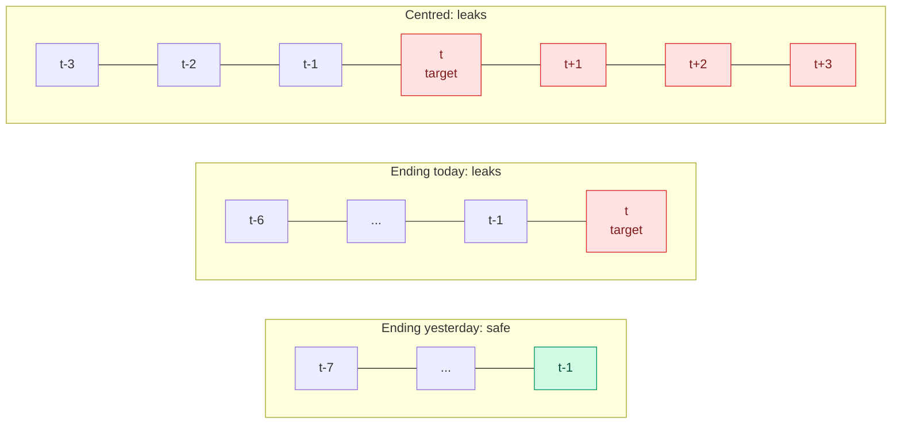

# Feature Crosses, Polynomial Features and Date-Time Features

**Level:** 🟡 Intermediate &nbsp;|&nbsp; **Effort:** Detailed module &nbsp;|&nbsp; **Module:** [06 Feature Engineering](README.md)

---

## 🎯 Learning Objectives

By the end of this topic you will be able to:

- Build a feature cross, and show a linear model going from chance to 94% on a problem it could not otherwise represent
- Count polynomial features before generating them, and show what happens when they meet noise columns
- Encode hour of day, day of week and similar cycles so that 23:00 and 00:00 end up close together
- Extract calendar features from a timestamp
- Build lag and rolling-window features that do not read the future — and see why a backtest does not catch the ones that do

## 📚 Prerequisites

- [Topic 1: Features and the Feature Pipeline](01-features-and-the-feature-pipeline.md)
- [Regression](../05-machine-learning/03-regression.md) — polynomial regression and regularisation
- [Leakage](../03-data-foundations/05-lineage-versioning-privacy-and-leakage.md) — temporal leakage and chronological splits

```bash
pip install -r requirements.txt      # scikit-learn==1.5.2, pandas==2.2.3, numpy==2.1.3
```

---

## 🍰 1. The simple version

**Some signals only exist in combination.** Ice cream sales depend on temperature. Umbrella sales depend on
rain. But "people eat outdoors" depends on temperature *and* no rain, together. A model that can only add up
separate effects — "warm adds 3, dry adds 2" — cannot express "only when both".

A **feature cross** is a new column that combines two others, handing the model the combination directly.
**Polynomial features** do that for every pair — and every square, and every triple — at once.

**Time is the most common source of combinations and cycles.** Hour of day, day of week and season all
repeat, and the most useful time features — "sales over the last seven days" — are also the easiest way to
accidentally hand a model tomorrow's answer.

## 🏠 2. Real-life analogy

> A thermostat that only knows the temperature and a thermostat that only knows the time both do a poor job.
> "Cold, and 7 a.m. on a weekday" means heat the house before people wake; "cold, and 7 a.m. on Sunday" does
> not. The useful rule lives in the combination.

**Where the analogy breaks down:** a person invents the right combination from understanding. Polynomial
features invent *every* combination, most of them meaningless — which is where the trouble starts.

---

## ✖️ 3. Feature crosses

### 📐 Why a linear model needs them

A linear model scores $w_1 x_1 + w_2 x_2 + b$. Each feature's effect is the same whatever the other feature's
value. Add the product:

$$
\text{score} = w_1 x_1 + w_2 x_2 + w_3 \, x_1 x_2 + b
$$

Now the effect of $x_1$ is $w_1 + w_3 x_2$ — it **depends on** $x_2$. That is an interaction, and the model can
learn it with ordinary linear fitting, because the product is just another column.

For categories, a cross is the combination as a new category: `city × device` gives `Lisbon-mobile`,
`Lisbon-desktop` and so on — then encoded as in [Topic 3](03-encoding-categorical-features.md).

### 💻 Code example — the exclusive-or (XOR) pattern

The label is 1 when exactly one of two features is positive — the XOR pattern, with 5% of labels flipped as
noise. No straight line can separate it. **Teaching use only.**

```python
"""A single product term lets a linear model learn what it provably cannot learn alone."""

import numpy as np
from sklearn.ensemble import RandomForestClassifier
from sklearn.linear_model import LogisticRegression
from sklearn.model_selection import cross_val_score

rng = np.random.default_rng(0)
n = 2000
X = rng.uniform(-1, 1, size=(n, 2))
y = ((X[:, 0] > 0) ^ (X[:, 1] > 0)).astype(int)              # 1 when exactly one feature is positive
flipped = rng.random(n) < 0.05
y[flipped] = 1 - y[flipped]                                     # 5% label noise
crossed = np.column_stack([X, X[:, 0] * X[:, 1]])               # the feature cross

print(f"majority-class baseline              {max(y.mean(), 1 - y.mean()):.3f}")
print(f"logistic regression, x1 and x2       {cross_val_score(LogisticRegression(), X, y, cv=5).mean():.3f}")
print(f"logistic regression, plus x1 * x2    {cross_val_score(LogisticRegression(), crossed, y, cv=5).mean():.3f}")
print(f"random forest, x1 and x2             "
      f"{cross_val_score(RandomForestClassifier(random_state=0), X, y, cv=5).mean():.3f}")
```

**Output:**
```
majority-class baseline              0.517
logistic regression, x1 and x2       0.585
logistic regression, plus x1 * x2    0.935
random forest, x1 and x2             0.948
```

**One multiplication took logistic regression from near-chance to 93.5%.** The ceiling is about 95%, because
5% of labels were flipped. The forest found the interaction by itself, from the raw features — trees split on
one feature and then the other, which is an interaction by construction.

**So when do you cross features by hand?**

- For **linear models**, always consider it: they cannot find interactions alone.
- For **tree ensembles**, a cross helps when the interaction is hard to reach by splitting — for example a
  ratio such as price per square metre, which trees approximate with many small steps.
- For **high-cardinality categories**, crossing multiplies cardinality; `city × device × hour` can create
  more combinations than you have rows. Cross only pairs with a reason behind them.

---

## 📈 4. Polynomial features, and the combinatorial explosion

`PolynomialFeatures(degree=d)` adds every product of up to $d$ features. The count is

$$
\binom{n + d}{d} \quad \text{columns, including the constant}
$$

| Input features $n$ | Degree 2 | Degree 3 |
| --- | --- | --- |
| 10 | 66 | 286 |
| 30 | 496 | 5,456 |
| 100 | 5,151 | 176,851 |

**Most of those columns are products of features that have nothing to do with each other.** Here is the XOR
problem again, with 18 irrelevant noise features added — a realistic ratio.

```python
import warnings

import numpy as np
from sklearn.linear_model import LogisticRegression
from sklearn.model_selection import cross_val_score
from sklearn.pipeline import make_pipeline
from sklearn.preprocessing import PolynomialFeatures, StandardScaler

warnings.filterwarnings("ignore")      # convergence chatter at degree 3 - the score says enough

rng = np.random.default_rng(0)
n = 2000
signal = rng.uniform(-1, 1, size=(n, 2))
y = ((signal[:, 0] > 0) ^ (signal[:, 1] > 0)).astype(int)
flipped = rng.random(n) < 0.05
y[flipped] = 1 - y[flipped]
X = np.column_stack([signal, rng.uniform(-1, 1, size=(n, 18))])     # 2 real features, 18 noise

print(f"{'degree':>6}{'columns':>9}{'5-fold accuracy':>17}")
for degree in (1, 2, 3):
    model = make_pipeline(PolynomialFeatures(degree), StandardScaler(), LogisticRegression(max_iter=2000))
    columns = PolynomialFeatures(degree).fit(X).n_output_features_
    print(f"{degree:>6}{columns:>9}{cross_val_score(model, X, y, cv=5).mean():>17.3f}")
```

**Output:**
```
degree  columns  5-fold accuracy
     1       21            0.499
     2      231            0.829
     3     1771            0.678
```

**Degree 2 contains the one column that matters, $x_1 x_2$ — and 229 that do not.** It reached 82.9%, well
short of the 93.5% the single hand-made cross achieved. At degree 3, with 1,771 columns for 1,600 training
rows per fold, the model fits noise and falls to 67.8%.

**The lesson: a feature you chose for a reason beats a thousand generated ones.** When you do use polynomial
features, add regularisation ([Regression](../05-machine-learning/03-regression.md)), generate them only for
features you suspect interact, or use `interaction_only=True` to skip the squares.

---

## 🕐 5. Date and time features

### Extract the parts that carry signal

A raw timestamp is one ever-increasing number. Models need the **parts** that repeat or matter:

| Feature | From `pandas` | Captures |
| --- | --- | --- |
| Hour of day | `ts.dt.hour` | Daily cycle |
| Day of week | `ts.dt.dayofweek` (Monday = 0) | Weekly cycle |
| Weekend flag | `ts.dt.dayofweek >= 5` | Work versus leisure |
| Month, quarter | `ts.dt.month`, `ts.dt.quarter` | Seasonality |
| Days since an event | `(ts - signup).dt.days` | Tenure, recency |
| Holiday flag | Join a holiday calendar | Irregular but predictable spikes |
| Elapsed time | `(ts - ts.min()).dt.days` | Trend — **but a model cannot extrapolate it** |

The last row matters: a tree model trained on days 0–500 treats day 600 like day 500
([Parametric and Instance-Based Models](../05-machine-learning/02-parametric-and-instance-based-models.md)).

### 🔁 Cycles: 23:00 is next to 00:00

Encode the hour as the number 0 to 23 and a model believes 23:00 and 00:00 are as far apart as it gets. Three
better encodings:

| Encoding | Columns | Idea |
| --- | --- | --- |
| **One-hot** | 24 | Each hour free to have its own effect |
| **Sine and cosine** | 2 | Place the hour on a circle: $\sin(2\pi h/24)$, $\cos(2\pi h/24)$ |
| **Periodic spline** | A few | Smooth bumps around the circle — flexible, few columns |

```python
"""Hour of day four ways, for demand with a morning and an evening peak."""

import numpy as np
import pandas as pd
from sklearn.linear_model import Ridge
from sklearn.model_selection import cross_val_score
from sklearn.pipeline import make_pipeline
from sklearn.preprocessing import FunctionTransformer, OneHotEncoder, SplineTransformer

rng = np.random.default_rng(0)
hours = pd.date_range("2026-01-01", periods=24 * 120, freq="h").hour.to_numpy()
demand = (50 + 30 * np.cos(2 * np.pi * (hours - 18) / 24)              # evening peak
          + 10 * np.cos(2 * np.pi * (hours - 6) / 12)                  # smaller morning peak
          + rng.normal(0, 5, len(hours)))


def on_a_circle(h):
    angle = 2 * np.pi * h[:, 0] / 24
    return np.column_stack([np.sin(angle), np.cos(angle)])


encodings = {
    "hour as a number, 1 column": FunctionTransformer(),
    "sine and cosine, 2 columns": FunctionTransformer(on_a_circle),
    "one-hot, 24 columns": OneHotEncoder(),
    "periodic spline, 6 columns": SplineTransformer(n_knots=7, extrapolation="periodic",
                                                    knots=np.linspace(0, 24, 7).reshape(-1, 1)),
}
print(f"{'encoding':<30}{'R2':>7}")
for name, encoding in encodings.items():
    score = cross_val_score(make_pipeline(encoding, Ridge(alpha=1e-3)), hours.reshape(-1, 1), demand, cv=5).mean()
    print(f"{name:<30}{score:>7.3f}")

late, midnight = on_a_circle(np.array([[23]])), on_a_circle(np.array([[0]]))
print(f"\ndistance from 23:00 to 00:00 - as a number: 23.000, on the circle: {np.linalg.norm(late - midnight):.3f}")
```

**Output:**
```
encoding                           R2
hour as a number, 1 column      0.558
sine and cosine, 2 columns      0.858
one-hot, 24 columns             0.952
periodic spline, 6 columns      0.952

distance from 23:00 to 00:00 - as a number: 23.000, on the circle: 0.261
```

**Sine and cosine fixed the midnight problem but not the whole shape.** Two columns describe exactly one
smooth wave per day. This demand has two peaks, so the circle encoding plateaued at 0.858. One-hot, with a
free effect per hour, reached 0.952 — and so did the periodic spline, **with 6 columns instead of 24**.

**Sine and cosine are the common textbook answer, and they are only right when the cycle has a single
peak.** Add the second harmonic ($\sin(4\pi h/24)$, $\cos(4\pi h/24)$), or use a periodic spline, when it does
not. With few rows per hour, one-hot's 24 free effects overfit first.

---

## ⏪ 6. Lag and rolling-window features — and the one character that leaks

For anything that evolves over time, the strongest features are usually **its own recent past**: yesterday's
sales, the average of the last seven days, the count of logins this month. They are also the most common
source of leakage in production models, because **pandas computes a rolling window over whatever rows it is
given, including the row you are trying to predict.**



### 💻 Code example — three rolling features, a chronological backtest

Two years of daily sales with a weekly pattern, a slow trend and persistent shocks. Train on the first 18
months, test on the last 6 — a proper chronological split.

```python
"""Rolling-window features: one argument decides whether you are forecasting or cheating."""

import numpy as np
import pandas as pd
from sklearn.linear_model import Ridge
from sklearn.metrics import mean_absolute_error

rng = np.random.default_rng(0)
days = pd.date_range("2025-01-01", periods=730, freq="D")
weekly = np.array([0, 2, 3, 3, 6, 14, 10])[days.dayofweek]           # Monday .. Sunday
shocks = np.zeros(len(days))
for t in range(1, len(days)):                                        # a shock lingers for a few days
    shocks[t] = 0.5 * shocks[t - 1] + rng.normal(0, 6)
sales = pd.Series(100 + 0.02 * np.arange(len(days)) + weekly + shocks, index=days)

day_of_week = pd.get_dummies(pd.Series(days.dayofweek, index=days), prefix="dow", dtype=float)
rolling_features = {
    "centred 7-day mean": sales.rolling(7, center=True).mean(),
    "7-day mean ending today": sales.rolling(7).mean(),
    "7-day mean ending yesterday": sales.shift(1).rolling(7).mean(),
}
split = days[547]                                                    # first 18 months train, last 6 test

print(f"{'rolling feature':<30}{'train MAE':>10}{'test MAE':>10}")
for name, rolling in rolling_features.items():
    X = pd.concat([day_of_week, rolling.rename("rolling")], axis=1).dropna()
    y = sales[X.index]
    train, test = X.index < split, X.index >= split
    model = Ridge(alpha=1.0).fit(X[train], y[train])
    print(f"{name:<30}{mean_absolute_error(y[train], model.predict(X[train])):>10.2f}"
          f"{mean_absolute_error(y[test], model.predict(X[test])):>10.2f}")

last_week = sales.shift(7)
test_days = days >= split
print(f"{'baseline: same day last week':<30}{'':>10}{mean_absolute_error(sales[test_days], last_week[test_days]):>10.2f}")
```

**Output:**
```
rolling feature                train MAE  test MAE
centred 7-day mean                  4.24      3.67
7-day mean ending today             4.93      4.92
7-day mean ending yesterday         5.53      5.87
baseline: same day last week                  8.16
```

MAE is the mean absolute error, in units of sales.

**The two leaky features "win", and the chronological split did not catch them.** The centred window's test
error is 37% lower than the honest one's. That is not better forecasting — the feature for day $t$ contains
days $t+1$ to $t+3$, and the test set's features were computed from the test period's own actual sales. The
window ending today contains day $t$'s sales, the very value being predicted.

**A backtest only protects you if the features in it are computed exactly as they would be at prediction
time.** Here they were computed from the complete historical series, so every future value was available.
In production, on the morning of day $t$, the centred window cannot be computed at all.

**The honest feature still beat the last-week baseline by a wide margin**, 5.87 against 8.16. Recent history
is genuinely useful — as long as it is actually history.

**How to stay safe:**

- **Shift first, then roll**: `series.shift(1).rolling(k)` for features known at the start of day $t$.
- Match the shift to the real **data latency**: if yesterday's sales arrive at noon today, a morning forecast
  needs `shift(2)`.
- Never use `center=True` for a predictive feature.
- **Test it**: change the future and check that past features do not move —
  [Topic 7](07-leakage-hunting-and-features-in-production.md) turns that into an automatic check.

Time series forecasting as a discipline, with its own models and validation schemes, is
[20 Time Series](../20-time-series/README.md).

---

## 🌍 7. Real-world use

| Domain | Cross or time feature |
| --- | --- |
| Advertising | `user segment × ad category` crosses for click prediction in linear models |
| Energy | Hour-of-day and day-of-week cycles, holiday flags, lagged demand |
| Retail | Rolling 7- and 28-day sales per product, promotion × weekend |
| Fraud | Transactions in the last hour, time since the previous transaction |
| Transport | `origin × destination` crosses, hour cycles, weather × rush hour |

## ⚠️ 8. Common mistakes

| Mistake | Why it happens | Fix |
| --- | --- | --- |
| Expecting a linear model to find interactions | They seem obvious to a person | Add the cross; 0.585 became 0.935 |
| Degree-3 polynomial features on every column | One line of code | 1,771 columns scored below 231; cross deliberately |
| Hour as a plain number | It already is a number | Cyclical encoding, one-hot or periodic spline |
| Assuming sine and cosine fit any cycle | Common advice | They fit one peak; two peaks needed more |
| `rolling(k)` without `shift` | The pandas default includes the current row | `shift(1).rolling(k)`, matched to data latency |
| Trusting a chronological backtest over leaky features | The split looked correct | The features were computed with the future too |

## 🔐 9. Security note

Time features derived from user activity — login hours, locations by time of day, days active — describe a
person's routine, and can reveal work patterns, religious observance or health. Treat them as personal data,
minimise their resolution (hour-of-day, not exact timestamps) where the model allows it, and include them in
access controls and retention policies.

---

## 🎤 10. Interview questions

<details>
<summary><b>Q1: What is a feature cross, and which models need one?</b></summary>

A new feature formed by combining two or more features — a product of numeric features, or the concatenation
of categories. It lets a model express an interaction: an effect of one feature that depends on another.
Linear models need crosses because each feature's effect is otherwise fixed; in the XOR example one product
term took logistic regression from 58.5% to 93.5%. Tree ensembles learn interactions through successive
splits, though crosses such as ratios can still help them. Neural networks learn interactions in their hidden
layers.
</details>

<details>
<summary><b>Q2: Why is hour-of-day as an integer a poor feature, and what are the alternatives?</b></summary>

It places 23:00 and 00:00 at opposite ends of the scale when they are adjacent, and forces a linear model to
treat the effect of time as a straight line. Alternatives are one-hot encoding, which gives each hour its own
effect; sine and cosine of the angle, which put hours on a circle but describe only one smooth peak per cycle;
and periodic splines, which are smooth and flexible with few columns. In the example a two-peak demand
pattern scored 0.558 as an integer, 0.858 with sine and cosine, and 0.952 with one-hot or a periodic spline.
</details>

<details>
<summary><b>Q3 (scenario): Your demand forecast's backtest error is 35% better than last quarter's model, and production error is worse than ever. What happened?</b></summary>

Most likely a feature was computed with information that is not available at prediction time — a rolling
window including the current day or centred on it, an aggregate over the full series, or data that arrives
with a delay the backtest ignored. A chronological split does not catch this if features were computed over
the complete history before splitting. Check each feature's definition against the data available at
forecast time, recompute the backtest features in a replay that only sees data up to each forecast date, and
add an automated test that perturbs future values and asserts past features do not change.
</details>

---

## ✅ Key takeaways

- **Crosses** give a linear model interactions: XOR went from 58.5% to 93.5% with one product.
- **Polynomial features explode** as $\binom{n+d}{d}$; with noise columns, degree 3 scored worse than degree 2.
  One deliberate cross beat 230 generated ones.
- **Encode cycles on a circle** — and use more than one sine and cosine pair, or a periodic spline, when the
  cycle has more than one peak.
- **Shift before you roll.** Leaky rolling features cut test error by 37% in a backtest that could not see
  the leak.

---

## 📚 Official References

- [Categorical data: Feature crosses, Machine Learning Crash Course — Google for Developers](https://developers.google.com/machine-learning/crash-course/categorical-data/feature-crosses) — verified 2026-09-18
- [scikit-learn: Time-related feature engineering, example — scikit-learn developers](https://scikit-learn.org/stable/auto_examples/applications/plot_cyclical_feature_engineering.html) — verified 2026-09-18
- [scikit-learn: Preprocessing data, polynomial features and splines — scikit-learn developers](https://scikit-learn.org/stable/modules/preprocessing.html) — verified 2026-09-18
- [pandas: Windowing operations — pandas developers](https://pandas.pydata.org/docs/user_guide/window.html) — verified 2026-09-18

---

## 🔗 Navigation

[← Topic 3: Encoding Categorical Features](03-encoding-categorical-features.md) &nbsp;|&nbsp;
[🏠 Module Home](README.md) &nbsp;|&nbsp;
[Topic 5: Text, Image and Domain Features →](05-text-image-and-domain-features.md)
